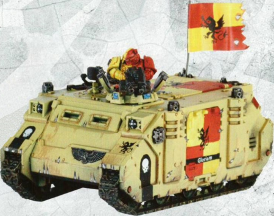

# 1466 荣耀号 Gloriam

精校状态：中文行文已逐段精校，部分术语仍为暂定

分类：载具 / 地面 / 轻型

原文来源：https://www.bilibili.com/opus/1215868304828137494

原作者：帝国神选罐头

原文时间：2026年06月20日 12:30

[返回分类目录](目录.md) · [全书目录](../../目录.md)

<!-- A1466-B0001 -->
**英文原文**

Gloriam is a Rhino attached to tactical squad Maximus of the Howling Griffons Fifth Company.

<!-- /A1466-B0001 -->

<!-- A1466-B0002 -->

原译文

荣耀号是隶属于咆哮狮鹫第五连队马克西姆斯战术小队的犀牛。

**校订译文**

荣耀号是咆哮狮鹫第5连马克西姆斯战术小队配属的一辆犀牛战车。

**校注：** 与较早449篇同车统一采用“荣耀号”，1465原译“辉煌号”作为别名留注。

<!-- /A1466-B0002 -->

<!-- A1466-B0003 图片 -->

<!-- A1466-B0004 -->

原译文

Howling Griffons Rhino Gloriam 咆哮狮鹫犀牛荣耀号

**校订译文**

Howling Griffons Rhino Gloriam 咆哮狮鹫犀牛战车荣耀号

<!-- /A1466-B0004 -->

本篇核心术语与暂定项

以下列出本篇出现的英文原形及核心术语表用词。同形词可能指不同对象，具体词义以本篇正文和校注为准；单复数、别名和仅见于图注的名称可能尚未列入。完整候选见[术语表](../../术语表/双语术语候选.csv)。

| 英文 | 采用中文 | 状态 |
| --- | --- | --- |
| Rhino | 犀牛战车 | 官方已核对 |
| Tactical Squad | 战术小队 | 官方已核对 |
| Howling Griffons | 咆哮狮鹫 | 暂定·官方待核 |
| Gloriam | 荣耀号 | 暂定·官方待核 |

