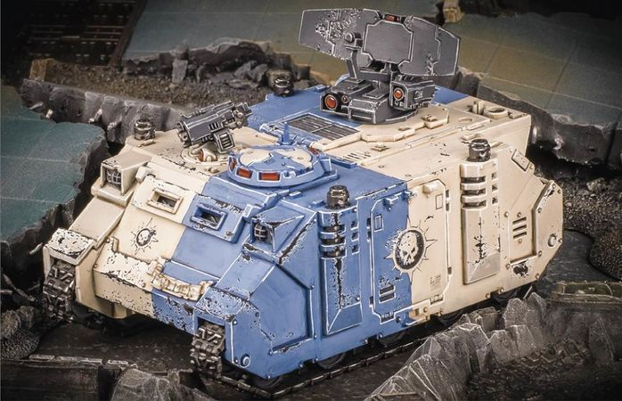

# 1467 闪电号 Fulmen

精校状态：中文行文已逐段精校，部分术语仍为暂定

分类：载具 / 地面 / 轻型

原文来源：https://www.bilibili.com/opus/1216223936690257929

原作者：帝国神选罐头

原文时间：2026年06月21日 11:30

[返回分类目录](目录.md) · [全书目录](../../目录.md)

<!-- A1467-B0001 -->
**英文原文**

Fulmen is a Novamarines Rhino and it is part of Strike Force Nerva. This Rhino's name reflects the 'lightning' it brings on the battlefield, be it a crushing orbital bombardment or the deployment of reserve forces.

<!-- /A1467-B0001 -->

<!-- A1467-B0002 -->

原译文

闪电号是一辆新星战士犀牛，它是涅尔瓦打击部队的一部分。这只犀牛的名字反映了它在战场上带来的“闪电”，无论是毁灭性的轨道轰炸还是后备部队的部署。

**校订译文**

闪电号是新星战士涅尔瓦打击部队的一辆犀牛战车。其名体现了它为战场带来的“闪电”：既能引来摧毁性的轨道轰炸，也能迅速调入预备部队。

<!-- /A1467-B0002 -->

<!-- A1467-B0003 图片 -->

<!-- A1467-B0004 -->

原译文

Fulmen 闪电号

**校订译文**

Fulmen 闪电号

<!-- /A1467-B0004 -->

<!-- A1467-B0005 -->
## Trivia 琐事

<!-- /A1467-B0005 -->

<!-- A1467-B0006 -->
**英文原文**

Fulmen was created by the Games Workshop employee Ulrich Ryssel and was featured in White Dwarf 131 (2016).

<!-- /A1467-B0006 -->

<!-- A1467-B0007 -->

原译文

闪电号由GW员工乌尔里希·赖塞尔创作，并在《白矮人131期》（2016）中占重要地位。

**校订译文**

闪电号由 Games Workshop 员工乌尔里希·赖塞尔创作，并刊载于2016年的《白矮人》第131期。

<!-- /A1467-B0007 -->

本篇核心术语与暂定项

以下列出本篇出现的英文原形及核心术语表用词。同形词可能指不同对象，具体词义以本篇正文和校注为准；单复数、别名和仅见于图注的名称可能尚未列入。完整候选见[术语表](../../术语表/双语术语候选.csv)。

| 英文 | 采用中文 | 状态 |
| --- | --- | --- |
| Rhino | 犀牛战车 | 官方已核对 |
| Strike Force Nerva | 涅尔瓦打击部队 | 暂定·官方待核 |
| Novamarines | 新星战士 | 暂定·官方待核 |
| Fulmen | 闪电号 | 暂定·官方待核 |
| Ulrich Ryssel | 乌尔里希·赖塞尔 | 暂定·官方待核 |
| Games Workshop | Games Workshop | 暂定·官方待核 |

