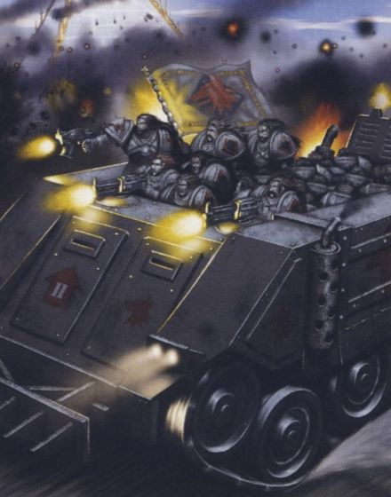

# 1470 推进犀牛 Rhino Advancer

精校状态：中文行文已逐段精校，部分术语仍为暂定

分类：载具 / 地面 / 轻型

原文来源：https://www.bilibili.com/opus/1037408440790548489

原作者：帝国神选罐头

原文时间：2025年02月24日 14:34

[返回分类目录](目录.md) · [全书目录](../../目录.md)

<!-- A1470-B0001 -->
**英文原文**

The Rhino Advancer was a variant of the Rhino during the Great Crusade and Horus Heresy.

<!-- /A1470-B0001 -->

<!-- A1470-B0002 -->

原译文

犀牛装甲推进者是大远征和荷鲁斯叛乱时期犀牛装甲车的变体。

**校订译文**

推进犀牛是大远征和荷鲁斯之乱时期的一种犀牛战车变体。

<!-- /A1470-B0002 -->

<!-- A1470-B0003 图片 -->

<!-- A1470-B0004 -->

原译文

Space Wolves Rhino Advancer during the Horus Heresy 荷鲁斯叛乱期间的太空野狼犀牛装甲推进者

**校订译文**

Space Wolves Rhino Advancer during the Horus Heresy 荷鲁斯之乱期间的太空野狼推进犀牛

<!-- /A1470-B0004 -->

<!-- A1470-B0005 -->
**英文原文**

The Advancer had a longer body than the standard Rhino and an open roof, allowing for more troops to be carried.

<!-- /A1470-B0005 -->

<!-- A1470-B0006 -->

原译文

推进者的车身比标准犀牛装甲车更长，车顶敞开，可以携带更多的部队。

**校订译文**

推进犀牛车身比标准型更长，采用敞顶设计，因此能搭载更多士兵。

<!-- /A1470-B0006 -->

本篇核心术语与暂定项

以下列出本篇出现的英文原形及核心术语表用词。同形词可能指不同对象，具体词义以本篇正文和校注为准；单复数、别名和仅见于图注的名称可能尚未列入。完整候选见[术语表](../../术语表/双语术语候选.csv)。

| 英文 | 采用中文 | 状态 |
| --- | --- | --- |
| Horus Heresy | 荷鲁斯之乱 | 官方已核对 |
| Great Crusade | 大远征 | 暂定·官方待核 |
| Horus | 荷鲁斯 | 暂定·官方待核 |
| Rhino | 犀牛战车 | 官方已核对 |
| Rhino Advancer | 推进犀牛 | 暂定·官方待核 |

