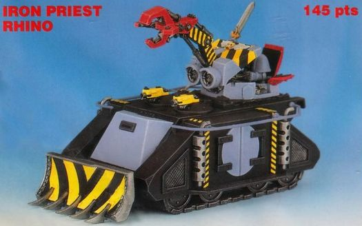

# 1473 科技战士犀牛 Techmarine Rhino

精校状态：中文行文已逐段精校，部分术语仍为暂定

分类：载具 / 地面 / 轻型

原文来源：https://www.bilibili.com/opus/1214005152280739876

原作者：帝国神选罐头

原文时间：2026年06月15日 12:00

[返回分类目录](目录.md) · [全书目录](../../目录.md)

原篇名：技术军士犀牛 Techmarine Rhino

<!-- A1473-B0001 -->
**英文原文**

Techmarine Rhinos are Rhinos that have been modified to serve the needs of a Space Marine Chapter's Techmarines on the battlefield.

<!-- /A1473-B0001 -->

<!-- A1473-B0002 -->

原译文

技术军士犀牛是经过改装的犀牛，以满足星际战士战团的技术军士在战场上的需求。

**校订译文**

科技战士犀牛是为满足星际战士战团科技战士的战场需求而改装的犀牛战车。

<!-- /A1473-B0002 -->

<!-- A1473-B0003 图片 -->

<!-- A1473-B0004 -->

原译文

Space Wolves Techmarine/Iron Priest Rhino 太空野狼技术军士/钢铁牧师犀牛

**校订译文**

Space Wolves Techmarine/Iron Priest Rhino 太空野狼科技战士／钢铁牧师犀牛

<!-- /A1473-B0004 -->

<!-- A1473-B0005 -->
## Overview 概述

<!-- /A1473-B0005 -->

<!-- A1473-B0006 -->
**英文原文**

It is commanded by a Techmarine and driven by one of his Chapter's Battle Brothers. The Techmarine Rhino has a carrying capacity of either five Space Marines or five Servitors to assist the Techmarine. The Rhino can also tow a single support weapon behind it. The Space Wolves are among the Chapters that make use of Techmarine Rhinos, but they are known as Iron Priest Rhinos instead.

<!-- /A1473-B0006 -->

<!-- A1473-B0007 -->

原译文

它由一名技术军士指挥，并由他战团的一名战斗兄弟驾驶。技术军士犀牛的运载能力为五名星际战士或五名机仆，以协助技术军士。犀牛还可以在它后面拖着一个支援武器。太空野狼是使用技术军士犀牛的战团之一，但它们被称为钢铁牧师犀牛。

**校订译文**

这种车辆由一名科技战士指挥，同战团的一名战斗兄弟驾驶。它可搭载五名星际战士或五名机仆，协助科技战士工作，还可在车后牵引一门支援武器。太空野狼也使用这一车型，但称之为钢铁牧师犀牛。

<!-- /A1473-B0007 -->

<!-- A1473-B0008 -->
## Modifications 改装

<!-- /A1473-B0008 -->

<!-- A1473-B0009 -->
**英文原文**

The Techmarine Rhino's modifications are usually made by a Techmarine in the Chapter's forge workshop and they can vary greatly between Rhinos. The changes reflect the personal preferences and skills of the Techmarine, but popular designs are usually circulated through most of the Space Marine Chapters. Because of this, some Techmarine Rhino modifications have become common.

<!-- /A1473-B0009 -->

<!-- A1473-B0010 -->

原译文

技术军士犀牛的改装通常由战团铸造工坊的技术军士进行，并且犀牛之间的改装可能会有很大差异。这些变化反映了技术军士的个人偏好和技能，但流行的设计通常在大多数星际战士战团中传播。因此，技术军士犀牛的一些改装已经变得普遍。

**校订译文**

改装通常由科技战士在战团锻造工坊内完成，不同车辆之间差异可能很大，反映了各位科技战士的偏好和专长。广受欢迎的设计则会在大多数星际战士战团间流传，因此一些改装方案已相当普遍。

<!-- /A1473-B0010 -->

<!-- A1473-B0011 -->
**英文原文**

One such variant includes a turret protected by a large thick armoured gun shield at the front and equipped with a Magna-beam Searchlight. Despite its name, Magna is an offensive weapon that allows the Techmarine to blind his enemies with short-bursts of bright light. By doing so, he can then use the Techmarine Rhino to recover stranded or damaged vehicles. The variant's turret contains a huge servo-powered Crusher Claw as well, which is used to help the Techmarine make major repairs to Space Marine equipment. However should he need to defend himself, the Techmarine can use the Crusher Claw as a deadly close quarters weapon. Its strength allows the crane to crush a man in half and even tear off whole sections from tanks and Dreadnoughts. This variant also includes a Bulldozer Blade and its cupolas can be armed with Twin-Linked Bolters, or Auto Launchers with either Frag or Blind Grenades.

<!-- /A1473-B0011 -->

<!-- A1473-B0012 -->

原译文

其中一种变体包括一个炮塔，其前部由一个大型厚装甲炮盾保护，并配备了一个大光束探照灯。尽管名字这样叫，但它是一种进攻性武器，可以让技术军士用短时间的强光致盲敌人。通过这样做，他可以使用技术军士犀牛来修复故障或损坏的载具。该变体的炮塔还包含一个巨大的伺服驱动的粉碎爪，用于帮助技术军士对星际战士设备进行大修。然而，如果他需要自卫，技术军士可以使用粉碎爪作为致命的近距离武器。它的力量使起吊臂能够将一个人压成两半，甚至从坦克和无畏上撕下整个部分。该变体还包括一个推土机铲刀，其圆顶可以配备双联爆矢枪，或配备破片或致盲榴弹的自动发射器。

**校订译文**

其中一种变体装有炮塔，前方由大型厚装甲炮盾保护，并配备巨束探照灯。虽然名为探照灯，它却是进攻性武器：科技战士能以短促强光致盲敌人，掩护犀牛回收搁浅或受损车辆。炮塔上另有巨大的伺服驱动粉碎爪，协助科技战士对星际战士装备进行大修。需要自卫时，它也能充当致命近战武器；机械臂力量之大，足以将人夹成两截，甚至从坦克或无畏机甲上扯下整块结构。这种变体还装有推土铲，车顶指挥塔可配备双联爆矢枪，或能发射破片、致盲榴弹的自动发射器。

<!-- /A1473-B0012 -->

<!-- A1473-B0013 -->
## Trivia 琐事

<!-- /A1473-B0013 -->

<!-- A1473-B0014 -->
**英文原文**

The Techmarine Rhino was created by the Games Workshop employee Ian Pickstock. It was named as the Tech-Marine Rhino and appeared in The Citadel Journal 7.

<!-- /A1473-B0014 -->

<!-- A1473-B0015 -->

原译文

技术军士由GW员工伊恩·皮克斯托克创建。它被命名为技术战士犀牛，并出现在城堡杂志第7期上。

**校订译文**

科技战士犀牛由 Games Workshop 员工伊恩·皮克斯托克创作，当时以“Tech-Marine Rhino”为名，登载于《Citadel Journal》第7期。

**校注：** 原文创作对象是科技战士犀牛，原译漏掉车型；保留杂志英文刊名便于核查。

<!-- /A1473-B0015 -->

本篇核心术语与暂定项

以下列出本篇出现的英文原形及核心术语表用词。同形词可能指不同对象，具体词义以本篇正文和校注为准；单复数、别名和仅见于图注的名称可能尚未列入。完整候选见[术语表](../../术语表/双语术语候选.csv)。

| 英文 | 采用中文 | 状态 |
| --- | --- | --- |
| Space Marines | 星际战士 | 官方已核对 |
| Space Wolves | 太空野狼 | 官方已核对 |
| Equipment | 装备 | 编辑用语已统一 |
| Techmarine | 科技战士 | 官方已核对 |
| Tech | 技术语 | 暂定·官方待核 |
| Iron Priest | 钢铁牧师 | 官方已核对 |
| Rhino | 犀牛战车 | 官方已核对 |
| Space Marine | 星际战士 | 暂定·官方待核 |
| Chapter | 战团 | 暂定·官方待核 |
| Rhinos | 犀牛 | 暂定·官方待核 |
| Gun | 甘 | 暂定·官方待核 |
| claw | 利爪分队 | 暂定·官方待核 |
| Ian Pickstock | 伊恩·皮克斯托克 | 暂定·官方待核 |
| Techmarine Rhino | 科技战士犀牛 | 暂定·官方待核 |
| Magna-beam Searchlight | 巨束探照灯 | 暂定·官方待核 |
| Crusher Claw | 粉碎爪 | 暂定·官方待核 |
| Games Workshop | Games Workshop | 暂定·官方待核 |

