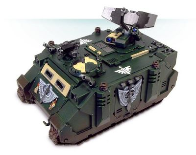
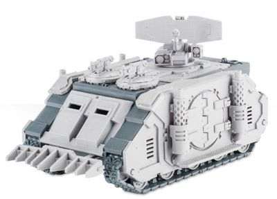

# 1474 达摩克利斯指挥犀牛 Damocles Command Rhino

精校状态：中文行文已逐段精校，部分术语仍为暂定

分类：载具 / 地面 / 轻型

原文来源：https://www.bilibili.com/opus/1043315150453473287

原作者：帝国神选罐头

原文时间：2025年03月12日 12:35

[返回分类目录](目录.md) · [全书目录](../../目录.md)

原篇名：达摩克里斯指挥犀牛 Damocles Command Rhino

<!-- A1474-B0001 -->
**英文原文**

The Damocles Command Rhino is a Rhino-based command vehicle used by the Space Marines for large-scale operations or campaigns.

<!-- /A1474-B0001 -->

<!-- A1474-B0002 -->

原译文

达摩克利斯犀牛指挥车是一种基于犀牛的指挥车，供星际战士用于大规模行动或战役。

**校订译文**

达摩克利斯指挥犀牛以犀牛底盘为基础，供星际战士在大规模行动或战役中执行指挥任务。

<!-- /A1474-B0002 -->

<!-- A1474-B0003 图片 -->

<!-- A1474-B0004 -->

原译文

Dark Angels Damocles 黑暗天使达摩克利斯

**校订译文**

Dark Angels Damocles 黑暗天使达摩克利斯

<!-- /A1474-B0004 -->

<!-- A1474-B0005 -->
## Description 描述

<!-- /A1474-B0005 -->

<!-- A1474-B0006 -->
**英文原文**

The Damocles is an example of the kind of advanced technology available to the current Space Marines. It is used only in operations where command and control of significant Space Marine formations is required, such as a battlegroup consisting of a Battle Company plus support elements. The Damocles provides a communications link between the Force Commander, his battlegroup and any air or orbital assets operating in the area. For this reason, the Damocles is rarely committed to front-line actions, and typically hidden away to prevent enemy interference.

<!-- /A1474-B0006 -->

<!-- A1474-B0007 -->

原译文

达摩克利斯是当前太星际战士可用的先进技术的一个例子。它仅用于需要指挥和控制重要星际战士编队的作战，例如由战斗连和支援部队组成的作战小组。达摩克利斯在部队指挥官、其作战小组和在该地区作战的任何空中或轨道资产之间提供通信连接。因此，达摩克利斯很少致力于前线行动，通常会隐藏起来以防止敌人的干扰。

**校订译文**

达摩克利斯体现了当代星际战士所掌握的先进技术。只有需要协调大规模星际战士编队时才会部署，例如指挥一个战斗连及其支援部队组成的战斗群。它将部队指挥官、所辖战斗群，以及区域内的空中与轨道力量连接成通讯网络。因此，达摩克利斯很少直接投入前线，通常隐蔽部署，以免遭敌方干扰。

<!-- /A1474-B0007 -->

<!-- A1474-B0008 -->
**英文原文**

In addition to the driver, the Damocles is crewed by a communications officer and a tactical officer. These Space Marines will have undergone additional training with the Chapter's Techmarines in order to operate this sophisticated technology. There is also room for the Force Commander next to the driver, allowing him the ability to keep himself updated on the developing situation.

<!-- /A1474-B0008 -->

<!-- A1474-B0009 -->

原译文

除了驾驶员，达摩克利斯还由一名通信官和一名战术官驾驶。这些星际战士将接受该战团技术军士的额外训练，以操作这项复杂的技术。驾驶员旁边还有部队指挥官的空间，使他能够随时了解事态的发展。

**校订译文**

除驾驶员外，达摩克利斯还配有一名通讯官和一名战术官。这些星际战士须接受战团科技战士的额外训练，才能操作精密设备。驾驶员旁另有供部队指挥官乘坐的位置，便于他随时掌握战况。

<!-- /A1474-B0009 -->

<!-- A1474-B0010 -->
### Equipment 装备

原题：Equipment 设备

<!-- /A1474-B0010 -->

<!-- A1474-B0011 -->
**英文原文**

The command vehicle is packed with some of the most advanced technology available to the Imperium at large. It mounts secure, multi-band communications gear that acts as a communications hub for the battlegroup, with signal boosters to allow ground-to-orbital comm-links, as well as the ability to communicate with other Imperial command units operating in the area. It can also monitor, intercept and decrypt enemy communications, which in addition to a multi-spectral auspex allows it to track enemy movements. Link-up with an orbital relay allows the Damocles to track individual squads and vehicles for an entire Chapter, as well as bio-status readouts provided directly by the Marines' power armour. Finally, the Damocles includes a teleport homer, which produces a strong signal to allow for much safer and accurate teleportations.

<!-- /A1474-B0011 -->

<!-- A1474-B0012 -->

原译文

指挥车配备了整个帝国可用的一些最先进的技术。它安装了安全的多频带通信设备，作为战斗群的通信枢纽，并配有信号增强器，允许地面到轨道的通信连接，以及与在该地区作战的其他帝国指挥单位进行通信的能力。它还可以监视、拦截和解密敌人的通信，除了多光谱占卜仪外，它还可以跟踪敌人的行动。与轨道中继的连接使达摩克利斯能够跟踪整个战团的单个小队和车辆，以及星际战士动力盔甲直接提供的生物状态读数。最后，达摩克利斯还包括一个传送信标，它会产生强烈的信号，从而实现更安全、更准确的传送。

**校订译文**

这种指挥车集成了帝国能够普遍获得的部分最先进技术。安全的多频段通讯设备使其成为战斗群的通讯枢纽；信号增强器既能维持地面与轨道之间的联络，也能联系在同一区域行动的其他帝国指挥单位。它可监听、截获并破译敌军通讯，配合多光谱探测仪追踪敌方动向。通过轨道中继链路，达摩克利斯能够追踪整个战团的各支小队与每辆载具，同时接收星际战士动力甲直接传回的生命状态数据。车上还装有传送定位信标，以强烈信号提高传送的安全性和准确度。

<!-- /A1474-B0012 -->

<!-- A1474-B0013 图片 -->

<!-- A1474-B0014 -->

原译文

Forge World Damocles Command Rhino 铸造世界达摩克利斯犀牛指挥车

**校订译文**

Forge World Damocles Command Rhino Forge World版达摩克利斯指挥犀牛

**校注：** 保留图注中的 Forge World 品牌名，以免误解为车型出自名叫达摩克利斯的铸造世界。

<!-- /A1474-B0014 -->

<!-- A1474-B0015 -->
**英文原文**

The Damocles can be further upgraded with Dozer Blades, Extra Armour, Hunter-killer Missile, Pintle-mounted Storm Bolter, Searchlight and Smoke Launchers.

<!-- /A1474-B0015 -->

<!-- A1474-B0016 -->

原译文

达摩克利斯可以通过推土机铲刀、额外装甲、猎杀飞弹、钉装风暴爆矢枪、探照灯和烟雾发射器进行进一步升级。

**校订译文**

达摩克利斯还可加装推土铲、附加装甲、猎杀导弹、枢轴枪架风暴爆矢枪、探照灯和烟雾发射器。

<!-- /A1474-B0016 -->

<!-- A1474-B0017 -->
## Technical Information 技术资料

原题：Technical Information 技术信息

<!-- /A1474-B0017 -->

<!-- A1474-B0018 -->
**英文原文**

Vehicle Name:Damocles Command Vehicle

<!-- /A1474-B0018 -->

<!-- A1474-B0019 -->

原译文

载具名称：达摩克里斯指挥车

**校订译文**

载具名称：达摩克利斯指挥车

<!-- /A1474-B0019 -->

<!-- A1474-B0020 -->
**英文原文**

Forge World of Origin:Macragge

<!-- /A1474-B0020 -->

<!-- A1474-B0021 -->

原译文

起源铸造世界：马库拉格

**校订译文**

起源铸造世界：马库拉格

**校注：** 马库拉格位于源表“起源铸造世界”栏，保留数据，不据表头将其分类为铸造世界。

<!-- /A1474-B0021 -->

<!-- A1474-B0022 -->
**英文原文**

Known Patterns:I-IX

<!-- /A1474-B0022 -->

<!-- A1474-B0023 -->

原译文

已知型号：I - IX

**校订译文**

已知型号：I - IX

<!-- /A1474-B0023 -->

<!-- A1474-B0024 -->
**英文原文**

Crew:Driver, 2 x Controllers

<!-- /A1474-B0024 -->

<!-- A1474-B0025 -->

原译文

乘员：驾驶员，2名管制员

**校订译文**

乘员：驾驶员，2名管制员

<!-- /A1474-B0025 -->

<!-- A1474-B0026 -->
**英文原文**

Powerplant:Quad MkII Adaptable Thermic Combustor Reactor

<!-- /A1474-B0026 -->

<!-- A1474-B0027 -->

原译文

动力装置：阔德MkII适应性热燃烧反应堆

**校订译文**

动力装置：4台 MkII 自适应热燃烧反应堆

**校注：** Quad 表示四组/四台，原译“阔德”误作专名。

<!-- /A1474-B0027 -->

<!-- A1474-B0028 -->
**英文原文**

Weight:30.0 tonnes

<!-- /A1474-B0028 -->

<!-- A1474-B0029 -->

原译文

重量：30.0吨

**校订译文**

重量：30.0吨

<!-- /A1474-B0029 -->

<!-- A1474-B0030 -->
**英文原文**

Length:6.6m

<!-- /A1474-B0030 -->

<!-- A1474-B0031 -->

原译文

长度：6.6米

**校订译文**

长度：6.6米

<!-- /A1474-B0031 -->

<!-- A1474-B0032 -->
**英文原文**

Width:4.5m

<!-- /A1474-B0032 -->

<!-- A1474-B0033 -->

原译文

宽度：4.5米

**校订译文**

宽度：4.5米

<!-- /A1474-B0033 -->

<!-- A1474-B0034 -->
**英文原文**

Height:5.1m

<!-- /A1474-B0034 -->

<!-- A1474-B0035 -->

原译文

高度：5.1米

**校订译文**

高度：5.1米

<!-- /A1474-B0035 -->

<!-- A1474-B0036 -->
**英文原文**

Ground Clearance:0.44m

<!-- /A1474-B0036 -->

<!-- A1474-B0037 -->

原译文

离地间隙：0.44m

**校订译文**

离地间隙：0.44米

<!-- /A1474-B0037 -->

<!-- A1474-B0038 -->
**英文原文**

Fording Depth:{{{Fording Depth}}}

<!-- /A1474-B0038 -->

<!-- A1474-B0039 -->

原译文

涉水深度：｛｛｛涉水深度｝｝

**校订译文**

涉水深度：未提供

**校注：** 英文残留未展开模板 {{{Fording Depth}}}，并无数值；中文标未提供，英文原样留存。

<!-- /A1474-B0039 -->

<!-- A1474-B0040 -->
**英文原文**

Max Speed - on road70kph

<!-- /A1474-B0040 -->

<!-- A1474-B0041 -->

原译文

最大速度-公路上70公里/小时

**校订译文**

最大公路速度：70公里/小时

<!-- /A1474-B0041 -->

<!-- A1474-B0042 -->
**英文原文**

Max Speed - off road:55kph

<!-- /A1474-B0042 -->

<!-- A1474-B0043 -->

原译文

最大速度-越野：55公里/小时

**校订译文**

最大越野速度：55公里/小时

<!-- /A1474-B0043 -->

<!-- A1474-B0044 -->
**英文原文**

Transport Capacity:N/A

<!-- /A1474-B0044 -->

<!-- A1474-B0045 -->

原译文

运输能力：无

**校订译文**

载员能力：未提供（N/A）

<!-- /A1474-B0045 -->

<!-- A1474-B0046 -->
**英文原文**

Access Points:N/A

<!-- /A1474-B0046 -->

<!-- A1474-B0047 -->

原译文

入口：无

**校订译文**

出入口：未提供（N/A）

<!-- /A1474-B0047 -->

<!-- A1474-B0048 -->
**英文原文**

Main Armament:N/A

<!-- /A1474-B0048 -->

<!-- A1474-B0049 -->

原译文

主武器：无

**校订译文**

主武器：无

<!-- /A1474-B0049 -->

<!-- A1474-B0050 -->
**英文原文**

Secondary Armament:N/A

<!-- /A1474-B0050 -->

<!-- A1474-B0051 -->

原译文

次要武器：无

**校订译文**

次要武器：无

<!-- /A1474-B0051 -->

<!-- A1474-B0052 -->
**英文原文**

Traverse:N/A

<!-- /A1474-B0052 -->

<!-- A1474-B0053 -->

原译文

跨越：无

**校订译文**

水平射界：不适用

<!-- /A1474-B0053 -->

<!-- A1474-B0054 -->
**英文原文**

Elevation:N/A

<!-- /A1474-B0054 -->

<!-- A1474-B0055 -->

原译文

越高：无

**校订译文**

俯仰角：不适用

<!-- /A1474-B0055 -->

<!-- A1474-B0056 -->
**英文原文**

Main Ammunition:N/A

<!-- /A1474-B0056 -->

<!-- A1474-B0057 -->

原译文

主要弹药：无

**校订译文**

主武器载弹量：不适用

<!-- /A1474-B0057 -->

<!-- A1474-B0058 -->
### Armour 装甲

<!-- /A1474-B0058 -->

<!-- A1474-B0059 -->
**英文原文**

Superstructure:60mm

<!-- /A1474-B0059 -->

<!-- A1474-B0060 -->

原译文

上部结构：60毫米

**校订译文**

上部结构：60毫米

<!-- /A1474-B0060 -->

<!-- A1474-B0061 -->
**英文原文**

Hull:60mm

<!-- /A1474-B0061 -->

<!-- A1474-B0062 -->

原译文

车体：60毫米

**校订译文**

车体：60毫米

<!-- /A1474-B0062 -->

<!-- A1474-B0063 -->
**英文原文**

Gun Mantlet:N/A

<!-- /A1474-B0063 -->

<!-- A1474-B0064 -->

原译文

炮盾：无

**校订译文**

炮盾：无

<!-- /A1474-B0064 -->

<!-- A1474-B0065 -->
**英文原文**

Vehicle Designation:0120-766-0765-RH935

<!-- /A1474-B0065 -->

<!-- A1474-B0066 -->

原译文

载具编号：0120-766-0765-RH935

**校订译文**

载具编号：0120-766-0765-RH935

<!-- /A1474-B0066 -->

<!-- A1474-B0067 -->
**英文原文**

Firing Ports:N/A

<!-- /A1474-B0067 -->

<!-- A1474-B0068 -->

原译文

开火：无

**校订译文**

射击孔：未提供（N/A）

<!-- /A1474-B0068 -->

<!-- A1474-B0069 -->
**英文原文**

Turret:N/A

<!-- /A1474-B0069 -->

<!-- A1474-B0070 -->

原译文

炮塔：无

**校订译文**

炮塔：无

<!-- /A1474-B0070 -->

<!-- A1474-B0071 -->
## Known Named Damocles Command Rhino 著名达摩克利斯指挥犀牛

原题：Known Named Damocles Command Rhino 著名达摩克利斯犀牛指挥车

<!-- /A1474-B0071 -->

<!-- A1474-B0072 -->
**英文原文**

Calvus - of the Silver Skulls. Attached to 7th Company. Beta-Garmon IV Expeditionary Force

<!-- /A1474-B0072 -->

<!-- A1474-B0073 -->

原译文

卡尔弗斯 - 银色颅骨。附属于第七连。贝塔·加蒙四号远征军

**校订译文**

卡尔弗斯号——银色颅骨所属，配属第7连，隶属贝塔·伽蒙四号远征军。

<!-- /A1474-B0073 -->

本篇核心术语与暂定项

以下列出本篇出现的英文原形及核心术语表用词。同形词可能指不同对象，具体词义以本篇正文和校注为准；单复数、别名和仅见于图注的名称可能尚未列入。完整候选见[术语表](../../术语表/双语术语候选.csv)。

| 英文 | 采用中文 | 状态 |
| --- | --- | --- |
| Space Marines | 星际战士 | 官方已核对 |
| Imperium | 帝国 | 暂定·简称 |
| Teleport Homer | 传送信标 | 暂定·官方待核 |
| Forge World | 铸造世界 | 暂定·官方待核 |
| Hunter-Killer | 猎杀者 | 暂定·官方待核 |
| Beta-Garmon IV | 贝塔-伽蒙四号 | 暂定·官方待核 |
| Macragge | 马库拉格 | 暂定·官方待核 |
| Rhino | 犀牛战车 | 官方已核对 |
| Silver Skulls | 银色颅骨 | 暂定·官方待核 |
| Power Armour | 动力盔甲 | 暂定·官方待核 |
| Space Marine | 星际战士 | 暂定·官方待核 |
| Chapter | 战团 | 暂定·官方待核 |
| Monitor | 监视者 | 暂定·官方待核 |
| Gun | 甘 | 暂定·官方待核 |
| Beta | 贝塔号 | 暂定·官方待核 |
| Hunter-killer missile | 猎杀导弹 | 官方已核对 |
| Bolter | 爆矢枪 | 暂定·官方待核 |
| Storm bolter | 风暴爆矢枪 | 官方已核对 |
| Auspex | 鸟卜仪 | 暂定·官方待核 |
| Damocles Command Rhino | 达摩克利斯指挥犀牛 | 暂定·官方待核 |
| Extra Armour | 额外装甲 | 暂定·官方待核 |

