# 1475 豪猪战车 Razorback

精校状态：中文行文已逐段精校，部分术语仍为暂定

分类：载具 / 地面 / 轻型

原文来源：https://www.bilibili.com/opus/1037408290487664642

原作者：帝国神选罐头

原文时间：编辑于 2026年06月08日 10:03

[返回分类目录](目录.md) · [全书目录](../../目录.md)

<!-- A1475-B0001 -->
**英文原文**

The Razorback is a tracked, armoured vehicle used by Space Marine Chapters. Its design is based on the Rhino chassis and as such is quite easy to manufacture, sharing many of its design features. It is sometimes favoured over the Rhino because of its superior firepower, although this comes at the cost of less transport space. Because the rediscovery of the design occurred after the Horus Heresy, the Traitor Legions rarely field the Razorback.

<!-- /A1475-B0001 -->

<!-- A1475-B0002 -->

原译文

豪猪是星际战士使用的履带式装甲车。它的设计基于犀牛底盘，因此很容易制造，具有许多设计特征。它有时比犀牛更受欢迎，因为它的火力更强，尽管这是以更少的运输空间为代价的。由于该设计的重新发现发生在荷鲁斯叛乱之后，叛徒军团很少使用豪猪战车。

**校订译文**

豪猪战车是星际战士战团使用的一种履带式装甲载具，以犀牛底盘为基础，共用许多设计，因此较易制造。它牺牲部分载员空间，换取更强火力，一些战团也因此更青睐豪猪。由于其设计是在荷鲁斯之乱后重新发现的，叛徒军团很少部署这一车型。

<!-- /A1475-B0002 -->

<!-- A1475-B0003 图片 -->
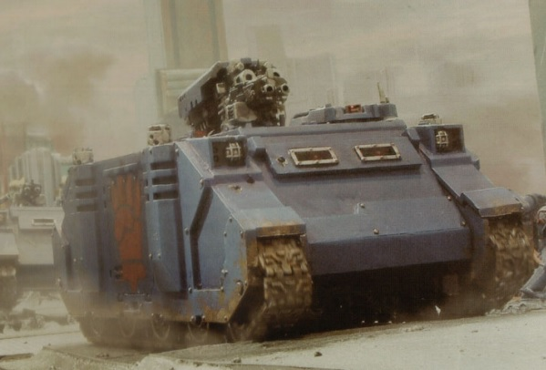

<!-- A1475-B0004 -->

原译文

Razorback 豪猪战车

**校订译文**

Razorback 豪猪战车

<!-- /A1475-B0004 -->

<!-- A1475-B0005 -->
## History 历史

<!-- /A1475-B0005 -->

<!-- A1475-B0006 -->
**英文原文**

A variant of the Predator Battle Tank designed to carry troops is believed to be the first precursor to the modern Razorback. However, the STC template for the Razorback was first rediscovered in M36 by Chief Artisan Tilvius while he was exploring the Southern Rim of the galaxy. When he returned to Mars, the Adeptus Mechanicus recognized it from earlier records and commenced work on its production. Within two hundred years the first Razorbacks were field-tested and began seeing service to the Adeptus Astartes soon after.

<!-- /A1475-B0006 -->

<!-- A1475-B0007 -->

原译文

一种设计用于携带部队的掠食者战斗坦克的变体被认为是现代豪猪战车的第一个前身。然而，豪猪战车的STC模板最初是由首席锻造士提尔维乌斯在M36探索银河系南端时重新发现的。当他回到火星时，机械神教从早期的记录中认出了它，并开始制作它。在两百年内，第一批豪猪经过了实地测试，不久后开始为阿斯塔特修会服务。

**校订译文**

一种能够搭载步兵的掠食者战斗坦克变体，被认为是现代豪猪的最早前身。第36千年，首席工匠蒂尔维乌斯在探索银河南缘时重新发现了豪猪的 STC 模板。他返回火星后，机械修会从早期记录中认出了该设计，并着手恢复生产。两百年内，首批豪猪完成实地测试，随后开始在阿斯塔特修会中服役。

<!-- /A1475-B0007 -->

<!-- A1475-B0008 图片 -->
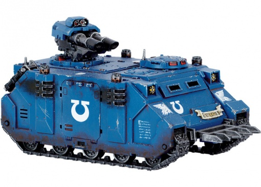

<!-- A1475-B0009 -->

原译文

Ultramarines Razorback with a lascannon turret 配置激光炮塔的极限战士豪猪战车

**校订译文**

Ultramarines Razorback with a lascannon turret 配置激光炮塔的极限战士豪猪战车

<!-- /A1475-B0009 -->

<!-- A1475-B0010 -->
## Battlefield Role 战场角色

<!-- /A1475-B0010 -->

<!-- A1475-B0011 -->
**英文原文**

Some Chapter Masters are wary of using the Razorback, partly because it is a relatively "recent" machine at only 4,000 years old. They also believe it fails both as a troop transport and a battle tank, lacking the transport capacity or firepower and armour of dedicated machines. Others see it as filling a gap between the two, able to provide heavy fire support for squads assaulting the enemy, and freely mix Rhinos and Razorbacks together. Further uses include providing escort for armoured attacks and heavy reconnaissance in coordination with bike-mounted troops.

<!-- /A1475-B0011 -->

<!-- A1475-B0012 -->

原译文

一些战团长对使用豪猪战车持谨慎态度，部分原因是它是一台相对“新”的机器，只有4000年的历史。他们还认为，它既不能作为部队运输工具，也不能作为战斗坦克，缺乏专业机器的运输能力、火力和装甲。其他人则认为它填补了两者之间的空白，能够为袭击敌人的小队提供重型火力支援，并将犀牛装甲车和豪猪战车自由混合在一起。其他用途包括与摩托部队协调，为装甲袭击和重型侦察提供护送。

**校订译文**

一些战团长谨慎使用豪猪，部分原因是这种机器只有四千年历史，仍算相对“新近”的设计。他们也认为，豪猪的载员能力比不上专用运兵车，火力与装甲又逊于专用战斗坦克，两种角色都不够称职。另一些人则认为它恰好填补了二者之间的空缺，能为突击敌军的小队提供重火力支援，因此常将犀牛与豪猪混合编组。其他用途还包括为装甲突击提供护卫，以及与摩托部队协同执行武装侦察。

<!-- /A1475-B0012 -->

<!-- A1475-B0013 图片 -->
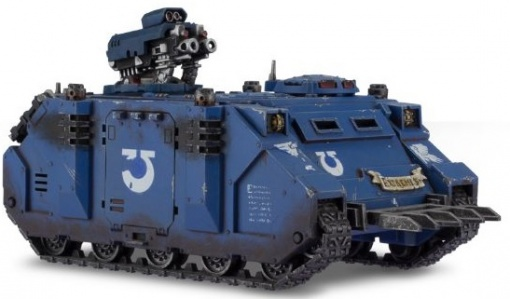

<!-- A1475-B0014 -->

原译文

Razorback with twin-linked heavy bolters 配备双联重型爆矢枪的豪猪战车

**校订译文**

Razorback with twin-linked heavy bolters 配备双联重型爆矢枪的豪猪战车

<!-- /A1475-B0014 -->

<!-- A1475-B0015 -->
## Design Features 设计特点

<!-- /A1475-B0015 -->

<!-- A1475-B0016 -->
### Technical Information 技术资料

原题：Technical Information 技术信息

<!-- /A1475-B0016 -->

<!-- A1475-B0017 -->
**英文原文**

Vehicle Name:Razorback

<!-- /A1475-B0017 -->

<!-- A1475-B0018 -->

原译文

载具名：豪猪战车

**校订译文**

载具名：豪猪战车

<!-- /A1475-B0018 -->

<!-- A1475-B0019 -->
**英文原文**

Forge World of Origin:Mars

<!-- /A1475-B0019 -->

<!-- A1475-B0020 -->

原译文

起源铸造世界：火星

**校订译文**

起源铸造世界：火星

<!-- /A1475-B0020 -->

<!-- A1475-B0021 -->
**英文原文**

Known Patterns:II-XVII

<!-- /A1475-B0021 -->

<!-- A1475-B0022 -->

原译文

已知型号：II - XVII

**校订译文**

已知型号：II - XVII

<!-- /A1475-B0022 -->

<!-- A1475-B0023 -->
**英文原文**

Crew:Driver

<!-- /A1475-B0023 -->

<!-- A1475-B0024 -->

原译文

组员：驾驶员

**校订译文**

乘员：驾驶员

<!-- /A1475-B0024 -->

<!-- A1475-B0025 -->
**英文原文**

Powerplant:Quad MkII Adaptable Thermic Combustor Reactor

<!-- /A1475-B0025 -->

<!-- A1475-B0026 -->

原译文

动力装置：阔德MkII适应性热燃烧反应堆

**校订译文**

动力装置：4台 MkII 自适应热燃烧反应堆

<!-- /A1475-B0026 -->

<!-- A1475-B0027 -->
**英文原文**

Weight:31.5 tonnes

<!-- /A1475-B0027 -->

<!-- A1475-B0028 -->

原译文

重量：31.5吨

**校订译文**

重量：31.5吨

<!-- /A1475-B0028 -->

<!-- A1475-B0029 -->
**英文原文**

Length:6.6m

<!-- /A1475-B0029 -->

<!-- A1475-B0030 -->

原译文

长度：6.6米

**校订译文**

长度：6.6米

<!-- /A1475-B0030 -->

<!-- A1475-B0031 -->
**英文原文**

Width:4.5m

<!-- /A1475-B0031 -->

<!-- A1475-B0032 -->

原译文

宽度：4.5米

**校订译文**

宽度：4.5米

<!-- /A1475-B0032 -->

<!-- A1475-B0033 -->
**英文原文**

Height:5.0m with turret

<!-- /A1475-B0033 -->

<!-- A1475-B0034 -->

原译文

高度：5.0米，带炮塔

**校订译文**

高度：5.0米（含炮塔）

<!-- /A1475-B0034 -->

<!-- A1475-B0035 -->
**英文原文**

Ground Clearance:0.44m

<!-- /A1475-B0035 -->

<!-- A1475-B0036 -->

原译文

离地间隙：0.44m

**校订译文**

离地间隙：0.44米

<!-- /A1475-B0036 -->

<!-- A1475-B0037 -->
**英文原文**

Fording Depth:{{{Fording Depth}}}

<!-- /A1475-B0037 -->

<!-- A1475-B0038 -->

原译文

涉水深度：{{{涉水深度}}}

**校订译文**

涉水深度：未提供

**校注：** 原文仅残留涉水深度模板，无实际数值。

<!-- /A1475-B0038 -->

<!-- A1475-B0039 -->
**英文原文**

Max Speed - on road70kph

<!-- /A1475-B0039 -->

<!-- A1475-B0040 -->

原译文

最大速度 - 公路上70千米每小时

**校订译文**

最大公路速度：70公里/小时

<!-- /A1475-B0040 -->

<!-- A1475-B0041 -->
**英文原文**

Max Speed - off road:55kph

<!-- /A1475-B0041 -->

<!-- A1475-B0042 -->

原译文

最大速度 - 越野55千米每小时

**校订译文**

最大越野速度：55公里/小时

<!-- /A1475-B0042 -->

<!-- A1475-B0043 -->
**英文原文**

Transport Capacity:6

<!-- /A1475-B0043 -->

<!-- A1475-B0044 -->

原译文

运输能力：6

**校订译文**

载员能力：6人

<!-- /A1475-B0044 -->

<!-- A1475-B0045 -->
**英文原文**

Access Points:3

<!-- /A1475-B0045 -->

<!-- A1475-B0046 -->

原译文

入口：3

**校订译文**

出入口：3处

<!-- /A1475-B0046 -->

<!-- A1475-B0047 -->
**英文原文**

Main Armament:Twin-linked Heavy Bolters/Lascannons/Multi-Melta

<!-- /A1475-B0047 -->

<!-- A1475-B0048 -->

原译文

主武器：双联重型爆矢枪/激光炮/多管热熔

**校订译文**

主武器：双联重型爆矢枪/激光炮/多管热熔

<!-- /A1475-B0048 -->

<!-- A1475-B0049 -->
**英文原文**

Secondary Armament:N/A

<!-- /A1475-B0049 -->

<!-- A1475-B0050 -->

原译文

次要武器：无

**校订译文**

次要武器：无

<!-- /A1475-B0050 -->

<!-- A1475-B0051 -->
**英文原文**

Traverse:260°

<!-- /A1475-B0051 -->

<!-- A1475-B0052 -->

原译文

横向：260°

**校订译文**

水平射界：260°

<!-- /A1475-B0052 -->

<!-- A1475-B0053 -->
**英文原文**

Elevation:From -5° to 45°

<!-- /A1475-B0053 -->

<!-- A1475-B0054 -->

原译文

仰角：-5°至45°

**校订译文**

俯仰角：−5°至+45°

<!-- /A1475-B0054 -->

<!-- A1475-B0055 -->
**英文原文**

Main Ammunition:1600 rounds

<!-- /A1475-B0055 -->

<!-- A1475-B0056 -->

原译文

主要弹药：1600发

**校订译文**

主武器载弹量：1600发

<!-- /A1475-B0056 -->

<!-- A1475-B0057 -->
**英文原文**

Secondary Ammunition:N/A

<!-- /A1475-B0057 -->

<!-- A1475-B0058 -->

原译文

次要弹药：无Armour 装甲

**校订译文**

副武器载弹量：不适用

Armour 装甲

<!-- /A1475-B0058 -->

<!-- A1475-B0059 -->
**英文原文**

Superstructure:60mm

<!-- /A1475-B0059 -->

<!-- A1475-B0060 -->

原译文

上部结构：60mm

**校订译文**

上部结构：60mm

<!-- /A1475-B0060 -->

<!-- A1475-B0061 -->
**英文原文**

Hull:60mm

<!-- /A1475-B0061 -->

<!-- A1475-B0062 -->

原译文

车体：60mm

**校订译文**

车体：60mm

<!-- /A1475-B0062 -->

<!-- A1475-B0063 -->
**英文原文**

Gun Mantlet:N/A

<!-- /A1475-B0063 -->

<!-- A1475-B0064 -->

原译文

炮盾：无

**校订译文**

炮盾：无

<!-- /A1475-B0064 -->

<!-- A1475-B0065 -->
**英文原文**

Vehicle Designation:0120-766-0742-RH984

<!-- /A1475-B0065 -->

<!-- A1475-B0066 -->

原译文

载具编号：0120-766-0742-RH984

**校订译文**

载具编号：0120-766-0742-RH984

<!-- /A1475-B0066 -->

<!-- A1475-B0067 -->
**英文原文**

Firing Ports:n/a

<!-- /A1475-B0067 -->

<!-- A1475-B0068 -->

原译文

开火口：无

**校订译文**

开火口：无

<!-- /A1475-B0068 -->

<!-- A1475-B0069 -->
**英文原文**

Turret:50mm

<!-- /A1475-B0069 -->

<!-- A1475-B0070 -->

原译文

炮塔：50mmArmament 军备The standard armament of a Razorback consists of a twin-linked heavy bolter mounted in a turret atop the vehicle. The turret is normally remote-controlled, using a targeting logis-engine similar to that found in Land Raiders. In some cases Razorbacks lack this system, however, and so a second marine or servitor is added to man the weapon, protected from enemy fire by a gun shield, armoured in bonded ceramite/titanium and incorporating a photo-suppressive visor. The turret is self-elevating.豪猪战车的标准武器由安装在车辆顶部炮塔中的双连重型爆矢枪组成。炮塔通常是远程控制的，使用与兰德掠袭者类似的瞄准沉思者引擎。然而，在某些情况下，豪猪战车缺乏这种系统，因此增加了第二名星际战士或机仆来为武器配备人员，用炮盾保护免受敌人的火力，用粘结的陶钢/钛制成装甲，并装有一个遮光面罩。炮塔是自升式的。

**校订译文**

炮塔：50毫米

Armament 武装

The standard armament of a Razorback consists of a twin-linked heavy bolter mounted in a turret atop the vehicle. The turret is normally remote-controlled, using a targeting logis-engine similar to that found in Land Raiders. In some cases Razorbacks lack this system, however, and so a second marine or servitor is added to man the weapon, protected from enemy fire by a gun shield, armoured in bonded ceramite/titanium and incorporating a photo-suppressive visor. The turret is self-elevating.

豪猪战车的标准武器是一组安装在车顶炮塔上的双联重型爆矢枪。炮塔通常通过遥控操作，采用与兰德掠袭者相似的瞄准逻辑引擎。部分车辆没有这套系统，需要另一名星际战士或机仆操纵武器；炮手由结合陶钢与钛材的装甲炮盾保护，并配有抑制强光的观察面罩。炮塔能够自行升起。

**校注：** 原分块将性能、栏目标题与完整英文正文粘连；保留英文原样，仅增加分段并修订中文。

<!-- /A1475-B0070 -->

<!-- A1475-B0071 图片 -->
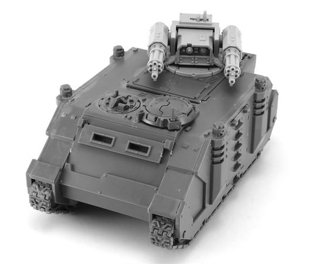

<!-- A1475-B0072 -->

原译文

Razorback with twin Assault Cannons 配备突击炮的豪猪战车

**校订译文**

Razorback with twin Assault Cannons 配备一对突击炮的豪猪战车

<!-- /A1475-B0072 -->

<!-- A1475-B0073 -->
**英文原文**

The heavy bolters can often be replaced with a twin-linked heavy flamer, a twin-linked assault cannon, a twin-linked lascannon, a Multi-melta, a combination of a lascannon and a twin-linked plasma gun, or the twin-linked M.38-pattern 'Deathreaper' lascannon, fed by power cells located in the main hull and assisted by dual-link auxiliary cells.

<!-- /A1475-B0073 -->

<!-- A1475-B0074 -->

原译文

重型爆矢枪通常可以用双联重型火焰枪、双联突击炮、双联激光炮、多管热熔、激光炮和双联等离子枪的组合，或双联M.38型“死亡收割者”激光炮代替，由位于主车体中的动力电池供电，并由双联辅助电池辅助。

**校订译文**

重型爆矢枪可换成双联重型火焰喷射器、双联突击炮、双联激光炮、多管热熔，或一门激光炮搭配双联等离子枪。另一个选择是双联 M.38 型“死亡收割者”激光炮，由主车体内的能源电池供电，并有双联辅助电池支持。

<!-- /A1475-B0074 -->

<!-- A1475-B0075 图片 -->
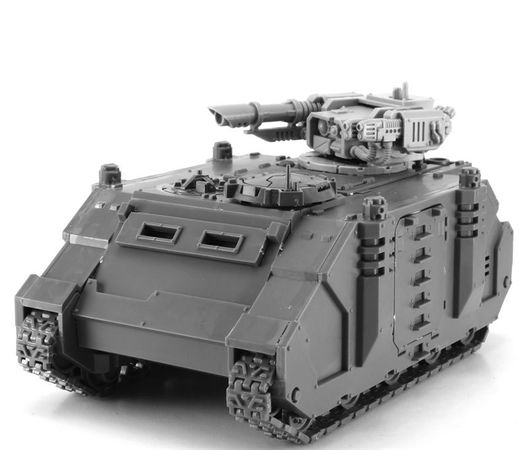

<!-- A1475-B0076 -->

原译文

Razorback with Lascannon and Plasma Gun 配备激光炮和等离子枪的豪猪战车

**校订译文**

Razorback with Lascannon and Plasma Gun 配备激光炮和等离子枪的豪猪战车

<!-- /A1475-B0076 -->

<!-- A1475-B0077 -->
### Equipment 装备

原题：Equipment 设备

<!-- /A1475-B0077 -->

<!-- A1475-B0078 -->
**英文原文**

Standard equipment includes Smoke Launchers and a searchlight. The Razorback can be further upgraded with Dozer Blades, a pintle-mounted storm bolter, a hunter-killer missile, and extra armour.

<!-- /A1475-B0078 -->

<!-- A1475-B0079 -->

原译文

标准设备包括烟雾发射器和探照灯。豪猪战车可以进一步升级，配备推土铲、枢轴式风暴爆矢枪、猎杀飞弹和额外的装甲。

**校订译文**

标准装备包括烟雾发射器与探照灯，另可加装推土铲、枢轴枪架风暴爆矢枪、猎杀导弹和附加装甲。

<!-- /A1475-B0079 -->

<!-- A1475-B0080 -->
### Transport Capacity 运输能力

<!-- /A1475-B0080 -->

<!-- A1475-B0081 -->
**英文原文**

The capacity of the Razorback is reduced compared to the Rhino, and can carry up to 6 Space Marines in Power Armour, though not in Terminator Armour. The Razorback has the same access points found on the Rhino, however it lacks any fire points due to its turret-mounted weapon. Devastator marines in particular favor the use of the Razorback.

<!-- /A1475-B0081 -->

<!-- A1475-B0082 -->

原译文

与犀牛装甲车相比，豪猪战车的容量有所减少，在动力盔甲中最多可以搭载6名星际战士，但不是终结者盔甲。豪猪战车拥有与犀牛装甲车相同的入口，但由于其炮塔安装的武器，它缺乏任何开火口。毁灭者战士尤其支持使用豪猪战车。

**校订译文**

豪猪的载员能力低于犀牛，最多容纳六名身穿动力甲的星际战士，无法搭载终结者装甲战士。它保留了犀牛的出入口布局，但车顶武器占用了空间，因此没有乘员射击孔。破坏者战士尤其喜欢使用豪猪。

**校注：** Devastator 按官方破坏者词根统一，不与Destroyer毁灭者混同。

<!-- /A1475-B0082 -->

<!-- A1475-B0083 图片 -->
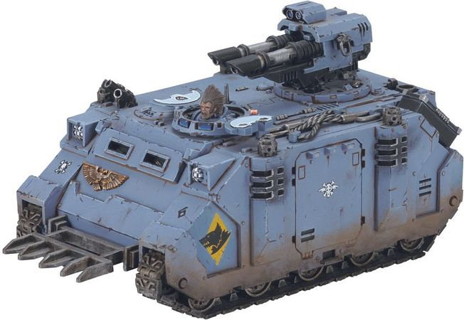

<!-- A1475-B0084 -->

原译文

Space Wolves Razorback 太空野狼豪猪战车

**校订译文**

Space Wolves Razorback 太空野狼豪猪战车

<!-- /A1475-B0084 -->

<!-- A1475-B0085 -->
### Variants 变体

<!-- /A1475-B0085 -->

<!-- A1475-B0086 -->
### Armoured Razorback 装甲豪猪

<!-- /A1475-B0086 -->

<!-- A1475-B0087 -->
**英文原文**

The Armoured Razorback has several hatches that are designed for Space Marines to fire out of. While the rear hatch allows several Space Marines to do so, the front hatch and top hatch only allow one. By doing so, the vehicle's passengers can add their firepower to the Lascannon and Twin-Linked Plasma Guns, the Armoured Razorback is armed with. It is also equipped with additional exhaust pipes and an air-cooling grill for its supercharged engine.

<!-- /A1475-B0087 -->

<!-- A1475-B0088 -->

原译文

装甲豪猪有几个舱门，专为星际战士设计。虽然后舱门允许几名星际战士这样做，但前舱门和顶舱门只允许一名。通过这样做，载具的乘客可以将他们的火力添加到装甲豪猪配备的激光炮和双联等离子炮中。它还为其增压引擎配备了额外的排气管和空气冷却格栅。

**校订译文**

装甲豪猪设有多处可供星际战士向外射击的舱口。后舱口能容纳数人同时射击，前部与顶部舱口则各限一人。乘员由此能够配合车辆的激光炮和双联等离子枪，增添火力。它还设有额外排气管和风冷格栅，为增压引擎散热。

<!-- /A1475-B0088 -->

<!-- A1475-B0089 图片 -->
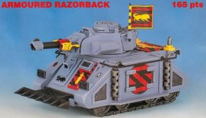

<!-- A1475-B0090 -->

原译文

Armoured Razorback 装甲豪猪

**校订译文**

Armoured Razorback 装甲豪猪

<!-- /A1475-B0090 -->

<!-- A1475-B0091 -->
### Infernum Pattern Razorback 炼狱型豪猪战车

<!-- /A1475-B0091 -->

<!-- A1475-B0092 -->
**英文原文**

It is believed that Techmarines of the Fire Hawks Chapter formulated a means of overcoming the power feed issue and first used the new vehicle variant during the Badab War, where this advanced type of Razorback was used to smash through enemy fortifications and deliver squads directly through the breach with its Multi-Melta. The New variant was named Infernum Pattern Razorback.

<!-- /A1475-B0092 -->

<!-- A1475-B0093 -->

原译文

据信，火鹰战团的技术军士制定了一种克服动力供给问题的方法，并在巴达布战争期间首次使用了这种新型载具变体，在那里，这种先进的豪猪战车被用来粉碎敌人的防御工事，并用它的多管热熔直接通过缺口运送小队。新变种被命名为炼狱型豪猪战车。

**校订译文**

据信，火鹰战团的科技战士找到了克服供能问题的方法，并在巴达布战争中首次投入这种新变体。它以多管热熔轰穿敌方工事，再将小队直接送入缺口。这种先进豪猪被命名为炼狱型豪猪战车。

**校注：** 多管热熔用于破坏工事，车辆运送小队；原译把武器误写成运输工具。

<!-- /A1475-B0093 -->

<!-- A1475-B0094 图片 -->
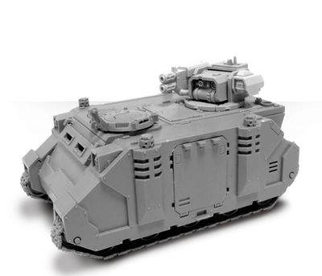

<!-- A1475-B0095 -->

原译文

Infernum Pattern Razorback with Multi-Melta 配备多管热熔的炼狱型豪猪战车

**校订译文**

Infernum Pattern Razorback with Multi-Melta 配备多管热熔的炼狱型豪猪战车

<!-- /A1475-B0095 -->

<!-- A1475-B0096 -->
### Razorback Rikarius 里卡里乌斯型豪猪战车

原题：Razorback Rikarius 里卡里乌斯豪猪战车

<!-- /A1475-B0096 -->

<!-- A1475-B0097 -->
**英文原文**

The Razorback Rikarius is a Razorback variant used by the Blood Ravens and others. It was first developed in M37, when a resurgence of Ork forces in the Aurelian System prompted commanders to produce a tank that could eliminate vast amounts of infantry. The resulting vehicle was named after Yriel Rikarius, the Blood Ravens 2nd Captain at the time who had connections to the High Magos M'Lell of Mars. M'Lell ensured the revised Razorback STC was quickly fabricated and put into service alongside the embattled Blood Ravens. Sacrificing transport capacity to mount a variety of weapons such as twin-linked Assault Cannons and two Hurricane Bolters, squadrons of these vehicles have since served many other Space Marine Chapters. In the intervening centuries their numbers have dwindled and the STC lost, which has resulted in the surviving vehicles being treated as relics.

<!-- /A1475-B0097 -->

<!-- A1475-B0098 -->

原译文

里卡里乌斯豪猪战车是血鸦和其他人使用的豪猪战车变种。它最早是在M37开发的，当时奥瑞利安星系中欧克部队的复兴促使指挥官们生产了一种可以消灭大量步兵的坦克。由此产生的载具以伊里尔·里卡里乌斯的名字命名，他当时是血鸦的第二连长，与火星的至高贤者米埃尔有联系。米埃尔确保了修订后的豪猪战车STC能够迅速制造出来，并与四面楚歌的血鸦一起投入使用。牺牲运输能力来装载各种武器，如双联突击炮和两个飓风爆矢枪，这些车辆的中队此后为许多其他星际战士战团服务。在接下来的几个世纪里，它们的数量逐渐减少，STC也消失了，这导致幸存的车辆被视为圣物。

**校订译文**

里卡里乌斯型豪猪由血鸦及其他战团使用。第37千年，奥瑞利安星系的欧克势力复起，促使指挥官研制能够大量杀伤步兵的战车，遂诞生这一型号。车辆以当时血鸦第2连连长伊瑞尔·里卡里乌斯命名，他与火星至高贤者姆’莱尔有联系。姆’莱尔确保修订后的豪猪 STC 设计迅速转化为车辆生产，投入苦战中的血鸦部队。该型牺牲载员能力，装载双联突击炮、两组飓风爆矢枪等武器。此后，许多其他星际战士战团也装备了这类车辆组成的中队。数百年间，存量逐渐减少，STC 也已失落，幸存车辆因而被奉为圣物。

**校注：**  同一火星贤者M’Lell沿726统一姆’莱尔；原译米埃尔。

<!-- /A1475-B0098 -->

<!-- A1475-B0099 图片 -->
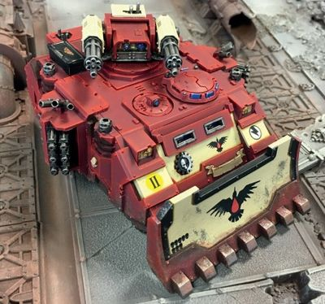

<!-- A1475-B0100 -->

原译文

Razorback Rikarius 里卡里乌斯豪猪战车

**校订译文**

Razorback Rikarius 里卡里乌斯型豪猪战车

<!-- /A1475-B0100 -->

<!-- A1475-B0101 -->
### Vortimer Pattern Razorback 沃蒂默型豪猪战车

<!-- /A1475-B0101 -->

<!-- A1475-B0102 -->
**英文原文**

The Vortimer Pattern Razorback is a variant used by the Grey Knights. It mounts twin-linked Psycannons and only a few exist in the Chapter's service. These vehicles were personally constructed by Master Armourer Regis Vortimer himself and were for the Deliverance of Vulgate.

<!-- /A1475-B0102 -->

<!-- A1475-B0103 -->

原译文

沃蒂默型豪猪战车是灰骑士使用的变体。它安装了双联灵能炮，只有少数服役于该战团。这些载具是由装甲大师雷吉斯·沃蒂默亲自建造的，用于解放沃尔佳特。

**校订译文**

沃蒂默型豪猪是灰骑士使用的变体，配备双联灵能炮，战团仅保有少数几辆。它们由军械大师雷吉斯·沃蒂默亲自制造，用于沃尔盖特救援之战。

**校注：** Master Armourer 沿本书既定军械大师；此处不误指制造装甲这一单一职责。

<!-- /A1475-B0103 -->

<!-- A1475-B0104 图片 -->
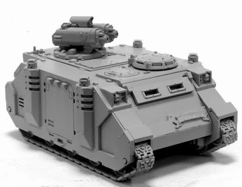

<!-- A1475-B0105 -->

原译文

Vortimer Pattern Razorback 沃蒂默型豪猪战车

**校订译文**

Vortimer Pattern Razorback 沃蒂默型豪猪战车

<!-- /A1475-B0105 -->

<!-- A1475-B0106 -->
## Named Razorbacks 著名豪猪战车

<!-- /A1475-B0106 -->

<!-- A1475-B0107 -->
**英文原文**

Maneus — Howling Griffons

<!-- /A1475-B0107 -->

<!-- A1475-B0108 -->

原译文

曼纽斯号 — 咆哮狮鹫

**校订译文**

曼纽斯号 — 咆哮狮鹫

<!-- /A1475-B0108 -->

<!-- A1475-B0109 图片 -->
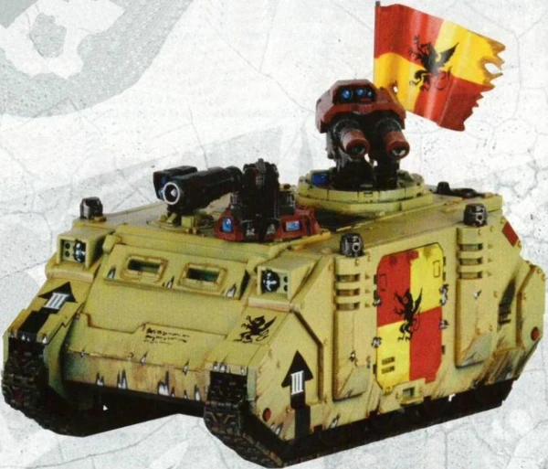

<!-- A1475-B0110 -->

原译文

Howling Griffons Razorback Maneus 咆哮狮鹫豪猪战车曼纽斯号

**校订译文**

Howling Griffons Razorback Maneus 咆哮狮鹫豪猪战车曼纽斯号

<!-- /A1475-B0110 -->

本篇核心术语与暂定项

以下列出本篇出现的英文原形及核心术语表用词。同形词可能指不同对象，具体词义以本篇正文和校注为准；单复数、别名和仅见于图注的名称可能尚未列入。完整候选见[术语表](../../术语表/双语术语候选.csv)。

| 英文 | 采用中文 | 状态 |
| --- | --- | --- |
| Space Marines | 星际战士 | 官方已核对 |
| Adeptus Astartes | 阿斯塔特修会 | 官方已核对 |
| Grey Knights | 灰骑士 | 官方已核对 |
| Adeptus Mechanicus | 机械修会 | 官方已核对 |
| Terminator | 终结者 | 官方已核对 |
| Horus Heresy | 荷鲁斯之乱 | 官方已核对 |
| Equipment | 装备 | 编辑用语已统一 |
| Blood Ravens | 血鸦 | 暂定 |
| Forge World | 铸造世界 | 暂定·官方待核 |
| Horus | 荷鲁斯 | 暂定·官方待核 |
| STC | 标准建造模板 | 暂定·官方待核 |
| Hunter-Killer | 猎杀者 | 暂定·官方待核 |
| Badab | 巴达布 | 暂定·官方待核 |
| Mars | 火星 | 暂定·官方待核 |
| Deliverance | 拯救星 | 暂定·官方待核 |
| Master | 导师（审判庭职衔）／舰务官（舰员职务） | 语境定译·官方待核 |
| Rhino | 犀牛战车 | 官方已核对 |
| Razorback | 豪猪战车 | 官方已核对 |
| Artisan | 铸造士 | 暂定·官方待核 |
| Power Armour | 动力盔甲 | 暂定·官方待核 |
| Space Marine | 星际战士 | 暂定·官方待核 |
| Chapter | 战团 | 暂定·官方待核 |
| Captain | 连长 | 暂定·官方待核 |
| Devastator | 破坏者 | 暂定·官方待核 |
| Fire Hawks | 火鹰 | 暂定·官方待核 |
| Rhinos | 犀牛 | 暂定·官方待核 |
| Howling Griffons | 咆哮狮鹫 | 暂定·官方待核 |
| Yriel | 伊瑞尔 | 暂定·官方待核 |
| Master Armourer | 首席军械师 | 暂定·官方待核 |
| Maneus | 曼纽斯号 | 暂定·官方待核 |
| Regis Vortimer | 雷吉斯·沃蒂默 | 暂定·官方待核 |
| Tilvius | 蒂尔维乌斯 | 暂定·官方待核 |
| Chief Artisan | 首席工匠 | 暂定·官方待核 |
| Gun | 甘 | 暂定·官方待核 |
| The Blood | 鲜血 | 暂定·官方待核 |
| Vortimer Pattern Razorback | 沃蒂默型豪猪战车 | 暂定·官方待核 |
| Yriel Rikarius | 伊瑞尔·里卡里乌斯 | 暂定·官方待核 |
| Razorback Rikarius | 里卡里乌斯型豪猪战车 | 暂定·官方待核 |
| System | 星系（恒星系统） | 暂定·官方待核 |
| Hunter-killer missile | 猎杀导弹 | 官方已核对 |
| Assault Cannon | 突击炮 | 暂定·官方待核 |
| Bolter | 爆矢枪 | 暂定·官方待核 |
| Storm bolter | 风暴爆矢枪 | 官方已核对 |
| Flamer | 火焰喷射器（武器）／火妖（奸奇单位） | 语境定译·对应官译已核 |
| Heavy flamer | 重型火焰喷射器 | 官方已核对 |
| Multi-melta | 多管热熔 | 官方已核对 |
| Lascannon | 激光炮 | 官方已核对 |
| Plasma gun | 等离子枪 | 官方已核对 |
| Deliverance of Vulgate | 沃尔盖特救援之战 | 暂定·官方待核 |
| Vulgate | 沃尔盖特 | 暂定·官方待核 |
| Terminator Armour | 终结者盔甲 | 暂定·官方待核 |
| Armoured Razorback | 装甲豪猪 | 暂定·官方待核 |
| Infernum Pattern Razorback | 炼狱型豪猪战车 | 暂定·官方待核 |
| M'Lell | 姆’莱尔 | 暂定·官方待核 |
| Extra Armour | 额外装甲 | 暂定·官方待核 |

