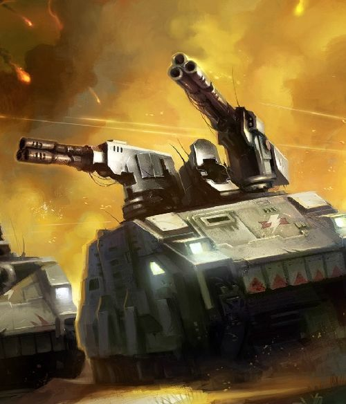
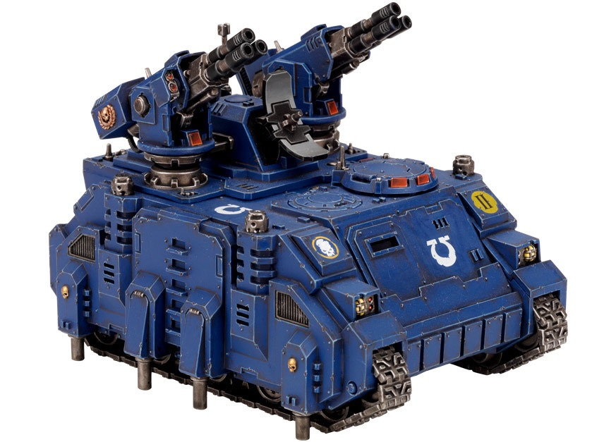

# 1476 追猎者防空车 Stalker Air Defence Vehicle

精校状态：中文行文已逐段精校，部分术语仍为暂定

分类：载具 / 地面 / 轻型

原文来源：https://www.bilibili.com/opus/1040706357210120233

原作者：帝国神选罐头

原文时间：2025年03月05日 11:52

[返回分类目录](目录.md) · [全书目录](../../目录.md)

<!-- A1476-B0001 -->
**英文原文**

The Stalker is a Space Marine air defence vehicle.

<!-- /A1476-B0001 -->

<!-- A1476-B0002 -->

原译文

追猎者是一种星际战士防空载具。

**校订译文**

追猎者是一种星际战士防空载具。

<!-- /A1476-B0002 -->

<!-- A1476-B0003 图片 -->

<!-- A1476-B0004 -->

原译文

Stalker 追猎者战车

**校订译文**

Stalker 追猎者战车

<!-- /A1476-B0004 -->

<!-- A1476-B0005 -->
## Overview 概述

<!-- /A1476-B0005 -->

<!-- A1476-B0006 -->
**英文原文**

The Stalker consists of a Icarus Stormcannon Array mounted on a Rhino chassis. Its design is based on the Hunter STC that was unearthed only a few millennium ago. A vital part of the Space Marine armoury, Stalker's are rapid-firing anti-aircraft platforms able to track and engage multiple targets simultaneously. Unsubtle but devastating, they fill the sky with hundreds of rounds of ammunition. The front of the vehicle has been reinforced to deflect incoming fire, while the flanks have been enhanced with additional armour and hydraulic stabilizers to anchor it to the ground when it fires its anti-aircraft artillery.

<!-- /A1476-B0006 -->

<!-- A1476-B0007 -->

原译文

追猎者由安装在犀牛底盘上的伊卡洛斯风暴炮阵列组成。它的设计基于几千年前出土的猎手战车STC。作为星际战士军械库的重要组成部分，追猎者是能够同时跟踪和打击多个目标的快速开火防空平台。它们虽然不可靠，但具有毁灭性，天空中布满了数百发弹药。车辆的前部经过加固，可以偏转来袭的火力，而侧翼则通过额外的装甲和液压稳定器进行了加固，以便在发射防空炮弹时将其固定在地面上。

**校订译文**

追猎者将伊卡洛斯风暴炮阵列安装在犀牛底盘上，设计源于数千年前才重新发现的猎手 STC。作为星际战士军械库的重要组成部分，它是能够同时追踪、攻击多个目标的速射防空平台，打法直接而威力惊人，能以数百发炮弹织满天空。车头经过加固，以抵挡来袭火力；侧面增设装甲和液压稳定支腿，开炮时可将车辆稳固支撑于地面。

**校注：** unsubtle 指打法直接粗放，不是不可靠。

<!-- /A1476-B0007 -->

<!-- A1476-B0008 图片 -->

<!-- A1476-B0009 -->

原译文

Stalker 追猎者战车

**校订译文**

Stalker 追猎者战车

<!-- /A1476-B0009 -->

<!-- A1476-B0010 -->
**英文原文**

The secret to the Stalker's success lies not in its weaponry but that of its tracking system, which is able to accurately engage fast moving aerial targets. The system itself is made up of altered brains and neural interfaces from Servitor operators. The servitors must be specially chosen, their brains possessed of a mental agility in life that is then re-purposed in near-death. These withered gunners are often chosen from failed Chapter initiates should they be too damaged to become Serfs, either those crippled during their training or that have rejected the sacred implanting processes. Chapter serfs can also find a place as a target-servitor, if they show promise and serve well, earning the right to accompany the Chapter into war. In both cases, the brain, and as much of the head and torso of the initiate as possible, will be salvaged so that he might serve the Chapter in another way. Where possible, the servitor’s limbs are used to operate controls and weapons, but most importantly their brain is linked into the augur arrays of the cannons. The process is not always successful and many servitors may die before one merges with the tank’s machine spirit, creating a deadly symbiotic relationship.

<!-- /A1476-B0010 -->

<!-- A1476-B0011 -->

原译文

追猎者成功的秘诀不在于它的武器，而在于它的跟踪系统，该系统能够准确地打击快速移动的空中目标。该系统本身由机仆操作员的改造大脑和神经接口组成。机仆必须经过特别挑选，他们的大脑在生活中具有一种精神敏捷性，然后在濒临死亡时被重新利用。这些干枯的炮手通常是从失败的战团信徒中选出的，如果他们受到的伤害太大而无法成为机仆，要么是在训练中致残的，要么是拒绝了神圣的植入过程的。战团侍从也可以找到一个地方作为指向机仆，如果他们表现出迹象并服务良好，就有权陪同战团参战。在这两种情况下，信徒的大脑以及尽可能多的头部和躯干都将被抢救出来，以便他可以以另一种方式为战团服务。在可能的情况下，机仆的四肢被用来操作控制装置和武器，但最重要的是，他们的大脑与大炮的占卜阵列相连。这个过程并不总是成功的，许多机仆可能会在与坦克的机魂融合之前死亡，造成了一种致命的共生关系。

**校订译文**

追猎者成功的关键在于能精准攻击高速空中目标的追踪系统。系统由机仆操作员改造后的大脑与神经接口组成。候选者必须精挑细选：他们生前思维敏捷，这份能力在濒死之际被重新用于战争。这些形容枯槁的炮手常出自未能完成战团选拔的新兵；他们或在训练中致残，或对神圣植入程序产生排斥，受创严重到连战团农奴也无法担任。表现出天赋、服役出色的战团农奴也可能成为瞄准机仆，获得随战团出征的资格。两种情况下，改造者都会尽量保全候选者的大脑、头部及躯干，让其以另一种形式继续服务。只要可能，机仆的肢体仍会用于操作控制器和武器；最关键的连接则是将大脑接入火炮探测阵列。融合过程并非总能成功：可能牺牲许多机仆，才有一个与战车机魂结合，形成足以致敌于死地的共生体。

**校注：** Serfs 是战团侍从，不能与Servitors机仆混同；rejected implanting 在改造语境指身体排斥，非主动拒绝。致命共生体指作战杀伤力，并非成功融合会杀死机仆。

<!-- /A1476-B0011 -->

本篇核心术语与暂定项

以下列出本篇出现的英文原形及核心术语表用词。同形词可能指不同对象，具体词义以本篇正文和校注为准；单复数、别名和仅见于图注的名称可能尚未列入。完整候选见[术语表](../../术语表/双语术语候选.csv)。

| 英文 | 采用中文 | 状态 |
| --- | --- | --- |
| Servitor | 机仆 | 暂定 |
| STC | 标准建造模板 | 暂定·官方待核 |
| Stalker | 追猎者 | 暂定·官方待核 |
| Rhino | 犀牛战车 | 官方已核对 |
| Space Marine | 星际战士 | 暂定·官方待核 |
| Chapter | 战团 | 暂定·官方待核 |
| Armoury | 军械库 | 暂定·官方待核 |
| Chapter serfs | 战团农奴 | 暂定·官方待核 |
| Initiates | 进阶者 | 官方已核 |
| Initiate | 正式成员 | 暂定·官方待核 |
| System | 星系（恒星系统） | 暂定·官方待核 |
| Icarus Stormcannon Array | 伊卡洛斯风暴炮阵列 | 暂定·官方待核 |
| Icarus Stormcannon | 伊卡洛斯风暴炮 | 暂定·官方待核 |

