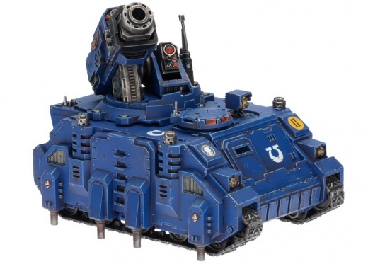
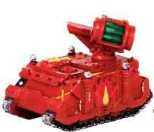

# 1477 猎手防空导弹车 Hunter Anti-aircraft Missile Vehicle

精校状态：中文行文已逐段精校，部分术语仍为暂定

分类：载具 / 地面 / 轻型

原文来源：https://www.bilibili.com/opus/1041098526405165128

原作者：帝国神选罐头

原文时间：2025年03月06日 13:14

[返回分类目录](目录.md) · [全书目录](../../目录.md)

<!-- A1477-B0001 -->
**英文原文**

The Hunter Multi-Launcher is an anti-aircraft missile vehicle built on the Rhino chassis. A variant of the Whirlwind, it is based on STC data which is much older than the more recent Whirlwind Hyperios. Whereas Stalkers are deployed for air defence against light fast moving targets, Hunters are deployed when Chapters expect to face heavy enemy air assaults.

<!-- /A1477-B0001 -->

<!-- A1477-B0002 -->

原译文

猎手多管发射器是一种基于犀牛底盘的防空导弹车。它是旋风的一种变体，基于STC数据，比最近的旋风许珀里翁要古老得多。追猎者被部署用于对轻型快速移动目标进行防空，而猎人则被部署在战团预计将面临敌方猛烈空袭的时候。

**校订译文**

猎手多管发射车是一种基于犀牛底盘的防空导弹车，也是旋风的变体。其 STC 设计比后来的许珀里翁型旋风更古老。追猎者主要防御轻型高速空中目标；当战团预期遭遇敌方大规模空袭时，则会部署猎手。

<!-- /A1477-B0002 -->

<!-- A1477-B0003 图片 -->

<!-- A1477-B0004 -->

原译文

Hunter 猎手

**校订译文**

Hunter 猎手

<!-- /A1477-B0004 -->

<!-- A1477-B0005 -->
## Overview 概述

<!-- /A1477-B0005 -->

<!-- A1477-B0006 -->
**英文原文**

The Hunter is the first known dedicated anti-aircraft platform fielded by the Adeptus Astartes. Prior to the discovery of the STC for the Hunter, Space Marine forces had attempted to retrofit various designs to the Whirlwind artillery vehicle, with largely negative results. Though a stable pattern of anti-aircraft Whirlwind was ultimately achieved in the Hyperios, several Chapters have continued to use the Hunter on many battlefields, including the recent Third War for Armageddon.

<!-- /A1477-B0006 -->

<!-- A1477-B0007 -->

原译文

猎手是阿斯塔特修会部署的第一个已知的专用防空平台。在发现猎手STC之前，星际战士曾试图对旋风火炮进行各种设计改造，但结果大多是负面的。尽管许珀里翁最终实现了稳定的防空旋风型号，但有几个战团在许多战场上继续使用猎手，包括最近的第三次阿玛吉多顿战争。

**校订译文**

猎手是已知阿斯塔特修会最早部署的专用防空平台。发现其 STC 之前，星际战士曾尝试将多种设计改装到旋风炮车上，大都不尽如人意。虽然最终研制出可靠的许珀里翁型防空旋风，一些战团仍继续在众多战场使用猎手，包括本稿所称近期的第三次阿玛吉多顿战争。

<!-- /A1477-B0007 -->

<!-- A1477-B0008 -->
**英文原文**

The Hunter is equipped with a Skyspear Missile Launcher, which fires a salvo of missiles each guided by the interred remains of a Chapter Serf. The secret to the Hunter's success lies in that of its missile's tracking system, which is able to accurately engage fast moving aerial targets. The system itself is made up of altered brains and neural interfaces from Servitor operators. The servitors must be specially chosen, their brains possessed of a mental agility in life that is then re-purposed in near-death. These are often chosen from failed Chapter initiates should they be too damaged to become Serfs, either those crippled during their training or that have rejected the sacred implanting processes. Chapter serfs can also find a place as a target-servitor, if they show promise and serve well, earning the right to accompany the Chapter into war. In both cases, the brain, and as much of the head and torso of the initiate as possible, will be salvaged so that he might serve the Chapter in another way. Where possible, the servitor’s limbs are used to operate controls and weapons, but most importantly their brain is linked into the augur arrays of the missile. The process is not always successful and many servitors may die before one merges with the tank’s machine spirit, creating a deadly symbiotic relationship.

<!-- /A1477-B0008 -->

<!-- A1477-B0009 -->

原译文

猎手配备了一个天矛导弹发射器，可以发射一系列导弹，每一枚导弹都由一名战团侍从的遗体引导。猎手成功的秘诀在于其导弹跟踪系统，该系统能够准确地打击快速移动的空中目标。该系统本身由机仆操作员的改造大脑和神经接口组成。机仆必须经过特别挑选，他们的大脑在生活中具有一种精神敏捷性，然后在濒临死亡时被重新利用。这些干枯的炮手通常是从失败的战团信徒中选出的，如果他们受到的伤害太大而无法成为机仆，要么是在训练中致残的，要么是拒绝了神圣的植入过程的。战团侍从也可以找到一个地方作为指向机仆，如果他们表现出迹象并服务良好，就有权陪同战团参战。在这两种情况下，信徒的大脑以及尽可能多的头部和躯干都将被抢救出来，以便他可以以另一种方式为战团服务。在可能的情况下，机仆的四肢被用来操作控制装置和武器，但最重要的是，他们的大脑与大炮的占卜阵列相连。这个过程并不总是成功的，许多机仆可能会在与坦克的机魂融合之前死亡，造成了一种致命的共生关系。

**校订译文**

猎手装备天矛导弹发射器，可齐射多枚导弹，每枚都由安置其中的战团农奴遗体负责制导。其优势在于能精确攻击高速空中目标的导弹追踪系统。系统由改造后的机仆大脑和神经接口构成。候选者须经过专门挑选，生前拥有的敏捷思维将在濒死之际被重新利用。他们常是未能完成战团选拔的新兵，或在训练中致残，或排斥神圣的植入程序，伤残程度严重到无法担任战团农奴。天赋出众、服役优秀的侍从也可能成为瞄准机仆，获准随战团出征。改造者会尽可能保全候选者的大脑、头部和躯干，让他们换一种方式继续效力。条件允许时，肢体仍用于操控设备和武器；最关键的是将大脑接入导弹探测阵列。过程并不总能成功，可能牺牲许多机仆，才有一个与战车机魂融合，形成致命的共生体。

**校注：** 英文末段说与坦克机魂融合，但开头又说遗体装在每枚导弹内；按源文保留装置层级差异。原译末段“大炮”改回英文missile导弹。

<!-- /A1477-B0009 -->

<!-- A1477-B0010 -->
**英文原文**

The ammo store of the Hunter is divided into the skyspear savant missiles, each one encased in its own munitorum shrine-case, awaiting the moment it will be released into the foe, and clips of explosive ordnance. Each clip holds three missiles, and an auto loader is able to draw them from the racks and feed them into the launcher in a single smooth motion. Each of these three missiles bears a psalm of vengeance inscribed in red wax by one of the Chapter’s Techmarines, its hate-filled words a curse upon the enemy it strives to destroy. When the burst of missiles is fired, the wax melts into streaming crimson and the curse is given life.

<!-- /A1477-B0010 -->

<!-- A1477-B0011 -->

原译文

猎手的弹药库分为天矛专家导弹和爆炸弹药架，每枚导弹都装在自己的军务部圣物箱，等待它被释放给敌人的那一刻。每个架子可容纳三枚导弹，自动装载机能够将它们从支架上抽出，并以一次平稳的运动将它们送入发射器。这三枚导弹中的每一枚都有一首由战团的一名技术军士用红蜡刻下的复仇赞美诗，其充满仇恨的文字是对其试图摧毁的敌人的诅咒。当导弹爆炸时，蜡融化成深红色，诅咒被赋予生命。

**校订译文**

猎手的弹药分为天矛智者导弹和成组的爆炸弹药。每枚天矛智者导弹都装在专属军务部圣匣中，等待射向敌人的时刻；另一类弹药则每夹装三枚导弹，自动装弹机能将整夹从弹架上取出，一次顺畅送入发射器。三枚导弹上各有一首由战团科技战士以红蜡刻写的复仇圣咏，其满怀憎恨的文字诅咒着预定消灭的敌人。导弹齐射而出时，蜡熔成奔流的猩红，诅咒也随之化为现实。

**校注：** burst of missiles is fired 指齐射发射，不是导弹爆炸；clip与弹架rack区别为弹夹和弹架。

<!-- /A1477-B0011 -->

<!-- A1477-B0012 -->
## Known Named Hunters 著名猎手

<!-- /A1477-B0012 -->

<!-- A1477-B0013 -->
**英文原文**

Dorn's Skyhammer — Imperial Fists

<!-- /A1477-B0013 -->

<!-- A1477-B0014 -->

原译文

多恩天锤 — 帝国之拳

**校订译文**

多恩天锤号——帝国之拳。

<!-- /A1477-B0014 -->

<!-- A1477-B0015 -->
## Previous Editions 旧版本

<!-- /A1477-B0015 -->

<!-- A1477-B0016 -->
**英文原文**

In Epic, the hunter is equipped with a Hunter Missile instead of a Skyspear Missile Launcher. The hunter missile used by the multi-launcher is faster and more accurate than those used by Whirlwinds, with unfolding fins to help guide it to the target, and the vehicle itself has a longer operational range. The missile is guided by a large scanning array that features an algorithmic precognitive targeter located opposite the cylindrical missile feed. STC Hunters feature one launch tube fed by a single rotary system, but some Techmarines have modified their charges with pairs launch units and a central sensor suite for improve efficiency.

<!-- /A1477-B0016 -->

<!-- A1477-B0017 -->

原译文

在Epic中，猎手配备的是猎手导弹，而不是天矛导弹发射器。多管发射器使用的猎手导弹比旋风使用的更快、更准确，其展开的尾翼有助于将其引导到目标，而且车辆本身具有更远的作战范围。这枚导弹由一个大型扫描阵列引导，该扫描阵列配备了一套算法式预知瞄准器，该瞄准器位于圆柱形导弹装填装置的对面。STC猎手的特点是一个由单个旋转系统供电的发射管，但一些技术军士已经用成对的发射单元和中央传感器套件修改了它们的装药，以提高效率。

**校订译文**

在《Epic》中，猎手使用猎手导弹，而非上述天矛导弹发射器。多管发射器所用的猎手导弹比旋风弹药更快、更精准，展开的弹翼有助于引导导弹飞向目标，车辆本身的行动半径也更大。大型扫描阵列负责制导，其算法式预测瞄准器位于圆筒形供弹装置对面。STC 标准猎手拥有一根发射管，由单套旋转系统供弹；部分科技战士则将自己负责的车辆改装为成对发射单元和中央传感器组，以提高效率。

**校注：** rotary system 是供弹系统而非供电；their charges 在此指科技战士负责的车辆，不是炸药装药。

<!-- /A1477-B0017 -->

<!-- A1477-B0018 图片 -->

<!-- A1477-B0019 -->

原译文

Hunter 猎手

**校订译文**

Hunter 猎手

<!-- /A1477-B0019 -->

本篇核心术语与暂定项

以下列出本篇出现的英文原形及核心术语表用词。同形词可能指不同对象，具体词义以本篇正文和校注为准；单复数、别名和仅见于图注的名称可能尚未列入。完整候选见[术语表](../../术语表/双语术语候选.csv)。

| 英文 | 采用中文 | 状态 |
| --- | --- | --- |
| Adeptus Astartes | 阿斯塔特修会 | 官方已核对 |
| Servitor | 机仆 | 暂定 |
| Imperial Fists | 帝国之拳 | 暂定 |
| Chapter Serf | 战团农奴 | 暂定·官方待核 |
| STC | 标准建造模板 | 暂定·官方待核 |
| Armageddon | 阿玛吉多顿 | 暂定·官方待核 |
| Rhino | 犀牛战车 | 官方已核对 |
| Whirlwind | 旋风战车 | 官方已核对 |
| Space Marine | 星际战士 | 暂定·官方待核 |
| Chapter | 战团 | 暂定·官方待核 |
| Whirlwinds | 旋风 | 暂定·官方待核 |
| Chapter serfs | 战团农奴 | 暂定·官方待核 |
| Initiates | 进阶者 | 官方已核 |
| Initiate | 正式成员 | 暂定·官方待核 |
| Vengeance | 复仇号 | 暂定·官方待核 |
| Savant | 博学者 | 暂定·官方待核 |
| System | 星系（恒星系统） | 暂定·官方待核 |
| Missile Launcher | 导弹发射器 | 暂定·官方待核 |
| Skyspear Missile Launcher | 天矛导弹发射器 | 暂定·官方待核 |
| Skyspear Missile | 天矛导弹 | 暂定·官方待核 |
| Dorn's Skyhammer | 多恩天锤号 | 暂定·官方待核 |
| Hunter Multi-Launcher | 猎手多管发射车 | 暂定·官方待核 |
| Epic | 史诗 | 暂定·官方待核 |
| Whirlwind Hyperios | 许珀里翁型旋风战车 | 暂定·官方待核 |

