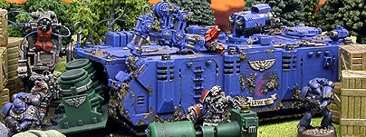

# 1478 装甲补给运输车 Armoured Supply Carriers

精校状态：中文行文已逐段精校，部分术语仍为暂定

分类：载具 / 地面 / 轻型

原文来源：https://www.bilibili.com/opus/1043315412440186884

原作者：帝国神选罐头

原文时间：2025年03月12日 12:36

[返回分类目录](目录.md) · [全书目录](../../目录.md)

<!-- A1478-B0001 -->
**英文原文**

Armoured Supply Carriers, or also known as Armoured Supply Crawlers (ASC), are resupply tank vehicles that Space Marines use to transport supplies to their forces during battles.

<!-- /A1478-B0001 -->

<!-- A1478-B0002 -->

原译文

装甲补给运输车，也称为装甲补给履带车（ASC），是星际战士在战斗中用于向部队运输补给的补给坦克车。

**校订译文**

装甲补给运输车也称装甲补给履带车（ASC），是星际战士在战斗期间向部队运送物资的装甲补给载具。

<!-- /A1478-B0002 -->

<!-- A1478-B0003 图片 -->

<!-- A1478-B0004 -->

原译文

Armoured Supply Carrier 装甲补给运输车

**校订译文**

Armoured Supply Carrier 装甲补给运输车

<!-- /A1478-B0004 -->

<!-- A1478-B0005 -->
## Description 描述

<!-- /A1478-B0005 -->

<!-- A1478-B0006 -->
**英文原文**

These vehicles are vital when Space Marines can not rely on air or space-based supply systems, due to facing dense terrain, adverse weather conditions or because of the air superiority of their enemies. ASCs are specifically designed for this task and have reinforced armor to protect their vital cargo, as they travel through contested areas. The vehicles are also equipped with high-torque engines and a Dozer Blade, which allow ASCs to plow through any obstacles that may block their path. Their crews consist of a driver, a gunner who controls the vehicles' Twin-Linked Heavy Bolter turret, Servo-Arms to speed up loading or unloading times at their rear and upper hatches, as well as a group of Servitors. These Servitors ensure ASCs remain functioning and they can also carry out any repairs the vehicles need. Should the need arise, Space Marines can also use ASCs as transports for their forces.

<!-- /A1478-B0006 -->

<!-- A1478-B0007 -->

原译文

当星际战士由于面临紧凑的地形、恶劣的天气条件或敌人的空中优势而无法依赖空中或天基补给系统时，这些车辆至关重要。装甲补给运输车是专门为这项任务设计的，在穿越有争议的地区时，它们有加固的装甲来保护其重要的货物。这些车辆还配备了高扭矩发动机和推土机铲刀，使装甲补给运输车能够犁过任何可能阻碍其行驶的障碍物。他们的船员包括一名驾驶员、一名控制车辆双联重型爆矢枪炮塔的炮手、用于加快后部和上部舱口装卸时间的伺服臂，以及一组机仆。这些机仆确保装甲补给运输车保持运行，还可以进行车辆所需的任何维修。如果需要，星际战士也可以使用装甲补给运输车作为其部队的运输工具。

**校订译文**

当地形复杂、天气恶劣，或敌方掌握制空权，导致星际战士无法依靠航空或轨道补给时，这类车辆便至关重要。装甲补给运输车专为此类任务设计，以加强装甲保护重要货物，穿越双方争夺的区域。高扭矩引擎和推土铲使它能冲开挡路障碍。车组包括驾驶员、操纵双联重型爆矢枪炮塔的炮手，以及一组机仆；车辆另装有伺服臂，便于经后部与顶部舱门迅速装卸。机仆负责维持车辆运转，并执行必要维修。需要时，装甲补给运输车也能搭载星际战士部队。

**校注：** 原文把Servo-Arms夹入车组清单，中文按设备功能梳理，未将伺服臂算作人员。

<!-- /A1478-B0007 -->

本篇核心术语与暂定项

以下列出本篇出现的英文原形及核心术语表用词。同形词可能指不同对象，具体词义以本篇正文和校注为准；单复数、别名和仅见于图注的名称可能尚未列入。完整候选见[术语表](../../术语表/双语术语候选.csv)。

| 英文 | 采用中文 | 状态 |
| --- | --- | --- |
| Space Marines | 星际战士 | 官方已核对 |
| Bolter | 爆矢枪 | 暂定·官方待核 |
| Heavy bolter | 重型爆矢枪 | 官方已核对 |
| Dozer Blade | 推土铲刀 | 暂定·官方待核 |

