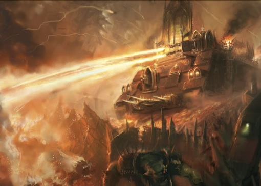
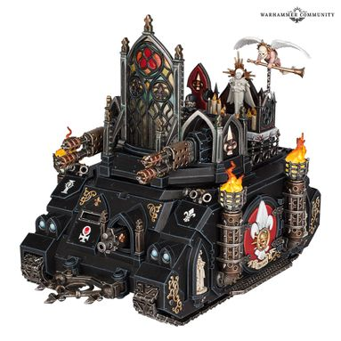
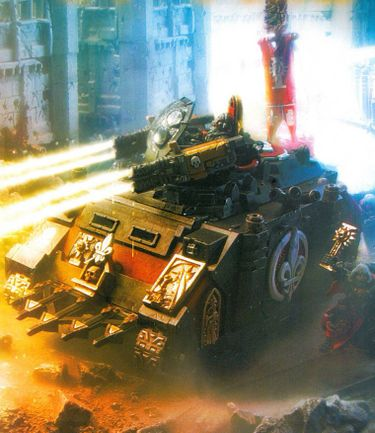
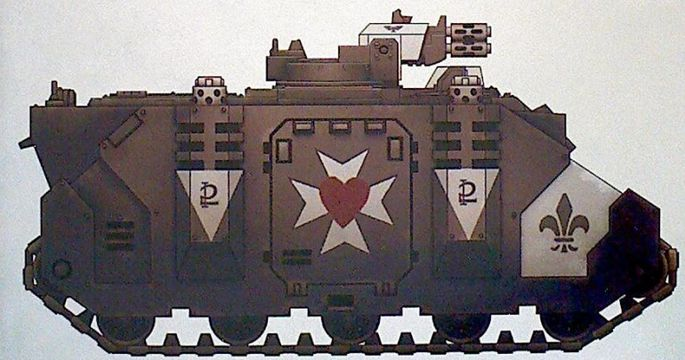
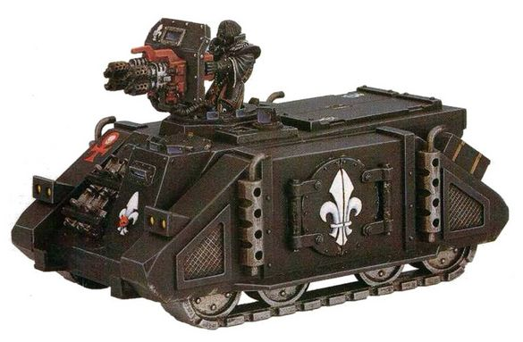

# 1479 献祭者装甲车 Immolator

精校状态：中文行文已逐段精校，部分术语仍为暂定

分类：载具 / 地面 / 轻型

原文来源：https://www.bilibili.com/opus/1213270708621148180

原作者：帝国神选罐头

原文时间：2026年06月13日 12:30

[返回分类目录](目录.md) · [全书目录](../../目录.md)

原篇名：献祭者 Immolator

<!-- A1479-B0001 -->
**英文原文**

The Immolator is a variant of the Rhino chassis and used exclusively by the Adepta Sororitas as a mobile flamethrower.

<!-- /A1479-B0001 -->

<!-- A1479-B0002 -->

原译文

献祭者是犀牛底盘的变体，由修女会独家用作移动火焰喷射器。

**校订译文**

献祭者装甲车以犀牛底盘为基础改装，专供修女会用作机动火焰喷射平台。

<!-- /A1479-B0002 -->

<!-- A1479-B0003 图片 -->

<!-- A1479-B0004 -->

原译文

Immolator 献祭者

**校订译文**

Immolator 献祭者装甲车

<!-- /A1479-B0004 -->

<!-- A1479-B0005 -->
## History 历史

<!-- /A1479-B0005 -->

<!-- A1479-B0006 -->
**英文原文**

The design specifications of the Immolator was first discovered within an ancient factory complex on Fornost, during the Icaria Crusade in M35. There a force of Frateris Templars captured an ancient factory complex intact, allowing an Adeptus Ministorum missionary team to freely explore its contents. Missionary Morben the Devout discovered databanks from the Dark Age of Technology and reported his findings to his superiors. knowing the value of this information to the Adeptus Mechanicus, the Ministorum used it as a bargaining chip for negotiations. Eventually the two organisations came to an agreement, the Fornosian Accords: the Mechanicus would have access to the databanks, and in exchange the Ministorum would have exclusive claim to any new technologies discovered. After inspecting through the databanks, the only new design to be found was for a flame-thrower tank. Combining this knowledge with known STC designs for the Rhino, the Tech-priests of Mars came up with the Immolator and began exclusive production of it for the Ministorum.

<!-- /A1479-B0006 -->

<!-- A1479-B0007 -->

原译文

在M35的伊卡里亚远征期间，在福诺斯特的一个古老工厂内首次发现了献祭者的设计规范。在那里，圣堂兄弟会的一支部队完整地占领了一座古老的工厂建筑群，使一个国教教会传教小队能够自由探索其内部。传教士虔诚者莫尔本发现了黑暗技术时代的数据库，并向上级报告了他的发现。国教知道这些信息对机械神教的价值，就把它当作谈判的筹码。最终，这两个组织达成了一项协议，即福诺西安协议：机械教将有权访问数据库，作为交换，国教将对发现的任何新技术拥有独家权利。在通过数据库检查后，唯一发现的新设计是火焰喷射坦克。将这些知识与犀牛的已知STC设计相结合，火星的技术神甫提出了献祭者，并开始为国教独家生产。

**校订译文**

第35千年的伊卡利亚远征中，献祭者的设计资料首次在福诺斯特一处古老工厂建筑群内被发现。当时，圣堂兄弟会部队完整夺下工厂，让国教传教团队得以深入调查。“虔诚者”莫尔本发现了科技黑暗时代的数据库，并向上级报告。国教深知这些资料对机械修会的价值，便以此作为谈判筹码。双方最终签订《福诺西安协议》：机械修会获准读取数据库，作为交换，国教独占其中发现的一切新技术。检查后，唯一的新设计是一种喷火坦克。火星技术祭司将其与已知犀牛 STC 设计结合，研制出献祭者，开始专门为国教生产。

<!-- /A1479-B0007 -->

<!-- A1479-B0008 图片 -->

<!-- A1479-B0009 -->

原译文

Immolator 献祭者

**校订译文**

Immolator 献祭者装甲车

<!-- /A1479-B0009 -->

<!-- A1479-B0010 -->
**英文原文**

Immolators are typically operated by a Dominion Sister with additional vehicular combat training.

<!-- /A1479-B0010 -->

<!-- A1479-B0011 -->

原译文

献祭者通常由主天使修女操作，并接受额外的载具战斗训练。

**校订译文**

献祭者通常由接受过额外载具作战训练的御天使修女操纵。

**校注：** 本处是修女会Dominion兵种，依据官方御天使小队词根采用御天使修女，区别其他语境同形职衔。

<!-- /A1479-B0011 -->

<!-- A1479-B0012 -->
## Design 设计

<!-- /A1479-B0012 -->

<!-- A1479-B0013 -->
**英文原文**

Immolators are armed with twin-linked Heavy Flamers as their primary armament. 'Sanctis' pattern-variants replace these with twin-linked Heavy Bolters, while the 'Justice' pattern-variant replaces them with twin-linked Multi-meltas. Space taken up by ammunition allows the Immolator to only carry a squad of six Sisters of Battle, which they deploy close to their objectives and advances in support. However, the Immolator does carry slightly more armour than the Rhino. The gunner itself is protected by a stained-armaglass ballistic shield. The main weapon system of the Immolator is sometimes referred to as an Inferno Cannon or Immolation Flamer instead of mere twin Heavy Flamers. The weaponry of the Immolator is controlled by auto-sanctified guidance Cogitators and an auto-choral targeting array, allowing for accurate fire even on the move.

<!-- /A1479-B0013 -->

<!-- A1479-B0014 -->

原译文

献祭者配备了双联重型火焰枪作为其主要武器。“神圣”型变体用双联重型爆矢枪代替了这些，而“正义”型变体则用双联多管热熔代替了它们。弹药占用的空间使献祭者只能携带一个由六名战斗修女组成的小队，她们将这些小队部署在靠近目标和支援进展的地方。然而，献祭者确实比犀牛装配更多的装甲。炮手本身受到彩色装甲玻璃防弹盾的保护。献祭者的主要武器系统有时被称为炼狱炮或献祭者火焰枪，而不仅仅是双联重型火焰枪。献祭者的武器由自动神圣制导沉思者和自动合唱瞄准阵列控制，即使在移动中也能进行精确射击。

**校订译文**

献祭者的主武器是双联重型火焰喷射器；“神圣”型将其换成双联重型爆矢枪，“正义”型则改装双联多管热熔。由于弹药占据空间，车内只能搭载六名战斗修女。车辆会将小队送至目标附近，再随其推进、提供支援。献祭者的装甲略厚于犀牛，炮手由彩绘装甲玻璃制成的防弹盾保护。其主武器有时也称炼狱加农炮或献祭火焰喷射器，而非简单称为成对重型火焰喷射器。自动祝圣制导沉思者与自动圣咏瞄准阵列控制武器，使车辆在行进间也能精确射击。

**校注：** 原句施事为车辆：车将小队送至目标附近后支援其推进；原译误将“她们”作为运送小队者。

<!-- /A1479-B0014 -->

<!-- A1479-B0015 图片 -->

<!-- A1479-B0016 -->

原译文

Immolator 献祭者

**校订译文**

Immolator 献祭者装甲车

<!-- /A1479-B0016 -->

<!-- A1479-B0017 -->
**英文原文**

The Immolator can be equipped with numerous upgrades.

<!-- /A1479-B0017 -->

<!-- A1479-B0018 -->

原译文

献祭者可以配备许多升级。

**校订译文**

献祭者可加装多种升级装备。

<!-- /A1479-B0018 -->

<!-- A1479-B0019 -->
## Technical Information 技术资料

原题：Technical Information 技术信息

<!-- /A1479-B0019 -->

<!-- A1479-B0020 -->
**英文原文**

Vehicle Name:Immolator

<!-- /A1479-B0020 -->

<!-- A1479-B0021 -->

原译文

载具名称：献祭者

**校订译文**

载具名称：献祭者装甲车

<!-- /A1479-B0021 -->

<!-- A1479-B0022 -->
**英文原文**

Forge World of Origin:Ophelia VII

<!-- /A1479-B0022 -->

<!-- A1479-B0023 -->

原译文

起源铸造世界：奥菲利亚七号

**校订译文**

起源铸造世界：奥菲利亚七号

**校注：** 奥菲利亚七号被放于源表起源铸造世界栏，保留源表数据，不据此改变世界分类。

<!-- /A1479-B0023 -->

<!-- A1479-B0024 -->
**英文原文**

Known Patterns:I-XI

<!-- /A1479-B0024 -->

<!-- A1479-B0025 -->

原译文

已知型号：I-XI

**校订译文**

已知型号：I-XI

<!-- /A1479-B0025 -->

<!-- A1479-B0026 -->
**英文原文**

Crew:Driver, Gunner

<!-- /A1479-B0026 -->

<!-- A1479-B0027 -->

原译文

成员：驾驶员，炮手

**校订译文**

乘员：驾驶员、炮手

<!-- /A1479-B0027 -->

<!-- A1479-B0028 -->
**英文原文**

Powerplant:Quad MkII Adaptable Thermic Combustor Reactor

<!-- /A1479-B0028 -->

<!-- A1479-B0029 -->

原译文

动力装置：阔德MkII适应性热燃烧反应堆

**校订译文**

动力装置：4台 MkII 自适应热燃烧反应堆

<!-- /A1479-B0029 -->

<!-- A1479-B0030 -->
**英文原文**

Weight:31.0 tonnes

<!-- /A1479-B0030 -->

<!-- A1479-B0031 -->

原译文

重量：31.0吨

**校订译文**

重量：31.0吨

<!-- /A1479-B0031 -->

<!-- A1479-B0032 -->
**英文原文**

Length:6.6m

<!-- /A1479-B0032 -->

<!-- A1479-B0033 -->

原译文

长度：6.6米

**校订译文**

长度：6.6米

<!-- /A1479-B0033 -->

<!-- A1479-B0034 -->
**英文原文**

Width:4.5m

<!-- /A1479-B0034 -->

<!-- A1479-B0035 -->

原译文

宽度：4.5米

**校订译文**

宽度：4.5米

<!-- /A1479-B0035 -->

<!-- A1479-B0036 -->
**英文原文**

Height:4.1m

<!-- /A1479-B0036 -->

<!-- A1479-B0037 -->

原译文

高度：4.1米

**校订译文**

高度：4.1米

<!-- /A1479-B0037 -->

<!-- A1479-B0038 -->
**英文原文**

Ground Clearance:0.44m

<!-- /A1479-B0038 -->

<!-- A1479-B0039 -->

原译文

离地间隙：0.44m

**校订译文**

离地间隙：0.44米

<!-- /A1479-B0039 -->

<!-- A1479-B0040 -->
**英文原文**

Fording Depth:1.2m

<!-- /A1479-B0040 -->

<!-- A1479-B0041 -->

原译文

涉水深度：1.2m

**校订译文**

涉水深度：1.2米

<!-- /A1479-B0041 -->

<!-- A1479-B0042 -->
**英文原文**

Max Speed - on road:70kph

<!-- /A1479-B0042 -->

<!-- A1479-B0043 -->

原译文

最大行驶速度：70公里/小时

**校订译文**

最大公路速度：70公里/小时

<!-- /A1479-B0043 -->

<!-- A1479-B0044 -->
**英文原文**

Max Speed - off road:55kph

<!-- /A1479-B0044 -->

<!-- A1479-B0045 -->

原译文

最大越野速度：55公里/小时

**校订译文**

最大越野速度：55公里/小时

<!-- /A1479-B0045 -->

<!-- A1479-B0046 -->
**英文原文**

Transport Capacity:6

<!-- /A1479-B0046 -->

<!-- A1479-B0047 -->

原译文

运载能力：6

**校订译文**

载员能力：6人

<!-- /A1479-B0047 -->

<!-- A1479-B0048 -->
**英文原文**

Access Points:3

<!-- /A1479-B0048 -->

<!-- A1479-B0049 -->

原译文

入口：3

**校订译文**

出入口：3处

<!-- /A1479-B0049 -->

<!-- A1479-B0050 -->
**英文原文**

Main Armament:2x Heavy Flamer

<!-- /A1479-B0050 -->

<!-- A1479-B0051 -->

原译文

主武器：2x重型火焰枪

**校订译文**

主武器：2具重型火焰喷射器

<!-- /A1479-B0051 -->

<!-- A1479-B0052 -->
**英文原文**

Secondary Armament:N/A

<!-- /A1479-B0052 -->

<!-- A1479-B0053 -->

原译文

次要武器：无

**校订译文**

次要武器：无

<!-- /A1479-B0053 -->

<!-- A1479-B0054 -->
**英文原文**

Traverse:360 degrees

<!-- /A1479-B0054 -->

<!-- A1479-B0055 -->

原译文

转向：360度

**校订译文**

水平射界：360°

<!-- /A1479-B0055 -->

<!-- A1479-B0056 -->
**英文原文**

Elevation:From -15 to +45 degrees

<!-- /A1479-B0056 -->

<!-- A1479-B0057 -->

原译文

仰角：-15至+45度

**校订译文**

俯仰角：−15°至+45°

<!-- /A1479-B0057 -->

<!-- A1479-B0058 -->
**英文原文**

Main Ammunition:20 shots each

<!-- /A1479-B0058 -->

<!-- A1479-B0059 -->

原译文

主要弹药：每个20发

**校订译文**

主武器弹药：每具可供20次射击

<!-- /A1479-B0059 -->

<!-- A1479-B0060 -->
**英文原文**

Secondary Ammunition:N/A

<!-- /A1479-B0060 -->

<!-- A1479-B0061 -->

原译文

次要弹药：无

**校订译文**

次要弹药：无

<!-- /A1479-B0061 -->

<!-- A1479-B0062 -->
### Armour 装甲

<!-- /A1479-B0062 -->

<!-- A1479-B0063 -->
**英文原文**

Superstructure:60mm

<!-- /A1479-B0063 -->

<!-- A1479-B0064 -->

原译文

上部结构：60mm

**校订译文**

上部结构：60mm

<!-- /A1479-B0064 -->

<!-- A1479-B0065 -->
**英文原文**

Hull:60mm

<!-- /A1479-B0065 -->

<!-- A1479-B0066 -->

原译文

车体：60mm

**校订译文**

车体：60mm

<!-- /A1479-B0066 -->

<!-- A1479-B0067 -->
**英文原文**

Gun Mantlet:N/A

<!-- /A1479-B0067 -->

<!-- A1479-B0068 -->

原译文

炮盾：无

**校订译文**

炮盾：无

<!-- /A1479-B0068 -->

<!-- A1479-B0069 -->
**英文原文**

Vehicle Designation:0120-766-0804-IM008

<!-- /A1479-B0069 -->

<!-- A1479-B0070 -->

原译文

载具编号：0120-766-0804-IM008

**校订译文**

载具编号：0120-766-0804-IM008

<!-- /A1479-B0070 -->

<!-- A1479-B0071 -->
**英文原文**

Firing Ports:1

<!-- /A1479-B0071 -->

<!-- A1479-B0072 -->

原译文

开火口：1

**校订译文**

射击孔：1处

<!-- /A1479-B0072 -->

<!-- A1479-B0073 -->
**英文原文**

Turret:60mm

<!-- /A1479-B0073 -->

<!-- A1479-B0074 -->

原译文

炮塔：60mm

**校订译文**

炮塔：60mm

<!-- /A1479-B0074 -->

<!-- A1479-B0075 -->
## Known Patterns 已知型号

<!-- /A1479-B0075 -->

<!-- A1479-B0076 -->

原译文

MkIIc Sanctorum pattern MkIIc圣所型

**校订译文**

MkIIc Sanctorum pattern MkIIc圣所型

<!-- /A1479-B0076 -->

<!-- A1479-B0077 图片 -->

<!-- A1479-B0078 -->

原译文

Sanctorum pattern Immolator of the Order of the Valorous Heart 英勇之心修会的圣所型献祭者

**校订译文**

Sanctorum pattern Immolator of the Order of the Valorous Heart 英勇之心修会的圣所型献祭者装甲车

<!-- /A1479-B0078 -->

<!-- A1479-B0079 -->
**英文原文**

MkI Ophelia pattern (equipped with twin heavy flamers).

<!-- /A1479-B0079 -->

<!-- A1479-B0080 -->

原译文

MkI奥菲利亚型（装备双联重型火焰枪）

**校订译文**

MkI奥菲利亚型（装备一对重型火焰喷射器）。

<!-- /A1479-B0080 -->

<!-- A1479-B0081 图片 -->

<!-- A1479-B0082 -->

原译文

MkIb Chassis Immolator MkIb底盘献祭者

**校订译文**

MkIb Chassis Immolator 采用MkIb底盘的献祭者装甲车

<!-- /A1479-B0082 -->

本篇核心术语与暂定项

以下列出本篇出现的英文原形及核心术语表用词。同形词可能指不同对象，具体词义以本篇正文和校注为准；单复数、别名和仅见于图注的名称可能尚未列入。完整候选见[术语表](../../术语表/双语术语候选.csv)。

| 英文 | 采用中文 | 状态 |
| --- | --- | --- |
| Adepta Sororitas | 修女会 | 官方已核对 |
| Adeptus Mechanicus | 机械修会 | 官方已核对 |
| Dark Age of Technology | 黑暗科技时代 | 暂定 |
| Adeptus Ministorum | 国教会 | 暂定 |
| Forge World | 铸造世界 | 暂定·官方待核 |
| STC | 标准建造模板 | 暂定·官方待核 |
| Sisters of Battle | 战斗修女 | 暂定·官方待核 |
| Mars | 火星 | 暂定·官方待核 |
| Ophelia VII | 奥菲利亚七号 | 暂定·官方待核 |
| Immolator | 献祭者装甲车 | 官方已核对 |
| Tech | 技术语 | 暂定·官方待核 |
| Icaria Crusade | 伊卡利亚远征 | 暂定·官方待核 |
| Missionary | 传教士 | 暂定 |
| Ancient | 旗手 | 官方已核对 |
| Rhino | 犀牛战车 | 官方已核对 |
| Dominion | 主天使 | 暂定·官方待核 |
| Flamers | 火妖（奸奇单位）／火焰喷射器（武器） | 语境定译·对应官译已核 |
| Gun | 甘 | 暂定·官方待核 |
| The Dark | 《黑暗》 | 暂定·官方待核 |
| Six Sisters | 六姐妹 | 暂定·官方待核 |
| System | 星系（恒星系统） | 暂定·官方待核 |
| Inferno Cannon | 炼狱加农炮 | 暂定·官方待核 |
| Flamer | 火焰喷射器（武器）／火妖（奸奇单位） | 语境定译·对应官译已核 |
| Heavy flamer | 重型火焰喷射器 | 官方已核对 |
| Fornost | 福诺斯特 | 暂定·官方待核 |
| Fornosian Accords | 《福诺西安协议》 | 暂定·官方待核 |
| Morben the Devout | 虔诚者莫尔本 | 暂定·官方待核 |
| Immolation Flamer | 献祭火焰喷射器 | 暂定·官方待核 |

