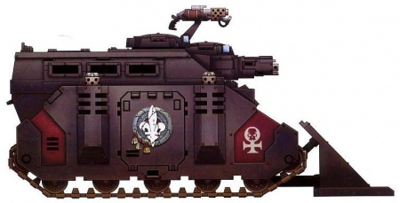
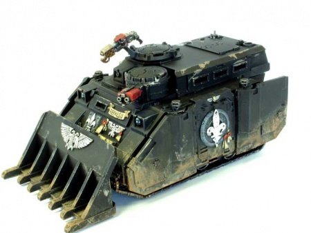

# 1480 镇压者重型装甲运兵车 Repressor Heavily Armoured Personnel Carrier

精校状态：中文行文已逐段精校，部分术语仍为暂定

分类：载具 / 地面 / 轻型

原文来源：https://www.bilibili.com/opus/1214012878936342560

原作者：帝国神选罐头

原文时间：2026年06月15日 12:30

[返回分类目录](目录.md) · [全书目录](../../目录.md)

<!-- A1480-B0001 -->
**英文原文**

The Repressor is a heavily armoured personnel carrier used by the Adeptus Arbites and the Adepta Sororitas. Repressors are a variant of the Rhino, converted to extend the transport compartment and adding firing slits for the passengers' weaponry.

<!-- /A1480-B0001 -->

<!-- A1480-B0002 -->

原译文

镇压者是一种重型装甲运兵车，由法务部和修女会使用。镇压者是犀牛的一种变体，经过改装可以扩展运输隔间，并为乘客的武器增加开火口。

**校订译文**

镇压者是法务部与修女会使用的重装甲运兵车，属于犀牛变体。它扩大了载员舱，并增设射击缝，使乘员能够使用随身武器向外开火。

<!-- /A1480-B0002 -->

<!-- A1480-B0003 图片 -->

<!-- A1480-B0004 -->

原译文

Repressor 镇压者

**校订译文**

Repressor 镇压者

<!-- /A1480-B0004 -->

<!-- A1480-B0005 -->
## Overview 概述

<!-- /A1480-B0005 -->

<!-- A1480-B0006 -->
**英文原文**

The Repressor was originally used as an armoured personnel carrier by the Adeptus Arbites as a means of crowd suppression. The Sisters of Battle first used the Repressor on the Cardinal World of Avignor during the Avignor Uprising, when agent-provocateurs of a heretical sect caused a crowd of a million pilgrims to riot. The local Precincts was overrun by the mob, and the Battle Sisters of the Sacred Rose Preceptory, currently guarding the Cardinal's Palace, offered their aid. They replaced the Repressors' original non-lethal weaponry of water cannons and grenade launchers for the heavy flamers favoured by their order, then took to the streets to purge the heretics from Avignor.

<!-- /A1480-B0006 -->

<!-- A1480-B0007 -->

原译文

镇压者最初被法务部用作装甲运兵车，作为镇压人群的手段。战斗修女在阿维格诺尔叛乱期间首次使用了阿维格诺尔红衣主教世界的镇压者，当时一个异端教派的煽动者特工导致了100万朝圣者暴动。当地分区被暴徒占领，目前守卫红衣主教宫殿的神圣玫瑰分殿的战斗修女提供了援助。他们将镇压者最初的非致命武器 — 水炮和榴弹发射器 — 替换为他们修会中青睐的重型火焰枪，然后走上街头将异教徒从阿维格诺尔清除出去。

**校订译文**

镇压者最初由法务部用作防暴装甲运兵车。战斗修女第一次使用它，是在枢机世界阿维诺的起义期间：异端教派的煽动者挑起了一百万朝圣者的暴乱，当地执法署遭暴民攻陷。正在守卫枢机主教宫殿的神圣玫瑰分殿修女出手援助，将镇压者原有的水炮、榴弹发射器等非致命武器，换成修会偏爱的重型火焰喷射器，随后开上街头，清剿阿维诺的异端。

<!-- /A1480-B0007 -->

<!-- A1480-B0008 -->
**英文原文**

For years only the Sacred Rose used the Repressors, causing anger with other Orders, until the 291st Synod Prioris of Terra where the issue was hotly debated. Eventually it was decreed that the victory on Avignor had been the Emperor's divine will, and that the Repressor should be included in the canon list of sanctioned vehicles.

<!-- /A1480-B0008 -->

<!-- A1480-B0009 -->

原译文

多年来，只有神圣玫瑰使用了镇压者，引起了其他修会的愤怒，直到第291次泰拉首席会议对此问题进行了激烈的辩论。最终颁布法令，阿维格诺尔的胜利是帝皇的神圣意志，镇压者应该被列入合法载具的标准列表。

**校订译文**

此后多年，只有神圣玫瑰修会使用镇压者，引发了其他修会的不满。直到泰拉第291次首席教务会议，这一问题才经激烈辩论解决。会议最终裁定，阿维诺之胜体现了帝皇的神圣意志，镇压者应列入经教义认可的载具名录。

<!-- /A1480-B0009 -->

<!-- A1480-B0010 图片 -->

<!-- A1480-B0011 -->

原译文

Repressor 镇压者

**校订译文**

Repressor 镇压者

<!-- /A1480-B0011 -->

<!-- A1480-B0012 -->
**英文原文**

Repressors armed with heavy flamers and storm bolters were also utilized by the local Enforcers on Potence ca. M42.

<!-- /A1480-B0012 -->

<!-- A1480-B0013 -->

原译文

大约M42，波腾斯当地的执法者也使用了配备重型火焰枪和风暴爆矢枪的镇压者。

**校订译文**

约在第42千年，波腾斯当地执法者也使用装备重型火焰喷射器与风暴爆矢枪的镇压者。

<!-- /A1480-B0013 -->

<!-- A1480-B0014 -->
**英文原文**

The Repressor is armed with a cupola-mounted Storm Bolter and Pintle-mounted Heavy Flamer, with Dozer Blades as standard equipment. Its modified transport compartment allows all six passengers to fire with any type of weapon from within the protection of the vehicle. It can be further upgraded with Blessed Ammunition, Extra Armour, a Holy Icon, Holy Promethium, a Hunter-killer Missile, Laud Hailers, a searchlight, and smoke launchers.

<!-- /A1480-B0014 -->

<!-- A1480-B0015 -->

原译文

镇压者配备了一个安装在圆顶上的风暴爆矢枪和安装在枢轴上的重型火焰枪，推土机铲刀是标准装备。其经过改装的运输隔间允许所有六名乘客在载具保护范围内用任何类型的武器开火。它可以进一步升级祝福弹药、额外装甲、圣像、圣钷、猎杀导弹、圣歌播放器、探照灯和烟雾发射器。

**校订译文**

镇压者配有车顶指挥塔风暴爆矢枪和枢轴枪架重型火焰喷射器，推土铲为标准装备。改装后的载员舱可让六名乘员全部在装甲保护下使用各类武器射击。可选升级包括祝福弹药、附加装甲、圣像、圣钷、猎杀导弹、圣歌扬声器、探照灯和烟雾发射器。

**校注：** 正文载员写六人，后表B0043写十人；属于英文内部差异，分别照录。

<!-- /A1480-B0015 -->

<!-- A1480-B0016 -->
## Technical Information 技术资料

原题：Technical Information 技术信息

<!-- /A1480-B0016 -->

<!-- A1480-B0017 -->
**英文原文**

Vehicle Name:Repressor

<!-- /A1480-B0017 -->

<!-- A1480-B0018 -->

原译文

载具名称：镇压者

**校订译文**

载具名称：镇压者

<!-- /A1480-B0018 -->

<!-- A1480-B0019 -->
**英文原文**

Forge World of Origin:Dominica II

<!-- /A1480-B0019 -->

<!-- A1480-B0020 -->

原译文

起源铸造世界：多米尼卡二号

**校订译文**

起源铸造世界：多米尼卡二号

<!-- /A1480-B0020 -->

<!-- A1480-B0021 -->
**英文原文**

Known Patterns:I-IIX

<!-- /A1480-B0021 -->

<!-- A1480-B0022 -->

原译文

已知型号：I-IIX

**校订译文**

已知型号：I-IIX

**校注：** 源表型号范围写作 I-IIX，后者为非标准罗马数字写法，原样保留，未擅自改为VIII。

<!-- /A1480-B0022 -->

<!-- A1480-B0023 -->
**英文原文**

Crew:Driver, Gunner

<!-- /A1480-B0023 -->

<!-- A1480-B0024 -->

原译文

乘员：驾驶员，炮手

**校订译文**

乘员：驾驶员，炮手

<!-- /A1480-B0024 -->

<!-- A1480-B0025 -->
**英文原文**

Powerplant:Quad MkII Adaptable Thermic Combustor Reactor

<!-- /A1480-B0025 -->

<!-- A1480-B0026 -->

原译文

动力装置：阔德MkII适应性热燃烧反应堆

**校订译文**

动力装置：4台 MkII 自适应热燃烧反应堆

<!-- /A1480-B0026 -->

<!-- A1480-B0027 -->
**英文原文**

Weight:33 tonnes

<!-- /A1480-B0027 -->

<!-- A1480-B0028 -->

原译文

重量：33吨

**校订译文**

重量：33吨

<!-- /A1480-B0028 -->

<!-- A1480-B0029 -->
**英文原文**

Length:8.7m including dozer

<!-- /A1480-B0029 -->

<!-- A1480-B0030 -->

原译文

长度：8.7m，包括推土机

**校订译文**

长度：8.7米（含推土铲）

<!-- /A1480-B0030 -->

<!-- A1480-B0031 -->
**英文原文**

Width:4.5m

<!-- /A1480-B0031 -->

<!-- A1480-B0032 -->

原译文

宽度：4.5米

**校订译文**

宽度：4.5米

<!-- /A1480-B0032 -->

<!-- A1480-B0033 -->
**英文原文**

Height:4.3m

<!-- /A1480-B0033 -->

<!-- A1480-B0034 -->

原译文

高度：4.3米

**校订译文**

高度：4.3米

<!-- /A1480-B0034 -->

<!-- A1480-B0035 -->
**英文原文**

Ground Clearance:0.44m

<!-- /A1480-B0035 -->

<!-- A1480-B0036 -->

原译文

离地间隙：0.44m

**校订译文**

离地间隙：0.44米

<!-- /A1480-B0036 -->

<!-- A1480-B0037 -->
**英文原文**

Fording Depth:1.2m

<!-- /A1480-B0037 -->

<!-- A1480-B0038 -->

原译文

涉水深度：1.2m

**校订译文**

涉水深度：1.2米

<!-- /A1480-B0038 -->

<!-- A1480-B0039 -->
**英文原文**

Max Speed - on road:55 kph

<!-- /A1480-B0039 -->

<!-- A1480-B0040 -->

原译文

最大行驶速度：55公里/小时

**校订译文**

最大公路速度：55公里/小时

<!-- /A1480-B0040 -->

<!-- A1480-B0041 -->
**英文原文**

Max Speed - off road:35 kph

<!-- /A1480-B0041 -->

<!-- A1480-B0042 -->

原译文

最大越野速度：35公里/小时

**校订译文**

最大越野速度：35公里/小时

<!-- /A1480-B0042 -->

<!-- A1480-B0043 -->
**英文原文**

Transport Capacity:10

<!-- /A1480-B0043 -->

<!-- A1480-B0044 -->

原译文

运输能力：10

**校订译文**

载员能力：10人

<!-- /A1480-B0044 -->

<!-- A1480-B0045 -->
**英文原文**

Access Points:3

<!-- /A1480-B0045 -->

<!-- A1480-B0046 -->

原译文

入口：3

**校订译文**

出入口：3处

<!-- /A1480-B0046 -->

<!-- A1480-B0047 -->
**英文原文**

Main Armament:Cupola mounted Storm Bolter

<!-- /A1480-B0047 -->

<!-- A1480-B0048 -->

原译文

主要武器：安装在圆顶上的风暴爆矢枪

**校订译文**

主武器：车顶指挥塔风暴爆矢枪

<!-- /A1480-B0048 -->

<!-- A1480-B0049 -->
**英文原文**

Secondary Armament:Pintle mounted Heavy Flamer

<!-- /A1480-B0049 -->

<!-- A1480-B0050 -->

原译文

次要武器：枢轴重型火焰枪

**校订译文**

副武器：枢轴枪架重型火焰喷射器

<!-- /A1480-B0050 -->

<!-- A1480-B0051 -->
**英文原文**

Traverse:180 degrees

<!-- /A1480-B0051 -->

<!-- A1480-B0052 -->

原译文

横向：180度

**校订译文**

水平射界：180°

<!-- /A1480-B0052 -->

<!-- A1480-B0053 -->
**英文原文**

Elevation:From -15 to +35 degrees

<!-- /A1480-B0053 -->

<!-- A1480-B0054 -->

原译文

仰角：-15至+35度

**校订译文**

俯仰角：−15°至+35°

<!-- /A1480-B0054 -->

<!-- A1480-B0055 -->
**英文原文**

Main Ammunition:4000 rounds

<!-- /A1480-B0055 -->

<!-- A1480-B0056 -->

原译文

主要弹药：4000发

**校订译文**

主武器载弹量：4000发

<!-- /A1480-B0056 -->

<!-- A1480-B0057 -->
**英文原文**

Secondary Ammunition:10 shots

<!-- /A1480-B0057 -->

<!-- A1480-B0058 -->

原译文

次要弹药：10发

**校订译文**

副武器弹药：可供10次射击

<!-- /A1480-B0058 -->

<!-- A1480-B0059 -->
### Armour 装甲

<!-- /A1480-B0059 -->

<!-- A1480-B0060 -->
**英文原文**

Superstructure:60mm

<!-- /A1480-B0060 -->

<!-- A1480-B0061 -->

原译文

上部结构：60mm

**校订译文**

上部结构：60mm

<!-- /A1480-B0061 -->

<!-- A1480-B0062 -->
**英文原文**

Hull:60mm

<!-- /A1480-B0062 -->

<!-- A1480-B0063 -->

原译文

车体：60mm

**校订译文**

车体：60mm

<!-- /A1480-B0063 -->

<!-- A1480-B0064 -->
**英文原文**

Gun Mantlet:N/A

<!-- /A1480-B0064 -->

<!-- A1480-B0065 -->

原译文

炮盾：无

**校订译文**

炮盾：无

<!-- /A1480-B0065 -->

<!-- A1480-B0066 -->
**英文原文**

Vehicle Designation:0120-766-0822-RE003

<!-- /A1480-B0066 -->

<!-- A1480-B0067 -->

原译文

载具编号：0120-766-0822-RE003

**校订译文**

载具编号：0120-766-0822-RE003

<!-- /A1480-B0067 -->

<!-- A1480-B0068 -->
**英文原文**

Firing Ports:2

<!-- /A1480-B0068 -->

<!-- A1480-B0069 -->

原译文

开火口：2

**校订译文**

射击孔：2处

<!-- /A1480-B0069 -->

<!-- A1480-B0070 -->
**英文原文**

Turret:60mm

<!-- /A1480-B0070 -->

<!-- A1480-B0071 -->

原译文

炮塔：60mm

**校订译文**

炮塔：60mm

<!-- /A1480-B0071 -->

本篇核心术语与暂定项

以下列出本篇出现的英文原形及核心术语表用词。同形词可能指不同对象，具体词义以本篇正文和校注为准；单复数、别名和仅见于图注的名称可能尚未列入。完整候选见[术语表](../../术语表/双语术语候选.csv)。

| 英文 | 采用中文 | 状态 |
| --- | --- | --- |
| Adepta Sororitas | 修女会 | 官方已核对 |
| Equipment | 装备 | 编辑用语已统一 |
| Emperor | 帝皇 | 官方已核对 |
| Adeptus Arbites | 法务部 | 暂定 |
| Forge World | 铸造世界 | 暂定·官方待核 |
| Terra | 泰拉 | 暂定·官方待核 |
| Hunter-Killer | 猎杀者 | 暂定·官方待核 |
| Sisters of Battle | 战斗修女 | 暂定·官方待核 |
| Enforcers | 地方执法者 | 暂定·官方待核 |
| Cardinal | 红衣主教 | 暂定 |
| Rhino | 犀牛战车 | 官方已核对 |
| Flamers | 火妖（奸奇单位）／火焰喷射器（武器） | 语境定译·对应官译已核 |
| Mob | 战群（欧克组织） | 暂定·官方待核 |
| Gun | 甘 | 暂定·官方待核 |
| Cardinal World | 红衣主教世界 | 暂定·官方待核 |
| Avignor | 阿维诺 | 暂定·官方待核 |
| Hunter-killer missile | 猎杀导弹 | 官方已核对 |
| Promethium | 钷素 | 暂定·官方待核 |
| Bolter | 爆矢枪 | 暂定·官方待核 |
| Storm bolter | 风暴爆矢枪 | 官方已核对 |
| Flamer | 火焰喷射器（武器）／火妖（奸奇单位） | 语境定译·对应官译已核 |
| Heavy flamer | 重型火焰喷射器 | 官方已核对 |
| Grenade | 手榴弹 | 暂定·官方待核 |
| Extra Armour | 额外装甲 | 暂定·官方待核 |
| Repressor | 镇压者装甲车 | 暂定·官方待核 |
| Avignor Uprising | 阿维诺起义 | 暂定·官方待核 |
| Synod Prioris | 首席教务会议 | 暂定·官方待核 |
| Potence | 波腾斯 | 暂定·官方待核 |
| Dominica II | 多米尼卡二号 | 暂定·官方待核 |

