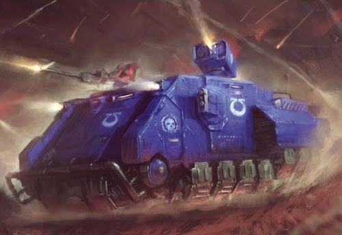

# 1483 脉冲反重力运输战车 Impulsor Grav Tank Transport

精校状态：中文行文已逐段精校，部分术语仍为暂定

分类：载具 / 地面 / 轻型

原文来源：https://www.bilibili.com/opus/1037408505211912192

原作者：帝国神选罐头

原文时间：2025年02月24日 14:34

[返回分类目录](目录.md) · [全书目录](../../目录.md)

原篇名：冲击者反重力运输坦克 Impulsor Grav Tank Transport

<!-- A1483-B0001 -->
**英文原文**

The Impulsor is a newly unleashed grav Tank transport, that is used by Primaris Space Marines.

<!-- /A1483-B0001 -->

<!-- A1483-B0002 -->

原译文

脉冲战车是一种新推出的反重力坦克运输车，由原铸星际战士使用。

**校订译文**

脉冲战车是一种新近投入使用的反重力运输坦克，由原铸星际战士使用。

<!-- /A1483-B0002 -->

<!-- A1483-B0003 图片 -->

<!-- A1483-B0004 -->

原译文

Impulsor 脉冲战车

**校订译文**

Impulsor 脉冲战车

<!-- /A1483-B0004 -->

<!-- A1483-B0005 -->
## Overview 概述

<!-- /A1483-B0005 -->

<!-- A1483-B0006 -->
**英文原文**

The Impulsor is a lightly armored and fast-moving assault transport favored by Vanguard Space Marines. Benefiting from the same advanced gravitic-impulsion technology used by Repulsors, the Impulsor boasts vectored thrusters that give the vehicle a large degree of speed. Its open-backed design allows it to transport a squad of Space Marines directly into battle, entirely by bypassing obstacles such as trenches, river deltas, toxic runoff, and the like. Typically, these vehicles are saved for the delivery of the killing blow by Vanguard forces, or else employed in a similar capacity to the Rhino by Primaris forces who wish to deploy mass armored columns or perform rapid flanking maneuvers.

<!-- /A1483-B0006 -->

<!-- A1483-B0007 -->

原译文

脉冲战车是一种轻装甲、快速移动的突击运输车，受到先锋星际战士的青睐。得益于与角斗士坦克相同的先进反重力技术，脉冲战车拥有矢量推进器，为车辆提供了很大的速度。它的开放式设计使其能够直接将一队星际战士运送到战斗中，完全绕过战壕、河流三角洲、有毒径流等障碍物。通常，这些车辆被留存下来，以便先锋部队进行致命打击，或者被希望部署大规模装甲纵队或进行快速侧翼机动的主力部队以与犀牛装甲车类似的方式使用。

**校订译文**

脉冲战车是一种装甲较轻、速度很快的突击运输车，尤其受到先锋星际战士青睐。它采用与反重力战车相同的先进重力推进技术，并以矢量推进器获得高速机动能力。后部敞开的设计便于它将整支星际战士小队直接送入战斗，轻易越过战壕、河流三角洲和有毒废液等障碍。这类车辆通常被留作先锋部队施加致命一击之用；其他原铸部队若要大规模部署装甲纵队或快速包抄侧翼，也会像使用犀牛一样运用脉冲战车。

**校注：** 英文 Repulsors 为反重力战车，不是Gladiator角斗士；Primaris forces 为原铸部队，不是主力部队。

<!-- /A1483-B0007 -->

<!-- A1483-B0008 图片 -->

<!-- A1483-B0009 -->

原译文

Ultramarines Impulsor 极限战士脉冲战车

**校订译文**

Ultramarines Impulsor 极限战士脉冲战车

<!-- /A1483-B0009 -->

<!-- A1483-B0010 -->
**英文原文**

As befits a vehicle that is often its squads only support in hostile territory, the Impulsor can be rapidly refitted with a variety of weapons and defensive systems. These include an advanced shield dome atop its hull that sheathes its in a shimmering refractor field. Forward reconnaissance missions see it use envoy-class vox and auspex arrays, while those squads requiring additional fire support can call upon the Bellicatus Missile Array or twinned Icarus Ironhail Heavy Stubbers. Otherwise, it can mount an orbital comms array to call in an orbital bombardment. The Impulsor is also equipped with advanced optics.

<!-- /A1483-B0010 -->

<!-- A1483-B0011 -->

原译文

由于脉冲战车通常是其小队在敌对领土上的唯一支援车辆，因此可以快速改装各种武器和防御系统。其中包括车体顶部的先进防护穹顶，将其包裹在闪烁的折射立场中。在前方侦察任务中，它使用使节级音阵和鸟卜仪阵列，而那些需要额外火力支援的小队可以调用贝利卡图斯导弹阵列或双联伊卡洛斯铁雹重机枪。否则，它可以安装一个轨道通信阵列来进行轨道轰炸。脉冲战车还配备了先进的光学元件。

**校订译文**

脉冲战车常是小队深入敌境时唯一的支援，因此能迅速换装多种武器和防御系统。例如，车顶先进的护盾穹顶可使整车笼罩在闪烁的折射力场中。执行前出侦察时，它会采用使节级通讯与探测阵列；需要额外火力支援时，则可装载贝利卡图斯导弹阵列或成对伊卡洛斯铁雹重机枪。它也可安装轨道通讯阵列，请求轨道轰炸。此外，脉冲战车还配有先进光学设备。

**校注：** comms array 用于呼叫轨道轰炸，不是车辆本身实施轰炸。

<!-- /A1483-B0011 -->

本篇核心术语与暂定项

以下列出本篇出现的英文原形及核心术语表用词。同形词可能指不同对象，具体词义以本篇正文和校注为准；单复数、别名和仅见于图注的名称可能尚未列入。完整候选见[术语表](../../术语表/双语术语候选.csv)。

| 英文 | 采用中文 | 状态 |
| --- | --- | --- |
| Space Marines | 星际战士 | 官方已核对 |
| Rhino | 犀牛战车 | 官方已核对 |
| Refractor Field | 折射力场 | 暂定·官方待核 |
| Vanguard | 先锋 | 暂定·官方待核 |
| Repulsors | 反重力战车 | 暂定·官方待核 |
| Impulsor | 脉冲战车（载具）／冲击者（小队名） | 语境定译·载具官译已核 |
| Bellicatus Missile Array | 贝利卡图斯导弹阵列 | 暂定·官方待核 |
| Auspex | 鸟卜仪 | 暂定·官方待核 |

