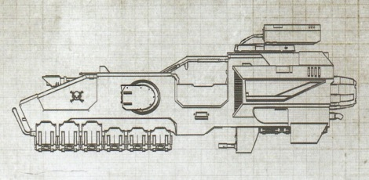
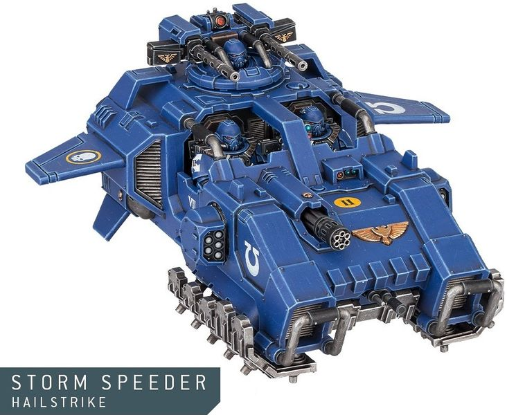
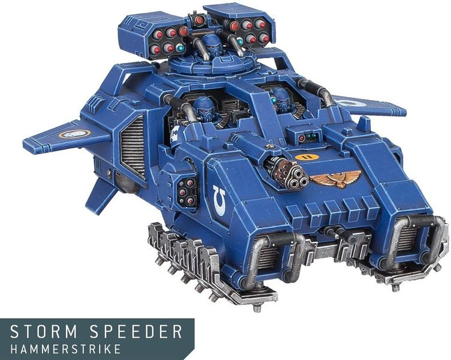
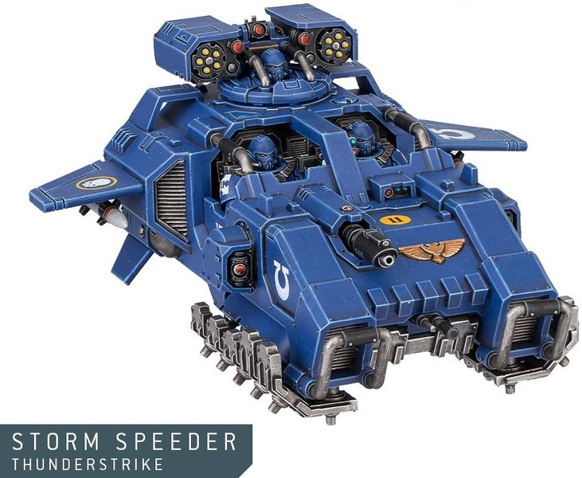

# 1484 风暴速攻艇 Storm Speeder

精校状态：中文行文已逐段精校，部分术语仍为暂定

分类：载具 / 地面 / 重型

原文来源：https://www.bilibili.com/opus/1039569797201788948

原作者：帝国神选罐头

原文时间：2025年03月02日 10:21

[返回分类目录](目录.md) · [全书目录](../../目录.md)

<!-- A1484-B0001 -->
**英文原文**

Storm Speeders are anti-gravity vehicles used by Primaris Space Marines.

<!-- /A1484-B0001 -->

<!-- A1484-B0002 -->

原译文

风暴速攻艇是原铸星际战士使用的反重力载具。

**校订译文**

风暴速攻艇是原铸星际战士使用的反重力载具。

<!-- /A1484-B0002 -->

<!-- A1484-B0003 -->
## Overview 概述

<!-- /A1484-B0003 -->

<!-- A1484-B0004 -->
**英文原文**

The Storm Speeder was developed by Belisarius Cawl as part of the Primaris Project, combining the ancient technologies of Arkhan Land with the brute force of Repulsor technology. Although they look like land speeders and perform a similar function, storm speeders are larger and more heavily armed without compromising maneuverability.

<!-- /A1484-B0004 -->

<!-- A1484-B0005 -->

原译文

风暴速攻艇是由贝利撒留·考尔开发的，是原铸项目的一部分，将阿坎·兰德的古老技术与反击者技术的强大力量相结合。尽管它们看起来像兰德速攻艇，并执行类似的功能，但风暴速攻艇更大，装备更重，且不影响机动性。

**校订译文**

风暴速攻艇由贝利萨留斯·考尔作为原铸计划的一部分研制，将阿坎·兰德的古老技术与反重力战车技术的强劲动力结合。它的外形和用途虽与兰德速攻艇相近，却在保持机动性的同时，拥有更大体积和更重武装。

<!-- /A1484-B0005 -->

<!-- A1484-B0006 图片 -->

<!-- A1484-B0007 -->

原译文

Storm Speeder Thunderstrike 风暴速攻艇雷击

**校订译文**

Storm Speeder Thunderstrike 雷霆型风暴速攻艇

<!-- /A1484-B0007 -->

<!-- A1484-B0008 -->
**英文原文**

Storm Speeders come in three patterns, each of which is equipped with a blistering array of heavy weaponry designed to eliminate a particular type of enemy.

<!-- /A1484-B0008 -->

<!-- A1484-B0009 -->

原译文

风暴速攻艇有三种型号，每种型号都配备了一系列重型武器，旨在消灭特定类型的敌人。

**校订译文**

风暴速攻艇分为三种型号，各自配备强大的重武器组合，用于消灭特定类型的敌人。

<!-- /A1484-B0009 -->

<!-- A1484-B0010 -->
**英文原文**

Storm Speeder Hailstrike - An anti-barricade and infantry variant, armed with an Onslaught Gatling Cannon, two Ironhail Heavy Stubbers, and a pair of Fragstorm Grenade Launchers.

<!-- /A1484-B0010 -->

<!-- A1484-B0011 -->

原译文

风暴速攻艇雹击 - 一种反路障和步兵变体，装备有一门突击加特林炮、两门铁雹重机枪和一对破片榴弹发射器。

**校订译文**

冰雹型风暴速攻艇——专门摧毁障碍工事并杀伤步兵，配备猛攻加特林炮、两挺铁雹重机枪和一对破片风暴榴弹发射器。

<!-- /A1484-B0011 -->

<!-- A1484-B0012 图片 -->

<!-- A1484-B0013 -->

原译文

Storm Speeder Hailstrike 风暴速攻艇雹击

**校订译文**

Storm Speeder Hailstrike 冰雹型风暴速攻艇

<!-- /A1484-B0013 -->

<!-- A1484-B0014 -->
**英文原文**

Storm Speeder Hammerstrike - An anti-armour, anti-trench, and anti-bunker specialist variant, armed with a Hammerstrike Launcher, Krakstorm Grenade Launchers, and a Melta Destroyer.

<!-- /A1484-B0014 -->

<!-- A1484-B0015 -->

原译文

风暴速攻艇锤击 - 一种反装甲、反战壕和反掩体的专业变体，装备有锤击发射器、穿甲风暴榴弹发射器和热熔毁灭枪。

**校订译文**

锤击型风暴速攻艇——专门打击装甲、战壕和掩体，配备锤击导弹发射器、穿甲风暴榴弹发射器和热熔毁灭炮。

<!-- /A1484-B0015 -->

<!-- A1484-B0016 图片 -->

<!-- A1484-B0017 -->

原译文

Storm Speeder Hammerstrike 风暴速攻艇锤击

**校订译文**

Storm Speeder Hammerstrike 锤击型风暴速攻艇

<!-- /A1484-B0017 -->

<!-- A1484-B0018 -->
**英文原文**

Storm Speeder Thunderstrike - An anti-tank and anti-aircraft specialist variant, armed with Stormfury Missiles, Thunderstrike Las-Talon, and twin Icarus Rocket Pods.

<!-- /A1484-B0018 -->

<!-- A1484-B0019 -->

原译文

风暴速攻艇雷击 - 一种反坦克和防空专业变体，配备风暴之怒导弹、雷击激光爪和双联伊卡洛斯火箭巢。

**校订译文**

雷霆型风暴速攻艇——专门执行反坦克与防空任务，配备风暴之怒导弹、雷霆激光爪和一对伊卡洛斯火箭舱。

**校注：** 车型按GW09/GW10官译“雷霆型”；武器完整名无直接官译，依相同词根暂用雷霆激光爪。

<!-- /A1484-B0019 -->

<!-- A1484-B0020 图片 -->

<!-- A1484-B0021 -->

原译文

Storm Speeder Thunderstrike 风暴速攻艇雷击

**校订译文**

Storm Speeder Thunderstrike 雷霆型风暴速攻艇

<!-- /A1484-B0021 -->

本篇核心术语与暂定项

以下列出本篇出现的英文原形及核心术语表用词。同形词可能指不同对象，具体词义以本篇正文和校注为准；单复数、别名和仅见于图注的名称可能尚未列入。完整候选见[术语表](../../术语表/双语术语候选.csv)。

| 英文 | 采用中文 | 状态 |
| --- | --- | --- |
| Space Marines | 星际战士 | 官方已核对 |
| Arkhan Land | 阿坎·兰德 | 暂定·官方待核 |
| Ancient | 旗手 | 官方已核对 |
| Belisarius Cawl | 贝利萨留斯·考尔 | 官方已核对 |
| Destroyer | 毁灭者 | 暂定·官方待核 |
| Land Speeders | 兰德速攻艇 | 暂定·官方待核 |
| Storm Speeders | 风暴速攻艇 | 暂定·官方待核 |
| Storm Speeder | 风暴速攻艇 | 暂定·官方待核 |
| Repulsor | 反重力战车 | 官方已核 |
| Onslaught Gatling Cannon | 猛攻加特林炮 | 暂定·官方待核 |
| Melta Destroyer | 热熔毁灭炮 | 暂定·官方待核 |
| Las-Talon | 激光爪 | 暂定·官方待核 |
| Thunderstrike Las-Talon | 雷霆激光爪 | 官方词根参考·全称待核 |
| Grenade | 手榴弹 | 暂定·官方待核 |
| Storm Speeder Hailstrike | 冰雹型风暴速攻艇 | 官方已核对 |
| Storm Speeder Hammerstrike | 锤击型风暴速攻艇 | 官方已核对 |
| Storm Speeder Thunderstrike | 雷霆型风暴速攻艇 | 官方已核对 |

