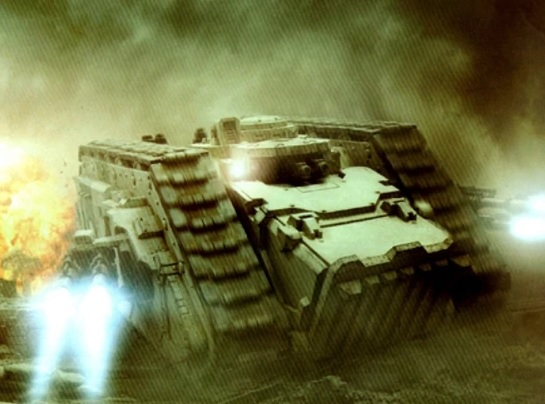
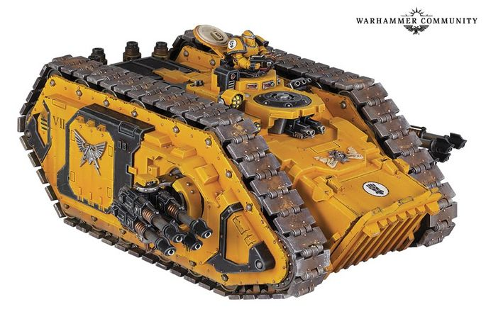

# 1485 斯巴达突击坦克 Spartan Assault Tank

精校状态：中文行文已逐段精校，部分术语仍为暂定

分类：载具 / 地面 / 重型

原文来源：https://www.bilibili.com/opus/1046310705431576624

原作者：帝国神选罐头

原文时间：2025年03月20日 14:19

[返回分类目录](目录.md) · [全书目录](../../目录.md)

<!-- A1485-B0001 -->
**英文原文**

The Spartan Assault Tank was a large heavy transport designed during the Great Crusade and Horus Heresy to carry a full squad of Terminator-armored Marines.

<!-- /A1485-B0001 -->

<!-- A1485-B0002 -->

原译文

斯巴达突击坦克是在大远征和荷鲁斯叛乱时期设计的一种大型重型运输工具，用于运送全小队的终结者盔甲星际战士。

**校订译文**

斯巴达突击坦克是大远征和荷鲁斯之乱时期设计的大型重装运输载具，可搭载一整支身穿终结者装甲的星际战士小队。

<!-- /A1485-B0002 -->

<!-- A1485-B0003 图片 -->

<!-- A1485-B0004 -->

原译文

Death Guard Spartan Assault Tank 死亡守卫斯巴达突击坦克

**校订译文**

Death Guard Spartan Assault Tank 死亡守卫斯巴达突击坦克

<!-- /A1485-B0004 -->

<!-- A1485-B0005 -->
## Overview 概述

<!-- /A1485-B0005 -->

<!-- A1485-B0006 -->
**英文原文**

Originally designed to get through the Ring of Death surrounding the city of Aries Primus on Mars, the standard Land Raider at the time could not transport Terminators. Such was the lethality of the Ring of Death's plasma defence systems, that even with use of the Spartans, only the fraction of Terminator squads could hope to survive the advance.

<!-- /A1485-B0006 -->

<!-- A1485-B0007 -->

原译文

最初设计用于穿过火星上白羊座主城周围的死亡之环，当时的标准兰德掠袭者无法运输终结者。这就是死亡之环等离子防御系统的致命性，即使使用斯巴达，也只有一小部分终结者小队有希望在进攻中幸存下来。该设计基于著名的兰德掠袭者。

**校订译文**

斯巴达最初是为穿越火星白羊座主城周围的“死亡之环”而设计的，当时标准兰德掠袭者尚无法运输终结者。死亡之环的等离子防御系统杀伤力极强，即便乘坐斯巴达，也只有少数终结者小队有望在突进途中幸存。

**校注：** 原译末句“该设计基于著名的兰德掠袭者”无对应英文，删除该处额外句子。

<!-- /A1485-B0007 -->

<!-- A1485-B0008 -->
**英文原文**

The original Spartan had the standard Land Raider armament of two twin-linked lascannons (heavy bolters were not standard then) but also mounted either a heavy bolter or heavy flamer on a turret on top. It was widely spread after the Heresy, but disappeared when the standard Land Raider was re-designed to carry Terminators.

<!-- /A1485-B0008 -->

<!-- A1485-B0009 -->

原译文

最初的斯巴达拥有两门双联激光炮的标准兰德掠袭者武器（当时重型爆矢枪不是标准武器），但也在顶部的炮塔上安装了重型爆矢枪或重型火焰枪。叛乱之后，它被广泛传播，但当标准的兰德掠袭者被重新设计为携带终结者时，它就消失了。

**校订译文**

最早的斯巴达配备当时兰德掠袭者的标准武装——两组双联激光炮，另在顶部炮塔安装重型爆矢枪或重型火焰喷射器；当时重型爆矢枪还不是兰德掠袭者的标准配置。荷鲁斯之乱后，斯巴达曾广泛使用，但标准兰德掠袭者改进为可搭载终结者后，这种早期斯巴达便退出了使用。

**校注：** 此段称早期型消失，下一段又介绍如今型号，中文保留时代区分。

<!-- /A1485-B0009 -->

<!-- A1485-B0010 -->
**英文原文**

The Spartan design used today features the twin hull-mounted heavy bolters seen on contemporary Land Raider designs, as well as a pair of sponsons fitted with a deadly quad-lascannon battery each. It is able to transport 25 Space Marines in power armour and has the largest transport capacity of any dedicated transport vehicle used in the Imperium save the Gorgon. Additionally, it is considerably faster than other Land Raider variants despite its increased size, due to its reactor-driven motive drive systems and secrets. Spartans could further be outfitted with protective Flare Shields.

<!-- /A1485-B0010 -->

<!-- A1485-B0011 -->

原译文

如今使用的斯巴达设计采用了当代兰德掠袭者设计中常见的双联重型爆矢枪，以及一对分别装有四门致命激光炮的侧舷炮。它能够运输25名身穿动力盔甲的星际战士，是除美杜莎外帝国中使用的任何专用运输车中运输能力最大的。此外，由于其反应堆驱动的动力驱动系统和秘诀，尽管其尺寸有所增加，但它比其他兰德掠袭者变体快得多。斯巴达还可以配备防护闪光盾牌。

**校订译文**

如今的斯巴达装有现代兰德掠袭者常见的车体成对重型爆矢枪，两侧舷台则各装一组致命的四联激光炮。它可搭载二十五名动力甲星际战士，在帝国专用运输载具中，载员量仅次于戈尔贡。虽然体积更大，反应堆驱动的传动系统及其中的隐秘技术仍使它比其他兰德掠袭者变体快得多。斯巴达还可加装闪光护盾。

**校注：** Gorgon 是另一车型，不等于Medusa美杜莎；暂按核心词根戈尔贡区分。原文对最大载量的断言按资料语境保留。

<!-- /A1485-B0011 -->

<!-- A1485-B0012 图片 -->

<!-- A1485-B0013 -->

原译文

Imperial Fists Spartan Assault Tank 帝国之拳斯巴达突击坦克

**校订译文**

Imperial Fists Spartan Assault Tank 帝国之拳斯巴达突击坦克

<!-- /A1485-B0013 -->

<!-- A1485-B0014 -->
**英文原文**

Many Space Marine Chapters still maintain these huge war machines as part of their arsenals and deploy them into warzones where even the mighty Land Raider would be torn asunder. The Spartan is mainly popular in such Chapters who possess many Terminator suits, such as the Minotaurs. Chaos Space Marine warbands still operate Spartans that date back to the Great Crusade, with most belonging to the original Traitor Legions.

<!-- /A1485-B0014 -->

<!-- A1485-B0015 -->

原译文

许多星际战士战团仍然将这些巨大的战争机器作为其军械库的一部分，并将其部署到战区，在那里，即使是强大的兰德掠袭者也会被撕裂。斯巴达主要在拥有许多终结者套装的战团中很受欢迎，比如米诺陶。混沌星际战士仍然经营着可以追溯到大远征的斯巴达，其中大多数属于最初的叛徒军团。

**校订译文**

许多星际战士战团仍保有这些庞大战争机器，并将其投入连强大的兰德掠袭者也可能被撕碎的险恶战区。拥有大量终结者装甲的战团尤其偏爱斯巴达，例如米诺陶。混沌星际战士战帮也继续使用可追溯至大远征时期的机体，大多归属于最初的叛徒军团。

<!-- /A1485-B0015 -->

<!-- A1485-B0016 -->
## Technical Information 技术信息

原题：Technical Information 技术军士

<!-- /A1485-B0016 -->

<!-- A1485-B0017 -->
**英文原文**

Vehicle Name:Spartan Assault Tank

<!-- /A1485-B0017 -->

<!-- A1485-B0018 -->

原译文

车辆名称：斯巴达突击坦克

**校订译文**

车辆名称：斯巴达突击坦克

<!-- /A1485-B0018 -->

<!-- A1485-B0019 -->
**英文原文**

Forge World of Origin:Anvilus Nine

<!-- /A1485-B0019 -->

<!-- A1485-B0020 -->

原译文

起源铸造世界：安维鲁斯九号

**校订译文**

起源铸造世界：安维鲁斯九号

<!-- /A1485-B0020 -->

<!-- A1485-B0021 -->
**英文原文**

Known Patterns:I-VI

<!-- /A1485-B0021 -->

<!-- A1485-B0022 -->

原译文

已知型号：I-VI

**校订译文**

已知型号：I-VI

<!-- /A1485-B0022 -->

<!-- A1485-B0023 -->
**英文原文**

Crew:Driver, Gunner

<!-- /A1485-B0023 -->

<!-- A1485-B0024 -->

原译文

乘员：驾驶员、炮手

**校订译文**

乘员：驾驶员、炮手

<!-- /A1485-B0024 -->

<!-- A1485-B0025 -->
**英文原文**

Powerplant:Atomantic Reactor core with auxiliary reactor

<!-- /A1485-B0025 -->

<!-- A1485-B0026 -->

原译文

动力装置：带辅助反应堆的原子反应堆堆芯

**校订译文**

动力装置：带辅助反应堆的原子反应堆堆芯

<!-- /A1485-B0026 -->

<!-- A1485-B0027 -->
**英文原文**

Weight:71 tonnes

<!-- /A1485-B0027 -->

<!-- A1485-B0028 -->

原译文

重量：71吨

**校订译文**

重量：71吨

<!-- /A1485-B0028 -->

<!-- A1485-B0029 -->
**英文原文**

Length:10m

<!-- /A1485-B0029 -->

<!-- A1485-B0030 -->

原译文

长度：10米

**校订译文**

长度：10米

<!-- /A1485-B0030 -->

<!-- A1485-B0031 -->
**英文原文**

Width:6.1m

<!-- /A1485-B0031 -->

<!-- A1485-B0032 -->

原译文

宽度：6.1米

**校订译文**

宽度：6.1米

<!-- /A1485-B0032 -->

<!-- A1485-B0033 -->
**英文原文**

Height:5m

<!-- /A1485-B0033 -->

<!-- A1485-B0034 -->

原译文

高度：5米

**校订译文**

高度：5米

<!-- /A1485-B0034 -->

<!-- A1485-B0035 -->
**英文原文**

Ground Clearance:0.5m

<!-- /A1485-B0035 -->

<!-- A1485-B0036 -->

原译文

离地间隙：0.5m

**校订译文**

离地间隙：0.5米

<!-- /A1485-B0036 -->

<!-- A1485-B0037 -->
**英文原文**

Fording Depth:{{{Fording Depth}}}

<!-- /A1485-B0037 -->

<!-- A1485-B0038 -->

原译文

涉水深度：｛｛｛涉水深度｝｝

**校订译文**

涉水深度：未提供

**校注：** 英文保留未展开模板，实际数值缺失。

<!-- /A1485-B0038 -->

<!-- A1485-B0039 -->
**英文原文**

Max Speed - on road45kph

<!-- /A1485-B0039 -->

<!-- A1485-B0040 -->

原译文

最大速度-公路上每小时45公里

**校订译文**

最大公路速度：45公里/小时

<!-- /A1485-B0040 -->

<!-- A1485-B0041 -->
**英文原文**

Max Speed - off road:38kph

<!-- /A1485-B0041 -->

<!-- A1485-B0042 -->

原译文

最大速度-越野：38公里/小时

**校订译文**

最大越野速度：38公里/小时

<!-- /A1485-B0042 -->

<!-- A1485-B0043 -->
**英文原文**

Transport Capacity:25

<!-- /A1485-B0043 -->

<!-- A1485-B0044 -->

原译文

运输能力：25

**校订译文**

载员能力：25人

<!-- /A1485-B0044 -->

<!-- A1485-B0045 -->
**英文原文**

Access Points:N/A

<!-- /A1485-B0045 -->

<!-- A1485-B0046 -->

原译文

入口：无

**校订译文**

出入口：未提供（N/A）

<!-- /A1485-B0046 -->

<!-- A1485-B0047 -->
**英文原文**

Main Armament:2x Sponson-mounted quad Lascannons

<!-- /A1485-B0047 -->

<!-- A1485-B0048 -->

原译文

主武器：2门侧舷四联激光炮

**校订译文**

主武器：2组侧舷四联激光炮

<!-- /A1485-B0048 -->

<!-- A1485-B0049 -->
**英文原文**

Secondary Armament:Twin-Linked Heavy Bolter

<!-- /A1485-B0049 -->

<!-- A1485-B0050 -->

原译文

二级武器：双联重型爆矢枪

**校订译文**

副武器：双联重型爆矢枪

<!-- /A1485-B0050 -->

<!-- A1485-B0051 -->
**英文原文**

Traverse:180°

<!-- /A1485-B0051 -->

<!-- A1485-B0052 -->

原译文

横向：180°

**校订译文**

水平射界：180°

<!-- /A1485-B0052 -->

<!-- A1485-B0053 -->
**英文原文**

Elevation:From -32° to +55°

<!-- /A1485-B0053 -->

<!-- A1485-B0054 -->

原译文

仰角：从-32°到+55°

**校订译文**

俯仰角：−32°至+55°

<!-- /A1485-B0054 -->

<!-- A1485-B0055 -->
**英文原文**

Main Ammunition:Unlimited cell power feed

<!-- /A1485-B0055 -->

<!-- A1485-B0056 -->

原译文

主要弹药：无限电池供电

**校订译文**

主武器弹药：能源电池持续供能，原表记为无限

<!-- /A1485-B0056 -->

<!-- A1485-B0057 -->
**英文原文**

Secondary Ammunition:800 rounds

<!-- /A1485-B0057 -->

<!-- A1485-B0058 -->

原译文

二级弹药：800发

**校订译文**

副武器载弹量：800发

<!-- /A1485-B0058 -->

<!-- A1485-B0059 -->
### Armour 装甲

<!-- /A1485-B0059 -->

<!-- A1485-B0060 -->
**英文原文**

Superstructure:95mm

<!-- /A1485-B0060 -->

<!-- A1485-B0061 -->

原译文

上部结构：95毫米

**校订译文**

上部结构：95毫米

<!-- /A1485-B0061 -->

<!-- A1485-B0062 -->
**英文原文**

Hull:95mm

<!-- /A1485-B0062 -->

<!-- A1485-B0063 -->

原译文

车体：95毫米

**校订译文**

车体：95毫米

<!-- /A1485-B0063 -->

<!-- A1485-B0064 -->
**英文原文**

Gun Mantlet:N/A

<!-- /A1485-B0064 -->

<!-- A1485-B0065 -->

原译文

炮盾：无

**校订译文**

炮盾：无

<!-- /A1485-B0065 -->

<!-- A1485-B0066 -->
**英文原文**

Vehicle Designation:N/A

<!-- /A1485-B0066 -->

<!-- A1485-B0067 -->

原译文

车辆编号：无

**校订译文**

载具编号：未提供（N/A）

<!-- /A1485-B0067 -->

<!-- A1485-B0068 -->
**英文原文**

Firing Ports:N/A

<!-- /A1485-B0068 -->

<!-- A1485-B0069 -->

原译文

开火口：无

**校订译文**

射击孔：未提供（N/A）

<!-- /A1485-B0069 -->

<!-- A1485-B0070 -->
**英文原文**

Turret:N/A

<!-- /A1485-B0070 -->

<!-- A1485-B0071 -->

原译文

炮塔：无

**校订译文**

炮塔：无

<!-- /A1485-B0071 -->

<!-- A1485-B0072 -->
## Known Named Spartan Tanks 著名斯巴达坦克

<!-- /A1485-B0072 -->

<!-- A1485-B0073 -->
**英文原文**

Sire of Calth — of the Ultramarines.

<!-- /A1485-B0073 -->

<!-- A1485-B0074 -->

原译文

考斯之爵 — 极限战士

**校订译文**

考斯之爵号——极限战士。

<!-- /A1485-B0074 -->

<!-- A1485-B0075 -->
**英文原文**

Tombkeeper — of the Death Guard.

<!-- /A1485-B0075 -->

<!-- A1485-B0076 -->

原译文

守墓人 — 死亡守卫

**校订译文**

守墓人号——死亡守卫。

<!-- /A1485-B0076 -->

本篇核心术语与暂定项

以下列出本篇出现的英文原形及核心术语表用词。同形词可能指不同对象，具体词义以本篇正文和校注为准；单复数、别名和仅见于图注的名称可能尚未列入。完整候选见[术语表](../../术语表/双语术语候选.csv)。

| 英文 | 采用中文 | 状态 |
| --- | --- | --- |
| Space Marines | 星际战士 | 官方已核对 |
| Death Guard | 死亡守卫 | 官方已核对 |
| Terminator | 终结者 | 官方已核对 |
| Ultramarines | 极限战士 | 官方已核对 |
| Horus Heresy | 荷鲁斯之乱 | 官方已核对 |
| Imperium | 帝国 | 暂定·简称 |
| Forge World | 铸造世界 | 暂定·官方待核 |
| Great Crusade | 大远征 | 暂定·官方待核 |
| Horus | 荷鲁斯 | 暂定·官方待核 |
| Mars | 火星 | 暂定·官方待核 |
| Calth | 考斯 | 暂定·官方待核 |
| Land Raider | 兰德掠袭者战车 | 官方已核对 |
| Minotaurs | 米诺陶 | 暂定·官方待核 |
| Power Armour | 动力盔甲 | 暂定·官方待核 |
| Space Marine | 星际战士 | 暂定·官方待核 |
| Terminators | 终结者 | 暂定·官方待核 |
| Terminator Squads | 终结者小队 | 暂定·官方待核 |
| Raider | 掠袭者飞艇 | 官方已核对 |
| Primus | 领军 | 官方已核对 |
| The Ring | 圆环 | 暂定·官方待核 |
| Gun | 甘 | 暂定·官方待核 |
| Anvilus Nine | 安维鲁斯九号 | 暂定·官方待核 |
| Anvilus | 安维鲁斯 | 暂定·官方待核 |
| Bolter | 爆矢枪 | 暂定·官方待核 |
| Heavy bolter | 重型爆矢枪 | 官方已核对 |
| Flamer | 火焰喷射器（武器）／火妖（奸奇单位） | 语境定译·对应官译已核 |
| Heavy flamer | 重型火焰喷射器 | 官方已核对 |
| Lascannon | 激光炮 | 官方已核对 |
| Flare Shields | 闪光护盾 | 暂定·官方待核 |
| Gorgon | 戈尔贡 | 暂定·官方待核 |
| Spartan Assault Tank | 斯巴达突击坦克 | 暂定·官方待核 |
| Ring of Death | 死亡之环 | 暂定·官方待核 |
| Aries Primus | 白羊座主城 | 暂定·官方待核 |
| Sire of Calth | 考斯之爵号 | 暂定·官方待核 |

