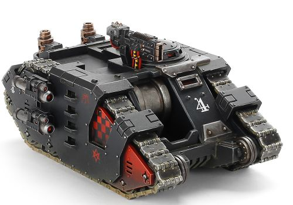
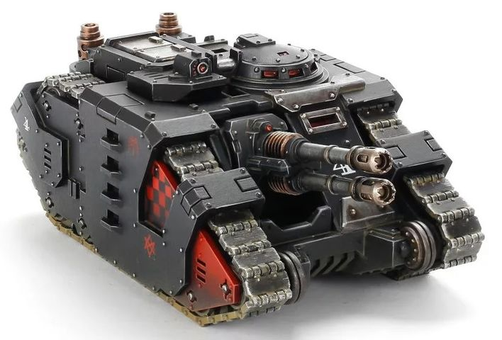
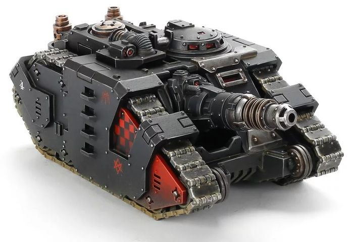
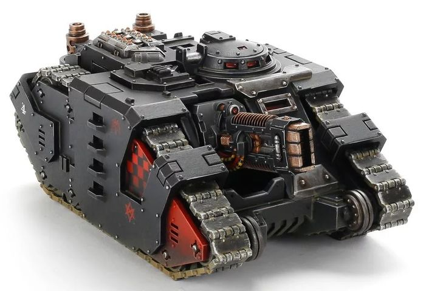

# 1486 军刀突击坦克 Sabre Strike Tank

精校状态：中文行文已逐段精校，部分术语仍为暂定

分类：载具 / 地面 / 重型

原文来源：https://www.bilibili.com/opus/1045950263208181760

原作者：帝国神选罐头

原文时间：2025年03月19日 15:01

[返回分类目录](目录.md) · [全书目录](../../目录.md)

<!-- A1486-B0001 -->
**英文原文**

The Sabre Strike Tank or Sabre Tank Hunter was an Imperial attack vehicle based on the Rhino armoured carrier, incorporating a fixed, forward firing weapon in its front hull. It was used during the Horus Heresy and Great Crusade.

<!-- /A1486-B0001 -->

<!-- A1486-B0002 -->

原译文

军刀突击坦克或军刀坦克猎手是一种基于犀牛装甲车的帝国攻击载具，在其前装甲中装有固定的前射武器。它在荷鲁斯叛乱和大远征期间被使用。

**校订译文**

军刀突击坦克也称军刀坦克猎手，是以犀牛装甲运兵车为基础的帝国攻击载具，在车体前部安装固定向前射击的武器，曾用于大远征和荷鲁斯之乱。

<!-- /A1486-B0002 -->

<!-- A1486-B0003 图片 -->

<!-- A1486-B0004 -->

原译文

Sabre vehicle without a weapons mount 未安装武器的军刀载具

**校订译文**

Sabre vehicle without a weapons mount 未安装武器的军刀载具

<!-- /A1486-B0004 -->

<!-- A1486-B0005 -->
## History 历史

<!-- /A1486-B0005 -->

<!-- A1486-B0006 -->
**英文原文**

The Rhino itself was conceived to be easily modified to answer various specific needs. Many Rhino variations have their origins during the Horus Heresy, when variations of existing vehicles to fulfill new roles became a necessity. The Sabre was one of these modifications, seeing its first use during the earliest days of the Heresy, its design spurred by the need for heavier firepower. The Sabre was one of the type of Rhinos modified during the Heresy wars to mount heavier weapons, this type becoming known as "Tank Hunters" for the role they played during the Heresy. It carried a variety of technological wonders that were newly forged by the adepts of the Mechanicum, from advanced cogitator arrays to multi-axle drive cores, all intended to allow the tank to be operated by a single Space Marine. Besides the Sabre, various types of Tank Hunter were developed, each mounting different heavy weapons, such as missile launchers or lascannon. However, the Sabre was the most common form of Tank Hunter. The Sabre was devised as a part of a new generation of Astartes vehicles alongside the likes of the Sicaran Tank and was developed from experience gathered during the Great Crusade. It embodied a new mobile style of war that departed from the static gun lines of the early Crusade.

<!-- /A1486-B0006 -->

<!-- A1486-B0007 -->

原译文

犀牛本身被认为可以很容易地修改以满足各种特定需求。许多犀牛变种起源于荷鲁斯叛乱时期，当时现有载具的变体成为履行新角色的必要条件。军刀就是这些修改之一，在叛乱的早期就首次使用，其设计受到了更重火力需求的刺激。军刀是叛乱战争期间改装的犀牛类型之一，用于安装更重的武器，这种类型因其在叛乱战争中扮演的角色而被称为“坦克猎手”。它搭载了机械神教们新打造的各种技术奇迹，从先进的齿轮阵列到多轴驱动核心，所有这些都是为了让坦克由一名星际战士操作。除了军刀，还开发了各种类型的坦克猎手，每种坦克猎手都安装了不同的重型武器，如导弹发射器或激光炮。然而，军刀是坦克猎手最常见的形号。军刀是作为新一代阿斯塔特载具的一部分而设计的，与西卡然坦克等载具并列，是根据大远征期间积累的经验开发的。它体现了一种新的移动式战争风格，摆脱了大远征早期的静态火炮战线。

**校订译文**

犀牛从设计之初就便于改装，以满足不同需求。荷鲁斯之乱期间，各方必须让现有车辆承担新任务，许多变体由此诞生。军刀就是其中之一，由增加火力的需要催生，并在叛乱初期投入使用。这些改装犀牛搭载重型武器，因其战场作用被称为“坦克猎手”。军刀集成了机械教新近制造的多种先进技术，从沉思者阵列到多轴驱动核心，都是为了让一名星际战士便能操纵整车。除军刀外，还出现过装备导弹发射器、激光炮等不同重武器的坦克猎手，但军刀最为常见。它与西卡然等车型同属新一代阿斯塔特载具，设计吸取了大远征经验，体现出一种摆脱远征早期静态炮阵、强调机动作战的新思路。

**校注：** 本篇开头称大远征已使用，历史段却说叛乱初期首次投入；保留源文时间差异。cogitator为沉思者，原译齿轮错误。

<!-- /A1486-B0007 -->

<!-- A1486-B0008 图片 -->

<!-- A1486-B0009 -->

原译文

Sabre with Anvilus Snub Autocannon 配备安维鲁斯斥责自动炮的军刀

**校订译文**

Sabre with Anvilus Snub Autocannon 配备安维鲁斯短管自动炮的军刀

<!-- /A1486-B0009 -->

<!-- A1486-B0010 -->
**英文原文**

Fast, rugged and heavily armed, the Sabre served the Legiones Astartes as a strike tank, attacking key enemy targets and destroying them long before they can pose a threat. Once the immediate foe was annihilated by its advanced weaponry, the speed of these vehicles allows them to evade any further counter-attack and reform to strike at the vulnerable flanks of the enemy army, keeping heavy armor suppressed as the infantry advanced.

<!-- /A1486-B0010 -->

<!-- A1486-B0011 -->

原译文

快速、坚固、全副武装的军刀作为突击坦克为阿斯塔特军团提供服务，攻击关键的敌方目标，并在它们构成威胁之前很久就将其摧毁。一旦当前的敌人被其先进的武器消灭，这些载具的速度使它们能够躲避任何进一步的反击和重整，以打击敌军脆弱的侧翼，在步兵前进时压制重型装甲。

**校订译文**

军刀速度快、坚固且火力强，作为阿斯塔特军团的突击坦克，能在敌方关键目标构成威胁前将其摧毁。消灭眼前敌人后，它又能凭速度避开后续反击，重新集结，转而打击敌军薄弱侧翼，在步兵推进时持续压制敌方重装甲。

<!-- /A1486-B0011 -->

<!-- A1486-B0012 图片 -->

<!-- A1486-B0013 -->

原译文

Sabre with Neutron Blaster 配备中子爆破炮的军刀

**校订译文**

Sabre with Neutron Blaster 配备中子爆破炮的军刀

<!-- /A1486-B0013 -->

<!-- A1486-B0014 -->
**英文原文**

The most well remembered combat use of the Sabre was during an incident in which Dark Angels Space Marines had retaken a city from a combined force of Ork Freebooters and Chaos Renegades, only to be pushed back by Ork reinforcements. The Dark Angels fell back past a great bridge spanning the mile-wide crack called the Black Gorge. The bridge itself, a structure of adamantium from the Dark Age of Technology, could not be destroyed; instead, the Dark Angels set up a single squadron of Sabres at a site overlooking the bridge, and allowed the Orks to cross much of the bridge before the Sabres began to fire. First the lead vehicles were destroyed, blocking the bridge's front. With the column halted, the Sabres began firing at the column's rear, blocking any retreat. Then began the slaughter of the entire Ork column.

<!-- /A1486-B0014 -->

<!-- A1486-B0015 -->

原译文

最令人难忘的军刀战斗使用是在一次事件中，黑暗天使星际战士从欧克流寇和混沌叛军的联合部队手中夺回了一座城市，却被欧克增援部队击退。黑暗天使们从一座横跨一英里宽的裂隙的大桥上撤退，这座大桥被称为黑峡谷。这座桥本身是一座来自黑暗技术时代的精金结构，无法被摧毁；相反，黑暗天使在俯瞰大桥的地方组建了一支军刀中队，并在军刀开始开火之前允许欧克蛮人穿过大桥的大部分地区。首先，领头车辆被摧毁，堵塞了大桥的前部。随着纵队的停止，军刀队开始向纵队后方开火，阻止任何撤退。然后开始屠杀整个欧克纵队。

**校订译文**

军刀最著名的一次战例发生在黑暗天使与欧克流寇、混沌叛军的战斗中。黑暗天使刚从联军手中夺回一座城市，便被欧克援军逼退，只得越过一座横跨“黑峡谷”的大桥撤离；该裂谷宽约一英里。大桥是科技黑暗时代留下的精金结构，无法摧毁，于是黑暗天使将一支军刀中队部署在俯瞰桥面的阵地。待欧克纵队大部上桥后，军刀才开火，先击毁前导车辆堵住去路，再轰击队尾封死退路，随后开始歼灭整支欧克纵队。

**校注：** Black Gorge 是裂谷名称，不是桥名；修正指代。

<!-- /A1486-B0015 -->

<!-- A1486-B0016 图片 -->

<!-- A1486-B0017 -->

原译文

Sabre with Volkite Saker 配备爆燃长管炮的军刀

**校订译文**

Sabre with Volkite Saker 配备爆燃长管炮的军刀

<!-- /A1486-B0017 -->

<!-- A1486-B0018 -->
## Armament 军备

<!-- /A1486-B0018 -->

<!-- A1486-B0019 -->
**英文原文**

The tank was designed to quickly close the distance to its target, before utterly destroying it. To achieve this, the Sabre could be fitted with a range of advanced weaponry and fielded in squadrons of up to two tanks. Primary weaponry included a Anvilus Snub Autocannon, Neutron Blaster, or a Volkite Saker. It also sported a top-mounted weapon which included a Heavy Bolter, Multi-Melta, Volkite Culverin or Heavy Flamer. Lastly, it was fitted with side-mounted Missile Launchers which fired low-velocity advanced shaped warheads.

<!-- /A1486-B0019 -->

<!-- A1486-B0020 -->

原译文

该坦克的设计目的是在彻底摧毁目标之前快速接近目标。为了实现这一目标，军刀可以配备一系列先进武器，并以最多两辆坦克的中队部署。主要武器包括安维鲁斯斥责自动炮、中子爆破炮或爆燃长管炮。它还配备了一种顶部安装的武器，其中包括重型爆矢枪、多管热熔、爆燃长炮或重型火焰枪。最后，它配备了侧装式导弹发射器，可以发射低速先进结构的弹头。

**校订译文**

军刀旨在迅速逼近目标并将其彻底摧毁，可配备多种先进武器，以最多两辆组成中队部署。主武器可选安维鲁斯短管自动炮、中子爆破炮或爆燃长管炮；车顶武器可选重型爆矢枪、多管热熔、爆燃长炮或重型火焰喷射器。此外，它还装有侧置导弹发射器，用于发射装配先进聚能战斗部的低速导弹。

**校注：** shaped warheads 指聚能战斗部，不是泛指“先进结构的弹头”。

<!-- /A1486-B0020 -->

本篇核心术语与暂定项

以下列出本篇出现的英文原形及核心术语表用词。同形词可能指不同对象，具体词义以本篇正文和校注为准；单复数、别名和仅见于图注的名称可能尚未列入。完整候选见[术语表](../../术语表/双语术语候选.csv)。

| 英文 | 采用中文 | 状态 |
| --- | --- | --- |
| Space Marines | 星际战士 | 官方已核对 |
| Dark Angels | 黑暗天使 | 官方已核对 |
| Orks | 欧克蛮人 | 官方已核对 |
| Horus Heresy | 荷鲁斯之乱 | 官方已核对 |
| Mechanicum | 机械教 | 暂定·历史称谓 |
| Dark Age of Technology | 黑暗科技时代 | 暂定 |
| Great Crusade | 大远征 | 暂定·官方待核 |
| Horus | 荷鲁斯 | 暂定·官方待核 |
| Legiones Astartes | 阿斯塔特军团 | 暂定·官方待核 |
| Rhino | 犀牛战车 | 官方已核对 |
| Space Marine | 星际战士 | 暂定·官方待核 |
| Rhinos | 犀牛 | 暂定·官方待核 |
| Missile Launchers | 导弹发射器 | 暂定·官方待核 |
| Sabre Strike Tank | 军刀突击坦克 | 暂定·官方待核 |
| Gun | 甘 | 暂定·官方待核 |
| The Dark | 《黑暗》 | 暂定·官方待核 |
| Autocannon | 自动炮 | 暂定·官方待核 |
| Anvilus Snub Autocannon | 安维鲁斯短管自动炮 | 暂定·官方待核 |
| Anvilus | 安维鲁斯 | 暂定·官方待核 |
| Bolter | 爆矢枪 | 暂定·官方待核 |
| Heavy bolter | 重型爆矢枪 | 官方已核对 |
| Neutron Blaster | 中子爆破炮 | 暂定·官方待核 |
| Flamer | 火焰喷射器（武器）／火妖（奸奇单位） | 语境定译·对应官译已核 |
| Heavy flamer | 重型火焰喷射器 | 官方已核对 |
| Multi-melta | 多管热熔 | 官方已核对 |
| Lascannon | 激光炮 | 官方已核对 |
| Volkite Saker | 爆燃长管炮 | 暂定·官方待核 |
| Volkite Culverin | 爆燃长炮 | 暂定·官方待核 |
| Black Gorge | 黑峡谷 | 暂定·官方待核 |

