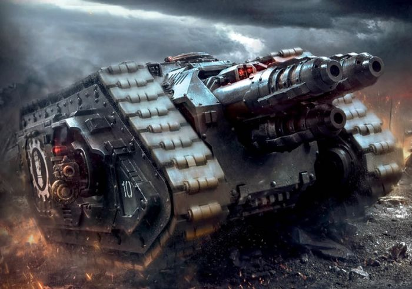
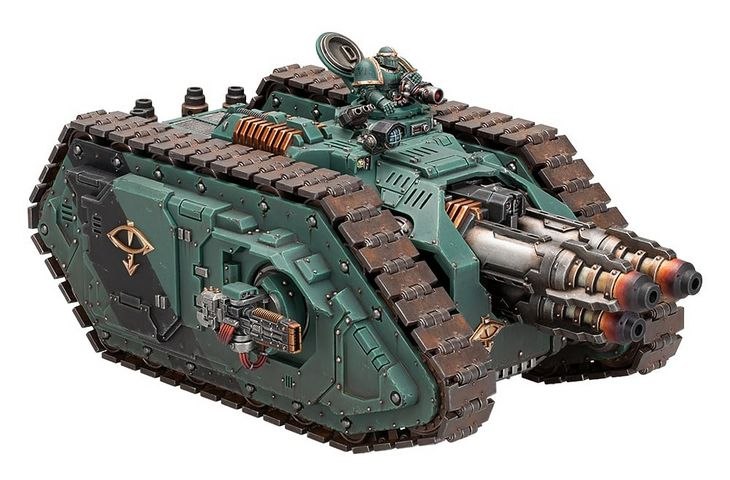

# 1487 三头犬重型坦克歼击车 Cerberus Heavy Tank Destroyer

精校状态：中文行文已逐段精校，部分术语仍为暂定

分类：载具 / 地面 / 重型

原文来源：https://www.bilibili.com/opus/1044126027357356038

原作者：帝国神选罐头

原文时间：2025年03月14日 17:02

[返回分类目录](目录.md) · [全书目录](../../目录.md)

<!-- A1487-B0001 -->
**英文原文**

The Cerberus Heavy Tank Destroyer was an Adeptus Mechanicus and Legio Astartes heavy assault vehicle of the Great Crusade and Horus Heresy era.

<!-- /A1487-B0001 -->

<!-- A1487-B0002 -->

原译文

三头犬重型坦克歼击车是大远征和荷鲁斯叛乱时期的机械神教和阿斯塔特军团重型突击载具。

**校订译文**

三头犬重型坦克歼击车是大远征和荷鲁斯之乱时期，机械修会与阿斯塔特军团使用的重型突击载具。

<!-- /A1487-B0002 -->

<!-- A1487-B0003 图片 -->

<!-- A1487-B0004 -->

原译文

Iron Hands Cerberus 钢铁之手三头犬

**校订译文**

Iron Hands Cerberus 钢铁之手三头犬

<!-- /A1487-B0004 -->

<!-- A1487-B0005 -->
## Overview 概述

<!-- /A1487-B0005 -->

<!-- A1487-B0006 -->
**英文原文**

An experimental design based upon the Spartan Assault Tank chassis, internal capacity was removed to make way for its Neutron Laser Projector and its required power sources. Constructed from reverse-engineered Dark Age of Technology-era wreckage recovered from Deep Hyades-VI by Explorators, controversy arose over the weapon's notorious instability. Nonetheless, the Cerberus and its Neutron Laser Projector proved effective enough to rival the larger and more common Turbo-laser Destructors found on Titans and Shadowswords. For anti-infantry defense, the Cerberus is equipped with sponson Heavy Bolters.

<!-- /A1487-B0006 -->

<!-- A1487-B0007 -->

原译文

基于斯巴达突击坦克底盘的实验设计，内部容量被移除，为中子激光投射器及其所需的电源让路。由探索者从许阿得斯五号深处回收的逆向工程技术黑暗时代残骸制造而成，该武器臭名昭著的不稳定性引发了争议。尽管如此，三头犬及其中子激光投射器被证明足够有效，可以与泰坦和影剑上更大、更常见的涡轮激光破坏炮相媲美。为了反步兵防御，三头犬配备了侧舷重型爆矢枪。

**校订译文**

这种试验车型以斯巴达突击坦克底盘为基础，取消了内部载员空间，改装中子激光投射炮及其所需的动力装置。探索者从深层希亚德斯六号回收了科技黑暗时代的残骸，研制者对其逆向解析，制造出这种武器。但其严重的不稳定性引发了争议。即便如此，三头犬与其中子激光投射炮仍展现出足以匹敌泰坦和影剑上更大、更常见的涡轮激光破坏炮的威力。为防御步兵，车辆侧舷还装有重型爆矢枪。

**校注：** 源文为 Deep Hyades-VI，数字VI是六而非五；Deep作为专名修饰暂译深层，地点与其他Hyades同名项不强行合并。

<!-- /A1487-B0007 -->

<!-- A1487-B0008 -->
**英文原文**

Shortly before the outbreak of the Heresy, the first Cerberus vehicles were delivered to a number of Space Marine Legions. Due to the complexities to maintain the vehicle and growing complaints of a corrupted Machine Spirit, very few remain in service as of M41.

<!-- /A1487-B0008 -->

<!-- A1487-B0009 -->

原译文

在叛乱爆发前不久，第一辆三头犬载具被交付给了一些星际战士。由于维护车辆的复杂性以及越来越多的关于机魂损坏的投诉，自M41之后，很少有载具仍在使用。

**校订译文**

荷鲁斯之乱爆发前不久，首批三头犬交付给数个星际战士军团。由于维护复杂，且机魂遭腐化的报告日益增多，至第41千年，仍在服役的机体已寥寥无几。

<!-- /A1487-B0009 -->

<!-- A1487-B0010 图片 -->

<!-- A1487-B0011 -->

原译文

Cerberus 三头犬

**校订译文**

Cerberus 三头犬

<!-- /A1487-B0011 -->

<!-- A1487-B0012 -->
**英文原文**

Cerberus Heavy Tank Destroyers could further be outfitted with Flare Shields.

<!-- /A1487-B0012 -->

<!-- A1487-B0013 -->

原译文

三头犬重型坦克歼击车还可以配备闪光护盾。

**校订译文**

三头犬重型坦克歼击车还可以配备闪光护盾。

<!-- /A1487-B0013 -->

<!-- A1487-B0014 -->
## Technical Information 技术资料

原题：Technical Information 技术信息

<!-- /A1487-B0014 -->

<!-- A1487-B0015 -->
**英文原文**

Vehicle Name:Cerberus

<!-- /A1487-B0015 -->

<!-- A1487-B0016 -->

原译文

载具名称：三头犬

**校订译文**

载具名称：三头犬

<!-- /A1487-B0016 -->

<!-- A1487-B0017 -->
**英文原文**

Forge World of Origin:Mars/Anvilus Nine

<!-- /A1487-B0017 -->

<!-- A1487-B0018 -->

原译文

起源铸造世界：火星/安维鲁斯九号

**校订译文**

起源铸造世界：火星/安维鲁斯九号

<!-- /A1487-B0018 -->

<!-- A1487-B0019 -->
**英文原文**

Known Patterns:I-IV

<!-- /A1487-B0019 -->

<!-- A1487-B0020 -->

原译文

已知型号：I - IV

**校订译文**

已知型号：I - IV

<!-- /A1487-B0020 -->

<!-- A1487-B0021 -->
**英文原文**

Crew:Driver, Commander, gunner

<!-- /A1487-B0021 -->

<!-- A1487-B0022 -->

原译文

乘员：驾驶员、指挥官、炮手

**校订译文**

乘员：驾驶员、指挥官、炮手

<!-- /A1487-B0022 -->

<!-- A1487-B0023 -->
**英文原文**

Powerplant:Reactor system unknown

<!-- /A1487-B0023 -->

<!-- A1487-B0024 -->

原译文

动力装置：反应堆系统未知

**校订译文**

动力装置：反应堆系统未知

<!-- /A1487-B0024 -->

<!-- A1487-B0025 -->
**英文原文**

Weight:174 tonnes

<!-- /A1487-B0025 -->

<!-- A1487-B0026 -->

原译文

重量：174吨

**校订译文**

重量：174吨

<!-- /A1487-B0026 -->

<!-- A1487-B0027 -->
**英文原文**

Length:10m

<!-- /A1487-B0027 -->

<!-- A1487-B0028 -->

原译文

长度：10米

**校订译文**

长度：10米

<!-- /A1487-B0028 -->

<!-- A1487-B0029 -->
**英文原文**

Width:6.1m

<!-- /A1487-B0029 -->

<!-- A1487-B0030 -->

原译文

宽度：6.1米

**校订译文**

宽度：6.1米

<!-- /A1487-B0030 -->

<!-- A1487-B0031 -->
**英文原文**

Height:5m

<!-- /A1487-B0031 -->

<!-- A1487-B0032 -->

原译文

高度：5米

**校订译文**

高度：5米

<!-- /A1487-B0032 -->

<!-- A1487-B0033 -->
**英文原文**

Ground Clearance:0.5m

<!-- /A1487-B0033 -->

<!-- A1487-B0034 -->

原译文

离地间隙：0.5m

**校订译文**

离地间隙：0.5米

<!-- /A1487-B0034 -->

<!-- A1487-B0035 -->
**英文原文**

Fording Depth:{{{Fording Depth}}}

<!-- /A1487-B0035 -->

<!-- A1487-B0036 -->

原译文

涉水深度：｛｛｛涉水深度｝｝

**校订译文**

涉水深度：未提供

**校注：** 英文未展开涉水深度模板，实际数据缺失。

<!-- /A1487-B0036 -->

<!-- A1487-B0037 -->
**英文原文**

Max Speed - on road35kph

<!-- /A1487-B0037 -->

<!-- A1487-B0038 -->

原译文

最大速度-公路35公里/小时

**校订译文**

最大公路速度：35公里/小时

<!-- /A1487-B0038 -->

<!-- A1487-B0039 -->
**英文原文**

Max Speed - off road:30kph

<!-- /A1487-B0039 -->

<!-- A1487-B0040 -->

原译文

最大速度-越野：30公里/小时

**校订译文**

最大越野速度：30公里/小时

<!-- /A1487-B0040 -->

<!-- A1487-B0041 -->
**英文原文**

Transport Capacity:None

<!-- /A1487-B0041 -->

<!-- A1487-B0042 -->

原译文

运输能力：无

**校订译文**

运输能力：无

<!-- /A1487-B0042 -->

<!-- A1487-B0043 -->
**英文原文**

Access Points:N/A

<!-- /A1487-B0043 -->

<!-- A1487-B0044 -->

原译文

入口：无

**校订译文**

出入口：未提供（N/A）

<!-- /A1487-B0044 -->

<!-- A1487-B0045 -->
**英文原文**

Main Armament:Neutron Laser Projector

<!-- /A1487-B0045 -->

<!-- A1487-B0046 -->

原译文

主武器：中子激光投射器

**校订译文**

主武器：中子激光投射炮

<!-- /A1487-B0046 -->

<!-- A1487-B0047 -->
**英文原文**

Secondary Armament:Heavy Bolter sponsons

<!-- /A1487-B0047 -->

<!-- A1487-B0048 -->

原译文

次要武器：侧舷重型爆矢枪

**校订译文**

次要武器：侧舷重型爆矢枪

<!-- /A1487-B0048 -->

<!-- A1487-B0049 -->
**英文原文**

Traverse:

<!-- /A1487-B0049 -->

<!-- A1487-B0050 -->

原译文

跨越：

**校订译文**

水平射界：未提供

<!-- /A1487-B0050 -->

<!-- A1487-B0051 -->
**英文原文**

Elevation:From -10-5° to +20°

<!-- /A1487-B0051 -->

<!-- A1487-B0052 -->

原译文

仰角：-10-5°至+20°

**校订译文**

俯仰角：原文为−10-5°至+20°，下限待核

**校注：** 原文下限-10-5°疑有排印错误，不猜测是−10.5°还是其他角度。

<!-- /A1487-B0052 -->

<!-- A1487-B0053 -->
**英文原文**

Main Ammunition:~20 Five second blasts

<!-- /A1487-B0053 -->

<!-- A1487-B0054 -->

原译文

主要弹药：~20次五秒爆炸

**校订译文**

主武器可射击约20次，每次持续5秒

**校注：** five second blasts 指每次五秒的能量射击，不是五秒爆炸。

<!-- /A1487-B0054 -->

<!-- A1487-B0055 -->
**英文原文**

Secondary Ammunition:2,000 rounds

<!-- /A1487-B0055 -->

<!-- A1487-B0056 -->

原译文

二级弹药：2000发

**校订译文**

副武器载弹量：2000发

<!-- /A1487-B0056 -->

<!-- A1487-B0057 -->
### Armour 装甲

原题：Armour 盔甲

<!-- /A1487-B0057 -->

<!-- A1487-B0058 -->
**英文原文**

Superstructure:95mm

<!-- /A1487-B0058 -->

<!-- A1487-B0059 -->

原译文

上部结构：95毫米

**校订译文**

上部结构：95毫米

<!-- /A1487-B0059 -->

<!-- A1487-B0060 -->
**英文原文**

Hull:95mm

<!-- /A1487-B0060 -->

<!-- A1487-B0061 -->

原译文

车体：95毫米

**校订译文**

车体：95毫米

<!-- /A1487-B0061 -->

<!-- A1487-B0062 -->
**英文原文**

Gun Mantlet:N/A

<!-- /A1487-B0062 -->

<!-- A1487-B0063 -->

原译文

炮盾：无

**校订译文**

炮盾：无

<!-- /A1487-B0063 -->

<!-- A1487-B0064 -->
**英文原文**

Vehicle Designation:N/A

<!-- /A1487-B0064 -->

<!-- A1487-B0065 -->

原译文

载具编号：无

**校订译文**

载具编号：未提供（N/A）

<!-- /A1487-B0065 -->

<!-- A1487-B0066 -->
**英文原文**

Firing Ports:N/A

<!-- /A1487-B0066 -->

<!-- A1487-B0067 -->

原译文

开火口：无

**校订译文**

射击孔：未提供（N/A）

<!-- /A1487-B0067 -->

<!-- A1487-B0068 -->
**英文原文**

Turret:N/A

<!-- /A1487-B0068 -->

<!-- A1487-B0069 -->

原译文

炮塔：无

**校订译文**

炮塔：无

<!-- /A1487-B0069 -->

<!-- A1487-B0070 -->
## Known Named Cerberus 已知著名三头犬

<!-- /A1487-B0070 -->

<!-- A1487-B0071 -->
**英文原文**

Choronzan - Exorcists.

<!-- /A1487-B0071 -->

<!-- A1487-B0072 -->

原译文

科伦赞 - 驱魔者

**校订译文**

科伦赞号——驱魔者。

<!-- /A1487-B0072 -->

本篇核心术语与暂定项

以下列出本篇出现的英文原形及核心术语表用词。同形词可能指不同对象，具体词义以本篇正文和校注为准；单复数、别名和仅见于图注的名称可能尚未列入。完整候选见[术语表](../../术语表/双语术语候选.csv)。

| 英文 | 采用中文 | 状态 |
| --- | --- | --- |
| Adeptus Mechanicus | 机械修会 | 官方已核对 |
| Horus Heresy | 荷鲁斯之乱 | 官方已核对 |
| Dark Age of Technology | 黑暗科技时代 | 暂定 |
| Forge World | 铸造世界 | 暂定·官方待核 |
| Great Crusade | 大远征 | 暂定·官方待核 |
| Horus | 荷鲁斯 | 暂定·官方待核 |
| Mars | 火星 | 暂定·官方待核 |
| Destroyer | 毁灭者 | 暂定·官方待核 |
| Space Marine | 星际战士 | 暂定·官方待核 |
| Destroyers | 毁灭者 | 暂定·官方待核 |
| Exorcists | 驱魔者 | 暂定·官方待核 |
| The Weapon | 武器 | 暂定·官方待核 |
| Gun | 甘 | 暂定·官方待核 |
| System | 星系（恒星系统） | 暂定·官方待核 |
| Anvilus Nine | 安维鲁斯九号 | 暂定·官方待核 |
| Hyades | 希亚德斯 | 暂定·官方待核 |
| Anvilus | 安维鲁斯 | 暂定·官方待核 |
| Bolter | 爆矢枪 | 暂定·官方待核 |
| Heavy bolter | 重型爆矢枪 | 官方已核对 |
| Neutron Laser Projector | 中子激光投射炮 | 暂定·官方待核 |
| Flare Shields | 闪光护盾 | 暂定·官方待核 |
| Spartan Assault Tank | 斯巴达突击坦克 | 暂定·官方待核 |
| Cerberus Heavy Tank Destroyer | 三头犬重型坦克歼击车 | 暂定·官方待核 |
| Deep Hyades-VI | 深层希亚德斯六号 | 暂定·官方待核 |
| Choronzan | 科伦赞号 | 暂定·官方待核 |

