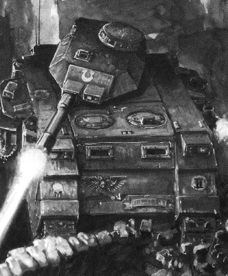
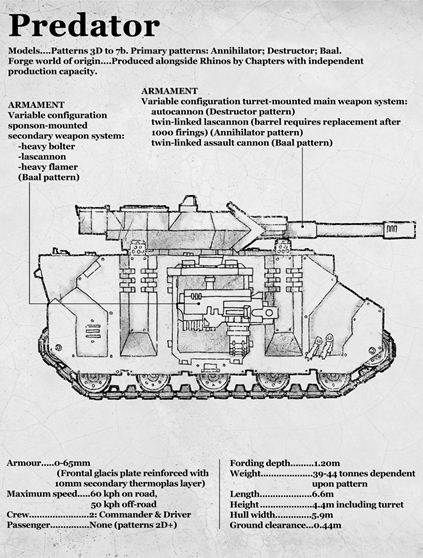
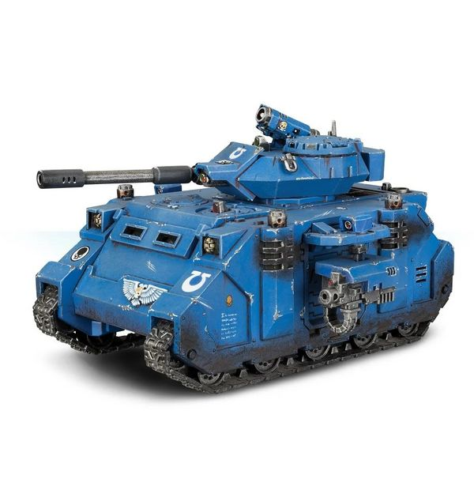
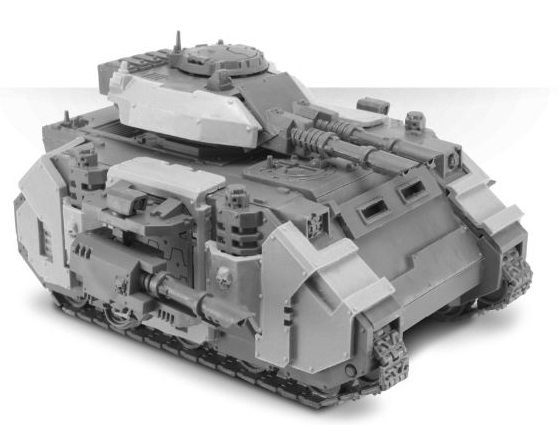
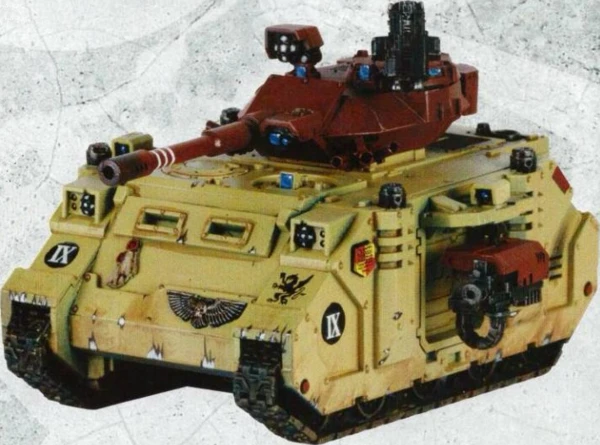
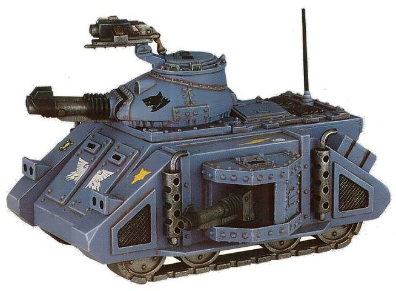
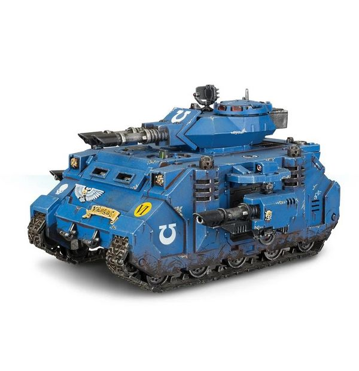
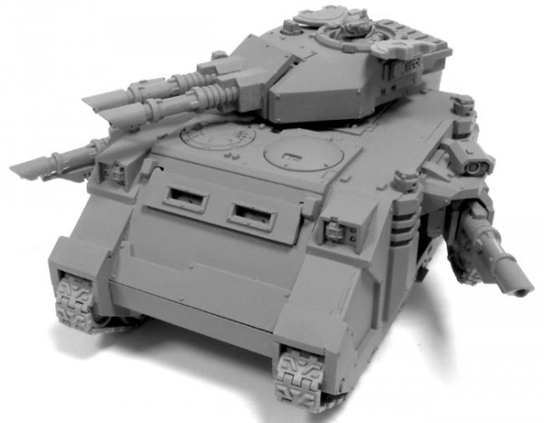
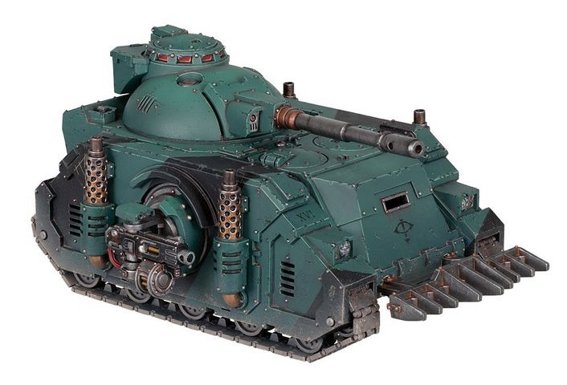
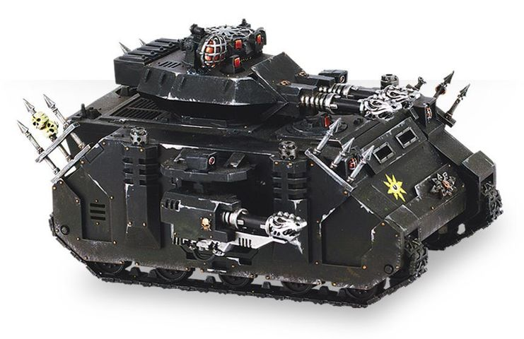

# 1488 掠食者战斗坦克 Predator Battle Tank

精校状态：中文行文已逐段精校，部分术语仍为暂定

分类：载具 / 地面 / 重型

原文来源：https://www.bilibili.com/opus/1040328275562332194

原作者：帝国神选罐头

原文时间：2025年03月04日 11:25

[返回分类目录](目录.md) · [全书目录](../../目录.md)

<!-- A1488-B0001 -->
**英文原文**

The Predator is a battle tank employed by the Space Marines. It is a more heavily armed and armoured version of the Rhino personnel carrier. There are two major patterns of Predator, the Destructor and the Annihilator, primarily distinguished by their specific weaponry. The Blood Angels and their Successor Chapters employ the assault-oriented Baal Predator.

<!-- /A1488-B0001 -->

<!-- A1488-B0002 -->

原译文

掠食者是星际战士使用的战斗坦克。它是犀牛运兵车的重型武装和装甲版本。掠食者有两种主要型号，破坏者和歼灭者，主要区别在于它们的特定武器。圣血天使和他们的子战团应用了攻击导向的巴尔掠夺者。

**校订译文**

掠食者是星际战士使用的战斗坦克，在犀牛运兵车基础上加强了武装与装甲。其两大主要型号是破坏者型和歼灭者型，主要区别在于武器配置。圣血天使及其子战团还使用侧重突击的巴尔掠食者坦克。

<!-- /A1488-B0002 -->

<!-- A1488-B0003 图片 -->

<!-- A1488-B0004 -->

原译文

Predator Tank 掠食者坦克

**校订译文**

Predator Tank 掠食者坦克

<!-- /A1488-B0004 -->

<!-- A1488-B0005 -->
## Construction 结构

<!-- /A1488-B0005 -->

<!-- A1488-B0006 -->
**英文原文**

Construction of Predators remains restricted to a Chapter's Armoury or allied Forge World, with most Chapters fielding between twenty to thirty of all types. However, some Chapters are known to contain several hundred battle tanks, though that number includes Land Raiders as well. Rhinos can be easily refitted to serve as Predators, with the Death Spectres for example converting twelve Rhinos into Predators after losing almost all Predator Destructors during the Vern IV offensive.

<!-- /A1488-B0006 -->

<!-- A1488-B0007 -->

原译文

掠食者的制造仍然局限于一个战团的军械库或盟友铸造世界，大多数战团都部署了20到30种类型。然而，众所周知，一些战团包含数百辆主战坦克，尽管这个数字也包括兰德掠袭者。犀牛装甲车可以很容易地改装成掠食者，例如死亡幽灵在弗恩四号进攻中几乎失去所有掠食者破坏者后，将12头犀牛装甲车改装成掠食者。

**校订译文**

掠食者只能由战团军械库或盟友铸造世界制造。大多数战团拥有各型掠食者共二十至三十辆；某些战团虽拥有数百辆战斗坦克，但这一总数也包含兰德掠袭者。犀牛很容易改装为掠食者，例如死亡幽灵在弗恩四号攻势中几乎损失全部破坏者型掠食者后，便将十二辆犀牛改装补充。

**校注：** 20—30指各型车辆合计数量，不是二十至三十种车型。

<!-- /A1488-B0007 -->

<!-- A1488-B0008 -->
**英文原文**

Every thirteenth vehicle outfitted to be a Predator is blessed and purified to a greater degree than usual and every 666th is melted down, its material returned to the forge and sacrificed to the Machine God.

<!-- /A1488-B0008 -->

<!-- A1488-B0009 -->

原译文

每十三辆装备为掠食者的载具都会得到比平时更大程度的祝福和净化，每666辆载具都会被熔化，其材料会被送回铸造厂并供奉给万机神。

**校订译文**

每造到第十三辆掠食者，就会为该车施加格外隆重的祝福与净化；每到第六百六十六辆，则将该车熔毁，材料送回锻炉，作为献给万机神的祭品。

**校注：** every thirteenth/666th 指计数到特定序号的单辆车，不是每十三辆或六百六十六辆全部执行同一仪式。

<!-- /A1488-B0009 -->

<!-- A1488-B0010 -->
**英文原文**

Predators are named only after the Emperor's Tarot has been consulted, following a widely held opinion that the tank's personality is influenced by its name. Each vehicle is said by its crew to be as unique as its name, with some being utterly fearless while others being stubborn in defensive situations.

<!-- /A1488-B0010 -->

<!-- A1488-B0011 -->

原译文

掠食者的名字是在咨询了帝皇塔罗牌后才命名的，因为人们普遍认为坦克的个性受到其名称的影响。每辆车的乘员都说，每辆车都和它的名字一样独特，有些人无所畏惧，而另一些人则在防御态势下异常顽固。

**校订译文**

掠食者须经过帝皇塔罗占卜后才能获名，因为人们普遍相信车名会影响机体性格。车组认为，每辆坦克都像其名字一样独特：有的无所畏惧，有的在防御战中格外顽强。

<!-- /A1488-B0011 -->

<!-- A1488-B0012 -->
**英文原文**

The Predator is crewed by two Space Marines, a commander/gunner and a driver. Crews can be hardwired into their position in case of failure or punishment for transgressions against chapter laws. These Space Marines are not actually Techmarines, but are fully versed in the operation and maintenance of their vehicles, with it being a great honour to crew a Predator, just behind commanding a Land Raider.

<!-- /A1488-B0012 -->

<!-- A1488-B0013 -->

原译文

掠食者由两名星际战士、一名指挥官/炮手和一名驾驶员驾驶。为应对可能出现的失职情况，或对违反战团法规的行为进行惩处，车组成员会被严格限定在各自岗位上。这些星际战士本质上不是技术军士，但他们完全精通其车辆的操作和维护，能够在指挥的兰德掠袭者的后面驾驶掠食者是一种极大的荣誉。

**校订译文**

掠食者由两名星际战士操纵，一人为车长兼炮手，另一人为驾驶员。车组成员有时会因失职或违反战团律法，被直接硬接入岗位设备，作为惩罚。他们并非科技战士，却精通座驾的操作和维护。担任掠食者车组是极高荣誉，仅次于指挥一辆兰德掠袭者。

**校注：** hardwired 指身体与设备直接接线，原译只写限定岗位，漏掉生体改造；just behind 是荣誉仅次于，并非在兰德掠袭者后方行驶。

<!-- /A1488-B0013 -->

<!-- A1488-B0014 -->
## History 历史

<!-- /A1488-B0014 -->

<!-- A1488-B0015 -->
**英文原文**

The Predator was first fielded during the Dark Age of Technology. During this age the Predator was instrumental in establishing Mankind’s dominance upon an untold number of worlds. It is theorised by those with access to the sealed archives that the Predator template was developed in response to Mankind’s earliest contacts with the Ork race. Where the Rhino had served Mankind well in previous conflicts with lesser races, the brutal, close quarters method of warfare favoured by the newly discovered Orks required different tactics altogether. The Predator was an ideal weapon against the Orks, who had few weapons that could penetrate its upgraded armour, and whose own armour offered no protection whatsoever against the tank’s reliable autocannon and heavy bolter armament.

<!-- /A1488-B0015 -->

<!-- A1488-B0016 -->

原译文

掠食者在黑暗技术时代首次投入使用。在这个时代，掠食者在建立人类对无数世界的统治地位方面发挥了重要作用。那些有权访问密封档案的人认为，掠食者模板是为了回应人类最早与欧克种族的接触而开发的。犀牛装甲车在之前与较小种族的冲突中为人类提供了很好的服务，而新发现的兽人所青睐的残酷、近距离的战争方式需要完全不同的战术。掠食者是对抗兽人的理想武器，他们几乎没有可以穿透升级装甲的武器，而且他们自己的装甲也无法抵御坦克可靠的自动炮和重型爆矢枪等武器。

**校订译文**

掠食者首次投入使用是在科技黑暗时代，并在人类确立对无数世界的统治时发挥了关键作用。能够查阅封存档案的人推测，该模板是为应对人类最初接触欧克时遇到的威胁而开发的。此前，犀牛在与较弱种族的冲突中已足以满足需要；欧克偏爱的残酷近战却要求全新的战术。掠食者恰好适合对付它们：欧克少有武器能击穿其加强装甲，自身防护却完全挡不住可靠的自动炮和重型爆矢枪。

<!-- /A1488-B0016 -->

<!-- A1488-B0017 图片 -->

<!-- A1488-B0018 -->

原译文

Schematic of a Predator Destructor 掠食者破坏者示意图

**校订译文**

Schematic of a Predator Destructor 破坏者型掠食者战车示意图

<!-- /A1488-B0018 -->

<!-- A1488-B0019 -->
**英文原文**

The Predators originally employed by the Emperor’s forces were only slightly different to those employed today, and it is a testimony to functionality of the original design that it has changed so little over the course of ten thousand years. The first Predators were equipped with a small passenger-carrying capacity, but during the prolonged campaigns of the Great Crusade it became obvious that this meager facility was of less importance than the ability to carry greater amounts of ammunition, especially if the vehicle in question was to be fitted with side sponsons. By the time of the Great Crusade, a great number of Standard Template Constructs had been lost, and it was another five millennia before the template for the Razorback, a vehicle dedicated to the role of infantry fighting vehicle, was discovered. In the meantime, Imperial tactics sacrificed transport capacity for firepower, fielding Predators as light support vehicles alongside the Rhino APC.

<!-- /A1488-B0019 -->

<!-- A1488-B0020 -->

原译文

帝皇部队最初使用的掠食者与今天使用的掠食者只有轻微的不同，这证明了原始设计的功能性，在一万年的时间里，它几乎没有变化。第一批掠食者配备了较小的载弹量，但在大远征的长期作战中，很明显，简陋的设施不如携带大量弹药的能力重要，特别是如果所讨论的车辆要配备侧舷。到大远征时，大量的标准模板结构已经丢失，再过五千年，专门用作步兵战车的豪猪战车的模板才被发现。与此同时，帝国战术牺牲了火力运输能力，将掠食者作为轻型支援车辆与犀牛装甲运兵车并肩作战。

**校订译文**

帝皇部队最初使用的掠食者与今天的型号差异很小，一万年来变化有限，足以证明原始设计的实用性。最早的掠食者还设有少量载员空间，但大远征漫长的战役表明，多带弹药比少量载员更重要，尤其是加装侧舷武器之后。至大远征时期，大量 STC 已经失落，又过五千年才重新发现专用于步兵战车角色的豪猪模板。在此期间，帝国牺牲载员能力以换取火力，让掠食者作为轻型支援战车，与犀牛装甲运兵车协同作战。

**校注：** 原文先说载员空间后让位于弹药，原译两次混淆载员量与载弹量；末句是牺牲运输能力换取火力。

<!-- /A1488-B0020 -->

<!-- A1488-B0021 -->
**英文原文**

Some Tech-Priests claim that one of the more exotic and unusual weapons of the Predator was a Graviton Cannon, though there are no examples of it existing in the M41 and the ability to re-create it remains unknown to this day.

<!-- /A1488-B0021 -->

<!-- A1488-B0022 -->

原译文

一些技术神甫声称，掠食者的一种更奇特、更不寻常的武器是重力炮，尽管M41没有这种武器的示例，而且至今仍不清楚它的破坏能力。

**校订译文**

部分技术祭司声称，掠食者曾使用过重力炮这种罕见武器，但第41千年已无实物存例，其重制技术至今不明。

**校注：** re-create 是重新制造，不是破坏能力。

<!-- /A1488-B0022 -->

<!-- A1488-B0023 -->
## Predator Destructor 破坏者型掠食者战车

原题：Predator Destructor 掠食者破坏者

<!-- /A1488-B0023 -->

<!-- A1488-B0024 -->
**英文原文**

The Predator Destructor is the original model of Predator battle tanks, with its origins dating back to the Dark Age of Technology. The Predator was built in direct response to the threat of Orks, which were proving difficult for humanity to handle. Its combination of heavier armour and weaponry allowed the Predator to withstand Orkish attacks and easily destroy their vehicles. Soon the Predator became the standard fighting vehicle for all of humanity's armies, and would remain in that position throughout the Great Crusade, where its small troop carrying capacity would be replaced with space for more ammunition. Eventually, similar to the Rhino it was based off of, the Predator Destructor would be restricted to use by the Space Marines only.

<!-- /A1488-B0024 -->

<!-- A1488-B0025 -->

原译文

掠食者破坏者是掠食者战斗坦克的原始型号，其起源可以追溯到黑暗技术时代。掠食者是为了直接应对兽人的威胁而制造的，事实证明，人类很难应对这种威胁。它的重型装甲和武器组合使掠食者能够抵御欧克蛮人的攻击，并轻松摧毁他们的载具。很快，掠食者成为所有人类军队的标准战车，并将在整个大远征期间保持这一地位，其较小的载兵能力将被更多弹药的空间所取代。最终，与它所基于的犀牛装甲车类似，掠食者破坏者将仅限于星际战士使用。

**校订译文**

破坏者型掠食者战车是最早的掠食者型号，可追溯至科技黑暗时代。当时人类难以应对欧克威胁，掠食者因此诞生；更厚的装甲与更强的武器使其能顶住欧克攻击，轻易摧毁敌方载具。它很快成为各支人类军队的标准战斗车辆，并在整个大远征期间保持这一地位，只是少量载员空间逐渐让位于弹药储存。最终，与其基础车型犀牛一样，破坏者型掠食者被限定为星际战士专用。

<!-- /A1488-B0025 -->

<!-- A1488-B0026 图片 -->

<!-- A1488-B0027 -->

原译文

Predator Destructor 掠食者破坏者

**校订译文**

Predator Destructor 破坏者型掠食者战车

<!-- /A1488-B0027 -->

<!-- A1488-B0028 -->
### Armament 军备

<!-- /A1488-B0028 -->

<!-- A1488-B0029 -->
**英文原文**

The main turret armament on the common Mars-pattern Mark IV-b Predator Destructor is the Syrtis pattern Autocannon, which is constructed with an automatic ammunition feed, muzzle flash suppressor and discharge extractor. The weapon is aimed by the vehicle commander/gunner through a multi-spectral remote targeting surveyor and accuracy talisman. It fires explosive ammunition, each round larger than a Space Marine's fist, which easily chew through heavily-armoured infantry and light vehicles. It can also fire amour piercing shells.

<!-- /A1488-B0029 -->

<!-- A1488-B0030 -->

原译文

常见的火星型Mark IV-b掠食者破坏者的主要炮塔武器是瑟提斯型自动炮，它由自动弹药供给、炮口闪光抑制器和排放物提取器组成。该武器由车辆指挥官/炮手通过多光谱远程瞄准测量仪和精度护符瞄准。它发射的爆炸性弹药，每发都比星际战士的拳头大，很容易穿透重型装甲步兵和轻型车辆。它还可以发射穿甲弹。

**校订译文**

常见的火星型 Mark IV-b 破坏者型掠食者，炮塔主武器为赛提斯型自动炮，配有自动供弹装置、炮口消焰器和排烟装置。车长兼炮手通过多光谱遥控瞄准探测器与精度护符瞄准。其爆炸弹药每发都比星际战士的拳头更大，能轻易撕碎重装步兵和轻型载具；此外也可发射穿甲弹。

<!-- /A1488-B0030 -->

<!-- A1488-B0031 -->
**英文原文**

The autocannon incorporates a discharge extractor, a muzzle flashback suppressor, a Syrtis II pattern reinforced breach lock and an armoured ammunition feed.

<!-- /A1488-B0031 -->

<!-- A1488-B0032 -->

原译文

自动炮配备了一个排放物提取器，一个炮口闪光抑制器、一个瑟提斯II型加强应急锁和一个装甲弹药供给装置。

**校订译文**

自动炮装有排烟装置、炮口消焰器、赛提斯II型加强炮闩锁定机构，以及装甲供弹装置。

**校注：** breach lock 疑为breech lock炮闩锁的拼误，按火炮构造译；原应急锁错误。

<!-- /A1488-B0032 -->

<!-- A1488-B0033 -->
**英文原文**

The gunner/commander itself is seated in a morphic seat in the turret, surrounded by a periscope, target acquisition displays, weapons status panels and fine motor controls. He is connected to the tank via an auto-sense network cabling.

<!-- /A1488-B0033 -->

<!-- A1488-B0034 -->

原译文

炮手/指挥官本身坐在炮塔中的一个变形座椅上，周围环绕着潜望镜、目标捕获显示器、武器状态面板和精细电机控制装置。他通过自动感应网络线缆连接到油箱。

**校订译文**

车长兼炮手坐在炮塔内的自适应座椅上，周围是潜望镜、目标捕获显示器、武器状态面板和精细操控装置，并通过自动感官网络缆线与坦克连接。

**校注：** tank 指坦克，不是油箱；fine motor controls 在此为精细动作操控装置。

<!-- /A1488-B0034 -->

<!-- A1488-B0035 -->
**英文原文**

The gunner/commander has also access to a 360 degree traversable command cupola, featuring an auto-sealing hatch, an auxiliary long range communications array, a multi spectrum visual pickup and an auxiliary integration point mounting. The cupola also gives access to the M33 MK VI auxiliary storm bolter, equipped with 200 multi-purpose bolter rounds.

<!-- /A1488-B0035 -->

<!-- A1488-B0036 -->

原译文

炮手/指挥官还可以使用360度可移动的指挥圆顶，该圆顶具有自动密封舱口、辅助远程通信阵列、多光谱视觉传感器和辅助集成点安装。圆顶还可以使用M33 MK VI辅助风暴爆矢枪，配备了200发多用途爆矢弹药。

**校订译文**

车长兼炮手还可进入能够360°旋转的指挥塔。那里设有自动密封舱口、辅助远程通讯阵列、多光谱图像采集器和辅助接驳安装点，还能操纵备弹200发多用途爆矢弹的 M33 Mk VI 辅助风暴爆矢枪。

<!-- /A1488-B0036 -->

<!-- A1488-B0037 -->
**英文原文**

The side sponsons can mount a variety of weapon though the most common - either Heavy Bolters for close defense or Lascannons for additional anti-tank firepower. The sponson weapons are remotely controlled from the turret and aimed through similar surveyors, these are slaved multi-spectral remote targeting surveyors. The sponsons are situated in a ceramite/titanium bonded armour cowling.

<!-- /A1488-B0037 -->

<!-- A1488-B0038 -->

原译文

侧舷可以安装各种武器，但最常见的是 - 用于近距离防御的重型爆矢枪或用于额外反坦克火力的激光炮。主战武器由炮塔远程控制，并通过类似的传感器瞄准，这些传感器是受多光谱远程瞄准传感器控制的。位于陶钢/钛结合的装甲罩中。

**校订译文**

侧舷可装多种武器，最常见的是用于近防的重型爆矢枪，或增加反坦克火力的激光炮。侧舷武器由炮塔遥控，通过联动的多光谱遥控瞄准探测器锁定目标，外部由陶钢与钛材结合的装甲罩保护。

<!-- /A1488-B0038 -->

<!-- A1488-B0039 -->
**英文原文**

The sponson mounted Heavy Bolters are of the 446AV 'Godwyn-Tadcoke' pattern and are situated in an 180 degree traversable mount, elevating up to +18 degree and depressing down to -18 degrees in an 180 degree arc.

<!-- /A1488-B0039 -->

<!-- A1488-B0040 -->

原译文

安装在舷侧的重型爆矢枪是446AV的“戈德温·塔德科克”型，位于180度可移动的安装架上，在180度的弧度内可上升至+18度，下降至-18度。

**校订译文**

侧舷重型爆矢枪采用446AV“戈德温—塔德科克”型，装在水平射界180°的枪架上，俯仰范围为−18°至+18°。

<!-- /A1488-B0040 -->

<!-- A1488-B0041 -->
**英文原文**

Some Tech-Priests speculate that once the main auto-loading ammunition feeds were more efficient and able to cycle rounds at a faster rate than the Predator's systems of M41. Even if it is likely true, the older pattern of autoloader is thought to be long lost, though extant examples are still hidden somewhere and waited for the technology hunters to find them.

<!-- /A1488-B0041 -->

<!-- A1488-B0042 -->

原译文

一些技术神甫推测，曾经主要的自动装弹系统比M41的掠食者系统更有效，能够以更快的速度循环弹药。即使这可能是真的，人们也认为旧的自动装弹机模式早已失传，尽管现存的例子仍然隐藏在某个地方，等待技术猎人找到它们。

**校订译文**

一些技术祭司推测，过去的主武器自动供弹系统效率更高，射击循环速度也快于第41千年的型号。这或许属实，但旧型自动装弹机的技术被认为早已失传；也可能仍有实物藏于某处，等待技术猎人发现。

<!-- /A1488-B0042 -->

<!-- A1488-B0043 -->
### Armour 装甲

<!-- /A1488-B0043 -->

<!-- A1488-B0044 -->
**英文原文**

Protection for the Predator Destructor comes from three layers of armouring. The first, a bonded ceramite/adamantine alloy, gives the Predator protection equivalent to five times its width in conventional steel whilst being lighter. This is followed by a reinforcing thermoplas with a mesh of sub-dermal energy dissipation fibre for protection against radiation. The outer layer is a non-metallic acrylic identification sheath. The armour is 65mm thick on the front hull,, with the frontal glacis plate reinforced with a 10mm secondary thermoplas layer, 55mm thick on the side hull and 50mm thick on the rear hull. In all, this armour corresponds over the 200mm of 'standard' steel on the front of Predator.

<!-- /A1488-B0044 -->

<!-- A1488-B0045 -->

原译文

掠食者破坏者的保护来自三层装甲。第一层是粘结的陶钢/精金合金，为掠食者提供了相当于传统钢五倍的保护，同时更轻。随后是带有皮下能量耗散纤维网的增强热塑性塑料，用于防止辐射。外层为非金属丙烯酸识别护层。前车体的装甲厚度为65毫米，前护甲用10毫米的二级热塑性塑料层加固，侧车体为55毫米厚，后车体为50毫米厚。总的来说，这种装甲相当于掠食者正面200毫米以上的“标准”钢。

**校订译文**

破坏者型掠食者以三层装甲获得防护。第一层是结合陶钢与精金的合金，同厚度下防护相当于传统钢材的五倍，重量却更轻。之后是增强热塑材料，其中埋有能量耗散纤维网，用于抵御辐射；最外层为非金属丙烯酸标识覆层。车体正面装甲厚65毫米，前倾斜装甲板还附加10毫米热塑材料；侧面厚55毫米，后部厚50毫米。综合起来，正面防护相当于超过200毫米的“标准”钢装甲。

<!-- /A1488-B0045 -->

<!-- A1488-B0046 图片 -->

<!-- A1488-B0047 -->

原译文

Predator with Extra Armour 额外装甲掠食者

**校订译文**

Predator with Extra Armour 额外装甲掠食者

<!-- /A1488-B0047 -->

<!-- A1488-B0048 -->
**英文原文**

The defence of the Predator can be additionally reinforced with layers of Extra Armour.

<!-- /A1488-B0048 -->

<!-- A1488-B0049 -->

原译文

掠食者的防御可以通过额外的装甲层来加强。

**校订译文**

掠食者的防御可以通过额外的装甲层来加强。

<!-- /A1488-B0049 -->

<!-- A1488-B0050 -->
### Mobility 机动性

<!-- /A1488-B0050 -->

<!-- A1488-B0051 -->
**英文原文**

The Predator is mobile by use of four independent Mark II 'Mars' pattern D adaptable thermic combustor reaction engines, protected against impurities by Adeptus Mechanicus purity seals. They provide 2800bhp, an operational range of 1000 kilometres and a road speed of 68kph and a cross country speed of 50kph. The Predators track links are cast out of a pseudo-titanium alloy.

<!-- /A1488-B0051 -->

<!-- A1488-B0052 -->

原译文

掠食者通过使用四个独立的Mark II“火星”D型自适应热燃烧反应发动机进行移动，并由机械神教纯度印记保护，防止杂质进入。它们提供2800制动马力，行驶里程为1000公里，行驶速度为68公里/小时，越野速度为50公里/小时。掠食者履带链节由伪钛合金铸造而成。

**校订译文**

掠食者由四台独立的 Mark II“火星”D型自适应热燃烧反应引擎驱动，并以机械修会纯洁印记防止杂质侵入。总输出为2800制动马力，续航1000公里，公路速度68公里/小时，越野速度50公里/小时。履带链节以类钛合金铸造。

<!-- /A1488-B0052 -->

<!-- A1488-B0053 -->
**英文原文**

The Predator has a ground clearance of 0.44 metres, provided by a reinforced titanium torsion bar, a maximum gradient climb of 65%, exerts a ground pressure of 10.8-12.2 psi, depending on pattern, can cross trenches 4 metres in width and can climb vertical obstacles 1.2 metres in height. Finally, it can ford waters 12 metres deep.

<!-- /A1488-B0053 -->

<!-- A1488-B0054 -->

原译文

掠食者的离地间隙为0.44米，由加强钛扭转杆提供，最大坡度爬升率为65%，根据模式施加10.8-12.2磅/平方英寸的地面压力，可以穿过4米宽的沟渠，可以爬上1.2米高的垂直障碍物。最后，它可以涉水12米深。

**校订译文**

加强钛制扭杆悬挂使掠食者的离地间隙达到0.44米。最大爬坡度为65%，不同型号的接地压强为10.8至12.2磅/平方英寸。它能越过4米宽的壕沟、攀越1.2米高的垂直障碍，原文还称其可通过12米深的水域。

**校注：** 英文明确写12米，未改为常见的1.2米；技术表的涉水深度为空，需原资料进一步核查。

<!-- /A1488-B0054 -->

<!-- A1488-B0055 -->
**英文原文**

The driver is seated in a morphic seat, connected to the tank via a spinal implant interface and umbilical pickups and has access to a periscope, a tactical display, an engine status display, a power assisted drive column and a manual momentum cancellation control.

<!-- /A1488-B0055 -->

<!-- A1488-B0056 -->

原译文

驾驶员坐在变形座椅上，通过脊柱植入接口和中央传感器连接到坦克，可以使用潜望镜、战术显示器、发动机状态显示器、动力辅助驱动柱和手动动量抵消控制器。

**校订译文**

驾驶员坐在自适应座椅上，通过脊柱植入接口与脐带式接驳装置连接坦克。他可使用潜望镜、战术显示器、引擎状态显示器、助力转向操纵杆和手动减速控制器。

<!-- /A1488-B0056 -->

<!-- A1488-B0057 -->
### Equipment 装备

原题：Equipment 设备

<!-- /A1488-B0057 -->

<!-- A1488-B0058 -->
**英文原文**

Smoke Launchers and a Searchlight are standard options on a Predator Destructor. It may be further upgraded with Dozer Blades, Extra Armour, a Hunter-killer Missile, and a Pintle-mounted Stormbolter. The Hunter-Killer Missile is of the Mk VIII ‘Avenger' pattern, fired from the 'Diacria' pattern hunter-killer launcher and guided via an autonomous target acquisition system. The smoke launcher is a Mk II 'Tenebrus' smoke discharge unit, fitted with Stygies 'D' pattern smoke grenades.

<!-- /A1488-B0058 -->

<!-- A1488-B0059 -->

原译文

烟雾发射器和探照灯是掠食者破坏者的标准配置。它可能会进一步升级，配备推土机铲刀、额外装甲、猎杀飞弹和枢轴式风暴爆矢枪。猎杀飞弹是Mk VIII“复仇者”型导弹，由“迪亚克里亚”型猎杀发射器发射，并通过自主目标捕获系统进行制导。烟雾发射器是一个Mk II“特涅布鲁斯”烟雾排放装置，装有斯蒂吉斯“D”型烟雾榴弹。

**校订译文**

破坏者型掠食者的标准装备包括烟雾发射器和探照灯，另可加装推土铲、附加装甲、猎杀导弹与枢轴枪架风暴爆矢枪。猎杀导弹为 Mk VIII“复仇者”型，由迪亚克里亚型发射器发射，并以自主目标捕获系统制导。烟雾发射器采用 Mk II“特涅布鲁斯”型，装填斯蒂吉斯D型烟雾榴弹。

<!-- /A1488-B0059 -->

<!-- A1488-B0060 -->
**英文原文**

The Predator also features a narrow band long-range communication array, an atmospheric filtration unit, 1.5 megawatt quartz halogen headlights and a frontal view port with integral debris clearance mechanism. The view port can be reinforced with an shield, adjustable by the driver.

<!-- /A1488-B0060 -->

<!-- A1488-B0061 -->

原译文

掠食者还配备了一个窄带远程通信阵列、一个大气过滤装置、1.5兆瓦的石英卤素前照灯和带有一体式碎屑清除装置的前视观察口。观察口可以用护罩加固，可由驾驶员调节。

**校订译文**

掠食者还配备了一个窄带远程通信阵列、一个大气过滤装置、1.5兆瓦的石英卤素前照灯和带有一体式碎屑清除装置的前视观察口。观察口可以用护罩加固，可由驾驶员调节。

<!-- /A1488-B0061 -->

<!-- A1488-B0062 -->
### Technical Information 技术资料

原题：Technical Information 技术信息

<!-- /A1488-B0062 -->

<!-- A1488-B0063 -->
**英文原文**

Vehicle Name:Predator Destructor

<!-- /A1488-B0063 -->

<!-- A1488-B0064 -->

原译文

载具名称：掠食者破坏者

**校订译文**

载具名称：破坏者型掠食者战车

<!-- /A1488-B0064 -->

<!-- A1488-B0065 -->
**英文原文**

Forge World of Origin:Mars

<!-- /A1488-B0065 -->

<!-- A1488-B0066 -->

原译文

起源铸造世界：火星

**校订译文**

起源铸造世界：火星

<!-- /A1488-B0066 -->

<!-- A1488-B0067 -->
**英文原文**

Known Patterns:I-XII

<!-- /A1488-B0067 -->

<!-- A1488-B0068 -->

原译文

已知型号：I - XII

**校订译文**

已知型号：I - XII

<!-- /A1488-B0068 -->

<!-- A1488-B0069 -->
**英文原文**

Crew:Driver, Gunner

<!-- /A1488-B0069 -->

<!-- A1488-B0070 -->

原译文

乘员：驾驶员，炮手

**校订译文**

乘员：驾驶员，炮手

<!-- /A1488-B0070 -->

<!-- A1488-B0071 -->
**英文原文**

Powerplant:Quad MkII Adaptable Thermic Combustor Reactor

<!-- /A1488-B0071 -->

<!-- A1488-B0072 -->

原译文

动力装置：阔德MkII适应性热燃烧反应堆

**校订译文**

动力装置：4台 MkII 自适应热燃烧反应堆

<!-- /A1488-B0072 -->

<!-- A1488-B0073 -->
**英文原文**

Weight:44 tonnes

<!-- /A1488-B0073 -->

<!-- A1488-B0074 -->

原译文

重量：44吨

**校订译文**

重量：44吨

<!-- /A1488-B0074 -->

<!-- A1488-B0075 -->
**英文原文**

Length:6.6m

<!-- /A1488-B0075 -->

<!-- A1488-B0076 -->

原译文

长度：6.6米

**校订译文**

长度：6.6米

<!-- /A1488-B0076 -->

<!-- A1488-B0077 -->
**英文原文**

Width:6.0m (with sponsons)

<!-- /A1488-B0077 -->

<!-- A1488-B0078 -->

原译文

宽度：6.0m（带支架）

**校订译文**

宽度：6.0米（含侧舷武器舱）

<!-- /A1488-B0078 -->

<!-- A1488-B0079 -->
**英文原文**

Height:4.4m

<!-- /A1488-B0079 -->

<!-- A1488-B0080 -->

原译文

高度：4.4米

**校订译文**

高度：4.4米

<!-- /A1488-B0080 -->

<!-- A1488-B0081 -->
**英文原文**

Ground Clearance:0.44m

<!-- /A1488-B0081 -->

<!-- A1488-B0082 -->

原译文

离地间隙：0.44m

**校订译文**

离地间隙：0.44米

<!-- /A1488-B0082 -->

<!-- A1488-B0083 -->
**英文原文**

Fording Depth:

<!-- /A1488-B0083 -->

<!-- A1488-B0084 -->

原译文

涉水深度：

**校订译文**

涉水深度：

<!-- /A1488-B0084 -->

<!-- A1488-B0085 -->
**英文原文**

Max Speed - on road68kph

<!-- /A1488-B0085 -->

<!-- A1488-B0086 -->

原译文

最大速度-公路68公里/小时

**校订译文**

最大公路速度：68公里/小时

<!-- /A1488-B0086 -->

<!-- A1488-B0087 -->
**英文原文**

Max Speed - off road:50kph

<!-- /A1488-B0087 -->

<!-- A1488-B0088 -->

原译文

最大速度-越野：50公里/小时

**校订译文**

最大越野速度：50公里/小时

<!-- /A1488-B0088 -->

<!-- A1488-B0089 -->
**英文原文**

Transport Capacity:None

<!-- /A1488-B0089 -->

<!-- A1488-B0090 -->

原译文

运输能力：无

**校订译文**

运输能力：无

<!-- /A1488-B0090 -->

<!-- A1488-B0091 -->
**英文原文**

Access Points:n/a

<!-- /A1488-B0091 -->

<!-- A1488-B0092 -->

原译文

入口：无

**校订译文**

出入口：未提供（N/A）

<!-- /A1488-B0092 -->

<!-- A1488-B0093 -->
**英文原文**

Main Armament:Autocannon

<!-- /A1488-B0093 -->

<!-- A1488-B0094 -->

原译文

主武器：自动炮

**校订译文**

主武器：自动炮

<!-- /A1488-B0094 -->

<!-- A1488-B0095 -->
**英文原文**

Secondary Armament:Sponson-mounted Heavy Bolters

<!-- /A1488-B0095 -->

<!-- A1488-B0096 -->

原译文

次要武器：悬挂式重型爆矢枪

**校订译文**

副武器：侧舷重型爆矢枪

<!-- /A1488-B0096 -->

<!-- A1488-B0097 -->
**英文原文**

Traverse:360°

<!-- /A1488-B0097 -->

<!-- A1488-B0098 -->

原译文

横向：360°

**校订译文**

水平射界：360°

<!-- /A1488-B0098 -->

<!-- A1488-B0099 -->
**英文原文**

Elevation:From -15° to 28°

<!-- /A1488-B0099 -->

<!-- A1488-B0100 -->

原译文

仰角：-15°至28°

**校订译文**

俯仰角：−15°至+28°

<!-- /A1488-B0100 -->

<!-- A1488-B0101 -->
**英文原文**

Main Ammunition:120 rounds

<!-- /A1488-B0101 -->

<!-- A1488-B0102 -->

原译文

主要弹药：120发

**校订译文**

主武器载弹量：120发

<!-- /A1488-B0102 -->

<!-- A1488-B0103 -->
**英文原文**

Secondary Ammunition:1100 rounds

<!-- /A1488-B0103 -->

<!-- A1488-B0104 -->

原译文

二级弹药：1100发

**校订译文**

副武器载弹量：1100发

<!-- /A1488-B0104 -->

<!-- A1488-B0105 -->
### Armour 装甲

<!-- /A1488-B0105 -->

<!-- A1488-B0106 -->
**英文原文**

Superstructure:65mm

<!-- /A1488-B0106 -->

<!-- A1488-B0107 -->

原译文

上部结构：65毫米

**校订译文**

上部结构：65毫米

<!-- /A1488-B0107 -->

<!-- A1488-B0108 -->
**英文原文**

Hull:55mm

<!-- /A1488-B0108 -->

<!-- A1488-B0109 -->

原译文

车体：55毫米

**校订译文**

车体：55毫米

<!-- /A1488-B0109 -->

<!-- A1488-B0110 -->
**英文原文**

Gun Mantlet:65mm

<!-- /A1488-B0110 -->

<!-- A1488-B0111 -->

原译文

炮盾：65毫米

**校订译文**

炮盾：65毫米

<!-- /A1488-B0111 -->

<!-- A1488-B0112 -->
**英文原文**

Vehicle Designation:0120-766-0723-RH812/819

<!-- /A1488-B0112 -->

<!-- A1488-B0113 -->

原译文

载具编号：0120-766-0723-RH812/819

**校订译文**

载具编号：0120-766-0723-RH812/819

<!-- /A1488-B0113 -->

<!-- A1488-B0114 -->
**英文原文**

Firing Ports:n/a

<!-- /A1488-B0114 -->

<!-- A1488-B0115 -->

原译文

火力口：无

**校订译文**

射击孔：未提供（N/A）

<!-- /A1488-B0115 -->

<!-- A1488-B0116 -->
**英文原文**

Turret:65mm

<!-- /A1488-B0116 -->

<!-- A1488-B0117 -->

原译文

炮塔：65毫米

**校订译文**

炮塔：65毫米

<!-- /A1488-B0117 -->

<!-- A1488-B0118 -->
### Named Predator Destructor 著名破坏者型掠食者战车

原题：Named Predator Destructor 著名掠食者破坏者

<!-- /A1488-B0118 -->

<!-- A1488-B0119 -->
**英文原文**

Avenger — of the Marauders Chapter. Was part of the Thracian Response Forse

<!-- /A1488-B0119 -->

<!-- A1488-B0120 -->

原译文

复仇者 — 掠夺者战团。是色雷斯反应部队的一部分

**校订译文**

复仇者号——掠夺者战团所属，曾隶属色雷斯反应部队。

<!-- /A1488-B0120 -->

<!-- A1488-B0121 -->
**英文原文**

Belsarius Fury — of the Blood Angels. Took part in the Third War for Armageddon where it was destroyed during the defence of Hades Five.

<!-- /A1488-B0121 -->

<!-- A1488-B0122 -->

原译文

贝利撒留狂怒 — 圣血天使。参加了第三次阿米吉多顿之战，在保卫哈迪斯五号期间被摧毁。

**校订译文**

贝利撒留狂怒号——圣血天使所属，参加第三次阿玛吉多顿战争，在保卫哈迪斯五号时被摧毁。

**校注：** 英文写 Belsarius 与 Hades Five，均照源文保留，不擅自改为Belisarius或Hades Hive，也不自动套考尔姓名。

<!-- /A1488-B0122 -->

<!-- A1488-B0123 -->
**英文原文**

Harbinger of Death — of the Aurora Chapter. Fought against Chaos cultists during the Goru Heresy.

<!-- /A1488-B0123 -->

<!-- A1488-B0124 -->

原译文

死亡预兆 — 曙光女神战团，在戈鲁叛乱期间与混沌邪教徒作战。

**校订译文**

死亡预兆号——曙光女神战团所属，在戈鲁叛乱期间与混沌邪教徒作战。

<!-- /A1488-B0124 -->

<!-- A1488-B0125 -->
**英文原文**

Trajan — of the Howling Griffons.

<!-- /A1488-B0125 -->

<!-- A1488-B0126 -->

原译文

图拉真 — 咆哮狮鹫

**校订译文**

图拉真号——咆哮狮鹫。

<!-- /A1488-B0126 -->

<!-- A1488-B0127 图片 -->

<!-- A1488-B0128 -->

原译文

Howling Griffons Predator Destructor Trajan 咆哮狮鹫掠食者破坏者图拉真

**校订译文**

Howling Griffons Predator Destructor Trajan 咆哮狮鹫破坏者型掠食者战车图拉真号

<!-- /A1488-B0128 -->

<!-- A1488-B0129 -->
### Patterns 型号

<!-- /A1488-B0129 -->

<!-- A1488-B0130 -->
**英文原文**

Phaeton Pattern Mk.IIIb/c: Older variant based on Mk.I Rhino chassis. Distinctive square turret mounted on the forward hull as opposed to center.

<!-- /A1488-B0130 -->

<!-- A1488-B0131 -->

原译文

法厄同型 Mk.IIIb/c：基于Mk.I 犀牛底盘的较旧版本。独特的方形炮塔安装在车体前部，而不是中心。

**校订译文**

法厄同型 Mk.IIIb/c：基于Mk.I 犀牛底盘的较旧版本。独特的方形炮塔安装在车体前部，而不是中心。

<!-- /A1488-B0131 -->

<!-- A1488-B0132 图片 -->

<!-- A1488-B0133 -->

原译文

Space Wolves Mk.IIIc Pattern Predator 太空野狼Mk.IIIc型掠食者

**校订译文**

Space Wolves Mk.IIIc Pattern Predator 太空野狼Mk.IIIc型掠食者

<!-- /A1488-B0133 -->

<!-- A1488-B0134 -->
**英文原文**

Mars Pattern Mk.IVb: Most common pattern of Predator Destructor.

<!-- /A1488-B0134 -->

<!-- A1488-B0135 -->

原译文

火星型Mk.IVb：掠食者破坏者最常见的型号。

**校订译文**

火星型Mk.IVb：破坏者型掠食者战车最常见的型号。

<!-- /A1488-B0135 -->

<!-- A1488-B0136 -->

原译文

Mk.IVc Pattern Mk.IVc型

**校订译文**

Mk.IVc Pattern Mk.IVc型

<!-- /A1488-B0136 -->

<!-- A1488-B0137 -->

原译文

Baal Pattern Predator 巴尔型掠食者

**校订译文**

Baal Pattern Predator 巴尔型掠食者

<!-- /A1488-B0137 -->

<!-- A1488-B0138 -->

原译文

Deimos Pattern Predator 火卫二型掠食者

**校订译文**

Deimos Pattern Predator 迪莫斯型掠食者

<!-- /A1488-B0138 -->

<!-- A1488-B0139 -->
## Predator Annihilator 歼灭者型掠食者战车

原题：Predator Annihilator 掠食者歼灭者

<!-- /A1488-B0139 -->

<!-- A1488-B0140 -->
**英文原文**

The Predator Annihilator is the second and latter of the two major patterns, though its introduction was not without controversy. According to the Liber Armorum the model did not appear until M36 — when it first appeared during the Skarath Crusade.

<!-- /A1488-B0140 -->

<!-- A1488-B0141 -->

原译文

掠食者歼灭者是两种主要型号中的第二种，也是最后一种，尽管它的引入并非没有争议。根据装甲之书的说法，该模式直到M36才出现，当时它首次出现在斯卡拉特远征期间。

**校订译文**

歼灭者型是掠食者两大型号中较晚出现的一种，其问世一度引起争议。根据《装甲之书》，它直到第36千年的斯卡拉特远征期间才首次出现。

<!-- /A1488-B0141 -->

<!-- A1488-B0142 -->
**英文原文**

The Adeptus Mechanicus was suitably infuriated at the Space Wolves' blasphemous alteration to a holy STC design, however their success could not be denied. While the Space Wolves continued to field Predator Annihilators, the Tech-priests examined the design, debated its sanctity in councils and ran extensive trials. Two hundred years later, it was found that the modified tank was not only acceptable to the Machine God, but that the Predator was intentionally designed to accept such a retrofit. The Predator Annihilator has since found its way into the Armouries of many other Space Marine Chapters and therefore seeing increasing use close to it's cousin.

<!-- /A1488-B0142 -->

<!-- A1488-B0143 -->

原译文

机械神教对太空野狼对神圣STC设计的亵渎性修改感到愤怒，但他们的成功是不可否认的。当太空野狼继续处理掠食者歼灭者时，技术神甫检查了该设计，在议会中讨论了其神圣性，并进行了广泛的试验。两百年后，人们发现，改装后的坦克不仅被万机神接受，而且掠食者的设计也是为了接受这种改装。此后，掠食者歼灭战已经进入了许多其他星际战士的军械库，因此在其表亲附近的使用越来越多。

**校订译文**

机械修会对太空野狼擅改神圣 STC 的亵渎行径勃然大怒，却又无法否认其成功。太空野狼继续使用歼灭者型掠食者之际，技术祭司一面检查设计、召开议会争论其神圣性，一面展开广泛试验。两百年后，他们认定改装后的车辆不但为万机神所接受，而且原始掠食者设计本就有意兼容这类改装。此后，歼灭者型进入许多其他星际战士战团的军械库，与破坏者型并用，日益普及。

<!-- /A1488-B0143 -->

<!-- A1488-B0144 图片 -->

<!-- A1488-B0145 -->

原译文

Ultramarines Predator Annihilator 极限战士掠食者歼灭者

**校订译文**

Ultramarines Predator Annihilator 极限战士歼灭者型掠食者战车

<!-- /A1488-B0145 -->

<!-- A1488-B0146 -->
### Armament 军备

<!-- /A1488-B0146 -->

<!-- A1488-B0147 -->
**英文原文**

In place of the Syrtis pattern Autocannon, the Predator Annihilator mounts twin-linked 'Stormbringer' Lascannons equipped with flash dampeners and focusing rings. Powered by diaquartzoid crystal batteries, each lascannon has a barrel life of 1000 shots before it warps and must be replaced. The Kz9.76 'Stormbringer' lascannons are situated in a 360 degree arc turreted traverse, traversing at 80 degrees/second and elevating up to +28 degrees and depressing down to -15 degrees.

<!-- /A1488-B0147 -->

<!-- A1488-B0148 -->

原译文

掠食者歼灭者取代了瑟提斯型自动炮，安装了配备闪光阻尼器和聚焦环的双联“兴风者”激光炮。由双石英晶体电池供电，每门激光炮在变形前的枪管寿命为1000发，必须更换。Kz9.76“兴风者”激光炮位于360度弧形旋转炮塔中，可进行水平旋转，旋转速度为每秒 80 度，上升至+28度，下降至-15度。

**校订译文**

歼灭者型以双联“风暴使者”激光炮取代赛提斯型自动炮，配备消焰装置和聚焦环，由双石英晶体电池供能。每门炮发射约一千次后，炮管便会变形，必须更换。Kz9.76“风暴使者”激光炮装在可360°旋转的炮塔内，回转速度每秒80°，俯仰范围为−15°至+28°。

<!-- /A1488-B0148 -->

<!-- A1488-B0149 -->
**英文原文**

The weapon sponsons can be easily changed by Techmarines even during an active campaign, so the Predator Annihilator can be equipped with either heavy bolter or lascannon sponsons as the battlefield situation dictates, as long as there are alternative weapons available.

<!-- /A1488-B0149 -->

<!-- A1488-B0150 -->

原译文

即使在激烈的战役中，技术军士也可以很容易地更换侧舷武器，因此只要有替代武器可用，掠食者歼灭者可以根据战场情况配备侧舷重型爆矢枪或激光炮。

**校订译文**

即使战役正在进行，科技战士也能方便地更换侧舷武器。因此，只要备有替代装备，歼灭者型便可根据战况选择侧舷重型爆矢枪或激光炮。

<!-- /A1488-B0150 -->

<!-- A1488-B0151 -->
### Equipment 装备

原题：Equipment 设备

<!-- /A1488-B0151 -->

<!-- A1488-B0152 -->
**英文原文**

Smoke Launchers and a Searchlight are standard options on a Predator Annihilator. It may be further upgraded with Dozer Blades, Extra Armour, a Hunter-killer Missile, and a Pintle-mounted Stormbolter.

<!-- /A1488-B0152 -->

<!-- A1488-B0153 -->

原译文

烟雾发射器和探照灯是掠食者歼灭者的标准配置。它可能会进一步升级，配备推土机铲刀、额外装甲、猎杀飞弹和安装在枢轴式风暴爆矢枪。

**校订译文**

歼灭者型的标准装备包括烟雾发射器和探照灯，另可加装推土铲、附加装甲、猎杀导弹和枢轴枪架风暴爆矢枪。

<!-- /A1488-B0153 -->

<!-- A1488-B0154 -->
### Technical Information 技术资料

原题：Technical Information 技术信息

<!-- /A1488-B0154 -->

<!-- A1488-B0155 -->
**英文原文**

Vehicle Name:Predator Annihilator

<!-- /A1488-B0155 -->

<!-- A1488-B0156 -->

原译文

载具名称：掠食者歼灭者

**校订译文**

载具名称：歼灭者型掠食者战车

<!-- /A1488-B0156 -->

<!-- A1488-B0157 -->
**英文原文**

Forge World of Origin:Mars

<!-- /A1488-B0157 -->

<!-- A1488-B0158 -->

原译文

起源铸造世界：火星

**校订译文**

起源铸造世界：火星

<!-- /A1488-B0158 -->

<!-- A1488-B0159 -->
**英文原文**

Known Patterns:II-XIV

<!-- /A1488-B0159 -->

<!-- A1488-B0160 -->

原译文

已知型号：II - XIV

**校订译文**

已知型号：II - XIV

<!-- /A1488-B0160 -->

<!-- A1488-B0161 -->
**英文原文**

Crew:Driver, Gunner

<!-- /A1488-B0161 -->

<!-- A1488-B0162 -->

原译文

乘员：驾驶员，炮手

**校订译文**

乘员：驾驶员，炮手

<!-- /A1488-B0162 -->

<!-- A1488-B0163 -->
**英文原文**

Powerplant:Quad MkII Adaptable Thermic Combustor Reactor

<!-- /A1488-B0163 -->

<!-- A1488-B0164 -->

原译文

动力装置：阔德MkII适应性热燃烧反应堆

**校订译文**

动力装置：4台 MkII 自适应热燃烧反应堆

<!-- /A1488-B0164 -->

<!-- A1488-B0165 -->
**英文原文**

Weight:44 tonnes

<!-- /A1488-B0165 -->

<!-- A1488-B0166 -->

原译文

重量：44吨

**校订译文**

重量：44吨

<!-- /A1488-B0166 -->

<!-- A1488-B0167 -->
**英文原文**

Length:6.6m

<!-- /A1488-B0167 -->

<!-- A1488-B0168 -->

原译文

长度：6.6米

**校订译文**

长度：6.6米

<!-- /A1488-B0168 -->

<!-- A1488-B0169 -->
**英文原文**

Width:6.0m (with sponsons)

<!-- /A1488-B0169 -->

<!-- A1488-B0170 -->

原译文

宽度：6.0m（带支架）

**校订译文**

宽度：6.0米（含侧舷武器舱）

<!-- /A1488-B0170 -->

<!-- A1488-B0171 -->
**英文原文**

Height:4.4m

<!-- /A1488-B0171 -->

<!-- A1488-B0172 -->

原译文

高度：4.4米

**校订译文**

高度：4.4米

<!-- /A1488-B0172 -->

<!-- A1488-B0173 -->
**英文原文**

Ground Clearance:0.44m

<!-- /A1488-B0173 -->

<!-- A1488-B0174 -->

原译文

离地间隙：0.44m

**校订译文**

离地间隙：0.44米

<!-- /A1488-B0174 -->

<!-- A1488-B0175 -->
**英文原文**

Fording Depth:

<!-- /A1488-B0175 -->

<!-- A1488-B0176 -->

原译文

涉水深度：

**校订译文**

涉水深度：

<!-- /A1488-B0176 -->

<!-- A1488-B0177 -->
**英文原文**

Max Speed - on road68kph

<!-- /A1488-B0177 -->

<!-- A1488-B0178 -->

原译文

最大速度-公路68公里/小时

**校订译文**

最大公路速度：68公里/小时

<!-- /A1488-B0178 -->

<!-- A1488-B0179 -->
**英文原文**

Max Speed - off road:50kph

<!-- /A1488-B0179 -->

<!-- A1488-B0180 -->

原译文

最大速度-越野：50公里/小时

**校订译文**

最大越野速度：50公里/小时

<!-- /A1488-B0180 -->

<!-- A1488-B0181 -->
**英文原文**

Transport Capacity:None

<!-- /A1488-B0181 -->

<!-- A1488-B0182 -->

原译文

运输能力：无

**校订译文**

运输能力：无

<!-- /A1488-B0182 -->

<!-- A1488-B0183 -->
**英文原文**

Access Points:n/a

<!-- /A1488-B0183 -->

<!-- A1488-B0184 -->

原译文

入口：无

**校订译文**

出入口：未提供（N/A）

<!-- /A1488-B0184 -->

<!-- A1488-B0185 -->
**英文原文**

Main Armament:Twin-linked Lascannons

<!-- /A1488-B0185 -->

<!-- A1488-B0186 -->

原译文

主武器：双联激光炮

**校订译文**

主武器：双联激光炮

<!-- /A1488-B0186 -->

<!-- A1488-B0187 -->
**英文原文**

Secondary Armament:Sponson-mounted Heavy Bolters

<!-- /A1488-B0187 -->

<!-- A1488-B0188 -->

原译文

次要武器：悬挂式重型爆矢枪

**校订译文**

副武器：侧舷重型爆矢枪

<!-- /A1488-B0188 -->

<!-- A1488-B0189 -->
**英文原文**

Traverse:360°

<!-- /A1488-B0189 -->

<!-- A1488-B0190 -->

原译文

横向：360°

**校订译文**

水平射界：360°

<!-- /A1488-B0190 -->

<!-- A1488-B0191 -->
**英文原文**

Elevation:From -15° to 28°

<!-- /A1488-B0191 -->

<!-- A1488-B0192 -->

原译文

仰角：-15°至28°

**校订译文**

俯仰角：−15°至+28°

<!-- /A1488-B0192 -->

<!-- A1488-B0193 -->
**英文原文**

Main Ammunition:Unlimited from battery

<!-- /A1488-B0193 -->

<!-- A1488-B0194 -->

原译文

主弹药：电池不限

**校订译文**

主武器弹药：由电池供能，原表记为无限

<!-- /A1488-B0194 -->

<!-- A1488-B0195 -->
**英文原文**

Secondary Ammunition:1100 rounds

<!-- /A1488-B0195 -->

<!-- A1488-B0196 -->

原译文

二级弹药：1100发

**校订译文**

副武器载弹量：1100发

<!-- /A1488-B0196 -->

<!-- A1488-B0197 -->
### Armour 装甲

<!-- /A1488-B0197 -->

<!-- A1488-B0198 -->
**英文原文**

Superstructure:65mm

<!-- /A1488-B0198 -->

<!-- A1488-B0199 -->

原译文

上部结构：65毫米

**校订译文**

上部结构：65毫米

<!-- /A1488-B0199 -->

<!-- A1488-B0200 -->
**英文原文**

Hull:55mm

<!-- /A1488-B0200 -->

<!-- A1488-B0201 -->

原译文

车体：55毫米

**校订译文**

车体：55毫米

<!-- /A1488-B0201 -->

<!-- A1488-B0202 -->
**英文原文**

Gun Mantlet:65mm

<!-- /A1488-B0202 -->

<!-- A1488-B0203 -->

原译文

炮盾：65毫米

**校订译文**

炮盾：65毫米

<!-- /A1488-B0203 -->

<!-- A1488-B0204 -->
**英文原文**

Vehicle Designation:0120-766-0724-PR116

<!-- /A1488-B0204 -->

<!-- A1488-B0205 -->

原译文

载具编号：0120-766-0724-PR116

**校订译文**

载具编号：0120-766-0724-PR116

<!-- /A1488-B0205 -->

<!-- A1488-B0206 -->
**英文原文**

Firing Ports:n/a

<!-- /A1488-B0206 -->

<!-- A1488-B0207 -->

原译文

火力口：无

**校订译文**

射击孔：未提供（N/A）

<!-- /A1488-B0207 -->

<!-- A1488-B0208 -->
**英文原文**

Turret:65mm

<!-- /A1488-B0208 -->

<!-- A1488-B0209 -->

原译文

炮塔：65毫米

**校订译文**

炮塔：65毫米

<!-- /A1488-B0209 -->

<!-- A1488-B0210 -->
### Named Vehicles 著名载具

<!-- /A1488-B0210 -->

<!-- A1488-B0211 -->
**英文原文**

Deus Annihilatus — Raptors Chapter.

<!-- /A1488-B0211 -->

<!-- A1488-B0212 -->

原译文

毁灭之神 — 猛禽战团

**校订译文**

毁灭之神号——猛禽战团。

<!-- /A1488-B0212 -->

<!-- A1488-B0213 -->
**英文原文**

Endurus — Revilers Chapter. Took part in the Molov Massacre.

<!-- /A1488-B0213 -->

<!-- A1488-B0214 -->

原译文

忍耐 — 谩骂者战团。参与了莫洛夫屠杀

**校订译文**

忍耐号——谩骂者战团，参加过莫洛夫屠杀。

<!-- /A1488-B0214 -->

<!-- A1488-B0215 -->
### Patterns 型号

<!-- /A1488-B0215 -->

<!-- A1488-B0216 -->

原译文

Mk.IVc Pattern Preadtor Mk.IVc型掠食者

**校订译文**

Mk.IVc Pattern Preadtor Mk.IVc型掠食者

<!-- /A1488-B0216 -->

<!-- A1488-B0217 图片 -->

<!-- A1488-B0218 -->

原译文

Mk.IVc Pattern Predator Mk.IVc型掠食者

**校订译文**

Mk.IVc Pattern Predator Mk.IVc型掠食者

<!-- /A1488-B0218 -->

<!-- A1488-B0219 -->

原译文

Deimos Pattern Predator 火卫二型掠食者

**校订译文**

Deimos Pattern Predator 迪莫斯型掠食者

<!-- /A1488-B0219 -->

<!-- A1488-B0220 -->
## Deimos Pattern Predator 迪莫斯型掠食者

原题：Deimos Pattern Predator 火卫二型掠食者

<!-- /A1488-B0220 -->

<!-- A1488-B0221 -->
**英文原文**

The Deimos Pattern Predator is an ancient design standard during the Great Crusade and Horus Heresy and came in a variety of variants.

<!-- /A1488-B0221 -->

<!-- A1488-B0222 -->

原译文

火卫二型掠食者是大远征和荷鲁斯叛乱时期的一种古老设计标准，有各种变体。

**校订译文**

迪莫斯型掠食者是大远征和荷鲁斯之乱时期广泛使用的古老标准设计，衍生出多种变体。

<!-- /A1488-B0222 -->

<!-- A1488-B0223 图片 -->

<!-- A1488-B0224 -->

原译文

Deimos Pattern Predator 火卫二型掠食者

**校订译文**

Deimos Pattern Predator 迪莫斯型掠食者

<!-- /A1488-B0224 -->

<!-- A1488-B0225 -->
## Chaos Space Marine Predators 混沌星际战士掠食者

<!-- /A1488-B0225 -->

<!-- A1488-B0226 -->
**英文原文**

When they first rebelled against the Emperor, the Traitor Legions took with them their Predator Destructors, many of which still remain operational over 10,000 years later. Though they share some similarities to their Loyalist cousins, many of these once-noble machines have been twisted and warped by the power of Chaos, including outright possession by Daemons. Older patterns of Chaos Predators dating back to the Great Crusade and Horus Heresy are known as Infernal Relic Predators.

<!-- /A1488-B0226 -->

<!-- A1488-B0227 -->

原译文

当他们第一次反抗帝皇时，叛徒军团带着他们的掠夺者破坏者，其中许多在一万多年后仍然在运作。尽管它们与忠诚派的表亲有一些相似之处，但这些曾经高贵的机器中的许多都被亚空间的混沌力量扭曲了，包括被恶魔彻底占据。混沌掠食者的旧型号可以追溯到大远征和荷鲁斯叛乱，被称为炼狱废墟掠食者。

**校订译文**

叛徒军团最初背叛帝皇时，也带走了自己的破坏者型掠食者，其中许多在一万多年后仍能作战。虽然与忠诚派的同源车辆仍有相似之处，这些曾经高贵的机器大多已被混沌力量扭曲，有些甚至遭恶魔彻底附身。可追溯至大远征和荷鲁斯之乱的古老型号，被称为炼狱圣物掠食者。

**校注：** Relic 为圣物、遗物，原译废墟错误。

<!-- /A1488-B0227 -->

<!-- A1488-B0228 图片 -->

<!-- A1488-B0229 -->

原译文

Chaos Predator 混沌掠食者

**校订译文**

Chaos Predator 混沌掠食者

<!-- /A1488-B0229 -->

本篇核心术语与暂定项

以下列出本篇出现的英文原形及核心术语表用词。同形词可能指不同对象，具体词义以本篇正文和校注为准；单复数、别名和仅见于图注的名称可能尚未列入。完整候选见[术语表](../../术语表/双语术语候选.csv)。

| 英文 | 采用中文 | 状态 |
| --- | --- | --- |
| Space Marines | 星际战士 | 官方已核对 |
| Blood Angels | 圣血天使 | 官方已核对 |
| Space Wolves | 太空野狼 | 官方已核对 |
| Adeptus Mechanicus | 机械修会 | 官方已核对 |
| Orks | 欧克蛮人 | 官方已核对 |
| Horus Heresy | 荷鲁斯之乱 | 官方已核对 |
| Dark Age of Technology | 黑暗科技时代 | 暂定 |
| Emperor's Tarot | 帝皇塔罗牌 | 暂定 |
| Emperor | 帝皇 | 官方已核对 |
| Forge World | 铸造世界 | 暂定·官方待核 |
| Great Crusade | 大远征 | 暂定·官方待核 |
| Horus | 荷鲁斯 | 暂定·官方待核 |
| STC | 标准建造模板 | 暂定·官方待核 |
| Hunter-Killer | 猎杀者 | 暂定·官方待核 |
| Machine God | 万机神 | 暂定·官方待核 |
| Armageddon | 阿玛吉多顿 | 暂定·官方待核 |
| Mars | 火星 | 暂定·官方待核 |
| Deimos | 迪莫斯 | 暂定·官方待核 |
| Baal | 巴尔 | 暂定·官方待核 |
| Land Raider | 兰德掠袭者战车 | 官方已核对 |
| Baal Predator | 巴尔掠食者坦克 | 官方已核 |
| Tech | 技术语 | 暂定·官方待核 |
| Ancient | 旗手 | 官方已核对 |
| Rhino | 犀牛战车 | 官方已核对 |
| Razorback | 豪猪战车 | 官方已核对 |
| Predator Annihilator | 歼灭者型掠食者战车 | 官方已核对 |
| Predator Destructor | 破坏者型掠食者战车 | 官方已核对 |
| Space Marine | 星际战士 | 暂定·官方待核 |
| Chapter | 战团 | 暂定·官方待核 |
| Suppressor | 压制者 | 暂定·官方待核 |
| Raptors | 猛禽 | 暂定·官方待核 |
| Revilers | 谩骂者 | 暂定·官方待核 |
| Aurora Chapter | 曙光女神 | 暂定·官方待核 |
| Marauders | 掠夺者 | 暂定·官方待核 |
| Death Spectres | 死亡幽灵 | 暂定·官方待核 |
| Armoury | 军械库 | 暂定·官方待核 |
| Rhinos | 犀牛 | 暂定·官方待核 |
| Predators | 掠食者 | 暂定·官方待核 |
| Land Raiders | 兰德掠袭者 | 暂定·官方待核 |
| Howling Griffons | 咆哮狮鹫 | 暂定·官方待核 |
| Destructor | 破坏者（史洛斯类别） | 暂定·官方待核 |
| Raider | 掠袭者飞艇 | 官方已核对 |
| Trajan | 图拉真号 | 暂定·官方待核 |
| The Weapon | 武器 | 暂定·官方待核 |
| Tenebrus | 特内布鲁斯 | 暂定·官方待核 |
| Gun | 甘 | 暂定·官方待核 |
| The Dark | 《黑暗》 | 暂定·官方待核 |
| The Blood | 鲜血 | 暂定·官方待核 |
| System | 星系（恒星系统） | 暂定·官方待核 |
| Phaeton | 法厄同 | 暂定·官方待核 |
| Avenger | 复仇者号 | 暂定·官方待核 |
| Hunter-killer missile | 猎杀导弹 | 官方已核对 |
| Autocannon | 自动炮 | 暂定·官方待核 |
| Syrtis Pattern Autocannon | 赛提斯型自动炮 | 暂定·官方待核 |
| Bolter | 爆矢枪 | 暂定·官方待核 |
| Heavy bolter | 重型爆矢枪 | 官方已核对 |
| Storm bolter | 风暴爆矢枪 | 官方已核对 |
| Phaeton Pattern | 法厄同型 | 暂定·官方待核 |
| Graviton Cannon | 重力炮 | 暂定·官方待核 |
| Lascannon | 激光炮 | 官方已核对 |
| Surveyor | 勘测仪 | 暂定·官方待核 |
| Liber Armorum | 《装甲之书》 | 暂定·官方待核 |
| Smoke Launcher | 烟雾发射器 | 暂定·官方待核 |
| Extra Armour | 额外装甲 | 暂定·官方待核 |
| Vern IV | 弗恩四号 | 暂定·官方待核 |
| Belsarius Fury | 贝利撒留狂怒号 | 暂定·官方待核 |
| Goru Heresy | 戈鲁叛乱 | 暂定·官方待核 |
| Skarath Crusade | 斯卡拉特远征 | 暂定·官方待核 |
| Deus Annihilatus | 毁灭之神号 | 暂定·官方待核 |
| Endurus | 忍耐号 | 暂定·官方待核 |
| Molov Massacre | 莫洛夫屠杀 | 暂定·官方待核 |
| Deimos Pattern Predator | 迪莫斯型掠食者 | 暂定·官方待核 |

