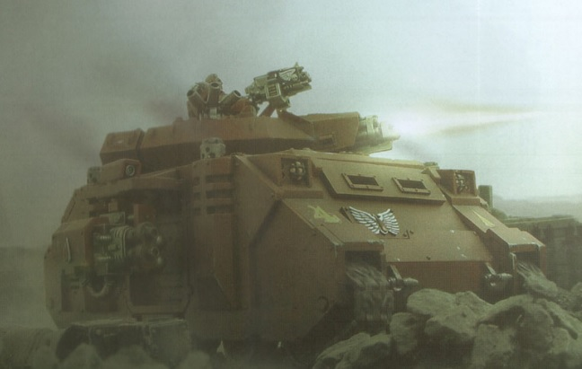
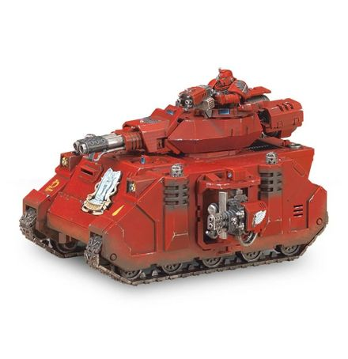
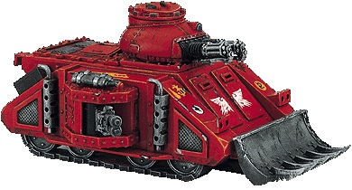

# 1489 巴尔掠食者坦克 Baal Predator

精校状态：中文行文已逐段精校，部分术语仍为暂定

分类：载具 / 地面 / 重型

原文来源：https://www.bilibili.com/opus/1040328606274813988

原作者：帝国神选罐头

原文时间：2025年03月04日 11:26

[返回分类目录](目录.md) · [全书目录](../../目录.md)

原篇名：巴尔掠食者 Baal Predator

<!-- A1489-B0001 -->
**英文原文**

The Baal Predator is an infantry support tank used only by the Blood Angels Space Marine Chapter and their Successor Chapters.

<!-- /A1489-B0001 -->

<!-- A1489-B0002 -->

原译文

巴尔掠食者是一种步兵支援坦克，仅由圣血天使星际战士战团及其子战团使用。

**校订译文**

巴尔掠食者坦克是一种步兵支援战车，仅由圣血天使及其子战团使用。

<!-- /A1489-B0002 -->

<!-- A1489-B0003 -->
**英文原文**

The Baal-variant of the Predator was developed by the Blood Angels' Techmarines, designed to carry weapons with a high rate of fire, giving it devastating anti-infantry power and enabling it to lay down a withering hail of fire as the Blood Angels advance, scything down enemy infantry and light vehicles with terrifying efficiency. Due to its specific weapon, Baal Predators are highly effective in close support of infantry assaults but have little effectiveness as an anti-tank weapon.

<!-- /A1489-B0003 -->

<!-- A1489-B0004 -->

原译文

掠食者的巴尔变体是由圣血天使的技术军士开发的，旨在携带高射速武器，赋予其毁灭性的反步兵力量，并使其能够在圣血天使前进时发射猛烈的炮火，以惊人的效率割除敌方步兵和轻型车辆。由于其特殊的武器，巴尔掠食者在近距离支援步兵攻击方面非常有效，但作为反坦克武器的效果很弱。

**校订译文**

巴尔型由圣血天使科技战士研发，旨在搭载高射速武器，获得强大的反步兵火力。它能在圣血天使推进时倾泻密集弹雨，以惊人效率扫倒敌方步兵和轻型载具。此种武器配置特别适合近距离支援步兵突击，反坦克效果则较差。

<!-- /A1489-B0004 -->

<!-- A1489-B0005 图片 -->

<!-- A1489-B0006 -->

原译文

Baal Predator 巴尔掠食者

**校订译文**

Baal Predator 巴尔掠食者

<!-- /A1489-B0006 -->

<!-- A1489-B0007 -->
## History 历史

<!-- /A1489-B0007 -->

<!-- A1489-B0008 -->
**英文原文**

Like the other Predator variants, the Baal is based on the ubiquitous Rhino chassis. The pattern has seen service with the Blood Angels almost since their inception as a Legion. The STC template for the Baal's construction was recovered during the early parts of the Great Crusade on Atium III, from the ruins of the arch-techno-heretic Lord de Ladt. Instead of giving the template to the Adeptus Mechanicus, the Blood Angels kept it and placed it within a stasis-cell on Baal where it remains to this day, protected as a relic of the Chapter. This has served as a source of friction between the Blood Angels, who continue to deny any wrongdoing, and the Adeptus Mechanicus, which claims that this variant and its STC template were never officially sanctified. Because of this, the design is now only produced by the Blood Angels themselves and by their descendant chapters.

<!-- /A1489-B0008 -->

<!-- A1489-B0009 -->

原译文

与其他掠食者变体一样，巴尔掠食者基于无处不在的犀牛底盘。自圣血天使军团成立以来，这种型号几乎一直在圣血天使军团服役。在大远征初期，巴尔掠食者的STC模版在阿提姆三号上被发现，它取自古代科技异端领主德拉特的遗迹之中。圣血天使没有将模板交给机械神教，而是将其保存并放置在巴尔的一个静滞舱内，直到今天，它仍然作为战团的圣物受到保护。这成为了圣血天使（他们继续否认任何不法行为）和机械神教之间摩擦的根源，后者声称这种变体及其STC模板从未被正式神圣化。因此，这个设计现在只由圣血天使自己和他们的子战团制作。

**校订译文**

巴尔型与其他掠食者一样，采用广泛使用的犀牛底盘。圣血天使从建成军团后不久就开始使用这一型号。大远征初期，其 STC 模板在阿提姆三号被发现，出自大科技异端德拉特领主遗留的废墟。圣血天使并未将模板交给机械修会，而是封存在巴尔的停滞舱内，至今仍将其作为战团圣物守护。这一直是双方关系紧张的根源：圣血天使否认有任何过错，机械修会则声称这一变体及其 STC 从未得到正式祝圣。因此，如今只有圣血天使及其子战团生产该型。

**校注：** arch-techno-heretic 的 arch- 表示首要/大，并非古代；修正为大科技异端。

<!-- /A1489-B0009 -->

<!-- A1489-B0010 -->
## Design 设计

<!-- /A1489-B0010 -->

<!-- A1489-B0011 -->
**英文原文**

Because of the Blood Angel's refusal to share its construction methods with others, the Baal's degree of similarity with other Predator tanks in its inner workings can only be speculated. The main observable differences are the weapons which the Baal Predator carries. The main turret mounts either a set of twin-linked assault cannons or a Flamestorm Cannon. The Flamestorm Baal Predators have been included in Blood Angels forces just recently. though some of the Adeptus Mechanicus tech-priests have linked it to the Predator variants of old.

<!-- /A1489-B0011 -->

<!-- A1489-B0012 -->

原译文

由于圣血天使拒绝与他人分享其制造方法，因此只能推测巴尔掠食者在内部运作方面与其他掠食者坦克的相似程度。主要可观察到的差异是巴尔掠食者携带的武器。主炮塔装有一套双联突击炮或火焰风暴炮。最近，火焰风暴巴尔掠食者被纳入圣血天使部队。尽管一些机械神教技术神甫将其与旧的掠食者变体联系起来。

**校订译文**

圣血天使拒绝向外分享制造方法，因此外人只能推测巴尔型的内部构造与其他掠食者有多相似。最明显的差别是武装：主炮塔装有双联突击炮或火焰风暴炮。按本稿所述，火焰风暴炮型是近期才加入圣血天使部队的，不过一些机械修会技术祭司认为它与古老掠食者变体有关。

<!-- /A1489-B0012 -->

<!-- A1489-B0013 图片 -->

<!-- A1489-B0014 -->

原译文

Baal Predator 巴尔掠食者

**校订译文**

Baal Predator 巴尔掠食者

<!-- /A1489-B0014 -->

<!-- A1489-B0015 -->
**英文原文**

Its side sponsons are capable of mounting heavy bolters or heavy flamers. This makes the Baal pattern highly effective at supporting close infantry assaults, part of the preferred method of combat practiced by the Blood Angels.

<!-- /A1489-B0015 -->

<!-- A1489-B0016 -->

原译文

它的侧舷能够安装重型爆矢枪或重型火焰枪。这使得巴尔型在支援近战步兵突击方面非常有效，这是圣血天使首选的战斗方法的一部分。

**校订译文**

侧舷可装重型爆矢枪或重型火焰喷射器，使巴尔型极适合近距离支援步兵突击，契合圣血天使偏爱的作战方式。

<!-- /A1489-B0016 -->

<!-- A1489-B0017 -->
### Lucifer Pattern Engine 路西法型引擎

<!-- /A1489-B0017 -->

<!-- A1489-B0018 -->
**英文原文**

The Lucifer Pattern Thermic Combustor Engine is an unique piece of technology presumably discovered by the Blood Angels along with the Baal Predator STC. This engine is a significantly more efficient machine and vehicle capable of higher speeds than the others of the same class. The Lucifer pattern Engine have its own disadvantages however: unlike the standard Predator engine it can't utilize a wide range of commonly available fuel sources, put an additional stress upon the hull and necessitate more intensive maintenance as well as regular prayers to aggrieved machine spirits. However the Blood Angels considers these problems as acceptable, because thanks to this engine their Battle-Brothers are able to enter the combat much faster then they might without it.

<!-- /A1489-B0018 -->

<!-- A1489-B0019 -->

原译文

路西法型热燃烧引擎是一项独特的技术，可能是由圣血天使通过巴尔掠食者STC发现的。这种引擎是一种效率更高的机器，搭载该引擎的载具能够达到比同级别更高的速度。然而，路西法型引擎有其自身的缺点：与标准的掠食者引擎不同，它不能利用各种常见的燃料来源，给车体带来额外的压力，需要更密集的维护以及定期向受屈的机魂祷告。然而，圣血天使认为这些问题是可以接受的，因为多亏了这个引擎，他们的战斗兄弟能够比没有它的时候更快地进入战斗。

**校订译文**

路西法型热燃烧引擎是一项独特技术，据信是圣血天使随巴尔掠食者 STC 一同发现的。其效率显著更高，能让车辆比同级车型跑得更快。不过，它也有缺点：与标准掠食者引擎不同，它无法广泛使用常见燃料，对车体施加的负荷更大，需要更频繁的维护，还须定期祈祷，安抚愤懑的机魂。圣血天使认为这些代价可以接受，因为它能让战斗兄弟更快投入战斗。

<!-- /A1489-B0019 -->

<!-- A1489-B0020 -->
### Equipment 装备

原题：Equipment 设备

<!-- /A1489-B0020 -->

<!-- A1489-B0021 -->
**英文原文**

The Baal Predator can also be equipped with a pintle-mounted Storm Bolter as well as Dozer Blades, Extra Armour, a Hunter-killer Missile, a Searchlight and Smoke Launchers.

<!-- /A1489-B0021 -->

<!-- A1489-B0022 -->

原译文

巴尔掠食者还可以配备一个枢轴式风暴爆矢枪以及推土机铲刀、额外装甲、猎杀飞弹、探照灯和烟雾发射器。

**校订译文**

巴尔掠食者还可加装枢轴枪架风暴爆矢枪、推土铲、附加装甲、猎杀导弹、探照灯和烟雾发射器。

<!-- /A1489-B0022 -->

<!-- A1489-B0023 图片 -->

<!-- A1489-B0024 -->

原译文

Baal Predator 巴尔掠食者

**校订译文**

Baal Predator 巴尔掠食者

<!-- /A1489-B0024 -->

<!-- A1489-B0025 -->
### Technical Information 技术资料

原题：Technical Information 技术信息

<!-- /A1489-B0025 -->

<!-- A1489-B0026 -->
**英文原文**

Vehicle Name:Baal Predator

<!-- /A1489-B0026 -->

<!-- A1489-B0027 -->

原译文

载具名称：巴尔掠食者

**校订译文**

载具名称：巴尔掠食者

<!-- /A1489-B0027 -->

<!-- A1489-B0028 -->
**英文原文**

Forge World of Origin:Baal

<!-- /A1489-B0028 -->

<!-- A1489-B0029 -->

原译文

起源铸造世界：巴尔

**校订译文**

起源铸造世界：巴尔

<!-- /A1489-B0029 -->

<!-- A1489-B0030 -->
**英文原文**

Known Patterns:I-VI

<!-- /A1489-B0030 -->

<!-- A1489-B0031 -->

原译文

已知型号：I - VI

**校订译文**

已知型号：I - VI

<!-- /A1489-B0031 -->

<!-- A1489-B0032 -->
**英文原文**

Crew:Driver, Gunner

<!-- /A1489-B0032 -->

<!-- A1489-B0033 -->

原译文

乘员：驾驶员，炮手

**校订译文**

乘员：驾驶员，炮手

<!-- /A1489-B0033 -->

<!-- A1489-B0034 -->
**英文原文**

Powerplant:Quad MkII Adaptable Thermic Combustor Reactor

<!-- /A1489-B0034 -->

<!-- A1489-B0035 -->

原译文

动力装置：阔德MkII适应性热燃烧反应堆

**校订译文**

动力装置：4台 MkII 自适应热燃烧反应堆

**校注：** 本表列四台MkII，但正文专讲路西法型引擎；源文配置版本差异保留。

<!-- /A1489-B0035 -->

<!-- A1489-B0036 -->
**英文原文**

Weight:44 tonnes

<!-- /A1489-B0036 -->

<!-- A1489-B0037 -->

原译文

重量：44吨

**校订译文**

重量：44吨

<!-- /A1489-B0037 -->

<!-- A1489-B0038 -->
**英文原文**

Length:6.6m

<!-- /A1489-B0038 -->

<!-- A1489-B0039 -->

原译文

长度：6.6米

**校订译文**

长度：6.6米

<!-- /A1489-B0039 -->

<!-- A1489-B0040 -->
**英文原文**

Width:6.0m (with sponsons)

<!-- /A1489-B0040 -->

<!-- A1489-B0041 -->

原译文

宽度：6.0米（带侧舷）

**校订译文**

宽度：6.0米（带侧舷）

<!-- /A1489-B0041 -->

<!-- A1489-B0042 -->
**英文原文**

Height:6.6m

<!-- /A1489-B0042 -->

<!-- A1489-B0043 -->

原译文

高度：6.6米

**校订译文**

高度：6.6米

<!-- /A1489-B0043 -->

<!-- A1489-B0044 -->
**英文原文**

Ground Clearance:0.44m

<!-- /A1489-B0044 -->

<!-- A1489-B0045 -->

原译文

离地间隙：0.44m

**校订译文**

离地间隙：0.44米

<!-- /A1489-B0045 -->

<!-- A1489-B0046 -->
**英文原文**

Fording Depth:{{{Fording Depth}}}

<!-- /A1489-B0046 -->

<!-- A1489-B0047 -->

原译文

涉水深度：｛｛｛涉水深度｝｝

**校订译文**

涉水深度：未提供

**校注：** 源文只有未展开模板，无实际涉水数据。

<!-- /A1489-B0047 -->

<!-- A1489-B0048 -->
**英文原文**

Max Speed - on road68kph

<!-- /A1489-B0048 -->

<!-- A1489-B0049 -->

原译文

最大速度-公路68公里/小时

**校订译文**

最大公路速度：68公里/小时

<!-- /A1489-B0049 -->

<!-- A1489-B0050 -->
**英文原文**

Max Speed - off road:50kph

<!-- /A1489-B0050 -->

<!-- A1489-B0051 -->

原译文

最大速度-越野：50公里/小时

**校订译文**

最大越野速度：50公里/小时

<!-- /A1489-B0051 -->

<!-- A1489-B0052 -->
**英文原文**

Transport Capacity:None

<!-- /A1489-B0052 -->

<!-- A1489-B0053 -->

原译文

运输能力：无

**校订译文**

运输能力：无

<!-- /A1489-B0053 -->

<!-- A1489-B0054 -->
**英文原文**

Access Points:n/a

<!-- /A1489-B0054 -->

<!-- A1489-B0055 -->

原译文

入口：无

**校订译文**

出入口：未提供（N/A）

<!-- /A1489-B0055 -->

<!-- A1489-B0056 -->
**英文原文**

Main Armament:Twin-linked Assault Cannons or Flamestorm Cannon

<!-- /A1489-B0056 -->

<!-- A1489-B0057 -->

原译文

主武器：双联突击炮或火焰风暴炮

**校订译文**

主武器：双联突击炮或火焰风暴炮

<!-- /A1489-B0057 -->

<!-- A1489-B0058 -->
**英文原文**

Secondary Armament:Sponson-mounted Heavy Flamers

<!-- /A1489-B0058 -->

<!-- A1489-B0059 -->

原译文

二级武器：侧舷重型火焰炮

**校订译文**

副武器：侧舷重型火焰喷射器

<!-- /A1489-B0059 -->

<!-- A1489-B0060 -->
**英文原文**

Traverse:360°

<!-- /A1489-B0060 -->

<!-- A1489-B0061 -->

原译文

横向：360°

**校订译文**

水平射界：360°

<!-- /A1489-B0061 -->

<!-- A1489-B0062 -->
**英文原文**

Elevation:From -15° to 28°

<!-- /A1489-B0062 -->

<!-- A1489-B0063 -->

原译文

仰角：-15°至28°

**校订译文**

俯仰角：−15°至+28°

<!-- /A1489-B0063 -->

<!-- A1489-B0064 -->
**英文原文**

Main Ammunition:1200 rounds

<!-- /A1489-B0064 -->

<!-- A1489-B0065 -->

原译文

主要弹药：1200发

**校订译文**

主武器载弹量：1200发

<!-- /A1489-B0065 -->

<!-- A1489-B0066 -->
**英文原文**

Secondary Ammunition:20 shots

<!-- /A1489-B0066 -->

<!-- A1489-B0067 -->

原译文

次要弹药：20发

**校订译文**

副武器弹药：可供20次射击

<!-- /A1489-B0067 -->

<!-- A1489-B0068 -->
### Armour 装甲

<!-- /A1489-B0068 -->

<!-- A1489-B0069 -->
**英文原文**

Superstructure:65mm

<!-- /A1489-B0069 -->

<!-- A1489-B0070 -->

原译文

上部结构：65毫米

**校订译文**

上部结构：65毫米

<!-- /A1489-B0070 -->

<!-- A1489-B0071 -->
**英文原文**

Hull:55mm

<!-- /A1489-B0071 -->

<!-- A1489-B0072 -->

原译文

车体：55毫米

**校订译文**

车体：55毫米

<!-- /A1489-B0072 -->

<!-- A1489-B0073 -->
**英文原文**

Gun Mantlet:65mm

<!-- /A1489-B0073 -->

<!-- A1489-B0074 -->

原译文

炮盾：65毫米

**校订译文**

炮盾：65毫米

<!-- /A1489-B0074 -->

<!-- A1489-B0075 -->
**英文原文**

Vehicle Designation:0120-766-0724-PR120

<!-- /A1489-B0075 -->

<!-- A1489-B0076 -->

原译文

车辆编号：0120-766-0724-PR120

**校订译文**

车辆编号：0120-766-0724-PR120

<!-- /A1489-B0076 -->

<!-- A1489-B0077 -->
**英文原文**

Firing Ports:n/a

<!-- /A1489-B0077 -->

<!-- A1489-B0078 -->

原译文

开火口：无

**校订译文**

射击孔：未提供（N/A）

<!-- /A1489-B0078 -->

<!-- A1489-B0079 -->
**英文原文**

Turret:65mm

<!-- /A1489-B0079 -->

<!-- A1489-B0080 -->

原译文

炮塔：65毫米

**校订译文**

炮塔：65毫米

<!-- /A1489-B0080 -->

<!-- A1489-B0081 -->
## Named Baal Predators 著名巴尔掠食者

<!-- /A1489-B0081 -->

<!-- A1489-B0082 -->
**英文原文**

Blood Brother — Angels Sanguine Chapter

<!-- /A1489-B0082 -->

<!-- A1489-B0083 -->

原译文

血之兄弟 — 血红天使战团

**校订译文**

血之兄弟号——鲜血天使战团。

<!-- /A1489-B0083 -->

本篇核心术语与暂定项

以下列出本篇出现的英文原形及核心术语表用词。同形词可能指不同对象，具体词义以本篇正文和校注为准；单复数、别名和仅见于图注的名称可能尚未列入。完整候选见[术语表](../../术语表/双语术语候选.csv)。

| 英文 | 采用中文 | 状态 |
| --- | --- | --- |
| Blood Angels | 圣血天使 | 官方已核对 |
| Adeptus Mechanicus | 机械修会 | 官方已核对 |
| Forge World | 铸造世界 | 暂定·官方待核 |
| Great Crusade | 大远征 | 暂定·官方待核 |
| STC | 标准建造模板 | 暂定·官方待核 |
| Hunter-Killer | 猎杀者 | 暂定·官方待核 |
| Baal | 巴尔 | 暂定·官方待核 |
| Baal Predator | 巴尔掠食者坦克 | 官方已核 |
| Tech | 技术语 | 暂定·官方待核 |
| Rhino | 犀牛战车 | 官方已核对 |
| Angels Sanguine | 鲜血天使 | 暂定·官方待核 |
| Space Marine | 星际战士 | 暂定·官方待核 |
| Chapter | 战团 | 暂定·官方待核 |
| Brother | 修士 | 暂定·官方待核 |
| Predators | 掠食者 | 暂定·官方待核 |
| Flamers | 火妖（奸奇单位）／火焰喷射器（武器） | 语境定译·对应官译已核 |
| Gun | 甘 | 暂定·官方待核 |
| The Blood | 鲜血 | 暂定·官方待核 |
| Hunter-killer missile | 猎杀导弹 | 官方已核对 |
| Bolter | 爆矢枪 | 暂定·官方待核 |
| Storm bolter | 风暴爆矢枪 | 官方已核对 |
| Flamestorm Cannon | 火焰风暴炮 | 暂定·官方待核 |
| Extra Armour | 额外装甲 | 暂定·官方待核 |
| Atium III | 阿提姆三号 | 暂定·官方待核 |
| Lord de Ladt | 德拉特领主 | 暂定·官方待核 |
| Lucifer Pattern Thermic Combustor Engine | 路西法型热燃烧引擎 | 暂定·官方待核 |

