# 1490 迪莫斯型掠食者 Deimos Pattern Predator

精校状态：中文行文已逐段精校，部分术语仍为暂定

分类：载具 / 地面 / 重型

原文来源：https://www.bilibili.com/opus/1045553957954387968

原作者：帝国神选罐头

原文时间：2025年03月18日 13:23

[返回分类目录](目录.md) · [全书目录](../../目录.md)

原篇名：火卫二掠食者 Deimos Pattern Predator

<!-- A1490-B0001 -->
**英文原文**

The Deimos Pattern Predator is an older design of Predator Battle Tank, dating back to the Great Crusade.

<!-- /A1490-B0001 -->

<!-- A1490-B0002 -->

原译文

火卫二型掠食者是掠食者战斗坦克的一种较旧的设计，可以追溯到大远征。

**校订译文**

迪莫斯型掠食者是掠食者战斗坦克的一种古老设计，可追溯至大远征时期。

<!-- /A1490-B0002 -->

<!-- A1490-B0003 图片 -->
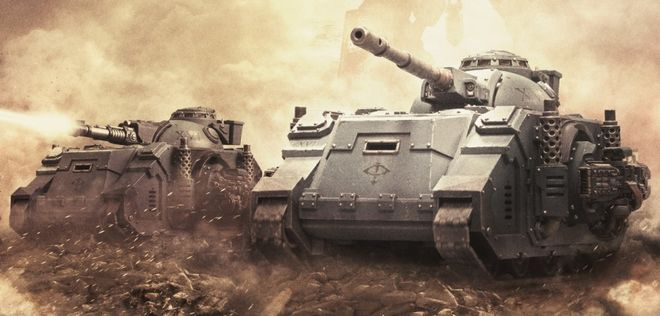

<!-- A1490-B0004 -->

原译文

Deimos Pattern Predators 火卫二型掠食者

**校订译文**

Deimos Pattern Predators 迪莫斯型掠食者

<!-- /A1490-B0004 -->

<!-- A1490-B0005 -->
## Overview 概述

<!-- /A1490-B0005 -->

<!-- A1490-B0006 -->
**英文原文**

An ancient and revered design of Predator Tank, cited by the Codex Astartes as a spiritual mentor, no less, there are almost as many patterns of Predator as there are of the ubiquitous Rhino hull it is based upon. One such variant is the Deimos Pattern Predator, first issued en-masse to the Space Marine Legions of the Great Crusade. Artificer-crafted by the finest machine-wrights of the great forge-complexes of Mars, the Deimos Pattern Predator has since been replaced by the Mars Pattern Mk.IVb variant by those Chapters who are supplied with this pattern.

<!-- /A1490-B0006 -->

<!-- A1490-B0007 -->

原译文

阿斯塔特圣典引用了一种古老而受人尊敬的掠食者坦克设计作为精神导师，同样，掠食者坦克的型号几乎和它所基于的无处不在的犀牛车体一样多。其中一种变体是火卫二型掠食者，首次大规模应用给大远征的星际战士。火卫二型掠食者是由火星上最优秀的铸造厂机械工人精心打造的，此后被提供这种型号的战团用火星型Mk.IVb变体所取代。

**校订译文**

掠食者设计古老而备受尊崇，《阿斯塔特圣典》甚至将其称为“精神导师”。它的型号几乎与所用犀牛底盘一样繁多，其中之一便是迪莫斯型，最初在大远征期间大批配发给星际战士军团。该型由火星大型锻造设施中最优秀的机械工匠精制而成；后来，能够获得新车型补给的战团逐渐以火星型 Mk.IVb 取代了它。

**校注：** 源文确有spiritual mentor精神导师说法，照录，不擅自换成技术鼻祖。

<!-- /A1490-B0007 -->

<!-- A1490-B0008 -->
## Technical Information 技术资料

原题：Technical Information 技术信息

<!-- /A1490-B0008 -->

<!-- A1490-B0009 -->
**英文原文**

Vehicle Name:Deimos Pattern Predator

<!-- /A1490-B0009 -->

<!-- A1490-B0010 -->

原译文

载具名称：火卫二型掠食者

**校订译文**

载具名称：迪莫斯型掠食者

<!-- /A1490-B0010 -->

<!-- A1490-B0011 -->
**英文原文**

Forge World of Origin:Unknown

<!-- /A1490-B0011 -->

<!-- A1490-B0012 -->

原译文

起源铸造世界：未知

**校订译文**

起源铸造世界：未知

<!-- /A1490-B0012 -->

<!-- A1490-B0013 -->
**英文原文**

Known Patterns:I-III

<!-- /A1490-B0013 -->

<!-- A1490-B0014 -->

原译文

已知型号：I-III

**校订译文**

已知型号：I-III

<!-- /A1490-B0014 -->

<!-- A1490-B0015 -->
**英文原文**

Crew:Driver, Gunner

<!-- /A1490-B0015 -->

<!-- A1490-B0016 -->

原译文

乘员：驾驶员，炮手

**校订译文**

乘员：驾驶员，炮手

<!-- /A1490-B0016 -->

<!-- A1490-B0017 -->
**英文原文**

Powerplant:Quad Mk.IV adaptable thermic comustor reactor

<!-- /A1490-B0017 -->

<!-- A1490-B0018 -->

原译文

动力装置：阔德Mk.IV适应性热燃烧反应堆

**校订译文**

动力装置：4台 Mk.IV 自适应热燃烧反应堆

**校注：** Quad 按相同犀牛/掠食者系列引擎命名译四台；Mk.IV与此前MkII不同，保留型号。

<!-- /A1490-B0018 -->

<!-- A1490-B0019 -->
**英文原文**

Weight:42 tonnes

<!-- /A1490-B0019 -->

<!-- A1490-B0020 -->

原译文

重量：42吨

**校订译文**

重量：42吨

<!-- /A1490-B0020 -->

<!-- A1490-B0021 -->
**英文原文**

Length:6.6m

<!-- /A1490-B0021 -->

<!-- A1490-B0022 -->

原译文

长度：6.6米

**校订译文**

长度：6.6米

<!-- /A1490-B0022 -->

<!-- A1490-B0023 -->
**英文原文**

Width:6m

<!-- /A1490-B0023 -->

<!-- A1490-B0024 -->

原译文

宽度：6米

**校订译文**

宽度：6米

<!-- /A1490-B0024 -->

<!-- A1490-B0025 -->
**英文原文**

Height:4.4m

<!-- /A1490-B0025 -->

<!-- A1490-B0026 -->

原译文

高度：4.4米

**校订译文**

高度：4.4米

<!-- /A1490-B0026 -->

<!-- A1490-B0027 -->
**英文原文**

Ground Clearance:0.44m

<!-- /A1490-B0027 -->

<!-- A1490-B0028 -->

原译文

离地间隙：0.44m

**校订译文**

离地间隙：0.44米

<!-- /A1490-B0028 -->

<!-- A1490-B0029 -->
**英文原文**

Fording Depth:

<!-- /A1490-B0029 -->

<!-- A1490-B0030 -->

原译文

涉水深度：

**校订译文**

涉水深度：

<!-- /A1490-B0030 -->

<!-- A1490-B0031 -->
**英文原文**

Max Speed - on road70kph

<!-- /A1490-B0031 -->

<!-- A1490-B0032 -->

原译文

最大速度-公路上70公里/小时

**校订译文**

最大公路速度：70公里/小时

<!-- /A1490-B0032 -->

<!-- A1490-B0033 -->
**英文原文**

Max Speed - off road:52kph

<!-- /A1490-B0033 -->

<!-- A1490-B0034 -->

原译文

最大速度-越野：52公里/小时

**校订译文**

最大越野速度：52公里/小时

<!-- /A1490-B0034 -->

<!-- A1490-B0035 -->
**英文原文**

Transport Capacity:None

<!-- /A1490-B0035 -->

<!-- A1490-B0036 -->

原译文

运输能力：无

**校订译文**

运输能力：无

<!-- /A1490-B0036 -->

<!-- A1490-B0037 -->
**英文原文**

Access Points:N/A

<!-- /A1490-B0037 -->

<!-- A1490-B0038 -->

原译文

入口：无

**校订译文**

出入口：未提供（N/A）

<!-- /A1490-B0038 -->

<!-- A1490-B0039 -->
**英文原文**

Main Armament:Autocannon (Destructor), Plasma Destroyer (Executioner),

<!-- /A1490-B0039 -->

<!-- A1490-B0040 -->

原译文

主要武器：自动炮（破坏者）、等离子毁灭炮（刽子手）

**校订译文**

主武器：自动炮（破坏者型）、等离子毁灭炮（处决者型）、

<!-- /A1490-B0040 -->

<!-- A1490-B0041 -->
**英文原文**

Flamestorm Cannon/Magna Melta (Infernus), Heavy Conversion Beam,

<!-- /A1490-B0041 -->

<!-- A1490-B0042 -->

原译文

火焰风暴炮/巨型热熔（炼狱），重型转换光束，

**校订译文**

火焰风暴炮／巨型热熔（炼狱型）、重型转化光束炮、

<!-- /A1490-B0042 -->

<!-- A1490-B0043 -->
**英文原文**

Neutron Blaster (Support Tank)

<!-- /A1490-B0043 -->

<!-- A1490-B0044 -->

原译文

中子爆破炮（支援坦克）

**校订译文**

中子爆破炮（支援坦克）

<!-- /A1490-B0044 -->

<!-- A1490-B0045 -->
**英文原文**

Secondary Armament:2x Twin-linked Heavy Bolters (Destructor/Infernus),

<!-- /A1490-B0045 -->

<!-- A1490-B0046 -->

原译文

二级武器：2x双联重型爆矢枪（破坏者/炼狱）

**校订译文**

副武器：2组双联重型爆矢枪（破坏者型／炼狱型）、

<!-- /A1490-B0046 -->

<!-- A1490-B0047 -->
**英文原文**

Lascannons (Executioner)

<!-- /A1490-B0047 -->

<!-- A1490-B0048 -->

原译文

激光炮（刽子手）

**校订译文**

激光炮（处决者型）

<!-- /A1490-B0048 -->

<!-- A1490-B0049 -->
**英文原文**

Traverse:180°

<!-- /A1490-B0049 -->

<!-- A1490-B0050 -->

原译文

横向：180°

**校订译文**

水平射界：180°

<!-- /A1490-B0050 -->

<!-- A1490-B0051 -->
**英文原文**

Elevation:From -32° to +42°

<!-- /A1490-B0051 -->

<!-- A1490-B0052 -->

原译文

仰角：从-32°到+42°

**校订译文**

俯仰角：−32°至+42°

<!-- /A1490-B0052 -->

<!-- A1490-B0053 -->
**英文原文**

Main Ammunition:120 Rounds (Destructor)

<!-- /A1490-B0053 -->

<!-- A1490-B0054 -->

原译文

主要弹药：120发（破坏者）

**校订译文**

主武器载弹量：120发（破坏者型）

<!-- /A1490-B0054 -->

<!-- A1490-B0055 -->
**英文原文**

Secondary Ammunition:1,100 rounds

<!-- /A1490-B0055 -->

<!-- A1490-B0056 -->

原译文

主要弹药：120发（破坏者）

**校订译文**

副武器载弹量：1100发

**校注：** 英文副武器为1100发，原译误重复主武器120发，已修复。

<!-- /A1490-B0056 -->

<!-- A1490-B0057 -->
### Armour 装甲

<!-- /A1490-B0057 -->

<!-- A1490-B0058 -->
**英文原文**

Superstructure:65mm

<!-- /A1490-B0058 -->

<!-- A1490-B0059 -->

原译文

上部结构：65毫米

**校订译文**

上部结构：65毫米

<!-- /A1490-B0059 -->

<!-- A1490-B0060 -->
**英文原文**

Hull:55mm

<!-- /A1490-B0060 -->

<!-- A1490-B0061 -->

原译文

车体：55毫米

**校订译文**

车体：55毫米

<!-- /A1490-B0061 -->

<!-- A1490-B0062 -->
**英文原文**

Gun Mantlet:65mm

<!-- /A1490-B0062 -->

<!-- A1490-B0063 -->

原译文

炮盾：65毫米

**校订译文**

炮盾：65毫米

<!-- /A1490-B0063 -->

<!-- A1490-B0064 -->
**英文原文**

Vehicle Designation:Unknown

<!-- /A1490-B0064 -->

<!-- A1490-B0065 -->

原译文

载具编号：未知

**校订译文**

载具编号：未知

<!-- /A1490-B0065 -->

<!-- A1490-B0066 -->
**英文原文**

Firing Ports:N/A

<!-- /A1490-B0066 -->

<!-- A1490-B0067 -->

原译文

开火口：无

**校订译文**

射击孔：未提供（N/A）

<!-- /A1490-B0067 -->

<!-- A1490-B0068 -->
**英文原文**

Turret:65mm

<!-- /A1490-B0068 -->

<!-- A1490-B0069 -->

原译文

炮塔：65毫米

**校订译文**

炮塔：65毫米

<!-- /A1490-B0069 -->

<!-- A1490-B0070 -->
## Variants 变体

<!-- /A1490-B0070 -->

<!-- A1490-B0071 -->
### Deimos Pattern Predator Destructor 迪莫斯型破坏者掠食者战车

原题：Deimos Pattern Predator Destructor 火卫二型掠食者破坏者

<!-- /A1490-B0071 -->

<!-- A1490-B0072 -->
**英文原文**

The Deimos Pattern predator Destructor is mounted with an Autocannon and sponson-mounted Heavy Bolters.

<!-- /A1490-B0072 -->

<!-- A1490-B0073 -->

原译文

火卫二型掠食者破坏者安装有自动炮和安装在舷侧的重型爆矢枪。

**校订译文**

迪莫斯型破坏者掠食者战车配备自动炮和侧舷重型爆矢枪。

<!-- /A1490-B0073 -->

<!-- A1490-B0074 图片 -->
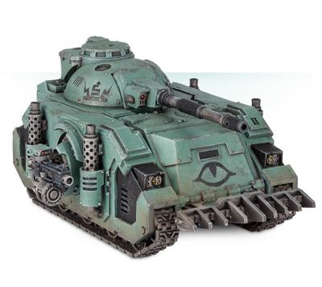

<!-- A1490-B0075 -->

原译文

Deimos Predator Destructor with Autocannon 配备自动炮的火卫二掠食者破坏者

**校订译文**

Deimos Predator Destructor with Autocannon 配备自动炮的迪莫斯型破坏者掠食者战车

<!-- /A1490-B0075 -->

<!-- A1490-B0076 -->
### Deimos Pattern Predator Infernus 迪莫斯型炼狱掠食者

原题：Deimos Pattern Predator Infernus 火卫二型掠食者炼狱

<!-- /A1490-B0076 -->

<!-- A1490-B0077 -->
**英文原文**

An ancient design dating back to the early days of the Great Crusade, the Deimos Pattern Predator Infernus is armed with a fearsome Flamestorm Cannon or Magna-Melta as well as Heavy Flamers and Heavy Bolters. STC data indicates that the Deimos Pattern Infernus may have been an attempt to replicate the Baal Predator design after the Blood Angels refused to share the design with the Adeptus Mechanicus. Accordingly, the Mechanicus maintains that the design is superior to the Baal Predator in speed, protection, and firepower.

<!-- /A1490-B0077 -->

<!-- A1490-B0078 -->

原译文

火卫二型掠食者炼狱是一种古老的设计，可以追溯到大远征的早期，它配备了可怕的火焰风暴炮或巨型热熔以及重型火焰枪和重型爆矢枪。STC数据表明，火卫二型炼狱可能是在圣血天使拒绝与机械神教分享设计后，试图复制巴尔掠食者的设计。因此，机械神教认为该设计在速度、防护和火力方面优于巴尔掠食者。

**校订译文**

迪莫斯型炼狱掠食者可追溯至大远征初期，装备威力可怖的火焰风暴炮或巨型热熔，以及重型火焰喷射器和重型爆矢枪。STC 数据表明，该型可能是在圣血天使拒绝向机械修会分享巴尔掠食者设计后，试图仿造它的产物。机械修会也因此坚持宣称，自己的设计在速度、防护和火力上都优于巴尔型。

<!-- /A1490-B0078 -->

<!-- A1490-B0079 图片 -->
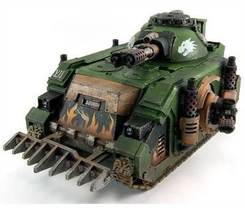

<!-- A1490-B0080 -->

原译文

Deimos Predator Infernus with Flamestorm Cannon 配备火焰风暴炮的火卫二掠食者炼狱

**校订译文**

Deimos Predator Infernus with Flamestorm Cannon 配备火焰风暴炮的迪莫斯型炼狱掠食者

<!-- /A1490-B0080 -->

<!-- A1490-B0081 -->
**英文原文**

The ancient design however has largely been replaced by the Land Raider Redeemer in most Chapters, including the Crimson Fists, Fire Lords, and Subjugators. But with the new Tyranid menace emerging across the Imperium, the Deimos Pattern Infernus' close-range firepower has seen renewed use and interest by many within the Space Marine Chapters.

<!-- /A1490-B0081 -->

<!-- A1490-B0082 -->

原译文

然而，在大多数战团中，古老的设计在很大程度上兰德掠袭者救赎者所取代，包括绯红之拳、火焰领主和征服者。但随着新的泰拉尼威胁在帝国中出现，火卫二模式地狱的近距离火力得到了太空海军陆战队许多人的重新使用和兴趣。

**校订译文**

在大多数战团中，包括绯红之拳、火焰领主和征服者，这一古老设计已大体被救赎者型兰德掠袭者战车取代。不过，随着泰伦威胁在帝国各地出现，许多战团重新重视并启用了迪莫斯型炼狱掠食者的近距离火力。

<!-- /A1490-B0082 -->

<!-- A1490-B0083 -->
### Deimos Pattern Predator Executioner 迪莫斯型处决者掠食者

原题：Deimos Pattern Predator Executioner 火卫二型掠食者刽子手

<!-- /A1490-B0083 -->

<!-- A1490-B0084 -->
**英文原文**

A design that is prized in the Imperium but now almost entirely lost, the Deimos Executioner is armed with a mighty Plasma destroyer. The powerful weapon allows it to blast apart even the most powerful armour with contemptuous ease. However, only the Forge World of Ryza is still able to manufacture the advanced photo-plasmic cells needed for the Executioners weapon. As a result of this spare parts shortage, many chapters' Techmarines have replaced the main Plasma Destroyer with a Conversion Beamer. This modification turns the Executioner into a powerful siege tank and long-range tank destroyer, but this firepower is gained at the cost of manoeuvrability and increases vulnerability to short-range attacks.

<!-- /A1490-B0084 -->

<!-- A1490-B0085 -->

原译文

火卫二刽子手的设计在帝国中很受重视，但现在几乎完全消失了，它配备了一门强大的等离子毁灭炮。强大的武器使它能够轻松地摧毁最强大的盔甲。然而，只有瑞扎的铸造世界仍然能够制造出刽子手武器所需的先进光离子容器。由于备件短缺，许多战团的技术军士已经用转换光束取代了主要的等离子毁灭炮。这种修改将刽子手变成了一种强大的攻城坦克和远程坦克歼击车，但这种火力是以机动性为代价的，增加了对近战攻击的脆弱性。

**校订译文**

迪莫斯型处决者的设计在帝国备受珍视，如今却几近失传。它装备强大的等离子毁灭炮，连最厚重的装甲也能轻易轰碎。然而，只有瑞扎铸造世界仍能制造这种武器所需的先进光等离子能量电池。由于备件短缺，许多战团的科技战士将主武器改为转化光束炮，使其成为强大的攻城坦克与远程坦克歼击车。代价是机动性下降，面对近距离攻击时更加脆弱。

**校注：** photo-plasmic cells 指能量电池，不是光离子容器；short-range attacks 包含近距离射击，不局限近战。

<!-- /A1490-B0085 -->

<!-- A1490-B0086 图片 -->
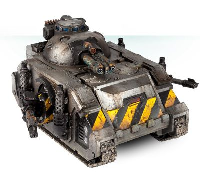

<!-- A1490-B0087 -->

原译文

Deimos Predator Executioner with Plasma Destroyer 配备等离子毁灭炮的火卫二掠食者刽子手

**校订译文**

Deimos Predator Executioner with Plasma Destroyer 配备等离子毁灭炮的迪莫斯型处决者掠食者

<!-- /A1490-B0087 -->

<!-- A1490-B0088 -->
## Weaponry during the Horus Heresy 荷鲁斯之乱时期的武器

原题：Weaponry during the Horus Heresy 荷鲁斯叛乱时期的武器

<!-- /A1490-B0088 -->

<!-- A1490-B0089 -->
**英文原文**

During the Horus Heresy, additional weaponry was available to the Deimos Predator, in place of the regular Predator Cannon:

<!-- /A1490-B0089 -->

<!-- A1490-B0090 -->

原译文

在荷鲁斯叛乱时期，火卫二掠食者获得了额外的武器，以代替常规的掠食者加农炮：

**校订译文**

荷鲁斯之乱期间，迪莫斯型掠食者还可选用下列武器，替换常规掠食者加农炮：

<!-- /A1490-B0090 -->

<!-- A1490-B0091 图片 -->
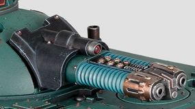

<!-- A1490-B0092 -->

原译文

Executioner Plasma Destroyer 刽子手等离子破坏炮

**校订译文**

Executioner Plasma Destroyer 处决者等离子毁灭炮

<!-- /A1490-B0092 -->

<!-- A1490-B0093 图片 -->
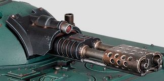

<!-- A1490-B0094 -->

原译文

Flamestorm Cannon 火焰风暴炮

**校订译文**

Flamestorm Cannon 火焰风暴炮

<!-- /A1490-B0094 -->

<!-- A1490-B0095 图片 -->
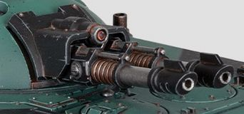

<!-- A1490-B0096 -->

原译文

Gravis Lascannon 重型激光炮

**校订译文**

Gravis Lascannon 重型激光炮

<!-- /A1490-B0096 -->

<!-- A1490-B0097 图片 -->
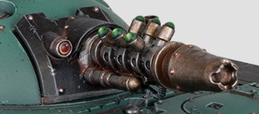

<!-- A1490-B0098 -->

原译文

Graviton Cannon 重力炮

**校订译文**

Graviton Cannon 重力炮

<!-- /A1490-B0098 -->

<!-- A1490-B0099 图片 -->
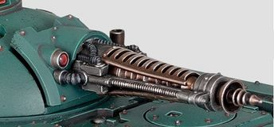

<!-- A1490-B0100 -->

原译文

Heavy Conversion Beam Cannon 重型转换光束炮

**校订译文**

Heavy Conversion Beam Cannon 重型转化光束炮

<!-- /A1490-B0100 -->

<!-- A1490-B0101 图片 -->
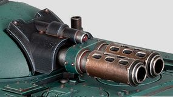

<!-- A1490-B0102 -->

原译文

Magna-Melta Cannon 巨型热熔炮

**校订译文**

Magna-Melta Cannon 巨型热熔炮

<!-- /A1490-B0102 -->

<!-- A1490-B0103 图片 -->
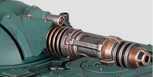

<!-- A1490-B0104 -->

原译文

Neutron Blaster 中子爆破炮

**校订译文**

Neutron Blaster 中子爆破炮

<!-- /A1490-B0104 -->

<!-- A1490-B0105 图片 -->
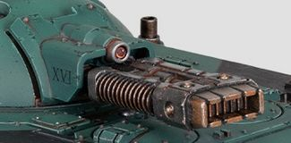

<!-- A1490-B0106 -->

原译文

Volkite Macro-Saker 爆燃巨型长管炮

**校订译文**

Volkite Macro-Saker 爆燃巨型长管炮

<!-- /A1490-B0106 -->

<!-- A1490-B0107 -->
**英文原文**

Some Legions such as the Imperial Fists and Blood Angels, also made use of the Iliastus Assault Cannon on the main turret, a prototype weapon designed as a more compact and portable variant of the Kheres pattern.

<!-- /A1490-B0107 -->

<!-- A1490-B0108 -->

原译文

一些军团，如帝国之拳和圣血天使，也在主炮塔上使用了伊利亚斯图斯突击炮，这种原型武器的设计像更紧凑、更便携的克雷斯型变体。

**校订译文**

帝国之拳和圣血天使等军团还曾在主炮塔安装伊利亚斯图斯突击炮。这是一种原型武器，旨在将克雷斯型的设计改得更紧凑、更便携。

<!-- /A1490-B0108 -->

本篇核心术语与暂定项

以下列出本篇出现的英文原形及核心术语表用词。同形词可能指不同对象，具体词义以本篇正文和校注为准；单复数、别名和仅见于图注的名称可能尚未列入。完整候选见[术语表](../../术语表/双语术语候选.csv)。

| 英文 | 采用中文 | 状态 |
| --- | --- | --- |
| Blood Angels | 圣血天使 | 官方已核对 |
| Adeptus Mechanicus | 机械修会 | 官方已核对 |
| Horus Heresy | 荷鲁斯之乱 | 官方已核对 |
| Imperium | 帝国 | 暂定·简称 |
| Imperial Fists | 帝国之拳 | 暂定 |
| Forge World | 铸造世界 | 暂定·官方待核 |
| Great Crusade | 大远征 | 暂定·官方待核 |
| Horus | 荷鲁斯 | 暂定·官方待核 |
| STC | 标准建造模板 | 暂定·官方待核 |
| Redeemer | 救赎者 | 暂定·官方待核 |
| Mars | 火星 | 暂定·官方待核 |
| Ryza | 瑞扎 | 暂定·官方待核 |
| Deimos | 迪莫斯 | 暂定·官方待核 |
| Baal | 巴尔 | 暂定·官方待核 |
| Land Raider | 兰德掠袭者战车 | 官方已核对 |
| Baal Predator | 巴尔掠食者坦克 | 官方已核 |
| Conversion Beamer | 转化光束炮 | 暂定·官方待核 |
| Ancient | 旗手 | 官方已核对 |
| Rhino | 犀牛战车 | 官方已核对 |
| Predator Destructor | 破坏者型掠食者战车 | 官方已核对 |
| Crimson Fists | 绯红之拳 | 暂定·官方待核 |
| Destroyer | 毁灭者 | 暂定·官方待核 |
| Space Marine | 星际战士 | 暂定·官方待核 |
| Codex Astartes | 阿斯塔特圣典 | 暂定·官方待核 |
| Executioners | 处刑者 | 语境定译·官方待核 |
| Fire Lords | 火焰领主 | 暂定·官方待核 |
| Subjugators | 压制者 | 暂定·官方待核 |
| Artificer | 技工 | 暂定·官方待核 |
| Flamers | 火妖（奸奇单位）／火焰喷射器（武器） | 语境定译·对应官译已核 |
| Destructor | 破坏者（史洛斯类别） | 暂定·官方待核 |
| Land Raider Redeemer | 救赎者型兰德掠袭者战车 | 官方已核对 |
| Raider | 掠袭者飞艇 | 官方已核对 |
| Gun | 甘 | 暂定·官方待核 |
| The Blood | 鲜血 | 暂定·官方待核 |
| Autocannon | 自动炮 | 暂定·官方待核 |
| Assault Cannon | 突击炮 | 暂定·官方待核 |
| Neutron Blaster | 中子爆破炮 | 暂定·官方待核 |
| Flamestorm Cannon | 火焰风暴炮 | 暂定·官方待核 |
| Magna-Melta | 巨型热熔 | 暂定·官方待核 |
| Plasma Destroyer | 等离子毁灭炮 | 暂定·官方待核 |
| Deimos Pattern Predator | 迪莫斯型掠食者 | 暂定·官方待核 |
| Deimos Pattern Predator Infernus | 迪莫斯型炼狱掠食者 | 暂定·官方待核 |

