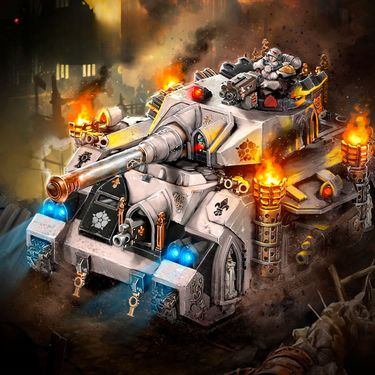
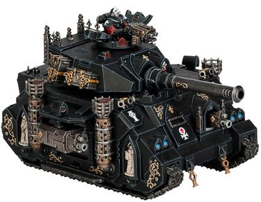
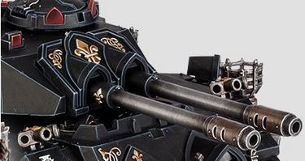

# 1491 惩戒者战斗坦克 Castigator Battle Tank

精校状态：中文行文已逐段精校，部分术语仍为暂定

分类：载具 / 地面 / 重型

原文来源：https://www.bilibili.com/opus/1214383964139028496

原作者：帝国神选罐头

原文时间：2026年06月16日 12:30

[返回分类目录](目录.md) · [全书目录](../../目录.md)

<!-- A1491-B0001 -->
**英文原文**

The Castigator is a type of Battle Tank used by the Adepta Sororitas.

<!-- /A1491-B0001 -->

<!-- A1491-B0002 -->

原译文

惩戒者是修女会使用的一种战斗坦克。

**校订译文**

惩戒者坦克是修女会使用的一种战斗坦克。

<!-- /A1491-B0002 -->

<!-- A1491-B0003 图片 -->

<!-- A1491-B0004 -->

原译文

Castigator Battle Tank of the Order of the Sacred Rose 神圣玫瑰修会的惩戒者战斗坦克

**校订译文**

Castigator Battle Tank of the Order of the Sacred Rose 神圣玫瑰修会的惩戒者战斗坦克

<!-- /A1491-B0004 -->

<!-- A1491-B0005 -->
**英文原文**

Like the Predator of the Space Marines, the Castigator is built on a Rhino chassis. Similar to its Predator cousin, it fulfills a dedicated fire support role on the battlefield. Its main weapon consists of either a Battle Cannon or twin Autocannons. Support weapons consist of two sponson-mounted Heavy Bolters, a third hull-mounted Heavy Bolter, and a pintle-mounted Storm Bolter.

<!-- /A1491-B0005 -->

<!-- A1491-B0006 -->

原译文

与星际战士的掠食者一样，惩戒者也是建立在犀牛底盘上的。与掠食者类似，它在战场上扮演着专门的火力支援角色。它的主要武器由一门战斗炮或双联自动炮组成。支援武器由两个安装在舷侧的重型爆矢枪、第三个安装在车体上的重型爆矢枪和一个安装在枢轴上的风暴爆矢枪组成。

**校订译文**

惩戒者与星际战士的掠食者一样，以犀牛底盘为基础，专门承担战场火力支援任务。其主武器可选战斗炮或一对自动炮；辅助武器包括两挺侧舷重型爆矢枪、一挺车体重型爆矢枪，以及枢轴枪架上的风暴爆矢枪。

<!-- /A1491-B0006 -->

<!-- A1491-B0007 图片 -->

<!-- A1491-B0008 -->

原译文

Castigator Tank 惩戒者坦克

**校订译文**

Castigator Tank 惩戒者坦克

<!-- /A1491-B0008 -->

<!-- A1491-B0009 图片 -->

<!-- A1491-B0010 -->

原译文

Castigator turret with twin Autocannons 双联自动炮惩戒者炮塔

**校订译文**

Castigator turret with twin Autocannons 配备一对自动炮的惩戒者炮塔

<!-- /A1491-B0010 -->

本篇核心术语与暂定项

以下列出本篇出现的英文原形及核心术语表用词。同形词可能指不同对象，具体词义以本篇正文和校注为准；单复数、别名和仅见于图注的名称可能尚未列入。完整候选见[术语表](../../术语表/双语术语候选.csv)。

| 英文 | 采用中文 | 状态 |
| --- | --- | --- |
| Space Marines | 星际战士 | 官方已核对 |
| Adepta Sororitas | 修女会 | 官方已核对 |
| Castigator | 惩戒者坦克 | 官方已核对 |
| Rhino | 犀牛战车 | 官方已核对 |
| Battle Cannon | 战斗炮 | 暂定·官方待核 |
| Bolter | 爆矢枪 | 暂定·官方待核 |
| Heavy bolter | 重型爆矢枪 | 官方已核对 |
| Storm bolter | 风暴爆矢枪 | 官方已核对 |

