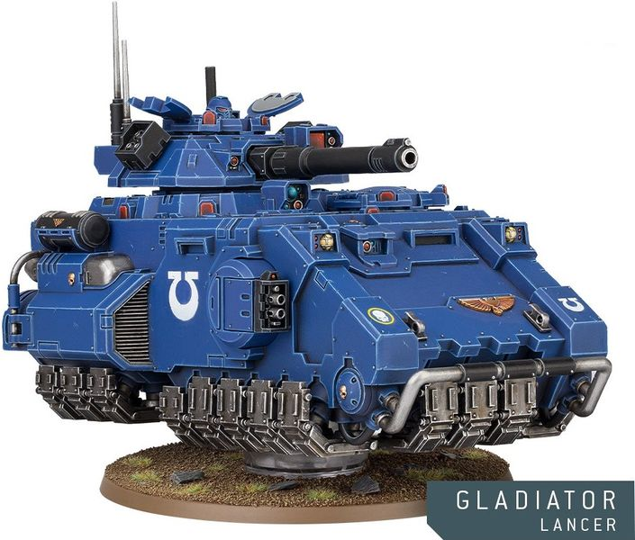
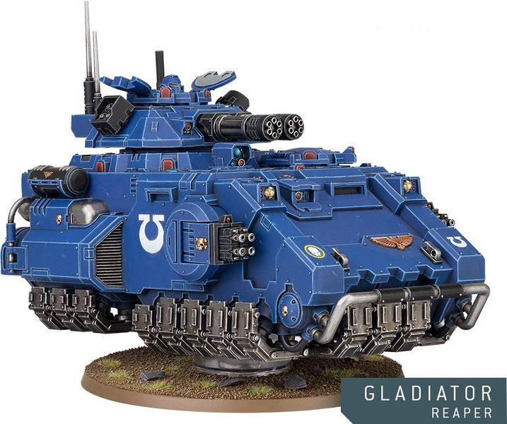
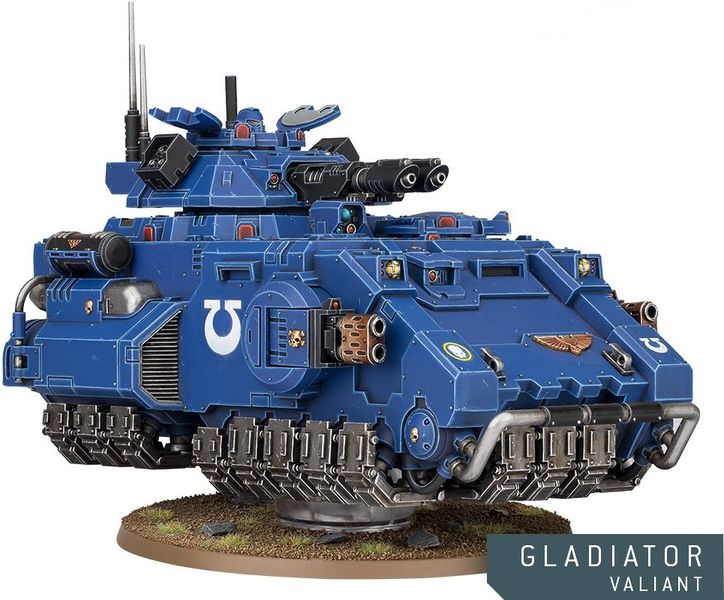

# 1492 角斗士反重力战斗坦克 Gladiator Grav Battle Tank

精校状态：中文行文已逐段精校，部分术语仍为暂定

分类：载具 / 地面 / 重型

原文来源：https://www.bilibili.com/opus/1040328679292403737

原作者：帝国神选罐头

原文时间：2025年03月04日 11:26

[返回分类目录](目录.md) · [全书目录](../../目录.md)

<!-- A1492-B0001 -->
**英文原文**

The Gladiator is a fast and flexible Primaris Space Marine Grav Battle Tank.

<!-- /A1492-B0001 -->

<!-- A1492-B0002 -->

原译文

角斗士是一种快速灵活的原铸星际战士重型战斗坦克。

**校订译文**

角斗士是一种速度快、机动灵活的原铸星际战士反重力战斗坦克。

**校注：** Grav 指反重力，原译重型丢失技术类别。

<!-- /A1492-B0002 -->

<!-- A1492-B0003 -->
## Overview 概述

<!-- /A1492-B0003 -->

<!-- A1492-B0004 -->
**英文原文**

Designed by Belisarius Cawl, the Gladiator is based on the chassis of the Impulsor. Its chassis is more heavily armoured, with its open-topped transport bay replaced with a fully enclosed hull. This design relationship mirrors that of the classic Predator battle tank and the ubiquitous Rhino, sacrificing transport capacity for reinforced armour, a powerful, turret-mounted primary weapon system, and additional weaponry mounted in side sponsons. The Gladiator is more heavily armed and armoured than the Predator, but its main advantage lies in its manoeuvrability.

<!-- /A1492-B0004 -->

<!-- A1492-B0005 -->

原译文

角斗士坦克由贝利撒留·考尔设计，基于反击者的底盘。它的底盘装甲更重，顶部敞开的运输舱被完全封闭的车体所取代。这种设计关系反映了经典的掠食者战斗坦克和无处不在的犀牛装甲车的设计关系，为强化装甲、强大的炮塔式主武器系统和安装在侧舷上的额外武器牺牲了运输能力。角斗士的武装和装甲比捕食者更重，但它的主要优势在于机动性。

**校订译文**

角斗士由贝利萨留斯·考尔设计，以脉冲战车底盘为基础，增厚装甲，并以全封闭车体取代敞顶载员舱。二者的关系类似于经典掠食者坦克与犀牛：牺牲载员能力，换取更强防护、强大的炮塔主武器，以及侧舷辅助武器。角斗士的武装和装甲均强于掠食者，但最大的优势仍是机动性。

**校注：** 英文 Impulsor 是脉冲战车，原译反击者误指Repulsor。

<!-- /A1492-B0005 -->

<!-- A1492-B0006 -->
**英文原文**

The Gladiator's equipment includes a communications array. It is propelled by a jet unit.

<!-- /A1492-B0006 -->

<!-- A1492-B0007 -->

原译文

角斗士的装备包括一个通信阵列。它由喷射装置推进。

**校订译文**

角斗士的装备包括一个通信阵列。它由喷射装置推进。

<!-- /A1492-B0007 -->

<!-- A1492-B0008 -->
### Variants 变体

<!-- /A1492-B0008 -->

<!-- A1492-B0009 -->
**英文原文**

The Gladiator comes in three forms:

<!-- /A1492-B0009 -->

<!-- A1492-B0010 -->

原译文

角斗士有三种形态：

**校订译文**

角斗士有三种型号：

<!-- /A1492-B0010 -->

<!-- A1492-B0011 -->
**英文原文**

Gladiator Lancer – An anti-tank sniper equipped with a Heavy Laser Destroyer that is ideal for tearing through a foe's most durable war machines and monsters. Such is its range that it can eliminate threats before accompanying Space Marines encounter them.

<!-- /A1492-B0011 -->

<!-- A1492-B0012 -->

原译文

角斗士枪骑兵 - 一种配备重型激光毁灭炮的反坦克狙击手，非常适合撕裂敌人最耐用的战争机械和怪物。它的射程如此之远，以至于它可以在陪同的星际战士遇到威胁之前消除威胁。

**校订译文**

枪骑型角斗士战车——以重型激光毁灭炮执行远程反坦克精确射击，足以摧毁敌方最坚固的战争机器与巨兽。射程之远，能在伴随的星际战士接触威胁前将其消灭。

<!-- /A1492-B0012 -->

<!-- A1492-B0013 图片 -->

<!-- A1492-B0014 -->

原译文

Gladiator Lancer 角斗士枪骑兵

**校订译文**

Gladiator Lancer 枪骑型角斗士战车

<!-- /A1492-B0014 -->

<!-- A1492-B0015 -->
**英文原文**

Gladiator Reaper - Anti-infantry variant that uses Tempest Bolters and a twin Onslaught Heavy Gatling Cannon. Its main weapons have an incredible high rate of fire. The Reaper can additional mount an Icarus Rocket Pod for anti-air duty.

<!-- /A1492-B0015 -->

<!-- A1492-B0016 -->

原译文

角斗士收割者 - 一种反步兵变体，使用暴风爆矢枪和双联突击重型加特林炮。它的主要武器具有令人难以置信的高射速。收割者可以额外安装伊卡洛斯火箭巢用于防空任务。

**校订译文**

死神型角斗士战车——反步兵变体，使用暴风爆矢枪和成对猛攻重型加特林炮，主武器射速极高。它还可加装伊卡洛斯火箭舱，执行防空任务。

<!-- /A1492-B0016 -->

<!-- A1492-B0017 图片 -->

<!-- A1492-B0018 -->

原译文

Gladiator Reaper 角斗士收割者

**校订译文**

Gladiator Reaper 死神型角斗士战车

<!-- /A1492-B0018 -->

<!-- A1492-B0019 -->
**英文原文**

Gladiator Valiant - A short-ranged armor hunter specializing in escorting transports and troops. It uses twin Las-Talons and Multi-meltas to scrap armor and heavy infantry alike.

<!-- /A1492-B0019 -->

<!-- A1492-B0020 -->

原译文

角斗士勇士 - 一名短程装甲猎手，专门护送运输工具和部队。它使用双联激光爪和多管热熔来摧毁装甲和重型步兵。

**校订译文**

豪侠型角斗士战车——专门护送运输载具与部队的近距离装甲猎手，利用成对激光爪和多管热熔摧毁装甲载具与重装步兵。

<!-- /A1492-B0020 -->

<!-- A1492-B0021 图片 -->

<!-- A1492-B0022 -->

原译文

Gladiator Valiant 角斗士勇士

**校订译文**

Gladiator Valiant 豪侠型角斗士战车

<!-- /A1492-B0022 -->

本篇核心术语与暂定项

以下列出本篇出现的英文原形及核心术语表用词。同形词可能指不同对象，具体词义以本篇正文和校注为准；单复数、别名和仅见于图注的名称可能尚未列入。完整候选见[术语表](../../术语表/双语术语候选.csv)。

| 英文 | 采用中文 | 状态 |
| --- | --- | --- |
| Space Marines | 星际战士 | 官方已核对 |
| Equipment | 装备 | 编辑用语已统一 |
| Rhino | 犀牛战车 | 官方已核对 |
| Belisarius Cawl | 贝利萨留斯·考尔 | 官方已核对 |
| Destroyer | 毁灭者 | 暂定·官方待核 |
| Space Marine | 星际战士 | 暂定·官方待核 |
| Primaris Space Marine | 原铸星际战士 | 暂定·官方待核 |
| Impulsor | 脉冲战车（载具）／冲击者（小队名） | 语境定译·载具官译已核 |
| Gladiator | 角斗士坦克 | 暂定·官方待核 |
| Reaper | 收割者号 | 暂定·官方待核 |
| System | 星系（恒星系统） | 暂定·官方待核 |
| Rocket Pod | 火箭吊舱 | 暂定·官方待核 |
| Icarus Rocket Pod | 伊卡洛斯火箭舱 | 暂定·官方待核 |
| Onslaught Heavy Gatling Cannon | 猛攻重型加特林炮 | 暂定·官方待核 |
| Laser Destroyer | 激光毁灭炮 | 暂定·官方待核 |
| Heavy Laser Destroyer | 重型激光毁灭炮 | 暂定·官方待核 |
| Gladiator Lancer | 枪骑型角斗士战车 | 官方已核对 |
| Gladiator Reaper | 死神型角斗士战车 | 官方已核对 |
| Gladiator Valiant | 豪侠型角斗士战车 | 官方已核对 |

