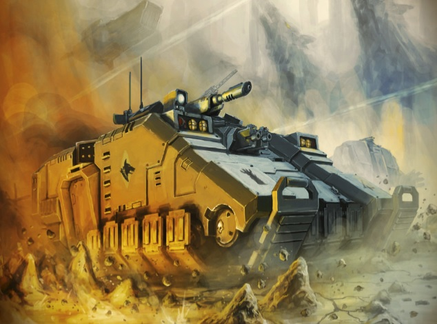
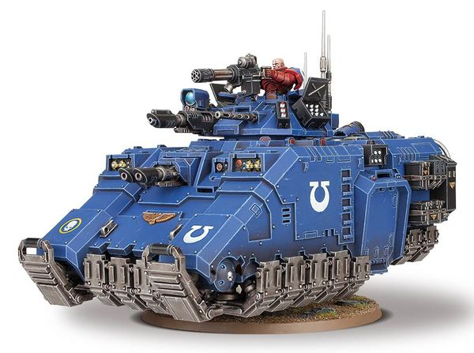

# 1493 反重力战车 Repulsor Battle Tank

精校状态：中文行文已逐段精校，部分术语仍为暂定

分类：载具 / 地面 / 重型

原文来源：https://www.bilibili.com/opus/1040328765191749651

原作者：帝国神选罐头

原文时间：2025年03月04日 11:26

[返回分类目录](目录.md) · [全书目录](../../目录.md)

原篇名：反击者战斗坦克 Repulsor Battle Tank

<!-- A1493-B0001 -->
**英文原文**

The Repulsor is a newly unleashed battle tank used by Primaris Space Marines.

<!-- /A1493-B0001 -->

<!-- A1493-B0002 -->

原译文

反击者是原铸星际战士使用的新型战斗坦克。

**校订译文**

反重力战车是原铸星际战士新近投入使用的战斗坦克。

<!-- /A1493-B0002 -->

<!-- A1493-B0003 图片 -->

<!-- A1493-B0004 -->

原译文

Repulsor 反击者

**校订译文**

Repulsor 反重力战车

<!-- /A1493-B0004 -->

<!-- A1493-B0005 -->
## Overview 概述

<!-- /A1493-B0005 -->

<!-- A1493-B0006 -->
**英文原文**

The Repulsor is recognisably of the same STC origins as the armoured vehicles used by their Space Marine brethern. Like the Primaris' weapons and power armour, the Repulsor is created in the forges of Mars; though whether its design is based on recovered ancient technology or from Archmagos Dominus Belisarius Cawl's own mind is unknown.

<!-- /A1493-B0006 -->

<!-- A1493-B0007 -->

原译文

反击者与他们的星际战士兄弟使用的装甲车具有相同的STC起源。与原铸的武器和动力盔甲一样，反击者也是在火星的铸造厂中制造的；尽管它的设计是基于恢复的古代技术还是基于神圣大贤者贝利撒留·考尔自己的想法尚不清楚。

**校订译文**

从设计上看，反重力战车显然与其他星际战士装甲载具具有相同的 STC 技术源流。它与原铸武器、动力甲一样，在火星的锻炉中制造；不过，其设计究竟来自重新发现的古代技术，还是出自统御大贤者贝利萨留斯·考尔本人，仍不得而知。

<!-- /A1493-B0007 -->

<!-- A1493-B0008 -->
**英文原文**

The Repulsor armoured transport is a deadly combination of maneuverability and brute force. Due to the turbine array at its rear, it has tremendous power, and it is held aloft by powerful anti-gravitic generators. The Repulsor is so heavily armed and armoured that it does not skim over the landscape as many grav-tanks do, but instead crushes the ground below it, grinding apart any caught within its contra-gravitic fields. The tank he designed is indeed capable of traversing almost any terrain, even lava streams or lakes of boiling acid should the need arise. However, it moves little faster than the armoured behemoth of the Land Raider, for its power is directed more into the manipulation of clashing gravitic energies than forward motion.

<!-- /A1493-B0008 -->

<!-- A1493-B0009 -->

原译文

反击者装甲运输车是机动性和蛮力的致命结合。由于其后部的涡轮阵列，它具有巨大的动力，并由强大的反重力发生器保持在空中。反击者装备精良，装甲精良，它不会像许多反重力坦克那样掠过地形，而是会压碎下面的地面，把任何被困在其反重力场中的东西都碾碎。他设计的坦克确实能够穿越几乎任何地形，甚至在需要时穿越熔岩流或沸腾的酸湖。然而，它的移动速度比兰德掠袭者这样的装甲巨兽快不了多少，因为它的动力更多地用于操纵碰撞的重力能量，而不是向前运动。

**校订译文**

这种装甲运输车将机动性与强大力量结合。后部涡轮阵列提供充沛动力，强劲的反重力发生器使车体悬浮。由于武器和装甲极其沉重，它并不像许多反重力坦克那样轻掠地表，而是压碎下方地面，将卷入反重力场的东西碾成碎片。考尔设计的车辆几乎能通过任何地形，必要时甚至可越过熔岩流与沸腾酸湖。不过，它的速度只比兰德掠袭者这种装甲巨兽略快，因为更多动力用于控制相互冲突的重力能量，而非向前推进。

<!-- /A1493-B0009 -->

<!-- A1493-B0010 图片 -->

<!-- A1493-B0011 -->

原译文

Repulsor tank 反击者坦克

**校订译文**

Repulsor tank 反重力战车

<!-- /A1493-B0011 -->

<!-- A1493-B0012 -->
**英文原文**

Those that attempt to close with a Repulsor find themselves fighting against a wave of energy that disorientates and batters those nearby; due to the ventral plates being powered separately, this can even be directed by the craft’s pilot to better effect. Multiple layers of ceramite and adamantium overlap to make the Repulsor’s hull all but impervious to normal weaponry; even a direct hit from a missile will likely leave little more than a scorch mark. Though its primary role is to ferry Primaris Space Marines, the Repulsor is far more than a simple transport. It mounts a staggering variety of guns. The Las-talon and pintle-mounted Onslaught Gatling Cannon in the tank’s turret blasts apart enemy vehicles that could conceivably pose a threat, whilst the extensive suite of bolt weaponry, Auto launchers, Fragstorm Grenade Launchers, Krakstorm Grenade Launchers, and Heavy Stubbers lay down a storm of horde-killing firepower.

<!-- /A1493-B0012 -->

<!-- A1493-B0013 -->

原译文

那些试图将反重力装置关闭的人发现自己正在与一股能量作斗争，这股能量会使附近的人迷失方向并受到打击；由于底板是单独供电的，这甚至可以由载具的驾驶员引导以获得更好的效果。多层陶钢和精金重叠，使反击者的车体几乎不受普通武器的影响；即使是导弹的直接打击，也可能只会留下一个烧焦的痕迹。尽管它的主要作用是运送原铸星际战士，但反击者远不止是一个简单的运输工具。它安装了各种各样的枪炮。坦克炮塔中的激光爪和枢轴式突击加特林炮可以炸毁可能构成威胁的敌方载具，而广泛的爆矢武器、自动发射器、破片风暴榴弹发射器、穿甲风暴榴弹发射器和重型伐木枪则提供了大量杀伤火力。

**校订译文**

试图逼近反重力战车的敌人，会遭遇一股使人眩晕、猛烈冲撞周围目标的能量浪潮。由于底部各块板件独立供能，驾驶员甚至能调整这股力量的方向，提高效果。多层陶钢与精金相互叠合，使车体几乎免疫普通武器；即使导弹直接命中，也往往只留下焦痕。它虽然主要运送原铸星际战士，武装却远超普通运输车。炮塔中的激光爪与枢轴枪架猛攻加特林炮可以轰碎构成威胁的敌方载具；大量爆矢武器、自动发射器、破片风暴榴弹发射器、穿甲风暴榴弹发射器和重机枪，则能倾泻杀伤密集敌军的火力风暴。

**校注：** close with 指逼近、接敌，原译“关闭反重力装置”完全误解。

<!-- /A1493-B0013 -->

<!-- A1493-B0014 -->
**英文原文**

Two Repulsors can be deployed by a single Overlord that has been converted to allow for vehicle carriage. The tanks are directly dropped at speed from thirty yards above the ground and arrest the fall with their grav-plating.

<!-- /A1493-B0014 -->

<!-- A1493-B0015 -->

原译文

一个霸主炮艇可以部署两个反击者，霸主已经改装为允许运输载具。坦克直接从离地面30码的高空高速落下，并用其反重力板阻止坠落。

**校订译文**

一架改装为载具运输用途的霸主炮艇可部署两辆反重力战车。坦克在距地面三十码处高速投下，再以重力板减缓下坠、完成着陆。

<!-- /A1493-B0015 -->

<!-- A1493-B0016 -->
## Variants 变体

<!-- /A1493-B0016 -->

<!-- A1493-B0017 -->

原译文

Repulsor Executioner 反击者处刑者

**校订译文**

Repulsor Executioner 处决者型反重力战车

<!-- /A1493-B0017 -->

本篇核心术语与暂定项

以下列出本篇出现的英文原形及核心术语表用词。同形词可能指不同对象，具体词义以本篇正文和校注为准；单复数、别名和仅见于图注的名称可能尚未列入。完整候选见[术语表](../../术语表/双语术语候选.csv)。

| 英文 | 采用中文 | 状态 |
| --- | --- | --- |
| Space Marines | 星际战士 | 官方已核对 |
| STC | 标准建造模板 | 暂定·官方待核 |
| Mars | 火星 | 暂定·官方待核 |
| Land Raider | 兰德掠袭者战车 | 官方已核对 |
| Ancient | 旗手 | 官方已核对 |
| Belisarius Cawl | 贝利萨留斯·考尔 | 官方已核对 |
| Archmagos Dominus | 统御大贤者 | 暂定·官方待核 |
| Power Armour | 动力盔甲 | 暂定·官方待核 |
| Space Marine | 星际战士 | 暂定·官方待核 |
| Repulsors | 反重力战车 | 暂定·官方待核 |
| Repulsor | 反重力战车 | 官方已核 |
| Overlord | 霸主 | 官方已核对 |
| Horde | 部落 | 暂定·官方待核 |
| Raider | 掠袭者飞艇 | 官方已核对 |
| Onslaught Gatling Cannon | 猛攻加特林炮 | 暂定·官方待核 |
| Bolt | 爆矢 | 暂定·官方待核 |
| Las-Talon | 激光爪 | 暂定·官方待核 |
| Grenade | 手榴弹 | 暂定·官方待核 |

