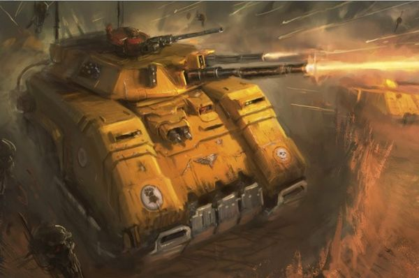
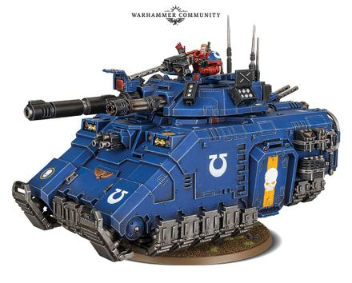

# 1494 处决者型反重力战车 Repulsor Executioner

精校状态：中文行文已逐段精校，部分术语仍为暂定

分类：载具 / 地面 / 重型

原文来源：https://www.bilibili.com/opus/1040705966361804805

原作者：帝国神选罐头

原文时间：2025年03月05日 11:50

[返回分类目录](目录.md) · [全书目录](../../目录.md)

原篇名：反击处刑者 Repulsor Executioner

<!-- A1494-B0001 -->
**英文原文**

The Repulsor Executioner is a new Primaris Space Marine vehicle.

<!-- /A1494-B0001 -->

<!-- A1494-B0002 -->

原译文

反击者处刑者是一种新型的原铸星际战士载具。

**校订译文**

处决者型反重力战车是一种新型原铸星际战士载具。

<!-- /A1494-B0002 -->

<!-- A1494-B0003 图片 -->

<!-- A1494-B0004 -->

原译文

Repulsor Executioner 反击者处刑者

**校订译文**

Repulsor Executioner 处决者型反重力战车

<!-- /A1494-B0004 -->

<!-- A1494-B0005 -->
## Overview 概述

<!-- /A1494-B0005 -->

<!-- A1494-B0006 -->
**英文原文**

The Executioner is a variation of the Repulsor that combines maneuverability, flexibility and some of the heaviest firepower in the Age of the Dark Imperium. Inspired by the Razorback, the Repulsor sacrifices a portion of its transport capacity so as to house additional capacitors, plasma cells, ballistic cogitators, and other esoteric technologies. Though some chapters such as the Iron Hands and Aurora Chapter use Executioners as armored escorts for dedicated troop carriers, many others favor them as transports for Hellblasters and other Primaris specialist squads.

<!-- /A1494-B0006 -->

<!-- A1494-B0007 -->

原译文

处刑者是反击者的变体，结合了机动性、灵活性和黑暗帝国时代最强大的火力。受豪猪战车的启发，反击者牺牲了一部分运输能力，以容纳额外的电容器、等离子容器、弹道沉思者和其他深奥技术。尽管一些战团，如钢铁之手和曙光女神战团，使用处刑者作为专用运兵车的装甲护卫，但许多其他战团更喜欢将其作为地狱轰击者和其他原铸专业小队的运输工具。

**校订译文**

处决者型是反重力战车的变体，兼具机动性、用途灵活性，以及黑暗帝国时代最强大的火力之一。它受豪猪设计启发，牺牲部分载员空间，容纳额外电容器、等离子能量电池、弹道沉思者和其他深奥设备。钢铁之手、曙光女神等战团将它用作专用运兵车的装甲护卫，更多战团则偏爱用它运送地狱轰击者及其他原铸特种小队。

<!-- /A1494-B0007 -->

<!-- A1494-B0008 图片 -->

<!-- A1494-B0009 -->

原译文

Repulsor Executioner 反击者处刑者

**校订译文**

Repulsor Executioner 处决者型反重力战车

<!-- /A1494-B0009 -->

<!-- A1494-B0010 -->
**英文原文**

It can carry to battle either an Macro plasma incinerator or Heavy laser destroyer, which allows it to shred infantry and armour alike with contemptuous ease. Should an enemy survive its attack, the Repulsor Executioner can also transport a squadron of Primaris Space Marines. Like the Repulsor, Executioners can discharge directed forces of gravitic force through their ventral plates. This ability is usually used right before their passengers disembark, leaving foes helpless as Primaris Marines leap from their transports' hatches to deliver kill-shots.

<!-- /A1494-B0010 -->

<!-- A1494-B0011 -->

原译文

它可以携带巨型等离子焚化炮或重型激光毁灭炮作战，这使它能够轻松地粉碎步兵和装甲。如果敌人在攻击中幸存下来，反击者处刑者还可以运送一个远征星际战士中队。像反击者一样，处刑者可以通过底板释放定向重力。这种能力通常在乘员下车前使用，当原铸星际战士从运输工具的舱口跳下进行致命射击时，敌人会束手无策。

**校订译文**

它可搭载巨型等离子焚化炮或重型激光毁灭炮，轻易撕碎步兵与装甲目标。即使敌人在炮击后幸存，车内搭载的一支原铸星际战士小队也能投入战斗。与基本型一样，处决者型可通过底部重力板释放定向重力冲击。通常在乘员下车前发动这一能力，使敌人无法抵抗，原铸战士便从舱口跃出，实施致命射击。

**校注：** Primaris Space Marines 为原铸星际战士，原译远征星际战士错误；squadron 此处按搭载小队语境译。

<!-- /A1494-B0011 -->

本篇核心术语与暂定项

以下列出本篇出现的英文原形及核心术语表用词。同形词可能指不同对象，具体词义以本篇正文和校注为准；单复数、别名和仅见于图注的名称可能尚未列入。完整候选见[术语表](../../术语表/双语术语候选.csv)。

| 英文 | 采用中文 | 状态 |
| --- | --- | --- |
| Space Marines | 星际战士 | 官方已核对 |
| Imperium | 帝国 | 暂定·简称 |
| Iron Hands | 钢铁之手 | 暂定·官方待核 |
| Dark Imperium | 黑暗帝国 | 暂定·官方待核 |
| Plasma Incinerator | 等离子焚化枪 | 暂定·官方待核 |
| Razorback | 豪猪战车 | 官方已核对 |
| Destroyer | 毁灭者 | 暂定·官方待核 |
| Space Marine | 星际战士 | 暂定·官方待核 |
| Chapter | 战团 | 暂定·官方待核 |
| Primaris Space Marine | 原铸星际战士 | 暂定·官方待核 |
| Aurora Chapter | 曙光女神 | 暂定·官方待核 |
| Executioners | 处刑者 | 语境定译·官方待核 |
| Repulsor | 反重力战车 | 官方已核 |
| Repulsor Executioner | 处决者型反重力战车 | 官方已核对 |
| Incinerator | 焚化枪 | 暂定·官方待核 |
| The Dark | 《黑暗》 | 暂定·官方待核 |
| Macro Plasma Incinerator | 巨型等离子焚化炮 | 暂定·官方待核 |
| Laser Destroyer | 激光毁灭炮 | 暂定·官方待核 |
| Heavy Laser Destroyer | 重型激光毁灭炮 | 暂定·官方待核 |

