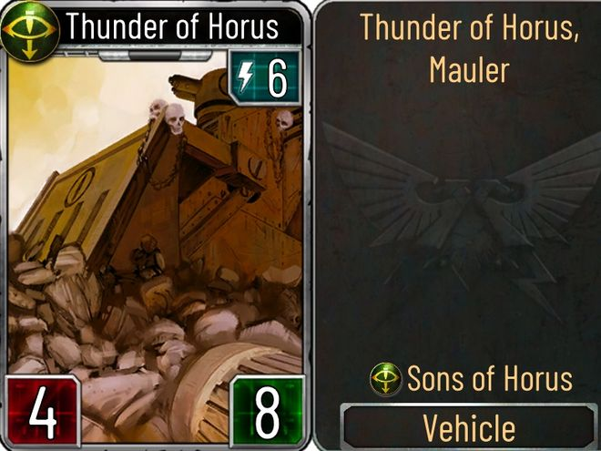

# 1495 粉碎者战斗坦克 Mauler Battle Tank

精校状态：中文行文已逐段精校，部分术语仍为暂定

分类：载具 / 地面 / 重型

原文来源：https://www.bilibili.com/opus/1045949996883509257

原作者：帝国神选罐头

原文时间：2025年03月19日 15:00

[返回分类目录](目录.md) · [全书目录](../../目录.md)

<!-- A1495-B0001 -->
**英文原文**

The Mauler Tank was a Battle Tank used by the Space Marine Legions, during the Great Crusade and Horus Heresy.

<!-- /A1495-B0001 -->

<!-- A1495-B0002 -->

原译文

粉碎者坦克是星际战士在大远征和荷鲁斯叛乱期间使用的战斗坦克。

**校订译文**

粉碎者坦克是星际战士军团在大远征和荷鲁斯之乱期间使用的战斗坦克。

<!-- /A1495-B0002 -->

<!-- A1495-B0003 图片 -->

<!-- A1495-B0004 -->

原译文

Sons of Horus Mauler Thunder of Horus 荷鲁斯之子粉碎者荷鲁斯之雷

**校订译文**

Sons of Horus Mauler Thunder of Horus 荷鲁斯之子粉碎者坦克荷鲁斯之雷号

<!-- /A1495-B0004 -->

<!-- A1495-B0005 -->
## Known Maulers 著名粉碎者

<!-- /A1495-B0005 -->

<!-- A1495-B0006 -->
**英文原文**

Thunder of Horus - Sons of Horus

<!-- /A1495-B0006 -->

<!-- A1495-B0007 -->

原译文

荷鲁斯之雷 - 荷鲁斯之子

**校订译文**

荷鲁斯之雷号——荷鲁斯之子。

<!-- /A1495-B0007 -->

本篇核心术语与暂定项

以下列出本篇出现的英文原形及核心术语表用词。同形词可能指不同对象，具体词义以本篇正文和校注为准；单复数、别名和仅见于图注的名称可能尚未列入。完整候选见[术语表](../../术语表/双语术语候选.csv)。

| 英文 | 采用中文 | 状态 |
| --- | --- | --- |
| Horus Heresy | 荷鲁斯之乱 | 官方已核对 |
| Great Crusade | 大远征 | 暂定·官方待核 |
| Horus | 荷鲁斯 | 暂定·官方待核 |
| Sons of Horus | 荷鲁斯之子 | 暂定·官方待核 |
| Space Marine | 星际战士 | 暂定·官方待核 |
| Thunder of Horus | 荷鲁斯之雷号 | 暂定·官方待核 |

