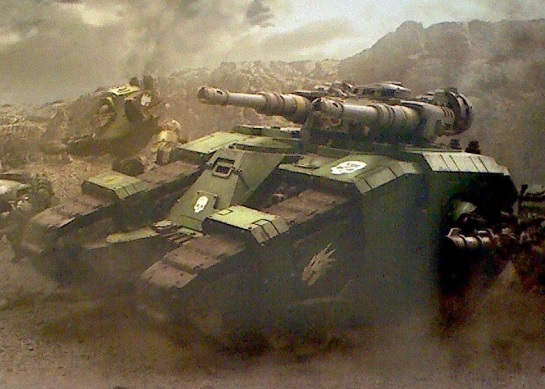
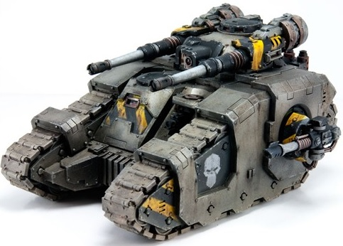
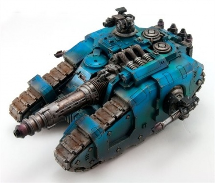
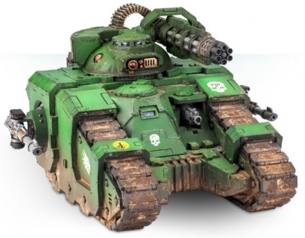
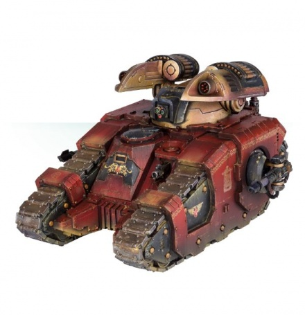
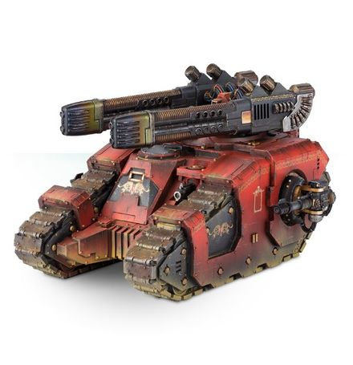

# 1496 西卡然战斗坦克 Sicaran Battle Tank

精校状态：中文行文已逐段精校，部分术语仍为暂定

分类：载具 / 地面 / 重型

原文来源：https://www.bilibili.com/opus/1046310546545049609

原作者：帝国神选罐头

原文时间：编辑于 2025年10月01日 11:56

[返回分类目录](目录.md) · [全书目录](../../目录.md)

<!-- A1496-B0001 -->
**英文原文**

The Sicaran Battle Tank was a type of heavy tank used by the Legiones Astartes during the Horus Heresy and Great Crusade.

<!-- /A1496-B0001 -->

<!-- A1496-B0002 -->

原译文

西卡然战斗坦克是阿斯塔特军团在荷鲁斯叛乱和大远征期间使用的一种重型坦克。

**校订译文**

西卡然战斗坦克是阿斯塔特军团在大远征和荷鲁斯之乱期间使用的一种重型坦克。

<!-- /A1496-B0002 -->

<!-- A1496-B0003 图片 -->

<!-- A1496-B0004 -->

原译文

Sicaran Battle Tank of the Salamanders 火蜥蜴西卡然战斗坦克

**校订译文**

Sicaran Battle Tank of the Salamanders 火蜥蜴西卡然战斗坦克

<!-- /A1496-B0004 -->

<!-- A1496-B0005 -->
## Overview 概述

<!-- /A1496-B0005 -->

<!-- A1496-B0006 -->
**英文原文**

The Sicaran was developed by the Primarchs Ferrus Manus and Roboute Guilliman alongside the Magos of the Adeptus Mechanicus. One of the most advanced armoured units in the arsenal of the Great Crusade, the Sicaran battle tank was exclusively used by the Space Marine Legions. The Sicaran utilized component technologies from various STCs such as the Rhino and Land Raider to create a high-speed tank destroyer to complement the Predator and Land Raider on the battlefield. Its introduction was on-going at the outbreak of the Horus Heresy, and the Warmaster ensured that many examples of this new tank found their way into the armouries of those Legions that would side with him before the outbreak of the civil war.

<!-- /A1496-B0006 -->

<!-- A1496-B0007 -->

原译文

西卡然是由原体费鲁斯·马努斯和罗伯特·基里曼与机械神教的贤者一起开发的。西卡然战斗坦克是大远征军械库中最先进的装甲部队之一，仅供星际战士使用。西卡然利用犀牛和兰德掠袭者等各种STC的组件技术，制造了一种高速坦克歼击车，以在战场上配合掠食者和兰德掠袭者。在荷鲁斯叛乱爆发时，它的引入仍在进行中，战帅确保了这种新坦克的许多例子能够在内战爆发前进入与他并肩作战的军团的军械库。

**校订译文**

西卡然由原体费鲁斯·马努斯、罗保特·基里曼与机械修会贤者共同研发，是大远征时代最先进的装甲载具之一，专供星际战士军团使用。它结合犀牛、兰德掠袭者等多种 STC 的部件技术，构成一种高速坦克歼击车，在战场上与掠食者、兰德掠袭者相互补充。荷鲁斯之乱爆发时，该型仍在持续列装；内战前，战帅已确保许多新车流入那些将追随他的军团。

<!-- /A1496-B0007 -->

<!-- A1496-B0008 -->
**英文原文**

The Sicaran Battle Tank was primarily armed with two Herakles-pattern Accelerator Autocannons, which allowed it to rapidly fire shells at a far higher velocity than a standard autocannon. Secondary armament included sponson-mounted Lascannons. Because of its advanced weaponry, the Sicaran was capable of tracking and engaging swift moving targets and pinpoint weaknesses in enemy armor with lethal precision.

<!-- /A1496-B0008 -->

<!-- A1496-B0009 -->

原译文

西卡然战斗坦克主要装备了两门赫拉克勒斯型加速自动炮，这使其能够以比标准自动炮高得多的速度快速发射炮弹。次要武器包括安装在舷侧的激光炮。由于其先进的武器，西卡然能够跟踪和攻击快速移动的目标，并以致命的精度精确定位敌方装甲的弱点。

**校订译文**

西卡然的主武器是两门赫拉克勒斯型加速自动炮，既能快速连射，弹丸初速也远高于普通自动炮。副武器包括侧舷激光炮。先进武装使它能追踪并攻击高速目标，以致命精度打击敌方装甲弱点。

**校注：** 英文同时涉及射速和弹速；分别译为快速连射与更高初速，避免混为同一速度。

<!-- /A1496-B0009 -->

<!-- A1496-B0010 -->
**英文原文**

In the 41st Millennium Sicaran tanks are prized as rare relics, their systems little understood by even the most venerable Master of the Forge. They are normally held in stasis when not in use to prevent the vehicle from decaying.

<!-- /A1496-B0010 -->

<!-- A1496-B0011 -->

原译文

在第41个千年，西卡然坦克被视为稀有圣物，即使是最受尊敬的铸造大师也很少了解它们的系统。它们在不使用时通常会处于停滞状态，以防止车辆衰弱。

**校订译文**

第41千年，西卡然已成为珍贵的稀有圣物，即便最资深的铸造大师也不甚了解其系统。闲置时，它通常被置于停滞场中，以防机体老化。

<!-- /A1496-B0011 -->

<!-- A1496-B0012 图片 -->

<!-- A1496-B0013 -->

原译文

Sicaran Battle Tank 西卡然战斗坦克

**校订译文**

Sicaran Battle Tank 西卡然战斗坦克

<!-- /A1496-B0013 -->

<!-- A1496-B0014 -->
**英文原文**

Chaos Space Marine warbands still employ Sicarans, though these are often millennia old and have since become Daemonically corrupted. As such, they are most commonly found among the original Traitor Legions.

<!-- /A1496-B0014 -->

<!-- A1496-B0015 -->

原译文

混沌星际战士仍然使用西卡然，尽管这些西卡然通常已有数千年的历史，并且已经被恶魔腐蚀。因此，他们最常见于最初的叛徒军团。

**校订译文**

混沌星际战士战帮也继续使用西卡然。这些机体往往已有数千年历史，并遭恶魔腐化，最常见于最初的叛徒军团。

<!-- /A1496-B0015 -->

<!-- A1496-B0016 -->
### Technical Specifications 技术信息

<!-- /A1496-B0016 -->

<!-- A1496-B0017 -->
**英文原文**

Vehicle Name:Sicaran Battle Tank

<!-- /A1496-B0017 -->

<!-- A1496-B0018 -->

原译文

车辆名称：西卡然战斗坦克

**校订译文**

车辆名称：西卡然战斗坦克

<!-- /A1496-B0018 -->

<!-- A1496-B0019 -->
**英文原文**

Forge World of Origin:Unknown

<!-- /A1496-B0019 -->

<!-- A1496-B0020 -->

原译文

起源铸造世界：未知

**校订译文**

起源铸造世界：未知

<!-- /A1496-B0020 -->

<!-- A1496-B0021 -->
**英文原文**

Known Patterns:Unknown

<!-- /A1496-B0021 -->

<!-- A1496-B0022 -->

原译文

已知型号：未知

**校订译文**

已知型号：未知

<!-- /A1496-B0022 -->

<!-- A1496-B0023 -->
**英文原文**

Crew:Driver, Gunner

<!-- /A1496-B0023 -->

<!-- A1496-B0024 -->

原译文

乘员：驾驶员、炮手

**校订译文**

乘员：驾驶员、炮手

<!-- /A1496-B0024 -->

<!-- A1496-B0025 -->
**英文原文**

Powerplant:Open core plasma ioniser

<!-- /A1496-B0025 -->

<!-- A1496-B0026 -->

原译文

动力装置：开放式等离子电离器

**校订译文**

动力装置：开放核心式等离子电离器

<!-- /A1496-B0026 -->

<!-- A1496-B0027 -->
**英文原文**

Weight:65 tonnes

<!-- /A1496-B0027 -->

<!-- A1496-B0028 -->

原译文

重量：65吨

**校订译文**

重量：65吨

<!-- /A1496-B0028 -->

<!-- A1496-B0029 -->
**英文原文**

Length:8.2m

<!-- /A1496-B0029 -->

<!-- A1496-B0030 -->

原译文

长度：8.2米

**校订译文**

长度：8.2米

<!-- /A1496-B0030 -->

<!-- A1496-B0031 -->
**英文原文**

Width:7m

<!-- /A1496-B0031 -->

<!-- A1496-B0032 -->

原译文

宽度：7米

**校订译文**

宽度：7米

<!-- /A1496-B0032 -->

<!-- A1496-B0033 -->
**英文原文**

Height:4.85m

<!-- /A1496-B0033 -->

<!-- A1496-B0034 -->

原译文

高度：4.85米

**校订译文**

高度：4.85米

<!-- /A1496-B0034 -->

<!-- A1496-B0035 -->
**英文原文**

Ground Clearance:0.32m

<!-- /A1496-B0035 -->

<!-- A1496-B0036 -->

原译文

离地间隙：0.32米

**校订译文**

离地间隙：0.32米

<!-- /A1496-B0036 -->

<!-- A1496-B0037 -->
**英文原文**

Fording Depth:{{{Fording Depth}}}

<!-- /A1496-B0037 -->

<!-- A1496-B0038 -->

原译文

涉水深度：｛｛｛涉水深度｝｝

**校订译文**

涉水深度：未提供

**校注：** 英文未展开涉水深度模板，实际数值缺失。

<!-- /A1496-B0038 -->

<!-- A1496-B0039 -->
**英文原文**

Max Speed - on road74kph

<!-- /A1496-B0039 -->

<!-- A1496-B0040 -->

原译文

最大速度-公路上74公里/小时

**校订译文**

最大公路速度：74公里/小时

<!-- /A1496-B0040 -->

<!-- A1496-B0041 -->
**英文原文**

Max Speed - off road:58kph

<!-- /A1496-B0041 -->

<!-- A1496-B0042 -->

原译文

最大速度-越野：58公里/小时

**校订译文**

最大越野速度：58公里/小时

<!-- /A1496-B0042 -->

<!-- A1496-B0043 -->
**英文原文**

Transport Capacity:None

<!-- /A1496-B0043 -->

<!-- A1496-B0044 -->

原译文

运输能力：无

**校订译文**

运输能力：无

<!-- /A1496-B0044 -->

<!-- A1496-B0045 -->
**英文原文**

Access Points:N/A

<!-- /A1496-B0045 -->

<!-- A1496-B0046 -->

原译文

接入点：无

**校订译文**

出入口：未提供（N/A）

<!-- /A1496-B0046 -->

<!-- A1496-B0047 -->
**英文原文**

Main Armament:Twin Accelerator Autocannons or Omega Plasma Array

<!-- /A1496-B0047 -->

<!-- A1496-B0048 -->

原译文

主武器：双联加速自动炮或欧米伽等离子阵列

**校订译文**

主武器：成对加速自动炮或欧米伽等离子阵列

<!-- /A1496-B0048 -->

<!-- A1496-B0049 -->
**英文原文**

Secondary Armament:Sponson Lascannons or Heavy Bolters

<!-- /A1496-B0049 -->

<!-- A1496-B0050 -->

原译文

次要武器：侧舷激光炮或重型爆矢枪

**校订译文**

次要武器：侧舷激光炮或重型爆矢枪

<!-- /A1496-B0050 -->

<!-- A1496-B0051 -->
**英文原文**

Traverse:360°

<!-- /A1496-B0051 -->

<!-- A1496-B0052 -->

原译文

横向：360°

**校订译文**

水平射界：360°

<!-- /A1496-B0052 -->

<!-- A1496-B0053 -->
**英文原文**

Elevation:From -32° to +42°

<!-- /A1496-B0053 -->

<!-- A1496-B0054 -->

原译文

仰角：从-32°到+42°

**校订译文**

俯仰角：−32°至+42°

<!-- /A1496-B0054 -->

<!-- A1496-B0055 -->
**英文原文**

Main Ammunition:140 Rounds

<!-- /A1496-B0055 -->

<!-- A1496-B0056 -->

原译文

主要弹药：140发

**校订译文**

主武器载弹量：140发

<!-- /A1496-B0056 -->

<!-- A1496-B0057 -->
**英文原文**

Secondary Ammunition:1,400 rounds (Heavy Bolter), Unlimited cell (Lascannons)

<!-- /A1496-B0057 -->

<!-- A1496-B0058 -->

原译文

次要弹药：1400发（重型爆矢枪），无限弹药（激光炮）

**校订译文**

副武器弹药：重型爆矢枪1400发；激光炮由能源电池供能，原表记为无限

<!-- /A1496-B0058 -->

<!-- A1496-B0059 -->
### Armour 装甲

<!-- /A1496-B0059 -->

<!-- A1496-B0060 -->
**英文原文**

Superstructure:80mm

<!-- /A1496-B0060 -->

<!-- A1496-B0061 -->

原译文

上部结构：80毫米

**校订译文**

上部结构：80毫米

<!-- /A1496-B0061 -->

<!-- A1496-B0062 -->
**英文原文**

Hull:70mm

<!-- /A1496-B0062 -->

<!-- A1496-B0063 -->

原译文

车体：70毫米

**校订译文**

车体：70毫米

<!-- /A1496-B0063 -->

<!-- A1496-B0064 -->
**英文原文**

Gun Mantlet:80mm

<!-- /A1496-B0064 -->

<!-- A1496-B0065 -->

原译文

炮盾：80毫米

**校订译文**

炮盾：80毫米

<!-- /A1496-B0065 -->

<!-- A1496-B0066 -->
**英文原文**

Vehicle Designation:Unknown

<!-- /A1496-B0066 -->

<!-- A1496-B0067 -->

原译文

车辆编号：未知

**校订译文**

车辆编号：未知

<!-- /A1496-B0067 -->

<!-- A1496-B0068 -->
**英文原文**

Firing Ports:N/A

<!-- /A1496-B0068 -->

<!-- A1496-B0069 -->

原译文

开火口：无

**校订译文**

射击孔：未提供（N/A）

<!-- /A1496-B0069 -->

<!-- A1496-B0070 -->
**英文原文**

Turret:80mm

<!-- /A1496-B0070 -->

<!-- A1496-B0071 -->

原译文

炮塔：80毫米

**校订译文**

炮塔：80毫米

<!-- /A1496-B0071 -->

<!-- A1496-B0072 -->
## Variants 变体

<!-- /A1496-B0072 -->

<!-- A1496-B0073 -->
### Sicaran Venator 西卡然猎手

<!-- /A1496-B0073 -->

<!-- A1496-B0074 -->
**英文原文**

The Sicaran Venator is a variant of the Sicaran Battle Tank introduced towards the end of the Great Crusade, and saw extensive use in the opening battles of the Horus Heresy. Purpose-built as a tank destroying vehicle, this pattern replaced the turret-mounted accelerator cannon of the Sicaran with a fearsome center-line mounted Neutron Laser Projector. When coupled with the Sicaran Venator's ferocious speed, the neutron laser is an ideal anti-tank weapon, slicing apart armoured hulls with casual ease and blasting internal compartments and crew with atomic fire.

<!-- /A1496-B0074 -->

<!-- A1496-B0075 -->

原译文

西卡然猎手是大远征末期引入的西卡然战斗坦克的变体，在荷鲁斯叛乱的首场战斗中得到了广泛的使用。这种型号是专门为摧毁坦克而制造的，它用一个可怕的中线安装的中子激光投射器取代了西卡然的炮塔安装的加速炮。当与西卡然猎手的凶猛速度相结合时，中子激光炮是一种理想的反坦克武器，可以轻松地切割装甲船体，并用原子轰击内部舱室和乘员。

**校订译文**

西卡然猎手是大远征末期列装的变体，在荷鲁斯之乱初期的战斗中广泛使用。它专为歼灭坦克设计，以车体中轴线上的中子激光投射炮取代炮塔加速炮。结合西卡然猎手的惊人速度，中子激光成为理想反坦克武器，能轻易切开装甲车体，以原子烈焰轰击内部舱室和乘员。

<!-- /A1496-B0075 -->

<!-- A1496-B0076 图片 -->

<!-- A1496-B0077 -->

原译文

Sicaran Venator 西卡然猎手

**校订译文**

Sicaran Venator 西卡然猎手

<!-- /A1496-B0077 -->

<!-- A1496-B0078 -->
**英文原文**

Conceived in the fires of war, the Sicaran Venator is the result of all the knowledge gleaned from the unnumbered battles of the Great Crusade. Its advanced neutron laser is specially designed to provide the Legiones Astartes with superior firepower, enabling it to destroy any and all xenos threats that might be encountered by the expanding armies of the nascent Imperium.

<!-- /A1496-B0078 -->

<!-- A1496-B0079 -->

原译文

西卡然猎手是在战火中构想出来的，是从大远征无数战役中收集到的所有知识的结果。其先进的中子激光炮是专门为阿斯塔特军团提供卓越火力，使其能够摧毁新生帝国不断扩张的军队可能遇到的任何和所有异型威胁。

**校订译文**

西卡然猎手在战火中诞生，凝聚了大远征无数战斗中积累的知识。先进中子激光专为赋予阿斯塔特军团优势火力而设计，使新生帝国不断扩张的大军能够消灭所遭遇的各类异形威胁。

<!-- /A1496-B0079 -->

<!-- A1496-B0080 -->
**英文原文**

Despite the relative rarity of these vehicles, the Venator’s combination of durability, speed and firepower ensured that they proved pivotal in a number of battles, and made it highly valued by the Space Marine Legions, surviving where lesser Predator or Vindicator tanks did not.

<!-- /A1496-B0080 -->

<!-- A1496-B0081 -->

原译文

尽管这些车辆相对罕见，但猎手的韧性、速度和火力相结合，确保了它们在许多战斗中发挥了关键作用，并使其受到星际战士的高度重视，在没有较小的掠食者或维护者坦克的地方生存。

**校订译文**

西卡然猎手虽然罕见，却凭借坚固性、速度和火力的结合，在多场战斗中发挥关键作用，深受星际战士军团重视。它能在较弱的掠食者或维护者战车无法生还的环境中继续作战。

**校注：** where lesser tanks did not 指其他坦克无法存活的情况下，不是没有较小坦克的地点。

<!-- /A1496-B0081 -->

<!-- A1496-B0082 -->
### Sicaran Punisher 西卡然惩罚者

<!-- /A1496-B0082 -->

<!-- A1496-B0083 -->
**英文原文**

The Sicaran Punisher is a variant of the Sicaran Battle Tank that came into general use amongst the various Space Marine Legions in the final days of the Great Crusade, however the Punisher Rotary Cannon it mounts has a far older history. Originally mounted on the now rare Cerberus pattern main battle tanks, the punisher had established a reputation as a deadly tool in the eradication of massed conscript infantry or hordes of swarming xenos creatures, limited only by its relatively short range and prodigious appetite for munitions. Married to the Sicaran hull, where the impressive speed of that vehicle effectively negated the short range of the weapon, and the complex feed assemblies developed as part of the various Terran accelerator cannon, the punisher is once again in widespread use among the Legions, though now it is employed against the very warriors it was intended to protect.

<!-- /A1496-B0083 -->

<!-- A1496-B0084 -->

原译文

西卡然惩罚者是西卡然战斗坦克的一种变体，在大远征的最后几天，它在各种星际战士军团中得到了广泛使用，但它所搭载的惩罚者旋转炮的历史要悠久得多。最初安装在现在罕见的三头犬型主战坦克上，惩罚者在消灭大量征召步兵或成群的异型生物方面树立了致命工具的声誉，其局限性仅在于相对较短的射程和对弹药的巨大需求。与西卡然车体相结合，该车辆令人印象深刻的速度有效地抵消了武器的短程，以及作为各种泰拉加速炮的一部分开发的复杂供弹组件，惩罚者再次在军团中广泛使用，尽管现在它被用来对付它想要保护的战士。

**校订译文**

西卡然惩罚者在大远征末期于各星际战士军团中普及，但所用惩罚者旋转炮的历史更久。这种武器最初装备如今罕见的三头犬型主战坦克，凭借屠灭密集征召步兵与成群异形的能力闻名，主要缺点是射程较短、耗弹惊人。装到西卡然底盘后，车辆的高速机动有效弥补了射程短板，再加上为泰拉各型加速炮开发的复杂供弹组件，惩罚者旋转炮重新在军团中广泛使用；只是如今，炮口指向了它原本要保护的战士。

<!-- /A1496-B0084 -->

<!-- A1496-B0085 图片 -->

<!-- A1496-B0086 -->

原译文

Sicaran Punisher 西卡然惩罚者

**校订译文**

Sicaran Punisher 西卡然惩罚者

<!-- /A1496-B0086 -->

<!-- A1496-B0087 -->
### Sicaran Arcus 西卡然长弓

<!-- /A1496-B0087 -->

<!-- A1496-B0088 -->
**英文原文**

The Sicaran Arcus Strike Tank is an artillery variant of the Sicaran. As part of a program initiated by the Primarch Roboute Guilliman, seeking to grant a Legion strike force access to highly specialised weapon systems without the need to employ numerous vehicles for each role, the Sicaran hull was chosen to mount the newly developed twin Arcus Launcher. Capable of deploying a wide range of warheads, each crafted to fulfil a distinct tactical niche, the Arcus was intended to become the cornerstone of a new tactical doctrine the Master of Ultramar had begun to formulate, allowing small Legiones Astartes forces to operate without extensive support and in smaller numbers than during the Great Crusade.

<!-- /A1496-B0088 -->

<!-- A1496-B0089 -->

原译文

西卡然长弓攻击坦克是西卡然的火炮变体。作为原体罗伯特·基里曼发起的一项计划的一部分，该计划旨在允许军团打击部队使用高度专业化的武器系统，而无需为每种角色使用大量车辆，因此选择了西卡然车体来安装新开发的双联长弓发射器。长弓能够部署各种各样的弹头，每枚弹头都是为了满足不同的战术需求而精心设计的，它旨在成为奥特拉玛大师开始制定的新战术理论的基石，使小型阿斯塔特军团部队能够在没有广泛支援的情况下以比大远征期间更少的数量作战。

**校订译文**

西卡然长弓突击坦克是火炮支援变体。原体罗保特·基里曼发起一项计划，希望军团打击部队无需为每种任务配备大量专用车辆，也能使用高度专业化的武器系统。西卡然底盘因此被选中，安装新研制的成对长弓发射器。它可发射多种弹头，各自对应特定战术用途。奥特拉玛之主正构建一套新战术准则，让较小规模的阿斯塔特部队无需庞大支援体系便能独立行动，所需兵力也少于大远征时期；长弓原本应成为这套准则的支柱。

<!-- /A1496-B0089 -->

<!-- A1496-B0090 图片 -->

<!-- A1496-B0091 -->

原译文

Sicaran Arcus 西卡然长弓

**校订译文**

Sicaran Arcus 西卡然长弓

<!-- /A1496-B0091 -->

<!-- A1496-B0092 -->
**英文原文**

Despite being limited to a few prototype vehicles at the onset of the Horus Heresy, and the doctrinal issues that kept it out of production on most major Forge Worlds, a number of Legion Home Worlds produced small numbers of this variant. Of particular note is the inclusion of the Neutron-Flux Warhead, a Terran development dating back to the years prior to the alliance with Mars. Continued production of these weapons was the cause of the Mechanicum's refusal to sanction the Arcus pattern hull.

<!-- /A1496-B0092 -->

<!-- A1496-B0093 -->

原译文

尽管在荷鲁斯叛乱开始时仅限于几辆原型车，而且由于教义问题，它无法在大多数主要的铸造世界生产，但许多军团家园世界生产了少量这种变体。特别值得注意的是，其中包括了中子通量弹头，这是一种可以追溯到与火星结盟前几年的人类发展。这些武器的持续生产是机械神教拒绝批准长弓型车体的原因。

**校订译文**

荷鲁斯之乱爆发时，长弓只有少数原型车；教义争议也让多数主要铸造世界拒绝生产。尽管如此，一些军团母星仍制造了少量机体。尤其值得注意的是中子通量弹头，这项泰拉技术早在与火星结盟前就已出现。由于它仍在持续生产，机械教拒绝批准长弓型。

**校注：** Terran 指泰拉研发，不是泛指人类发展；前于火星结盟的年份不擅自限定为仅数年前。

<!-- /A1496-B0093 -->

<!-- A1496-B0094 -->
**英文原文**

Without the specialized knowledge of the Mechanicum, the advanced Arcus Launchers have slowly broken down and have since been replaced with more common rotary Missile Launchers. In addition, its stocks of its rare warheads have dwindled. However the Arcus is still used by some Space Marine Chapters as a fast strike tank, racing it forwards to saturate a target area with incendiary devices and using its renowned speed to escape unscathed. This enables the Chapter to clear otherwise redoubtable bunkers and fortresses with brutal efficiency.

<!-- /A1496-B0094 -->

<!-- A1496-B0095 -->

原译文

如果没有机械教的专业知识，先进的长弓发射器就会慢慢失效，并被更常见的旋转导弹发射器所取代。此外，其稀有弹头的库存已经减少。然而，长弓仍然被一些星际战士战团用作快速打击坦克，它向前疾驰，用燃烧装置饱和轰炸目标区域，并利用其著名的速度毫发无损地逃脱。这使得战团能够以残酷的效率清除原本可以防御的掩体和堡垒。

**校订译文**

缺少机械教的专门技术维护，先进的长弓发射器逐渐损坏，后来被更常见的旋转式导弹发射器取代，稀有弹头库存也日益减少。不过，一些星际战士战团仍将长弓用作快速突击坦克：高速逼近目标区，以燃烧弹药实施饱和打击，再凭速度安全撤离。这让战团能够以残酷的效率肃清原本难以攻克的掩体和堡垒。

<!-- /A1496-B0095 -->

<!-- A1496-B0096 -->
**英文原文**

Some Sicaran Arcuses were further outfitted with Helical Targeting Arrays.

<!-- /A1496-B0096 -->

<!-- A1496-B0097 -->

原译文

一些西卡然长弓进一步配备了螺旋目标阵列。

**校订译文**

部分西卡然长弓还装有螺旋瞄准阵列。

<!-- /A1496-B0097 -->

<!-- A1496-B0098 -->
### Sicaran Omega 西卡然欧米伽

<!-- /A1496-B0098 -->

<!-- A1496-B0099 -->
**英文原文**

Retrofitted to allow the Sicaran hull to carry heavier firepower, the Omega is a formidable tank hunter. It utilizes the speed provided by the Sicaran’s engines to apply overwhelming short range firepower in battle, racing forwards to ambush and obliterate the lumbering siege tanks of enemy columns. Its simplified but perhaps crude systems are all capable of being produced by the lesser forges attached to many Space Marine strongholds, allowing them to replace losses of more complex vehicles even as the various Forge Worlds became isolated by war and mistrust at the height of the Horus Heresy.

<!-- /A1496-B0099 -->

<!-- A1496-B0100 -->

原译文

欧米伽经过改装，使西卡然车体能够携带更重的火力，是一个强大的坦克猎手。它利用西卡然发动机提供的速度在战斗中施加压倒性的短程火力，向前冲去伏击和消灭敌人纵队笨重的攻城坦克。其简化但可能粗糙的系统都能够由许多星际战士据点的小型铸造厂生产，即使在荷鲁斯叛乱巅峰时期，各种铸造世界因战争和不信任而孤立，他们也能弥补更复杂车辆的损失。

**校订译文**

欧米伽经改装后能承载更强火力，是强大的坦克猎手。它利用西卡然引擎带来的速度，迅速逼近，伏击并以压倒性近程火力摧毁敌方纵队中笨重的攻城坦克。其系统虽简化得较为粗糙，却能由许多星际战士据点附属的小型锻炉生产。因此，即使荷鲁斯之乱最激烈时，各铸造世界因战争和猜忌而彼此隔绝，军团也能用它弥补复杂车型的损失。

<!-- /A1496-B0100 -->

<!-- A1496-B0101 图片 -->

<!-- A1496-B0102 -->

原译文

Sicaran Omega 西卡然欧米伽

**校订译文**

Sicaran Omega 西卡然欧米伽

<!-- /A1496-B0102 -->

<!-- A1496-B0103 -->
**英文原文**

The main weaponry of the Omega reflects this stopgap approach, with its primary weapon taking the form of the devastating Omega Plasma Array, which consists of two enormous Plasma Cannons. With these cannons being imperfect, over-sized copies of the Mechanicum's Plasma Fusil weaponry and relying on the brutal application of overwhelming force to reduce enemy armour to wrecks instead of the precise annihilation of more advanced weapons systems. Despite these drawbacks, the Omega proved effective in battle and its designs quickly spread from Legion to Legion as examples were captured in battle.

<!-- /A1496-B0103 -->

<!-- A1496-B0104 -->

原译文

欧米伽的主要武器反映了这种权宜之计，其主要武器采用了毁灭性的欧米伽等离子阵列的形式，该阵列由两个巨大的等离子炮组成。这些炮不完美，是机械神教等离子步枪武器的超大复制品，以及依靠残酷的压倒性力量将敌人的装甲毁灭成残骸，而不是精确地消灭的更先进的武器系统。尽管有这些缺点，欧米伽在战斗中被证明是有效的，随着战斗中的样品被捕获，它的设计很快从一个军团传播到另一个军团。

**校订译文**

欧米伽的主武器体现了这种应急思路：威力强大的欧米伽等离子阵列由两门巨型等离子炮组成。它们是机械教等离子步枪不甚完善的放大仿制品，靠粗暴施加压倒性火力将敌方装甲轰成废铁，做不到先进武器系统那般精确摧毁目标。尽管有这些缺点，欧米伽的实战表现仍很有效；随着交战各方相互缴获实物，其设计迅速在军团间流传。

<!-- /A1496-B0104 -->

<!-- A1496-B0105 -->
## Known Named Sicaran Tanks 著名西卡然坦克

<!-- /A1496-B0105 -->

<!-- A1496-B0106 -->
**英文原文**

Heritor of Gage - Ultramarines.

<!-- /A1496-B0106 -->

<!-- A1496-B0107 -->

原译文

盖奇后裔 - 极限战士

**校订译文**

盖奇后裔号——极限战士。

<!-- /A1496-B0107 -->

<!-- A1496-B0108 -->
**英文原文**

Hero of Kryrenia - Black Templars.

<!-- /A1496-B0108 -->

<!-- A1496-B0109 -->

原译文

克里尼亚英雄 - 黑色圣堂

**校订译文**

克里尼亚英雄号——黑色圣堂。

<!-- /A1496-B0109 -->

<!-- A1496-B0110 -->
**英文原文**

Morkai's Roar - Sicaran Arcus. Originally belonging to the Space Wolves, it was gifted to the Obsidian Jaguars.

<!-- /A1496-B0110 -->

<!-- A1496-B0111 -->

原译文

莫凯咆哮 - 西卡然长弓。它最初属于太空野狼，后来被送给黑曜美洲豹。

**校订译文**

莫凯咆哮号——西卡然长弓，原属太空野狼，后赠予黑曜美洲豹。

<!-- /A1496-B0111 -->

本篇核心术语与暂定项

以下列出本篇出现的英文原形及核心术语表用词。同形词可能指不同对象，具体词义以本篇正文和校注为准；单复数、别名和仅见于图注的名称可能尚未列入。完整候选见[术语表](../../术语表/双语术语候选.csv)。

| 英文 | 采用中文 | 状态 |
| --- | --- | --- |
| Black Templars | 黑色圣堂 | 官方已核对 |
| Space Wolves | 太空野狼 | 官方已核对 |
| Adeptus Mechanicus | 机械修会 | 官方已核对 |
| Roboute Guilliman | 罗保特·基里曼 | 官方已核对 |
| Ultramar | 奥特拉玛 | 官方已核对 |
| Ultramarines | 极限战士 | 官方已核对 |
| Horus Heresy | 荷鲁斯之乱 | 官方已核对 |
| Imperium | 帝国 | 暂定·简称 |
| Mechanicum | 机械教 | 暂定·历史称谓 |
| History | 历史 | 编辑用语已统一 |
| Primarch | 原体 | 官方已核对 |
| Forge World | 铸造世界 | 暂定·官方待核 |
| Great Crusade | 大远征 | 暂定·官方待核 |
| Ferrus Manus | 费鲁斯·马努斯 | 暂定·官方待核 |
| Horus | 荷鲁斯 | 暂定·官方待核 |
| Legiones Astartes | 阿斯塔特军团 | 暂定·官方待核 |
| Mars | 火星 | 暂定·官方待核 |
| Land Raider | 兰德掠袭者战车 | 官方已核对 |
| Clear | 清明 | 暂定·官方待核 |
| Master | 导师（审判庭职衔）／舰务官（舰员职务） | 语境定译·官方待核 |
| Master of the Forge | 铸造大师 | 暂定·官方待核 |
| Rhino | 犀牛战车 | 官方已核对 |
| Vindicator | 维护者战车 | 官方已核对 |
| The Primarchs | 原体 | 暂定·官方待核 |
| Destroyer | 毁灭者 | 暂定·官方待核 |
| Space Marine | 星际战士 | 暂定·官方待核 |
| Chapter | 战团 | 暂定·官方待核 |
| Obsidian Jaguars | 黑曜石美洲虎 | 暂定·官方待核 |
| Missile Launchers | 导弹发射器 | 暂定·官方待核 |
| Xenos | 异形 | 暂定·官方待核 |
| Fusil | 相位火枪 | 暂定·官方待核 |
| Raider | 掠袭者飞艇 | 官方已核对 |
| Master of Ultramar | 奥特拉玛之主 | 暂定·官方待核 |
| The Weapon | 武器 | 暂定·官方待核 |
| Gun | 甘 | 暂定·官方待核 |
| Accelerator Cannon | 加速加农炮 | 暂定·官方待核 |
| Arcus Launcher | 长弓发射器 | 暂定·官方待核 |
| Autocannon | 自动炮 | 暂定·官方待核 |
| Punisher Rotary Cannon | 惩罚者旋转炮 | 暂定·官方待核 |
| Bolter | 爆矢枪 | 暂定·官方待核 |
| Heavy bolter | 重型爆矢枪 | 官方已核对 |
| Neutron Laser Projector | 中子激光投射炮 | 暂定·官方待核 |
| Omega Plasma Array | 欧米伽等离子阵列 | 暂定·官方待核 |
| Redoubtable | 可敬号 | 暂定·官方待核 |
| Sicaran Battle Tank | 西卡然战斗坦克 | 暂定·官方待核 |
| Sicaran Venator | 西卡然猎手 | 暂定·官方待核 |
| Sicaran Punisher | 西卡然惩罚者 | 暂定·官方待核 |
| Sicaran Arcus | 西卡然长弓 | 暂定·官方待核 |
| Neutron-Flux Warhead | 中子通量弹头 | 暂定·官方待核 |
| Heritor of Gage | 盖奇后裔号 | 暂定·官方待核 |
| Hero of Kryrenia | 克里尼亚英雄号 | 暂定·官方待核 |
| Morkai's Roar | 莫凯咆哮号 | 暂定·官方待核 |

