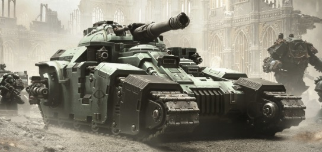
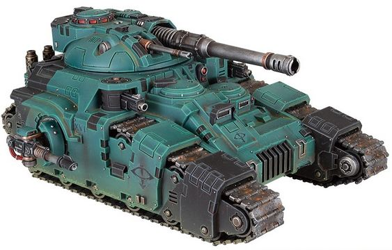
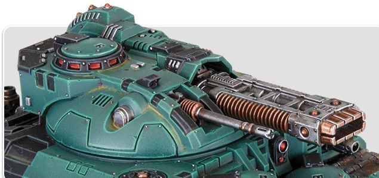
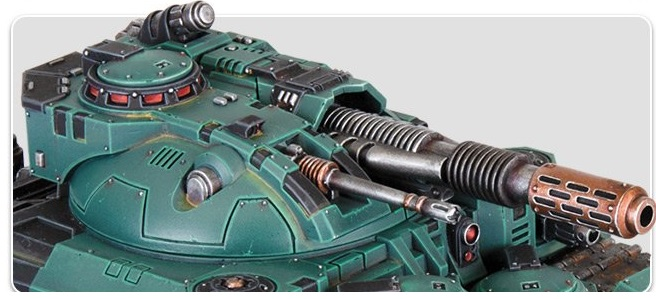

# 1497 奎托斯战斗坦克 Kratos Battle Tank

精校状态：中文行文已逐段精校，部分术语仍为暂定

分类：载具 / 地面 / 重型

原文来源：https://www.bilibili.com/opus/1045553854870978566

原作者：帝国神选罐头

原文时间：2025年03月18日 13:22

[返回分类目录](目录.md) · [全书目录](../../目录.md)

<!-- A1497-B0001 -->
**英文原文**

The Kratos was a Battle Tank used by the Space Marine Legions, during the Great Crusade.

<!-- /A1497-B0001 -->

<!-- A1497-B0002 -->

原译文

奎托斯是大远征期间星际战士使用的战斗坦克。

**校订译文**

奎托斯是星际战士军团在大远征期间使用的战斗坦克。

<!-- /A1497-B0002 -->

<!-- A1497-B0003 图片 -->

<!-- A1497-B0004 -->

原译文

Sons of Horus Kratos 荷鲁斯之子奎托斯

**校订译文**

Sons of Horus Kratos 荷鲁斯之子奎托斯

<!-- /A1497-B0004 -->

<!-- A1497-B0005 -->
## Description 描述

<!-- /A1497-B0005 -->

<!-- A1497-B0006 -->
**英文原文**

The Kratos was based on an ancient Terran pattern originally used in large numbers during the Unification Wars. After the Treaty of Olympus, the Kratos was redesigned to serve in the wider Great Crusade.

<!-- /A1497-B0006 -->

<!-- A1497-B0007 -->

原译文

奎托斯基于一种古老的泰拉型号，最初在统一战争期间大量使用。奥林匹斯条约签订后，奎托斯被重新设计，以服务于更广泛的大远征。

**校订译文**

奎托斯基于一种古老的泰拉型号，最初在统一战争期间大量使用。奥林匹斯条约签订后，奎托斯被重新设计，以服务于更广泛的大远征。

<!-- /A1497-B0007 -->

<!-- A1497-B0008 图片 -->

<!-- A1497-B0009 -->

原译文

Kratos with Battlecannon 配备战斗炮的奎托斯

**校订译文**

Kratos with Battlecannon 配备战斗炮的奎托斯

<!-- /A1497-B0009 -->

<!-- A1497-B0010 -->
**英文原文**

It served as a dedicated infantry support tank and its heavy cannon could quickly open a path through massed enemies for any infantry following in its wake. However, the Kratos became obsolete and was later retired when the Legions began to favour faster, more multi-purpose vehicles such as the ubiquitous Predator. Some were kept in the Legions' reserve armouries, though. Notably the Blood Angels Legion's Kratos tanks saw heavy usage in the Battle of Signus Prime.

<!-- /A1497-B0010 -->

<!-- A1497-B0011 -->

原译文

它作为一辆专用的步兵支援坦克，其重型火炮可以迅速为任何跟随它的步兵开辟一条穿过密集敌人的道路。然而，当军团开始青睐更快、更多用途的车辆，如无处不在的掠食者时，奎托斯变得过时，后来退役。不过，有些被保存在军团的后备军械库里。值得注意的是，圣血天使军团的奎托斯坦克在西格努斯主星之战中得到了大量使用。

**校订译文**

奎托斯专门支援步兵，其重炮能在密集敌群中迅速轰开通路，让后续步兵推进。后来，军团更偏爱速度快、用途广的载具，例如广泛服役的掠食者，奎托斯便逐渐过时、退出现役。但军团预备军械库仍保留了一些机体；圣血天使的奎托斯尤其在西格纳斯主星之战中大量投入使用。

<!-- /A1497-B0011 -->

<!-- A1497-B0012 图片 -->

<!-- A1497-B0013 -->

原译文

Kratos with Volkite Cardanelle 配备爆燃臼炮的奎托斯

**校订译文**

Kratos with Volkite Cardanelle 配备爆燃臼炮的奎托斯

<!-- /A1497-B0013 -->

<!-- A1497-B0014 -->
**英文原文**

In terms of hitting power, the Kratos sits between the Sicaran and Fellblade. The Kratos can be armed with the Kratos battlecannon which can be loaded with high-explosive shells to kill large numbers of enemy troops, armour-piercing shells to take out heavily-armoured threats or flashburn shells against massive enemy tanks. The Kratos can also be equipped with a Volkite Cardanelle, or a Melta Blast-Gun. Additional weaponry includes a coaxial Autocannon, hull-mounted Heavy Bolters, and Lascannon, Heavy Bolter or Volkite Culverin sponsons.

<!-- /A1497-B0014 -->

<!-- A1497-B0015 -->

原译文

在打击力方面，奎托斯位于西卡然和残暴刃之间。奎托斯可以装备奎托斯战斗加农炮，该加农炮可以装载高爆弹以杀死大量敌军，穿甲弹以消除重型装甲威胁，或对敌方大型坦克发射闪燃弹。奎托斯还可以配备爆燃臼炮或热熔爆破炮。其他武器包括同轴自动炮、车体安装的重型爆矢枪和激光炮、侧舷重型爆矢枪或爆燃长炮。

**校订译文**

奎托斯的火力介于西卡然与残暴刃之间。其战斗加农炮可发射高爆弹杀伤密集敌军、穿甲弹打击重装目标，或以闪燃弹对付大型敌方坦克。主武器也可换成爆燃臼炮或热熔爆破炮。其他武器包括同轴自动炮、车体重型爆矢枪，以及侧舷激光炮、重型爆矢枪或爆燃长炮。

**校注：** 原文激光炮属于侧舷武器选项，原译错误并入车体武器。

<!-- /A1497-B0015 -->

<!-- A1497-B0016 图片 -->

<!-- A1497-B0017 -->

原译文

Kratos with Melta Blast-Gun 配备热熔爆破炮的奎托斯

**校订译文**

Kratos with Melta Blast-Gun 配备热熔爆破炮的奎托斯

<!-- /A1497-B0017 -->

<!-- A1497-B0018 -->
**英文原文**

They could further be outfitted with Flare Shields for protection.

<!-- /A1497-B0018 -->

<!-- A1497-B0019 -->

原译文

他们还可以配备闪光护盾进行保护。

**校订译文**

奎托斯还可加装闪光护盾以增强防护。

<!-- /A1497-B0019 -->

本篇核心术语与暂定项

以下列出本篇出现的英文原形及核心术语表用词。同形词可能指不同对象，具体词义以本篇正文和校注为准；单复数、别名和仅见于图注的名称可能尚未列入。完整候选见[术语表](../../术语表/双语术语候选.csv)。

| 英文 | 采用中文 | 状态 |
| --- | --- | --- |
| Blood Angels | 圣血天使 | 官方已核对 |
| Great Crusade | 大远征 | 暂定·官方待核 |
| Unification Wars | 统一战争 | 暂定·官方待核 |
| Treaty of Olympus | 奥林匹斯条约 | 暂定·官方待核 |
| Ancient | 旗手 | 官方已核对 |
| Space Marine | 星际战士 | 暂定·官方待核 |
| Gun | 甘 | 暂定·官方待核 |
| The Blood | 鲜血 | 暂定·官方待核 |
| Autocannon | 自动炮 | 暂定·官方待核 |
| Bolter | 爆矢枪 | 暂定·官方待核 |
| Heavy bolter | 重型爆矢枪 | 官方已核对 |
| Melta Blast-Gun | 热熔爆破炮 | 暂定·官方待核 |
| Signus Prime | 西格纳斯主星 | 暂定·官方待核 |
| Lascannon | 激光炮 | 官方已核对 |
| Volkite Culverin | 爆燃长炮 | 暂定·官方待核 |
| Volkite Cardanelle | 爆燃臼炮 | 暂定·官方待核 |
| Flare Shields | 闪光护盾 | 暂定·官方待核 |
| Fellblade | 残暴刃 | 暂定·官方待核 |

