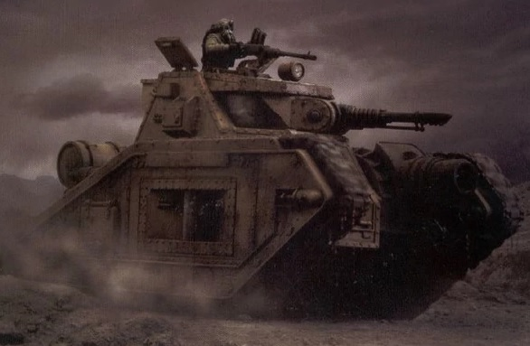
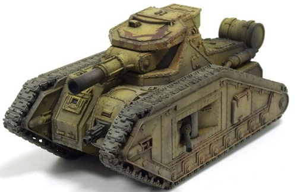
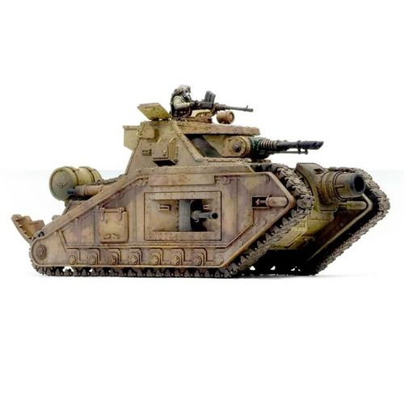
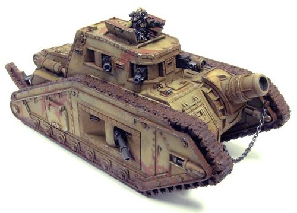
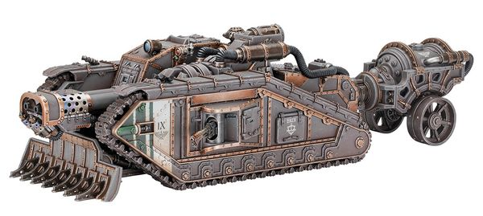
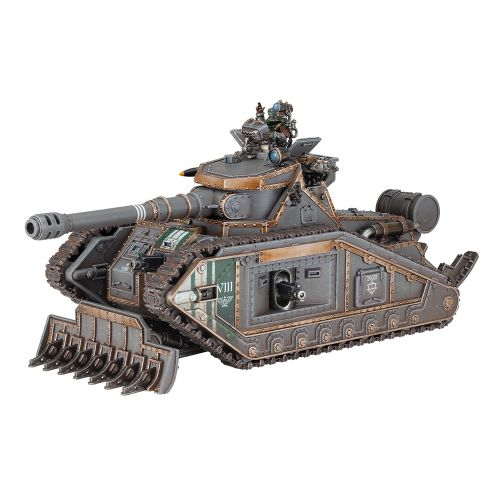

# 1498 马卡多战斗坦克 Malcador Battle Tank

精校状态：中文行文已逐段精校，部分术语仍为暂定

分类：载具 / 地面 / 重型

原文来源：https://www.bilibili.com/opus/1045950387760136198

原作者：帝国神选罐头

原文时间：2025年03月19日 15:01

[返回分类目录](目录.md) · [全书目录](../../目录.md)

<!-- A1498-B0001 -->
**英文原文**

The Malcador is an ancient design still in use by the Imperial Guard. Thought to be older than the venerable Leman Russ, the Malcador is intended to fulfill the same Main Battle Tank role despite its larger size. The tank is commonly thought to be named after Malcador the Sigillite, known to have been a close adviser to the Emperor and for creating the Administratum. Just like its namesake the Malcador's origins are obscure, and its usage across the Imperium is infrequent and rare, with some regions having never seen or heard of the tank.

<!-- /A1498-B0001 -->

<!-- A1498-B0002 -->

原译文

马卡多是一种古老的设计，至今仍被帝国卫队使用。马卡多被认为比神圣的黎曼鲁斯更古老，尽管它的尺寸更大，但它的目的是发挥同样的主战坦克作用。该坦克通常被认为是以掌印者马卡多命名的，众所周知，马卡多是帝皇的亲密顾问，并建立了行政机构。就像它的名字一样，马卡多的起源是模糊的，它在帝国中的使用是罕见的，一些地区从未见过或听说过这种坦克。

**校订译文**

马卡多是一种帝国卫队至今仍在使用的古老坦克设计，据信比历史悠久的黎曼鲁斯更早。虽然体形更大，它仍承担同样的主战坦克任务。其名称通常被认为源自掌印者马卡多——帝皇的亲密顾问、内政部的创立者。与这位同名人物一样，坦克的起源也扑朔迷离。它在帝国各地的使用颇为罕见，有些地区甚至从未见过或听说过。

<!-- /A1498-B0002 -->

<!-- A1498-B0003 图片 -->

<!-- A1498-B0004 -->

原译文

Malcador Annihilator Tank 马卡多歼灭者坦克

**校订译文**

Malcador Annihilator Tank 马卡多歼灭者坦克

<!-- /A1498-B0004 -->

<!-- A1498-B0005 -->
## History 历史

<!-- /A1498-B0005 -->

<!-- A1498-B0006 -->
**英文原文**

The Malcador design dates back to before even the formation of the Imperium to the Age of Strife. It was fielded widely during the subsequent Great Crusade, serving with both the Imperial Army and Legiones Astartes and being widely produced on the Forge Worlds of Mars and Voss. However according to older sources, it is speculated that the Malcador dates back to the early years of the Imperium, although exactly when is a matter of mystery even to the Adeptus Mechanicus. Due to its name it is thought the Malcador was introduced just after the Horus Heresy, a dark time of uncertainty when the Imperium was desperate for new war machines. With much knowledge and production capacity lost, along with designs such as the Land Raider now reserved for an elite few, the Malcador may have been put into mass-production in an attempt to fill the void left by the apocalyptic fighting.

<!-- /A1498-B0006 -->

<!-- A1498-B0007 -->

原译文

马卡多的设计甚至可以追溯到帝国形成之前的纷争时代。它在随后的大远征中得到了广泛的应用，为帝国陆军和阿斯塔特军团服役，并在火星和沃斯铸造世界上广泛生产。然而，根据较早的消息来源，人们推测马卡多可以追溯到帝国早期，尽管即使对机械神教来说，确切的时间也是一个谜。由于其名称，人们认为马卡多是在荷鲁斯叛乱之后引入的，这是一个充满不确定性的黑暗时期，帝国迫切需要新的战争机器。随着大量知识和生产能力的丧失，以及像兰德掠袭者这样的设计现在只留给少数精英，马卡多可能已经投入大规模生产，以填补启示录战争留下的空白。

**校订译文**

马卡多的设计可追溯至帝国建立前的纷争时代，在后来的大远征中广泛使用，同时服役于帝国军和阿斯塔特军团，并由火星与沃斯铸造世界大量生产。不过，较早资料则推测它起源于帝国初年，具体时间连机械修会也不清楚。这种旧说根据名称判断，它可能在荷鲁斯之乱刚结束时推出：当时帝国陷入黑暗动荡，急需新的战争机器，大量知识和产能丧失，兰德掠袭者等车型又已限定给少数精英。因此，马卡多或许被投入量产，以填补灾难性大战留下的装备缺口。

**校注：** 英文主动区分新旧资料两种起源说；保留纷争时代与叛乱后起源的差异，不强行消除。

<!-- /A1498-B0007 -->

<!-- A1498-B0008 -->
**英文原文**

Whatever the case may be, by the time of the 41st Millennium the Malcador has in many areas been entirely phased out of service. While a few Imperial Guard regiments continue using the Malcador out of a sense of tradition, in most cases the large part of existing tanks are either held in strategic reserves or relegated to 'second line' forces such as PDFs. As well very few Forge Worlds continue to produce Malcadors or replacement parts for them, though a few exceptions exist, most notably M'Khand Secundus in the Segmentum Pacificus.

<!-- /A1498-B0008 -->

<!-- A1498-B0009 -->

原译文

无论情况如何，到第41个千年时，马卡多在许多地区已经完全退役。虽然一些帝国卫队兵团出于传统意义继续使用马卡多坦克，但在大多数情况下，现有坦克的大部分要么被存放在战略储备中，要么被降级到PDF等“二线”部队。此外，很少有铸造世界继续生产马卡多或其替换零件，尽管也有一些例外，最著名的是太平星域的马坎德二号。

**校订译文**

无论起源如何，至第41千年，马卡多已在许多地区完全退役。少数帝国卫队团出于传统仍继续使用，但大多数存车已转入战略储备，或划给行星防御部队等二线力量。继续生产整车和备件的铸造世界也寥寥无几，最著名的例外是太平星域的姆'坎德二号。

<!-- /A1498-B0009 -->

<!-- A1498-B0010 -->
**英文原文**

It is known that Malcador Tank is a favourite vehicle of the Death Korps of Krieg, who look past the limited fields of fire of its weapons, appreciating it for its monstrous heavy armour and firepower - which mostly suited to the assault style of the Death Korps.

<!-- /A1498-B0010 -->

<!-- A1498-B0011 -->

原译文

众所周知，马卡多坦克是克里格死亡军团最喜欢的车辆，他们越过武器有限的火力范围，欣赏它巨大的重型装甲和火力，这些装甲和火力大多适合死亡军团的攻击风格。

**校订译文**

马卡多是克里格死亡军团偏爱的车型。克里格人不计较其武器射界有限，更看重厚重装甲与强大火力，因为这些特点契合死亡军团的突击作风。

<!-- /A1498-B0011 -->

<!-- A1498-B0012 -->
## Technical Information 技术资料

原题：Technical Information 技术信息

<!-- /A1498-B0012 -->

<!-- A1498-B0013 -->
**英文原文**

Somewhat larger and heavier than the more familiar and versatile Leman Russ, the Malcador's bulk and heavy layers of armour plating gives it improved durability. Its main armament is the venerable Battle Cannon while secondary fire comes from a hull-mounted Heavy Bolter and sponson-mounted Heavy Stubbers; in some tanks these weapons are replaced with Autocannons and Lascannons for additional firepower. The tank and its variants also mount a Searchlight and can carry a pintle-mounted Storm Bolter or Heavy Stubber and/or a single Hunter-Killer Missile.

<!-- /A1498-B0013 -->

<!-- A1498-B0014 -->

原译文

马卡多比更熟悉和多功能的黎曼鲁斯更大、更重，它的体积和厚重的装甲层提高了它的韧性。它的主要武器是古老的战斗炮，而次要火力来自安装在车体上的重型爆矢枪和安装在舷侧的重型伐木枪；在一些坦克中，这些武器被自动炮和激光炮所取代，以获得额外的火力。该坦克及其变体还安装了探照灯，可以携带枢轴安装的风暴爆矢枪或重型伐木枪和/或单个猎杀飞弹。

**校订译文**

马卡多比常见而用途广泛的黎曼鲁斯更大、更重，庞大车体和厚实装甲使其更加坚韧。主武器是历史悠久的战斗炮，车体重型爆矢枪与侧舷重机枪提供辅助火力；部分车辆改用自动炮或激光炮，以增强火力。马卡多及其变体还配有探照灯，可加装枢轴枪架风暴爆矢枪或重机枪，也可配备一枚猎杀导弹。

<!-- /A1498-B0014 -->

<!-- A1498-B0015 图片 -->

<!-- A1498-B0016 -->

原译文

Malcador Heavy Tank 马卡多重型坦克

**校订译文**

Malcador Heavy Tank 马卡多重型坦克

<!-- /A1498-B0016 -->

<!-- A1498-B0017 -->
**英文原文**

While well-armed and durable the tank does suffer from several limitations. One is the fact that its primary weapon is mounted in a limited-traverse turret embrasure, while the hull's shape and armouring further limits the firing arcs of its other weapons. This flaw can prove a liability on the chaotic battlefield, though an experienced commander can overcome it by supporting the tank with other combat elements. More damning to the design is its engine plant, a thermic combustor design more commonly used in agricultural and industrial machinery. While perfectly serviceable in its normal roles the engine is underpowered in relation to the Malcador's size and weight and can be more easily knocked out by enemy fire. This poor engine performance and very poor fuel efficiency has been more responsible than any other factor for the tank's demise in status. During Great Crusade and Horus Heresy they could further be outfitted with Flare Shields.

<!-- /A1498-B0017 -->

<!-- A1498-B0018 -->

原译文

虽然装备精良且耐用，但该坦克确实存在一些局限性。一个事实是，它的主要武器安装在一个有限的横向炮塔中，而车体的形状和装甲进一步限制了其他武器的射击弧线。这一缺陷可能会在混乱的战场上被证明是一种麻烦，尽管经验丰富的指挥官可以通过用其他战斗元素支援坦克来克服它。更糟糕的是它的发动机装置，这是一种在农业和工业机械中更常用的热燃烧室设计。虽然在正常工作中完全可用，但与马卡多的尺寸和重量相比，发动机动力不足，更容易被敌人的火力击毁。这种糟糕的发动机性能和非常低的燃油效率比任何其他因素都更容易导致油箱的报废。在大远征和荷鲁斯叛乱期间，他们可以进一步配备闪光盾牌。

**校订译文**

马卡多虽然武装强大、坚固耐用，仍有若干局限。主炮装在水平射界有限的炮塔射孔内，车体形状与装甲又进一步限制了其他武器的射界。这在混乱战场上容易成为弱点，但经验丰富的指挥官可以安排其他作战单位协同掩护。更严重的问题在于动力：它采用常见于农业和工业机械的热燃烧引擎，原本用途下表现良好，却难以负担马卡多的体积和重量，而且更易被敌火破坏。动力不足与油耗过高，是马卡多地位衰落的首要原因。大远征和荷鲁斯之乱期间，该型还可加装闪光护盾。

**校注：** demise in status 指地位衰落，原译油箱报废误把tank当油箱。

<!-- /A1498-B0018 -->

<!-- A1498-B0019 -->
**英文原文**

Vehicle Name:Malcador

<!-- /A1498-B0019 -->

<!-- A1498-B0020 -->

原译文

车辆名称：马卡多

**校订译文**

车辆名称：马卡多

<!-- /A1498-B0020 -->

<!-- A1498-B0021 -->
**英文原文**

Forge World of Origin:M'khand

<!-- /A1498-B0021 -->

<!-- A1498-B0022 -->

原译文

起源铸造世界：马坎德

**校订译文**

起源铸造世界：姆'坎德

<!-- /A1498-B0022 -->

<!-- A1498-B0023 -->
**英文原文**

Known Patterns:I-XIII

<!-- /A1498-B0023 -->

<!-- A1498-B0024 -->

原译文

已知型号：I-XIII

**校订译文**

已知型号：I-XIII

<!-- /A1498-B0024 -->

<!-- A1498-B0025 -->
**英文原文**

Crew:Commander, Driver, 4 x Gunners, Loader

<!-- /A1498-B0025 -->

<!-- A1498-B0026 -->

原译文

乘员：指挥官、驾驶员、4名炮手、装载者

**校订译文**

乘员：车长、驾驶员、4名炮手、装填手

<!-- /A1498-B0026 -->

<!-- A1498-B0027 -->
**英文原文**

Powerplant:HL330 V12 Multi-Fuel

<!-- /A1498-B0027 -->

<!-- A1498-B0028 -->

原译文

动力装置：HL330 V12多燃料

**校订译文**

动力装置：HL330 V12多燃料引擎

<!-- /A1498-B0028 -->

<!-- A1498-B0029 -->
**英文原文**

Weight:105 tonnes

<!-- /A1498-B0029 -->

<!-- A1498-B0030 -->

原译文

重量：105吨

**校订译文**

重量：105吨

<!-- /A1498-B0030 -->

<!-- A1498-B0031 -->
**英文原文**

Length:9.6m

<!-- /A1498-B0031 -->

<!-- A1498-B0032 -->

原译文

长度：9.6米

**校订译文**

长度：9.6米

<!-- /A1498-B0032 -->

<!-- A1498-B0033 -->
**英文原文**

Width:4.4m

<!-- /A1498-B0033 -->

<!-- A1498-B0034 -->

原译文

宽度：4.4米

**校订译文**

宽度：4.4米

<!-- /A1498-B0034 -->

<!-- A1498-B0035 -->
**英文原文**

Height:3.9m

<!-- /A1498-B0035 -->

<!-- A1498-B0036 -->

原译文

高度：3.9米

**校订译文**

高度：3.9米

<!-- /A1498-B0036 -->

<!-- A1498-B0037 -->
**英文原文**

Ground Clearance:0.65m

<!-- /A1498-B0037 -->

<!-- A1498-B0038 -->

原译文

离地间隙：0.65m

**校订译文**

离地间隙：0.65米

<!-- /A1498-B0038 -->

<!-- A1498-B0039 -->
**英文原文**

Fording Depth:{{{Fording Depth}}}

<!-- /A1498-B0039 -->

<!-- A1498-B0040 -->

原译文

涉水深度：｛｛｛涉水深度｝｝

**校订译文**

涉水深度：未提供

<!-- /A1498-B0040 -->

<!-- A1498-B0041 -->
**英文原文**

Max Speed - on road25kph

<!-- /A1498-B0041 -->

<!-- A1498-B0042 -->

原译文

最大速度-公路上每小时25公里

**校订译文**

最大公路速度：25公里/小时

<!-- /A1498-B0042 -->

<!-- A1498-B0043 -->
**英文原文**

Max Speed - off road:18kph

<!-- /A1498-B0043 -->

<!-- A1498-B0044 -->

原译文

最大速度-越野：18公里/小时

**校订译文**

最大越野速度：18公里/小时

<!-- /A1498-B0044 -->

<!-- A1498-B0045 -->
**英文原文**

Transport Capacity:None

<!-- /A1498-B0045 -->

<!-- A1498-B0046 -->

原译文

运输能力：无

**校订译文**

运输能力：无

<!-- /A1498-B0046 -->

<!-- A1498-B0047 -->
**英文原文**

Access Points:N/A

<!-- /A1498-B0047 -->

<!-- A1498-B0048 -->

原译文

入口：无

**校订译文**

出入口：未提供（N/A）

<!-- /A1498-B0048 -->

<!-- A1498-B0049 -->
**英文原文**

Main Armament:Battle Cannon

<!-- /A1498-B0049 -->

<!-- A1498-B0050 -->

原译文

主要武器：战斗炮

**校订译文**

主要武器：战斗炮

<!-- /A1498-B0050 -->

<!-- A1498-B0051 -->
**英文原文**

Secondary Armament:3 x Heavy Bolters

<!-- /A1498-B0051 -->

<!-- A1498-B0052 -->

原译文

次要武器：3个重型爆矢枪

**校订译文**

副武器：3挺重型爆矢枪

**校注：** 正文为车体重型爆矢枪加侧舷重机枪，表格则写三挺重型爆矢枪；源文不同配置保留。

<!-- /A1498-B0052 -->

<!-- A1498-B0053 -->
**英文原文**

Traverse:60°

<!-- /A1498-B0053 -->

<!-- A1498-B0054 -->

原译文

横向：60°

**校订译文**

水平射界：60°

<!-- /A1498-B0054 -->

<!-- A1498-B0055 -->
**英文原文**

Elevation:From -2° to 20°

<!-- /A1498-B0055 -->

<!-- A1498-B0056 -->

原译文

仰角：从-2°到20°

**校订译文**

俯仰角：−2°至+20°

<!-- /A1498-B0056 -->

<!-- A1498-B0057 -->
**英文原文**

Main Ammunition:32rounds

<!-- /A1498-B0057 -->

<!-- A1498-B0058 -->

原译文

主要弹药：32发

**校订译文**

主武器载弹量：32发

<!-- /A1498-B0058 -->

<!-- A1498-B0059 -->
**英文原文**

Secondary Ammunition:7,500 rounds

<!-- /A1498-B0059 -->

<!-- A1498-B0060 -->

原译文

二级弹药：7500发

**校订译文**

副武器载弹量：7500发

<!-- /A1498-B0060 -->

<!-- A1498-B0061 -->
### Armour 装甲

<!-- /A1498-B0061 -->

<!-- A1498-B0062 -->
**英文原文**

Superstructure:180mm

<!-- /A1498-B0062 -->

<!-- A1498-B0063 -->

原译文

上部结构：180毫米

**校订译文**

上部结构：180毫米

<!-- /A1498-B0063 -->

<!-- A1498-B0064 -->
**英文原文**

Hull:160mm

<!-- /A1498-B0064 -->

<!-- A1498-B0065 -->

原译文

车体：160毫米

**校订译文**

车体：160毫米

<!-- /A1498-B0065 -->

<!-- A1498-B0066 -->
**英文原文**

Gun Mantlet:N/A

<!-- /A1498-B0066 -->

<!-- A1498-B0067 -->

原译文

炮盾：无

**校订译文**

炮盾：无

<!-- /A1498-B0067 -->

<!-- A1498-B0068 -->
**英文原文**

Vehicle Designation:8677-032-8391-ML021

<!-- /A1498-B0068 -->

<!-- A1498-B0069 -->

原译文

车辆编号：8677-032-8391-ML021

**校订译文**

车辆编号：8677-032-8391-ML021

<!-- /A1498-B0069 -->

<!-- A1498-B0070 -->
**英文原文**

Firing Ports:N/A

<!-- /A1498-B0070 -->

<!-- A1498-B0071 -->

原译文

开火口：无

**校订译文**

射击孔：未提供（N/A）

<!-- /A1498-B0071 -->

<!-- A1498-B0072 -->
**英文原文**

Turret:N/A

<!-- /A1498-B0072 -->

<!-- A1498-B0073 -->

原译文

炮塔：无

**校订译文**

炮塔：无

<!-- /A1498-B0073 -->

<!-- A1498-B0074 -->
## Variants 变体

<!-- /A1498-B0074 -->

<!-- A1498-B0075 -->
**英文原文**

As with the Leman Russ many variants of the Malcador have been produced over the design's lifetime, usually to fulfill a specific task or try and overcome a flaw, though problems with the engine is something that has plagued all versions of the tank.

<!-- /A1498-B0075 -->

<!-- A1498-B0076 -->

原译文

与黎曼鲁斯一样，马卡多的许多变体都是在设计的生命周期内生产的，通常是为了完成特定的任务或试图克服缺陷，尽管发动机的问题一直困扰着所有版本的坦克。

**校订译文**

与黎曼鲁斯一样，马卡多在漫长使用史中衍生出多种变体，通常为完成特定任务或弥补设计缺陷而改进；但所有型号始终受到引擎问题困扰。

<!-- /A1498-B0076 -->

<!-- A1498-B0077 -->
### Malcador 'Annihilator' 马卡多‘歼灭者’

<!-- /A1498-B0077 -->

<!-- A1498-B0078 -->
**英文原文**

The Malcador 'Annihilator' is thought to be a field refit of battle-damaged or incomplete Malcadors, replacing the Battle Cannon with twin-linked Lascannons and the hull-mounted Heavy Bolter with a Demolisher Cannon. While this attempt to increase the Malcador's versatility by allowing it to perform in an anti-tank role against both regular and Super-Heavy Tanks is admirable, it remains too large and too slow to be a true "tank hunter" and lacks the durability or endurance to challenge true heavyweights like the Baneblade in open battle. When operating as part of a wider offensive though the Malcador 'Annihilator' can still prove its worth in the hands of a skilled crew.

<!-- /A1498-B0078 -->

<!-- A1498-B0079 -->

原译文

马卡多“歼灭者”被认为是对战斗中受损或不完整的马卡多进行的野战改装，用双联激光炮代替战斗炮，用粉碎者加农炮代替车体安装的重型爆矢枪。虽然这种通过允许马卡多在对抗常规和超重型坦克时发挥反坦克作用来增加其多功能性的尝试令人钦佩，但它仍然太大、太慢，无法成为真正的“坦克猎手”，并且缺乏在正式战斗中挑战毒刃等真正重量级坦克的耐久性或韧性。当作为更广泛进攻的一部分作战时，马卡多“歼灭者”仍然可以在熟练的乘员手中证明其价值。

**校订译文**

马卡多歼灭者被认为是以战损或未完工机体为基础进行的战地改装：用双联激光炮取代战斗炮，车体重型爆矢枪则换成破坏者加农炮。这种尝试希望增加用途，使马卡多能够对抗普通及超重型坦克，思路虽好，车辆却仍过大、过慢，难以成为真正的坦克猎手；其坚固程度与持续作战能力，也不足以在正面交战中挑战毒刃这样的重量级对手。不过，作为大规模攻势的一环，熟练车组仍能发挥马卡多歼灭者的价值。

<!-- /A1498-B0079 -->

<!-- A1498-B0080 图片 -->

<!-- A1498-B0081 -->

原译文

Malcador 'Annihilator' 马卡多‘歼灭者’

**校订译文**

Malcador 'Annihilator' 马卡多‘歼灭者’

<!-- /A1498-B0081 -->

<!-- A1498-B0082 -->
**英文原文**

Vehicle Name:Malcador Annihilator

<!-- /A1498-B0082 -->

<!-- A1498-B0083 -->

原译文

车辆名称：马卡多歼灭者

**校订译文**

车辆名称：马卡多歼灭者

<!-- /A1498-B0083 -->

<!-- A1498-B0084 -->
**英文原文**

Forge World of Origin:M'khand

<!-- /A1498-B0084 -->

<!-- A1498-B0085 -->

原译文

起源铸造世界：马坎德

**校订译文**

起源铸造世界：姆'坎德

<!-- /A1498-B0085 -->

<!-- A1498-B0086 -->
**英文原文**

Known Patterns:I-VII

<!-- /A1498-B0086 -->

<!-- A1498-B0087 -->

原译文

已知型号：I-VII

**校订译文**

已知型号：I-VII

<!-- /A1498-B0087 -->

<!-- A1498-B0088 -->
**英文原文**

Crew:Commander, Driver, 4 x Gunners, Loader

<!-- /A1498-B0088 -->

<!-- A1498-B0089 -->

原译文

乘员：指挥官、驾驶员、4名炮手、装载者

**校订译文**

乘员：车长、驾驶员、4名炮手、装填手

<!-- /A1498-B0089 -->

<!-- A1498-B0090 -->
**英文原文**

Powerplant:HL330 V12 Multi-Fuel

<!-- /A1498-B0090 -->

<!-- A1498-B0091 -->

原译文

动力装置：HL330 V12多燃料

**校订译文**

动力装置：HL330 V12多燃料引擎

<!-- /A1498-B0091 -->

<!-- A1498-B0092 -->
**英文原文**

Weight:99 tonnes

<!-- /A1498-B0092 -->

<!-- A1498-B0093 -->

原译文

重量：99吨

**校订译文**

重量：99吨

<!-- /A1498-B0093 -->

<!-- A1498-B0094 -->
**英文原文**

Length:9.6m

<!-- /A1498-B0094 -->

<!-- A1498-B0095 -->

原译文

长度：9.6米

**校订译文**

长度：9.6米

<!-- /A1498-B0095 -->

<!-- A1498-B0096 -->
**英文原文**

Width:4.4m

<!-- /A1498-B0096 -->

<!-- A1498-B0097 -->

原译文

宽度：4.4米

**校订译文**

宽度：4.4米

<!-- /A1498-B0097 -->

<!-- A1498-B0098 -->
**英文原文**

Height:3.9m

<!-- /A1498-B0098 -->

<!-- A1498-B0099 -->

原译文

高度：3.9米

**校订译文**

高度：3.9米

<!-- /A1498-B0099 -->

<!-- A1498-B0100 -->
**英文原文**

Ground Clearance:0.65m

<!-- /A1498-B0100 -->

<!-- A1498-B0101 -->

原译文

离地间隙：0.65m

**校订译文**

离地间隙：0.65米

<!-- /A1498-B0101 -->

<!-- A1498-B0102 -->
**英文原文**

Fording Depth:{{{Fording Depth}}}

<!-- /A1498-B0102 -->

<!-- A1498-B0103 -->

原译文

涉水深度：｛｛｛涉水深度｝｝

**校订译文**

涉水深度：未提供

<!-- /A1498-B0103 -->

<!-- A1498-B0104 -->
**英文原文**

Max Speed - on road25kph

<!-- /A1498-B0104 -->

<!-- A1498-B0105 -->

原译文

最大速度-公路上每小时25公里

**校订译文**

最大公路速度：25公里/小时

<!-- /A1498-B0105 -->

<!-- A1498-B0106 -->
**英文原文**

Max Speed - off road:18kph

<!-- /A1498-B0106 -->

<!-- A1498-B0107 -->

原译文

最大速度-越野：18公里/小时

**校订译文**

最大越野速度：18公里/小时

<!-- /A1498-B0107 -->

<!-- A1498-B0108 -->
**英文原文**

Transport Capacity:None

<!-- /A1498-B0108 -->

<!-- A1498-B0109 -->

原译文

运输能力：无

**校订译文**

运输能力：无

<!-- /A1498-B0109 -->

<!-- A1498-B0110 -->
**英文原文**

Access Points:N/A

<!-- /A1498-B0110 -->

<!-- A1498-B0111 -->

原译文

入口：无

**校订译文**

出入口：未提供（N/A）

<!-- /A1498-B0111 -->

<!-- A1498-B0112 -->
**英文原文**

Main Armament:Twin-linked Lascannons

<!-- /A1498-B0112 -->

<!-- A1498-B0113 -->

原译文

主武器：双联激光炮

**校订译文**

主武器：双联激光炮

<!-- /A1498-B0113 -->

<!-- A1498-B0114 -->
**英文原文**

Secondary Armament: Heavy Bolter，2 x Heavy Flamers

<!-- /A1498-B0114 -->

<!-- A1498-B0115 -->

原译文

次要武器：重型爆矢枪、2个重型火焰枪

**校订译文**

副武器：重型爆矢枪、2具重型火焰喷射器

**校注：** 歼灭者正文写车体破坏者加农炮，表格却列重型爆矢枪与重型火焰喷射器；没有替源文统一。

<!-- /A1498-B0115 -->

<!-- A1498-B0116 -->
**英文原文**

Traverse:60°

<!-- /A1498-B0116 -->

<!-- A1498-B0117 -->

原译文

横向：60°

**校订译文**

水平射界：60°

<!-- /A1498-B0117 -->

<!-- A1498-B0118 -->
**英文原文**

Elevation:From -2° to 20°

<!-- /A1498-B0118 -->

<!-- A1498-B0119 -->

原译文

仰角：从-2°到20°

**校订译文**

俯仰角：−2°至+20°

<!-- /A1498-B0119 -->

<!-- A1498-B0120 -->
**英文原文**

Main Ammunition:Unlimited

<!-- /A1498-B0120 -->

<!-- A1498-B0121 -->

原译文

主弹药：无限

**校订译文**

主武器弹药：原表记为无限

<!-- /A1498-B0121 -->

<!-- A1498-B0122 -->
**英文原文**

Secondary Ammunition:2,500 rounds

<!-- /A1498-B0122 -->

<!-- A1498-B0123 -->

原译文

二级弹药：2500发

**校订译文**

副武器载弹量：2500发

<!-- /A1498-B0123 -->

<!-- A1498-B0124 -->
### Armour 装甲

<!-- /A1498-B0124 -->

<!-- A1498-B0125 -->
**英文原文**

Superstructure:180mm

<!-- /A1498-B0125 -->

<!-- A1498-B0126 -->

原译文

上部结构：180毫米

**校订译文**

上部结构：180毫米

<!-- /A1498-B0126 -->

<!-- A1498-B0127 -->
**英文原文**

Hull:160mm

<!-- /A1498-B0127 -->

<!-- A1498-B0128 -->

原译文

车体：160毫米

**校订译文**

车体：160毫米

<!-- /A1498-B0128 -->

<!-- A1498-B0129 -->
**英文原文**

Gun Mantlet N/A

<!-- /A1498-B0129 -->

<!-- A1498-B0130 -->

原译文

炮盾：无

**校订译文**

炮盾：无

<!-- /A1498-B0130 -->

<!-- A1498-B0131 -->
**英文原文**

Vehicle Designation:8677-032-8391-ML028

<!-- /A1498-B0131 -->

<!-- A1498-B0132 -->

原译文

车辆编号：8677-032-8391-ML028

**校订译文**

车辆编号：8677-032-8391-ML028

<!-- /A1498-B0132 -->

<!-- A1498-B0133 -->
**英文原文**

Firing Ports:N/A

<!-- /A1498-B0133 -->

<!-- A1498-B0134 -->

原译文

开火口：无

**校订译文**

射击孔：未提供（N/A）

<!-- /A1498-B0134 -->

<!-- A1498-B0135 -->
**英文原文**

Turret:N/A

<!-- /A1498-B0135 -->

<!-- A1498-B0136 -->

原译文

炮塔：无

**校订译文**

炮塔：无

<!-- /A1498-B0136 -->

<!-- A1498-B0137 -->
### Malcador 'Defender' 马卡多‘防御者’

<!-- /A1498-B0137 -->

<!-- A1498-B0138 -->
**英文原文**

The Malcador 'Defender' is one of the most unusual, and arguably effective, of the Malcador variants and is more common than the original design. Its limited-traverse turret embrasure has been entirely refitted with five Heavy Bolters providing complete 360° coverage around the tank, while the Demolisher Cannon and sponson weapons are maintained. Transforming its role into that of a breakthrough tank, the Malcador 'Defender' is a mobile fortress well-suited to close-quarters combat during urban and trench warfare, with the Demolisher used against enemy strongpoints and fortifications. The additional weaponry does require a larger crew, with eight troopers crammed into the tight, sweltering hull, and forces the commander to double as a heavy bolter gunner. That the tank seldom operates far from resupply or support helps mitigates some of the original design's failings.

<!-- /A1498-B0138 -->

<!-- A1498-B0139 -->

原译文

马卡多“防御者”是马卡多变体中最不寻常、最有效的一种，比原始设计更常见。其有限的横向炮塔炮口已完全改装为五个重型爆矢枪，在坦克周围提供360°的完整覆盖，同时保留了粉碎者加农炮和侧舷武器。将其角色转变为突破坦克，马卡多“防御者”是一个移动堡垒，非常适合在城市和堑壕战中进行近距离战斗，粉碎者用于对抗敌人的据点和防御工事。额外的武器需要更多的乘员，八名士兵挤在狭小、闷热的车体里，迫使指挥官兼任重炮手。坦克很少在远离补给或支援的地方运行，这有助于减轻原始设计的一些缺陷。

**校订译文**

马卡多防御者是最特殊的变体之一，也可说是最有效的型号之一，比原始型更常见。原本射界有限的炮塔被完全改装，五挺重型爆矢枪覆盖整车周围360°，同时保留破坏者加农炮和侧舷武器。它由此成为适合突破的移动堡垒，尤其适合城市与堑壕中的近距离作战，破坏者炮用于摧毁敌军据点和工事。新增武器需要更多车组，八名士兵挤在狭小闷热的车厢里，车长也须兼任重型爆矢枪射手。由于这种坦克很少远离补给和支援行动，原设计的部分缺陷得以缓解。

<!-- /A1498-B0139 -->

<!-- A1498-B0140 图片 -->

<!-- A1498-B0141 -->

原译文

Malcador 'Defender' 马卡多‘防御者’

**校订译文**

Malcador 'Defender' 马卡多‘防御者’

<!-- /A1498-B0141 -->

<!-- A1498-B0142 -->
**英文原文**

Vehicle Name:Malcador Defender

<!-- /A1498-B0142 -->

<!-- A1498-B0143 -->

原译文

车辆名称：马卡多防御者

**校订译文**

车辆名称：马卡多防御者

<!-- /A1498-B0143 -->

<!-- A1498-B0144 -->
**英文原文**

Forge World of Origin:M'khand

<!-- /A1498-B0144 -->

<!-- A1498-B0145 -->

原译文

起源铸造世界：马坎德

**校订译文**

起源铸造世界：姆'坎德

<!-- /A1498-B0145 -->

<!-- A1498-B0146 -->
**英文原文**

Known Patterns:I-IX

<!-- /A1498-B0146 -->

<!-- A1498-B0147 -->

原译文

已知型号：I-IX

**校订译文**

已知型号：I-IX

<!-- /A1498-B0147 -->

<!-- A1498-B0148 -->
**英文原文**

Crew:Commander, Driver, 4 x Gunners, Loader

<!-- /A1498-B0148 -->

<!-- A1498-B0149 -->

原译文

乘员：指挥官、驾驶员、4名炮手、装载者

**校订译文**

乘员：车长、驾驶员、4名炮手、装填手

**校注：** 前段称八名车组，本表相加为七名，保留源文数目差异。

<!-- /A1498-B0149 -->

<!-- A1498-B0150 -->
**英文原文**

Powerplant:HL330 V12 Multi-Fuel

<!-- /A1498-B0150 -->

<!-- A1498-B0151 -->

原译文

动力装置：HL330 V12多燃料

**校订译文**

动力装置：HL330 V12多燃料引擎

<!-- /A1498-B0151 -->

<!-- A1498-B0152 -->
**英文原文**

Weight:105 tonnes

<!-- /A1498-B0152 -->

<!-- A1498-B0153 -->

原译文

重量：105吨

**校订译文**

重量：105吨

<!-- /A1498-B0153 -->

<!-- A1498-B0154 -->
**英文原文**

Length:9.6m

<!-- /A1498-B0154 -->

<!-- A1498-B0155 -->

原译文

长度：9.6米

**校订译文**

长度：9.6米

<!-- /A1498-B0155 -->

<!-- A1498-B0156 -->
**英文原文**

Width:4.4m

<!-- /A1498-B0156 -->

<!-- A1498-B0157 -->

原译文

宽度：4.4米

**校订译文**

宽度：4.4米

<!-- /A1498-B0157 -->

<!-- A1498-B0158 -->
**英文原文**

Height:3.9m

<!-- /A1498-B0158 -->

<!-- A1498-B0159 -->

原译文

高度：3.9米

**校订译文**

高度：3.9米

<!-- /A1498-B0159 -->

<!-- A1498-B0160 -->
**英文原文**

Ground Clearance:0.65m

<!-- /A1498-B0160 -->

<!-- A1498-B0161 -->

原译文

离地间隙：0.65m

**校订译文**

离地间隙：0.65米

<!-- /A1498-B0161 -->

<!-- A1498-B0162 -->
**英文原文**

Fording Depth:{{{Fording Depth}}}

<!-- /A1498-B0162 -->

<!-- A1498-B0163 -->

原译文

涉水深度：｛｛｛涉水深度｝｝

**校订译文**

涉水深度：未提供

<!-- /A1498-B0163 -->

<!-- A1498-B0164 -->
**英文原文**

Max Speed - on road25kph

<!-- /A1498-B0164 -->

<!-- A1498-B0165 -->

原译文

最大速度-公路上每小时25公里

**校订译文**

最大公路速度：25公里/小时

<!-- /A1498-B0165 -->

<!-- A1498-B0166 -->
**英文原文**

Max Speed - off road:18kph

<!-- /A1498-B0166 -->

<!-- A1498-B0167 -->

原译文

最大速度-越野：18公里/小时

**校订译文**

最大越野速度：18公里/小时

<!-- /A1498-B0167 -->

<!-- A1498-B0168 -->
**英文原文**

Transport Capacity:None

<!-- /A1498-B0168 -->

<!-- A1498-B0169 -->

原译文

运输能力：无

**校订译文**

运输能力：无

<!-- /A1498-B0169 -->

<!-- A1498-B0170 -->
**英文原文**

Access Points:N/A

<!-- /A1498-B0170 -->

<!-- A1498-B0171 -->

原译文

入口：无

**校订译文**

出入口：未提供（N/A）

<!-- /A1498-B0171 -->

<!-- A1498-B0172 -->
**英文原文**

Main Armament:Demolisher Cannon

<!-- /A1498-B0172 -->

<!-- A1498-B0173 -->

原译文

主武器：粉碎者加农炮

**校订译文**

主武器：破坏者加农炮

<!-- /A1498-B0173 -->

<!-- A1498-B0174 -->
**英文原文**

Secondary Armament: 5 x Heavy Bolters，2 x Lascannons

<!-- /A1498-B0174 -->

<!-- A1498-B0175 -->

原译文

次要武器：5门重型爆矢枪，2门激光炮

**校订译文**

副武器：5挺重型爆矢枪、2门激光炮

<!-- /A1498-B0175 -->

<!-- A1498-B0176 -->
**英文原文**

Traverse:5°

<!-- /A1498-B0176 -->

<!-- A1498-B0177 -->

原译文

横向：5°

**校订译文**

水平射界：5°

<!-- /A1498-B0177 -->

<!-- A1498-B0178 -->
**英文原文**

Elevation:From 0° to +46°

<!-- /A1498-B0178 -->

<!-- A1498-B0179 -->

原译文

仰角：0°至+46°

**校订译文**

俯仰角：0°至+46°

<!-- /A1498-B0179 -->

<!-- A1498-B0180 -->
**英文原文**

Main Ammunition:18 rounds

<!-- /A1498-B0180 -->

<!-- A1498-B0181 -->

原译文

主要弹药：18发

**校订译文**

主武器载弹量：18发

<!-- /A1498-B0181 -->

<!-- A1498-B0182 -->
**英文原文**

Secondary Ammunition:7,500 rounds

<!-- /A1498-B0182 -->

<!-- A1498-B0183 -->

原译文

二级弹药：7500发

**校订译文**

副武器载弹量：7500发

<!-- /A1498-B0183 -->

<!-- A1498-B0184 -->
### Armour 装甲

<!-- /A1498-B0184 -->

<!-- A1498-B0185 -->
**英文原文**

Superstructure:180mm

<!-- /A1498-B0185 -->

<!-- A1498-B0186 -->

原译文

上部结构：180毫米

**校订译文**

上部结构：180毫米

<!-- /A1498-B0186 -->

<!-- A1498-B0187 -->
**英文原文**

Hull:160mm

<!-- /A1498-B0187 -->

<!-- A1498-B0188 -->

原译文

车体：160毫米

**校订译文**

车体：160毫米

<!-- /A1498-B0188 -->

<!-- A1498-B0189 -->
**英文原文**

Gun Mantlet:N/A

<!-- /A1498-B0189 -->

<!-- A1498-B0190 -->

原译文

炮盾：N/A

**校订译文**

炮盾：不适用

<!-- /A1498-B0190 -->

<!-- A1498-B0191 -->
**英文原文**

Vehicle Designation:8677-032-8391-ML036

<!-- /A1498-B0191 -->

<!-- A1498-B0192 -->

原译文

车辆编号：8677-032-8391-ML036

**校订译文**

车辆编号：8677-032-8391-ML036

<!-- /A1498-B0192 -->

<!-- A1498-B0193 -->
**英文原文**

Firing Ports:N/A

<!-- /A1498-B0193 -->

<!-- A1498-B0194 -->

原译文

开火口：无

**校订译文**

射击孔：未提供（N/A）

<!-- /A1498-B0194 -->

<!-- A1498-B0195 -->
**英文原文**

Turret:N/A

<!-- /A1498-B0195 -->

<!-- A1498-B0196 -->

原译文

炮塔：无

**校订译文**

炮塔：无

<!-- /A1498-B0196 -->

<!-- A1498-B0197 -->
### Malcador 'Infernus' 马卡多‘炼狱’

<!-- /A1498-B0197 -->

<!-- A1498-B0198 -->
**英文原文**

The Malcador 'Infernus' is a flamethrower tank, though its role has been largely supplanted by the faster and more reliable Hellhound, and is more often found in second-line units such as Planetary Defense Forces or relegated to civilian duties. The tank mounts a massive Inferno Gun in its hull and tows a large fuel trailer behind it, where promethium is stored as separate chemicals before being mixed together in a chamber just behind the gun's barrel. The resulting chemical 'jelly' jets out and sticks to any surface, burning with intense heat. While powerfully effective against enemy infantry, this huge flamer is also an effective mine-clearing device, using the sudden heat to detonate the explosives' fuses.

<!-- /A1498-B0198 -->

<!-- A1498-B0199 -->

原译文

马卡多“炼狱”是一种火焰喷射坦克，尽管它的作用在很大程度上已被更快、更可靠的地狱犬所取代，并且更常见于行星防御部队等二线部队或降级为民用任务。该坦克在其车体上安装了一个巨大的炼狱炮，并在其后面拖着一辆大型燃料拖车，在那里，钷作为单独的化学物质储存，然后在炮管后面的一个腔室中混合在一起。由此产生的化学“凝胶”会喷出并粘在任何表面上，在高温下燃烧。对敌方步兵非常有效，这个巨大的喷火器也是一种有效的扫雷装置，利用突然的热量引爆炸药的引信。

**校订译文**

马卡多炼狱是一种喷火坦克，其用途大多已被更快、更可靠的地狱犬接替，如今更常见于行星防御部队等二线部队，或被转作民用。它在车体内安装巨型炼狱炮，后方拖曳大型燃料拖车。钷的不同化学组分分开储存在拖车中，到炮管后方的腔室才混合，形成喷出后能黏附各种表面的化学凝胶，以极高温度燃烧。这种巨型喷火器不仅能有效杀伤步兵，也可用于扫雷，以骤然升高的温度触发爆炸物引信。

<!-- /A1498-B0199 -->

<!-- A1498-B0200 图片 -->

<!-- A1498-B0201 -->

原译文

Malcador 'Infernus' 马卡多‘炼狱’

**校订译文**

Malcador 'Infernus' 马卡多‘炼狱’

<!-- /A1498-B0201 -->

<!-- A1498-B0202 -->
**英文原文**

However carrying a large amount of flammable fuel in a separate trailer does make for a tempting target and, if detonated by enemy fire, can result in a fiery explosion which incinerates tank and crew; postings to an 'Infernus' are rarely well-received. Some unscrupulous commanders have taken to replacing the promethium with corrosive chemicals and acidic gases, turning the vehicle into a deadly toxic sprayer. This is especially common with regiments like the Death Korps of Krieg for when complete genocide of the enemy is ordered.

<!-- /A1498-B0202 -->

<!-- A1498-B0203 -->

原译文

然而，在单独的拖车中携带大量易燃燃料确实会成为一个诱人的目标，如果被敌方火力引爆，可能会导致剧烈爆炸，焚烧坦克和车组人员；派驻“炼狱”很少受到好评。一些肆无忌惮的指挥官开始用腐蚀性化学物质和酸性气体代替钷，将车辆变成致命的剧毒喷雾器。这在克里格死亡军团等兵团中尤其常见，当命令对敌人进行彻底的种族灭绝时。

**校订译文**

然而，单独拖车内的大量易燃燃料也是诱人的靶子。一旦被敌火引爆，烈焰可能将坦克和车组一同焚毁，因此鲜有人乐于被派往炼狱型服役。一些不择手段的指挥官会以腐蚀性化学品和酸性气体取代钷，把车辆变成致命毒剂喷射器。克里格死亡军团等部队接到彻底灭绝敌人的命令时，尤其常见这种做法。

<!-- /A1498-B0203 -->

<!-- A1498-B0204 -->
**英文原文**

Besides its Inferno Gun the Malcador 'Infernus' also mounts two sponson Heavy Stubbers, which can be replaced with Heavy Bolters, Heavy Flamers, Autocannons and Lascannons. While the vehicle is equipped with a Searchlight it lacks typical Smoke Launchers, instead generating an impromptu smoke screen by injecting fuel into its hot engine. Some will also carry a pintle-mounted Heavy Stubber and/or a single Hunter-Killer Missile. Like other Malcador patterns the 'Infernus' still suffers from an underpowered engine, causing it to struggle on steep inclines and overheat.

<!-- /A1498-B0204 -->

<!-- A1498-B0205 -->

原译文

除了炼狱炮外，马卡多“炼狱”还安装了两个侧舷重型伐木枪，可以用重型爆矢枪、重型火焰炮、自动炮和激光炮代替。虽然该车配备了探照灯，但它没有典型的烟雾发射器，而是通过向其炽热的发动机喷射燃料来产生临时烟雾屏障。有些还将携带一枚枢轴式重型伐木枪和/或一枚猎杀飞弹。与其它马卡多车型一样，“炼狱”仍然存在发动机动力不足的问题，导致它会在陡坡上挣扎并过热。

**校订译文**

除炼狱炮外，马卡多炼狱还有两挺侧舷重机枪，可换成重型爆矢枪、重型火焰喷射器、自动炮或激光炮。车辆配有探照灯，却没有通常的烟雾发射器，而是向炽热引擎喷入燃料，临时制造烟幕。部分机体还加装枢轴枪架重机枪、单枚猎杀导弹，或同时配备二者。与其他马卡多型号一样，炼狱型也动力不足，上陡坡时十分吃力且容易过热。

<!-- /A1498-B0205 -->

<!-- A1498-B0206 -->
### Malcador 'Vanquisher' 马卡多“胜利者”

原题：Malcador 'Vanquisher' 马卡多‘征服者’

**校注：** Vanquisher 参考已核黎曼鲁斯胜利者型号词根暂译胜利者；马卡多全车型无官方对应，原稿征服者。

<!-- /A1498-B0206 -->

<!-- A1498-B0207 -->
**英文原文**

A variant of the Malcador tank equipped with a Vanquisher Battlecannon to snipe enemy armor at range. This model was used by the Solar Auxilia during the Great Crusade and Horus Heresy.

<!-- /A1498-B0207 -->

<!-- A1498-B0208 -->

原译文

马卡多坦克的一种变体，配备有征服者战斗炮，可以在远处狙击敌人的装甲。这个模式在大远征和荷鲁斯叛乱期间被太阳辅助军使用。

**校订译文**

马卡多的一种变体，配备胜利者战斗炮，用于远距离精确打击敌方装甲。太阳辅助军曾在大远征和荷鲁斯之乱期间使用该型。

<!-- /A1498-B0208 -->

<!-- A1498-B0209 图片 -->

<!-- A1498-B0210 -->

原译文

Malcador 'Vanquisher' 马卡多‘征服者’

**校订译文**

Malcador 'Vanquisher' 马卡多“胜利者”

<!-- /A1498-B0210 -->

本篇核心术语与暂定项

以下列出本篇出现的英文原形及核心术语表用词。同形词可能指不同对象，具体词义以本篇正文和校注为准；单复数、别名和仅见于图注的名称可能尚未列入。完整候选见[术语表](../../术语表/双语术语候选.csv)。

| 英文 | 采用中文 | 状态 |
| --- | --- | --- |
| Adeptus Mechanicus | 机械修会 | 官方已核对 |
| Imperial Guard | 帝国卫队 | 暂定·语境区分 |
| Imperial Army | 帝国军 | 暂定·官方待核 |
| Horus Heresy | 荷鲁斯之乱 | 官方已核对 |
| Imperium | 帝国 | 暂定·简称 |
| Administratum | 内政部 | 暂定 |
| Emperor | 帝皇 | 官方已核对 |
| Forge World | 铸造世界 | 暂定·官方待核 |
| Great Crusade | 大远征 | 暂定·官方待核 |
| Age of Strife | 纷争时代 | 暂定·官方待核 |
| Horus | 荷鲁斯 | 暂定·官方待核 |
| Hunter-Killer | 猎杀者 | 暂定·官方待核 |
| PDFs | 行星防卫军 | 暂定·官方待核 |
| Planetary Defense Forces | 行星防卫军 | 暂定·官方待核 |
| Legiones Astartes | 阿斯塔特军团 | 暂定·官方待核 |
| Solar Auxilia | 太阳辅助军 | 暂定·官方待核 |
| Segmentum Pacificus | 太平星域 | 暂定·官方待核 |
| Segmentum | 星域 | 暂定·官方待核 |
| Malcador the Sigillite | 掌印者马卡多 | 暂定·官方待核 |
| Endurance | 坚韧 | 暂定·官方待核 |
| Mars | 火星 | 暂定·官方待核 |
| Land Raider | 兰德掠袭者战车 | 官方已核对 |
| Ancient | 旗手 | 官方已核对 |
| The Sigillite | 掌印者 | 暂定·官方待核 |
| Baneblade | 毒刃 | 官方已核对 |
| Death Korps of Krieg | 克里格死亡军团 | 官方已核对 |
| Flamers | 火妖（奸奇单位）／火焰喷射器（武器） | 语境定译·对应官译已核 |
| Raider | 掠袭者飞艇 | 官方已核对 |
| Gun | 甘 | 暂定·官方待核 |
| Krieg | 克里格 | 暂定·官方待核 |
| M'khand | 姆'坎德 | 暂定·官方待核 |
| Voss | 沃斯 | 暂定·官方待核 |
| Battle Cannon | 战斗炮 | 暂定·官方待核 |
| Demolisher Cannon | 破坏者加农炮 | 暂定·官方待核 |
| Hunter-killer missile | 猎杀导弹 | 官方已核对 |
| Heavy stubber | 重机枪 | 官方已核对 |
| Promethium | 钷素 | 暂定·官方待核 |
| Bolter | 爆矢枪 | 暂定·官方待核 |
| Heavy bolter | 重型爆矢枪 | 官方已核对 |
| Storm bolter | 风暴爆矢枪 | 官方已核对 |
| Inferno Gun | 炼狱炮 | 暂定·官方待核 |
| Flamer | 火焰喷射器（武器）／火妖（奸奇单位） | 语境定译·对应官译已核 |
| Hellhound | 地狱犬战车 | 官方已核对 |
| Strategic Reserves | 战略预备队 | 官方中文参考 |
| Flare Shields | 闪光护盾 | 暂定·官方待核 |
| Malcador Annihilator | 马卡多歼灭者 | 暂定·官方待核 |
| Malcador Defender | 马卡多防御者 | 暂定·官方待核 |
| Vanquisher Battlecannon | 胜利者战斗炮 | 暂定·官方待核 |

