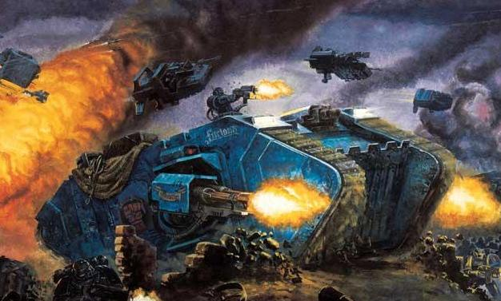
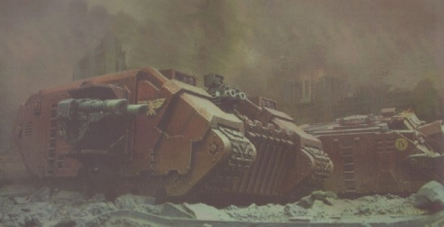
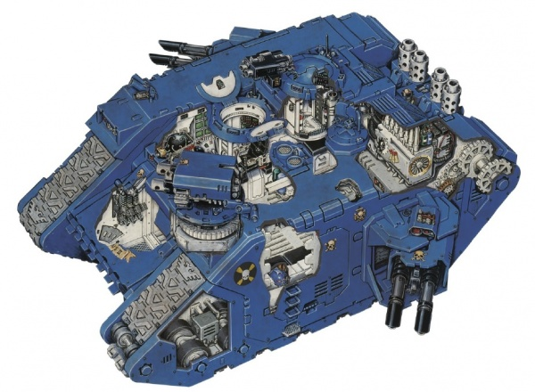
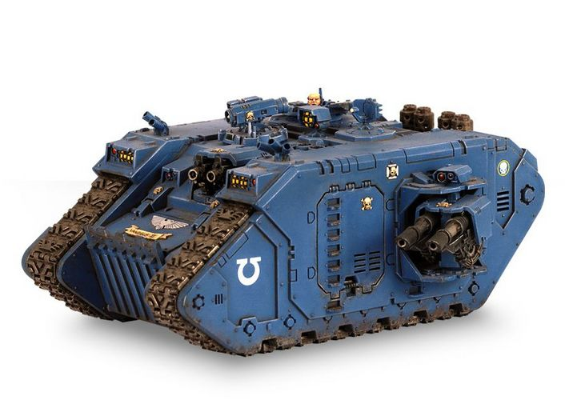
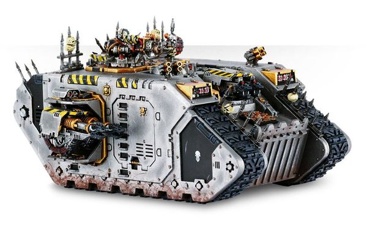
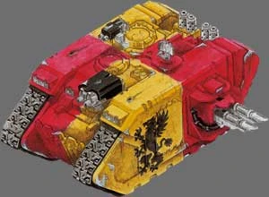
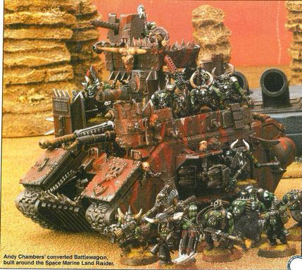
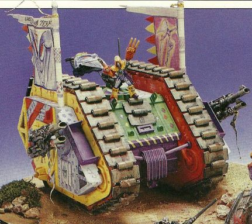

# 1500 兰德掠袭者重型装甲运输车 Land Raider Heavily Armoured Carrier

精校状态：中文行文已逐段精校，部分术语仍为暂定

分类：载具 / 地面 / 重型

原文来源：https://www.bilibili.com/opus/1045553614386364423

原作者：帝国神选罐头

原文时间：编辑于 2026年07月24日 16:14

[返回分类目录](目录.md) · [全书目录](../../目录.md)

<!-- A1500-B0001 -->
**英文原文**

The Land Raider (originally known as Land's Raider) is a heavily armoured personnel carrier and occasional heavy tank used primarily by the Space Marines and Chaos Space Marines, but also by the Adeptus Mechanicus, Inquisition, and even especially influential Rogue Traders. It is capable of operating in virtually any kind of planetary environment. Its hull fully isolates its occupants from the environment and provides life support functions, allowing operation on inhospitable and airless planets from complete vacuum to ocean floors.

<!-- /A1500-B0001 -->

<!-- A1500-B0002 -->

原译文

兰德掠袭者（最初称为陆地突袭者）是一种重型装甲运兵车，偶尔也会用作重型坦克，主要由星际战士和混沌星际战士使用，但也有机械神教、审判庭，甚至特别有影响力的行商浪人使用。它几乎可以在任何类型的行星环境中运行。它的车体将乘客与环境完全隔离，并提供生命支持功能，允许在从完全真空到海底的不适宜居住和无空气的行星上运行。

**校订译文**

兰德掠袭者战车最初称为“兰德的掠袭者”（Land’s Raider），是一种重装甲运兵车，也可充当重型坦克。其主要使用者是星际战士与混沌星际战士，机械修会、审判庭，乃至少数势力特别强大的行商浪人也会使用。它几乎能适应任何行星环境：密闭车体将乘员与外界隔绝，并提供生命维持，从真空到海底都能行动。

**校注：** Land’s 指阿坎·兰德的人名所有格，原译“陆地突袭者”错误；原英文仍按底稿保留。

<!-- /A1500-B0002 -->

<!-- A1500-B0003 图片 -->

<!-- A1500-B0004 -->

原译文

Space Marine Land Raider 星际战士兰德掠袭者

**校订译文**

Space Marine Land Raider 星际战士兰德掠袭者

<!-- /A1500-B0004 -->

<!-- A1500-B0005 -->
**英文原文**

The Land Raider is designed to move at a good speed while still carrying heavy armaments as well as a number of warriors within its armoured hull. It is a Standard Template Construct vehicle, like many others in the armouries of Imperial forces and has been modified several times since its rediscovery. The standard modern pattern of Land Raider however is known as the Land Raider Phobos which provided with none the less standard M32 "Cyclops" class battle cogitator.

<!-- /A1500-B0005 -->

<!-- A1500-B0006 -->

原译文

兰德掠袭者的设计目的是装甲车体以良好的速度移动，同时仍携带重型武器和许多战士。它是一辆标准模板构造载具，就像帝国军队军械库中的许多其他载具一样，自重新发现以来已经过多次修改。然而，兰德掠袭者的标准现代型号被称为兰德掠袭者火卫一，它配备了同样标准的M32“独眼巨人”级战斗沉思者。

**校订译文**

兰德掠袭者能够携带重武器与一批战士，在装甲保护下以可观速度前进。与帝国军械库中许多载具一样，它源自 STC，重新发现后又经过多次改进。现代标准型号称为福波斯型兰德掠袭者战车，配有同样标准化的 M32“独眼巨人”级战斗沉思者。

<!-- /A1500-B0006 -->

<!-- A1500-B0007 -->
## History 历史

<!-- /A1500-B0007 -->

<!-- A1500-B0008 -->
### Origins 起源

<!-- /A1500-B0008 -->

<!-- A1500-B0009 -->
**英文原文**

The Land Raider has its origins in the Dark Age of Technology, when humankind expanded out of its home system. Its construction method was incorporated into the great STC system, allowing it to be built locally by colonists even if they lacked any great technical knowledge. With the widespread breakdown of human civilization during the Age of Strife, production of the vehicle was ceased.

<!-- /A1500-B0009 -->

<!-- A1500-B0010 -->

原译文

兰德掠袭者起源于黑暗技术时代，当时人类从其家园系统向外扩张。它的制造方法被纳入了伟大的STC系统，即使殖民者缺乏任何伟大的技术知识，他们也可以在当地制造它。随着纷争时代人类文明的广泛崩溃，该车的生产停止了。

**校订译文**

兰德掠袭者起源于科技黑暗时代，当时人类正走出母星系，向外扩张。其制造方法被收入 STC 系统，让缺乏高深技术知识的殖民者也能就地生产。纷争时代，人类文明大范围崩溃，该型也随之停产。

<!-- /A1500-B0010 -->

<!-- A1500-B0011 图片 -->

<!-- A1500-B0012 -->

原译文

Space Marine Land Raider 星际战士兰德掠袭者

**校订译文**

Space Marine Land Raider 星际战士兰德掠袭者

<!-- /A1500-B0012 -->

<!-- A1500-B0013 -->
**英文原文**

During the Great Crusade the Land Raider STC design was rediscovered, allowing their manufacture once more. The discoverer is commonly believed to be the Techno-archaeologist Magos Arkhan Land who, at the very birth of the Imperium, is said to have rediscovered the STC designs hidden beneath the surface of Mars. These vehicles were incorporated into the arsenals of the Imperium's forces, used by both the Space Marine Legions and the Imperial Army. Such was the demand for the Land Raider that an entire Forge World, Anvilus 9, was devoted entirely to Land Raider production, supplying thousands upon thousands of Land Raiders to the Emperor's holy forces.

<!-- /A1500-B0013 -->

<!-- A1500-B0014 -->

原译文

在大远征期间，兰德掠袭者STC的设计被重新发现，使其得以再次制造。发现者通常被认为是技术考古贤者阿坎·兰德，据说在帝国诞生之初，他重新发现了隐藏在火星表面下的STC设计。这些车辆被纳入帝国军队的军械库，供星际战士和帝国陆军使用。对兰德掠袭者的需求如此之大，以至于整个铸造世界安维鲁斯九号都完全致力于兰德掠袭者生产，为帝皇的神圣部队提供了成千上万的兰德掠袭者。

**校订译文**

大远征期间，兰德掠袭者的 STC 设计被重新发现，生产得以恢复。发现者通常被认为是技术考古贤者阿坎·兰德：据说帝国初创时，他在火星地下找回了这些设计。车辆随后进入帝国各军种装备序列，供星际战士军团和帝国军使用。需求之大，以至于安维鲁斯九号整个铸造世界都专门生产兰德掠袭者，为帝皇大军供应成千上万辆。

<!-- /A1500-B0014 -->

<!-- A1500-B0015 -->
**英文原文**

It is not known, when the first Land Raider was deployed. Some Imperial archaeologists claim that it was first used during the Siege of Delebrion, while others maintain that it was first deployed during the massed tank battles of Calysto Platinum at the start of the Great Crusade.

<!-- /A1500-B0015 -->

<!-- A1500-B0016 -->

原译文

尚不清楚第一辆兰德掠袭者是何时部署的。一些帝国考古学家声称，它最初是在德莱布里翁围城期间使用的，而另一些人则认为，它最早是在大远征开始时卡利斯托铂金的大规模坦克战中部署的。

**校订译文**

首辆兰德掠袭者何时参战尚无定论。部分帝国考古学家认为是在德莱布里翁围城战，另一些则坚持认为，是大远征初期卡利斯托铂金的大规模坦克战。

<!-- /A1500-B0016 -->

<!-- A1500-B0017 -->
**英文原文**

However, at the outset of the Horus Heresy, Anvilus 9 along with other Forge Worlds were seized by the Dark Mechanicum aligned with Horus, while others chose to secede from the Imperium and remain neutral. This would prove to be a terrible blow to the Loyalists as their supply of Land Raiders began to dry up, especially since, in sufficient numbers, Land Raiders can take on and destroy even Titans. With the dark clouds of the rebellion drawing closer to Terra, the Emperor ordered that all Land Raiders still in loyalist service were to be transferred and used exclusively by the Legiones Astartes, who were at the forefront of the fighting. The Emperor was never able to annul the order, and consequently, even after the Heresy, the use of the Land Raider remained exclusive to the Space Marines.

<!-- /A1500-B0017 -->

<!-- A1500-B0018 -->

原译文

然而，在荷鲁斯叛乱开始时，安维鲁斯九号和其他铸造世界被与荷鲁斯结盟的黑暗机械教占领，而其他人则选择脱离帝国并保持中立。这将被证明是对忠诚派的一个可怕打击，因为他们的兰德掠袭者的供应开始枯竭，特别是因为，在足够的数量下，兰德掠袭者甚至可以对抗并摧毁泰坦。随着叛乱的乌云越来越接近泰拉，帝皇下令所有仍在效忠的兰德掠袭者都必须被转移，并仅由处于战斗前沿的阿斯塔特军团士兵使用。帝皇未能够废除这一命令，因此，即使在叛乱之后，兰德掠袭者的使用仍然是星际战士独有的。

**校订译文**

荷鲁斯之乱初期，安维鲁斯九号及其他一些铸造世界被追随荷鲁斯的黑暗机械教夺取，另一些则脱离帝国、保持中立。忠诚派的兰德掠袭者供应因此开始枯竭，遭受沉重打击；毕竟数量充足时，这些战车连泰坦也能击败摧毁。随着叛乱逼近泰拉，帝皇命令将忠诚派仍有的全部兰德掠袭者移交给战斗最前线的阿斯塔特军团专用。帝皇后来未能撤销此令，因此荷鲁斯之乱结束后，这项星际战士专用限制仍保留下来。

**校注：** 源文此处说星际战士专用，开头却列机械修会、审判庭、行商浪人使用者；保留其历史命令与总体使用情况的范围差异。

<!-- /A1500-B0018 -->

<!-- A1500-B0019 -->
### The Land Raider in the 41st millennium 在第四十一千年的兰德掠袭者

<!-- /A1500-B0019 -->

<!-- A1500-B0020 -->
**英文原文**

Land Raiders are used by Space Marines as well as by their counterparts in the Traitor Legions, who have continued to employ the vehicle after their defeat and exile.

<!-- /A1500-B0020 -->

<!-- A1500-B0021 -->

原译文

兰德掠袭者被星际战士以及叛徒军团的同行使用，他们在战败和流亡后继续使用该车辆。

**校订译文**

星际战士仍在使用兰德掠袭者；叛徒军团在战败流亡后，也继续运用随军带走的同类车辆。

<!-- /A1500-B0021 -->

<!-- A1500-B0022 -->
**英文原文**

Since its rediscovery over ten thousand years ago, newly discovered STC information and modifications to the original design have produced different marks and variants. Most of these variants have been recognised by the Priesthood of Mars. Some of these are the Land Raider Crusader, Land Raider Helios, Land Raider Prometheus, Land Raider Ares, Land Raider Redeemer and Land Raider Terminus Ultra.

<!-- /A1500-B0022 -->

<!-- A1500-B0023 -->

原译文

自一万多年前被重新发现以来，新发现的STC信息和对原始设计的修改产生了不同的型号和变体。这些变体中的大多数已被火星祭司所识别。其中一些是兰德掠袭者十字军、兰德掠袭者赫利俄斯、兰德掠袭者普罗米修斯、兰德掠袭者阿瑞斯、兰德掠袭者救赎者和兰德掠袭者终极。

**校订译文**

一万多年来，新发现的 STC 资料与对原设计的改良，催生了多种型号和变体，大多数得到火星祭司阶层认可，包括十字军型、赫利俄斯型、普罗米修斯型、阿瑞斯型、救赎者型与终极型兰德掠袭者战车。

<!-- /A1500-B0023 -->

<!-- A1500-B0024 -->
**英文原文**

According to the organizational guidelines laid down by the Codex Astartes, the Land Raider is only used by the 1st Company of a Space Marine chapter. However, some less orthodox or non-codex chapters are known to use it more widely. The Salamanders chapter uses an altered version of the Codex Astartes with 12 squads in the 1st company instead of 10, increasing the maximum number of Land Raiders available to 12.

<!-- /A1500-B0024 -->

<!-- A1500-B0025 -->

原译文

根据阿斯塔特圣典制定的组织准则，兰德掠袭者仅由星际战士战团的第一连使用。然而，众所周知，一些不太正统或非圣典的战团更广泛地使用它。火蜥蜴战团使用了阿斯塔特圣典的修改版本，第一连有12个小队，而不是10个，将兰德掠袭者的最大数量增加到12个。

**校订译文**

按照本段援引的《阿斯塔特圣典》组织准则，兰德掠袭者仅配属战团第1连。不过，一些不严格遵循圣典或不采用圣典组织的战团，使用范围更广。火蜥蜴采用修订后的圣典编制，第1连设十二支而非十支小队，兰德掠袭者配额上限也相应增加至十二辆。

<!-- /A1500-B0025 -->

<!-- A1500-B0026 -->
**英文原文**

Land Raiders may also be formed into Armoured Spearheads, designed to punch holes through enemy lines and allow penetration into their rear areas.

<!-- /A1500-B0026 -->

<!-- A1500-B0027 -->

原译文

兰德掠袭者也可以组成装甲矛头，旨在穿透敌人的防线，并渗透到他们的后方。

**校订译文**

兰德掠袭者也可组成装甲矛头编队，突破敌军防线，深入其后方。

<!-- /A1500-B0027 -->

<!-- A1500-B0028 -->
## Design 设计

<!-- /A1500-B0028 -->

<!-- A1500-B0029 -->
### Armament 军备

<!-- /A1500-B0029 -->

<!-- A1500-B0030 -->
**英文原文**

The standard Land Raider is armed with a hull-mounted twin-linked heavy bolter and two side sponsons each with twin-linked lascannons. It may also be fitted with a pintle mounted storm bolter. Sponson weapons are controlled through a slaved remote targeting system, and aimed through multi-spectral optic periscopes located around the turret rings.

<!-- /A1500-B0030 -->

<!-- A1500-B0031 -->

原译文

标准的兰德掠袭者配备了一个安装在车体上的双联重型爆矢枪和两个侧舷，每个侧舷都装有双联激光炮。它也可能配备一个安装在枢轴上的风暴爆矢枪。侧舷武器通过一个从属的远程瞄准系统进行控制，并通过位于炮塔环周围的多光谱光学潜望镜进行瞄准。

**校订译文**

标准兰德掠袭者配备车体双联重型爆矢枪，两侧舷台各装一组双联激光炮，还可加装枢轴枪架风暴爆矢枪。侧舷武器由联动遥控瞄准系统操纵，通过安装环周围的多光谱光学潜望镜瞄准。

<!-- /A1500-B0031 -->

<!-- A1500-B0032 图片 -->

<!-- A1500-B0033 -->

原译文

Interior of a standard Land Raider 标准兰德掠袭者的内部

**校订译文**

Interior of a standard Land Raider 标准兰德掠袭者的内部

<!-- /A1500-B0033 -->

<!-- A1500-B0034 -->
**英文原文**

The lascannons are of the 'Godhammer' Kz9.76 design, requiring replacement barrels after 2000 shots. The lascannons are situated in a 180 degree traversable mount, traversing at 80 degrees/second. They can elevate from +42 degrees to -32 degrees.

<!-- /A1500-B0034 -->

<!-- A1500-B0035 -->

原译文

激光炮采用“神锤”Kz9.76设计，需要在2000次射击后更换枪管。激光炮位于一个180度可移动的底座上，以80度/秒的速度移动。它们可以从+42度上升到-32度。

**校订译文**

激光炮采用 Kz9.76“神锤”型，每发射两千次便需更换炮管。炮座水平射界为180°，回转速度每秒80°，俯仰范围为−32°至+42°。

<!-- /A1500-B0035 -->

<!-- A1500-B0036 -->
**英文原文**

The gyro-stabilised 998AV Massada pattern 'Firefury' heavy bolter is situated beneath a ceramite/titanium bonded armour cowling, is fed by an armoured chain fed from an armoured magazine and sits on top of an electric magnetic turntable. It can elevate from from +90 degrees to -3 degrees within the 90 degree forward arc, rising to +33 degrees on all other facings.

<!-- /A1500-B0036 -->

<!-- A1500-B0037 -->

原译文

陀螺稳定的998AV马萨达型“萤火虫”重型爆矢枪位于陶钢/钛结合装甲护罩下方，它由一条从装甲弹匣供弹的装甲链输送弹药，安置在一个电磁转盘顶部。在前方 90 度弧形范围内，它的仰角可在 + 90 度至 - 3 度之间调整，在其他所有方向上，仰角最大可提升至 +33 度。

**校订译文**

998AV马萨达型“炽怒”重型爆矢枪配有陀螺稳定装置，位于陶钢与钛材结合的装甲罩内，装在电磁转台上，由装甲弹仓经装甲供弹链输送弹药。在正前方90°射界内，俯仰范围为−3°至+90°；转向其他方向时，最大仰角为+33°。

**校注：** Firefury 按核心马萨达型“炽怒”，不是Firefly萤火虫。

<!-- /A1500-B0037 -->

<!-- A1500-B0038 -->
**英文原文**

The M33 MkVI auxiliary storm bolter incorporates an autosight, geno-coded firing grips and a 200 round ammunition hopper equipped with all-purpose bolter rounds.

<!-- /A1500-B0038 -->

<!-- A1500-B0039 -->

原译文

M33 MkVI辅助风暴爆矢枪配备了一个自动瞄准、基因编码的射击握把和一个装有通用爆矢枪子弹的200发弹药漏斗。

**校订译文**

M33 MkVI 辅助风暴爆矢枪配有自动瞄准镜、基因编码射击握把，以及装填200发通用爆矢弹的供弹斗。

<!-- /A1500-B0039 -->

<!-- A1500-B0040 -->
### Armour 装甲

<!-- /A1500-B0040 -->

<!-- A1500-B0041 -->
**英文原文**

The Land Raider uses a form of composite armour created by bonding layers in huge, high-pressure cookers, giving it a level of protection incomparable to most other Imperial vehicles. The first, inner armour layer, in addition to structural supports, is constructed of adamantine. The second is a titanium/plasteel composite used to reinforce strategic locations, such as the assault ramp, front glacis and hatch doors. The next is a thermo-plas fibre mesh to absorb and dissipate high-energy laser weapons, followed by the first of two ceramite layers, designed to ablate against extreme heat and melta weapons, finally ending in an outer layer consisting of a non-magnetic codex approved acrylic identification sheet. When combined, this armouring makes the Land Raider virtually immune to heavy artillery like Battle Cannons. The armour is 3.75 inches thick on the front hull, 3.69 inches thick on the side hull and 3.61 inches thick on the rear hull and is reinforced by ceramite bonding studs all over the Land Raider. All in all, the Land Raider's armour is less than a third as thick as those of other armoured vehicles, but offers many times more protection than armour made out of most any other material used by the Imperium or its enemies.

<!-- /A1500-B0041 -->

<!-- A1500-B0042 -->

原译文

兰德掠袭者使用了一种复合装甲，这种装甲是通过在巨大的高压中粘合而制成的，使其具有大多数其他帝国载具无法比拟的保护水平。第一层，内护面层，除了结构支撑外，还由精金构成。第二种是钛/塑钢复合材料，用于加固战略位置，如突击坡道、前斜坡和舱门。下一层是热塑性纤维网，用于吸收和消散高能激光武器，然后是两层陶钢层中的第一层，旨在抵御极端高温和热熔武器，最终外层为经圣典认可的非磁性亚克力标识薄片。当组合在一起时，这种装甲使兰德掠袭者几乎不受战斗加农炮等重型火炮的影响。前装甲的装甲厚度为3.75英寸，侧装甲为3.69英寸，后装甲为3.61英寸，并通过遍布兰德掠袭者的陶钢键合钉进行加固。总而言之，兰德掠袭者的装甲厚度不到其他装甲车的三分之一，但提供的保护比帝国或其敌人使用的大多数其他材料制成的装甲强多倍。

**校订译文**

兰德掠袭者的复合装甲在巨型高压固化设备中将多层材料结合，防护远超多数帝国载具。最内层装甲和结构支撑以精金制造；第二层为钛与塑钢复合材料，加强突击跳板、前倾斜装甲板、舱门等关键部位。其外是吸收并耗散高能激光的热塑纤维网，再外面是两层陶钢中的第一层，用烧蚀方式抵挡极端高温和热熔武器。最外层则是经圣典认可的非磁性丙烯酸标识覆层。组合之后，车辆几乎能无视战斗炮等重型火炮。车体正面厚3.75英寸，侧面3.69英寸，后部3.61英寸，车身各处另有陶钢结合钉加固。按本段所述，这种装甲厚度不及其他装甲载具的三分之一，防护却是帝国及其敌人多数其他装甲材料的数倍。

**校注：** 源文提两层陶钢但只明述第一层，未补造第二层结构；宽泛防护比较按原资料保留。

<!-- /A1500-B0042 -->

<!-- A1500-B0043 -->
**英文原文**

Another defensive mechanism is provided by the MkII 'Tenebris' smoke discharging units, armed with Stygies 'C' pattern smoke grenades.

<!-- /A1500-B0043 -->

<!-- A1500-B0044 -->

原译文

另一种防御机制是MkII“黑暗”烟雾排放装置，配备斯泰吉斯“C”型烟雾弹。

**校订译文**

另一项防御装置是 MkII“特涅布里斯”烟雾发射器，装填斯蒂吉斯C型烟雾榴弹。

<!-- /A1500-B0044 -->

<!-- A1500-B0045 -->
### Mobility 机动性

<!-- /A1500-B0045 -->

<!-- A1500-B0046 -->
### Engine 引擎

<!-- /A1500-B0046 -->

<!-- A1500-B0047 -->
**英文原文**

Power for the Land Raider is provided for by a Mars pattern adaptable thermic combustor reaction engine, situated in the rear of the vehicle. It is kept cool by a nitro-ammonium cooling system, and protected from malfunction and Daemonic possession by Adeptus Mechanicus manufacturing sigils and purity seals. The engine provides power for all of the Land Raider's systems and can propel it up to an on-road speed of 55km/h. It can be adapted to run on almost fuel type, including a variety of gases, fossil fuels, liquids and even vegetative matter. The engine outputs 3000 bhp and allows an operational range of 387 miles in reactor only mode, while in dual fuel reactor operation mode this range is extended to 1200 miles.

<!-- /A1500-B0047 -->

<!-- A1500-B0048 -->

原译文

兰德掠袭者的动力由位于车辆后部的火星型适应性热燃烧反应发动机提供。它由硝基铵冷却系统保持冷却，并由机械神教制造标志和纯洁印记保护，防止故障和恶魔占有。该发动机为兰德掠袭者的所有系统提供动力，并可将其推进至55公里/小时的公路速度。它可以适应几乎所有燃料类型的运行，包括各种气体、化石燃料、液体甚至植物物质。发动机输出3000马力，在仅反应堆模式下允许387英里的运行范围，而在双燃料反应堆运行模式下，该范围扩展到1200英里。

**校订译文**

车尾的火星型自适应热燃烧反应引擎为兰德掠袭者提供动力。硝基铵冷却系统为其散热，机械修会制造符印与纯洁印记则被用于防止故障和恶魔附身。引擎驱动全车系统，最高公路速度55公里/小时，经调整后几乎能燃用任何燃料，包括各种气体、化石燃料、液体乃至植物材料。输出为3000制动马力，单独使用反应堆时续航387英里；双燃料反应堆模式下可增至1200英里。

<!-- /A1500-B0048 -->

<!-- A1500-B0049 -->
### Suspension 悬架

<!-- /A1500-B0049 -->

<!-- A1500-B0050 -->
**英文原文**

The Land Raider has a ground clearance of 1 foot 5 inches by use of hydro-compressive suspension units, has a maximum gradient climb of 65% and exerts a pressure of 15.5 psi upon the ground. Furthermore, it is capable of crossing a trench up to 18 feet wide and can overcome vertical obstacles up to 6 feet 2 inches in height. Finally, the Land Raider is fully submersible to around 36.57 meters.

<!-- /A1500-B0050 -->

<!-- A1500-B0051 -->

原译文

兰德掠袭者采用液压压缩悬架装置，离地间隙为1英尺5英寸，最大坡度爬升率为65%，对地面施加15.5磅/平方英寸的压力。此外，它能够穿越宽达18英尺的沟渠，并能克服高达6英尺2英寸的垂直障碍。最后，兰德掠袭者可以全潜36.57米左右。

**校订译文**

液压压缩悬挂使兰德掠袭者离地1英尺5英寸，最大爬坡度65%，接地压强15.5磅/平方英寸。它可跨越18英尺宽的壕沟、翻越6英尺2英寸高的垂直障碍，并能完全潜入约36.57米深的水下行动。

<!-- /A1500-B0051 -->

<!-- A1500-B0052 -->
### Equipment 装备

原题：Equipment 设备

<!-- /A1500-B0052 -->

<!-- A1500-B0053 -->
### Machine Spirit 机魂

<!-- /A1500-B0053 -->

<!-- A1500-B0054 -->
**英文原文**

Every Land Raider is equipped with automatic control systems known as a Machine Spirit. The Machine Spirit assists the crew in operating the tank and, in extreme circumstances, can operate the vehicle all on its own. It is a M32 'Cyclops' class Machine Spirit, operating at a cogitation speed of 30,000 co/second and featuring a maximum contemplation capacity of 3000 kilobrains. The Cyclops features alembic shielding, aetheric stabiliser rod caps, a pseudo-synaptic relay and is fed by phlogiston and etheric feed coils. Data input is provided by an external sensory interface cortex and the 'Redeye' external monitor, while outputting through an external hailing speaker.

<!-- /A1500-B0054 -->

<!-- A1500-B0055 -->

原译文

每辆兰德掠袭者都配备了被称为机魂的自动控制系统。机魂协助机组人员操作坦克，在极端情况下，可以自己操作车辆。它是M32“独眼巨人”级机魂，以30000秒的思考速度运行，最大思考能力为3000千脑。独眼巨人具有净化护盾、以太稳定杆帽、伪突触中继，由燃素和以太输送线圈供电。数据输入由外部感受接口皮层和“红眼”外部监视器提供，同时通过外置喊话扬声器进行输出。

**校订译文**

每辆兰德掠袭者都配有被称为“机魂”的自动控制系统，辅助车组操纵坦克，极端情况下还能独立驾驶整车。其 M32“独眼巨人”级机魂的思考速度为每秒30,000 co，最大思考容量为3000千脑。它配有炼金式屏蔽、以太稳定杆端帽和类突触中继，由燃素与以太供给线圈供能。外部感官接口皮层和“红眼”外置监视器输入数据，外部喊话扬声器输出信息。

**校注：** 恢复速度单位co/second；原译“30000秒”漏掉每秒运算量。co与kilobrains为原文设定单位，不强行换算现实计算单位。

<!-- /A1500-B0055 -->

<!-- A1500-B0056 -->
**英文原文**

Perhaps the most famous example of this was Rynn's Might which, despite lacking any crew, proceeded to kill an Ork Warboss and his followers before eventually being destroyed.

<!-- /A1500-B0056 -->

<!-- A1500-B0057 -->

原译文

也许最著名的例子是莱恩之力，尽管没有任何乘员，但它继续杀死了一个欧克战争头目和他的追随者，最终被摧毁。

**校订译文**

最著名的例子或许是瑞恩之力号：在没有任何乘员的情况下，它仍自行杀死了一名欧克战争头目及其追随者，最终才被摧毁。

**校注：** Rynn地名沿核心瑞恩，统一车名瑞恩之力号；原稿莱恩之力、莱茵之力作别名。

<!-- /A1500-B0057 -->

<!-- A1500-B0058 -->
**英文原文**

Besides the Machine Spirit, the Land Raider feature triple-redundant banks of analytical engines and communication arrays to facilitate extensive command and control. These even allow deep range strikes behind enemy lines.

<!-- /A1500-B0058 -->

<!-- A1500-B0059 -->

原译文

除了机魂之外，兰德掠袭者还配备了三重保护分析引擎组和通信阵列，以促进广泛的指挥和控制。这些甚至允许在敌后进行远程打击。

**校订译文**

除机魂外，兰德掠袭者还配有三重冗余分析引擎组与通讯阵列，支持广泛的指挥协调，甚至能组织深入敌后的远程打击。

<!-- /A1500-B0059 -->

<!-- A1500-B0060 -->
### Hull Equipment 车体设备

<!-- /A1500-B0060 -->

<!-- A1500-B0061 -->
**英文原文**

The main part of the hull is taken up by the troop compartment, which is accessible from the outside both by the auto-scaling frontal assault ramp as well as by the side-mounted armoured hatches, who are separated from the internal compartment by inner blast doors.

<!-- /A1500-B0061 -->

<!-- A1500-B0062 -->

原译文

车体的主要部分由部队舱占据，从外部可以通过自动伸缩的正面突击坡道以及侧舷的装甲舱门进入，装甲舱门通过内部防爆门与内部舱室隔开。

**校订译文**

车体内部主要是载员舱，可经自动伸缩的前部突击跳板和两侧装甲舱门出入；侧舱门与内部空间之间另有防爆门隔开。

<!-- /A1500-B0062 -->

<!-- A1500-B0063 -->
**英文原文**

The hull also features a secondary, reinforced cupola, which features the auxiliary storm bolter and multi-spectrum optical pick-ups. The secondary cupola is protected by an auto-scaling hatch cover. It also incorporates a systems status display, a narrow band long range communications array, an external umbilical cord and can traverse by usage of an electro-magnetic traverse ring.

<!-- /A1500-B0063 -->

<!-- A1500-B0064 -->

原译文

车体还配备了一个辅助强化炮塔，该炮塔配备了辅助风暴爆矢枪和多光谱光学传感器。辅助炮塔由自动伸缩舱口盖保护。它还集成了一个系统状态显示器、一个窄带远程通信阵列、一根外部连接缆线，并且能够通过一个电磁回转环实现转动。

**校订译文**

车体还设有加固的辅助指挥塔，装有辅助风暴爆矢枪和多光谱光学采集器，由自动伸缩舱盖保护。它配备系统状态显示器、窄带远程通讯阵列与外接脐带式缆线，并通过电磁回转环转动。

<!-- /A1500-B0064 -->

<!-- A1500-B0065 -->
**英文原文**

Besides the secondary cupola, the Land Raider has an auxiliary external mounting, which can mount a 'Nightwatch' class auto-surveyor, which incorporates an armoured dish.

<!-- /A1500-B0065 -->

<!-- A1500-B0066 -->

原译文

除了辅助炮塔外，兰德掠袭者还有一个辅助的外部设备，可以安装一个“守夜人”级自动测量仪，其中包含一个装甲盘。

**校订译文**

除辅助指挥塔外，兰德掠袭者还设有外部辅助安装座，可装配带装甲碟形天线的“守夜人”级自动探测仪。

<!-- /A1500-B0066 -->

<!-- A1500-B0067 -->
### Other Equipment 其他设备

<!-- /A1500-B0067 -->

<!-- A1500-B0068 -->
**英文原文**

The Land Raider is hermetically sealed, allowing it to operate in outer space, at the bottom of an ocean and any other unusual environment. It also includes atmospheric sampling equipment, an air filtration and purification unit, and rad-counters for operation in hazardous environments. Each Land Raider also contains significant command and control equipment. The commander is able to monitor his unit's bio-status and other information through Individual squad status screens, using information transmitted by their power armour through the vehicle's communications dish. The commander also has access to a holographic tactical display and can directly interface with the Machine Spirit.

<!-- /A1500-B0068 -->

<!-- A1500-B0069 -->

原译文

兰德掠袭者是密封的，使其能够在外太空、海底和任何其他不寻常的环境中运行。它还包括大气采样设备、空气过滤和净化装置以及用于在危险环境中运行的放射性计数器。每辆兰德掠袭者还包含重要的指挥和控制设备。指挥官能够通过个人小队状态屏幕监控其部队的生物状态和其他信息，使用其动力盔甲通过车辆通信盘传输信息。指挥官还可以使用全息战术显示器，并可以直接与机魂进行交互。

**校订译文**

兰德掠袭者完全密闭，可以在太空、海底和其他特殊环境中行动。大气采样设备、空气过滤净化装置及辐射计数器，使其能适应危险环境。车内还配备完善的指挥控制设施：动力甲经车载碟形通讯天线传来数据，车长可在各小队状态屏幕上查看成员生命体征等信息，也可使用全息战术显示器，并直接与机魂对接。

<!-- /A1500-B0069 -->

<!-- A1500-B0070 图片 -->

<!-- A1500-B0071 -->

原译文

Ultramarines Land Raider 极限战士兰德掠袭者

**校订译文**

Ultramarines Land Raider 极限战士兰德掠袭者

<!-- /A1500-B0071 -->

<!-- A1500-B0072 -->
**英文原文**

The station of the Land Raider's commander is equipped with a systems status display, an omni-directional geno-coded control column and a multi-function auger. The commander itself is seated in a morphic seat, directly connecting via a spinal implant interface and umbilical pick-ups to the tank.

<!-- /A1500-B0072 -->

<!-- A1500-B0073 -->

原译文

兰德掠袭者指挥官的工作站配备了系统状态显示器、全向基因编码控制柱和多功能螺旋钻。指挥官本身坐在一个变形座椅上，通过脊柱植入接口和中央传感器直接连接到坦克。

**校订译文**

车长岗位设有系统状态显示器、全向基因编码操纵杆和多功能探测仪。车长坐在自适应座椅中，通过脊柱植入接口与脐带式接驳装置直接连接坦克。

**校注：** auger在载具传感语境为探测仪，原译螺旋钻错误。

<!-- /A1500-B0073 -->

<!-- A1500-B0074 -->
**英文原文**

The commander also has access to a traversable reinforced cupola on top of the Land Raider, fitted with an auto-sealing hatch and incorporating multi-spectral optical pickups and a wide-band local communications array.

<!-- /A1500-B0074 -->

<!-- A1500-B0075 -->

原译文

指挥官还可以使用兰德掠袭者顶部的可移动加固圆顶，该圆顶配有自动密封舱口，并集成了多光谱光学传感器和宽带本地通信阵列。

**校订译文**

车长还可进入车顶可旋转的加固指挥塔，那里装有自动密封舱口、多光谱光学采集器和宽带近程通讯阵列。

<!-- /A1500-B0075 -->

<!-- A1500-B0076 -->
**英文原文**

For security purposes, all controls are gene-coded to prevent their unauthorized use by the enemy. The Land Raider also possesses an auto-tarot reader, 2 megawatt quarz/halogen headlight units, medical facilities and a shrine dedicated to spiritual purity.

<!-- /A1500-B0076 -->

<!-- A1500-B0077 -->

原译文

出于安全目的，所有控件都经过基因编码，以防止敌人未经授权使用。兰德掠袭者还拥有一个自动塔罗阅读器、2兆瓦的石英/卤素前照灯装置、医疗设施和一个致力于精神纯洁的神龛。

**校订译文**

为防敌人擅用，所有控制装置都以基因编码锁定。车内还设有自动塔罗解读器、2兆瓦石英／卤素前照灯、医疗设施，以及用于保持心灵纯洁的神龛。

<!-- /A1500-B0077 -->

<!-- A1500-B0078 -->
**英文原文**

Other standard equipment includes a Searchlight and Smoke Launchers. Additional upgrades include Dozer Blades, Extra Armour, a Hunter-killer Missile, and a Multi-Melta. The Hunter-Killer Missile is an MKVIII 'Avenger' pattern.

<!-- /A1500-B0078 -->

<!-- A1500-B0079 -->

原译文

其他标准设备包括探照灯和烟雾发射器。其他升级包括推土机铲刀、额外装甲、猎杀飞弹和多管热熔。猎杀飞弹是MKVIII“复仇者”型号。

**校订译文**

标准装备还包括探照灯和烟雾发射器，可选升级为推土铲、附加装甲、猎杀导弹与多管热熔。猎杀导弹采用 MkVIII“复仇者”型。

<!-- /A1500-B0079 -->

<!-- A1500-B0080 -->
**英文原文**

Also the distinctive feature common to many patterns of Land Raider is the consecrated 'aquila' track links. The twelve consecutive track links standing for the twelve High Lords of the Imperium and the thirteenth bears the double-headed eagle symbol, that represents the Emperor himself. So during the campaigns of the Space Marines a planet's surface is repeatedly stamped with the authority of the Emperor as if he himself marched there. The track links are made from a cast pseudo-titanium alloy.

<!-- /A1500-B0080 -->

<!-- A1500-B0081 -->

原译文

此外，许多型号的兰德掠袭者都有一个显著特征，即神圣的 “天鹰” 履带链节。连续的 12 个履带链节代表着帝国的 12 位高领主，而第 13 个链节则带有双头鹰标志，这代表着帝皇本人。因此，在星际战士的战争中，行星表面反复印刻着帝皇的权威，仿佛帝皇亲自在那里行军。这些履带链节由一种铸造的伪钛制成。

**校订译文**

许多兰德掠袭者采用经祝圣的“天鹰”履带链节。连续十二节象征帝国十二位高领主，第十三节刻有双头鹰，代表帝皇本人。因此，战车随星际战士征战时，便在行星表面不断压印帝皇的权威，仿佛他亲自行军于此。履带链节以类钛合金铸造。

<!-- /A1500-B0081 -->

<!-- A1500-B0082 -->
### Transportation 运输

<!-- /A1500-B0082 -->

<!-- A1500-B0083 -->
**英文原文**

The Land Raider has an impressive carrying capacity, either 10 Space Marines in Power Armour or 5 in Terminator Armour. Since it is hermetically sealed, the Land Raider has no fire ports for the embarked troops to use. The Space Marines can exit from three access points, two hatches located on both sides of the vehicle or a special front assault ramp for disembarking troops straight into combat. On Deathworlds and other harsh environments the Land Raider allows Space Marines to recharge their environmental and energy systems, extending their operational range.

<!-- /A1500-B0083 -->

<!-- A1500-B0084 -->

原译文

兰德掠袭者的载重量令人印象深刻，10名穿着动力盔甲，5名穿着终结者盔甲的星际战士。由于它是密封的，兰德掠袭者没有供跳帮部队使用的开火口。星际战士可以从三个入口、位于车辆两侧的两个舱口或一个特殊的前部突击坡道出入，以便直接将部队送入战场。在死亡世界和其他恶劣环境中，兰德掠袭者允许星际战士为其环境和能源系统充电，从而扩大其作战范围。

**校订译文**

兰德掠袭者可搭载十名动力甲星际战士，或五名终结者装甲战士。由于车体完全密闭，没有供搭载部队使用的射击孔。人员可经两侧舱门或前部专用突击跳板这三处出入口下车，直接投入战斗。在死亡世界等恶劣环境中，星际战士还可在车内补充环境维持系统与能源系统的消耗，延长行动范围。

**校注：** 载员量是十名动力甲或五名终结者二选一，原译漏或；embarked为搭载，不是跳帮。

<!-- /A1500-B0084 -->

<!-- A1500-B0085 -->
## Technical Information 技术资料

原题：Technical Information 技术信息

<!-- /A1500-B0085 -->

<!-- A1500-B0086 -->
**英文原文**

Vehicle Name:Land Raider Phobos

<!-- /A1500-B0086 -->

<!-- A1500-B0087 -->

原译文

载具名称：兰德掠袭者火卫一

**校订译文**

载具名称：福波斯型兰德掠袭者战车

<!-- /A1500-B0087 -->

<!-- A1500-B0088 -->
**英文原文**

Forge World of Origin:Mars

<!-- /A1500-B0088 -->

<!-- A1500-B0089 -->

原译文

起源铸造世界：火星

**校订译文**

起源铸造世界：火星

<!-- /A1500-B0089 -->

<!-- A1500-B0090 -->
**英文原文**

Known Patterns:III-XXVII

<!-- /A1500-B0090 -->

<!-- A1500-B0091 -->

原译文

已知型号：III - XXVII

**校订译文**

已知型号：III - XXVII

<!-- /A1500-B0091 -->

<!-- A1500-B0092 -->
**英文原文**

Crew:Driver, Commander

<!-- /A1500-B0092 -->

<!-- A1500-B0093 -->

原译文

乘员：驾驶机、指挥官

**校订译文**

乘员：驾驶员、车长

<!-- /A1500-B0093 -->

<!-- A1500-B0094 -->
**英文原文**

Powerplant:Adaptable Thermic Combustion w/ Auxillary Reactor

<!-- /A1500-B0094 -->

<!-- A1500-B0095 -->

原译文

动力装置：配备辅助反应堆的自适应热燃烧装置

**校订译文**

动力装置：配备辅助反应堆的自适应热燃烧装置

<!-- /A1500-B0095 -->

<!-- A1500-B0096 -->
**英文原文**

Weight:72.0 tonnes

<!-- /A1500-B0096 -->

<!-- A1500-B0097 -->

原译文

重量：72.0吨

**校订译文**

重量：72.0吨

<!-- /A1500-B0097 -->

<!-- A1500-B0098 -->
**英文原文**

Length:10.3m

<!-- /A1500-B0098 -->

<!-- A1500-B0099 -->

原译文

长度：10.3米

**校订译文**

长度：10.3米

<!-- /A1500-B0099 -->

<!-- A1500-B0100 -->
**英文原文**

Width:6.1m

<!-- /A1500-B0100 -->

<!-- A1500-B0101 -->

原译文

宽度：6.1米

**校订译文**

宽度：6.1米

<!-- /A1500-B0101 -->

<!-- A1500-B0102 -->
**英文原文**

Height:4.11m

<!-- /A1500-B0102 -->

<!-- A1500-B0103 -->

原译文

高度：4.11米

**校订译文**

高度：4.11米

<!-- /A1500-B0103 -->

<!-- A1500-B0104 -->
**英文原文**

Ground Clearance:0.45m

<!-- /A1500-B0104 -->

<!-- A1500-B0105 -->

原译文

离地间隙：0.45m

**校订译文**

离地间隙：0.45米

<!-- /A1500-B0105 -->

<!-- A1500-B0106 -->
**英文原文**

Fording Depth:{{{Fording Depth}}}

<!-- /A1500-B0106 -->

<!-- A1500-B0107 -->

原译文

涉水深度：｛{{涉水深度}}｝

**校订译文**

涉水深度：未提供

**校注：** 源文只有涉水深度模板，正文另有潜航深度，二者不擅自互填。

<!-- /A1500-B0107 -->

<!-- A1500-B0108 -->
**英文原文**

Max Speed - on road55kph

<!-- /A1500-B0108 -->

<!-- A1500-B0109 -->

原译文

最大速度 - 公路：55公里/小时

**校订译文**

最大公路速度：55公里/小时

<!-- /A1500-B0109 -->

<!-- A1500-B0110 -->
**英文原文**

Max Speed - off road:48kph

<!-- /A1500-B0110 -->

<!-- A1500-B0111 -->

原译文

最大速度 - 越野：48公里/小时

**校订译文**

最大越野速度：48公里/小时

<!-- /A1500-B0111 -->

<!-- A1500-B0112 -->
**英文原文**

Transport Capacity:10 (5)

<!-- /A1500-B0112 -->

<!-- A1500-B0113 -->

原译文

运输能力：10（5）

**校订译文**

载员能力：10名动力甲战士，或5名终结者

<!-- /A1500-B0113 -->

<!-- A1500-B0114 -->
**英文原文**

Access Points:3

<!-- /A1500-B0114 -->

<!-- A1500-B0115 -->

原译文

入口：3

**校订译文**

出入口：3处

<!-- /A1500-B0115 -->

<!-- A1500-B0116 -->
**英文原文**

Main Armament:2x Twin-linked Lascannons

<!-- /A1500-B0116 -->

<!-- A1500-B0117 -->

原译文

主武器：2门双联激光炮

**校订译文**

主武器：2组双联激光炮

<!-- /A1500-B0117 -->

<!-- A1500-B0118 -->
**英文原文**

Secondary Armament:Twin-linked Heavy Bolter

<!-- /A1500-B0118 -->

<!-- A1500-B0119 -->

原译文

二级武器：双联重型爆矢枪

**校订译文**

副武器：双联重型爆矢枪

<!-- /A1500-B0119 -->

<!-- A1500-B0120 -->
**英文原文**

Traverse:180°

<!-- /A1500-B0120 -->

<!-- A1500-B0121 -->

原译文

横向：180°

**校订译文**

水平射界：180°

<!-- /A1500-B0121 -->

<!-- A1500-B0122 -->
**英文原文**

Elevation:From -32° to +42°

<!-- /A1500-B0122 -->

<!-- A1500-B0123 -->

原译文

仰角：从-32°到+42°

**校订译文**

俯仰角：−32°至+42°

<!-- /A1500-B0123 -->

<!-- A1500-B0124 -->
**英文原文**

Main Ammunition:Unlimited

<!-- /A1500-B0124 -->

<!-- A1500-B0125 -->

原译文

主弹药：无限

**校订译文**

主武器弹药：原表记为无限

<!-- /A1500-B0125 -->

<!-- A1500-B0126 -->
**英文原文**

Secondary Ammunition:2600 rounds

<!-- /A1500-B0126 -->

<!-- A1500-B0127 -->

原译文

二级弹药：2600发Armour 装甲

**校订译文**

副武器载弹量：2600发

Armour 装甲

<!-- /A1500-B0127 -->

<!-- A1500-B0128 -->
**英文原文**

Superstructure:95mm

<!-- /A1500-B0128 -->

<!-- A1500-B0129 -->

原译文

上部结构：95mm

**校订译文**

上部结构：95mm

<!-- /A1500-B0129 -->

<!-- A1500-B0130 -->
**英文原文**

Hull:95mm

<!-- /A1500-B0130 -->

<!-- A1500-B0131 -->

原译文

车体：95mm

**校订译文**

车体：95mm

<!-- /A1500-B0131 -->

<!-- A1500-B0132 -->
**英文原文**

Gun Mantlet:N/A

<!-- /A1500-B0132 -->

<!-- A1500-B0133 -->

原译文

炮盾：无

**校订译文**

炮盾：无

<!-- /A1500-B0133 -->

<!-- A1500-B0134 -->
**英文原文**

Vehicle Designation:0120-766-0724-PR113

<!-- /A1500-B0134 -->

<!-- A1500-B0135 -->

原译文

载具编号：0120-766-0724-PR113

**校订译文**

载具编号：0120-766-0724-PR113

<!-- /A1500-B0135 -->

<!-- A1500-B0136 -->
**英文原文**

Firing Ports:N/A

<!-- /A1500-B0136 -->

<!-- A1500-B0137 -->

原译文

开火口：无

**校订译文**

开火口：无

<!-- /A1500-B0137 -->

<!-- A1500-B0138 -->
**英文原文**

Turret:N/A

<!-- /A1500-B0138 -->

<!-- A1500-B0139 -->

原译文

炮塔：无Besides the standard Land Raider Phobos, many other patterns exist:除了标准的兰德掠袭者火卫一，还有许多其他型号：

**校订译文**

炮塔：不适用

Besides the standard Land Raider Phobos, many other patterns exist:

除标准福波斯型兰德掠袭者外，还存在许多其他型号：

<!-- /A1500-B0139 -->

<!-- A1500-B0140 -->

原译文

Land Raider Achilles 兰德掠袭者阿喀琉斯

**校订译文**

Land Raider Achilles 阿喀琉斯型兰德掠袭者战车

<!-- /A1500-B0140 -->

<!-- A1500-B0141 -->

原译文

Land Raider Anvilarum 兰德掠袭者铁砧

**校订译文**

Land Raider Anvilarum 铁砧型兰德掠袭者战车

<!-- /A1500-B0141 -->

<!-- A1500-B0142 -->

原译文

Land Raider Ares 兰德掠袭者阿瑞斯

**校订译文**

Land Raider Ares 阿瑞斯型兰德掠袭者战车

<!-- /A1500-B0142 -->

<!-- A1500-B0143 -->

原译文

Land Raider Crusader 兰德掠袭者十字军

**校订译文**

Land Raider Crusader 十字军型兰德掠袭者战车

<!-- /A1500-B0143 -->

<!-- A1500-B0144 -->

原译文

Hellfire Land Raider 地狱火兰德掠袭者

**校订译文**

Hellfire Land Raider 地狱火兰德掠袭者

<!-- /A1500-B0144 -->

<!-- A1500-B0145 -->

原译文

Land Raider Helios 兰德掠袭者赫利俄斯

**校订译文**

Land Raider Helios 赫利俄斯型兰德掠袭者战车

<!-- /A1500-B0145 -->

<!-- A1500-B0146 -->

原译文

Land Raider Prometheus 兰德掠袭者普罗米修斯

**校订译文**

Land Raider Prometheus 普罗米修斯型兰德掠袭者战车

<!-- /A1500-B0146 -->

<!-- A1500-B0147 -->

原译文

Land Raider Proteus 兰德掠袭者普罗透斯

**校订译文**

Land Raider Proteus 普罗透斯型兰德掠袭者战车

<!-- /A1500-B0147 -->

<!-- A1500-B0148 -->

原译文

Land Raider Redeemer 兰德掠袭者救赎者

**校订译文**

Land Raider Redeemer 救赎者型兰德掠袭者战车

<!-- /A1500-B0148 -->

<!-- A1500-B0149 -->

原译文

Land Raider Spartan 兰德掠袭者斯巴达

**校订译文**

Land Raider Spartan 斯巴达型兰德掠袭者战车

<!-- /A1500-B0149 -->

<!-- A1500-B0150 -->
**英文原文**

Land Raider Tartarus - noted as a basic pattern for the Land Raider Prometheus

<!-- /A1500-B0150 -->

<!-- A1500-B0151 -->

原译文

兰德掠袭者塔尔塔罗斯 - 被认为是兰德掠袭者普罗米修斯的基本型号

**校订译文**

塔尔塔罗斯型兰德掠袭者——据称是普罗米修斯型的基础型号。

<!-- /A1500-B0151 -->

<!-- A1500-B0152 -->

原译文

Land Raider Terminus Ultra 兰德掠袭者极限

**校订译文**

Land Raider Terminus Ultra 终极型兰德掠袭者战车

<!-- /A1500-B0152 -->

<!-- A1500-B0153 -->

原译文

Land Raider Wrath of Mjalnar 兰德掠袭者妙尔尼尔之怒

**校订译文**

Land Raider Wrath of Mjalnar 米亚尔纳之怒型兰德掠袭者

<!-- /A1500-B0153 -->

<!-- A1500-B0154 -->

原译文

Land Raider Solemnus Aggressor 兰德掠袭者庄严侵略者

**校订译文**

Land Raider Solemnus Aggressor 兰德掠袭者庄严侵略者

<!-- /A1500-B0154 -->

<!-- A1500-B0155 -->

原译文

Land Raider Angel Infernus 兰德掠袭者炼狱天使

**校订译文**

Land Raider Angel Infernus 炼狱天使型兰德掠袭者战车

<!-- /A1500-B0155 -->

<!-- A1500-B0156 -->

原译文

Land Raider Hades Diabolus 兰德掠袭者冥府魔鬼

**校订译文**

Land Raider Hades Diabolus 兰德掠袭者冥府魔鬼

<!-- /A1500-B0156 -->

<!-- A1500-B0157 -->

原译文

Land Raider Excelsior 兰德掠袭者精毅

**校订译文**

Land Raider Excelsior 兰德掠袭者精毅

<!-- /A1500-B0157 -->

<!-- A1500-B0158 -->

原译文

Grey Knights Land Raider 灰骑士兰德掠袭者

**校订译文**

Grey Knights Land Raider 灰骑士兰德掠袭者

<!-- /A1500-B0158 -->

<!-- A1500-B0159 -->

原译文

Deathwing Land Raider 死亡守望兰德掠袭者

**校订译文**

Deathwing Land Raider 死翼兰德掠袭者

**校注：** Deathwing是死翼，原译死亡守望混淆了Deathwatch。

<!-- /A1500-B0159 -->

<!-- A1500-B0160 -->

原译文

Venerable Land Raider 神圣兰德掠袭者

**校订译文**

Venerable Land Raider 神圣兰德掠袭者坦克

<!-- /A1500-B0160 -->

<!-- A1500-B0161 -->

原译文

Grav-Raider 反重力掠袭者

**校订译文**

Grav-Raider 反重力掠袭者

<!-- /A1500-B0161 -->

<!-- A1500-B0162 -->

原译文

Repulsor 反击者坦克

**校订译文**

Repulsor 反重力战车

<!-- /A1500-B0162 -->

<!-- A1500-B0163 -->
**英文原文**

MkI - Derived from the original agricultural tractor STC, this version is cramped, slow and under armed when compared to later models. It was quickly replaced by Rhinos and Predators prior to the adoption of the MkII models. Several variants exist, through none saw widespread service. Some models may still exceptionally be found in the arsenals of some Planetary Governors. The Orks are known to have thousands of MkIs, but they have been so modified by the Xenos that the vehicles are now unrecognizable. It has also been speculated that the Eldar surprisingly possess a few MkIs as well, though they are used in their original role as civilian agricultural vehicles.

<!-- /A1500-B0163 -->

<!-- A1500-B0164 -->

原译文

MkI - 源自最初的农用拖拉机STC，与后来的型号相比，这个版本显得狭窄、缓慢且武装不足。在采用MkII型号之前，它很快被犀牛装甲车和掠食者坦克所取代。存在几种变体，但没有一种得到广泛使用。在一些行星总督的军械库中，可能仍然可以例外地找到一些模型。众所周知，欧克拥有数千辆MkI，但它们已经被异型改装得面目全非。也有人猜测，埃尔达令人惊讶地拥有一些MkI，尽管它们最初是作为民用农用车辆使用的。

**校订译文**

MkI——源自最早的农用拖拉机 STC，相比后继型号，内部狭窄、速度缓慢、武装不足。在 MkII 列装之前，它便迅速被犀牛和掠食者取代。其变体虽有多种，却都未广泛服役。少数行星总督的军械库可能仍留有个别机体。已知欧克拥有数千辆 MkI，但已改装得面目全非。甚至有人猜测灵族也有少数 MkI，只是将其用于原本的民用农业工作。

<!-- /A1500-B0164 -->

<!-- A1500-B0165 -->
**英文原文**

MkII - Considerably improved, this version sported twice the firepower and improved speed due to a more powerful power plant. This is the most common model still in use with the Traitor Legions.

<!-- /A1500-B0165 -->

<!-- A1500-B0166 -->

原译文

MkII - 由于动力装置更强大，该版本的火力增加了一倍，速度也提高了一倍。这是叛徒军团仍在使用的最常见的型号。

**校订译文**

MkII——大幅改进的型号，火力翻倍，并因动力装置增强而提高速度。这是叛徒军团最常见的现役型号。

**校注：** 原文仅说速度提高，未说翻倍；火力翻倍保留。

<!-- /A1500-B0166 -->

<!-- A1500-B0167 -->
**英文原文**

MkIIb - With the side gun sponsons placed in front of the side hatch.

<!-- /A1500-B0167 -->

<!-- A1500-B0168 -->

原译文

MkIIb - 侧舱门前装有侧枪支架。

**校订译文**

MkIIb——侧舷武器舱位于侧舱门前方。

<!-- /A1500-B0168 -->

<!-- A1500-B0169 -->
**英文原文**

MkIIc - Command variant containing specialized communication and devotional equipment, usually converted in the field from the best Land Raiders in the company.

<!-- /A1500-B0169 -->

<!-- A1500-B0170 -->

原译文

MkIIc - 指挥变体，包含专门的通信和祈祷设备，通常在战场上由连队最好的兰德掠袭者改装而成。

**校订译文**

MkIIc - 指挥变体，包含专门的通信和祈祷设备，通常在战场上由连队最好的兰德掠袭者改装而成。

<!-- /A1500-B0170 -->

<!-- A1500-B0171 -->

原译文

MkII Spartan MkII斯巴达

**校订译文**

MkII Spartan MkII斯巴达

<!-- /A1500-B0171 -->

<!-- A1500-B0172 -->
**英文原文**

MkIII - Using the lessons learned from the Spartan, this version featured vastly improved lascannons and thicker armor, as well as a redesigned troop compartment better suited for Terminators. The increase in weight and size resulted in a slight reduction in speed.

<!-- /A1500-B0172 -->

<!-- A1500-B0173 -->

原译文

MkIII - 借鉴斯巴达的经验，该版本大幅改进了激光炮和更厚的装甲，并重新设计了更适合终结者的部队间。重量和尺寸的增加导致速度略有下降。

**校订译文**

MkIII——吸收斯巴达经验，大幅改进激光炮、增厚装甲，并重新设计载员舱，使之更适合终结者。尺寸和重量增加，令车速略有下降。

<!-- /A1500-B0173 -->

<!-- A1500-B0174 -->
**英文原文**

MkIIIc - Command variant externally identical to the MkIII.

<!-- /A1500-B0174 -->

<!-- A1500-B0175 -->

原译文

MkIIIc - 外部与MkIII相同的指挥变体。

**校订译文**

MkIIIc - 外部与MkIII相同的指挥变体。

<!-- /A1500-B0175 -->

<!-- A1500-B0176 -->
**英文原文**

MkV - With the side gun sponsons placed after the side hatch.

<!-- /A1500-B0176 -->

<!-- A1500-B0177 -->

原译文

MkV - 侧舱门后装有侧枪支架。The Land Raiders in the service of the Traitor Legions are ten thousand year old machines, the same Land Raiders the Legions took with them when they fled into the Eye of Terror following the defeat of their rebellion. In place of the Machine Spirit is a daemonic force which assumes control of the movement of the vehicle in the event the crew are in some way disabled or even dead, as well as assisting in the operation of the weapon systems.为叛徒军团服务的兰德掠袭者是一万年前的机器，与军团在叛乱失败后逃入恐惧之眼时带走的兰德掠袭者相同。代替机魂的是一种恶魔，它以某种方式在机组人员残疾甚至死亡的情况下控制车辆的运动，并协助武器系统的操作。

**校订译文**

MkV——侧舷武器舱位于侧舱门后方。

The Land Raiders in the service of the Traitor Legions are ten thousand year old machines, the same Land Raiders the Legions took with them when they fled into the Eye of Terror following the defeat of their rebellion. In place of the Machine Spirit is a daemonic force which assumes control of the movement of the vehicle in the event the crew are in some way disabled or even dead, as well as assisting in the operation of the weapon systems.

叛徒军团仍在使用的兰德掠袭者已有一万年历史，正是当年叛乱失败、逃入恐惧之眼时带走的机体。车内机魂被恶魔力量取代，既辅助操纵武器，也会在车组失去行动能力甚至死亡时接管车辆行驶。

<!-- /A1500-B0177 -->

<!-- A1500-B0178 图片 -->

<!-- A1500-B0179 -->

原译文

Chaos Space Marine Land Raider 混沌星际战士兰德掠袭者

**校订译文**

Chaos Space Marine Land Raider 混沌星际战士兰德掠袭者

<!-- /A1500-B0179 -->

<!-- A1500-B0180 -->
## Named Land Raiders 著名兰德掠袭者

<!-- /A1500-B0180 -->

<!-- A1500-B0181 -->
**英文原文**

Cestus — Iron Hands.

<!-- /A1500-B0181 -->

<!-- A1500-B0182 -->

原译文

拳斗士 — 钢铁之手

**校订译文**

塞斯图斯号——钢铁之手。

<!-- /A1500-B0182 -->

<!-- A1500-B0183 -->
**英文原文**

Eagle's Claw — Red Talons. Fought with Traitors during the Battle of Amion.

<!-- /A1500-B0183 -->

<!-- A1500-B0184 -->

原译文

鹰爪 — 红爪。在阿米翁之战中与叛徒作战。

**校订译文**

鹰爪号——红爪，在阿米翁之战中对抗叛徒。

<!-- /A1500-B0184 -->

<!-- A1500-B0185 -->
**英文原文**

Ghoulsheim — Sons of Carnage.

<!-- /A1500-B0185 -->

<!-- A1500-B0186 -->

原译文

食尸鬼领域 — 屠杀之子

**校订译文**

食尸鬼领域号——屠杀之子。

<!-- /A1500-B0186 -->

<!-- A1500-B0187 -->
**英文原文**

Maximus — Ultramarines.

<!-- /A1500-B0187 -->

<!-- A1500-B0188 -->

原译文

马克西姆斯 — 极限战士

**校订译文**

马克西姆斯号——极限战士。

<!-- /A1500-B0188 -->

<!-- A1500-B0189 -->
**英文原文**

Metallus Gravus — Iron Hands.

<!-- /A1500-B0189 -->

<!-- A1500-B0190 -->

原译文

沉重金属 — 钢铁之手

**校订译文**

沉重金属号——钢铁之手。

<!-- /A1500-B0190 -->

<!-- A1500-B0191 -->
**英文原文**

Phraetus — Raptors Chapter. Fought in the Origo Blockade.

<!-- /A1500-B0191 -->

<!-- A1500-B0192 -->

原译文

弗雷图斯 — 猛禽战团，在奥里戈封锁区战斗

**校订译文**

弗雷图斯号——猛禽战团，参加过奥里戈封锁战。

<!-- /A1500-B0192 -->

<!-- A1500-B0193 -->
**英文原文**

Rynn's Might — Crimson Fists.

<!-- /A1500-B0193 -->

<!-- A1500-B0194 -->

原译文

莱茵之力 — 绯红之拳

**校订译文**

瑞恩之力号——绯红之拳。

<!-- /A1500-B0194 -->

<!-- A1500-B0195 -->
**英文原文**

Voltar — Space Wolves.

<!-- /A1500-B0195 -->

<!-- A1500-B0196 -->

原译文

伏尔塔 — 太空野狼

**校订译文**

伏尔塔号——太空野狼。

<!-- /A1500-B0196 -->

<!-- A1500-B0197 -->
**英文原文**

Sword of Fire — Howling Griffons Built during and used in Veidt's Schism. Built using lower quality materials due to a blockade.

<!-- /A1500-B0197 -->

<!-- A1500-B0198 -->

原译文

火焰之剑 — 咆哮狮鹫建于维特分裂时期，并在分裂中使用。由于封锁，使用较低质量的材料建造。

**校订译文**

火焰之剑号——咆哮狮鹫，在维德特分裂期间建造并参战。由于封锁，制造时使用了品质较低的材料。

<!-- /A1500-B0198 -->

<!-- A1500-B0199 图片 -->

<!-- A1500-B0200 -->

原译文

Howling Griffons' Sword of Fire 咆哮狮鹫的火焰之剑

**校订译文**

Howling Griffons' Sword of Fire 咆哮狮鹫的火焰之剑号

<!-- /A1500-B0200 -->

<!-- A1500-B0201 -->
## Usage by Xenos 异形使用情况

原题：Usage by Xenos 异型使用

<!-- /A1500-B0201 -->

<!-- A1500-B0202 -->
**英文原文**

Space Marine Chapters are known to make the destruction of any of their vehicles in the hands of Xenos a high priority.

<!-- /A1500-B0202 -->

<!-- A1500-B0203 -->

原译文

众所周知，星际战士战团将摧毁异型手中的任何载具作为首要任务。

**校订译文**

星际战士战团会优先摧毁落入异形手中的本方载具。

**校注：** 优先摧毁的是落入异形手中的战团自有车辆，不是所有异形载具。

<!-- /A1500-B0203 -->

<!-- A1500-B0204 -->
**英文原文**

The Orks are known to convert some Land Raiders into Looted Wagons.

<!-- /A1500-B0204 -->

<!-- A1500-B0205 -->

原译文

众所周知，欧克会将一些兰德掠袭者变成赃车。

**校订译文**

众所周知，欧克会将一些兰德掠袭者变成赃车。

<!-- /A1500-B0205 -->

<!-- A1500-B0206 图片 -->

<!-- A1500-B0207 -->

原译文

Looted Land Raider made Battlewagon 被掠夺的兰德掠袭者制成战斗卡车

**校订译文**

Looted Land Raider made Battlewagon 用缴获的兰德掠袭者改装成的战斗堡垒

<!-- /A1500-B0207 -->

<!-- A1500-B0208 -->
**英文原文**

Harlequins are known to "Acquire" vehicles and robots and turn them against their makers, and have in this way aquired Land Raiders and other vehicles. When they do so, they repaint them in lavish colors and bedeck them in Harlequin banners.

<!-- /A1500-B0208 -->

<!-- A1500-B0209 -->

原译文

众所周知，丑角会“获取”载具和机器人，并将其转而对抗制造者，并通过此方式获得兰德掠袭者和其他载具。当他们这样做时，他们会用奢华的颜色重新粉刷它们，并用丑角旗帜装饰它们。

**校订译文**

丑角会“获取”载具和机兵，转而用来对付制造者。他们曾以这种方式取得兰德掠袭者等车辆，并将其重新涂成绚丽色彩，装饰以丑角旗帜。

<!-- /A1500-B0209 -->

<!-- A1500-B0210 图片 -->

<!-- A1500-B0211 -->

原译文

Harlequin acquired Land Raider 被丑角获取的兰德掠袭者

**校订译文**

Harlequin acquired Land Raider 被丑角获取的兰德掠袭者

<!-- /A1500-B0211 -->

<!-- A1500-B0212 -->
## Trivia 琐事

<!-- /A1500-B0212 -->

<!-- A1500-B0213 -->
**英文原文**

The Land Raider strongly resembles the Mark V, one of the first tanks ever created which were designed and fielded by the British in World War I. A 2nd Edition conversion of a Deathwing Land Raider was even explicitly built on a Mark V model chassis.

<!-- /A1500-B0213 -->

<!-- A1500-B0214 -->

原译文

兰德掠袭者与Mark V非常相似，Mark V是英国在第一次世界大战中设计和部署的首批坦克之一。死翼兰德掠袭者的第二版改装甚至明确地建立在Mark V模型底盘上。

**校订译文**

兰德掠袭者的外形与英国在第一次世界大战中设计并投入使用的早期坦克 Mark V 十分相似。《战锤40,000》第2版时期的一辆死翼兰德掠袭者改装模型，甚至直接采用了 Mark V 模型底盘。

<!-- /A1500-B0214 -->

<!-- A1500-B0215 -->
**英文原文**

The standard Land Raider (Phobos) armed with Twin-linked Lascannons and Heavy Bolters is sometimes referred to as the Land Raider Godhammer. It is so named for the Lascannons it mounts, which are known as the Godhammer pattern. This name is used mostly on online forums. In-universe, it is never referred to as such.

<!-- /A1500-B0215 -->

<!-- A1500-B0216 -->

原译文

配备双联激光炮和重型爆矢枪的标准兰德掠袭者（火卫一）有时被称为兰德掠袭者神锤。它因其安装的激光炮而得名，这些激光炮被称为神锤型。这个名字主要在在线论坛上使用。在宇宙中，它从来没有被这样称呼过。

**校订译文**

配备双联激光炮和重型爆矢枪的标准福波斯型，有时被称为“神锤兰德掠袭者”，名称源于它搭载的神锤型激光炮。按本稿说明，这主要是网络论坛用语，设定内并未如此称呼。

<!-- /A1500-B0216 -->

本篇核心术语与暂定项

以下列出本篇出现的英文原形及核心术语表用词。同形词可能指不同对象，具体词义以本篇正文和校注为准；单复数、别名和仅见于图注的名称可能尚未列入。完整候选见[术语表](../../术语表/双语术语候选.csv)。

| 英文 | 采用中文 | 状态 |
| --- | --- | --- |
| Space Marines | 星际战士 | 官方已核对 |
| Space Wolves | 太空野狼 | 官方已核对 |
| Adeptus Mechanicus | 机械修会 | 官方已核对 |
| Imperial Army | 帝国军 | 暂定·官方待核 |
| Chaos Space Marines | 混沌星际战士 | 官方已核对 |
| Eldar | 灵族 | 暂定·语境区分 |
| Orks | 欧克蛮人 | 官方已核对 |
| Terminator | 终结者 | 官方已核对 |
| Ultramarines | 极限战士 | 官方已核对 |
| Horus Heresy | 荷鲁斯之乱 | 官方已核对 |
| Inquisition | 审判庭 | 暂定 |
| Imperium | 帝国 | 暂定·简称 |
| Mechanicum | 机械教 | 暂定·历史称谓 |
| Dark Mechanicum | 黑暗机械教 | 暂定·官方待核 |
| Dark Age of Technology | 黑暗科技时代 | 暂定 |
| Harlequin | 丑角 | 暂定 |
| Equipment | 装备 | 编辑用语已统一 |
| Emperor | 帝皇 | 官方已核对 |
| Forge World | 铸造世界 | 暂定·官方待核 |
| The Order | 秩序 | 暂定·官方待核 |
| Great Crusade | 大远征 | 暂定·官方待核 |
| Age of Strife | 纷争时代 | 暂定·官方待核 |
| Terra | 泰拉 | 暂定·官方待核 |
| Horus | 荷鲁斯 | 暂定·官方待核 |
| STC | 标准建造模板 | 暂定·官方待核 |
| Iron Hands | 钢铁之手 | 暂定·官方待核 |
| Hunter-Killer | 猎杀者 | 暂定·官方待核 |
| Legiones Astartes | 阿斯塔特军团 | 暂定·官方待核 |
| Redeemer | 救赎者 | 暂定·官方待核 |
| Salamanders | 火蜥蜴 | 暂定·官方待核 |
| Mars | 火星 | 暂定·官方待核 |
| Phobos | 火卫一 | 暂定·官方待核 |
| Land Raider | 兰德掠袭者战车 | 官方已核对 |
| Aquila | 天鹰 | 暂定·官方待核 |
| Standard Template Construct | 标准模板构造 | 暂定·官方待核 |
| Arkhan Land | 阿坎·兰德 | 暂定·官方待核 |
| Crimson Fists | 绯红之拳 | 暂定·官方待核 |
| Power Armour | 动力盔甲 | 暂定·官方待核 |
| Space Marine | 星际战士 | 暂定·官方待核 |
| Chapter | 战团 | 暂定·官方待核 |
| Terminators | 终结者 | 暂定·官方待核 |
| Codex Astartes | 阿斯塔特圣典 | 暂定·官方待核 |
| Red Talons | 红爪 | 暂定·官方待核 |
| Raptors | 猛禽 | 暂定·官方待核 |
| Rhinos | 犀牛 | 暂定·官方待核 |
| Predators | 掠食者 | 暂定·官方待核 |
| Land Raiders | 兰德掠袭者 | 暂定·官方待核 |
| Howling Griffons | 咆哮狮鹫 | 暂定·官方待核 |
| Monitor | 监视者 | 暂定·官方待核 |
| Land Raider Helios | 赫利俄斯型兰德掠袭者战车 | 暂定·官方待核 |
| Land Raider Phobos | 福波斯型兰德掠袭者战车 | 暂定·官方待核 |
| Xenos | 异形 | 暂定·官方待核 |
| Land Raider Redeemer | 救赎者型兰德掠袭者战车 | 官方已核对 |
| Raider | 掠袭者飞艇 | 官方已核对 |
| Warboss | 战争头目 | 官方已核对 |
| Terminus | 终点站 | 暂定·官方待核 |
| Cestus | 塞斯图斯号 | 暂定·官方待核 |
| Metallus Gravus | 沉重金属号 | 暂定·官方待核 |
| Veidt's Schism | 维德特分裂 | 暂定·官方待核 |
| Sword of Fire | 火焰之剑号 | 暂定·官方待核 |
| Land Raider Prometheus | 普罗米修斯型兰德掠袭者战车 | 暂定·官方待核 |
| Gun | 甘 | 暂定·官方待核 |
| The Dark | 《黑暗》 | 暂定·官方待核 |
| System | 星系（恒星系统） | 暂定·官方待核 |
| Helios | 赫利俄斯 | 暂定·官方待核 |
| Avenger | 复仇者号 | 暂定·官方待核 |
| Hunter-killer missile | 猎杀导弹 | 官方已核对 |
| claw | 利爪分队 | 暂定·官方待核 |
| Anvilus | 安维鲁斯 | 暂定·官方待核 |
| Bolter | 爆矢枪 | 暂定·官方待核 |
| Heavy bolter | 重型爆矢枪 | 官方已核对 |
| Storm bolter | 风暴爆矢枪 | 官方已核对 |
| Laser Weapons | 激光武器 | 暂定·官方待核 |
| Melta Weapons | 热熔武器 | 暂定·官方待核 |
| Multi-melta | 多管热熔 | 官方已核对 |
| Godhammer Pattern | 神锤型 | 暂定·官方待核 |
| Surveyor | 勘测仪 | 暂定·官方待核 |
| Terminator Armour | 终结者盔甲 | 暂定·官方待核 |
| Extra Armour | 额外装甲 | 暂定·官方待核 |
| Land Raider Crusader | 十字军型兰德掠袭者战车 | 官方已核对 |
| Siege of Delebrion | 德莱布里翁围城战 | 暂定·官方待核 |
| Calysto Platinum | 卡利斯托铂金 | 暂定·官方待核 |
| Land Raider Ares | 阿瑞斯型兰德掠袭者战车 | 暂定·官方待核 |
| Land Raider Terminus Ultra | 终极型兰德掠袭者战车 | 暂定·官方待核 |

