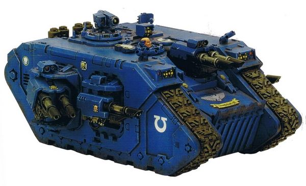

# 1501 终极型兰德掠袭者战车 Terminus Ultra pattern Land Raider

精校状态：中文行文已逐段精校，部分术语仍为暂定

分类：载具 / 地面 / 重型

原文来源：https://www.bilibili.com/opus/1039945383527055367

原作者：帝国神选罐头

原文时间：2025年03月03日 10:39

[返回分类目录](目录.md) · [全书目录](../../目录.md)

原篇名：终极兰德掠袭者 Terminus Ultra pattern Land Raider

<!-- A1501-B0001 -->
**英文原文**

The Terminus Ultra pattern of the Land Raider is the ultimate Space Marine anti-armour vehicle. It is equipped with three twin-linked lascannons and several individual lascannons. The amount of energy these weapons require means the Terminus must forego the ability to carry troops in order to power them. The Terminus pattern is deployed almost exclusively to counter enemy super heavies where its immense firepower can be used to destroy all but the largest and most powerful war engines the Space Marines may encounter, e.g. Titans, super-heavy tanks or stompas.

<!-- /A1501-B0001 -->

<!-- A1501-B0002 -->

原译文

兰德掠袭者的终极型是极限战士反装甲载具。它配备了三个双联激光炮和几个单独的激光炮。这些武器所需的能量意味着终结必须放弃携带部队的能力来为其提供动力。终结型几乎完全用于对抗敌人的超重型部队，其巨大的火力可用于摧毁星际战士可能遇到的除最大和最强大的战争引擎之外的所有战争引擎，例如泰坦、超重型坦克或古巨基。

**校订译文**

终极型兰德掠袭者战车是星际战士最强大的反装甲车辆，配备3组双联激光炮和数门单装激光炮。为了供应这些武器所需的巨大能量，该型号牺牲了运兵能力。终极型几乎专门用于对付敌方超重型单位；除体型最大、威力最强的战争机器外，它的强大火力足以摧毁星际战士可能遭遇的各类重型目标，例如泰坦、超重型坦克或古巨基。

**校注：** ultimate意为最强大、终极，并非战团名Ultramarines（极限战士）；Terminus统一作该车型名称。

<!-- /A1501-B0002 -->

<!-- A1501-B0003 图片 -->

<!-- A1501-B0004 -->

原译文

Terminus Ultra pattern Land Raider 终极型兰德掠袭者

**校订译文**

Terminus Ultra pattern Land Raider 终极型兰德掠袭者

<!-- /A1501-B0004 -->

<!-- A1501-B0005 -->
**英文原文**

The Terminus Ultra is also equipped with smoke launchers, a searchlight and a machine spirit. It can mount a Hunter-Killer missile.

<!-- /A1501-B0005 -->

<!-- A1501-B0006 -->

原译文

终极还配备了烟雾发射器、探照灯和机魂。它可以安装猎杀飞弹。

**校订译文**

终极型还配备烟雾发射器、探照灯和机魂，并可加装猎杀导弹。

<!-- /A1501-B0006 -->

<!-- A1501-B0007 -->
## Named Terminus Ultras 著名终极型

<!-- /A1501-B0007 -->

<!-- A1501-B0008 -->

原译文

Segnus 塞格努斯

**校订译文**

Segnus 塞格努斯

<!-- /A1501-B0008 -->

本篇核心术语与暂定项

以下列出本篇出现的英文原形及核心术语表用词。同形词可能指不同对象，具体词义以本篇正文和校注为准；单复数、别名和仅见于图注的名称可能尚未列入。完整候选见[术语表](../../术语表/双语术语候选.csv)。

| 英文 | 采用中文 | 状态 |
| --- | --- | --- |
| Space Marines | 星际战士 | 官方已核对 |
| Hunter-Killer | 猎杀者 | 暂定·官方待核 |
| Land Raider | 兰德掠袭者战车 | 官方已核对 |
| Space Marine | 星际战士 | 暂定·官方待核 |
| Raider | 掠袭者飞艇 | 官方已核对 |
| Terminus | 终点站 | 暂定·官方待核 |
| Hunter-killer missile | 猎杀导弹 | 官方已核对 |

