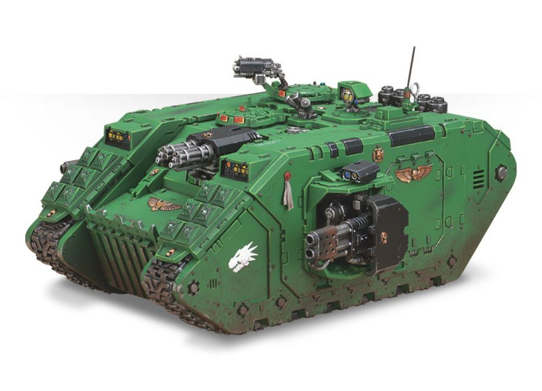
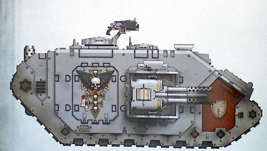

# 1502 救赎者型兰德掠袭者战车 Land Raider Redeemer

精校状态：中文行文已逐段精校，部分术语仍为暂定

分类：载具 / 地面 / 重型

原文来源：https://www.bilibili.com/opus/1048192412233498632

原作者：帝国神选罐头

原文时间：2025年03月25日 16:01

[返回分类目录](目录.md) · [全书目录](../../目录.md)

原篇名：救赎者兰德掠袭者 Land Raider Redeemer

<!-- A1502-B0001 -->
**英文原文**

The Land Raider Redeemer is an assault version of the Land Raider used by the Space Marines. Like the Land Raider Crusader from which it evolved, the Redeemer variant has several modifications which, while decreasing the transport capacity, assist warriors assaulting from within it. Unlike the Crusader, this variant supports assaulting Astartes with a Flamestorm Cannon rather than bolt weapons.

<!-- /A1502-B0001 -->

<!-- A1502-B0002 -->

原译文

兰德掠袭者救赎者是星际战士使用的兰德掠袭者的突击版。与它进化而来的兰德掠袭者十字军一样，救赎者变体也有几个修改型号，在降低运输能力的同时，帮助战士从内部进攻。与十字军不同，这个变体用火焰风暴炮而不是爆矢武器支援突击的阿斯塔特。

**校订译文**

救赎者型兰德掠袭者战车是星际战士使用的突击车型，由十字军型发展而来。它也经过多项改装，以牺牲部分运兵能力为代价，协助车内战士下车发起冲锋。与十字军型不同，救赎者型使用火焰风暴炮而非爆矢武器支援突击中的阿斯塔特。

**校注：** 源文称其改装降低运兵量，是相对十字军型而言；不据标准型10人的数据改写。

<!-- /A1502-B0002 -->

<!-- A1502-B0003 -->
## History 历史

<!-- /A1502-B0003 -->

<!-- A1502-B0004 -->
### Origins 起源

<!-- /A1502-B0004 -->

<!-- A1502-B0005 -->
**英文原文**

The first Land Raider Redeemer was created by the Fire Lords chapter, under the command of Jaric Phoros, on the planet of Grissen. Finding themselves in the midst of a planet-wide civil war, the Space Marines made little progress against the natives. The rebels were so entrenched that even the most devastating orbital bombardments made scant impact on their positions. Since Exterminatus was not an option, Phoros bit back his mounting frustration and directed his Techmarines to construct a weapon that would win the war. Within a month of the first Land Raider modifications, the largest planetary faction was suing for peace and Grissen was part of the Imperium once more. In the wake of the Grissen campaign, Phoros disseminated his new design's schematics.

<!-- /A1502-B0005 -->

<!-- A1502-B0006 -->

原译文

第一个兰德掠袭者救赎者是由火焰领主战团在贾里克·福罗斯的指挥下在格里森星球上制造的。发现自己处于一场全球性的内战之中，星际战士在对抗当地人方面进展甚微。叛军如此根深蒂固，即使是最具破坏性的轨道轰炸也对他们的阵地影响甚微。由于无法选择灭绝令，福罗斯克服了日益增长的沮丧情绪，并指示他的技术军士制造一种能够赢得战争的武器。在第一辆兰德掠袭者改装后的一个月内，最大的行星派系开始寻求和平，格里森再次成为帝国的一部分。在格里森战役之后，福罗斯传播了他的新设计原理图。

**校订译文**

第一辆救赎者型兰德掠袭者战车由火焰领主战团在贾里克·福罗斯的指挥下，于格里森星球上改造而成。当时，这颗星球陷入全面内战，星际战士对当地人的作战却进展甚微。叛军工事坚固，就连破坏力最强的轨道轰炸也难以撼动其阵地。由于不能实施灭绝令，福罗斯压下日益增长的挫败感，命令科技战士研制一种足以赢得战争的武器。首辆兰德掠袭者完成改装后不到一个月，星球上最大的派系就开始求和，格里森重新归入帝国。战役结束后，福罗斯向外界分享了这一新设计的图纸。

<!-- /A1502-B0006 -->

<!-- A1502-B0007 图片 -->

<!-- A1502-B0008 -->

原译文

Salamanders Space Marine Land Rider Reedemer 火蜥蜴星际战士兰德掠袭者救赎者

**校订译文**

Salamanders Space Marine Land Rider Reedemer 火蜥蜴星际战士的救赎者型兰德掠袭者战车

**校注：** 英文图注原有Land Rider Reedemer拼写，按要求原样保留。

<!-- /A1502-B0008 -->

<!-- A1502-B0009 -->
## Technical Information 技术资料

原题：Technical Information 技术信息

<!-- /A1502-B0009 -->

<!-- A1502-B0010 -->
**英文原文**

Vehicle Name:Land Raider Redeemer

<!-- /A1502-B0010 -->

<!-- A1502-B0011 -->

原译文

载具名称：兰德掠袭者救赎者

**校订译文**

载具名称：救赎者型兰德掠袭者战车

<!-- /A1502-B0011 -->

<!-- A1502-B0012 -->
**英文原文**

Forge World of Origin:Mars/Jerulas

<!-- /A1502-B0012 -->

<!-- A1502-B0013 -->

原译文

锻造起源世界：火星/杰拉鲁斯

**校订译文**

起源铸造世界：火星／杰拉鲁斯

<!-- /A1502-B0013 -->

<!-- A1502-B0014 -->
**英文原文**

Known Patterns:I-III

<!-- /A1502-B0014 -->

<!-- A1502-B0015 -->

原译文

已知型号：I - III

**校订译文**

已知型号：I - III

<!-- /A1502-B0015 -->

<!-- A1502-B0016 -->
**英文原文**

Crew:Driver, Commander

<!-- /A1502-B0016 -->

<!-- A1502-B0017 -->

原译文

乘员：驾驶员、指挥官

**校订译文**

乘员：驾驶员、指挥官

<!-- /A1502-B0017 -->

<!-- A1502-B0018 -->
**英文原文**

Powerplant:Adaptable thermic combustion

<!-- /A1502-B0018 -->

<!-- A1502-B0019 -->

原译文

动力装置：适应性热燃烧装置

**校订译文**

动力装置：自适应热燃烧装置

<!-- /A1502-B0019 -->

<!-- A1502-B0020 -->
**英文原文**

Weight:74 tonnes

<!-- /A1502-B0020 -->

<!-- A1502-B0021 -->

原译文

重量：74吨

**校订译文**

重量：74吨

<!-- /A1502-B0021 -->

<!-- A1502-B0022 -->
**英文原文**

Length:10.3m

<!-- /A1502-B0022 -->

<!-- A1502-B0023 -->

原译文

长度：10.3米

**校订译文**

长度：10.3米

<!-- /A1502-B0023 -->

<!-- A1502-B0024 -->
**英文原文**

Width:6.1m

<!-- /A1502-B0024 -->

<!-- A1502-B0025 -->

原译文

宽度：6.1米

**校订译文**

宽度：6.1米

<!-- /A1502-B0025 -->

<!-- A1502-B0026 -->
**英文原文**

Height:4.11m

<!-- /A1502-B0026 -->

<!-- A1502-B0027 -->

原译文

高度：4.11米

**校订译文**

高度：4.11米

<!-- /A1502-B0027 -->

<!-- A1502-B0028 -->
**英文原文**

Ground Clearance:0.45m

<!-- /A1502-B0028 -->

<!-- A1502-B0029 -->

原译文

离地间隙：0.45m

**校订译文**

离地间隙：0.45米

<!-- /A1502-B0029 -->

<!-- A1502-B0030 -->
**英文原文**

Fording Depth:{{{Fording Depth}}}

<!-- /A1502-B0030 -->

<!-- A1502-B0031 -->

原译文

涉水深度：｛｛｛涉水深度｝｝

**校订译文**

涉水深度：未提供

**校注：** 底稿仅有未展开的模板变量，无涉水数值。

<!-- /A1502-B0031 -->

<!-- A1502-B0032 -->
**英文原文**

Max Speed - on road41kph

<!-- /A1502-B0032 -->

<!-- A1502-B0033 -->

原译文

最大速度-公路41公里/小时

**校订译文**

最大速度-公路41公里/小时

**校注：** 源表公路41、越野50公里/小时，与相邻车型常见关系相反，照录并待核，未擅自互换。

<!-- /A1502-B0033 -->

<!-- A1502-B0034 -->
**英文原文**

Max Speed - off road:50kph

<!-- /A1502-B0034 -->

<!-- A1502-B0035 -->

原译文

最大速度-越野：50公里/小时

**校订译文**

最大速度-越野：50公里/小时

<!-- /A1502-B0035 -->

<!-- A1502-B0036 -->
**英文原文**

Transport Capacity:12 (6)

<!-- /A1502-B0036 -->

<!-- A1502-B0037 -->

原译文

运输能力：12（6）

**校订译文**

运兵能力：12名动力甲战士，或6名终结者

<!-- /A1502-B0037 -->

<!-- A1502-B0038 -->
**英文原文**

Access Points:N/A

<!-- /A1502-B0038 -->

<!-- A1502-B0039 -->

原译文

入口：无

**校订译文**

出入口：未提供（N/A）

**校注：** 源表N/A，但本篇后文明确有3处出入口；保留表项信息缺失与正文说明的差异。

<!-- /A1502-B0039 -->

<!-- A1502-B0040 -->
**英文原文**

Main Armament:2x Twin-linked Flamestorm Cannons

<!-- /A1502-B0040 -->

<!-- A1502-B0041 -->

原译文

主武器：2门双联火焰风暴炮

**校订译文**

主武器：2门双联火焰风暴炮

**校注：** 源技术表写2组双联火焰风暴炮，副武器也写2组双联突击炮；后文则为2门火焰风暴炮、1组双联突击炮。属英文底稿内部矛盾，未自行改数。

<!-- /A1502-B0041 -->

<!-- A1502-B0042 -->
**英文原文**

Secondary Armament:2x Twin-linked Assault Cannons

<!-- /A1502-B0042 -->

<!-- A1502-B0043 -->

原译文

二级武器：2门双联突击炮

**校订译文**

副武器：2组双联突击炮

<!-- /A1502-B0043 -->

<!-- A1502-B0044 -->
**英文原文**

Traverse:180°

<!-- /A1502-B0044 -->

<!-- A1502-B0045 -->

原译文

横向：180°

**校订译文**

水平射界：180°

<!-- /A1502-B0045 -->

<!-- A1502-B0046 -->
**英文原文**

Elevation:From -32° to +42°

<!-- /A1502-B0046 -->

<!-- A1502-B0047 -->

原译文

仰角：从-32°到+42°

**校订译文**

俯仰角：−32°至＋42°

<!-- /A1502-B0047 -->

<!-- A1502-B0048 -->
**英文原文**

Main Ammunition:20 x 3 Second Bursts per weapon (variable)

<!-- /A1502-B0048 -->

<!-- A1502-B0049 -->

原译文

主弹药：每件武器20 x 3秒爆炸（可变）

**校订译文**

主武器弹药容量：每门武器可持续喷射3秒，共20次（可变）

**校注：** bursts在喷火武器语境指持续喷射，不是爆炸。

<!-- /A1502-B0049 -->

<!-- A1502-B0050 -->
**英文原文**

Secondary Ammunition:2,000 rounds

<!-- /A1502-B0050 -->

<!-- A1502-B0051 -->

原译文

二级弹药：2000发

**校订译文**

副武器载弹量：2,000发

<!-- /A1502-B0051 -->

<!-- A1502-B0052 -->
### Armour 装甲

<!-- /A1502-B0052 -->

<!-- A1502-B0053 -->
**英文原文**

Superstructure:95mm

<!-- /A1502-B0053 -->

<!-- A1502-B0054 -->

原译文

上部结构：95mm

**校订译文**

上部结构：95mm

<!-- /A1502-B0054 -->

<!-- A1502-B0055 -->
**英文原文**

Hull:95mm

<!-- /A1502-B0055 -->

<!-- A1502-B0056 -->

原译文

车体：95mm

**校订译文**

车体：95mm

<!-- /A1502-B0056 -->

<!-- A1502-B0057 -->
**英文原文**

Gun Mantlet:N/A

<!-- /A1502-B0057 -->

<!-- A1502-B0058 -->

原译文

炮盾：无

**校订译文**

炮盾：不适用

<!-- /A1502-B0058 -->

<!-- A1502-B0059 -->
**英文原文**

Vehicle Designation:1020-766-0724-PR 132

<!-- /A1502-B0059 -->

<!-- A1502-B0060 -->

原译文

载具编号：1020-766-0724-PR 132

**校订译文**

载具编号：1020-766-0724-PR 132

<!-- /A1502-B0060 -->

<!-- A1502-B0061 -->
**英文原文**

Firing Ports:N/A

<!-- /A1502-B0061 -->

<!-- A1502-B0062 -->

原译文

开火口：无

**校订译文**

射击孔：不适用

<!-- /A1502-B0062 -->

<!-- A1502-B0063 -->
**英文原文**

Turret:N/A

<!-- /A1502-B0063 -->

<!-- A1502-B0064 -->

原译文

炮塔：无

**校订译文**

炮塔：不适用

<!-- /A1502-B0064 -->

<!-- A1502-B0065 -->
### Armament 军备

<!-- /A1502-B0065 -->

<!-- A1502-B0066 -->
**英文原文**

The Redeemer's armament consists of one twin-linked Assault Cannon and two Flamestorm Cannons (each on a side sponson). It may be upgraded to mount a Multi-melta and/or a pintle mounted Storm Bolter.

<!-- /A1502-B0066 -->

<!-- A1502-B0067 -->

原译文

救赎者的武器由一门双联突击炮和两门火焰风暴炮（每门都在一个侧舷上）组成。它可以升级安装多管热熔和/或枢轴式风暴爆矢枪。

**校订译文**

救赎者型的武器包括1组双联突击炮，以及分别安装于两侧侧舱的2门火焰风暴炮。还可加装多管热熔和／或枢轴安装的风暴爆矢枪。

<!-- /A1502-B0067 -->

<!-- A1502-B0068 -->
### Equipment 装备

原题：Equipment 设备

<!-- /A1502-B0068 -->

<!-- A1502-B0069 -->
**英文原文**

The Redeemer is also equipped with Frag Assault Launchers, Smoke Launchers, and a Searchlight. It can be further upgraded with Extra Armour and/or a Hunter-killer Missile.

<!-- /A1502-B0069 -->

<!-- A1502-B0070 -->

原译文

救赎者还配备了榴弹突击发射器、烟雾发射器和探照灯。它可以进一步升级额外装甲和/或猎杀飞弹。

**校订译文**

救赎者型还配备破片突击发射器、烟雾发射器和探照灯，并可增配附加装甲和／或猎杀导弹。

<!-- /A1502-B0070 -->

<!-- A1502-B0071 -->
### Transport Capacity and Access Points 运输能力和入口

<!-- /A1502-B0071 -->

<!-- A1502-B0072 -->
**英文原文**

The Redeemer can carry 12 Space Marines in Power Armour or 6 in Terminator Armour. There are three access points, one on each side of the hull, as well as the front ramp.

<!-- /A1502-B0072 -->

<!-- A1502-B0073 -->

原译文

救赎者可以携带12名身穿动力盔甲的星际战士或6名身穿终结者盔甲的星际战士。有三个入口，船体两侧各一个，还有前坡道。

**校订译文**

救赎者型可搭载12名身穿动力甲的星际战士，或6名终结者。全车共有3处出入口：车体两侧各一处，前方另有一处跳板舱门。

<!-- /A1502-B0073 -->

<!-- A1502-B0074 -->
### Vortimer Pattern Redeemer 沃蒂默型救赎者

<!-- /A1502-B0074 -->

<!-- A1502-B0075 -->
**英文原文**

The Vortimer Pattern Redeemer is a variant used by the Grey Knights. These vehicles have been modified by the Chapter's Master of the Forge Regis Vortimer to change the main weapon to a Psy-cannon, twin-linked and aimed by a servo-skull slaved targeter, and added to the armour sacred unguents and Runes of Warding in order to combat Daemons.

<!-- /A1502-B0075 -->

<!-- A1502-B0076 -->

原译文

沃蒂默型救赎者是灰骑士使用的一种变体。这些车辆已被战团的铸造大师雷吉斯·沃蒂默改装，将主要武器改为灵能炮，双联，由伺服颅骨无人机瞄准，并且在装甲上涂抹神圣药膏，刻上守护符文，以对抗恶魔。

**校订译文**

沃蒂默型救赎者是灰骑士使用的改型。战团铸造大师雷吉斯·沃蒂默将其主武器换成双联灵能炮，并以受控伺服颅骨搭载的瞄准装置引导射击。此外，车身装甲还涂有神圣油膏、刻有守护符文，以对抗恶魔。

<!-- /A1502-B0076 -->

<!-- A1502-B0077 图片 -->

<!-- A1502-B0078 -->

原译文

Vortimer Pattern Redeemer 沃蒂默型救赎者

**校订译文**

Vortimer Pattern Redeemer 沃蒂默型救赎者

<!-- /A1502-B0078 -->

<!-- A1502-B0079 -->
## Named Land Raider Redeemers 著名救赎者型兰德掠袭者战车

原题：Named Land Raider Redeemers 著名兰德掠袭者救赎者

<!-- /A1502-B0079 -->

<!-- A1502-B0080 -->
**英文原文**

Eurayalis Bane - of the Sons of Medusa

<!-- /A1502-B0080 -->

<!-- A1502-B0081 -->

原译文

欧瑞亚利斯灾星 - 美杜莎之子

**校订译文**

欧瑞亚利斯灾星号——美杜莎之子战团所属。

<!-- /A1502-B0081 -->

<!-- A1502-B0082 -->
**英文原文**

Fire of Fenris - of the Space Wolves

<!-- /A1502-B0082 -->

<!-- A1502-B0083 -->

原译文

芬里斯之火 - 太空野狼

**校订译文**

芬里斯之火号——太空野狼所属。

<!-- /A1502-B0083 -->

<!-- A1502-B0084 -->
**英文原文**

Heart of Blood - of the Executioners

<!-- /A1502-B0084 -->

<!-- A1502-B0085 -->

原译文

鲜血之心 - 处刑者

**校订译文**

鲜血之心号——处刑者战团所属。

<!-- /A1502-B0085 -->

<!-- A1502-B0086 -->
**英文原文**

Prometheus, the first Land Raider Redeemer, still serves in the Fire Lords' second company. Note that it must not be confused with the Land Raider Prometheus

<!-- /A1502-B0086 -->

<!-- A1502-B0087 -->

原译文

普罗米修斯，第一个兰德掠袭者救赎者，仍然在火焰领主的第二连队服役。请注意，它不能与兰德掠袭者普罗米修斯混淆

**校订译文**

普罗米修斯号——第一辆救赎者型兰德掠袭者战车，至今仍在火焰领主第二连服役。它是单辆战车的名字，不应与普罗米修斯型兰德掠袭者混淆。

<!-- /A1502-B0087 -->

本篇核心术语与暂定项

以下列出本篇出现的英文原形及核心术语表用词。同形词可能指不同对象，具体词义以本篇正文和校注为准；单复数、别名和仅见于图注的名称可能尚未列入。完整候选见[术语表](../../术语表/双语术语候选.csv)。

| 英文 | 采用中文 | 状态 |
| --- | --- | --- |
| Space Marines | 星际战士 | 官方已核对 |
| Grey Knights | 灰骑士 | 官方已核对 |
| Space Wolves | 太空野狼 | 官方已核对 |
| Terminator | 终结者 | 官方已核对 |
| Imperium | 帝国 | 暂定·简称 |
| Forge World | 铸造世界 | 暂定·官方待核 |
| Hunter-Killer | 猎杀者 | 暂定·官方待核 |
| Servo-Skull | 伺服颅骨 | 暂定·官方待核 |
| Redeemer | 救赎者 | 暂定·官方待核 |
| Mars | 火星 | 暂定·官方待核 |
| Fenris | 芬里斯 | 暂定·官方待核 |
| Medusa | 美杜莎 | 暂定·官方待核 |
| Land Raider | 兰德掠袭者战车 | 官方已核对 |
| Master | 导师（审判庭职衔）／舰务官（舰员职务） | 语境定译·官方待核 |
| Master of the Forge | 铸造大师 | 暂定·官方待核 |
| Power Armour | 动力盔甲 | 暂定·官方待核 |
| Chapter | 战团 | 暂定·官方待核 |
| Executioners | 处刑者 | 语境定译·官方待核 |
| Fire Lords | 火焰领主 | 暂定·官方待核 |
| Sons of Medusa | 美杜莎之子 | 暂定·官方待核 |
| Land Raider Redeemer | 救赎者型兰德掠袭者战车 | 官方已核对 |
| Raider | 掠袭者飞艇 | 官方已核对 |
| Regis Vortimer | 雷吉斯·沃蒂默 | 暂定·官方待核 |
| Land Raider Prometheus | 普罗米修斯型兰德掠袭者战车 | 暂定·官方待核 |
| The Crusader | 十字军号 | 暂定·官方待核 |
| Gun | 甘 | 暂定·官方待核 |
| Heart of Blood | 鲜血之心（恶魔）／鲜血之心号（载具） | 语境定译·官方待核 |
| Hunter-killer missile | 猎杀导弹 | 官方已核对 |
| Assault Cannon | 突击炮 | 暂定·官方待核 |
| Bolt | 爆矢 | 暂定·官方待核 |
| Bolter | 爆矢枪 | 暂定·官方待核 |
| Storm bolter | 风暴爆矢枪 | 官方已核对 |
| Flamestorm Cannon | 火焰风暴炮 | 暂定·官方待核 |
| Multi-melta | 多管热熔 | 官方已核对 |
| Terminator Armour | 终结者盔甲 | 暂定·官方待核 |
| Extra Armour | 额外装甲 | 暂定·官方待核 |
| Land Raider Crusader | 十字军型兰德掠袭者战车 | 官方已核对 |
| Jaric Phoros | 贾里克·福罗斯 | 暂定·官方待核 |
| Grissen | 格里森 | 暂定·官方待核 |
| Jerulas | 杰拉鲁斯 | 暂定·官方待核 |
| Eurayalis Bane | 欧瑞亚利斯灾星号 | 暂定·官方待核 |
| Fire of Fenris | 芬里斯之火号 | 暂定·官方待核 |

