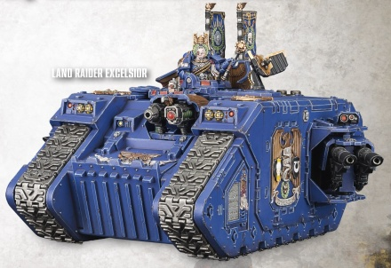

# 1503 精毅者型兰德掠袭者 Land Raider Excelsior

精校状态：中文行文已逐段精校，部分术语仍为暂定

分类：载具 / 地面 / 重型

原文来源：https://www.bilibili.com/opus/1043315317916303362

原作者：帝国神选罐头

原文时间：2025年03月12日 12:36

[返回分类目录](目录.md) · [全书目录](../../目录.md)

原篇名：精毅者兰德掠袭者 Land Raider Excelsior

<!-- A1503-B0001 -->
**英文原文**

The Land Raider Excelsior is a rare command version of the standard Land Raider used by the Space Marines.

<!-- /A1503-B0001 -->

<!-- A1503-B0002 -->

原译文

兰德掠袭者精毅者是标准兰德掠袭者的罕见指挥版本。

**校订译文**

精毅者型兰德掠袭者是星际战士在标准兰德掠袭者基础上改造的稀有指挥车型。

<!-- /A1503-B0002 -->

<!-- A1503-B0003 图片 -->

<!-- A1503-B0004 -->

原译文

Land Raider Excelsior 兰德掠袭者精毅者

**校订译文**

Land Raider Excelsior 兰德掠袭者精毅者

<!-- /A1503-B0004 -->

<!-- A1503-B0005 -->
**英文原文**

The Excelsior is a command vehicle, equipped with augur and communications arrays to effectively deliver orders on the battlefield. In addition, it maintains a formidable armament of a Graviton Cannon and two turrets of twin-linked Lascannons. The Excelsior often works in concert with a Rhino Primaris.

<!-- /A1503-B0005 -->

<!-- A1503-B0006 -->

原译文

精毅者是一种指挥车，配备有鸟卜仪和通信阵列，可在战场上有效地下达命令。此外，它还拥有一门重力炮和两座双联激光炮炮塔。精毅者经常与尖峰犀牛合作。

**校订译文**

精毅者型作为指挥车，配备鸟卜仪和通讯阵列，能在战场上有效传达命令。它同时保有强大的武装，包括1门重力炮和2座双联激光炮炮塔，通常与尖峰犀牛协同作战。

<!-- /A1503-B0006 -->

<!-- A1503-B0007 -->
**英文原文**

The Excelsior gets deployed as forward unit during planetary assaults, its advanced augury and communications array used to call in orbital bombardments with pinpoint accuracy.

<!-- /A1503-B0007 -->

<!-- A1503-B0008 -->

原译文

精毅者在行星攻击期间被部署为前沿部队，其先进的鸟卜仪和通信阵列用于精确地呼叫轨道轰炸。

**校订译文**

在行星突击行动中，精毅者型会作为先头单位投入战斗，利用先进的鸟卜仪和通讯阵列，精确引导轨道轰炸。

<!-- /A1503-B0008 -->

本篇核心术语与暂定项

以下列出本篇出现的英文原形及核心术语表用词。同形词可能指不同对象，具体词义以本篇正文和校注为准；单复数、别名和仅见于图注的名称可能尚未列入。完整候选见[术语表](../../术语表/双语术语候选.csv)。

| 英文 | 采用中文 | 状态 |
| --- | --- | --- |
| Space Marines | 星际战士 | 官方已核对 |
| Land Raider | 兰德掠袭者战车 | 官方已核对 |
| Rhino | 犀牛战车 | 官方已核对 |
| Raider | 掠袭者飞艇 | 官方已核对 |
| Graviton Cannon | 重力炮 | 暂定·官方待核 |
| Rhino Primaris | 尖峰犀牛 | 暂定·官方待核 |

