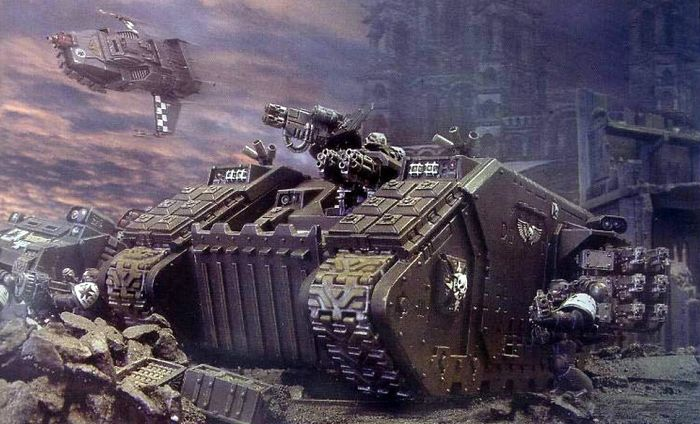
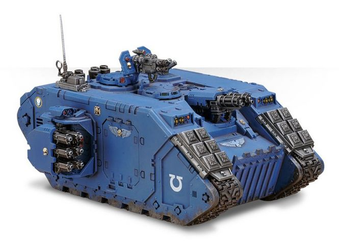

# 1504 十字军型兰德掠袭者战车 Land Raider Crusader

精校状态：中文行文已逐段精校，部分术语仍为暂定

分类：载具 / 地面 / 重型

原文来源：https://www.bilibili.com/opus/1039570626151448585

原作者：帝国神选罐头

原文时间：编辑于 2025年05月26日 11:38

[返回分类目录](目录.md) · [全书目录](../../目录.md)

原篇名：十字军兰德掠袭者 Land Raider Crusader

<!-- A1504-B0001 -->
**英文原文**

The Land Raider Crusader is an assault-based version of the Land Raider used by the Space Marines. It has several modifications to allow it to assist warriors assaulting out of the front hatch. It also has a much greater transport capacity due to the removal of many of the large energy generators needed to power the Lascannons, and special frag charges to fill the air before it with lethal shrapnel and cover the disembarking Marines.

<!-- /A1504-B0001 -->

<!-- A1504-B0002 -->

原译文

兰德掠袭者十字军是星际战士使用的兰德掠袭者的攻击型版本。它有几个修改，使其能够协助战士从前舱门进攻。由于拆除了为激光炮供电所需的许多大型能量发生器，以及特殊的榴弹装药，它的运输能力也大得多，这些榴弹装药可以在它前方用致命的弹片填充区域，并掩护登陆的星际战士。

**校订译文**

十字军型兰德掠袭者战车是星际战士使用的突击车型，经过多项改装，以协助战士从前舱门冲出作战。由于拆除了为激光炮供电所需的许多大型发电装置，它的运兵能力大幅增加。车上还配有专用破片装药，能向前方倾泻致命弹片，掩护下车的星际战士。

**校注：** 原译误把破片装药也列为被拆除设备；英文说车辆配有该装药。

<!-- /A1504-B0002 -->

<!-- A1504-B0003 图片 -->

<!-- A1504-B0004 -->

原译文

Black Templars Land Raider Crusader 黑色圣堂兰德掠袭者十字军

**校订译文**

Black Templars Land Raider Crusader 黑色圣堂的十字军型兰德掠袭者战车

<!-- /A1504-B0004 -->

<!-- A1504-B0005 -->
## History 历史

<!-- /A1504-B0005 -->

<!-- A1504-B0006 -->
**英文原文**

The Land Raider Crusader design originated from the Jerulas Crusade in 645.M39 when Artificer Simagus of the Black Templars used ancient techno-arcana, recovered from the long-forgotten depths of a captured Hive City, to develop what would become one of the most feared tanks in the Imperium. As tales of the Crusader's successes spread, many other Chapters began to request information regarding its remodeling. Eventually the Adeptus Mechanicus of Mars officially recognized the Crusader pattern in 763.M39, although by this point it was a mere formality since the design had already spread to hundreds of Chapters.

<!-- /A1504-B0006 -->

<!-- A1504-B0007 -->

原译文

兰德掠袭者十字军的设计起源于645.M39的杰拉鲁斯远征，当时黑色圣堂的工匠西格玛斯使用从被占领的巢都被遗忘的深处恢复的古老神秘技术，开发了后来成为帝国中最可怕的坦克之一。随着十字军成功消息的传播，许多其他战团开始要求提供有关其改造的信息。最终，火星机械神教在763.M39正式承认了十字军型，尽管到目前为止，这只是一种形式，因为该设计已经传播到数百个战团。

**校订译文**

十字军型兰德掠袭者战车的设计源于M39.645的杰拉鲁斯远征。当时，黑色圣堂工匠西格玛斯从一座被攻占巢都深处的遗忘区域找回古老的技术秘识，并据此研制出这款日后令帝国敌人闻风丧胆的坦克。随着十字军型的战绩广为流传，许多其他战团开始索取改装资料。M39.763，火星的机械修会终于正式认可这一型号；但此时该设计已传遍数百个战团，批准本身已只剩形式上的意义。

<!-- /A1504-B0007 -->

<!-- A1504-B0008 -->
## Design Features 设计特点

<!-- /A1504-B0008 -->

<!-- A1504-B0009 -->
**英文原文**

The Crusader's most significant departure from the original vehicle comes in its armaments, with the sponson-mounted lascannons replaced with Hurricane bolters, the hull-mounted heavy bolter replaced with twin-linked Assault Cannons, and several Frag Assault Launchers studding its hull. These numerous short-ranged, rapid-firing weapons allow the Crusader to lay low the enemy before disgorging its embarked passengers and provide them with superior fire suppression. In compensation for the loss in anti-tank firepower the pintle-mount was converted to carry a Multi-melta, which also serves to breach defences and clear anti-tank obstacles. The first Crusaders models of the Black Templars didn't have multi-meltas, but after several battles these were found to be necessary and subsequently added.

<!-- /A1504-B0009 -->

<!-- A1504-B0010 -->

原译文

十字军与原始载具的最大区别在于其武器装备，用飓风爆矢枪取代了安装在舷侧的激光炮，用双联突击炮取代了装在车体上的重型爆矢枪，并在车体上安装了几个破片突击发射器。这些数量众多的短程速射武器使十字军能够在卸下其搭载的乘客之前将敌人击倒，并为他们提供卓越的火力压制。为了弥补反坦克火力的损失，枢轴架被改装为携带多管热熔，它也有助于突破防御和清除反坦克障碍。第一批黑色圣堂的十字军没有多管热熔，但经过几次战斗，这些武器被发现是必要的，并随后被添加。

**校订译文**

十字军型与原型车最大的区别是武器配置：两侧侧舱的激光炮换成飓风爆矢枪，车体上的重型爆矢枪换成双联突击炮，车身各处还装有数具破片突击发射器。这些数量众多的近程速射武器可在部队下车前压倒敌人，并为其提供强大的压制火力。为弥补反坦克能力的损失，枢轴武器架改装成了可搭载多管热熔的形式，兼用于突破工事、清除反坦克障碍。黑色圣堂的首批十字军型并未装备多管热熔，但几场战斗证明了这种武器的必要性，之后便将其加装。

<!-- /A1504-B0010 -->

<!-- A1504-B0011 -->
**英文原文**

With the removal of the bulky generators needed to power the lascannons the Crusader can carry up to sixteen Space Marines or eight Terminators, the largest transport capacity of any Land Raider variant. Carrying so many additional troops also necessitated the adding of Extra Armour and structural supports to the vehicle which, due to the additional strain on its engines, also reduces the Crusader's top speed slightly A standard Crusader also mounts Smoke Launchers and a Searchlight along with the option to carry a Hunter-Killer Missile

<!-- /A1504-B0011 -->

<!-- A1504-B0012 -->

原译文

在移除为激光炮供电所需的笨重发电机后，十字军可以携带多达16名星际战士或8名终结者，这是所有兰德掠袭者变体中运输能力最大的。携带如此多的额外部队也需要在车辆上增加额外的装甲和结构支撑，由于发动机的额外压力，这也会略微降低十字军的最高速度。标准十字军还安装了烟雾发射器和探照灯，并可以选择携带猎杀飞弹。

**校订译文**

拆除为激光炮供电的笨重发电装置后，十字军型最多可搭载16名星际战士或8名终结者，在所有兰德掠袭者改型中运兵能力最大。为了搭载更多战士，车辆也必须增加附加装甲和结构支撑；这些改动加重了发动机的负担，使其最高速度略有下降。标准十字军型还配备烟雾发射器、探照灯，并可选装猎杀导弹。

<!-- /A1504-B0012 -->

<!-- A1504-B0013 图片 -->

<!-- A1504-B0014 -->

原译文

Land Raider Crusader 兰德掠袭者十字军

**校订译文**

Land Raider Crusader 十字军型兰德掠袭者战车

<!-- /A1504-B0014 -->

<!-- A1504-B0015 -->
## Technical Information 技术资料

原题：Technical Information 技术信息

<!-- /A1504-B0015 -->

<!-- A1504-B0016 -->
**英文原文**

Vehicle Name:Land Raider Crusader

<!-- /A1504-B0016 -->

<!-- A1504-B0017 -->

原译文

载具名称：兰德掠袭者十字军

**校订译文**

载具名称：十字军型兰德掠袭者战车

<!-- /A1504-B0017 -->

<!-- A1504-B0018 -->
**英文原文**

Forge World of Origin:Jerulas

<!-- /A1504-B0018 -->

<!-- A1504-B0019 -->

原译文

起源铸造世界：杰拉鲁斯

**校订译文**

起源铸造世界：杰拉鲁斯

<!-- /A1504-B0019 -->

<!-- A1504-B0020 -->
**英文原文**

Known Patterns:II-XI

<!-- /A1504-B0020 -->

<!-- A1504-B0021 -->

原译文

已知型号：II - XI

**校订译文**

已知型号：II - XI

<!-- /A1504-B0021 -->

<!-- A1504-B0022 -->
**英文原文**

Crew:Driver, Commander

<!-- /A1504-B0022 -->

<!-- A1504-B0023 -->

原译文

乘员：驾驶员、指挥官

**校订译文**

乘员：驾驶员、指挥官

<!-- /A1504-B0023 -->

<!-- A1504-B0024 -->
**英文原文**

Powerplant:Adaptable Thermic Combustion w/ Auxillary Reactor

<!-- /A1504-B0024 -->

<!-- A1504-B0025 -->

原译文

动力装置：配备辅助反应堆的自适应热燃烧装置

**校订译文**

动力装置：配备辅助反应堆的自适应热燃烧装置

<!-- /A1504-B0025 -->

<!-- A1504-B0026 -->
**英文原文**

Weight:72.0 tonnes

<!-- /A1504-B0026 -->

<!-- A1504-B0027 -->

原译文

重量：72.0吨

**校订译文**

重量：72.0吨

<!-- /A1504-B0027 -->

<!-- A1504-B0028 -->
**英文原文**

Length:10.3m

<!-- /A1504-B0028 -->

<!-- A1504-B0029 -->

原译文

长度：10.3米

**校订译文**

长度：10.3米

<!-- /A1504-B0029 -->

<!-- A1504-B0030 -->
**英文原文**

Width:6.1m

<!-- /A1504-B0030 -->

<!-- A1504-B0031 -->

原译文

宽度：6.1米

**校订译文**

宽度：6.1米

<!-- /A1504-B0031 -->

<!-- A1504-B0032 -->
**英文原文**

Height:4.11m

<!-- /A1504-B0032 -->

<!-- A1504-B0033 -->

原译文

高度：4.11米

**校订译文**

高度：4.11米

<!-- /A1504-B0033 -->

<!-- A1504-B0034 -->
**英文原文**

Ground Clearance:0.45m

<!-- /A1504-B0034 -->

<!-- A1504-B0035 -->

原译文

离地间隙：0.45m

**校订译文**

离地间隙：0.45米

<!-- /A1504-B0035 -->

<!-- A1504-B0036 -->
**英文原文**

Fording Depth:{{{Fording Depth}}}

<!-- /A1504-B0036 -->

<!-- A1504-B0037 -->

原译文

涉水深度：｛｛｛涉水深度｝｝

**校订译文**

涉水深度：未提供

**校注：** 底稿仅有未展开模板变量，无数值。

<!-- /A1504-B0037 -->

<!-- A1504-B0038 -->
**英文原文**

Max Speed - on road:50kph

<!-- /A1504-B0038 -->

<!-- A1504-B0039 -->

原译文

最大速度-公路上50公里/小时

**校订译文**

最大速度-公路上50公里/小时

<!-- /A1504-B0039 -->

<!-- A1504-B0040 -->
**英文原文**

Max Speed - off road:41kph

<!-- /A1504-B0040 -->

<!-- A1504-B0041 -->

原译文

最大速度-越野：41公里/小时

**校订译文**

最大速度-越野：41公里/小时

<!-- /A1504-B0041 -->

<!-- A1504-B0042 -->
**英文原文**

Transport Capacity:16 (8)

<!-- /A1504-B0042 -->

<!-- A1504-B0043 -->

原译文

运输能力：16（8）

**校订译文**

运兵能力：16名星际战士，或8名终结者

<!-- /A1504-B0043 -->

<!-- A1504-B0044 -->
**英文原文**

Access Points:3

<!-- /A1504-B0044 -->

<!-- A1504-B0045 -->

原译文

入口：3

**校订译文**

出入口：3处

<!-- /A1504-B0045 -->

<!-- A1504-B0046 -->
**英文原文**

Main Armament:6 x Twin-linked Bolters

<!-- /A1504-B0046 -->

<!-- A1504-B0047 -->

原译文

主武器：6个双联爆矢枪

**校订译文**

主武器：6组双联爆矢枪

<!-- /A1504-B0047 -->

<!-- A1504-B0048 -->
**英文原文**

Secondary Armament:Twin-linked Assault Cannon，Multi-melta

<!-- /A1504-B0048 -->

<!-- A1504-B0049 -->

原译文

二级武器：双联突击炮，多管热熔

**校订译文**

副武器：双联突击炮、多管热熔

<!-- /A1504-B0049 -->

<!-- A1504-B0050 -->
**英文原文**

Traverse:180°

<!-- /A1504-B0050 -->

<!-- A1504-B0051 -->

原译文

横向：180°

**校订译文**

水平射界：180°

<!-- /A1504-B0051 -->

<!-- A1504-B0052 -->
**英文原文**

Elevation:From -32° to +42°

<!-- /A1504-B0052 -->

<!-- A1504-B0053 -->

原译文

仰角：从-32°到+42°

**校订译文**

俯仰角：−32°至＋42°

<!-- /A1504-B0053 -->

<!-- A1504-B0054 -->
**英文原文**

Main Ammunition:4000 rounds

<!-- /A1504-B0054 -->

<!-- A1504-B0055 -->

原译文

主要弹药：4000发

**校订译文**

主武器载弹量：4,000发

<!-- /A1504-B0055 -->

<!-- A1504-B0056 -->
**英文原文**

Secondary Ammunition:2000 rounds

<!-- /A1504-B0056 -->

<!-- A1504-B0057 -->

原译文

二级弹药：2000发

**校订译文**

副武器载弹量：2,000发

<!-- /A1504-B0057 -->

<!-- A1504-B0058 -->
### Armour 装甲

<!-- /A1504-B0058 -->

<!-- A1504-B0059 -->
**英文原文**

Superstructure:95mm

<!-- /A1504-B0059 -->

<!-- A1504-B0060 -->

原译文

上部结构：95mm

**校订译文**

上部结构：95mm

<!-- /A1504-B0060 -->

<!-- A1504-B0061 -->
**英文原文**

Hull:95mm

<!-- /A1504-B0061 -->

<!-- A1504-B0062 -->

原译文

车体：95mm

**校订译文**

车体：95mm

<!-- /A1504-B0062 -->

<!-- A1504-B0063 -->
**英文原文**

Gun Mantlet:N/A

<!-- /A1504-B0063 -->

<!-- A1504-B0064 -->

原译文

炮盾：无

**校订译文**

炮盾：不适用

<!-- /A1504-B0064 -->

<!-- A1504-B0065 -->
**英文原文**

Vehicle Designation:0120-766-0724-PR112

<!-- /A1504-B0065 -->

<!-- A1504-B0066 -->

原译文

载具编号：0120-766-0724-PR112

**校订译文**

载具编号：0120-766-0724-PR112

<!-- /A1504-B0066 -->

<!-- A1504-B0067 -->
**英文原文**

Firing Ports:N/A

<!-- /A1504-B0067 -->

<!-- A1504-B0068 -->

原译文

开火口：无

**校订译文**

射击孔：不适用

<!-- /A1504-B0068 -->

<!-- A1504-B0069 -->
**英文原文**

Turret:N/A

<!-- /A1504-B0069 -->

<!-- A1504-B0070 -->

原译文

炮塔：无

**校订译文**

炮塔：不适用

<!-- /A1504-B0070 -->

<!-- A1504-B0071 -->
## Known Named Land Raider Crusaders 著名十字军型兰德掠袭者战车

原题：Known Named Land Raider Crusaders 著名兰德掠袭者十字军

<!-- /A1504-B0071 -->

<!-- A1504-B0072 -->
**英文原文**

Fire Drake - of the Salamanders

<!-- /A1504-B0072 -->

<!-- A1504-B0073 -->

原译文

火龙 - 火蜥蜴

**校订译文**

火龙号——火蜥蜴战团所属。

<!-- /A1504-B0073 -->

<!-- A1504-B0074 -->
**英文原文**

Holy Avenger - of the Imperial Fists

<!-- /A1504-B0074 -->

<!-- A1504-B0075 -->

原译文

神圣复仇者 - 帝国之拳

**校订译文**

神圣复仇者号——帝国之拳所属。

<!-- /A1504-B0075 -->

本篇核心术语与暂定项

以下列出本篇出现的英文原形及核心术语表用词。同形词可能指不同对象，具体词义以本篇正文和校注为准；单复数、别名和仅见于图注的名称可能尚未列入。完整候选见[术语表](../../术语表/双语术语候选.csv)。

| 英文 | 采用中文 | 状态 |
| --- | --- | --- |
| Space Marines | 星际战士 | 官方已核对 |
| Black Templars | 黑色圣堂 | 官方已核对 |
| Adeptus Mechanicus | 机械修会 | 官方已核对 |
| Imperium | 帝国 | 暂定·简称 |
| Imperial Fists | 帝国之拳 | 暂定 |
| Forge World | 铸造世界 | 暂定·官方待核 |
| Hunter-Killer | 猎杀者 | 暂定·官方待核 |
| Salamanders | 火蜥蜴 | 暂定·官方待核 |
| Mars | 火星 | 暂定·官方待核 |
| Land Raider | 兰德掠袭者战车 | 官方已核对 |
| Clear | 清明 | 暂定·官方待核 |
| Ancient | 旗手 | 官方已核对 |
| Terminators | 终结者 | 暂定·官方待核 |
| The Black Templars | 黑色圣堂 | 暂定·官方待核 |
| Crusaders | 十字军 | 暂定·官方待核 |
| Artificer | 技工 | 暂定·官方待核 |
| Raider | 掠袭者飞艇 | 官方已核对 |
| Strain | 群系 | 暂定·官方待核 |
| Fire Drake | 火龙号 | 暂定·官方待核 |
| The Crusader | 十字军号 | 暂定·官方待核 |
| Gun | 甘 | 暂定·官方待核 |
| Hive City | 巢都城市 | 暂定·官方待核 |
| Avenger | 复仇者号 | 暂定·官方待核 |
| Hunter-killer missile | 猎杀导弹 | 官方已核对 |
| Assault Cannon | 突击炮 | 暂定·官方待核 |
| Bolter | 爆矢枪 | 暂定·官方待核 |
| Heavy bolter | 重型爆矢枪 | 官方已核对 |
| Multi-melta | 多管热熔 | 官方已核对 |
| The Loss | 失落 | 暂定·官方待核 |
| Extra Armour | 额外装甲 | 暂定·官方待核 |
| Land Raider Crusader | 十字军型兰德掠袭者战车 | 官方已核对 |
| Jerulas | 杰拉鲁斯 | 暂定·官方待核 |
| Simagus | 西格玛斯 | 暂定·官方待核 |
| Holy Avenger | 神圣复仇者号 | 暂定·官方待核 |

