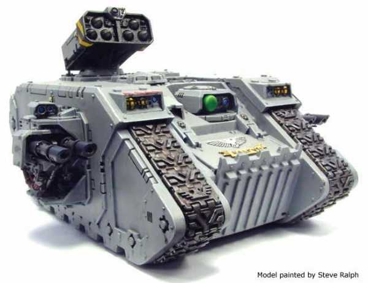

# 1505 赫利俄斯型兰德掠袭者战车 Land Raider Helios

精校状态：中文行文已逐段精校，部分术语仍为暂定

分类：载具 / 地面 / 重型

原文来源：https://www.bilibili.com/opus/1039945177373868037

原作者：帝国神选罐头

原文时间：2025年03月03日 10:38

[返回分类目录](目录.md) · [全书目录](../../目录.md)

原篇名：赫利俄斯兰德掠袭者 Land Raider Helios

<!-- A1505-B0001 -->
**英文原文**

The Land Raider Helios is a variant of the Space Marines' Land Raider, designed as a stop-gap measure for long range artillery support. The Hyperios variant is used as an air defense vehicle. Since its first introduction, it has been adopted by a number of Chapters, though it still remains an uncommon sight on the battlefield.

<!-- /A1505-B0001 -->

<!-- A1505-B0002 -->

原译文

兰德掠袭者赫利俄斯是星际战士兰德掠袭者的变体，旨在作为远程火炮支援的权宜之计。赫利俄斯变体被用作防空车辆。自首次引入以来，它已被许多战团采用，尽管它在战场上仍然罕见。

**校订译文**

赫利俄斯型兰德掠袭者是星际战士为临时满足远程炮火支援需求而设计的改型；其许珀里翁改型则用于防空。自问世以来，已有多个战团采用这种车辆，但它在战场上仍不常见。

**校注：** Helios与Hyperios是不同名称，原译首段将两者混为赫利俄斯。

<!-- /A1505-B0002 -->

<!-- A1505-B0003 图片 -->

<!-- A1505-B0004 -->

原译文

Land Raider Helios 兰德掠袭者赫利俄斯

**校订译文**

Land Raider Helios 兰德掠袭者赫利俄斯

<!-- /A1505-B0004 -->

<!-- A1505-B0005 -->
## History 历史

<!-- /A1505-B0005 -->

<!-- A1505-B0006 -->
**英文原文**

In 857.M38, the Red Scorpions were embroiled in the legendary "Siege of Helios", where they found themselves lacking in sufficient artillery to breach the walls or suppress the defenders in their sector. The Red Scorpions, being an especially insular and independent Chapter, refused to call upon the local Imperial Guard for assistance, and instead the Chapter Master directed his Master of the Forge to produce a solution. In response, they converted all twelve of their Land Raiders into what became known as the "Helios" pattern. The new Land Raider Helios, in combination with the Chapter's Whirlwinds, proceeded to knock down the offending walls and assaulted the defenders with success.

<!-- /A1505-B0006 -->

<!-- A1505-B0007 -->

原译文

857.M38，红蝎卷入了传说中的赫利俄斯围城，在那里他们发现自己缺乏足够的火炮来突破城墙或镇压他们所在地区的守军。红蝎是一个特别孤立和独立的战团，拒绝向当地的帝国卫队寻求帮助，而是由战团长指示他的铸造大师提出解决方案。作为回应，他们将所有十二名兰德掠袭者都转换为所谓的赫利俄斯型。新的兰德掠袭者赫利俄斯与战团的旋风战车相结合，开始进攻倒塌的墙壁，并成功地袭击了防御者。

**校订译文**

M38.857，红蝎战团参与了著名的赫利俄斯围城战，却发现自己缺乏足够的火炮，无法突破所负责战区的城墙或压制守军。红蝎尤为封闭自立，拒绝向当地帝国卫队求援，战团长于是命令铸造大师设法解决。他们将全部12辆兰德掠袭者改装成后来被称为“赫利俄斯”的型号。这些新型战车与战团的旋风战车协同轰塌城墙，成功向守军发动突击。

<!-- /A1505-B0007 -->

<!-- A1505-B0008 -->
**英文原文**

Later this pattern of Land Raider was borrowed by other Chapters, and the Land Raider Helios were deployed when armoured artillery support was needed. The Land Raider Helios pattern has proved itself useful in traversing through the especially dangerous and difficult terrain impassable for the less armoured Whirlwind. Such dangerous war zones include those set within magma seas, fractal crystal forests, and carnivorous jungles.

<!-- /A1505-B0008 -->

<!-- A1505-B0009 -->

原译文

后来，其他战团借用了这种兰德掠袭者型号，并在需要装甲火炮支援时部署了赫利俄斯。事实证明，兰德掠袭者赫利俄斯型在穿越装甲较弱的旋风战车无法穿越的特别危险和困难的地形时非常有用。这些危险的战区包括位于岩浆海、分形水晶森林和食肉丛林中的战区。

**校订译文**

后来，其他战团也引入了这一设计，在需要装甲车辆提供炮火支援时部署赫利俄斯型。它尤其适合穿越危险而难行、装甲较薄的旋风战车无法通行的地形，例如熔岩海、分形水晶森林和食肉丛林等战区。

<!-- /A1505-B0009 -->

<!-- A1505-B0010 -->
## Equipment 装备

原题：Equipment 设备

<!-- /A1505-B0010 -->

<!-- A1505-B0011 -->
**英文原文**

The main difference between the Helios and the standard Land Raider is the addition of a Whirlwind multiple missile launcher besides the two Twin-linked Lascannons. The trade-off is that some of the transport capacity is given over to missile storage; the Helios pattern can only carry six Space Marines in normal power armour and only three in Terminator Armour.

<!-- /A1505-B0011 -->

<!-- A1505-B0012 -->

原译文

赫利俄斯和标准兰德掠袭者之间的主要区别在于，除了两个双联激光炮外，还增加了一个旋风多管导弹发射器。权衡的结果是，部分运输能力被用于导弹储存；赫利俄斯型只能携带六名身穿普通动力盔甲的星际战士和三名身穿终结者装甲的星际战士。

**校订译文**

赫利俄斯型与标准兰德掠袭者的主要区别，是在2组双联激光炮之外加装一具旋风多联导弹发射器。代价是部分运兵空间须用于储存导弹，因此它只能搭载6名身穿普通动力甲的星际战士，或3名终结者。

**校注：** 6名动力甲战士与3名终结者是两种载员配置，不是同时搭载。

<!-- /A1505-B0012 -->

<!-- A1505-B0013 -->
**英文原文**

Besides a Searchlight and Smoke Launchers, the Land Raider Helios can be upgraded with Extra Armour, a Hunter-killer Missile, and a Pintle-mounted Storm Bolter. It may also replace its Whirlwind launcher with a Hyperios missile launcher, turning it into an air defense vehicle in situations where air support is not available.

<!-- /A1505-B0013 -->

<!-- A1505-B0014 -->

原译文

除了探照灯和烟雾发射器外，兰德掠袭者赫利俄斯还可以升级额外装甲、猎杀飞弹和钉装风暴爆矢枪。它还可能用许珀里翁导弹发射器取代其旋风发射器，在无法获得空中支援的情况下将其变成防空车辆。

**校订译文**

除探照灯和烟雾发射器外，赫利俄斯型还可加装附加装甲、猎杀导弹和枢轴安装的风暴爆矢枪。它也可将旋风发射器换成许珀里翁导弹发射器，在得不到空中支援时承担防空任务。

<!-- /A1505-B0014 -->

<!-- A1505-B0015 -->
## Technical Information 技术资料

原题：Technical Information 技术信息

<!-- /A1505-B0015 -->

<!-- A1505-B0016 -->
**英文原文**

Vehicle Name:Land Raider Helios

<!-- /A1505-B0016 -->

<!-- A1505-B0017 -->

原译文

载具名称：兰德掠袭者赫利俄斯

**校订译文**

载具名称：兰德掠袭者赫利俄斯

<!-- /A1505-B0017 -->

<!-- A1505-B0018 -->
**英文原文**

Forge World of Origin:Helios

<!-- /A1505-B0018 -->

<!-- A1505-B0019 -->

原译文

起源铸造世界：赫利俄斯

**校订译文**

起源铸造世界：赫利俄斯

<!-- /A1505-B0019 -->

<!-- A1505-B0020 -->
**英文原文**

Known Patterns:III-IX

<!-- /A1505-B0020 -->

<!-- A1505-B0021 -->

原译文

已知型号：III - IX

**校订译文**

已知型号：III - IX

<!-- /A1505-B0021 -->

<!-- A1505-B0022 -->
**英文原文**

Crew:Driver, Commander

<!-- /A1505-B0022 -->

<!-- A1505-B0023 -->

原译文

乘员：驾驶员、指挥官

**校订译文**

乘员：驾驶员、指挥官

<!-- /A1505-B0023 -->

<!-- A1505-B0024 -->
**英文原文**

Powerplant:Adaptable Thermic Combustion w/ Auxillary Reactor

<!-- /A1505-B0024 -->

<!-- A1505-B0025 -->

原译文

动力装置：配备辅助反应堆的自适应热燃烧装置

**校订译文**

动力装置：配备辅助反应堆的自适应热燃烧装置

<!-- /A1505-B0025 -->

<!-- A1505-B0026 -->
**英文原文**

Weight:73.0 tonnes

<!-- /A1505-B0026 -->

<!-- A1505-B0027 -->

原译文

重量：73.0吨

**校订译文**

重量：73.0吨

<!-- /A1505-B0027 -->

<!-- A1505-B0028 -->
**英文原文**

Length:10.3m

<!-- /A1505-B0028 -->

<!-- A1505-B0029 -->

原译文

长度：10.3米

**校订译文**

长度：10.3米

<!-- /A1505-B0029 -->

<!-- A1505-B0030 -->
**英文原文**

Width:6.1m

<!-- /A1505-B0030 -->

<!-- A1505-B0031 -->

原译文

宽度：6.1米

**校订译文**

宽度：6.1米

<!-- /A1505-B0031 -->

<!-- A1505-B0032 -->
**英文原文**

Height:6.7m

<!-- /A1505-B0032 -->

<!-- A1505-B0033 -->

原译文

高度：6.7米

**校订译文**

高度：6.7米

<!-- /A1505-B0033 -->

<!-- A1505-B0034 -->
**英文原文**

Ground Clearance:0.45m

<!-- /A1505-B0034 -->

<!-- A1505-B0035 -->

原译文

离地间隙：0.45m

**校订译文**

离地间隙：0.45米

<!-- /A1505-B0035 -->

<!-- A1505-B0036 -->
**英文原文**

Fording Depth:{{{Fording Depth}}}

<!-- /A1505-B0036 -->

<!-- A1505-B0037 -->

原译文

涉水深度：｛｛｛涉水深度｝｝

**校订译文**

涉水深度：未提供

**校注：** 本行仅有模板占位符；末尾另列可全潜至约36.57米，保留原结构。

<!-- /A1505-B0037 -->

<!-- A1505-B0038 -->
**英文原文**

Max Speed - on road55kph

<!-- /A1505-B0038 -->

<!-- A1505-B0039 -->

原译文

最大速度-公路上55公里/小时

**校订译文**

最大速度-公路上55公里/小时

<!-- /A1505-B0039 -->

<!-- A1505-B0040 -->
**英文原文**

Max Speed - off road:48kph

<!-- /A1505-B0040 -->

<!-- A1505-B0041 -->

原译文

最大速度-越野：48公里/小时

**校订译文**

最大速度-越野：48公里/小时

<!-- /A1505-B0041 -->

<!-- A1505-B0042 -->
**英文原文**

Transport Capacity:6 (3)

<!-- /A1505-B0042 -->

<!-- A1505-B0043 -->

原译文

运输能力：6（3）

**校订译文**

运兵能力：6名动力甲战士，或3名终结者

<!-- /A1505-B0043 -->

<!-- A1505-B0044 -->
**英文原文**

Access Points:3

<!-- /A1505-B0044 -->

<!-- A1505-B0045 -->

原译文

入口：3

**校订译文**

出入口：3处

<!-- /A1505-B0045 -->

<!-- A1505-B0046 -->
**英文原文**

Main Armament:2 x Twin-linked Lascannons

<!-- /A1505-B0046 -->

<!-- A1505-B0047 -->

原译文

主武器：2门双联激光炮

**校订译文**

主武器：2门双联激光炮

<!-- /A1505-B0047 -->

<!-- A1505-B0048 -->
**英文原文**

Secondary Armament:Whirlwind multiple missile launcher or Hyperios missile launcher

<!-- /A1505-B0048 -->

<!-- A1505-B0049 -->

原译文

二级武器：旋风多管导弹发射器或许珀里翁导弹发射器

**校订译文**

副武器：旋风多联导弹发射器，或许珀里翁导弹发射器

<!-- /A1505-B0049 -->

<!-- A1505-B0050 -->
**英文原文**

Traverse:180°

<!-- /A1505-B0050 -->

<!-- A1505-B0051 -->

原译文

横向：180°

**校订译文**

水平射界：180°

<!-- /A1505-B0051 -->

<!-- A1505-B0052 -->
**英文原文**

Elevation:From -37° to +42°

<!-- /A1505-B0052 -->

<!-- A1505-B0053 -->

原译文

仰角：从-37°到+42°

**校订译文**

俯仰角：−37°至＋42°

<!-- /A1505-B0053 -->

<!-- A1505-B0054 -->
**英文原文**

Main Ammunition:Unlimited

<!-- /A1505-B0054 -->

<!-- A1505-B0055 -->

原译文

主弹药：无限

**校订译文**

主武器弹药：无限

<!-- /A1505-B0055 -->

<!-- A1505-B0056 -->
**英文原文**

Secondary Ammunition:24 Missiles

<!-- /A1505-B0056 -->

<!-- A1505-B0057 -->

原译文

二级弹药：24枚导弹

**校订译文**

副武器载弹量：24枚导弹

<!-- /A1505-B0057 -->

<!-- A1505-B0058 -->
### Armour 装甲

<!-- /A1505-B0058 -->

<!-- A1505-B0059 -->
**英文原文**

Superstructure:95mm

<!-- /A1505-B0059 -->

<!-- A1505-B0060 -->

原译文

上部结构：95mm

**校订译文**

上部结构：95mm

<!-- /A1505-B0060 -->

<!-- A1505-B0061 -->
**英文原文**

Hull:95mm

<!-- /A1505-B0061 -->

<!-- A1505-B0062 -->

原译文

车体：95mm

**校订译文**

车体：95mm

<!-- /A1505-B0062 -->

<!-- A1505-B0063 -->
**英文原文**

Gun Mantlet:N/A

<!-- /A1505-B0063 -->

<!-- A1505-B0064 -->

原译文

炮盾：无

**校订译文**

炮盾：不适用

<!-- /A1505-B0064 -->

<!-- A1505-B0065 -->
**英文原文**

Vehicle Designation:0120-766-0724-PR137

<!-- /A1505-B0065 -->

<!-- A1505-B0066 -->

原译文

载具编号：0120-766-0724-PR137

**校订译文**

载具编号：0120-766-0724-PR137

<!-- /A1505-B0066 -->

<!-- A1505-B0067 -->
**英文原文**

Firing Ports:0

<!-- /A1505-B0067 -->

<!-- A1505-B0068 -->

原译文

开火口：0

**校订译文**

射击孔：0

<!-- /A1505-B0068 -->

<!-- A1505-B0069 -->
**英文原文**

Turret:N/A

<!-- /A1505-B0069 -->

<!-- A1505-B0070 -->

原译文

炮塔：无

**校订译文**

炮塔：不适用

<!-- /A1505-B0070 -->

<!-- A1505-B0071 -->
**英文原文**

Fording Depth: Fully submersible to around 36.57m

<!-- /A1505-B0071 -->

<!-- A1505-B0072 -->

原译文

涉水深度：全潜至36.57m左右

**校订译文**

涉水深度：可完全潜入约36.57米深的水下

<!-- /A1505-B0072 -->

本篇核心术语与暂定项

以下列出本篇出现的英文原形及核心术语表用词。同形词可能指不同对象，具体词义以本篇正文和校注为准；单复数、别名和仅见于图注的名称可能尚未列入。完整候选见[术语表](../../术语表/双语术语候选.csv)。

| 英文 | 采用中文 | 状态 |
| --- | --- | --- |
| Space Marines | 星际战士 | 官方已核对 |
| Imperial Guard | 帝国卫队 | 暂定·语境区分 |
| Terminator | 终结者 | 官方已核对 |
| Forge World | 铸造世界 | 暂定·官方待核 |
| Hunter-Killer | 猎杀者 | 暂定·官方待核 |
| Sector | 星区 | 暂定·官方待核 |
| Land Raider | 兰德掠袭者战车 | 官方已核对 |
| Master | 导师（审判庭职衔）／舰务官（舰员职务） | 语境定译·官方待核 |
| Master of the Forge | 铸造大师 | 暂定·官方待核 |
| Whirlwind | 旋风战车 | 官方已核对 |
| Power Armour | 动力盔甲 | 暂定·官方待核 |
| Chapter | 战团 | 暂定·官方待核 |
| Chapter Master | 战团长 | 暂定·官方待核 |
| Red Scorpions | 红蝎 | 暂定·官方待核 |
| Whirlwinds | 旋风 | 暂定·官方待核 |
| Land Raiders | 兰德掠袭者 | 暂定·官方待核 |
| Land Raider Helios | 赫利俄斯型兰德掠袭者战车 | 暂定·官方待核 |
| Raider | 掠袭者飞艇 | 官方已核对 |
| Gun | 甘 | 暂定·官方待核 |
| Helios | 赫利俄斯 | 暂定·官方待核 |
| Missile Launcher | 导弹发射器 | 暂定·官方待核 |
| Hunter-killer missile | 猎杀导弹 | 官方已核对 |
| Hyperios Missile Launcher | 许珀里翁导弹发射器 | 暂定·官方待核 |
| Hyperios Missile | 许珀里翁导弹 | 暂定·官方待核 |
| Whirlwind multiple missile launcher | 旋风多管导弹发射器 | 暂定·官方待核 |
| Bolter | 爆矢枪 | 暂定·官方待核 |
| Storm bolter | 风暴爆矢枪 | 官方已核对 |
| Terminator Armour | 终结者盔甲 | 暂定·官方待核 |
| Extra Armour | 额外装甲 | 暂定·官方待核 |

