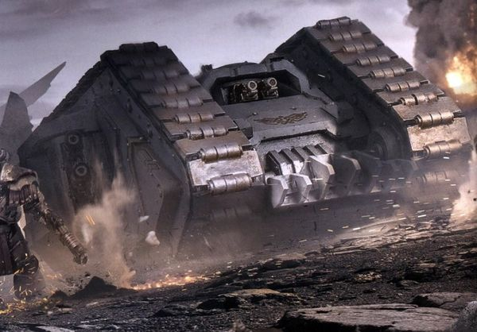
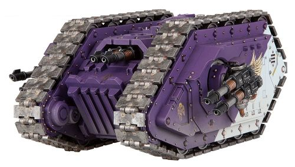
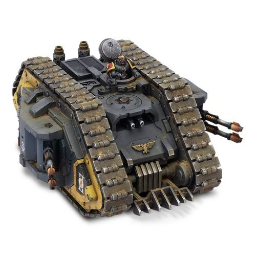

# 1506 普罗透斯兰德掠袭者 Land Raider Proteus

精校状态：中文行文已逐段精校，部分术语仍为暂定

分类：载具 / 地面 / 重型

原文来源：https://www.bilibili.com/opus/1045553687353622530

原作者：帝国神选罐头

原文时间：2025年03月18日 13:22

[返回分类目录](目录.md) · [全书目录](../../目录.md)

<!-- A1506-B0001 -->
**英文原文**

The Land Raider Proteus is an old and rare variant of Land Raider.

<!-- /A1506-B0001 -->

<!-- A1506-B0002 -->

原译文

兰德掠袭者普罗透斯是兰德掠袭者的一种古老而罕见的变体。

**校订译文**

兰德掠袭者普罗透斯是兰德掠袭者的一种古老而罕见的变体。

<!-- /A1506-B0002 -->

<!-- A1506-B0003 图片 -->

<!-- A1506-B0004 -->

原译文

Land Raider Proteus 兰德掠袭者普罗透斯

**校订译文**

Land Raider Proteus 兰德掠袭者普罗透斯

<!-- /A1506-B0004 -->

<!-- A1506-B0005 -->
## History 历史

<!-- /A1506-B0005 -->

<!-- A1506-B0006 -->
**英文原文**

The Proteus was first forged sometime during the Dark Age of Technology or before, but rediscovered during the Great Crusade in the vaults of Mars. It is thought that originally the Land Raider was used for exploration and scouting hostile worlds. It was only in later more warlike times that it was converted into a potent warmachine.

<!-- /A1506-B0006 -->

<!-- A1506-B0007 -->

原译文

普罗透斯最初是在黑暗技术时代或之前的某个时候铸造的，但在大远征期间在火星的秘库中被重新发现。人们认为，最初兰德掠袭者是用于探索和侦察敌对世界的。直到后来更好战的时代，它才被转化为一种强大的战争机器。

**校订译文**

普罗透斯型最早诞生于科技黑暗时代或更早时期，其设计在大远征期间于火星秘库中被重新发现。人们认为，兰德掠袭者原本用于探索、侦察环境险恶的世界，直到后来的纷争年代，才被改造成强大的战争机器。

<!-- /A1506-B0007 -->

<!-- A1506-B0008 -->
**英文原文**

The Proteus contains extraordinarily powerful augury systems, allowing it to scan battlefield conditions with extreme precision. Due to this improvement, it has been thought that this tank is the origin of all modern Land Raider designs, intended to explore and conquer new worlds. Its sensor systems make it useful as both a command tank and the leader of an armored spearhead; however, due to the fact that it lacks a forward assault ramp and has a lower troop capacity, as well as being harder to reproduce, makes it a rare sight in the 41st Millennium. Despite this, it is still valued as a rare war relic by the Space Marine Chapters lucky enough to own them.

<!-- /A1506-B0008 -->

<!-- A1506-B0009 -->

原译文

普罗透斯包含非常强大的鸟卜仪系统，使其能够以极高的精度扫描战场条件。由于这一改进，人们认为这款坦克是所有现代兰德掠袭者设计的起源，旨在探索和征服新世界。它的传感器系统使其既可以作为指挥坦克，也可以作为装甲先锋的领导者；然而，由于它缺乏前方突击坡道，部队运输较低，而且更难复制，这使得它在第41个千年中很少见。尽管如此，它仍然被幸运地拥有它们的星际战士战团视为罕见的战争圣物。

**校订译文**

普罗透斯型拥有极为强大的鸟卜系统，能精确扫描战场状况。由于具备这种先进能力，人们认为它是所有现代兰德掠袭者设计的源头，原本用于探索、征服新世界。其传感系统使它既能担任指挥坦克，也能引领装甲突击矛头。但由于没有前置突击跳板、运兵量较低且难以仿造，到第41个千年时，这一型号已十分罕见。即便如此，有幸拥有它的星际战士战团仍将其视为珍贵的战争圣物。

**校注：** 本段称缺少前置突击跳板，后文运输者改型却明确有跳板；按具体改型保留叙述差异，不把前者套至所有子型。

<!-- /A1506-B0009 -->

<!-- A1506-B0010 -->
### Chaos Land Raider Proteus 混沌兰德掠袭者普罗透斯

<!-- /A1506-B0010 -->

<!-- A1506-B0011 -->
**英文原文**

During the Horus Heresy, some Traitor Legions managed to acquire some Proteus variants and take them with them into the Eye of Terror, where the Dark Mechanicus attempts to keep them battleworthy. Much of the time, the Dark Mechanicus replaces any failing components with devices of Chaotic origin.

<!-- /A1506-B0011 -->

<!-- A1506-B0012 -->

原译文

在荷鲁斯叛乱期间，一些叛徒军团设法获得了一些普罗透斯变体，并将其带入恐惧之眼，黑暗机械教试图让它们保持战斗力。在大多数情况下，黑暗机械教会用混沌起源的设备替换任何故障组件。

**校订译文**

荷鲁斯之乱期间，一些叛徒军团获得了普罗透斯型，并将它们带入恐惧之眼。黑暗机械教在那里设法维持这些战车的战斗力，往往以混沌技术制造的装置替换失效部件。

<!-- /A1506-B0012 -->

<!-- A1506-B0013 -->
### Proteus Carrier 普罗透斯运输者

<!-- /A1506-B0013 -->

<!-- A1506-B0014 -->
**英文原文**

Since the earliest days of the Great Crusade, formations of Land Raider Proteus Carriers could each ferry entire squads of Legionaries across open ground and into the heart of the battlefield. They were trusted by the Legions due to the near-inviolate protection the Carriers offered, as their thickly armored hulls were impervious to all but dedicated anti-tank weaponry. The Carriers were also prodigiously armed and their mighty tracks provided much valued speed and maneuverability to allow the Carriers to reach their objectives. When the position was reached, the immense armored prow of each Carrier would open fully into an assault ramp, allowing the Legionaries to emerge unscathed to rapidly disembark with their guns blazing and blades bared.

<!-- /A1506-B0014 -->

<!-- A1506-B0015 -->

原译文

从大远征的早期开始，兰德掠袭者普罗透斯运输者的编队可以将整个军团运送到开阔地，进入战场中心。由于运输车提供了近乎不可侵犯的保护，他们受到了军团的信任，因为他们的厚装甲车体除了专用的反坦克武器外，其他所有武器都是不可侵犯的。运输者也装备了大量武器，其强大的履带提供了非常有价值的速度和机动性，使运输者能够实现目标。当到达阵地时，每辆运输者的巨大装甲车头将完全打开一个突击坡道，让军团士兵毫发无损地迅速下车，炮火轰鸣，刀刃出鞘。

**校订译文**

从大远征初期起，普罗透斯运输者型兰德掠袭者就成建制投入使用，每辆都能载着一整支军团战士小队穿过开阔地，直达战场中心。其厚重车体装甲几乎牢不可破，只有专用反坦克武器能击穿，因此深受各军团信赖。车辆武装强大，坚实的履带又赋予其宝贵的速度与机动性，使其能够抵达目标。到达阵地后，巨大的装甲车首会完全展开，形成突击跳板，让车内战士毫发无伤地迅速下车，枪口喷火、利刃出鞘。

**校注：** squads of Legionaries为军团战士小队，不是整个军团。

<!-- /A1506-B0015 -->

<!-- A1506-B0016 图片 -->

<!-- A1506-B0017 -->

原译文

Land Raider Proteus Carrier 兰德掠袭者普罗透斯运输者

**校订译文**

Land Raider Proteus Carrier 兰德掠袭者普罗透斯运输者

<!-- /A1506-B0017 -->

<!-- A1506-B0018 -->
**英文原文**

The Carriers, however, were vulnerable to close assaults, where power fists could rip open sealed hatches, and melta bombs could be used to blast tracks from their runners. Astute commanders, though, would assign infantry squads to screen vehicle columns from such attack, such as in tight city streets or narrow canyons. During the Horus Heresy, Land Raider Proteus Carriers proved time and again to be invaluable assets to their Legions, and priority targets for the foes they were sent against.

<!-- /A1506-B0018 -->

<!-- A1506-B0019 -->

原译文

然而，运输者很容易受到近距离攻击，在这种情况下，动力拳可以撕开密封的舱口，而热熔炸弹可以用来炸毁他们的坡道。然而，精明的指挥官会指派步兵小队在狭窄的城市街道或狭窄的峡谷中掩护车辆纵队免受此类袭击。在荷鲁斯叛乱期间，兰德掠袭者普罗透斯运输者一次又一次地被证明是他们军团的宝贵资产，也是他们被派去对抗的敌人的优先目标。

**校订译文**

不过，运输者型容易遭受近身突击：动力拳能够撕开密封舱门，热熔炸弹则能将履带从行走机构上炸脱。因此，精明的指挥官会在狭窄街道或峡谷等地派步兵小队掩护车队。荷鲁斯之乱期间，普罗透斯运输者型一再证明自己是军团不可多得的装备，同时也是敌人优先打击的目标。

**校注：** blast tracks from their runners指炸脱履带，并非炸毁坡道。

<!-- /A1506-B0019 -->

<!-- A1506-B0020 -->
### Proteus Explorator 普罗透斯探索者

<!-- /A1506-B0020 -->

<!-- A1506-B0021 -->
**英文原文**

A reconnaissance variant closer to the original design of the Land Raider during the Dark Age of Technology. In place of lessened transportation capability, the Proteus Explorator carried sophisticated navigational systems that allowed for scouting and traversing the most harsh terrain. Several of the more mobile Legions such as the Raven Guard and White Scars showed a preference for this design during the Great Crusade.

<!-- /A1506-B0021 -->

<!-- A1506-B0022 -->

原译文

一种侦察变体，更接近黑暗技术时代兰德掠袭者的原始设计。普罗透斯探索者没有降低运输能力，而是搭载了复杂的导航系统，可以侦察和穿越最恶劣的地形。在大远征期间，暗鸦守卫和白色伤疤等几个更机动的军团表现出对这种设计的偏好。

**校订译文**

普罗透斯探索者型是侦察改型，更接近科技黑暗时代兰德掠袭者的原始设计。它牺牲了部分运兵能力，换装复杂的导航系统，以便侦察并穿越最恶劣的地形。大远征期间，暗鸦守卫、白疤等重视机动作战的军团尤其偏爱这一设计。

**校注：** 英文措辞In place of lessened transportation capability不够顺畅，但结合设备与运兵空间的交换关系，译为牺牲部分运兵能力；原译“没有降低运输能力”不成立。

<!-- /A1506-B0022 -->

<!-- A1506-B0023 图片 -->

<!-- A1506-B0024 -->

原译文

Land Raider Proteus Explorator 兰德掠袭者普罗透斯探索者

**校订译文**

Land Raider Proteus Explorator 兰德掠袭者普罗透斯探索者

<!-- /A1506-B0024 -->

<!-- A1506-B0025 -->
## Weapons and Armament 武器与军备

<!-- /A1506-B0025 -->

<!-- A1506-B0026 -->
**英文原文**

The Land Raider Proteus is armed with two sponson-mounted twin-linked lascannons, in addition to its auguries and cogitators. They also contain a Machine Spirit (or in the case of Chaos variants, an Infernal Device), and can be upgraded with hull-mounted Heavy Bolters or Heavy Flamers, Ceramite armour to lessen the damage of Melta weapons, a Hunter-Killer missile (or Havoc launcher with Chaotic variants), pintle mounted weapons, Extra Armour, and a Dozer Blade.

<!-- /A1506-B0026 -->

<!-- A1506-B0027 -->

原译文

兰德掠袭者普罗透斯除了其鸟卜仪和沉思者外，还配备了两个安装在舷侧的双联激光炮。它们还包含一个机魂（或者在混沌变体的情况下，一个炼狱装置），可以升级为车体安装的重型爆矢枪或重型火焰枪、减少热熔武器伤害的陶钢装甲、猎杀飞弹（或混沌变体的浩劫发射器）、枢轴安装的武器、额外装甲和推土机铲刀。

**校订译文**

除鸟卜仪和沉思者外，普罗透斯型还在两侧侧舱装备了2组双联激光炮。车内配有机魂，混沌改型则配有炼狱装置。可选升级包括车体安装的重型爆矢枪或重型火焰喷射器、降低热熔武器伤害的陶钢装甲、猎杀导弹（混沌改型可选浩劫发射器）、枢轴武器、附加装甲以及推土铲。

<!-- /A1506-B0027 -->

<!-- A1506-B0028 -->
**英文原文**

Some Land Raider Proteuses were also equipped with an Explorator Augury Web.

<!-- /A1506-B0028 -->

<!-- A1506-B0029 -->

原译文

一些兰德掠袭者普罗透斯还配备了探索者鸟卜仪网络。

**校订译文**

一些兰德掠袭者普罗透斯还配备了探索者鸟卜仪网络。

<!-- /A1506-B0029 -->

<!-- A1506-B0030 -->
## Technical Information 技术资料

原题：Technical Information 技术信息

<!-- /A1506-B0030 -->

<!-- A1506-B0031 -->
**英文原文**

Vehicle Name:Land Raider Proteus

<!-- /A1506-B0031 -->

<!-- A1506-B0032 -->

原译文

载具名称：兰德掠袭者普罗透斯

**校订译文**

载具名称：兰德掠袭者普罗透斯

<!-- /A1506-B0032 -->

<!-- A1506-B0033 -->
**英文原文**

Forge World of Origin:Anvilus IX

<!-- /A1506-B0033 -->

<!-- A1506-B0034 -->

原译文

起源铸造世界：安维鲁斯九号

**校订译文**

起源铸造世界：安维鲁斯九号

<!-- /A1506-B0034 -->

<!-- A1506-B0035 -->
**英文原文**

Known Patterns:I-X

<!-- /A1506-B0035 -->

<!-- A1506-B0036 -->

原译文

已知型号：I - X

**校订译文**

已知型号：I - X

<!-- /A1506-B0036 -->

<!-- A1506-B0037 -->
**英文原文**

Crew:Driver, Commander

<!-- /A1506-B0037 -->

<!-- A1506-B0038 -->

原译文

乘员：驾驶员、指挥官

**校订译文**

乘员：驾驶员、指挥官

<!-- /A1506-B0038 -->

<!-- A1506-B0039 -->
**英文原文**

Powerplant:Open-core Plasma ioniser

<!-- /A1506-B0039 -->

<!-- A1506-B0040 -->

原译文

动力装置：开放式核心等离子电离器

**校订译文**

动力装置：开放式核心等离子电离器

<!-- /A1506-B0040 -->

<!-- A1506-B0041 -->
**英文原文**

Weight:71 tonnes

<!-- /A1506-B0041 -->

<!-- A1506-B0042 -->

原译文

重量：71吨

**校订译文**

重量：71吨

<!-- /A1506-B0042 -->

<!-- A1506-B0043 -->
**英文原文**

Length:8.5m

<!-- /A1506-B0043 -->

<!-- A1506-B0044 -->

原译文

长度：8.5米

**校订译文**

长度：8.5米

<!-- /A1506-B0044 -->

<!-- A1506-B0045 -->
**英文原文**

Width:5.2m

<!-- /A1506-B0045 -->

<!-- A1506-B0046 -->

原译文

宽度：5.2米

**校订译文**

宽度：5.2米

<!-- /A1506-B0046 -->

<!-- A1506-B0047 -->
**英文原文**

Height:4.8m

<!-- /A1506-B0047 -->

<!-- A1506-B0048 -->

原译文

高度：4.8米

**校订译文**

高度：4.8米

<!-- /A1506-B0048 -->

<!-- A1506-B0049 -->
**英文原文**

Ground Clearance:0.85m

<!-- /A1506-B0049 -->

<!-- A1506-B0050 -->

原译文

离地间隙：0.85m

**校订译文**

离地间隙：0.85米

<!-- /A1506-B0050 -->

<!-- A1506-B0051 -->
**英文原文**

Fording Depth:

<!-- /A1506-B0051 -->

<!-- A1506-B0052 -->

原译文

涉水深度：

**校订译文**

涉水深度：未提供

<!-- /A1506-B0052 -->

<!-- A1506-B0053 -->
**英文原文**

Max Speed - on road44kph

<!-- /A1506-B0053 -->

<!-- A1506-B0054 -->

原译文

最大速度-公路上44公里/小时

**校订译文**

最大速度-公路上44公里/小时

<!-- /A1506-B0054 -->

<!-- A1506-B0055 -->
**英文原文**

Max Speed - off road:???

<!-- /A1506-B0055 -->

<!-- A1506-B0056 -->

原译文

越野最大速度：？？？

**校订译文**

最大越野速度：不详

<!-- /A1506-B0056 -->

<!-- A1506-B0057 -->
**英文原文**

Transport Capacity:10 (5)

<!-- /A1506-B0057 -->

<!-- A1506-B0058 -->

原译文

运输能力：10（5）

**校订译文**

运兵能力：10名动力甲战士，或5名终结者

<!-- /A1506-B0058 -->

<!-- A1506-B0059 -->
**英文原文**

Access Points:N/A

<!-- /A1506-B0059 -->

<!-- A1506-B0060 -->

原译文

入口：无

**校订译文**

出入口：未提供（N/A）

<!-- /A1506-B0060 -->

<!-- A1506-B0061 -->
**英文原文**

Main Armament:2x Twin-linked Lascannons

<!-- /A1506-B0061 -->

<!-- A1506-B0062 -->

原译文

主武器：2门双联激光炮

**校订译文**

主武器：2门双联激光炮

<!-- /A1506-B0062 -->

<!-- A1506-B0063 -->
**英文原文**

Secondary Armament:2x Twin-linked Heavy Bolter

<!-- /A1506-B0063 -->

<!-- A1506-B0064 -->

原译文

二级武器：2x双联重型螺栓枪

**校订译文**

副武器：2组双联重型爆矢枪

<!-- /A1506-B0064 -->

<!-- A1506-B0065 -->
**英文原文**

Traverse:180°

<!-- /A1506-B0065 -->

<!-- A1506-B0066 -->

原译文

横向：180°

**校订译文**

水平射界：180°

<!-- /A1506-B0066 -->

<!-- A1506-B0067 -->
**英文原文**

Elevation:From -32° to +42°

<!-- /A1506-B0067 -->

<!-- A1506-B0068 -->

原译文

仰角：从-32°到+42°

**校订译文**

俯仰角：−32°至＋42°

<!-- /A1506-B0068 -->

<!-- A1506-B0069 -->
**英文原文**

Main Ammunition:Unlimited cell power feed

<!-- /A1506-B0069 -->

<!-- A1506-B0070 -->

原译文

主要弹药：无限电池供电

**校订译文**

主武器弹药：动力单元供能，无弹药数量限制

<!-- /A1506-B0070 -->

<!-- A1506-B0071 -->
**英文原文**

Secondary Ammunition:800 rounds

<!-- /A1506-B0071 -->

<!-- A1506-B0072 -->

原译文

二级弹药：800发

**校订译文**

副武器载弹量：800发

<!-- /A1506-B0072 -->

<!-- A1506-B0073 -->
### Armour 装甲

<!-- /A1506-B0073 -->

<!-- A1506-B0074 -->
**英文原文**

Superstructure:93mm

<!-- /A1506-B0074 -->

<!-- A1506-B0075 -->

原译文

上部结构：93毫米

**校订译文**

上部结构：93毫米

<!-- /A1506-B0075 -->

<!-- A1506-B0076 -->
**英文原文**

Hull:95mm

<!-- /A1506-B0076 -->

<!-- A1506-B0077 -->

原译文

车体：95毫米

**校订译文**

车体：95毫米

<!-- /A1506-B0077 -->

<!-- A1506-B0078 -->
**英文原文**

Gun Mantlet:N/A

<!-- /A1506-B0078 -->

<!-- A1506-B0079 -->

原译文

炮盾：无

**校订译文**

炮盾：不适用

<!-- /A1506-B0079 -->

<!-- A1506-B0080 -->
**英文原文**

Vehicle Designation:0120-766-0724-PR 142

<!-- /A1506-B0080 -->

<!-- A1506-B0081 -->

原译文

载具编号：0120-766-0724-PR 142

**校订译文**

载具编号：0120-766-0724-PR 142

<!-- /A1506-B0081 -->

<!-- A1506-B0082 -->
**英文原文**

Firing Ports:N/A

<!-- /A1506-B0082 -->

<!-- A1506-B0083 -->

原译文

开火口：无

**校订译文**

射击孔：不适用

<!-- /A1506-B0083 -->

<!-- A1506-B0084 -->
**英文原文**

Turret:N/A

<!-- /A1506-B0084 -->

<!-- A1506-B0085 -->

原译文

炮塔：无

**校订译文**

炮塔：不适用

<!-- /A1506-B0085 -->

<!-- A1506-B0086 -->
## Named Land Raider Proteuses 著名兰德掠袭者普罗透斯

<!-- /A1506-B0086 -->

<!-- A1506-B0087 -->
**英文原文**

Flame of Illyrium - Ultramarines

<!-- /A1506-B0087 -->

<!-- A1506-B0088 -->

原译文

伊利瑞姆之焰 - 极限战士

**校订译文**

伊利里亚姆之焰号——极限战士所属。

<!-- /A1506-B0088 -->

<!-- A1506-B0089 -->
**英文原文**

Onogura — White Scars

<!-- /A1506-B0089 -->

<!-- A1506-B0090 -->

原译文

奥诺古拉 — 白色疤痕

**校订译文**

奥诺古拉号——白疤所属。

<!-- /A1506-B0090 -->

<!-- A1506-B0091 -->
**英文原文**

Orlandra — Fire Hawks

<!-- /A1506-B0091 -->

<!-- A1506-B0092 -->

原译文

奥兰德拉 — 火鹰

**校订译文**

奥兰德拉号——火鹰所属。

<!-- /A1506-B0092 -->

<!-- A1506-B0093 -->
**英文原文**

Simurgh Rex — Night Swords

<!-- /A1506-B0093 -->

<!-- A1506-B0094 -->

原译文

西莫尔格之王 — 暗夜之剑

**校订译文**

西莫尔格之王号——暗夜之剑所属。

<!-- /A1506-B0094 -->

本篇核心术语与暂定项

以下列出本篇出现的英文原形及核心术语表用词。同形词可能指不同对象，具体词义以本篇正文和校注为准；单复数、别名和仅见于图注的名称可能尚未列入。完整候选见[术语表](../../术语表/双语术语候选.csv)。

| 英文 | 采用中文 | 状态 |
| --- | --- | --- |
| Ultramarines | 极限战士 | 官方已核对 |
| Horus Heresy | 荷鲁斯之乱 | 官方已核对 |
| Dark Age of Technology | 黑暗科技时代 | 暂定 |
| Eye of Terror | 恐惧之眼 | 官方已核对 |
| Forge World | 铸造世界 | 暂定·官方待核 |
| Great Crusade | 大远征 | 暂定·官方待核 |
| Horus | 荷鲁斯 | 暂定·官方待核 |
| Hunter-Killer | 猎杀者 | 暂定·官方待核 |
| Mars | 火星 | 暂定·官方待核 |
| Land Raider | 兰德掠袭者战车 | 官方已核对 |
| Night Swords | 夜剑 | 暂定·官方待核 |
| White Scars | 白疤 | 官方已核 |
| Raven Guard | 暗鸦守卫 | 官方已核 |
| Scars | 伤疤 | 暂定·官方待核 |
| Space Marine | 星际战士 | 暂定·官方待核 |
| Fire Hawks | 火鹰 | 暂定·官方待核 |
| Dark Mechanicus | 黑暗机械教 | 暂定·官方待核 |
| Flamers | 火妖（奸奇单位）／火焰喷射器（武器） | 语境定译·对应官译已核 |
| Proteus | 普罗透斯 | 暂定·官方待核 |
| Raider | 掠袭者飞艇 | 官方已核对 |
| Gun | 甘 | 暂定·官方待核 |
| The Dark | 《黑暗》 | 暂定·官方待核 |
| Illyrium | 伊利里亚姆 | 暂定·官方待核 |
| Havoc Launcher | 浩劫发射器 | 暂定·官方待核 |
| Hunter-killer missile | 猎杀导弹 | 官方已核对 |
| Anvilus | 安维鲁斯 | 暂定·官方待核 |
| Bolter | 爆矢枪 | 暂定·官方待核 |
| Heavy bolter | 重型爆矢枪 | 官方已核对 |
| Melta Weapons | 热熔武器 | 暂定·官方待核 |
| Dozer Blade | 推土铲刀 | 暂定·官方待核 |
| Extra Armour | 额外装甲 | 暂定·官方待核 |
| Land Raider Proteus | 普罗透斯型兰德掠袭者 | 暂定·官方待核 |
| Flame of Illyrium | 伊利里亚姆之焰号 | 暂定·官方待核 |
| Onogura | 奥诺古拉号 | 暂定·官方待核 |
| Orlandra | 奥兰德拉号 | 暂定·官方待核 |
| Simurgh Rex | 西莫尔格之王号 | 暂定·官方待核 |

