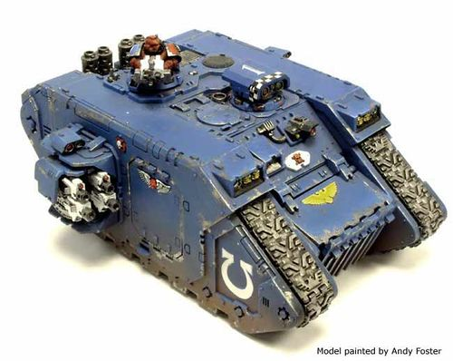
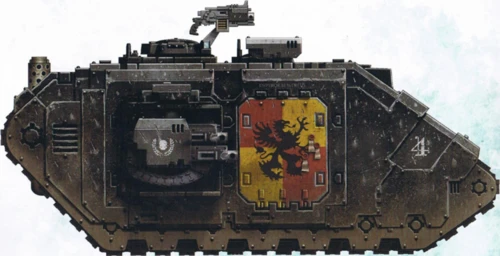

# 1507 普罗米修斯型兰德掠袭者战车 Land Raider Prometheus

精校状态：中文行文已逐段精校，部分术语仍为暂定

分类：载具 / 地面 / 重型

原文来源：https://www.bilibili.com/opus/1039945280430014468

原作者：帝国神选罐头

原文时间：2025年03月03日 10:38

[返回分类目录](目录.md) · [全书目录](../../目录.md)

原篇名：普罗米修斯兰德掠袭者 Land Raider Prometheus

<!-- A1507-B0001 -->
**英文原文**

The Land Raider Prometheus is a specialist Space Marine command tank based on the Land Raider chassis.

<!-- /A1507-B0001 -->

<!-- A1507-B0002 -->

原译文

兰德掠袭者普罗米修斯是基于兰德掠袭者底盘的专业星际战士指挥坦克。

**校订译文**

普罗米修斯型兰德掠袭者是星际战士在兰德掠袭者底盘上研制的专用指挥坦克。

<!-- /A1507-B0002 -->

<!-- A1507-B0003 -->
## History 历史

<!-- /A1507-B0003 -->

<!-- A1507-B0004 -->
**英文原文**

The exact origins of the 'Prometheus' pattern Land Raider remains a mystery. Some Tech-adepts believe it to be a variant of the 'Tartarus' pattern Land Raider, due to the striking similarities between the two. Although no clear evidence has been found to support this claim there is at least one archival report that depicts the vehicle, or else one that closely resembles it, that fought on the side of the Loyalists during the early period of the Horus Heresy. Others believe that it was the Salamanders which first produced it as they retain more Prometheus models, than any other Chapter (however, the Salamanders deny this claim). In any case, the number of Chapters which do have a Prometheus within their Armouries is unknown. For example, the White Scars only have four of these Land Raiders. There is even another version that the origins of 'Prometheus' where in fact founded by the Landites - followers of the famous Arkhan Land.

<!-- /A1507-B0004 -->

<!-- A1507-B0005 -->

原译文

“普罗米修斯”型兰德掠袭者的确切起源仍然是个谜。一些技术专家认为，由于两者之间惊人的相似性，它是“塔尔塔罗斯”型兰德掠袭者的变体。尽管没有发现明确的证据支持这一说法，但至少有一份档案报告描述了荷鲁斯叛乱早期为忠诚派而战的载具，或者与之非常相似的载具。其他人认为，是火蜥蜴第一次生产了它，因为它们比其他任何战团都保留了更多的普罗米修斯型（然而，火蜥蜴否认了这一说法）。无论如何，军械库中有普罗米修斯的战团数量是未知的。例如，白色疤痕只有四个这样的兰德掠袭者。甚至还有另一种说法，即“普罗米修斯”的起源实际上是由著名的阿坎·兰德的追随者兰德学派建立的。

**校订译文**

普罗米修斯型兰德掠袭者的确切起源仍然成谜。一些技术教士认为，它与塔尔塔罗斯型极为相似，因而应是后者的改型。尽管尚无确切证据支持这一说法，但至少有一份档案记载，在荷鲁斯之乱早期，这种车辆或与其十分相似的车辆曾为忠诚派作战。另一些人认为它由火蜥蜴率先制造，因为该战团保有的普罗米修斯型比任何其他战团都多；火蜥蜴却否认这一说法。究竟有多少战团在军械库中配有这种车辆，目前不得而知。例如，白疤仅有4辆。还有一种说法认为，这项设计出自著名的阿坎·兰德的追随者——兰德学派。

<!-- /A1507-B0005 -->

<!-- A1507-B0006 图片 -->

<!-- A1507-B0007 -->

原译文

Ultramarines Land Raider Prometheus 极限战士兰德掠袭者普罗米修斯

**校订译文**

Ultramarines Land Raider Prometheus 极限战士兰德掠袭者普罗米修斯

<!-- /A1507-B0007 -->

<!-- A1507-B0008 -->
**英文原文**

The most famous example of a Prometheus used in battle during the Masali Campaign, when Captain Cato Sicarius of the Ultramarines used his Prometheus to turn the tide of battle against Eldar pirates, in the process earning the first-class Marksman's Honour badge.

<!-- /A1507-B0008 -->

<!-- A1507-B0009 -->

原译文

最著名的普罗米修斯在是马萨里之战中使用的例子，极限战士的卡托·西卡留斯连长用他的普罗米修斯扭转了与灵族海盗的战斗局面，并在此过程中获得了一级神枪手荣誉徽章。

**校订译文**

普罗米修斯型最著名的战例发生在马萨里战役中。极限战士连长卡托·西卡留斯凭借自己的普罗米修斯型战车，扭转了对灵族海盗作战的不利局面，并因此获得一级神枪手荣誉徽章。

<!-- /A1507-B0009 -->

<!-- A1507-B0010 -->
## Design Features 设计特点

<!-- /A1507-B0010 -->

<!-- A1507-B0011 -->
**英文原文**

The primary differences between the Prometheus and standard Land Raiders is its armament and equipment. The lascannons normally mounted in the side sponsons are replaced with two twin-linked heavy bolters, with a pintle-mounted storm bolter replacing the hull-mounted heavy bolters. These changes are necessary to make room for the additional command and control equipment.

<!-- /A1507-B0011 -->

<!-- A1507-B0012 -->

原译文

普罗米修斯和标准兰德掠袭者之间的主要区别在于它的武器和装备。通常安装在侧舷上的激光炮被两个双联重型爆矢枪所取代，枢轴式风暴爆矢枪取代了车体式重型爆矢枪。这些变化是必要的，以便为额外的指挥和控制设备腾出空间。

**校订译文**

普罗米修斯型与标准兰德掠袭者的主要区别在于武器和设备：侧舱中通常安装的激光炮换成2组双联重型爆矢枪；车体安装的重型爆矢枪则由枢轴安装的风暴爆矢枪取代。这些改动为新增的指挥控制设备腾出了空间。

**校注：** 英文正文说2组双联重型爆矢枪，未明确是否每侧；本篇技术表总数为4组。保留两处措辞并提示核对配置。

<!-- /A1507-B0012 -->

<!-- A1507-B0013 -->
**英文原文**

Supplementing the Land Raider's tactical holosphere and squad status displays is a set of gear very similar to that found in a Damocles Command Rhino: highly sophisticates battle auspex scanners, interpretative logic-engines and a powerful comms array. Though not as extensive or advanced, it still allows the Prometheus to coordinate between the battlegroup and allied forces, intercept and decrypt enemy communications, and track their movements with multi-spectral auspex gear. The trade-off comes at the fact that the Prometheus still functions as a front-line combat vehicle, allowing the Space Marine Commander to lead from the front.

<!-- /A1507-B0013 -->

<!-- A1507-B0014 -->

原译文

除了兰德掠袭者的战术全息图和小队状态显示外，还有一套与达摩克利斯犀牛指挥车非常相似的装备：高度复杂的战斗鸟卜扫描仪、解释性逻辑引擎和强大的通信阵列。虽然没有那么广泛或先进，但它仍然允许普罗米修斯在战斗组和盟军之间进行协调，拦截和解密敌人的通信，并使用多光谱鸟卜仪装置跟踪他们的行动。这种权衡是因为普罗米修斯仍然作为前线作战车辆发挥作用，允许星际战士指挥官在前线领导。

**校订译文**

除了兰德掠袭者原有的战术全息球和小队状态显示装置，普罗米修斯型还配有一套与达摩克利斯指挥犀牛相似的设备，包括先进的战场鸟卜扫描仪、解析用逻辑引擎以及大功率通讯阵列。虽然设备的覆盖能力与先进程度不及后者，它仍能协调战斗群与友军行动，截获并破译敌方通讯，并以多光谱鸟卜设备追踪敌军。作为取舍，普罗米修斯型保留了前线战斗能力，让星际战士指挥官得以亲临前线指挥。

<!-- /A1507-B0014 -->

<!-- A1507-B0015 -->
**英文原文**

The Prometheus's transport capacity is only slightly diminished by the equipment as it is able to carry ten Space Marines in power armour or five in Terminator armour. Besides a Searchlight and Smoke Launchers it can be further upgraded with Extra Armour, a Hunter-Killer Missile and a pintle-mounted Multi-melta.

<!-- /A1507-B0015 -->

<!-- A1507-B0016 -->

原译文

普罗米修斯的运输能力因装备而略有下降，因为它能够携带10名身穿动力盔甲的星际战士或5名身穿终结者盔甲的星际战士。除了探照灯和烟雾发射器外，它还可以进一步升级额外装甲、猎杀飞弹和枢轴式多管热熔。

**校订译文**

新增设备只略微减少了普罗米修斯型的运兵空间；它仍可搭载10名动力甲星际战士或5名终结者。除探照灯和烟雾发射器外，还可加装附加装甲、猎杀导弹和枢轴安装的多管热熔。

**校注：** 源文称运兵能力略有减少，同时给出10／5；标准车型在1500也为10／5，保留底稿差异。

<!-- /A1507-B0016 -->

<!-- A1507-B0017 -->
## Technical Information 技术资料

原题：Technical Information 技术信息

<!-- /A1507-B0017 -->

<!-- A1507-B0018 -->
**英文原文**

Vehicle Name:Land Raider Prometheus

<!-- /A1507-B0018 -->

<!-- A1507-B0019 -->

原译文

载具名称：兰德掠袭者普罗米修斯

**校订译文**

载具名称：兰德掠袭者普罗米修斯

<!-- /A1507-B0019 -->

<!-- A1507-B0020 -->
**英文原文**

Forge World of Origin:Macragge

<!-- /A1507-B0020 -->

<!-- A1507-B0021 -->

原译文

起源铸造世界：马库拉格

**校订译文**

起源铸造世界：马库拉格

<!-- /A1507-B0021 -->

<!-- A1507-B0022 -->
**英文原文**

Known Patterns:I-VI

<!-- /A1507-B0022 -->

<!-- A1507-B0023 -->

原译文

已知型号：I - VI

**校订译文**

已知型号：I - VI

<!-- /A1507-B0023 -->

<!-- A1507-B0024 -->
**英文原文**

Crew:Driver, Commander

<!-- /A1507-B0024 -->

<!-- A1507-B0025 -->

原译文

乘员：驾驶员、指挥官

**校订译文**

乘员：驾驶员、指挥官

<!-- /A1507-B0025 -->

<!-- A1507-B0026 -->
**英文原文**

Powerplant:Adaptable Thermic Combustion w/ Auxilliary Reactor

<!-- /A1507-B0026 -->

<!-- A1507-B0027 -->

原译文

动力装置：配备辅助反应堆的自适应热燃烧装置

**校订译文**

动力装置：配备辅助反应堆的自适应热燃烧装置

<!-- /A1507-B0027 -->

<!-- A1507-B0028 -->
**英文原文**

Weight:72.0 tonnes

<!-- /A1507-B0028 -->

<!-- A1507-B0029 -->

原译文

重量：72.0吨

**校订译文**

重量：72.0吨

<!-- /A1507-B0029 -->

<!-- A1507-B0030 -->
**英文原文**

Length:10.3m

<!-- /A1507-B0030 -->

<!-- A1507-B0031 -->

原译文

长度：10.3米

**校订译文**

长度：10.3米

<!-- /A1507-B0031 -->

<!-- A1507-B0032 -->
**英文原文**

Width:6.1m

<!-- /A1507-B0032 -->

<!-- A1507-B0033 -->

原译文

宽度：6.1米

**校订译文**

宽度：6.1米

<!-- /A1507-B0033 -->

<!-- A1507-B0034 -->
**英文原文**

Height:4.31m

<!-- /A1507-B0034 -->

<!-- A1507-B0035 -->

原译文

高度：4.31米

**校订译文**

高度：4.31米

<!-- /A1507-B0035 -->

<!-- A1507-B0036 -->
**英文原文**

Ground Clearance:0.45m

<!-- /A1507-B0036 -->

<!-- A1507-B0037 -->

原译文

离地间隙：0.45m

**校订译文**

离地间隙：0.45米

<!-- /A1507-B0037 -->

<!-- A1507-B0038 -->
**英文原文**

Fording Depth:Fully submersible to 36.57m

<!-- /A1507-B0038 -->

<!-- A1507-B0039 -->

原译文

涉水深度：全潜至36.57m

**校订译文**

涉水深度：可完全潜入36.57米深的水下

<!-- /A1507-B0039 -->

<!-- A1507-B0040 -->
**英文原文**

Max Speed - on road55kph

<!-- /A1507-B0040 -->

<!-- A1507-B0041 -->

原译文

最大速度-公路上55公里/小时

**校订译文**

最大速度-公路上55公里/小时

<!-- /A1507-B0041 -->

<!-- A1507-B0042 -->
**英文原文**

Max Speed - off road:48kph

<!-- /A1507-B0042 -->

<!-- A1507-B0043 -->

原译文

最大速度-越野：48公里/小时

**校订译文**

最大速度-越野：48公里/小时

<!-- /A1507-B0043 -->

<!-- A1507-B0044 -->
**英文原文**

Transport Capacity:10 (5)

<!-- /A1507-B0044 -->

<!-- A1507-B0045 -->

原译文

运输能力：10（5）

**校订译文**

运兵能力：10名动力甲战士，或5名终结者

<!-- /A1507-B0045 -->

<!-- A1507-B0046 -->
**英文原文**

Access Points:3

<!-- /A1507-B0046 -->

<!-- A1507-B0047 -->

原译文

入口：3

**校订译文**

出入口：3处

<!-- /A1507-B0047 -->

<!-- A1507-B0048 -->
**英文原文**

Main Armament:4 x Twin-linked Heavy Bolters

<!-- /A1507-B0048 -->

<!-- A1507-B0049 -->

原译文

主武器：4个双联重型爆矢枪

**校订译文**

主武器：4组双联重型爆矢枪

<!-- /A1507-B0049 -->

<!-- A1507-B0050 -->
**英文原文**

Secondary Armament:Pintle-mounted Storm Bolter

<!-- /A1507-B0050 -->

<!-- A1507-B0051 -->

原译文

次要武器：枢轴式风暴爆矢枪

**校订译文**

副武器：枢轴安装的风暴爆矢枪

<!-- /A1507-B0051 -->

<!-- A1507-B0052 -->
**英文原文**

Traverse:180 degrees

<!-- /A1507-B0052 -->

<!-- A1507-B0053 -->

原译文

横向：180度

**校订译文**

水平射界：180°

<!-- /A1507-B0053 -->

<!-- A1507-B0054 -->
**英文原文**

Elevation:From -32 to +42 degrees

<!-- /A1507-B0054 -->

<!-- A1507-B0055 -->

原译文

仰角：从-32度到+42度

**校订译文**

俯仰角：−32°至＋42°

<!-- /A1507-B0055 -->

<!-- A1507-B0056 -->
**英文原文**

Main Ammunition:4800 rounds

<!-- /A1507-B0056 -->

<!-- A1507-B0057 -->

原译文

主要弹药：4800发

**校订译文**

主武器载弹量：4,800发

<!-- /A1507-B0057 -->

<!-- A1507-B0058 -->
**英文原文**

Secondary Ammunition:1000 rounds

<!-- /A1507-B0058 -->

<!-- A1507-B0059 -->

原译文

次要弹药：1000发

**校订译文**

副武器载弹量：1,000发

<!-- /A1507-B0059 -->

<!-- A1507-B0060 -->
### Armour 装甲

<!-- /A1507-B0060 -->

<!-- A1507-B0061 -->
**英文原文**

Superstructure:95mm

<!-- /A1507-B0061 -->

<!-- A1507-B0062 -->

原译文

上部结构：95mm

**校订译文**

上部结构：95mm

<!-- /A1507-B0062 -->

<!-- A1507-B0063 -->
**英文原文**

Hull:95mm

<!-- /A1507-B0063 -->

<!-- A1507-B0064 -->

原译文

车体：95mm

**校订译文**

车体：95mm

<!-- /A1507-B0064 -->

<!-- A1507-B0065 -->
**英文原文**

Gun Mantlet:N/A

<!-- /A1507-B0065 -->

<!-- A1507-B0066 -->

原译文

炮盾：无

**校订译文**

炮盾：不适用

<!-- /A1507-B0066 -->

<!-- A1507-B0067 -->
**英文原文**

Vehicle Designation:0120-766-0724-PR140

<!-- /A1507-B0067 -->

<!-- A1507-B0068 -->

原译文

载具编号：0120-766-0724-PR140

**校订译文**

载具编号：0120-766-0724-PR140

<!-- /A1507-B0068 -->

<!-- A1507-B0069 -->
**英文原文**

Firing Ports:N/A

<!-- /A1507-B0069 -->

<!-- A1507-B0070 -->

原译文

开火口：无

**校订译文**

射击孔：不适用

<!-- /A1507-B0070 -->

<!-- A1507-B0071 -->
**英文原文**

Turret:N/A

<!-- /A1507-B0071 -->

<!-- A1507-B0072 -->

原译文

炮塔：无

**校订译文**

炮塔：不适用

<!-- /A1507-B0072 -->

<!-- A1507-B0073 -->
## Known Named Land Raiders Prometheus 著名兰德掠袭者普罗米修斯

<!-- /A1507-B0073 -->

<!-- A1507-B0074 -->
**英文原文**

Angelis Imperator — Dark Angels. Personal transport of Supreme Grand Master Azrael during the Vraks Campaign.

<!-- /A1507-B0074 -->

<!-- A1507-B0075 -->

原译文

天使统领 - 黑暗天使。弗拉克斯战役期间至高大导师阿兹瑞尔的个人载具。

**校订译文**

天使统领号——黑暗天使所属。弗拉克斯战役期间，曾作为至高大导师阿兹瑞尔的专用座车。

<!-- /A1507-B0075 -->

<!-- A1507-B0076 -->
**英文原文**

Shield of Mancora — Howling Griffons/Executioners. Used by the Howling Griffons Fourth Company during the Badab War. It was immobilized and captured by the Executioners.

<!-- /A1507-B0076 -->

<!-- A1507-B0077 -->

原译文

曼科拉之盾——咆哮狮鹫/处刑者。在巴达布战争期间，咆哮狮鹫第四连使用。它被处刑者固定住并俘虏了。

**校订译文**

曼科拉之盾号——先后属于咆哮狮鹫和处刑者。巴达布战争期间由咆哮狮鹫第四连使用，后因丧失机动能力而被处刑者缴获。

<!-- /A1507-B0077 -->

<!-- A1507-B0078 图片 -->

<!-- A1507-B0079 -->

原译文

Howling Griffons' Shield of Mancora 咆哮狮鹫曼科拉之盾

**校订译文**

Howling Griffons' Shield of Mancora 咆哮狮鹫的曼科拉之盾号

<!-- /A1507-B0079 -->

本篇核心术语与暂定项

以下列出本篇出现的英文原形及核心术语表用词。同形词可能指不同对象，具体词义以本篇正文和校注为准；单复数、别名和仅见于图注的名称可能尚未列入。完整候选见[术语表](../../术语表/双语术语候选.csv)。

| 英文 | 采用中文 | 状态 |
| --- | --- | --- |
| Space Marines | 星际战士 | 官方已核对 |
| Dark Angels | 黑暗天使 | 官方已核对 |
| Eldar | 灵族 | 暂定·语境区分 |
| Terminator | 终结者 | 官方已核对 |
| Ultramarines | 极限战士 | 官方已核对 |
| Horus Heresy | 荷鲁斯之乱 | 官方已核对 |
| Equipment | 装备 | 编辑用语已统一 |
| Forge World | 铸造世界 | 暂定·官方待核 |
| Horus | 荷鲁斯 | 暂定·官方待核 |
| Hunter-Killer | 猎杀者 | 暂定·官方待核 |
| Marksman | 神射手 | 暂定·官方待核 |
| Salamanders | 火蜥蜴 | 暂定·官方待核 |
| Badab | 巴达布 | 暂定·官方待核 |
| Masali | 马萨里 | 暂定·官方待核 |
| Mancora | 曼科拉 | 暂定·官方待核 |
| Macragge | 马库拉格 | 暂定·官方待核 |
| Land Raider | 兰德掠袭者战车 | 官方已核对 |
| Tech | 技术语 | 暂定·官方待核 |
| Clear | 清明 | 暂定·官方待核 |
| Arkhan Land | 阿坎·兰德 | 暂定·官方待核 |
| Master | 导师（审判庭职衔）／舰务官（舰员职务） | 语境定译·官方待核 |
| Rhino | 犀牛战车 | 官方已核对 |
| White Scars | 白疤 | 官方已核 |
| Scars | 伤疤 | 暂定·官方待核 |
| Power Armour | 动力盔甲 | 暂定·官方待核 |
| Space Marine | 星际战士 | 暂定·官方待核 |
| Chapter | 战团 | 暂定·官方待核 |
| Captain | 连长 | 暂定·官方待核 |
| Cato Sicarius | 卡托·西卡留斯 | 暂定·官方待核 |
| Azrael | 阿兹瑞尔 | 官方已核 |
| Executioners | 处刑者 | 语境定译·官方待核 |
| Land Raiders | 兰德掠袭者 | 暂定·官方待核 |
| Supreme Grand Master | 至高大导师 | 暂定·官方待核 |
| Space Marine Commander | 星际战士指挥官 | 暂定·官方待核 |
| Howling Griffons | 咆哮狮鹫 | 暂定·官方待核 |
| Raider | 掠袭者飞艇 | 官方已核对 |
| Shield of Mancora | 曼科拉之盾号 | 暂定·官方待核 |
| Grand Master | 大导师 | 暂定·官方待核 |
| Landites | 兰德学派 | 暂定·官方待核 |
| Land Raider Prometheus | 普罗米修斯型兰德掠袭者战车 | 暂定·官方待核 |
| Gun | 甘 | 暂定·官方待核 |
| Angelis | 安杰利斯 | 暂定·官方待核 |
| Hunter-killer missile | 猎杀导弹 | 官方已核对 |
| Bolter | 爆矢枪 | 暂定·官方待核 |
| Storm bolter | 风暴爆矢枪 | 官方已核对 |
| Multi-melta | 多管热熔 | 官方已核对 |
| Auspex | 鸟卜仪 | 暂定·官方待核 |
| Terminator Armour | 终结者盔甲 | 暂定·官方待核 |
| Damocles Command Rhino | 达摩克利斯指挥犀牛 | 暂定·官方待核 |
| Extra Armour | 额外装甲 | 暂定·官方待核 |
| Angelis Imperator | 天使统领号 | 暂定·官方待核 |

