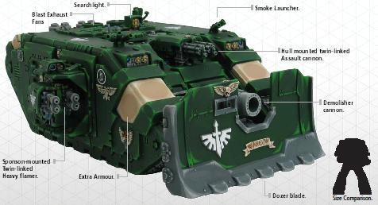

# 1508 阿瑞斯型兰德掠袭者战车 Land Raider Ares

精校状态：中文行文已逐段精校，部分术语仍为暂定

分类：载具 / 地面 / 重型

原文来源：https://www.bilibili.com/opus/1039570523089010692

原作者：帝国神选罐头

原文时间：2025年03月02日 10:24

[返回分类目录](目录.md) · [全书目录](../../目录.md)

原篇名：阿瑞斯兰德掠袭者 Land Raider Ares

<!-- A1508-B0001 -->
**英文原文**

"The city must fall. Our chapter's purity depends on it!"

<!-- /A1508-B0001 -->

<!-- A1508-B0002 -->
**英文原文**

Litany spoken by Interrogator Chaplain Bish on the 42nd day of the siege of Murus.'''

<!-- /A1508-B0002 -->

<!-- A1508-B0003 -->

原译文

“这座城市必须沦陷。我们战团的纯洁取决于它！”

**校订译文**

“这座城市必须被攻破。我们战团的纯洁系于此战！”

<!-- /A1508-B0003 -->

<!-- A1508-B0004 -->

原译文

-审讯牧师比什在穆尔斯围城第42天所说的祷文

**校订译文**

——审讯教士比什于穆尔斯围城战第42日诵念的祷文

<!-- /A1508-B0004 -->

<!-- A1508-B0005 -->
**英文原文**

The Land Raider Ares is a Land Raider variant created exclusively by the Dark Angels Chapter.

<!-- /A1508-B0005 -->

<!-- A1508-B0006 -->

原译文

兰德掠袭者阿瑞斯是由黑暗天使战团独家制造的兰德掠袭者变体。

**校订译文**

兰德掠袭者阿瑞斯是由黑暗天使战团独家制造的兰德掠袭者变体。

<!-- /A1508-B0006 -->

<!-- A1508-B0007 -->
**英文原文**

It was first used in the Siege of Murus when it was discovered by the Dark Angels that three of their Fallen brethren (calling themselves The Tribunal) had taken control of the local forces. The Dark Angels found that their Vindicator siege tanks could not withstand the great cannons of the city and so created a Land Raider that could mount the Vindicator's Demolisher Cannon.

<!-- /A1508-B0007 -->

<!-- A1508-B0008 -->

原译文

当黑暗天使发现他们的三个堕落兄弟（自称法庭）已经控制了当地军队时，它首次在穆尔斯围城中使用。黑暗天使发现他们的维护者攻城坦克无法承受城市的大炮，因此制造了一辆可以安装维护者粉碎者加农炮的兰德掠袭者。

**校订译文**

阿瑞斯型首次用于穆尔斯围城战。当时，黑暗天使发现3名自称“法庭”的堕天使兄弟已控制当地军队。他们的维护者攻城战车抵挡不住城内重炮，于是将维护者使用的破坏者加农炮装上兰德掠袭者，造出这一改型。

<!-- /A1508-B0008 -->

<!-- A1508-B0009 图片 -->

<!-- A1508-B0010 -->

原译文

Land Raider Ares 兰德掠袭者阿瑞斯

**校订译文**

Land Raider Ares 兰德掠袭者阿瑞斯

<!-- /A1508-B0010 -->

<!-- A1508-B0011 -->
**英文原文**

The battle for Murus itself did not go as planned - the Tribunal managed to escape and, although the city was taken, only one of the six Ares survived. After the battle, the Ares designs were submitted to the Adeptus Mechanicus of Mars for review, but they never made a decision on officially approving the pattern. Despite this, the Ares designs were passed on to the rest of the Unforgiven, so Ares Land Raiders may well exist among other descendants of the Dark Angels.

<!-- /A1508-B0011 -->

<!-- A1508-B0012 -->

原译文

穆尔斯之战本身并没有按计划进行 - 法庭设法逃脱，尽管这座城市被占领，但六辆阿瑞斯中只有一个幸存下来。战斗结束后，阿瑞斯的设计被提交给火星机械神教审查，但他们从未决定正式批准该型号。尽管如此，阿瑞斯的设计还是传给了其他不可饶恕者，所以阿瑞斯兰德掠袭者很可能存在于黑暗天使的其他后裔中。

**校订译文**

穆尔斯之战并未按计划发展：虽然城市被攻陷，“法庭”却逃脱了，6辆阿瑞斯型也只剩1辆幸存。战后，设计被提交给火星机械修会审查，但该组织始终没有正式批准这一型号。尽管如此，图纸仍传给了其他戴罪者战团，因此其他黑暗天使子团中也很可能存在阿瑞斯型兰德掠袭者。

<!-- /A1508-B0012 -->

<!-- A1508-B0013 -->
## Weapons Configuration 武器配置

<!-- /A1508-B0013 -->

<!-- A1508-B0014 -->
**英文原文**

Hull-mounted Demolisher Cannon

<!-- /A1508-B0014 -->

<!-- A1508-B0015 -->

原译文

车体安装的粉碎者加农炮

**校订译文**

车体安装的破坏者加农炮

<!-- /A1508-B0015 -->

<!-- A1508-B0016 -->
**英文原文**

Hull-mounted twin-linked Assault Cannon

<!-- /A1508-B0016 -->

<!-- A1508-B0017 -->

原译文

车体安装的双联突击炮

**校订译文**

车体安装的双联突击炮

<!-- /A1508-B0017 -->

<!-- A1508-B0018 -->
**英文原文**

Two sponson-mounted twin-linked Heavy Flamers

<!-- /A1508-B0018 -->

<!-- A1508-B0019 -->

原译文

两个安装在舷侧的双联重型火焰枪

**校订译文**

两侧侧舱各装1组双联重型火焰喷射器

<!-- /A1508-B0019 -->

<!-- A1508-B0020 -->

原译文

Dozer Blade 推土机铲刀

**校订译文**

Dozer Blade 推土铲

<!-- /A1508-B0020 -->

本篇核心术语与暂定项

以下列出本篇出现的英文原形及核心术语表用词。同形词可能指不同对象，具体词义以本篇正文和校注为准；单复数、别名和仅见于图注的名称可能尚未列入。完整候选见[术语表](../../术语表/双语术语候选.csv)。

| 英文 | 采用中文 | 状态 |
| --- | --- | --- |
| Dark Angels | 黑暗天使 | 官方已核对 |
| Adeptus Mechanicus | 机械修会 | 官方已核对 |
| Mars | 火星 | 暂定·官方待核 |
| Land Raider | 兰德掠袭者战车 | 官方已核对 |
| Unforgiven | 戴罪者 | 暂定·官方待核 |
| Chaplain | 教士 | 官方已核对 |
| Vindicator | 维护者战车 | 官方已核对 |
| Chapter | 战团 | 暂定·官方待核 |
| Land Raiders | 兰德掠袭者 | 暂定·官方待核 |
| Flamers | 火妖（奸奇单位）／火焰喷射器（武器） | 语境定译·对应官译已核 |
| Raider | 掠袭者飞艇 | 官方已核对 |
| The Dark | 《黑暗》 | 暂定·官方待核 |
| Demolisher Cannon | 破坏者加农炮 | 暂定·官方待核 |
| Assault Cannon | 突击炮 | 暂定·官方待核 |
| Land Raider Ares | 阿瑞斯型兰德掠袭者战车 | 暂定·官方待核 |
| Murus | 穆尔斯 | 暂定·官方待核 |
| Bish | 比什 | 暂定·官方待核 |
| The Tribunal | 法庭 | 暂定·官方待核 |

