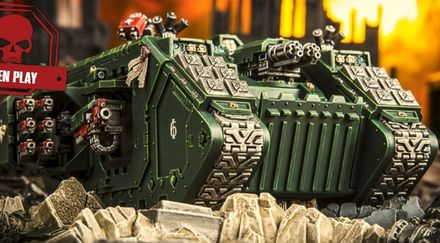

# 1509 庄严侵略者型兰德掠袭者 Land Raider Solemnus Aggressor

精校状态：中文行文已逐段精校，部分术语仍为暂定

分类：载具 / 地面 / 重型

原文来源：https://www.bilibili.com/opus/1039945671285669893

原作者：帝国神选罐头

原文时间：2025年03月03日 10:40

[返回分类目录](目录.md) · [全书目录](../../目录.md)

原篇名：庄严侵略者兰德掠袭者 Land Raider Solemnus Aggressor

<!-- A1509-B0001 -->
**英文原文**

The Land Raider Solemnus Aggressor is a variant of the Land Raider, that was created by the Dark Angels Chapter. Its main armaments are twin Assault Cannons, two Heavy bolters and two Hurricane bolters, which gives the Solemnus Aggressor the firepower to shatter an infantry advance in a single volley.

<!-- /A1509-B0001 -->

<!-- A1509-B0002 -->

原译文

兰德掠袭庄严侵略者是由黑暗天使战团制造的兰德掠袭者的变体。它的主要武器是两门突击炮、两门重型爆矢枪和两门飓风爆矢枪，这使庄严侵略者拥有在一次齐射中粉碎步兵前进的火力。

**校订译文**

庄严侵略者型兰德掠袭者由黑暗天使战团研制，主武器为双装突击炮、2挺重型爆矢枪和2套飓风爆矢枪。其火力足以在一轮齐射中粉碎步兵攻势。

<!-- /A1509-B0002 -->

<!-- A1509-B0003 图片 -->

<!-- A1509-B0004 -->

原译文

Land Raider Solemnus Aggressor 兰德掠袭庄严侵略者

**校订译文**

Land Raider Solemnus Aggressor 庄严侵略者型兰德掠袭者

<!-- /A1509-B0004 -->

本篇核心术语与暂定项

以下列出本篇出现的英文原形及核心术语表用词。同形词可能指不同对象，具体词义以本篇正文和校注为准；单复数、别名和仅见于图注的名称可能尚未列入。完整候选见[术语表](../../术语表/双语术语候选.csv)。

| 英文 | 采用中文 | 状态 |
| --- | --- | --- |
| Dark Angels | 黑暗天使 | 官方已核对 |
| Solemnus | 庄严星 | 暂定·官方待核 |
| Land Raider | 兰德掠袭者战车 | 官方已核对 |
| Chapter | 战团 | 暂定·官方待核 |
| Aggressor | 侵略者 | 暂定·官方待核 |
| Raider | 掠袭者飞艇 | 官方已核对 |
| The Dark | 《黑暗》 | 暂定·官方待核 |
| Land Raider Solemnus Aggressor | 庄严侵略者型兰德掠袭者 | 暂定·官方待核 |

