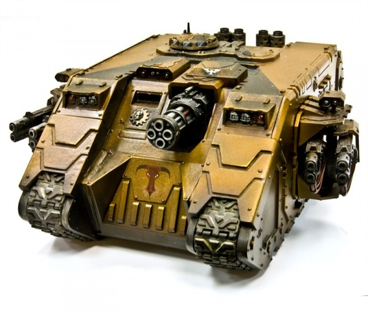
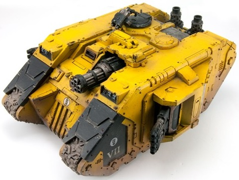

# 1511 阿喀琉斯兰德掠袭者 Land Raider Achilles

精校状态：中文行文已逐段精校，部分术语仍为暂定

分类：载具 / 地面 / 重型

原文来源：https://www.bilibili.com/opus/1045553764677713942

原作者：帝国神选罐头

原文时间：2025年03月18日 13:22

[返回分类目录](目录.md) · [全书目录](../../目录.md)

<!-- A1511-B0001 -->
**英文原文**

The Land Raider Achilles is a siege variant of the Space Marines' Land Raider, designed in the closing days of the Great Crusade. First forged by the Imperial Fists Legion in response to a now-extinct xenos threat, they are an incredibly rare variant with supreme longevity and, even by Land Raider standards, invulnerability.

<!-- /A1511-B0001 -->

<!-- A1511-B0002 -->

原译文

兰德掠袭者阿喀琉斯是星际战士兰德掠袭者的攻城变体，设计于大远征的最后几天。它们最初是由帝国之拳军团为应对现已灭绝的异型威胁而制造的，是一种极其罕见的变体，具有最高的耐久，即使以兰德掠袭者的标准来看，也是无懈可击的。

**校订译文**

阿喀琉斯型兰德掠袭者是大远征末期设计的攻城改型，最初由帝国之拳军团为应对一种现已灭绝的异形威胁而制造。它极为罕见，使用寿命极长；即便以兰德掠袭者为标准，其防御力也堪称出众。

<!-- /A1511-B0002 -->

<!-- A1511-B0003 图片 -->

<!-- A1511-B0004 -->

原译文

Land Raider Achilles 兰德掠袭者阿喀琉斯

**校订译文**

Land Raider Achilles 兰德掠袭者阿喀琉斯

<!-- /A1511-B0004 -->

<!-- A1511-B0005 -->
## History 历史

<!-- /A1511-B0005 -->

<!-- A1511-B0006 -->
**英文原文**

According to the Liber Armorum, work on the Achilles was begun as a joint venture between Imperial Fist Techmarines and the Archmagos of Xan-Ebon in response to a pocket xeno-empire that used fearsomely potent energy weapons and was located far to the galactic south. Though their name has since been forgotten to the sands of time, the xenos had nevertheless managed the impressive feat of bogging down an entire Crusade, necessitating the design of the Achilles. However the ancient mysteries used in the Achilles' final construction prevented any sort of mass production, such that by the Horus Heresy its use had not extended beyond the spearhead units of the Imperial Fists themselves, along with certain gifts delivered to the Dark Angels, Thousand Sons and Salamanders. By the time of the 41st Millennium the Land Raider Achilles exists in small numbers throughout a number of Space Marine Chapters, though fittingly only the Imperial Fists and their successors field them in significant quantities, while outside the Adeptus Astartes it is said only the Ordo Reductor of the Adeptus Mechanicus maintains access to the design. The inability to mass produce the tank means each individual machine has its own idiosyncrasies, while even the rumour of a nearby wrecked or abandoned Achillies is enough to divert an entire Space Marine strike force to reclaim it.

<!-- /A1511-B0006 -->

<!-- A1511-B0007 -->

原译文

根据装甲之书的说法，阿喀琉斯的工作是帝国之拳技术军士和贤-恩波的大贤者之间的合资项目开始的，以应对一个使用可怕强大能量武器的袖珍异型帝国，该帝国位于银河系南部。尽管他们的名字已经被遗忘在时间的沙滩上，但异型仍然完成了令人印象深刻的壮举，挫败了整个大远征，因此需要设计阿喀琉斯。然而，阿喀琉斯最终建造中使用的古老谜团阻止了任何形式的大规模生产，因此荷鲁斯叛乱的使用并没有超出帝国之拳本身的先锋部队，以及交付给黑暗天使、千子和火蜥蜴的某些礼物。到第41个千年时，兰德掠袭者阿喀琉斯在许多星际战士战团中数量很少，尽管只有帝国之拳及其继任者大量使用它们，而在阿斯塔特修会之外，据说只有机械神教的源还修会可以访问该设计。无法大规模生产坦克意味着每台机械都有自己的特点，而即使是附近坠毁或被遗弃的阿喀琉斯的谣言也足以转移整个星际战士的打击力量来夺回它。

**校订译文**

据《装甲之书》记载，阿喀琉斯型由帝国之拳的科技战士与贤-恩波的大贤者联合研制，用于对付遥远银河南部的一个小型异形帝国。这个异形种族掌握着威力骇人的能量武器，虽然其名字早已湮没于历史，却曾将一整支远征军拖入苦战，迫使帝国开发阿喀琉斯型。然而，制造它所用的古老秘技使其无法量产。直到荷鲁斯之乱时期，除少量赠予黑暗天使、千子和火蜥蜴的车辆外，它仍只装备帝国之拳自身的先锋部队。到了第41个千年，一些星际战士战团仍少量保有阿喀琉斯型，而能够较大规模部署它的，自然只有帝国之拳及其子团。据说，在阿斯塔特修会之外，也只有机械修会的源还修会仍掌握这一设计。无法量产意味着每辆车都有自身的独特性；哪怕只是传闻附近存在一辆损毁或废弃的阿喀琉斯型，也足以令整支星际战士打击部队改变行动方向，前往回收。

**校注：** an entire Crusade为一整支远征军／整个远征行动，不能扩为阻挠整个人类大远征。

<!-- /A1511-B0007 -->

<!-- A1511-B0008 -->
## Design Features 设计特点

<!-- /A1511-B0008 -->

<!-- A1511-B0009 -->
### Armament 军备

<!-- /A1511-B0009 -->

<!-- A1511-B0010 -->
**英文原文**

In its role of a heavy siege tank the Achilles was fitted with a number of powerful weapons to break through the enemy's defences. Both sponson mounts are fitted with twin-linked Multi-meltas, while the centerline hull mount was originally fitted with a Viper pattern quad-launcher, a rapid-firing four-barreled cannon which has since been replaced in surviving models with a Thunderfire Cannon. While this impressive armament helps it break through a siege, it also decreases the vehicle's transportation capacity.

<!-- /A1511-B0010 -->

<!-- A1511-B0011 -->

原译文

阿喀琉斯作为重型攻城坦克，配备了许多强大的武器，可以突破敌人的防御。两个舷侧支架都装有双联多管热熔，而车体中线支架最初装有蝰蛇型四管发射器，这是一种速射四管加农炮，此后在幸存的型号中被雷火炮所取代。虽然这种令人印象深刻的武器有助于它突破围困，但它也降低了车辆的运输能力。

**校订译文**

作为重型攻城坦克，阿喀琉斯型配备多种强力武器，以突破敌方防线。两侧侧舱各装1组双联多管热熔；车体中央原装蝰蛇型四联发射器——一种四管速射火炮，现存车辆上则已换装雷火炮。这套强大的武装有助于攻破围城防御，也占用了部分运兵空间。

<!-- /A1511-B0011 -->

<!-- A1511-B0012 -->
**英文原文**

Weapons are aimed with the help of a targeting array.

<!-- /A1511-B0012 -->

<!-- A1511-B0013 -->

原译文

武器是在瞄准阵列的帮助下瞄准的。

**校订译文**

武器由瞄准阵列辅助瞄准。

<!-- /A1511-B0013 -->

<!-- A1511-B0014 -->
### Armour 装甲

<!-- /A1511-B0014 -->

<!-- A1511-B0015 -->
**英文原文**

The most secret arts of the Cult Mechanicus went into the construction of the Achilles' structure, such that only a supreme Master of the Forge or Enginseer Artificier could potentially comprehend and produce them. Ancient electromagnetic incantations and ferromantic computational algorithms were etched at a molecular level at each and every layer of its fabrication. Mainly made out of reinforced adamantine/ceramite, every centimeter of the surface of an Achilles is etched with the most secret runes of the techno-magi, and the sigils inlay with meta-conducting zirconium. The resulting tank is almost impossible to harm with any sort of projected energy weapon and only a massive kinetic impact is perhaps guaranteed to destroy it.

<!-- /A1511-B0015 -->

<!-- A1511-B0016 -->

原译文

机械神教最秘密的技艺进入了阿喀琉斯结构的制造，只有铸造大师或技师工匠才能理解和制造它们。古代的电磁咒语和铁磁计算算法在其制造的每一层都在分子水平上蚀刻。阿喀琉斯主要由强化精金/陶钢制成，每一厘米的表面都蚀刻着技术魔法最秘密的符文，符文镶嵌着超传导锆。由此产生的坦克几乎不可能被任何能量投射武器伤害，只有巨大的动能冲击才能保证将其摧毁。

**校订译文**

阿喀琉斯型的结构运用了机械教派最隐秘的技艺，只有造诣极高的铸造大师或工造士工匠才可能理解并复现。车体制造的每一层都在分子尺度上刻入古老的电磁咒文与铁术计算算法。其主体由强化精金与陶钢构成，表面每一厘米都镌刻着技术贤者最隐秘的符文，符印中还嵌有超导性锆材料。如此造就的坦克几乎不会被任何投射能量的武器伤及；或许只有极其强大的动能冲击，才有把握将它摧毁。

**校注：** techno-magi指技术贤者，不是技术魔法。ferromantic为设定用语，暂译铁术，非已证实的现实铁磁计算；meta-conducting材料亦保留设定性质。英文perhaps的不确定语气已恢复。

<!-- /A1511-B0016 -->

<!-- A1511-B0017 -->
### Equipment 装备

<!-- /A1511-B0017 -->

<!-- A1511-B0018 -->
**英文原文**

Among the standard features the Achilles shares with the original pattern is the use of a Machine Spirit to guide the crew in operating the vehicle, however, the Enhanced Necris-Phobos Pattern Machine Spirit Genius Loci is the most warlike and frighteningly self-aware of any found on a Space Marine vehicle. The exact origins of this are unknown, with some speculation that it could be an after-effect of the vehicle's unique construction, but means that any attempt to recover these vehicles must be done so with extreme propitiation to avoid bloodshed.

<!-- /A1511-B0018 -->

<!-- A1511-B0019 -->

原译文

阿喀琉斯与原始型号的标准特征之一是使用机魂来指导机组人员操作车辆，然而，增强型夜寂-火卫一型机魂地域之灵是星际战士载具上发现的最好战、最令人恐惧的自我意识。确切的起源尚不清楚，有人猜测这可能是载具独特结构的后遗症，但这意味着任何试图恢复这些车辆的尝试都必须以极端的安抚来避免流血。

**校订译文**

与标准型号一样，阿喀琉斯型使用机魂辅助乘员操作。然而，它搭载的增强型夜寂—福波斯型“地域之灵”机魂，是所有星际战士载具中最好战、也最具惊人自我意识的一类。其缘由尚不清楚，有人猜测这是车辆独特构造带来的副作用。无论如何，任何回收行动都必须极其谨慎地安抚机魂，才能避免流血。

**校注：** Phobos在机魂型号中沿车辆词根福波斯，不直接套护甲官译恐惧型，也不据字面判为火卫一实体。

<!-- /A1511-B0019 -->

<!-- A1511-B0020 -->
**英文原文**

The Land Raider Achilles also comes standard with a Searchlight and Smoke Launchers, and can be upgraded with a pintle-mounted Storm Bolter, a Hunter-Killer Missile, Dozer Blades and/or a Siege Shield.

<!-- /A1511-B0020 -->

<!-- A1511-B0021 -->

原译文

兰德掠袭者阿喀琉斯还标配探照灯和烟雾发射器，可以升级为枢轴式风暴爆矢枪、猎杀飞弹、推土机铲刀和/或攻城盾。

**校订译文**

阿喀琉斯型还标配探照灯和烟雾发射器，并可加装枢轴式风暴爆矢枪、猎杀导弹、推土铲和／或攻城盾。

<!-- /A1511-B0021 -->

<!-- A1511-B0022 -->
### Transport Capacity 运输能力

<!-- /A1511-B0022 -->

<!-- A1511-B0023 -->
**英文原文**

Because of the added space taken up by the Achilles' weaponry, the vehicle can only transport up to six Space Marines; it also lacks the frontal assault ramp found on standard Land Raiders, with its passengers forced to disembark out of one of two access doors on either side of the hull.

<!-- /A1511-B0023 -->

<!-- A1511-B0024 -->

原译文

由于阿喀琉斯的武器占用了额外的空间，该飞行器最多只能运送六名星际战士；它还缺少标准兰德掠袭者上的正面突击坡道，乘员被迫从船体两侧的两个检修门中的一个下车。

**校订译文**

由于武器占用了额外空间，阿喀琉斯型最多只能搭载6名星际战士。它也没有标准兰德掠袭者的前置突击跳板，战士只能从车体两侧各一处的舱门下车。

<!-- /A1511-B0024 -->

<!-- A1511-B0025 -->
## Field Role 战场角色

<!-- /A1511-B0025 -->

<!-- A1511-B0026 -->
**英文原文**

Due to its limited transport capacity the Land Raider Achilles is often fielded in conjunction with other types of Land Raiders, like Land Raider Crusaders, and used in the support high-destructive role.

<!-- /A1511-B0026 -->

<!-- A1511-B0027 -->

原译文

由于其运输能力有限，兰德掠袭者阿喀琉斯经常与其他类型的兰德掠袭者一起作战，如兰德掠袭者十字军，并用于支员高破坏性角色。

**校订译文**

由于运兵能力有限，阿喀琉斯型通常与十字军型等其他兰德掠袭者共同出战，负责提供高破坏力的火力支援。

<!-- /A1511-B0027 -->

<!-- A1511-B0028 -->
## Achilles-Alpha Pattern 阿喀琉斯-阿尔法型

<!-- /A1511-B0028 -->

<!-- A1511-B0029 -->
**英文原文**

The Achilles-Alpha Pattern Land Raider was the original model from which the Land Raider Achilles was derived. The Achilles-Alpha was the most durable vehicle used by the Legiones Astartes, capable of shrugging off strikes that could even cripple a Fellblade and survive against the most toxic environment. Each vehicle was equipped with a quad mortar tooled with exacting precision and capable of launching shatter shells as well as the more common frag shells, and two sponson-mounted twin-linked Volkite Culverins. In the field of war, the Achilles-Alpha was used by the Legions as a spearpoint in any assault under fire trusting its near-impregnable armour and punishing weapons array to break any defense position. The construction of the vehicle fell under the direct oversight of a Forgeworld's Macro-tek Magos and was so costly to produce that no legion fielded more than a handful of them. Although the Land Raider Achilles was easier to produce it only held a fraction of the power of the original model.

<!-- /A1511-B0029 -->

<!-- A1511-B0030 -->

原译文

阿喀琉斯-阿尔法型兰德掠袭者是阿喀琉斯兰德掠袭者的原始型号。阿喀琉斯-阿尔法是阿斯塔特军团使用的最耐用的车辆，能够抵御甚至可能使残暴刃瘫痪的袭击，并在最有毒的环境中生存。每辆车都配备了一辆精确的四联迫击炮，能够发射散射弹和更常见的破片弹，以及两门安装在舷侧的双联爆燃长炮。在战场上，阿喀琉斯-阿尔法被军团用作任何火力攻击的矛头，相信其近乎坚不可摧的装甲和惩罚武器阵列可以打破任何防御阵地。该车辆的制造由铸造世界的宏铸巨匠贤者直接监督，生产成本如此之高，以至于没有哪个军团部署的数量超过少数。虽然兰德掠袭者阿喀琉斯更容易生产，但它的功率只有原始型号的一小部分。

**校订译文**

阿喀琉斯—阿尔法型是阿喀琉斯型兰德掠袭者的前身，也是阿斯塔特军团使用过的最坚固的车辆。它能承受足以瘫痪残暴刃的攻击，并在毒性最强的环境中生存。每辆车都装备制造精密的四联迫击炮，可发射破碎弹和更常见的破片弹；两侧侧舱还各装1组双联爆燃长炮。军团常用它充当冒着敌方炮火发起突击的矛头，凭借近乎无法击穿的装甲和猛烈火力攻破防御阵地。其制造由铸造世界的宏铸巨匠贤者直接监督，成本极高，没有任何军团能够大量装备。后来的阿喀琉斯型虽更易制造，战力却仅及原型的一小部分。

**校注：** power在比较车辆时为整体威力／战力，不宜缩为发动机功率；shatter shells暂破碎弹，区别frag破片弹。

<!-- /A1511-B0030 -->

<!-- A1511-B0031 图片 -->

<!-- A1511-B0032 -->

原译文

Alpha Pattern Land Raider Achilles 阿尔法型兰德掠袭者阿喀琉斯

**校订译文**

Alpha Pattern Land Raider Achilles 阿尔法型兰德掠袭者阿喀琉斯

<!-- /A1511-B0032 -->

<!-- A1511-B0033 -->
## Technical Information 技术资料

原题：Technical Information 技术信息

<!-- /A1511-B0033 -->

<!-- A1511-B0034 -->
**英文原文**

Vehicle Name:Land Raider Achilles

<!-- /A1511-B0034 -->

<!-- A1511-B0035 -->

原译文

载具名称：兰德掠袭者阿喀琉斯

**校订译文**

载具名称：兰德掠袭者阿喀琉斯

<!-- /A1511-B0035 -->

<!-- A1511-B0036 -->
**英文原文**

Forge World of Origin:Mars/Gryphonne IV

<!-- /A1511-B0036 -->

<!-- A1511-B0037 -->

原译文

起源铸造世界：火星/格里芬四号

**校订译文**

起源铸造世界：火星/格里芬四号

<!-- /A1511-B0037 -->

<!-- A1511-B0038 -->
**英文原文**

Known Patterns:II/IV

<!-- /A1511-B0038 -->

<!-- A1511-B0039 -->

原译文

已知型号：II/IV

**校订译文**

已知型号：II/IV

<!-- /A1511-B0039 -->

<!-- A1511-B0040 -->
**英文原文**

Crew:Driver, Commander, Ordnancer

<!-- /A1511-B0040 -->

<!-- A1511-B0041 -->

原译文

乘员：驾驶员、指挥官、军械师

**校订译文**

乘员：驾驶员、指挥官、军械师

<!-- /A1511-B0041 -->

<!-- A1511-B0042 -->
**英文原文**

Powerplant: Adaptable Thermic Combustion/Magnon-Fusion Reactor

<!-- /A1511-B0042 -->

<!-- A1511-B0043 -->

原译文

动力装置：适应性热燃烧/磁振子聚变反应堆

**校订译文**

动力装置：自适应热燃烧装置／磁振子聚变反应堆

<!-- /A1511-B0043 -->

<!-- A1511-B0044 -->
**英文原文**

Weight:76 tonnes

<!-- /A1511-B0044 -->

<!-- A1511-B0045 -->

原译文

重量：76吨

**校订译文**

重量：76吨

<!-- /A1511-B0045 -->

<!-- A1511-B0046 -->
**英文原文**

Length:10.4m

<!-- /A1511-B0046 -->

<!-- A1511-B0047 -->

原译文

长度：10.4米

**校订译文**

长度：10.4米

<!-- /A1511-B0047 -->

<!-- A1511-B0048 -->
**英文原文**

Width:6.2m

<!-- /A1511-B0048 -->

<!-- A1511-B0049 -->

原译文

宽度：6.2米

**校订译文**

宽度：6.2米

<!-- /A1511-B0049 -->

<!-- A1511-B0050 -->
**英文原文**

Height:4.11m

<!-- /A1511-B0050 -->

<!-- A1511-B0051 -->

原译文

高度：4.11米

**校订译文**

高度：4.11米

<!-- /A1511-B0051 -->

<!-- A1511-B0052 -->
**英文原文**

Ground Clearance:0.50m

<!-- /A1511-B0052 -->

<!-- A1511-B0053 -->

原译文

离地间隙：0.50m

**校订译文**

离地间隙：0.50米

<!-- /A1511-B0053 -->

<!-- A1511-B0054 -->
**英文原文**

Fording Depth:

<!-- /A1511-B0054 -->

<!-- A1511-B0055 -->

原译文

涉水深度：

**校订译文**

涉水深度：未提供

<!-- /A1511-B0055 -->

<!-- A1511-B0056 -->
**英文原文**

Max Speed - on road44kph

<!-- /A1511-B0056 -->

<!-- A1511-B0057 -->

原译文

最大速度-公路上50公里/小时

**校订译文**

最大公路速度：44公里／小时

**校注：** 按英文44修正原译50公里/小时。

<!-- /A1511-B0057 -->

<!-- A1511-B0058 -->
**英文原文**

Max Speed - off road:40kph

<!-- /A1511-B0058 -->

<!-- A1511-B0059 -->

原译文

越野最大速度：40公里每小时

**校订译文**

越野最大速度：40公里每小时

<!-- /A1511-B0059 -->

<!-- A1511-B0060 -->
**英文原文**

Transport Capacity:6 (3)

<!-- /A1511-B0060 -->

<!-- A1511-B0061 -->

原译文

运输能力：6（3）

**校订译文**

运兵能力：6名动力甲战士，或3名终结者

<!-- /A1511-B0061 -->

<!-- A1511-B0062 -->
**英文原文**

Access Points:3

<!-- /A1511-B0062 -->

<!-- A1511-B0063 -->

原译文

入口：3

**校订译文**

出入口：3处

**校注：** 源表写3处，但正文只述两侧2扇门且无前跳板；英文内部矛盾保留待核。

<!-- /A1511-B0063 -->

<!-- A1511-B0064 -->
**英文原文**

Main Armament:2x Twin-linked Multi-meltas

<!-- /A1511-B0064 -->

<!-- A1511-B0065 -->

原译文

主武器：2门双联多管热熔

**校订译文**

主武器：2门双联多管热熔

<!-- /A1511-B0065 -->

<!-- A1511-B0066 -->
**英文原文**

Secondary Armament:1x Thunderfire Cannon

<!-- /A1511-B0066 -->

<!-- A1511-B0067 -->

原译文

二级武器：1x雷火炮

**校订译文**

副武器：1门雷火炮

<!-- /A1511-B0067 -->

<!-- A1511-B0068 -->
**英文原文**

Traverse:180°

<!-- /A1511-B0068 -->

<!-- A1511-B0069 -->

原译文

横向：180°

**校订译文**

水平射界：180°

<!-- /A1511-B0069 -->

<!-- A1511-B0070 -->
**英文原文**

Elevation:From -32° to +42°

<!-- /A1511-B0070 -->

<!-- A1511-B0071 -->

原译文

仰角：从-32°到+42°

**校订译文**

俯仰角：−32°至＋42°

<!-- /A1511-B0071 -->

<!-- A1511-B0072 -->
**英文原文**

Main Ammunition: 30x1 Second Blasts

<!-- /A1511-B0072 -->

<!-- A1511-B0073 -->

原译文

主要弹药：30x1秒爆炸

**校订译文**

主武器弹药容量：可进行30次持续1秒的射击

<!-- /A1511-B0073 -->

<!-- A1511-B0074 -->
**英文原文**

Secondary Ammunition: 48 Rounds (Variable Payload)

<!-- /A1511-B0074 -->

<!-- A1511-B0075 -->

原译文

二级弹药：48轮（可变负载）

**校订译文**

副武器载弹量：48发（可装填不同弹种）

<!-- /A1511-B0075 -->

<!-- A1511-B0076 -->
### Armour 装甲

<!-- /A1511-B0076 -->

<!-- A1511-B0077 -->
**英文原文**

Superstructure:100mm

<!-- /A1511-B0077 -->

<!-- A1511-B0078 -->

原译文

上部结构：100毫米

**校订译文**

上部结构：100毫米

<!-- /A1511-B0078 -->

<!-- A1511-B0079 -->
**英文原文**

Hull:95-115mm

<!-- /A1511-B0079 -->

<!-- A1511-B0080 -->

原译文

车体：95-115毫米

**校订译文**

车体：95-115毫米

<!-- /A1511-B0080 -->

<!-- A1511-B0081 -->
**英文原文**

Gun Mantlet:N/A

<!-- /A1511-B0081 -->

<!-- A1511-B0082 -->

原译文

炮盾：无

**校订译文**

炮盾：不适用

<!-- /A1511-B0082 -->

<!-- A1511-B0083 -->
**英文原文**

Vehicle Designation: 0120-766-0724-PR113

<!-- /A1511-B0083 -->

<!-- A1511-B0084 -->

原译文

载具编号：0120-766-0724-PR113

**校订译文**

载具编号：0120-766-0724-PR113

<!-- /A1511-B0084 -->

<!-- A1511-B0085 -->
**英文原文**

Firing Ports:N/A

<!-- /A1511-B0085 -->

<!-- A1511-B0086 -->

原译文

开火口：无

**校订译文**

射击孔：不适用

<!-- /A1511-B0086 -->

<!-- A1511-B0087 -->
**英文原文**

Turret:N/A

<!-- /A1511-B0087 -->

<!-- A1511-B0088 -->

原译文

炮塔：无

**校订译文**

炮塔：不适用

<!-- /A1511-B0088 -->

<!-- A1511-B0089 -->
## Named Land Raider Achilles 著名兰德掠袭者阿喀琉斯

<!-- /A1511-B0089 -->

<!-- A1511-B0090 -->
**英文原文**

Sire of Methusa — Executioners Chapter

<!-- /A1511-B0090 -->

<!-- A1511-B0091 -->

原译文

梅图萨陛下 — 处刑者战团

**校订译文**

梅图萨陛下号——处刑者战团所属。

<!-- /A1511-B0091 -->

本篇核心术语与暂定项

以下列出本篇出现的英文原形及核心术语表用词。同形词可能指不同对象，具体词义以本篇正文和校注为准；单复数、别名和仅见于图注的名称可能尚未列入。完整候选见[术语表](../../术语表/双语术语候选.csv)。

| 英文 | 采用中文 | 状态 |
| --- | --- | --- |
| Space Marines | 星际战士 | 官方已核对 |
| Adeptus Astartes | 阿斯塔特修会 | 官方已核对 |
| Dark Angels | 黑暗天使 | 官方已核对 |
| Adeptus Mechanicus | 机械修会 | 官方已核对 |
| Thousand Sons | 千子 | 官方已核对 |
| Horus Heresy | 荷鲁斯之乱 | 官方已核对 |
| Cult Mechanicus | 机械教派 | 暂定·概念区分 |
| Imperial Fists | 帝国之拳 | 暂定 |
| Forge World | 铸造世界 | 暂定·官方待核 |
| Great Crusade | 大远征 | 暂定·官方待核 |
| Horus | 荷鲁斯 | 暂定·官方待核 |
| Hunter-Killer | 猎杀者 | 暂定·官方待核 |
| Ordo Reductor | 源还修会 | 暂定·官方待核 |
| Legiones Astartes | 阿斯塔特军团 | 暂定·官方待核 |
| Salamanders | 火蜥蜴 | 暂定·官方待核 |
| Mars | 火星 | 暂定·官方待核 |
| Gryphonne IV | 格里芬四号 | 暂定·官方待核 |
| Phobos | 火卫一 | 暂定·官方待核 |
| Land Raider | 兰德掠袭者战车 | 官方已核对 |
| Master | 导师（审判庭职衔）／舰务官（舰员职务） | 语境定译·官方待核 |
| Master of the Forge | 铸造大师 | 暂定·官方待核 |
| Ancient | 旗手 | 官方已核对 |
| Enginseer | 工造士 | 暂定·官方待核 |
| Space Marine | 星际战士 | 暂定·官方待核 |
| Chapter | 战团 | 暂定·官方待核 |
| Executioners | 处刑者 | 语境定译·官方待核 |
| Land Raiders | 兰德掠袭者 | 暂定·官方待核 |
| Crusaders | 十字军 | 暂定·官方待核 |
| Xenos | 异形 | 暂定·官方待核 |
| Reductor | 基因提取器 | 暂定·官方待核 |
| Raider | 掠袭者飞艇 | 官方已核对 |
| Tek | 特克 | 暂定·官方待核 |
| Gun | 甘 | 暂定·官方待核 |
| The Dark | 《黑暗》 | 暂定·官方待核 |
| Hunter-killer missile | 猎杀导弹 | 官方已核对 |
| Bolter | 爆矢枪 | 暂定·官方待核 |
| Storm bolter | 风暴爆矢枪 | 官方已核对 |
| Liber Armorum | 《装甲之书》 | 暂定·官方待核 |
| Siege Shield | 攻城盾 | 暂定·官方待核 |
| Land Raider Achilles | 阿喀琉斯型兰德掠袭者 | 暂定·官方待核 |
| Xan-Ebon | 贤-恩波 | 暂定·官方待核 |
| Necris-Phobos Pattern Machine Spirit Genius Loci | 夜寂—福波斯型“地域之灵”机魂 | 暂定·官方待核 |
| Achilles-Alpha Pattern Land Raider | 阿喀琉斯—阿尔法型兰德掠袭者 | 暂定·官方待核 |
| Sire of Methusa | 梅图萨陛下号 | 暂定·官方待核 |
| Fellblade | 残暴刃 | 暂定·官方待核 |

