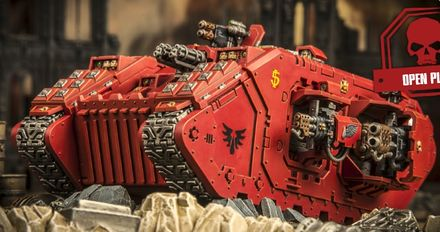

# 1512 炼狱天使型兰德掠袭者战车 Land Raider Angel Infernus

精校状态：中文行文已逐段精校，部分术语仍为暂定

分类：载具 / 地面 / 重型

原文来源：https://www.bilibili.com/opus/1040328181089828901

原作者：帝国神选罐头

原文时间：2025年03月04日 11:24

[返回分类目录](目录.md) · [全书目录](../../目录.md)

原篇名：炼狱天使兰德掠袭者 Land Raider Angel Infernus

<!-- A1512-B0001 -->
**英文原文**

The Land Raider Angel Infernus is a variant of the Land Raider, that was created by the Blood Angels Chapter. Its main armaments are twin Assault Cannons, two Heavy Flamers and two Flamestorm Cannons. These weapons allow the Angel Infernus to unleash firestorms so intense, that even the most dug-in defenders are reduced to ashes in a heartbeat.

<!-- /A1512-B0001 -->

<!-- A1512-B0002 -->

原译文

兰德掠袭者炼狱天使是兰德掠袭者的变体，由圣血天使战团制造。它的主要武器是两门突击炮、两门重型火焰炮和两门火焰风暴炮。这些武器使炼狱天使能够释放如此强烈的火焰风暴，以至于即使是最固守的防御者也会在一瞬间化为灰烬。

**校订译文**

炼狱天使型兰德掠袭者战车由圣血天使战团制造，主武器为双装突击炮、2具重型火焰喷射器和2门火焰风暴炮。其倾泻的烈焰如此猛烈，连防御最严密的守军也会在瞬间化为灰烬。

<!-- /A1512-B0002 -->

<!-- A1512-B0003 图片 -->

<!-- A1512-B0004 -->

原译文

Land Raider Angel Infernus 兰德掠袭者炼狱天使

**校订译文**

Land Raider Angel Infernus 炼狱天使型兰德掠袭者战车

<!-- /A1512-B0004 -->

本篇核心术语与暂定项

以下列出本篇出现的英文原形及核心术语表用词。同形词可能指不同对象，具体词义以本篇正文和校注为准；单复数、别名和仅见于图注的名称可能尚未列入。完整候选见[术语表](../../术语表/双语术语候选.csv)。

| 英文 | 采用中文 | 状态 |
| --- | --- | --- |
| Blood Angels | 圣血天使 | 官方已核对 |
| Land Raider | 兰德掠袭者战车 | 官方已核对 |
| Chapter | 战团 | 暂定·官方待核 |
| The Angel | 天使 | 暂定·官方待核 |
| Flamers | 火妖（奸奇单位）／火焰喷射器（武器） | 语境定译·对应官译已核 |
| Raider | 掠袭者飞艇 | 官方已核对 |
| Land Raider Angel Infernus | 炼狱天使型兰德掠袭者战车 | 暂定·官方待核 |
| The Blood | 鲜血 | 暂定·官方待核 |

