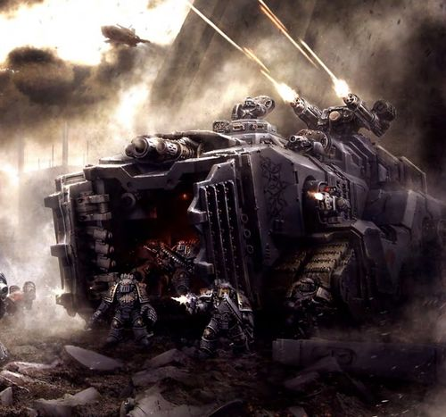
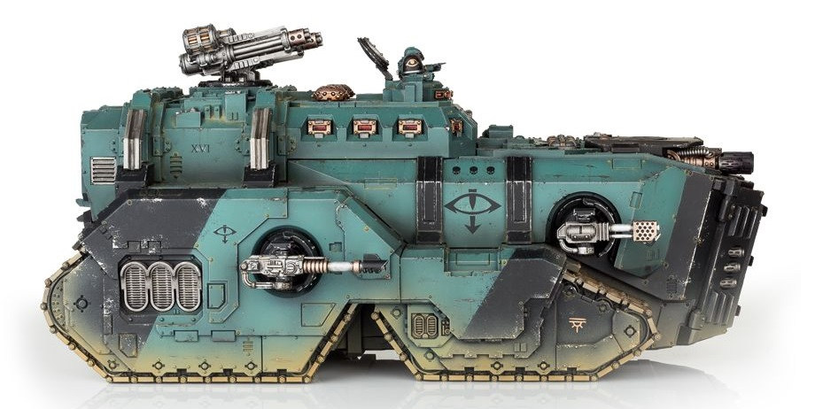

# 1513 乳齿象重型坦克 Mastodon Heavy Tank

精校状态：中文行文已逐段精校，部分术语仍为暂定

分类：载具 / 地面 / 重型

原文来源：https://www.bilibili.com/opus/1045149745679433731

原作者：帝国神选罐头

原文时间：2025年03月17日 11:14

[返回分类目录](目录.md) · [全书目录](../../目录.md)

<!-- A1513-B0001 -->
**英文原文**

The Mastodon is a Space Marine Heavy Tank used during the Horus Heresy and likely the Great Crusade. The Mastodon was reserved only for assaults on the most heavily fortified positions.

<!-- /A1513-B0001 -->

<!-- A1513-B0002 -->

原译文

乳齿象是一种星际战士重型坦克，在荷鲁斯叛乱和大远征期间使用。乳齿象仅用于攻击最坚固的阵地。

**校订译文**

乳齿象是星际战士在荷鲁斯之乱期间使用的一种重型坦克，也很可能在大远征时期就已服役。它只用于攻击防御最坚固的阵地。

<!-- /A1513-B0002 -->

<!-- A1513-B0003 图片 -->

<!-- A1513-B0004 -->

原译文

Space Wolves Mastodon 太空野狼乳齿象

**校订译文**

Space Wolves Mastodon 太空野狼乳齿象

<!-- /A1513-B0004 -->

<!-- A1513-B0005 -->
## Overview 概述

<!-- /A1513-B0005 -->

<!-- A1513-B0006 -->
**英文原文**

The Mastodon was in use with every Space Marine Legion by the later Great Crusade, but they were used only sparingly. At the outset of the One-Five-Four-Six ‘Kharaatan’ Campaign, the Salamanders had enough Mastodons to transport the entire Legion force present – approx. 6000 Legionaries, which would translate into around 150 (or 40 Marines per vehicle). It could also choose instead to carry up to two Dreadnoughts.

<!-- /A1513-B0006 -->

<!-- A1513-B0007 -->

原译文

在后来的大远征中，乳齿象被每个星际战士军团使用，但它们只被少量使用。在“一五四六”卡拉坦之战开始时，火蜥蜴有足够的乳齿象来运送整个军团的部队 - 大约6000名军团士兵，这相当于大约150人（或每辆车40名星际战士）。它也可以选择携带最多两名无畏。

**校订译文**

大远征后期，每个星际战士军团都使用乳齿象，但部署数量通常有限。在“一五四六”哈拉坦战役开始时，火蜥蜴拥有足够的乳齿象，能运输到场的全部军团部队——约6,000名战士。按每车40人计算，相当于约150辆。乳齿象也可改为搭载最多2台无畏机甲。

**校注：** 150的单位是辆，而非人；present指到场的军团兵力，不是全军团编制。

<!-- /A1513-B0007 -->

<!-- A1513-B0008 -->
**英文原文**

The Mastodon was a heavy-duty tank far larger than the Land Raider Battle Tank. One of the largest transports of the Legiones Astartes, it was equipped with Void Shields to protect it and its occupants from harm. These power-fields were powerful enough to block Autocannon shells and even Lascannon blasts. As such, they were often used to protect Legionaries on the battlefield from enemy Titans.

<!-- /A1513-B0008 -->

<!-- A1513-B0009 -->

原译文

乳齿象是一种重型坦克，比兰德掠袭者战斗坦克大得多。作为阿斯塔特军团最大的运输车之一，它配备了虚空盾，以保护它和它的乘员免受伤害。这些能量立场强大到足以阻挡自动炮炮弹甚至激光炮的爆炸。因此，它们经常被用来保护战场上的老兵免受敌方泰坦的攻击。

**校订译文**

乳齿象的体型远大于兰德掠袭者战车，是阿斯塔特军团最大的运兵车辆之一。它配有虚空盾，保护自身和车内人员。这些能量力场足以挡下自动炮弹，甚至激光炮射击，因此常用于保护战场上的军团战士，抵御敌方泰坦的攻击。

**校注：** Legionaries为军团战士，不是老兵。

<!-- /A1513-B0009 -->

<!-- A1513-B0010 图片 -->

<!-- A1513-B0011 -->

原译文

Sons of Horus Mastodon 荷鲁斯之子乳齿象

**校订译文**

Sons of Horus Mastodon 荷鲁斯之子乳齿象

<!-- /A1513-B0011 -->

<!-- A1513-B0012 -->
**英文原文**

The Mastodon was most commonly equipped with a forward Siege Melta Array, a turret-mounted Skyreaper Battery, two sponson-mounted Heavy Flamers, and two sponson-mounted Lascannons. It could also be equipped with up to four Hunter-Killer Missiles.

<!-- /A1513-B0012 -->

<!-- A1513-B0013 -->

原译文

乳齿象最常见的装备是一个前方攻城热熔阵列、一个安装在炮塔上的天空收割者炮台、两个安装在舷侧的重型火焰炮和两个安装于舷侧的激光炮。它还可以配备多达四枚猎杀飞弹。

**校订译文**

乳齿象通常装备前置攻城热熔阵列、炮塔安装的天空收割者炮组，以及侧舱中的2具重型火焰喷射器和2门激光炮，另可加装最多4枚猎杀导弹。

<!-- /A1513-B0013 -->

本篇核心术语与暂定项

以下列出本篇出现的英文原形及核心术语表用词。同形词可能指不同对象，具体词义以本篇正文和校注为准；单复数、别名和仅见于图注的名称可能尚未列入。完整候选见[术语表](../../术语表/双语术语候选.csv)。

| 英文 | 采用中文 | 状态 |
| --- | --- | --- |
| Horus Heresy | 荷鲁斯之乱 | 官方已核对 |
| Great Crusade | 大远征 | 暂定·官方待核 |
| Horus | 荷鲁斯 | 暂定·官方待核 |
| Hunter-Killer | 猎杀者 | 暂定·官方待核 |
| Legiones Astartes | 阿斯塔特军团 | 暂定·官方待核 |
| Salamanders | 火蜥蜴 | 暂定·官方待核 |
| Land Raider | 兰德掠袭者战车 | 官方已核对 |
| Space Marine Legion | 星际战士军团 | 暂定·官方待核 |
| Space Marine | 星际战士 | 暂定·官方待核 |
| Flamers | 火妖（奸奇单位）／火焰喷射器（武器） | 语境定译·对应官译已核 |
| Raider | 掠袭者飞艇 | 官方已核对 |
| Kharaatan | 哈拉坦 | 暂定·官方待核 |
| Skyreaper Battery | 天空收割者炮台 | 暂定·官方待核 |
| Autocannon | 自动炮 | 暂定·官方待核 |
| Siege Melta Array | 攻城热熔阵列 | 暂定·官方待核 |
| Lascannon | 激光炮 | 官方已核对 |

