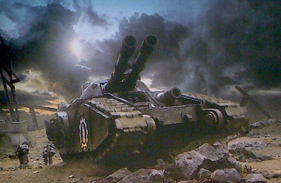
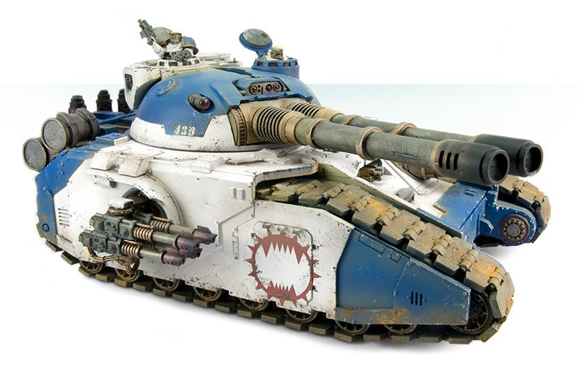

# 1514 残暴刃超重型坦克 Fellblade Super Heavy Tank

精校状态：中文行文已逐段精校，部分术语仍为暂定

分类：载具 / 地面 / 超重型

原文来源：https://www.bilibili.com/opus/1044403516618047494

原作者：帝国神选罐头

原文时间：2025年03月15日 10:59

[返回分类目录](目录.md) · [全书目录](../../目录.md)

<!-- A1514-B0001 -->
**英文原文**

The Fellblade is a super heavy tank used by the Space Marines during the Great Crusade and Horus Heresy. Based on the same STC as the Baneblade and Deathhammer, it formed a mainstay of the Space Marine Legions' heavy armored brigades during the Great Crusade and Horus Heresy.

<!-- /A1514-B0001 -->

<!-- A1514-B0002 -->

原译文

残暴刃是星际战士在大远征和荷鲁斯叛乱期间使用的超重型坦克。基于与毒刃和死锤相同的STC，它在大远征和荷鲁斯叛乱期间形成了星际战士重型装甲旅的支柱。

**校订译文**

残暴刃是星际战士在大远征及荷鲁斯之乱时期使用的超重型坦克，与毒刃和死锤源于同一套STC设计，是当时各星际战士军团重型装甲旅的主力。

<!-- /A1514-B0002 -->

<!-- A1514-B0003 图片 -->

<!-- A1514-B0004 -->

原译文

Fellblade of the Iron Hands 钢铁之手残暴刃

**校订译文**

Fellblade of the Iron Hands 钢铁之手残暴刃

<!-- /A1514-B0004 -->

<!-- A1514-B0005 -->
## Overview 概述

<!-- /A1514-B0005 -->

<!-- A1514-B0006 -->
**英文原文**

The Fellblade was most notable for its use of both Mechanicum atomantic arc-reactor technology and a reinforced metaplas alloy chassis superior to that of the Baneblade. It mounted a twin-linked Accelerator Cannon as its primary weapon and would also take to the field equipped with a suite of secondary weapons: a demolisher cannon, sponson-mounted quad-lascannons or laser destroyers, hull-mounted twin-linked heavy flamers or heavy bolters, and a variety of pintle-mounted weapons.

<!-- /A1514-B0006 -->

<!-- A1514-B0007 -->

原译文

残暴刃最引人注目的是它使用了机械式电弧反应堆技术和优于毒刃的强化化生合金底盘。它安装了一门双联加速炮作为其主要武器，并配备一套辅助武器投入战场：一门粉碎者加农炮、一门安装在舷侧的四联激光炮或激光破坏炮、一艘安装在车体上的双联重型火焰枪或重型爆矢枪，以及各种安装在枢轴上的武器。

**校订译文**

残暴刃最突出的特点，是采用机械教的原子电弧反应堆技术，以及比毒刃更坚固的强化化生合金底盘。其主武器为双联加速炮，副武器包括破坏者加农炮、侧舱安装的四联激光炮或激光破坏炮、车体安装的双联重型火焰喷射器或重型爆矢枪，以及多种枢轴武器。

**校注：** Mechanicum为机械教组织名，原译机械式漏失所属。

<!-- /A1514-B0007 -->

<!-- A1514-B0008 -->
**英文原文**

As of M41, the Fellblade is all but unknown to the Adeptus Astartes and very few are still in service. The last known reference shows that, as of early M40, less than 100 Fellblades are known to have been produced in the last 500 years.

<!-- /A1514-B0008 -->

<!-- A1514-B0009 -->

原译文

截至M41，阿斯塔特修会几乎不知道残暴刃，而且很少有还在服役。最后一个已知的参考文献表明，截至M40早期，在过去的500年里，已知生产的残暴刃不到100辆。

**校订译文**

到M41，阿斯塔特修会中已几乎无人知晓残暴刃，仍在服役的更是寥寥无几。最后一份已知记录显示，截至M40初期，此前500年间确认生产的残暴刃不足100辆。

<!-- /A1514-B0009 -->

<!-- A1514-B0010 -->
## Chaos Fellblades 混沌残暴刃

<!-- /A1514-B0010 -->

<!-- A1514-B0011 -->
**英文原文**

Fellblades are still used by Chaos Space Marine warbands, but have long since been corrupted by the Warp and Dark Mechanicum. Many have since become possessed by Daemons and are required to be chained down outside of combat, lest they lash out at those around them. Most are relics of the Great Crusade and thus are most commonly seen among the original Traitor Space Marine Legions.

<!-- /A1514-B0011 -->

<!-- A1514-B0012 -->

原译文

残暴刃仍然被混沌星际战士使用，但早已被亚空间和黑暗机械教破坏。此后，许多被恶魔占据，并被要求在战斗之外被锁链束缚，以免他们攻击周围的人。大多数是大远征的遗物，因此在最初的叛徒星际战士中最为常见。

**校订译文**

混沌星际战士战帮仍在使用残暴刃，但这些车辆早已受到亚空间和黑暗机械教的腐化。许多已被恶魔附身，在非战斗时期必须用锁链束缚，以免它们攻击周围的人。这些战车大多是大远征时期的遗物，因此在原初叛徒星际战士军团中最常见。

<!-- /A1514-B0012 -->

<!-- A1514-B0013 图片 -->

<!-- A1514-B0014 -->

原译文

World Eaters Fellblade 吞世者残暴刃

**校订译文**

World Eaters Fellblade 吞世者残暴刃

<!-- /A1514-B0014 -->

<!-- A1514-B0015 -->
## Technical Information 技术资料

原题：Technical Information 技术信息

<!-- /A1514-B0015 -->

<!-- A1514-B0016 -->
**英文原文**

Vehicle Name:Fellblade

<!-- /A1514-B0016 -->

<!-- A1514-B0017 -->

原译文

载具名称：残暴刃

**校订译文**

载具名称：残暴刃

<!-- /A1514-B0017 -->

<!-- A1514-B0018 -->
**英文原文**

Forge World of Origin:Mars/Tigrus

<!-- /A1514-B0018 -->

<!-- A1514-B0019 -->

原译文

起源铸造世界：火星/泰格鲁斯

**校订译文**

起源铸造世界：火星/泰格鲁斯

<!-- /A1514-B0019 -->

<!-- A1514-B0020 -->
**英文原文**

Known Patterns:I-VI

<!-- /A1514-B0020 -->

<!-- A1514-B0021 -->

原译文

已知型号：I - VI

**校订译文**

已知型号：I - VI

<!-- /A1514-B0021 -->

<!-- A1514-B0022 -->
**英文原文**

Crew:Commander, Driver, x2 Gunners

<!-- /A1514-B0022 -->

<!-- A1514-B0023 -->

原译文

乘员：指挥官、驾驶员、2名炮手

**校订译文**

乘员：指挥官、驾驶员、2名炮手

<!-- /A1514-B0023 -->

<!-- A1514-B0024 -->
**英文原文**

Powerplant:Atomantic plasma hybrid

<!-- /A1514-B0024 -->

<!-- A1514-B0025 -->

原译文

动力装置：原子等离子混合动力

**校订译文**

动力装置：原子等离子混合动力

<!-- /A1514-B0025 -->

<!-- A1514-B0026 -->
**英文原文**

Weight:302 tonnes

<!-- /A1514-B0026 -->

<!-- A1514-B0027 -->

原译文

重量：302吨

**校订译文**

重量：302吨

<!-- /A1514-B0027 -->

<!-- A1514-B0028 -->
**英文原文**

Length:12.5m

<!-- /A1514-B0028 -->

<!-- A1514-B0029 -->

原译文

长度：12.5米

**校订译文**

长度：12.5米

<!-- /A1514-B0029 -->

<!-- A1514-B0030 -->
**英文原文**

Width:8.2m

<!-- /A1514-B0030 -->

<!-- A1514-B0031 -->

原译文

宽度：8.2米

**校订译文**

宽度：8.2米

<!-- /A1514-B0031 -->

<!-- A1514-B0032 -->
**英文原文**

Height:5.8m

<!-- /A1514-B0032 -->

<!-- A1514-B0033 -->

原译文

高度：5.8米

**校订译文**

高度：5.8米

<!-- /A1514-B0033 -->

<!-- A1514-B0034 -->
**英文原文**

Ground Clearance:1.5m

<!-- /A1514-B0034 -->

<!-- A1514-B0035 -->

原译文

离地高度：1.5米

**校订译文**

离地高度：1.5米

<!-- /A1514-B0035 -->

<!-- A1514-B0036 -->
**英文原文**

Fording Depth:

<!-- /A1514-B0036 -->

<!-- A1514-B0037 -->

原译文

涉水深度：

**校订译文**

涉水深度：未提供

<!-- /A1514-B0037 -->

<!-- A1514-B0038 -->
**英文原文**

Max Speed - on road32kph

<!-- /A1514-B0038 -->

<!-- A1514-B0039 -->

原译文

最大速度-公路行驶32公里/小时

**校订译文**

最大速度-公路行驶32公里/小时

<!-- /A1514-B0039 -->

<!-- A1514-B0040 -->
**英文原文**

Max Speed - off road:20kph

<!-- /A1514-B0040 -->

<!-- A1514-B0041 -->

原译文

最大速度-越野：20公里/小时

**校订译文**

最大速度-越野：20公里/小时

<!-- /A1514-B0041 -->

<!-- A1514-B0042 -->
**英文原文**

Transport Capacity:None

<!-- /A1514-B0042 -->

<!-- A1514-B0043 -->

原译文

运输能力：无

**校订译文**

运输能力：无

<!-- /A1514-B0043 -->

<!-- A1514-B0044 -->
**英文原文**

Access Points:N/A

<!-- /A1514-B0044 -->

<!-- A1514-B0045 -->

原译文

入口：无

**校订译文**

出入口：不适用

<!-- /A1514-B0045 -->

<!-- A1514-B0046 -->
**英文原文**

Main Armament:Twin Accelerator Cannons

<!-- /A1514-B0046 -->

<!-- A1514-B0047 -->

原译文

主要武器：双联加速炮

**校订译文**

主要武器：双联加速炮

<!-- /A1514-B0047 -->

<!-- A1514-B0048 -->
**英文原文**

Secondary Armament:Demolisher Cannon, x2 Sponson quad Lascannons

<!-- /A1514-B0048 -->

<!-- A1514-B0049 -->

原译文

次要武器：粉碎者加农炮，2门侧舷四联激光炮

**校订译文**

副武器：破坏者加农炮、2组侧舱四联激光炮

<!-- /A1514-B0049 -->

<!-- A1514-B0050 -->
**英文原文**

Traverse:360°

<!-- /A1514-B0050 -->

<!-- A1514-B0051 -->

原译文

横向：360°

**校订译文**

水平射界：360°

<!-- /A1514-B0051 -->

<!-- A1514-B0052 -->
**英文原文**

Elevation:From -32° to +42°

<!-- /A1514-B0052 -->

<!-- A1514-B0053 -->

原译文

仰角：从-32°到+42°

**校订译文**

俯仰角：−32°至＋42°

<!-- /A1514-B0053 -->

<!-- A1514-B0054 -->
**英文原文**

Main Ammunition:42 Rounds

<!-- /A1514-B0054 -->

<!-- A1514-B0055 -->

原译文

主要弹药：42发

**校订译文**

主武器载弹量：42发

<!-- /A1514-B0055 -->

<!-- A1514-B0056 -->
**英文原文**

Secondary Ammunition:28 Rounds/Unlimited Lascannon cell feed

<!-- /A1514-B0056 -->

<!-- A1514-B0057 -->

原译文

次要弹药：28发/无限激光炮单元供弹

**校订译文**

副武器弹药：28发；激光炮由动力单元供能，无弹药数量限制

<!-- /A1514-B0057 -->

<!-- A1514-B0058 -->
### Armour 装甲

<!-- /A1514-B0058 -->

<!-- A1514-B0059 -->
**英文原文**

Superstructure:130mm

<!-- /A1514-B0059 -->

<!-- A1514-B0060 -->

原译文

上部结构：130毫米

**校订译文**

上部结构：130毫米

<!-- /A1514-B0060 -->

<!-- A1514-B0061 -->
**英文原文**

Hull:120mm

<!-- /A1514-B0061 -->

<!-- A1514-B0062 -->

原译文

车体：120毫米

**校订译文**

车体：120毫米

<!-- /A1514-B0062 -->

<!-- A1514-B0063 -->
**英文原文**

Gun Mantlet:120mm

<!-- /A1514-B0063 -->

<!-- A1514-B0064 -->

原译文

炮盾：120毫米

**校订译文**

炮盾：120毫米

<!-- /A1514-B0064 -->

<!-- A1514-B0065 -->
**英文原文**

Vehicle Designation:Unknown

<!-- /A1514-B0065 -->

<!-- A1514-B0066 -->

原译文

载具编号：未知

**校订译文**

载具编号：未知

<!-- /A1514-B0066 -->

<!-- A1514-B0067 -->
**英文原文**

Firing Ports:N/A

<!-- /A1514-B0067 -->

<!-- A1514-B0068 -->

原译文

开火口：无

**校订译文**

射击孔：不适用

<!-- /A1514-B0068 -->

<!-- A1514-B0069 -->
**英文原文**

Turret:120mm

<!-- /A1514-B0069 -->

<!-- A1514-B0070 -->

原译文

炮塔：120毫米

**校订译文**

炮塔：120毫米

<!-- /A1514-B0070 -->

<!-- A1514-B0071 -->
## Known Fellblades 著名残暴刃

<!-- /A1514-B0071 -->

<!-- A1514-B0072 -->
**英文原文**

Khatek — of the Sons of Horus

<!-- /A1514-B0072 -->

<!-- A1514-B0073 -->

原译文

卡提克 — 荷鲁斯之子

**校订译文**

卡提克号——荷鲁斯之子所属。

<!-- /A1514-B0073 -->

<!-- A1514-B0074 -->
**英文原文**

Mori Drakka — of the Charnel Guard

<!-- /A1514-B0074 -->

<!-- A1514-B0075 -->

原译文

莫瑞·德拉卡 — 墓葬守卫

**校订译文**

莫瑞·德拉卡号——墓葬守卫所属。

<!-- /A1514-B0075 -->

<!-- A1514-B0076 -->
**英文原文**

Parabellum — of the World Eaters

<!-- /A1514-B0076 -->

<!-- A1514-B0077 -->

原译文

帕拉贝鲁姆 — 吞世者

**校订译文**

帕拉贝鲁姆号——吞世者所属。

<!-- /A1514-B0077 -->

<!-- A1514-B0078 -->
**英文原文**

Wrath of Calth — of the Ultramarines

<!-- /A1514-B0078 -->

<!-- A1514-B0079 -->

原译文

考斯之怒 — 极限战士

**校订译文**

考斯之怒号——极限战士所属。

<!-- /A1514-B0079 -->

本篇核心术语与暂定项

以下列出本篇出现的英文原形及核心术语表用词。同形词可能指不同对象，具体词义以本篇正文和校注为准；单复数、别名和仅见于图注的名称可能尚未列入。完整候选见[术语表](../../术语表/双语术语候选.csv)。

| 英文 | 采用中文 | 状态 |
| --- | --- | --- |
| Space Marines | 星际战士 | 官方已核对 |
| Adeptus Astartes | 阿斯塔特修会 | 官方已核对 |
| World Eaters | 吞世者 | 官方已核对 |
| Ultramarines | 极限战士 | 官方已核对 |
| Horus Heresy | 荷鲁斯之乱 | 官方已核对 |
| Warp | 亚空间 | 官方已核对 |
| Mechanicum | 机械教 | 暂定·历史称谓 |
| Dark Mechanicum | 黑暗机械教 | 暂定·官方待核 |
| Forge World | 铸造世界 | 暂定·官方待核 |
| Great Crusade | 大远征 | 暂定·官方待核 |
| Horus | 荷鲁斯 | 暂定·官方待核 |
| STC | 标准建造模板 | 暂定·官方待核 |
| Sons of Horus | 荷鲁斯之子 | 暂定·官方待核 |
| Mars | 火星 | 暂定·官方待核 |
| Calth | 考斯 | 暂定·官方待核 |
| Lash | 鞭笞号 | 暂定·官方待核 |
| Space Marine | 星际战士 | 暂定·官方待核 |
| Destroyers | 毁灭者 | 暂定·官方待核 |
| Charnel Guard | 墓葬守卫 | 暂定·官方待核 |
| Baneblade | 毒刃 | 官方已核对 |
| Flamers | 火妖（奸奇单位）／火焰喷射器（武器） | 语境定译·对应官译已核 |
| Gun | 甘 | 暂定·官方待核 |
| Tigrus | 泰格鲁斯 | 暂定·官方待核 |
| Demolisher Cannon | 破坏者加农炮 | 暂定·官方待核 |
| Accelerator Cannon | 加速加农炮 | 暂定·官方待核 |
| Lascannon | 激光炮 | 官方已核对 |
| Atomantic arc-reactor | 原子电弧反应堆 | 暂定·官方待核 |
| Fellblade | 残暴刃 | 暂定·官方待核 |
| Deathhammer | 死锤 | 暂定·官方待核 |
| Khatek | 卡提克号 | 暂定·官方待核 |
| Mori Drakka | 莫瑞·德拉卡号 | 暂定·官方待核 |
| Parabellum | 帕拉贝鲁姆号 | 暂定·官方待核 |
| Wrath of Calth | 考斯之怒号 | 暂定·官方待核 |

