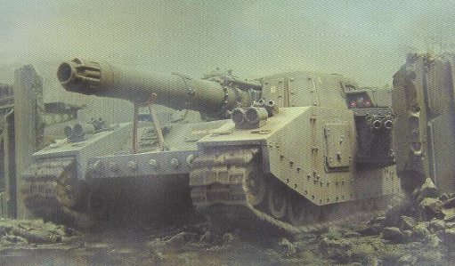
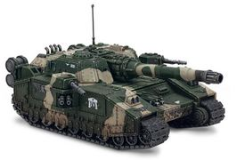
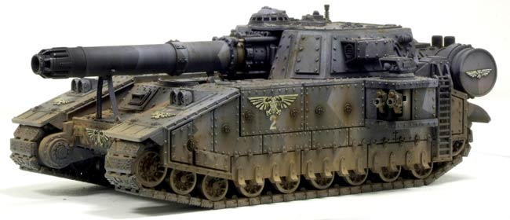
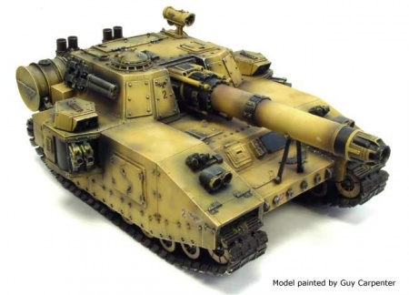
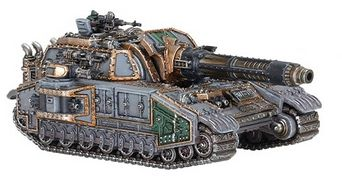

# 1515 影剑超重型坦克 Shadowsword Super Heavy Tank

精校状态：中文行文已逐段精校，部分术语仍为暂定

分类：载具 / 地面 / 超重型

原文来源：https://www.bilibili.com/opus/1046310477824524291

原作者：帝国神选罐头

原文时间：编辑于 2026年09月17日 08:52

[返回分类目录](目录.md) · [全书目录](../../目录.md)

<!-- A1515-B0001 -->
**英文原文**

The Shadowsword (also spelled Shadow Sword) is an Imperial Guard super-heavy vehicle based on the same chassis as the Baneblade.

<!-- /A1515-B0001 -->

<!-- A1515-B0002 -->

原译文

影剑（也拼写为暗影之剑）是一种帝国卫队超重型车辆，其底盘与毒刃相同。

**校订译文**

影剑（Shadowsword，亦拼作Shadow Sword）是帝国卫队使用的超重型车辆，与毒刃采用同型底盘。

**校注：** Shadow Sword只是Shadowsword的分写形式，中文不另立暗影之剑。

<!-- /A1515-B0002 -->

<!-- A1515-B0003 图片 -->

<!-- A1515-B0004 -->

原译文

Shadowsword Super Heavy Tank 影剑超重型坦克

**校订译文**

Shadowsword Super Heavy Tank 影剑超重型坦克

<!-- /A1515-B0004 -->

<!-- A1515-B0005 -->
**英文原文**

The Shadowsword design has existed for as long as the Baneblade and the two are described as "sisters". While based on the same STC data as the Baneblade, the Shadowsword is specifically armed and equipped to hunt and destroy enemy Titans. For this reason they are only constructed on Forge Worlds which raise Titan Legions and deployed to support forces expecting to face these war engines.

<!-- /A1515-B0005 -->

<!-- A1515-B0006 -->

原译文

影剑设计早在和毒刃被描述为“姐妹”时就存在了。虽然基于与毒刃相同的STC数据，但影剑是专门武装和装备的，可以狩猎和摧毁敌方泰坦。出于这个原因，它们只制造在铸造世界上，铸造世界培养了泰坦军团，并被部署为支援预计将面对这些战争引擎的部队。

**校订译文**

影剑与毒刃的设计历史同样悠久，两者被称为“姐妹”。它们源于同一套STC数据，但影剑的武装和设备专门用于猎杀敌方泰坦。因此，只有组建泰坦军团的铸造世界才会制造影剑，并将它们派去支援预计会遭遇此类战争机器的部队。

<!-- /A1515-B0006 -->

<!-- A1515-B0007 -->
###### Overview 概述

<!-- /A1515-B0007 -->

<!-- A1515-B0008 -->
**英文原文**

The Shadowsword was originally developed from the Baneblade STC during the Great Crusade. It saw use with the Imperial Army and became the basis for early models of the Falchion used by the Legiones Astartes, which like the Shadowsword was armed with volcano cannons in its original iteration.

<!-- /A1515-B0008 -->

<!-- A1515-B0009 -->

原译文

影剑最初是在大远征期间从毒刃STC发展而来的。它被帝国军队使用，并成为阿斯塔特军团使用的弯刀早期设计的基础，与影剑一样，它在最初的迭代中配备了火山炮。

**校订译文**

影剑最初在大远征期间以毒刃STC为基础研制，装备于帝国军；它又成为阿斯塔特军团早期弯刀车型的设计基础。早期弯刀与影剑一样，装备火山炮。

<!-- /A1515-B0009 -->

<!-- A1515-B0010 图片 -->

<!-- A1515-B0011 -->

原译文

Shadowsword 影剑

**校订译文**

Shadowsword 影剑

<!-- /A1515-B0011 -->

<!-- A1515-B0012 -->
**英文原文**

The Shadowsword is primarily distinguished from its sister design by its main weapon, the Volcano Cannon, a MkIV Phaeton pattern. This massive laser cannon can tear off a Titan's limb with a single shot and is assisted by advanced logis-engines and targeting equipment, especially by the sensor and targeter units located on top of the sponsons, for accurate long-range fire. The power needed to produce this devastating blow is drawn from the Shadowsword's capacitors, which themselves draw power from the tank's engine, however just one shot will completely drain them. In order to recharge the capacitors the engine's main drive must be disconnected and the generator connected in its place, rendering the tank stationary. This process is overseen by a dedicated Enginseer, whether an actual member of the Adeptus Mechanicus or a highly-trained Imperial Guard specialist, who monitors the power flow from engine to generator and otherwise helps maintain the vehicle. On average it can take a Shadowsword two minutes to fully charge its four-terawatt capacitors, assuming its systems are functioning normally. Because of its slow rate of fire the Shadowsword often operates with lighter vehicles who protect it against enemy assaults and help initiate an attack on an enemy Titan. While the Shadowsword lies in ambush the smaller vehicles attempt to strip the enemy's Void Shields at which point the Shadowsword may deliver the killing blow.

<!-- /A1515-B0012 -->

<!-- A1515-B0013 -->

原译文

影剑与其姊妹设计的主要区别在于其主要武器火山炮，这是一种MkIV法厄同型。这种巨大的激光炮可以一枪撕裂泰坦的肢体，并辅以先进的逻辑引擎和瞄准设备，特别是位于吊舱顶部的传感器和瞄准器单元，以进行精确的远程射击。产生这一毁灭性打击所需的能量来自影剑的电容器，这些电容器本身从坦克的发动机中获取能量，但只要一次射击就会完全耗尽它们。为了给电容器充电，必须断开发动机的主驱动，并将发电机连接到位，使油箱静止。这一过程由专门的工造士监督，无论是机械神教的实际成员还是训练有素的帝国卫队专家，他们都会监控从发动机到发电机的动力流，并以其他方式帮助维护车辆。假设其系统正常运行，平均而言，影剑需要两分钟才能为其4太瓦的电容器完全充电。由于其缓慢的射速，影剑经常与较轻的车辆配合使用，这些车辆可以保护它免受敌人的攻击，并帮助对敌方泰坦发起攻击。当影剑埋伏时，较小的车辆试图过载敌人的虚空盾，此时影剑可能会发出致命一击。

**校订译文**

影剑与其姊妹车型的主要区别是主武器——MkIV法厄同型火山炮。这门巨大的激光炮一击就能轰断泰坦的肢体。先进的逻辑引擎和瞄准设备，尤其是侧舱顶部的传感器与瞄准器，能辅助它进行精确的远程射击。如此猛烈的一击所需的能量来自车载电容器，电容器则从发动机获取能量；每次射击都会将储能彻底耗尽。充能时，必须断开发动机与主传动系统的连接，转而带动发电机，因此坦克只能停在原地。这一过程由专职工造士监督；他可能是机械修会成员，也可能是受过严格训练的帝国卫队专家，负责监控发动机至发电机的能量传输并协助维护车辆。在系统正常的情况下，影剑平均需要2分钟才能为其4太瓦电容器完全充能。由于射速较慢，影剑通常与较轻型车辆协同行动，由后者抵御近身攻击，并协助发起对泰坦的攻势。影剑隐蔽待机，轻型车辆则设法击溃敌方虚空盾，随后由影剑送出致命一击。

**校注：** 原译将tank误作油箱；stationary指充能时整车不能行驶。英文以terawatt描述电容器，属于功率而非容量单位，照录设定表述，未擅改为焦耳。

<!-- /A1515-B0013 -->

<!-- A1515-B0014 图片 -->

<!-- A1515-B0015 -->

原译文

Arkurian pattern Shadowsword 阿库里安型影剑

**校订译文**

Arkurian pattern Shadowsword 阿库里安型影剑

<!-- /A1515-B0015 -->

<!-- A1515-B0016 -->
**英文原文**

For defence, the Shadowsword has two remote-controlled side sponsons fitted with Twin-linked Heavy Bolters or Heavy Flamers. Some Shadowswords will instead replace these sponsons for extra armouring or add a second set of sponsons, each fitted with the same weapons as the originals. In addition to this, many crews will install a pintle-mounted Storm Bolter or Heavy Stubber, and/or a Hunter-Killer Missile on their tanks. Finally, all Shadowswords are equipped with Smoke Launchers to increase survivability and a Searchlight for night-fighting.

<!-- /A1515-B0016 -->

<!-- A1515-B0017 -->

原译文

为了防御，影剑有两个远程控制的侧舷，装有双联重型爆矢枪或重型火焰枪。一些影剑将替换这些侧舷以获得额外的装甲，或者添加第二侧舷，每个侧舷都配有与原版相同的武器。除此之外，许多车组人员在他们的坦克上安装枢轴式风暴爆矢枪或重型伐木枪，和/或猎杀飞弹。最后，所有影剑都配备了烟雾发射器以提高生存能力，并配备了夜战探照灯。

**校订译文**

影剑有两座遥控侧舱，装有双联重型爆矢枪或重型火焰喷射器，用于自卫。有些车辆会拆除侧舱，换装附加装甲；另一些则会增设第二对侧舱，武器配置与原先相同。许多乘员还会为车辆加装枢轴式风暴爆矢枪或重机枪，以及猎杀导弹。所有影剑都配有提高生存能力的烟雾发射器，以及供夜战使用的探照灯。

<!-- /A1515-B0017 -->

<!-- A1515-B0018 图片 -->

<!-- A1515-B0019 -->

原译文

Shadowsword 影剑

**校订译文**

Shadowsword 影剑

<!-- /A1515-B0019 -->

<!-- A1515-B0020 -->
**英文原文**

Like the Baneblade a "true" Shadowsword will have its own number and name and be registered on Mars, where all of its deeds shall be recorded regularly. So-called "counterfeit" Shadowswords are produced by Forge Worlds which don't have access to the same STC data and are consequently less advanced than those which have been properly constructed and consecrated: their logic engines and targeters will be more primitive, their capacitors or engine less efficient, their remote-controlled sponson weapons replaced with crewed versions, and the Volcano Cannon may be replaced with a large Plasma Cannon, a huge Battle Cannon or a Turbo Laser.

<!-- /A1515-B0020 -->

<!-- A1515-B0021 -->

原译文

像毒刃一样，“真正”影剑有自己的编号和名称，并在火星上注册，其所有行为都将定期记录。所谓的“伪造”影剑是由铸造世界生产的，它们无法访问相同的STC数据，因此不如那些经过适当构建和神圣化的影剑先进：它们的逻辑引擎和瞄准器将更加原始，电容器或引擎效率较低，它们的遥控侧舷武器将被载人版本所取代，火山炮可能会被大型等离子炮、大型战斗炮或涡轮激光炮所取代。

**校订译文**

与毒刃一样，每辆“真正”的影剑都有自己的编号和名字，并在火星登记，其战绩也会定期记入档案。所谓的“仿制”影剑，则出自未掌握相应STC数据的铸造世界，技术水平不及依正确工艺制造并完成祝圣的车辆：逻辑引擎和瞄准器更为原始，电容器或发动机效率较低，遥控侧舱武器也被人工操纵版本取代，甚至会用大型等离子炮、巨型战斗炮或涡轮激光炮代替火山炮。

<!-- /A1515-B0021 -->

<!-- A1515-B0022 图片 -->

<!-- A1515-B0023 -->

原译文

Shadowsword 影剑

**校订译文**

Shadowsword 影剑

<!-- /A1515-B0023 -->

<!-- A1515-B0024 -->
**英文原文**

Vehicle Name:Shadowsword

<!-- /A1515-B0024 -->

<!-- A1515-B0025 -->

原译文

车辆名称：影剑

**校订译文**

车辆名称：影剑

<!-- /A1515-B0025 -->

<!-- A1515-B0026 -->
**英文原文**

Forge World of Origin:Mars, Lucius, Estaban VII, Triplex Phall

<!-- /A1515-B0026 -->

<!-- A1515-B0027 -->

原译文

起源铸造世界：火星、卢修斯、埃斯塔班 VII、三重法尔

**校订译文**

起源铸造世界：火星、卢修斯、埃斯塔班七号、三重法尔

<!-- /A1515-B0027 -->

<!-- A1515-B0028 -->
**英文原文**

Known Patterns:I-VII

<!-- /A1515-B0028 -->

<!-- A1515-B0029 -->

原译文

已知型号：I-VII

**校订译文**

已知型号：I-VII

<!-- /A1515-B0029 -->

<!-- A1515-B0030 -->
**英文原文**

Crew:Commander, Driver, Main Gunner, Remote Gunner, Comms-Operator, Engineer

<!-- /A1515-B0030 -->

<!-- A1515-B0031 -->

原译文

乘员：指挥官、驾驶员、主炮手、远程炮手、通信操作员、工程师

**校订译文**

乘员：指挥官、驾驶员、主炮手、遥控武器炮手、通讯员、工程师

<!-- /A1515-B0031 -->

<!-- A1515-B0032 -->
**英文原文**

Powerplant:M507 V18 Multi Fuel

<!-- /A1515-B0032 -->

<!-- A1515-B0033 -->

原译文

动力装置：M507 V18多燃料

**校订译文**

动力装置：M507 V18多燃料发动机

<!-- /A1515-B0033 -->

<!-- A1515-B0034 -->
**英文原文**

Weight:316 tonnes

<!-- /A1515-B0034 -->

<!-- A1515-B0035 -->

原译文

重量：316吨

**校订译文**

重量：316吨

<!-- /A1515-B0035 -->

<!-- A1515-B0036 -->
**英文原文**

Length:13.5m

<!-- /A1515-B0036 -->

<!-- A1515-B0037 -->

原译文

长度：13.5米

**校订译文**

长度：13.5米

<!-- /A1515-B0037 -->

<!-- A1515-B0038 -->
**英文原文**

Width:8.4m

<!-- /A1515-B0038 -->

<!-- A1515-B0039 -->

原译文

宽度：8.4米

**校订译文**

宽度：8.4米

<!-- /A1515-B0039 -->

<!-- A1515-B0040 -->
**英文原文**

Height:6.3m

<!-- /A1515-B0040 -->

<!-- A1515-B0041 -->

原译文

高度：6.3米

**校订译文**

高度：6.3米

<!-- /A1515-B0041 -->

<!-- A1515-B0042 -->
**英文原文**

Ground Clearance:1.2m

<!-- /A1515-B0042 -->

<!-- A1515-B0043 -->

原译文

离地间隙：1.2米

**校订译文**

离地间隙：1.2米

<!-- /A1515-B0043 -->

<!-- A1515-B0044 -->
**英文原文**

Max Speed - on road:25kph

<!-- /A1515-B0044 -->

<!-- A1515-B0045 -->

原译文

最大行驶速度：25公里/小时

**校订译文**

最大公路速度：25公里／小时

<!-- /A1515-B0045 -->

<!-- A1515-B0046 -->
**英文原文**

Max Speed - off road:18kph

<!-- /A1515-B0046 -->

<!-- A1515-B0047 -->

原译文

最大越野速度：18公里/小时

**校订译文**

最大越野速度：18公里/小时

<!-- /A1515-B0047 -->

<!-- A1515-B0048 -->
**英文原文**

Main Armament:Volcano Cannon

<!-- /A1515-B0048 -->

<!-- A1515-B0049 -->

原译文

主要武器：火山炮

**校订译文**

主要武器：火山炮

<!-- /A1515-B0049 -->

<!-- A1515-B0050 -->
**英文原文**

Secondary Armament:4 Heavy Bolters

<!-- /A1515-B0050 -->

<!-- A1515-B0051 -->

原译文

次要武器：4门重型爆矢枪

**校订译文**

次要武器：4门重型爆矢枪

<!-- /A1515-B0051 -->

<!-- A1515-B0052 -->
**英文原文**

Traverse:2°

<!-- /A1515-B0052 -->

<!-- A1515-B0053 -->

原译文

横向：2°

**校订译文**

水平射界：2°

<!-- /A1515-B0053 -->

<!-- A1515-B0054 -->
**英文原文**

Elevation:From -2° to 12°

<!-- /A1515-B0054 -->

<!-- A1515-B0055 -->

原译文

仰角：从-2°到12°

**校订译文**

俯仰角：−2°至＋12°

<!-- /A1515-B0055 -->

<!-- A1515-B0056 -->
**英文原文**

Main Ammunition:Unlimited

<!-- /A1515-B0056 -->

<!-- A1515-B0057 -->

原译文

主弹药：无限

**校订译文**

主武器弹药：无限

<!-- /A1515-B0057 -->

<!-- A1515-B0058 -->
**英文原文**

Secondary Ammunition:1600 rounds

<!-- /A1515-B0058 -->

<!-- A1515-B0059 -->

原译文

二级弹药：1600发

**校订译文**

副武器载弹量：1,600发

<!-- /A1515-B0059 -->

<!-- A1515-B0060 -->
### Armour 装甲

<!-- /A1515-B0060 -->

<!-- A1515-B0061 -->
**英文原文**

Superstructure:220mm

<!-- /A1515-B0061 -->

<!-- A1515-B0062 -->

原译文

上部结构：220毫米

**校订译文**

上部结构：220毫米

<!-- /A1515-B0062 -->

<!-- A1515-B0063 -->
**英文原文**

Hull:210mm

<!-- /A1515-B0063 -->

<!-- A1515-B0064 -->

原译文

车体：210毫米

**校订译文**

车体：210毫米

<!-- /A1515-B0064 -->

<!-- A1515-B0065 -->
**英文原文**

Gun Mantlet:200mm

<!-- /A1515-B0065 -->

<!-- A1515-B0066 -->

原译文

炮盾：200毫米

**校订译文**

炮盾：200毫米

<!-- /A1515-B0066 -->

<!-- A1515-B0067 -->
**英文原文**

Vehicle Designation:0427-658-0212-SS120

<!-- /A1515-B0067 -->

<!-- A1515-B0068 -->

原译文

车辆编号：0427-658-0212-SS120

**校订译文**

车辆编号：0427-658-0212-SS120

<!-- /A1515-B0068 -->

<!-- A1515-B0069 -->
## Regiments known to contain Shadowswords 已知拥有影剑的兵团

<!-- /A1515-B0069 -->

<!-- A1515-B0070 -->
**英文原文**

1st Krieg Armoured Regiment — Atria Wilderness Campaign.

<!-- /A1515-B0070 -->

<!-- A1515-B0071 -->

原译文

克里格第一装甲团 — 阿特里亚荒野战役。

**校订译文**

克里格第一装甲团 — 阿特里亚荒野战役。

<!-- /A1515-B0071 -->

<!-- A1515-B0072 -->
**英文原文**

Palladius 8th Armoured Regiment — Atria Wilderness Campaign.

<!-- /A1515-B0072 -->

<!-- A1515-B0073 -->

原译文

帕拉迪乌斯第8装甲团 — 阿特里亚荒野战役。

**校订译文**

帕拉迪乌斯第8装甲团 — 阿特里亚荒野战役。

<!-- /A1515-B0073 -->

<!-- A1515-B0074 -->
## Notable Individual Shadowswords 著名影剑战车

原题：Notable Individual Shadowswords 著名独特影剑

<!-- /A1515-B0074 -->

<!-- A1515-B0075 -->
**英文原文**

Alpha Three — Mordian 3rd Heavy Tank Company.

<!-- /A1515-B0075 -->

<!-- A1515-B0076 -->

原译文

阿尔法三号 — 莫迪安第三重型坦克连。

**校订译文**

阿尔法三号 — 莫迪安第三重型坦克连。

<!-- /A1515-B0076 -->

<!-- A1515-B0077 -->
**英文原文**

Angel of the Apocalypse — Command tank of Cadian 81st Armoured Regiment. Destroyed on Golgotha by Ork Fighta-Bommas.

<!-- /A1515-B0077 -->

<!-- A1515-B0078 -->

原译文

启示录天使 — 卡迪亚第81装甲团指挥坦克。在各各他被欧克战斗轰炸机摧毁。

**校订译文**

启示录天使号——卡迪亚第81装甲团指挥坦克，在各各他被欧克战斗轰炸机摧毁。

<!-- /A1515-B0078 -->

<!-- A1515-B0079 -->
**英文原文**

Castigatus — Eighth Pardus Armoured.

<!-- /A1515-B0079 -->

<!-- A1515-B0080 -->

原译文

严惩 — 帕度斯第八装甲团

**校订译文**

严惩号——帕度斯第八装甲团所属。

<!-- /A1515-B0080 -->

<!-- A1515-B0081 -->
**英文原文**

Creed's Vengeance — Cadian 12th.

<!-- /A1515-B0081 -->

<!-- A1515-B0082 -->

原译文

克里德的复仇 — 卡迪亚第12团。

**校订译文**

克里德的复仇号——卡迪亚第12团所属。

<!-- /A1515-B0082 -->

<!-- A1515-B0083 -->
**英文原文**

Duty's Honour — Palladius 53rd Regiment.

<!-- /A1515-B0083 -->

<!-- A1515-B0084 -->

原译文

职责荣耀 — 帕拉迪乌斯第53团。

**校订译文**

职责荣耀号——帕拉迪乌斯第53团所属。

<!-- /A1515-B0084 -->

<!-- A1515-B0085 -->
**英文原文**

Indomitable — Krieg 11th Tank Regiment, 14th Titan-hunter Company (Heavy). Destroyed in an engagement with enemy Titans during the war on Vraks.

<!-- /A1515-B0085 -->

<!-- A1515-B0086 -->

原译文

不屈 — 克里格第11坦克团，第14泰坦猎手连（重型）。在弗拉克斯战争期间与敌方泰坦交战时被摧毁。

**校订译文**

不屈号——克里格第11坦克团第14重型泰坦猎手连所属，在弗拉克斯战争中与敌方泰坦交战时被摧毁。

<!-- /A1515-B0086 -->

<!-- A1515-B0087 -->
**英文原文**

Lux Imperator — 7th Paragonian Super-heavy Tank Company.

<!-- /A1515-B0087 -->

<!-- A1515-B0088 -->

原译文

勒克斯统帅 — 第7帕拉冈超重型坦克连

**校订译文**

帝皇之光号——帕拉冈第7超重型坦克连所属。

**校注：** Lux Imperator按语义暂译帝皇之光；原译勒克斯统帅混淆专名与称谓，保留原译供追溯。

<!-- /A1515-B0088 -->

<!-- A1515-B0089 -->

原译文

The Iron Saint 钢铁圣者

**校订译文**

The Iron Saint 钢铁圣者号

<!-- /A1515-B0089 -->

<!-- A1515-B0090 -->
**英文原文**

Tormentor — command vehicle of Perturabo.

<!-- /A1515-B0090 -->

<!-- A1515-B0091 -->

原译文

折磨者 — 佩图拉博的指挥车。

**校订译文**

折磨者号——佩图拉博的指挥车。

<!-- /A1515-B0091 -->

<!-- A1515-B0092 -->
**英文原文**

Titans' Bane — Cadian 75th Armoured Regiment.

<!-- /A1515-B0092 -->

<!-- A1515-B0093 -->

原译文

泰坦之灾 — 卡迪亚第75装甲团。

**校订译文**

泰坦之灾号——卡迪亚第75装甲团所属。

<!-- /A1515-B0093 -->

<!-- A1515-B0094 -->
**英文原文**

Winter's End — Valhallan 409th Super-Heavy Armoured Regiment.

<!-- /A1515-B0094 -->

<!-- A1515-B0095 -->

原译文

凛冬之终 — 瓦尔哈拉第409超重型装甲团。

**校订译文**

凛冬之终号——瓦尔哈拉第409超重型装甲团所属。

<!-- /A1515-B0095 -->

本篇核心术语与暂定项

以下列出本篇出现的英文原形及核心术语表用词。同形词可能指不同对象，具体词义以本篇正文和校注为准；单复数、别名和仅见于图注的名称可能尚未列入。完整候选见[术语表](../../术语表/双语术语候选.csv)。

| 英文 | 采用中文 | 状态 |
| --- | --- | --- |
| Adeptus Mechanicus | 机械修会 | 官方已核对 |
| Imperial Guard | 帝国卫队 | 暂定·语境区分 |
| Imperial Army | 帝国军 | 暂定·官方待核 |
| Equipment | 装备 | 编辑用语已统一 |
| Forge World | 铸造世界 | 暂定·官方待核 |
| Great Crusade | 大远征 | 暂定·官方待核 |
| STC | 标准建造模板 | 暂定·官方待核 |
| Hunter-Killer | 猎杀者 | 暂定·官方待核 |
| Legiones Astartes | 阿斯塔特军团 | 暂定·官方待核 |
| Mordian | 莫迪安 | 暂定·官方待核 |
| Mars | 火星 | 暂定·官方待核 |
| Lucius | 卢修斯 | 暂定·官方待核 |
| Titan | 泰坦 | 暂定·官方待核 |
| Logis | 逻辑士 | 暂定·官方待核 |
| Enginseer | 工造士 | 暂定·官方待核 |
| Baneblade | 毒刃 | 官方已核对 |
| Shadowsword | 影剑 | 官方已核对 |
| Initiate | 正式成员 | 暂定·官方待核 |
| Flamers | 火妖（奸奇单位）／火焰喷射器（武器） | 语境定译·对应官译已核 |
| Vengeance | 复仇号 | 暂定·官方待核 |
| Triplex | 三重星区 | 暂定·官方待核 |
| Tormentor | 折磨者号 | 暂定·官方待核 |
| Gun | 甘 | 暂定·官方待核 |
| Krieg | 克里格 | 暂定·官方待核 |
| Estaban VII | 埃斯塔班七号 | 暂定·官方待核 |
| Phaeton | 法厄同 | 暂定·官方待核 |
| Triplex Phall | 三重法尔 | 暂定·官方待核 |
| Battle Cannon | 战斗炮 | 暂定·官方待核 |
| Hunter-killer missile | 猎杀导弹 | 官方已核对 |
| Heavy stubber | 重机枪 | 官方已核对 |
| Bolter | 爆矢枪 | 暂定·官方待核 |
| Storm bolter | 风暴爆矢枪 | 官方已核对 |
| Phaeton Pattern | 法厄同型 | 暂定·官方待核 |
| Plasma cannon | 等离子炮 | 官方已核对 |
| Volcano cannon | 火山炮 | 官方已核对 |
| Castigatus | 严惩号 | 暂定·官方待核 |
| Titan Legions | 泰坦军团 | 暂定·官方待核 |
| Lux Imperator | 帝皇之光号 | 暂定·官方待核 |
| Angel of the Apocalypse | 启示录天使号 | 暂定·官方待核 |

