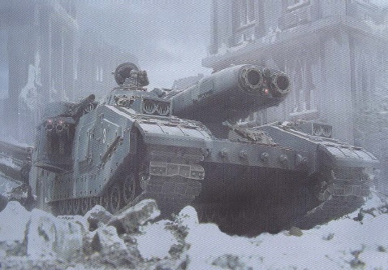
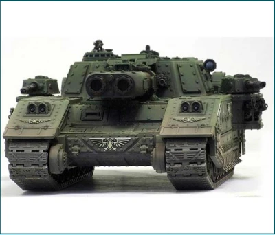
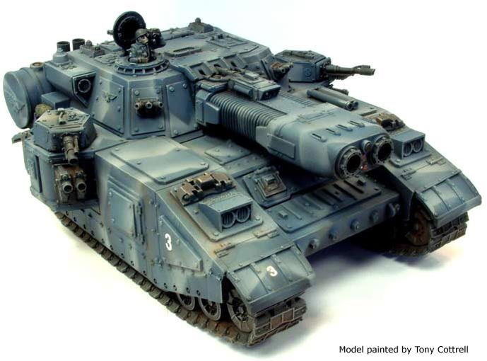
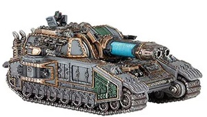
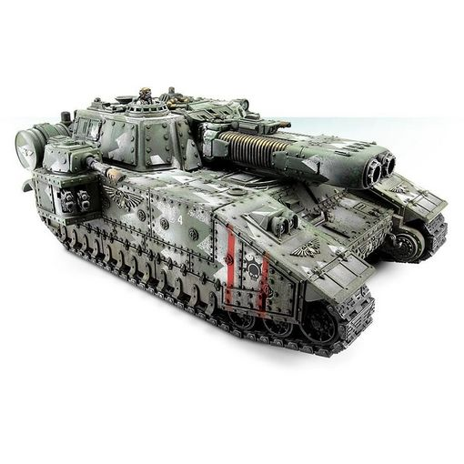

# 1516 风暴刃超重型坦克 Stormblade Super Heavy Tank

精校状态：中文行文已逐段精校，部分术语仍为暂定

分类：载具 / 地面 / 超重型

原文来源：https://www.bilibili.com/opus/1045149350569705489

原作者：帝国神选罐头

原文时间：编辑于 2026年09月17日 13:52

[返回分类目录](目录.md) · [全书目录](../../目录.md)

<!-- A1516-B0001 -->
**英文原文**

The Stormblade is a variant of the Shadowsword, a super-heavy vehicle used by the Imperial Guard as a Titan-hunter. Developed by Ryza, a Forge World noted for its mastery of plasma weaponry, the Stormblade represents a viable alternative for those Forge Worlds which lack the STC data necessary to construct a Shadowsword.

<!-- /A1516-B0001 -->

<!-- A1516-B0002 -->

原译文

风暴刃是影剑的变体，是帝国卫队用作泰坦猎手的超重型车辆。风暴刃由瑞扎开发，瑞扎是一个以精通等离子武器而闻名的铸造世界，它代表了那些缺乏构建影剑所需STC数据的铸造世界的可行替代品。

**校订译文**

风暴刃是影剑的改型，也是帝国卫队用于猎杀泰坦的超重型车辆。它由擅长等离子武器技术的铸造世界瑞扎研发，为那些缺少影剑STC数据的铸造世界提供了可行的替代方案。

<!-- /A1516-B0002 -->

<!-- A1516-B0003 图片 -->

<!-- A1516-B0004 -->

原译文

Stormblade 风暴刃

**校订译文**

Stormblade 风暴刃

<!-- /A1516-B0004 -->

<!-- A1516-B0005 -->
###### Overview 概述

<!-- /A1516-B0005 -->

<!-- A1516-B0006 -->
**英文原文**

The Stormblade is built upon the same chassis as the Shadowsword but lacks some of the advanced features of the original design, primarily the long-range tracking device and redundant generators and capacitors to power the Volcano Cannon. In its place it mounts a Ryza-pattern Plasma Blastgun, a powerful if short-ranged weapon capable of destroying Titans and other super-heavy vehicles, powered by massive photonic fuel cells. Additional space left over is used for extra heat shielding to protect the crew and an extensive cooling system to make it more reliable than the Leman Russ Executioner. To compensate for the loss in long-range firepower both sponson turrets are fitted with Lascannons with a fire control system adapted from the Baneblade, while the sponson mounts themselves are fitted with twin-linked Heavy Bolters and a coaxial Heavy Bolter is also included. A Targeter just above the primary weapon and an off-set armoured housing for a Searchlight are standard.

<!-- /A1516-B0006 -->

<!-- A1516-B0007 -->

原译文

风暴刃与影剑建立在相同的底盘上，但缺乏原始设计的一些先进功能，主要是远程跟踪设备和为火山炮供能的冗余发电机和电容器。取而代之的是，它安装了一个瑞扎型等离子爆破炮，这是一种强大的短程武器，能够摧毁泰坦和其他超重型载具，由巨大的光子燃料电池提供动力。剩余的额外空间用于额外的隔热，以保护乘员，以及一个巨大的冷却系统，使其比黎曼鲁斯刽子手更可靠。为了弥补远程火力的损失，两个舷侧炮塔都配备了激光炮，其火控系统改造自毒刃，而舷侧本身则配备了双联重型爆矢枪，还包括一个同轴重型爆矢枪。主武器上方的瞄准器和探照灯的偏置装甲外壳是标准配置。

**校订译文**

风暴刃与影剑使用相同底盘，却没有原型的部分先进设备，主要包括远程追踪装置，以及为火山炮供能的备用发电机和电容器。它以瑞扎型等离子爆破炮取代火山炮，由大型光子燃料电池供能，射程虽短，却足以摧毁泰坦等超重型目标。节省出的空间用于增设保护乘员的隔热层和大型冷却系统，使其可靠性高于黎曼鲁斯处决者。为弥补远程火力的损失，两座侧舱炮塔均配有激光炮，使用改自毒刃的火控系统；侧舱自身另装双联重型爆矢枪，车上还配有一挺同轴重型爆矢枪。主武器上方的瞄准器，以及一侧带装甲护罩的探照灯，也都是标准设备。

**校注：** redudant（原文redundant）在供能配置中指冗余备用系统，不是无用设备；副武器正文另述同轴重爆矢枪，技术表只列4挺，按各段保留。

<!-- /A1516-B0007 -->

<!-- A1516-B0008 图片 -->

<!-- A1516-B0009 -->

原译文

Stormblade 风暴刃

**校订译文**

Stormblade 风暴刃

<!-- /A1516-B0009 -->

<!-- A1516-B0010 -->
**英文原文**

It was once common practice for Stormblades to mount racks of Hellion Missiles to assist them in bringing down the heaviest of Titans, however, after three Stormblades of the Phyressian 31st Heavy Tank Company were destroyed by their own missiles, the weapons were withdrawn from service. Some Stormblades will mount a Hunter-Killer Missile and/or a pintle-mounted support weapon, either a Heavy Stubber or Storm Bolter. Others still will replace the sponson mounts for additional armor.

<!-- /A1516-B0010 -->

<!-- A1516-B0011 -->

原译文

曾经，风暴刃的常见做法是安装恶狼导弹架，以协助他们击落最重型的泰坦，然而，在菲利西亚第31重型坦克连队的三辆风暴刃被他们自己的导弹摧毁后，这些武器就退役了。一些风暴刃将安装猎杀飞弹和/或枢轴安装的支援武器，无论是重型伐木枪还是风暴爆矢枪。其他的还会替换舷侧，以获得额外装甲。

**校订译文**

风暴刃一度普遍安装恶狼导弹发射架，协助摧毁最重型的泰坦。但菲雷西安第31重型坦克连的3辆风暴刃被自身导弹炸毁后，这种武器便被撤装。一些风暴刃会加装猎杀导弹，以及枢轴安装的重机枪或风暴爆矢枪；还有些车辆会拆除侧舱，换装附加装甲。

<!-- /A1516-B0011 -->

<!-- A1516-B0012 图片 -->

<!-- A1516-B0013 -->

原译文

Ryza pattern Stormblade 瑞扎型风暴刃

**校订译文**

Ryza pattern Stormblade 瑞扎型风暴刃

<!-- /A1516-B0013 -->

<!-- A1516-B0014 -->
**英文原文**

During the Great Crusade and Horus Heresy Stormblades were used by super-heavy detachments of the Space Marine Legions.

<!-- /A1516-B0014 -->

<!-- A1516-B0015 -->

原译文

在大远征和荷鲁斯叛乱期间，星际战士的超重型分队使用了风暴刃。

**校订译文**

在大远征及荷鲁斯之乱期间，星际战士军团的超重型分队曾装备风暴刃。

<!-- /A1516-B0015 -->

<!-- A1516-B0016 图片 -->

<!-- A1516-B0017 -->

原译文

Stormblade 风暴刃

**校订译文**

Stormblade 风暴刃

<!-- /A1516-B0017 -->

<!-- A1516-B0018 -->
## Technical Information 技术资料

原题：Technical Information 技术信息

<!-- /A1516-B0018 -->

<!-- A1516-B0019 -->
**英文原文**

Vehicle Name:Stormblade

<!-- /A1516-B0019 -->

<!-- A1516-B0020 -->

原译文

载具名称：风暴刃

**校订译文**

载具名称：风暴刃

<!-- /A1516-B0020 -->

<!-- A1516-B0021 -->
**英文原文**

Forge World of Origin:Lucius

<!-- /A1516-B0021 -->

<!-- A1516-B0022 -->

原译文

起源锻造世界：卢修斯

**校订译文**

起源锻造世界：卢修斯

**校注：** 正文称瑞扎研发，而源技术表起源铸造世界列卢修斯；保留来源差异。

<!-- /A1516-B0022 -->

<!-- A1516-B0023 -->
**英文原文**

Known Patterns:I-VII

<!-- /A1516-B0023 -->

<!-- A1516-B0024 -->

原译文

已知型号：I-VII

**校订译文**

已知型号：I-VII

<!-- /A1516-B0024 -->

<!-- A1516-B0025 -->
**英文原文**

Crew:Commander, Driver, Main Gunner, Remote Gunner, Comms-Operator, Engineer

<!-- /A1516-B0025 -->

<!-- A1516-B0026 -->

原译文

乘员：指挥官、驾驶员、主炮手、远炮手、通信操作员、工程师

**校订译文**

乘员：指挥官、驾驶员、主炮手、遥控武器炮手、通讯员、工程师

<!-- /A1516-B0026 -->

<!-- A1516-B0027 -->
**英文原文**

Powerplant:M507 V18 Multi Fuel

<!-- /A1516-B0027 -->

<!-- A1516-B0028 -->

原译文

动力装置：M507 V18多燃料

**校订译文**

动力装置：M507 V18多燃料发动机

<!-- /A1516-B0028 -->

<!-- A1516-B0029 -->
**英文原文**

Weight:310 tonnes

<!-- /A1516-B0029 -->

<!-- A1516-B0030 -->

原译文

重量：310吨

**校订译文**

重量：310吨

<!-- /A1516-B0030 -->

<!-- A1516-B0031 -->
**英文原文**

Length:13.5m

<!-- /A1516-B0031 -->

<!-- A1516-B0032 -->

原译文

长度：13.5米

**校订译文**

长度：13.5米

<!-- /A1516-B0032 -->

<!-- A1516-B0033 -->
**英文原文**

Width:8.4m

<!-- /A1516-B0033 -->

<!-- A1516-B0034 -->

原译文

宽度：8.4米

**校订译文**

宽度：8.4米

<!-- /A1516-B0034 -->

<!-- A1516-B0035 -->
**英文原文**

Height:6.3m

<!-- /A1516-B0035 -->

<!-- A1516-B0036 -->

原译文

高度：6.3米

**校订译文**

高度：6.3米

<!-- /A1516-B0036 -->

<!-- A1516-B0037 -->
**英文原文**

Ground Clearance:1.2m

<!-- /A1516-B0037 -->

<!-- A1516-B0038 -->

原译文

离地间隙：1.2米

**校订译文**

离地间隙：1.2米

<!-- /A1516-B0038 -->

<!-- A1516-B0039 -->
**英文原文**

Max Speed - on road:25kph

<!-- /A1516-B0039 -->

<!-- A1516-B0040 -->

原译文

最大驾驶速度：25公里/小时

**校订译文**

最大公路速度：25公里／小时

<!-- /A1516-B0040 -->

<!-- A1516-B0041 -->
**英文原文**

Max Speed - off road:18kph

<!-- /A1516-B0041 -->

<!-- A1516-B0042 -->

原译文

最大越野速度：18公里/小时

**校订译文**

最大越野速度：18公里/小时

<!-- /A1516-B0042 -->

<!-- A1516-B0043 -->
**英文原文**

Main Armament:Plasma Blastgun

<!-- /A1516-B0043 -->

<!-- A1516-B0044 -->

原译文

主要武器：等离子爆破炮

**校订译文**

主要武器：等离子爆破炮

<!-- /A1516-B0044 -->

<!-- A1516-B0045 -->
**英文原文**

Secondary Armament:2 Lascannons, 4 Heavy Bolters

<!-- /A1516-B0045 -->

<!-- A1516-B0046 -->

原译文

次要武器：2门激光炮，4门重型爆矢枪

**校订译文**

次要武器：2门激光炮，4门重型爆矢枪

<!-- /A1516-B0046 -->

<!-- A1516-B0047 -->
**英文原文**

Traverse:2°

<!-- /A1516-B0047 -->

<!-- A1516-B0048 -->

原译文

横向：2°

**校订译文**

水平射界：2°

<!-- /A1516-B0048 -->

<!-- A1516-B0049 -->
**英文原文**

Elevation:From -2° to 12°

<!-- /A1516-B0049 -->

<!-- A1516-B0050 -->

原译文

仰角：从-2°到12°

**校订译文**

俯仰角：−2°至＋12°

<!-- /A1516-B0050 -->

<!-- A1516-B0051 -->
**英文原文**

Main Ammunition:16 shots from Photonic Fuel Cell

<!-- /A1516-B0051 -->

<!-- A1516-B0052 -->

原译文

主要弹药：光子燃料电池发射的16发子弹

**校订译文**

主武器弹药容量：一组光子燃料电池可供射击16次

<!-- /A1516-B0052 -->

<!-- A1516-B0053 -->
**英文原文**

Secondary Ammunition:1600 rounds

<!-- /A1516-B0053 -->

<!-- A1516-B0054 -->

原译文

二级弹药：1600发

**校订译文**

副武器载弹量：1,600发

<!-- /A1516-B0054 -->

<!-- A1516-B0055 -->
### Armour 装甲

<!-- /A1516-B0055 -->

<!-- A1516-B0056 -->
**英文原文**

Superstructure:220mm

<!-- /A1516-B0056 -->

<!-- A1516-B0057 -->

原译文

上部结构：220毫米

**校订译文**

上部结构：220毫米

<!-- /A1516-B0057 -->

<!-- A1516-B0058 -->
**英文原文**

Hull:210mm

<!-- /A1516-B0058 -->

<!-- A1516-B0059 -->

原译文

车体：210毫米

**校订译文**

车体：210毫米

<!-- /A1516-B0059 -->

<!-- A1516-B0060 -->
**英文原文**

Gun Mantlet:200mm

<!-- /A1516-B0060 -->

<!-- A1516-B0061 -->

原译文

炮盾：200毫米

**校订译文**

炮盾：200毫米

<!-- /A1516-B0061 -->

<!-- A1516-B0062 -->
**英文原文**

Vehicle Designation:0427-658-0251-SB04

<!-- /A1516-B0062 -->

<!-- A1516-B0063 -->

原译文

载具编号：0427-658-0251-SB04

**校订译文**

载具编号：0427-658-0251-SB04

<!-- /A1516-B0063 -->

<!-- A1516-B0064 -->
## Known patterns 已知型号

<!-- /A1516-B0064 -->

<!-- A1516-B0065 -->
**英文原文**

Solar-Arkuria pattern — Used by the Solar Auxilia.

<!-- /A1516-B0065 -->

<!-- A1516-B0066 -->

原译文

太阳-阿库里亚型 — 被太阳辅助军使用

**校订译文**

太阳-阿库里亚型 — 被太阳辅助军使用

<!-- /A1516-B0066 -->

<!-- A1516-B0067 图片 -->

<!-- A1516-B0068 -->

原译文

Arkurian pattern Stormblade 阿库里亚型风暴刃

**校订译文**

Arkurian pattern Stormblade 阿库里亚型风暴刃

<!-- /A1516-B0068 -->

<!-- A1516-B0069 -->
## Regiments known to contain Stormblades 已知装备风暴刃的部队

原题：Regiments known to contain Stormblades 已知控制风暴刃的兵团

<!-- /A1516-B0069 -->

<!-- A1516-B0070 -->

原译文

Cadian 98th Armoured Regiment 卡迪安第98装甲团

**校订译文**

Cadian 98th Armoured Regiment 卡迪亚第98装甲团

<!-- /A1516-B0070 -->

<!-- A1516-B0071 -->
**英文原文**

Krieg 1st Heavy Tank Company - Cleansing of Radnar

<!-- /A1516-B0071 -->

<!-- A1516-B0072 -->

原译文

克里格第1重型坦克连 - 拉德纳尔清洗

**校订译文**

克里格第1重型坦克连 - 拉德纳尔清洗

<!-- /A1516-B0072 -->

<!-- A1516-B0073 -->
**英文原文**

Krieg 61st Tank Regiment, 13th Company - Pray for Death is inscribed on its hull.

<!-- /A1516-B0073 -->

<!-- A1516-B0074 -->

原译文

克里格第61坦克团第十三连 - 为死亡祈祷刻在其车体上。

**校订译文**

克里格第61坦克团第13连——其战车车体上刻有“祈求死亡”。

<!-- /A1516-B0074 -->

<!-- A1516-B0075 -->

原译文

Magdellan 11th Tank Regiment 马格德兰第11坦克团

**校订译文**

Magdellan 11th Tank Regiment 马格德兰第11坦克团

<!-- /A1516-B0075 -->

<!-- A1516-B0076 -->

原译文

Sarenian 5th Heavy Tank Company 萨雷尼亚第5重型坦克连

**校订译文**

Sarenian 5th Heavy Tank Company 萨雷尼亚第5重型坦克连

<!-- /A1516-B0076 -->

本篇核心术语与暂定项

以下列出本篇出现的英文原形及核心术语表用词。同形词可能指不同对象，具体词义以本篇正文和校注为准；单复数、别名和仅见于图注的名称可能尚未列入。完整候选见[术语表](../../术语表/双语术语候选.csv)。

| 英文 | 采用中文 | 状态 |
| --- | --- | --- |
| Imperial Guard | 帝国卫队 | 暂定·语境区分 |
| Horus Heresy | 荷鲁斯之乱 | 官方已核对 |
| Forge World | 铸造世界 | 暂定·官方待核 |
| Great Crusade | 大远征 | 暂定·官方待核 |
| Horus | 荷鲁斯 | 暂定·官方待核 |
| STC | 标准建造模板 | 暂定·官方待核 |
| Hunter-Killer | 猎杀者 | 暂定·官方待核 |
| Solar Auxilia | 太阳辅助军 | 暂定·官方待核 |
| Lucius | 卢修斯 | 暂定·官方待核 |
| Ryza | 瑞扎 | 暂定·官方待核 |
| Titan | 泰坦 | 暂定·官方待核 |
| Space Marine | 星际战士 | 暂定·官方待核 |
| Baneblade | 毒刃 | 官方已核对 |
| Shadowsword | 影剑 | 官方已核对 |
| Radnar | 拉德纳 | 暂定·官方待核 |
| Leman Russ Executioner | 黎曼鲁斯处决者 | 官方已核·中英对照 |
| Gun | 甘 | 暂定·官方待核 |
| System | 星系（恒星系统） | 暂定·官方待核 |
| Krieg | 克里格 | 暂定·官方待核 |
| Hunter-killer missile | 猎杀导弹 | 官方已核对 |
| Heavy stubber | 重机枪 | 官方已核对 |
| Bolter | 爆矢枪 | 暂定·官方待核 |
| Heavy bolter | 重型爆矢枪 | 官方已核对 |
| Storm bolter | 风暴爆矢枪 | 官方已核对 |
| Plasma Blastgun | 等离子爆破炮 | 暂定·官方待核 |
| Volcano cannon | 火山炮 | 官方已核对 |
| The Loss | 失落 | 暂定·官方待核 |
| Stormblade | 风暴刃 | 暂定·官方待核 |

