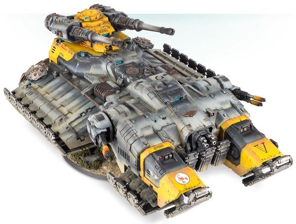

# 1517 阿斯特赖俄斯超重型坦克 Astraeus Super-heavy Tank

精校状态：中文行文已逐段精校，部分术语仍为暂定

分类：载具 / 地面 / 超重型

原文来源：https://www.bilibili.com/opus/1040706151080001545

原作者：帝国神选罐头

原文时间：编辑于 2025年03月05日 14:23

[返回分类目录](目录.md) · [全书目录](../../目录.md)

<!-- A1517-B0001 -->
**英文原文**

The Astraeus Super-heavy Tank is a newly unleashed Super-heavy grav-tank used by the Primaris Space Marines. It is a devastating war machine that represents the pinnacle of Imperial engineering.

<!-- /A1517-B0001 -->

<!-- A1517-B0002 -->

原译文

阿斯特赖俄斯超重型坦克是原铸星际战士使用的一种新推出的超重型反重力坦克。这是一台毁灭性的战争机械，代表了帝国工程的巅峰。

**校订译文**

阿斯特赖俄斯超重型坦克是原铸星际战士使用的一种新推出的超重型反重力坦克。这是一台毁灭性的战争机械，代表了帝国工程的巅峰。

<!-- /A1517-B0002 -->

<!-- A1517-B0003 图片 -->

<!-- A1517-B0004 -->

原译文

Astraeus tank 阿斯特赖俄斯坦克

**校订译文**

Astraeus tank 阿斯特赖俄斯坦克

<!-- /A1517-B0004 -->

<!-- A1517-B0005 -->
## History 历史

<!-- /A1517-B0005 -->

<!-- A1517-B0006 -->
**英文原文**

Unusually, the design does not originate directly from the work of Archmagos Dominus Cawl’s Repulsor transports designs, but instead blends his innovations with STC technology supposedly recovered by the Minotaurs Chapter during the so-called Perun Cross Incident, a battle whose records are sealed to all but the higher echelons of the Inquisition. As such, production of these vehicles is focused among the more distant Forge Worlds, primarily the fortress-forge of Mezoa, where the gaze of Mars cannot so easily pry.

<!-- /A1517-B0006 -->

<!-- A1517-B0007 -->

原译文

不同寻常的是，该设计并不是直接来源于神圣大贤者考尔的反击者运输设计，而是将他的创新与STC技术相结合，据称在所谓的佩伦十字事件中，米诺陶战团已经恢复了STC技术，这场战斗的记录除了审判庭的高层外无人所知。因此，这些载具的生产主要集中在更遥远的铸造世界，主要是梅佐亚的堡垒铸造厂，在那里，火星的目光无法轻易窥探。

**校订译文**

不同寻常的是，阿斯特赖俄斯并非直接沿用统御大贤者考尔的反重力战车设计，而是将他的创新与一项据称由米诺陶战团找回的STC技术结合。这项技术来自所谓的“佩伦十字事件”，有关那场战斗的记录只向审判庭高层开放。因此，这些车辆主要在偏远的铸造世界生产，尤其是梅佐亚要塞铸造世界——火星的目光难以轻易窥探那里。

**校注：** Archmagos Dominus沿统御大贤者；Repulsor沿官译反重力战车，原译反击者不再沿用。

<!-- /A1517-B0007 -->

<!-- A1517-B0008 -->
## Design 设计

<!-- /A1517-B0008 -->

<!-- A1517-B0009 -->
**英文原文**

The Astraeus has an enormous hull that mounts a devastating range of defensive and offensive systems. Its main weapons are a pair of Macro-Accelerator Cannons, which are coupled with sponson-mounted Las-Rippers or Plasma Eradicators, turret-mounted Heavy Stubber, and twin-linked Heavy Bolters or Lascannons mounted on the front of the vehicle. It is protected by layered void shields and is held aloft by powerful anti-gravitic generators, which are powerful deterrents to enemy assault units. Unlike the Repulsor, the Astraeus does not have any transport capacity – instead, this colossal machine is dedicated to destruction alone. While there are few targets that can stand up to one of the Astraeus Super-heavy Tank's furious fusillades, it particularly excels at shooting down aircraft.

<!-- /A1517-B0009 -->

<!-- A1517-B0010 -->

原译文

阿斯特赖俄斯有一个巨大的车体，可以安装一系列毁灭性的防御和进攻系统。它的主要武器是一对巨型加速加农炮，与安装在侧舷的激光开膛手或等离子根除炮、安装在炮塔上的重型伐木枪和安装在车辆前部的双联重型爆矢枪或激光炮相结合。它由分层的虚空盾保护，并由强大的反重力发生器保持在空中，这对敌方突击部队具有强大的威慑力。与反击者不同，阿斯特赖俄斯没有任何运输能力，相反，这台巨大的机械专门用于毁灭。虽然很少有目标能够承受阿斯特赖俄斯超重型坦克的猛烈炮火，而且它尤其擅长击落飞行器。

**校订译文**

阿斯特赖俄斯拥有庞大的车体，搭载多种强力的攻防系统。其主武器为2门巨型加速加农炮，另配侧舱安装的激光撕裂炮或等离子根除炮、炮塔安装的重机枪，以及车首的双联重型爆矢枪或激光炮。多层虚空盾提供防护，强大的反重力发生器则托起车身，同时威慑敌方突击部队。与反重力战车不同，阿斯特赖俄斯没有运兵空间，整台巨型机器专为毁灭而造。几乎没有目标能够承受它狂暴的齐射，而它尤其擅长击落飞机。

<!-- /A1517-B0010 -->

本篇核心术语与暂定项

以下列出本篇出现的英文原形及核心术语表用词。同形词可能指不同对象，具体词义以本篇正文和校注为准；单复数、别名和仅见于图注的名称可能尚未列入。完整候选见[术语表](../../术语表/双语术语候选.csv)。

| 英文 | 采用中文 | 状态 |
| --- | --- | --- |
| Space Marines | 星际战士 | 官方已核对 |
| Inquisition | 审判庭 | 暂定 |
| STC | 标准建造模板 | 暂定·官方待核 |
| Mars | 火星 | 暂定·官方待核 |
| Mezoa | 梅佐亚 | 暂定·官方待核 |
| Minotaurs | 米诺陶 | 暂定·官方待核 |
| Archmagos Dominus | 统御大贤者 | 暂定·官方待核 |
| Chapter | 战团 | 暂定·官方待核 |
| Astraeus | 阿斯特赖俄斯超重型坦克 | 暂定·官方待核 |
| Repulsor | 反重力战车 | 官方已核 |
| Heavy stubber | 重机枪 | 官方已核对 |
| Astraeus Super-heavy Tank | 阿斯特赖俄斯超重型坦克 | 暂定·官方待核 |
| Perun Cross Incident | 佩伦十字事件 | 暂定·官方待核 |

