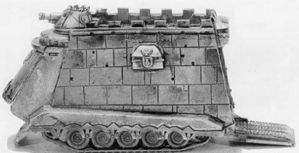

# 1518 帝国大厦超重型坦克 Capitol Imperialis Super Heavy Tank

精校状态：中文行文已逐段精校，部分术语仍为暂定

分类：载具 / 地面 / 超重型

原文来源：https://www.bilibili.com/opus/1047023296366772241

原作者：帝国神选罐头

原文时间：编辑于 2025年08月03日 06:20

[返回分类目录](目录.md) · [全书目录](../../目录.md)

<!-- A1518-B0001 -->
**英文原文**

A Capitol Imperialis is a tracked Super Heavy Tank used as a mobile command base for Regiments of the Imperial Army (during the Great Crusade and Horus Heresy) and its successor, the Astra Militarum. It also serves as a mobile chapel-workshop for the Adeptus Mechanicus. Though heavily armoured and protected by Void Shields, its sheer size and slow speeds limits the vehicle to defensive operations.

<!-- /A1518-B0001 -->

<!-- A1518-B0002 -->

原译文

帝国大厦是一种履带式超重型坦克，用作帝国军队（在大远征和荷鲁斯叛乱期间）及其继任者星界军的机动指挥基地。它还作为机械神教的移动教堂工坊。尽管装甲很重，并受到虚空盾的保护，但其庞大的尺寸和缓慢的速度限制了车辆的防御行动。

**校订译文**

帝国大厦是一种履带式超重型坦克，在大远征与荷鲁斯之乱时期充当帝国军各团的移动指挥基地，后来又由其继承者星界军使用。机械修会也将它作为移动圣堂兼工坊。虽然拥有厚重装甲和虚空盾，但庞大的体型与缓慢的速度使它主要限于防御作战。

<!-- /A1518-B0002 -->

<!-- A1518-B0003 图片 -->

<!-- A1518-B0004 -->

原译文

Capitol Imperialis 帝国大厦

**校订译文**

Capitol Imperialis 帝国大厦

<!-- /A1518-B0004 -->

<!-- A1518-B0005 -->
## Design 设计

<!-- /A1518-B0005 -->

<!-- A1518-B0006 -->
**英文原文**

At almost 80 metres long and 50 tall and weighing 67,000 tons, the rhomboid-shaped Capitol Imperialis rivals a Titan in size. Solid adamantine plating and six Void Shield generators gives it a comparable level of protection. Its primary weapon is the massive Behemoth Cannon, so large that four Leman Russ Battle Tanks could fit within its barrel, or a defence laser. The concussive force of firing the Behemoth Cannon can knock nearby troops off their feet and cause avalanches, while a single hit can kill thousands of enemy soldiers and vehicles, throwing them hundreds of meters into the air and producing a huge mushroom cloud. Secondary weapons include hundreds of Bolters for close-in defensive fire, and the hull can be electrically charged to repel boarders, as well as heavy plasma guns and heavy bolters.

<!-- /A1518-B0006 -->

<!-- A1518-B0007 -->

原译文

菱形的帝国大厦长近80米，高50米，重67000吨，其大小可与泰坦相媲美。坚固的精金镀层和六个虚空盾发生器使其具有相当的保护水平。它的主要武器是巨大的贝希摩斯加农炮，大到四辆黎曼鲁斯战斗坦克可以装在它的炮管里，或者一个防御激光。发射贝希摩斯加农炮的冲击力可以将附近的部队击倒并引发雪崩，而一次打击可以杀死数千名敌方士兵和载具，将他们抛向数百米的空中，产生巨大的蘑菇云。次要武器包括数百个用于近距离防御射击的爆矢枪，车体可以充电以击退入侵者，以及重型等离子枪和重型爆矢枪。

**校订译文**

帝国大厦呈菱形，长近80米、高50米、重67,000吨，体型足以媲美泰坦。坚实的精金装甲和6台虚空盾发生器为它提供了相应级别的防护。它的主武器可选防御激光炮，或庞大的贝希摩斯加农炮——其炮管大到足以容纳4辆黎曼鲁斯战斗坦克。贝希摩斯加农炮发射时的冲击波能掀倒附近部队并引发雪崩，一发命中即可消灭数以千计的敌军和车辆，将它们抛上数百米高空，升起巨大的蘑菇云。副武器包括数百挺近防爆矢枪，以及重型等离子枪和重型爆矢枪；车体还能通电，阻止敌人攀附登车。

<!-- /A1518-B0007 -->

<!-- A1518-B0008 -->
**英文原文**

Within its massive hold a Capitol Imperialis can carry two full companies of Imperial Guard, whether infantry or tanks. This allows the vehicle to act as a mobile bunker for troops, especially on inhospitable worlds, and the embarked soldiers can further support the Capitol Imperialis by fighting from its protective bulk.

<!-- /A1518-B0008 -->

<!-- A1518-B0009 -->

原译文

在其庞大的控制区内，帝国大厦可以携带两个完整的帝国卫队连队，无论是步兵还是坦克。这使得该载具可以作为部队的移动掩体，特别是在荒凉的世界上，登上的士兵可以通过从其保护区作战来进一步支援帝国大厦。

**校订译文**

帝国大厦巨大的内部舱室能容纳2个完整的帝国卫队连，无论是步兵连还是坦克连。因此，它可作为部队的移动堡垒，尤其适用于环境恶劣的世界；车内士兵也能依托厚重车体向外射击，为车辆提供额外火力。

<!-- /A1518-B0009 -->

<!-- A1518-B0010 -->
**英文原文**

The command bridge situated deep within a Capitol Imperialis allows its regiment's commander the tools needed to command his troops efficiently. Vox-gear, pict-casters, logic-engines and a holo-map, all serviced by hooded Servitors, gather, analyze and display information to allow the leadership to plan out their campaign.

<!-- /A1518-B0010 -->

<!-- A1518-B0011 -->

原译文

位于帝国大厦深处的指挥桥为该团指挥官提供了高效指挥部队所需的工具。音阵设备、图片投射器、逻辑引擎和全息地图，所有这些都由戴兜帽的机仆提供服务，收集、分析和显示信息，以便领导层规划他们的战役。

**校订译文**

指挥舰桥深藏于帝国大厦内部，为团级指挥官提供高效指挥所需的设施。戴兜帽的机仆维护着通讯设备、影像传输器、逻辑引擎和全息地图；这些设备收集、分析并展示信息，协助指挥层规划战役。

<!-- /A1518-B0011 -->

<!-- A1518-B0012 -->
## Known variants 已知变体

<!-- /A1518-B0012 -->

<!-- A1518-B0013 -->
### Capitol Daemonicus 恶魔大厦

<!-- /A1518-B0013 -->

<!-- A1518-B0014 -->
**英文原文**

The Capitol Daemonicus is a rare Capitol Imperialis variant that is used by the Ordo Malleus to fight major Chaos incursions.

<!-- /A1518-B0014 -->

<!-- A1518-B0015 -->

原译文

恶魔大厦是一种罕见的帝国大厦变体，主要被圣锤修会用来对抗混沌入侵。

**校订译文**

恶魔大厦是帝国大厦的一种稀有改型，由恶魔审判庭用于对抗大规模混沌入侵。

<!-- /A1518-B0015 -->

<!-- A1518-B0016 -->
## Combat History 战斗历史

<!-- /A1518-B0016 -->

<!-- A1518-B0017 -->
**英文原文**

During the Siege of Terra the Thousand Sons Capitol Imperialis Khasisatra took part in an assault on the Western Hemispheric Wall of the Imperial Palace. During the battle it was badly damaged by the Palace guns, but before its reactor could meltdown Magnus the Red entered the fray and enclosed it in a stasis bubble, freezing it in time. Magnus then telekinetically hurled the Khasisatra into the Wall before letting the stasis bubble go, creating a catastrophic explosion equal to 12 Atomic Weapons in the loyalist lines and causing a large breach.

<!-- /A1518-B0017 -->

<!-- A1518-B0018 -->

原译文

在泰拉围城期间，千子帝国大厦卡西萨特拉参与了对皇宫西部半球型墙壁的袭击。在战斗中，它被皇宫的炮火严重损坏，但在反应堆熔毁之前，赤红之马格努斯加入了战斗，将其封闭在一个停滞泡中，及时将其冻结。然后，马格努斯在让停滞泡消失之前，将卡西萨特拉投掷到墙壁上，在忠诚派的战线上造成了相当于12枚原子武器的灾难性爆炸，并造成了巨大的破坏。

**校订译文**

泰拉围城战期间，千子所属的帝国大厦卡西萨特拉号参与了对皇宫西半球城墙的进攻。车辆遭皇宫炮火重创，反应堆即将熔毁时，红魔马格努斯介入战斗，以停滞力场泡将它包裹，使其时间停滞。随后，他用念力将卡西萨特拉号掷向城墙，再解除力场。相当于12枚原子武器的爆炸在忠诚派防线上引发灾难，炸开了巨大的缺口。

**校注：** freezing it in time是令时间停滞，不是及时冻结；knocking wall造成的是缺口。

<!-- /A1518-B0018 -->

<!-- A1518-B0019 -->
**英文原文**

When a tendril of Hive Fleet Leviathan threatened the world of Tarsis Ultra, one of the regiments sent to defend the planet against the Tyranids was the 10th Logres Regiment, led by Colonel Octavius Rabelaq. Colonel Rabelaq commanded the 10th from a Capitol Imperialis, which took part in the defense of the capital city Erebus. Firing from behind the trench lines protecting the city, the huge war machine was able to rack up an impressive kill count of Tyranids with the Behemoth Cannon. However, when the 993rd Death Korps of Krieg was threatened with being overrun during a rearguard action, Colonel Rabelaq charged his vehicle into the enemy.

<!-- /A1518-B0019 -->

<!-- A1518-B0020 -->

原译文

当虫巢舰队利维坦的卷须威胁到极限塔拉西斯世界时，被派去保卫星球免受泰伦攻击的兵团之一是由屋大维·拉伯拉克团长领导的洛格斯第十团。拉伯拉克团长从帝国大厦指挥第10团，该团参与了首都厄瑞玻斯的防御。从保护城市的战壕线后面射击，这台巨大的战争机器能够用贝希摩斯加农炮杀死令人印象深刻的泰伦。然而，当克里格第993死亡军团在一次后卫行动中受到被击溃的威胁时，拉伯拉克上校将他的车辆冲向敌人。

**校订译文**

利维坦虫巢舰队的一支触须威胁塔西斯·极限时，前来抵抗泰伦的部队包括屋大维·拉伯拉克上校率领的洛格斯第10团。拉伯拉克在一辆帝国大厦内指挥部队，参与首都厄瑞玻斯的保卫战。这台巨型战争机器从城防壕沟后方开火，用贝希摩斯加农炮消灭大量泰伦。然而，当克里格死亡兵团第993团在后卫战中面临被敌军淹没的危险时，拉伯拉克命令车辆冲入敌阵。

<!-- /A1518-B0020 -->

<!-- A1518-B0021 -->
**英文原文**

While his act of heroism saved the Krieg regiment from destruction, Colonel Rabelaq found himself trapped as thousands of Tyranids threw themselves into the Capitol Imperialis's tracks, immobilizing it. At that moment a Bio-Titan appeared and took a direct hit from the Behemoth Cannon, severely wounding the creature. However, the Bio-Titan's preternatural regenerative abilities healed it of its injuries, and before another shell could be loaded it slammed into the Capitol Imperialis, knocking the war machine on its side. As the Bio-Titan tore open the vehicle, Colonel Rabelaq gave the order for the city's defensive cannons to fire on his vehicle's exposed plasma reactor. The resulting explosion vaporized everything within five hundred meters, creating a deep crater within which the fatally-wounded monster died.

<!-- /A1518-B0021 -->

<!-- A1518-B0022 -->

原译文

虽然他的英勇行为使克里格军团免于毁灭，但拉伯拉克上校发现自己被困住了，数千只泰伦冲进帝国大厦的履带中，使其无法移动。就在那一刻，一个生物泰坦出现了，并被贝希摩斯加农炮直接击中，严重伤害了该生物。然而，生物泰坦的超自然再生能力治愈了它的伤口，在装上另一枚炮弹之前，它猛烈地撞击了帝国大厦，把战争机器撞到了一边。当生物泰坦撕开车辆时，拉伯拉克上校下令该城市的防御炮向其车辆暴露的等离子反应堆开火。由此产生的爆炸使五百米范围内的一切蒸发，形成了一个深坑，受致命伤的怪物在其中死亡。

**校订译文**

这次英勇的冲锋救下了克里格部队，拉伯拉克自己却陷入绝境：数以千计的泰伦扑进帝国大厦的履带，使车辆无法移动。此时一头生物泰坦现身，被贝希摩斯加农炮正面命中，受到重创。然而，它以超乎寻常的再生能力愈合伤势，并在下一发炮弹装填完毕前撞上帝国大厦，将整车撞翻。生物泰坦撕开车体时，拉伯拉克命令城防火炮轰击车辆暴露的等离子反应堆。爆炸将500米内的一切汽化，留下深坑；那头怪物也受到致命伤，死在坑中。

<!-- /A1518-B0022 -->

<!-- A1518-B0023 -->
**英文原文**

Another Capitol Imperialis, the Lex Tredecim formed part of the Ultramarines' muster on Calth during the Invasion of Ultramar in 854999.M41. Sergeant Learchus Abantes, who had never visited Calth before, believed that the vehicle was too large to enter the planet's underground cave system, but Uriel Ventris returned that Calth's caverns were so enormous that the vehicle could move quite freely.

<!-- /A1518-B0023 -->

<!-- A1518-B0024 -->

原译文

另一个帝国大厦，第十三法，在854.999.M41奥特拉玛入侵期间，成为奥特拉玛在考斯集结的一部分。利尔克斯·阿班忒斯军士以前从未去过考斯，他认为这辆车太大了，无法进入星球的地下洞穴系统，但乌瑞尔·文崔斯回复说，考斯的洞穴太大，车辆可以自由移动。

**校订译文**

另一辆帝国大厦“第十三法号”，在M41.999.854的奥特拉玛入侵期间，随极限战士在考斯集结。此前从未到过考斯的利尔克斯·阿班忒斯军士认为，它体型过大，无法进入地下洞穴系统；乌瑞尔·文崔斯则回答，考斯的洞穴十分巨大，足以让它自由通行。

**校注：** Ultramarines为极限战士，原译误为地区奥特拉玛；源日期854999.M41按同一数字写为M41.999.854。

<!-- /A1518-B0024 -->

<!-- A1518-B0025 -->
## Notable Capitols Imperialis 著名帝国大厦

<!-- /A1518-B0025 -->

<!-- A1518-B0026 -->
**英文原文**

Contemptuous — Therion Cohort (Heresy-era).

<!-- /A1518-B0026 -->

<!-- A1518-B0027 -->

原译文

蔑视 — 圣兽步兵大队（叛乱时期）

**校订译文**

蔑视号——圣兽大队所属，荷鲁斯之乱时期服役。

<!-- /A1518-B0027 -->

<!-- A1518-B0028 -->
**英文原文**

Iron General — Therion Cohort (Heresy-era).

<!-- /A1518-B0028 -->

<!-- A1518-B0029 -->

原译文

钢铁将军 — 圣兽步兵大队（叛乱时期）。

**校订译文**

钢铁将军号——圣兽大队所属，荷鲁斯之乱时期服役。

<!-- /A1518-B0029 -->

<!-- A1518-B0030 -->
**英文原文**

Khasisatra - Thousand Sons, destroyed during the Siege of Terra

<!-- /A1518-B0030 -->

<!-- A1518-B0031 -->

原译文

卡西萨特拉 - 千子，在泰拉围城中被摧毁

**校订译文**

卡西萨特拉号——千子所属，于泰拉围城战中被毁。

<!-- /A1518-B0031 -->

<!-- A1518-B0032 -->

原译文

Lex Tredecim 第十三法

**校订译文**

Lex Tredecim 第十三法号

<!-- /A1518-B0032 -->

<!-- A1518-B0033 -->

原译文

Wrath of Olympus 奥林匹斯之怒

**校订译文**

Wrath of Olympus 奥林匹斯之怒号

<!-- /A1518-B0033 -->

本篇核心术语与暂定项

以下列出本篇出现的英文原形及核心术语表用词。同形词可能指不同对象，具体词义以本篇正文和校注为准；单复数、别名和仅见于图注的名称可能尚未列入。完整候选见[术语表](../../术语表/双语术语候选.csv)。

| 英文 | 采用中文 | 状态 |
| --- | --- | --- |
| Adeptus Mechanicus | 机械修会 | 官方已核对 |
| Astra Militarum | 星界军 | 官方已核对 |
| Imperial Guard | 帝国卫队 | 暂定·语境区分 |
| Imperial Army | 帝国军 | 暂定·官方待核 |
| Thousand Sons | 千子 | 官方已核对 |
| Tyranids | 泰伦虫族 | 官方已核对 |
| Ultramar | 奥特拉玛 | 官方已核对 |
| Ultramarines | 极限战士 | 官方已核对 |
| Horus Heresy | 荷鲁斯之乱 | 官方已核对 |
| Ordo Malleus | 恶魔审判庭 | 用户指定 |
| The Order | 秩序 | 暂定·官方待核 |
| Great Crusade | 大远征 | 暂定·官方待核 |
| Terra | 泰拉 | 暂定·官方待核 |
| Horus | 荷鲁斯 | 暂定·官方待核 |
| Erebus | 艾瑞巴斯 | 暂定·官方待核 |
| Magnus the Red | 红魔马格努斯 | 官方已核对 |
| Hive Fleet Leviathan | 利维坦虫巢舰队 | 暂定·官方待核 |
| Calth | 考斯 | 暂定·官方待核 |
| Titan | 泰坦 | 暂定·官方待核 |
| Sergeant | 军士 | 暂定·官方待核 |
| Uriel Ventris | 乌瑞尔·文崔斯 | 官方已核 |
| Cohort | 大队 | 暂定·官方待核 |
| Death Korps of Krieg | 克里格死亡军团 | 官方已核对 |
| Imperialis | 帝国徽记 | 暂定·官方待核 |
| Tarsis Ultra | 塔西斯·极限 | 暂定·官方待核 |
| Octavius Rabelaq | 屋大维·拉伯拉克 | 暂定·官方待核 |
| Therion Cohort | 圣兽大队 | 暂定·官方待核 |
| Capitol Imperialis | 帝国大厦 | 暂定·官方待核 |
| Khasisatra | 卡西萨特拉号 | 暂定·官方待核 |
| System | 星系（恒星系统） | 暂定·官方待核 |
| Krieg | 克里格 | 暂定·官方待核 |
| Therion | 圣兽星 | 暂定·官方待核 |
| Learchus Abantes | 利尔克斯·阿班忒斯 | 暂定·官方待核 |
| Invasion of Ultramar | 入侵奥特拉玛 | 暂定·官方待核 |
| Capitol Daemonicus | 恶魔大厦 | 暂定·官方待核 |
| Lex Tredecim | 第十三法号 | 暂定·官方待核 |

