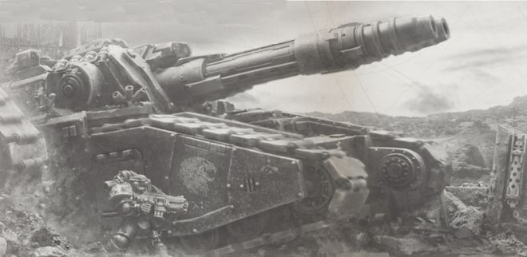
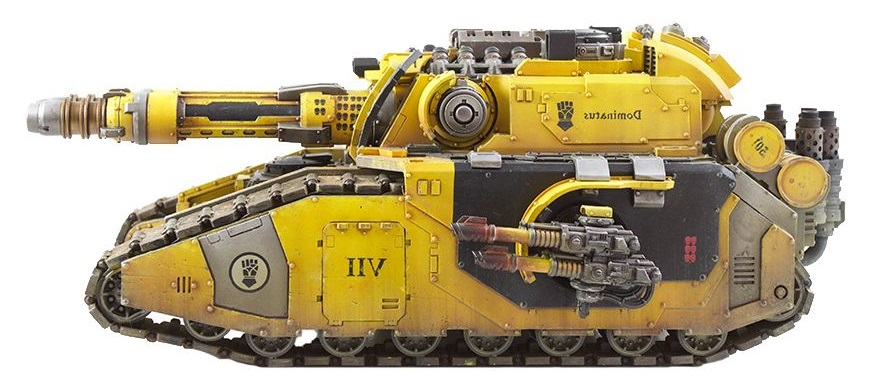
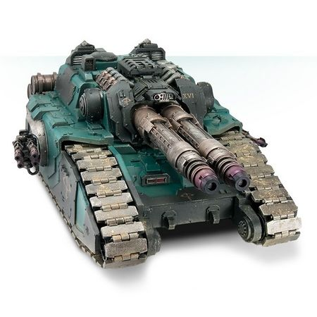
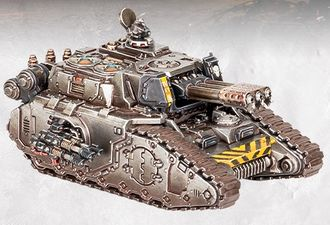

# 1519 弯刀超重型坦克歼击车 Falchion Super Heavy Tank Destroyer

精校状态：中文行文已逐段精校，部分术语仍为暂定

分类：载具 / 地面 / 超重型

原文来源：https://www.bilibili.com/opus/1045149582467530752

原作者：帝国神选罐头

原文时间：编辑于 2025年12月11日 08:27

[返回分类目录](目录.md) · [全书目录](../../目录.md)

<!-- A1519-B0001 -->
**英文原文**

The Falchion Super Heavy Tank Destroyer, also known as the Mammoth, was a Super Heavy Tank of the Legiones Astartes during the Great Crusade and Horus Heresy.

<!-- /A1519-B0001 -->

<!-- A1519-B0002 -->

原译文

弯刀超重型坦克歼击车，也被称为猛犸象，是大远征和荷鲁斯叛乱时期阿斯塔特军团的超重型坦克。

**校订译文**

弯刀超重型坦克歼击车亦称猛犸象，是阿斯塔特军团在大远征和荷鲁斯之乱期间使用的超重型坦克。

<!-- /A1519-B0002 -->

<!-- A1519-B0003 图片 -->

<!-- A1519-B0004 -->

原译文

Legion Falchion 军团弯刀

**校订译文**

Legion Falchion 军团弯刀

<!-- /A1519-B0004 -->

<!-- A1519-B0005 -->
## Overview 概述

<!-- /A1519-B0005 -->

<!-- A1519-B0006 -->
**英文原文**

The Falchion was developed long before the outbreak of the Horus Heresy, incorporating technology seen in both the Fellblade and Shadowsword. As it was was developed for the Great Crusade, its intended prey was not the enemy Titans it would later see such extensive combat against. As the Great Crusade expanded ever outward, the Expeditionary Fleets encountered a staggering array of foes, some of whom were of a truly gargantuan scale, but all were set to ravening flame by the touch of the Falchion’s Volcano cannon.

<!-- /A1519-B0006 -->

<!-- A1519-B0007 -->

原译文

弯刀是在荷鲁斯叛乱爆发之前很久开发的，融合了残暴刃和影剑中的技术。由于它是为大远征而开发的，它的目标猎物不是它后来会看到如此大规模战斗的敌方泰坦。随着大远征不断向外扩张，远征舰队遇到了一系列令人震惊的敌人，其中一些敌人的规模确实巨大，但所有敌人都被弯刀的火山炮焚尽了。

**校订译文**

弯刀在荷鲁斯之乱爆发很久以前便已研制成功，融合了残暴刃与影剑的技术。它原本为大远征而生，最初的预定猎物并非后来与之频繁交战的敌方泰坦。随着远征不断向外扩展，远征舰队遭遇了形形色色的敌人，其中一些体型极其庞大，但在弯刀的火山炮面前，它们都被狂暴烈焰吞噬。

<!-- /A1519-B0007 -->

<!-- A1519-B0008 -->
**英文原文**

During the Great Crusade, records of the Falchion devastating firepower were kept by the Ultramarines in their conquests of the formless overlord beings of the Psiom Reach, and from a company of Iron Hands to topple the mountain-fortresses of the Thulos Deeps.

<!-- /A1519-B0008 -->

<!-- A1519-B0009 -->

原译文

在大远征期间，极限战士在征服普西奥姆河段无定形霸主生物时，以及在钢铁之手连队摧毁图洛斯深处山脉堡垒时，都保存了弯刀毁灭性火力的记录。

**校订译文**

大远征期间，极限战士在征服普西奥姆星域的无定形霸主生物时，以及钢铁之手一个连在攻破图洛斯深域的山岳堡垒时，都留下了弯刀强大火力的记录。

**校注：** Reach与Deeps在星际远征语境是地理专名，不据字面译为河段／深处；暂定星域／深域，具体层级待核。

<!-- /A1519-B0009 -->

<!-- A1519-B0010 图片 -->

<!-- A1519-B0011 -->

原译文

Falchion Super Heavy Tank Destroyer 弯刀超重型坦克歼击车

**校订译文**

Falchion Super Heavy Tank Destroyer 弯刀超重型坦克歼击车

<!-- /A1519-B0011 -->

<!-- A1519-B0012 -->
## Weaponry 武器

<!-- /A1519-B0012 -->

<!-- A1519-B0013 -->
**英文原文**

The Falchion’s twin-mounted Volcano Cannon is one of the most powerful vehicle-mounted, anti-tank weapons in the Imperium’s arsenal and it requires such an investment in resources to construct just a single example that its use is limited to the Legiones Astartes. Even then, the Falchion is so rare that most Legions maintain but a handful, reserved for use against the largest of enemy war machines.

<!-- /A1519-B0013 -->

<!-- A1519-B0014 -->

原译文

弯刀的双联火山炮是帝国军械库中最强大的车载反坦克武器之一，而且仅制造一件就需要投入如此多的资源，它的使用仅限于阿斯塔特军团。即便如此，弯刀还是如此罕见，以至于大多数军团只保留了少数，专门用于对抗最大的敌方战争机器。

**校订译文**

弯刀的双装火山炮是帝国军械库中最强大的车载反坦克武器之一。仅制造一套就要投入巨量资源，因此只配发给阿斯塔特军团。即便如此，大多数军团也仅保有少量弯刀，专门用于对付敌方体型最大的战争机器。

<!-- /A1519-B0014 -->

<!-- A1519-B0015 图片 -->

<!-- A1519-B0016 -->

原译文

Falchion Super Heavy Tank Destroyer 弯刀超重型坦克歼击车

**校订译文**

Falchion Super Heavy Tank Destroyer 弯刀超重型坦克歼击车

<!-- /A1519-B0016 -->

<!-- A1519-B0017 -->
### Ascalon Super Heavy Tank 阿斯卡隆超重型坦克

<!-- /A1519-B0017 -->

<!-- A1519-B0018 -->
**英文原文**

The Ascalon Super Heavy Tank is a variant of the Falchion, which is equipped with a Ascalon Inferno Gun. This Titan-sized weapon is capable of torching whole battalions of enemy infantry.

<!-- /A1519-B0018 -->

<!-- A1519-B0019 -->

原译文

阿斯卡隆超重型坦克是弯刀的变体，配备了阿斯卡隆炼狱炮。这种泰坦大小的武器能够烧毁整个敌方步兵营。

**校订译文**

阿斯卡隆超重型坦克是弯刀的改型，装备阿斯卡隆炼狱炮。这门泰坦规格的武器能将成营的敌军步兵烧成灰烬。

<!-- /A1519-B0019 -->

<!-- A1519-B0020 图片 -->

<!-- A1519-B0021 -->

原译文

Falchion Ascalon 阿斯卡隆弯刀

**校订译文**

Falchion Ascalon 阿斯卡隆弯刀

<!-- /A1519-B0021 -->

<!-- A1519-B0022 -->
## Known Mammoth Tanks 著名猛犸象坦克

<!-- /A1519-B0022 -->

<!-- A1519-B0023 -->
**英文原文**

Mordant — Used by the Death Guard at the Drop Site Massacre

<!-- /A1519-B0023 -->

<!-- A1519-B0024 -->

原译文

尖刻 — 登陆点大屠杀中由死亡守卫使用

**校订译文**

尖刻号——死亡守卫在登陆点大屠杀中使用的车辆。

<!-- /A1519-B0024 -->

<!-- A1519-B0025 -->
**英文原文**

Zarathruttrax — Used by the Sons of Horus during the Horus Heresy

<!-- /A1519-B0025 -->

<!-- A1519-B0026 -->

原译文

黄金之星 — 荷鲁斯叛乱时期由荷鲁斯之子使用

**校订译文**

扎拉斯鲁特拉克斯号——荷鲁斯之子在荷鲁斯之乱期间使用的车辆。

**校注：** Zarathruttrax为专名，所给英语无黄金之星语义依据，暂音译，原译保留。

<!-- /A1519-B0026 -->

本篇核心术语与暂定项

以下列出本篇出现的英文原形及核心术语表用词。同形词可能指不同对象，具体词义以本篇正文和校注为准；单复数、别名和仅见于图注的名称可能尚未列入。完整候选见[术语表](../../术语表/双语术语候选.csv)。

| 英文 | 采用中文 | 状态 |
| --- | --- | --- |
| Death Guard | 死亡守卫 | 官方已核对 |
| Ultramarines | 极限战士 | 官方已核对 |
| Horus Heresy | 荷鲁斯之乱 | 官方已核对 |
| Imperium | 帝国 | 暂定·简称 |
| Great Crusade | 大远征 | 暂定·官方待核 |
| Horus | 荷鲁斯 | 暂定·官方待核 |
| Sons of Horus | 荷鲁斯之子 | 暂定·官方待核 |
| Iron Hands | 钢铁之手 | 暂定·官方待核 |
| Legiones Astartes | 阿斯塔特军团 | 暂定·官方待核 |
| Titan | 泰坦 | 暂定·官方待核 |
| Destroyer | 毁灭者 | 暂定·官方待核 |
| Overlord | 霸主 | 官方已核对 |
| Shadowsword | 影剑 | 官方已核对 |
| Gun | 甘 | 暂定·官方待核 |
| Inferno Gun | 炼狱炮 | 暂定·官方待核 |
| Volcano cannon | 火山炮 | 官方已核对 |
| Fellblade | 残暴刃 | 暂定·官方待核 |
| Psiom Reach | 普西奥姆星域 | 暂定·官方待核 |
| Thulos Deeps | 图洛斯深域 | 暂定·官方待核 |
| Zarathruttrax | 扎拉斯鲁特拉克斯号 | 暂定·官方待核 |
| Ascalon Super Heavy Tank | 阿斯卡隆超重型坦克 | 暂定·官方待核 |

