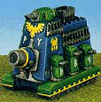

# 1520 利维坦超重型突击运输车 Leviathan Super Heavy Assault Transport

精校状态：中文行文已逐段精校，部分术语仍为暂定

分类：载具 / 地面 / 超重型

原文来源：https://www.bilibili.com/opus/1047023193285460004

原作者：帝国神选罐头

原文时间：2025年03月22日 12:24

[返回分类目录](目录.md) · [全书目录](../../目录.md)

<!-- A1520-B0001 -->
**英文原文**

The Leviathan super-heavy assault transport is based on the same chassis as the Colossus.

<!-- /A1520-B0001 -->

<!-- A1520-B0002 -->

原译文

利维坦超重型突击运输车基于与巨像相同的底盘。

**校订译文**

利维坦超重型突击运输车基于与巨像相同的底盘。

<!-- /A1520-B0002 -->

<!-- A1520-B0003 图片 -->

<!-- A1520-B0004 -->

原译文

Leviathan super-heavy warmachine 利维坦超重型战争机械

**校订译文**

Leviathan super-heavy warmachine 利维坦超重型战争机械

<!-- /A1520-B0004 -->

<!-- A1520-B0005 -->
## Description 描述

<!-- /A1520-B0005 -->

<!-- A1520-B0006 -->
**英文原文**

Built by the Squats, this awesome vehicle was supplied to the Imperial Guard as part of the mutual exchange of materials between the Homeworlds and the Imperium of Man. The Imperium uses its Leviathans as gigantic army group command centres for coordinating the vast numbers of men and vehicles found in Imperial Guard Regiments. The Squats employed the Leviathan as a massive troop carrier to transport special "Ironbreaker" Brotherhoods of Squat warriors into combat.

<!-- /A1520-B0006 -->

<!-- A1520-B0007 -->

原译文

由矮人制造，这辆令人敬畏的车辆被提供给帝国卫队，作为家园世界和人类帝国之间相互交换物资的一部分。帝国将其利维坦作为庞大的集团军指挥中心，协调帝国卫队中的大量人员和车辆。矮人使用利维坦作为大型运兵车，将矮人战士的特殊“破铁者”兄弟运送到战斗中。

**校订译文**

利维坦由矮人制造，作为家园世界与人类帝国物资互换的一部分，供应给帝国卫队。帝国将其用作庞大的集团军指挥中心，协调各卫队团的大量人员和车辆。矮人则把它用作大型运兵车，将专门的“破铁者”战士兄弟会运上战场。

<!-- /A1520-B0007 -->

<!-- A1520-B0008 -->
**英文原文**

Standing a 100 or over 90 metres tall, each Leviathan contains extensive communication and surveillance equipment - including satellite uplinks and tiny flying spy robots - to allow a Colonel and his command staff to coordinate an entire regiment all at once. It also has room to carry an entire infantry company into battle. The Leviathan's main tactical command centre is a tiered chamber filled with display console and hundreds of logic engines with a strategium pit projecting a large holographic display at its centre. It projects a 3D continental map, tracking Guard movements and showing assessed enemy activities and emplacements as well as reported firefights in red, yellow, crimson and brown indicator runes. The command centre is manned by intelligence officers, tacticians and high-order servitors. Despite appearances, some Leviathans have luxurious rooms deep in their interior for formal officers' functions and events. A Leviathan is equipped with an intercom system to facilitate internal communications. Battle-data collected by the Leviathan's command centre can be shared with the data-slates of frontline officers over the vox-net.

<!-- /A1520-B0008 -->

<!-- A1520-B0009 -->

原译文

每辆利维坦高100米或90米以上，都装有广泛的通信和监视设备，包括卫星上行链路和微型飞行间谍机器人，使团长和他的指挥人员能够同时协调整个团。它也有足够的空间将整个步兵连队带入战斗。利维坦的主要战术指挥中心是一个分层的房间，里面装满了显示控制台和数百个逻辑引擎，中心有一个战略坑，投影着一个大型全息显示器。它投影了一张3D大陆地图，跟踪卫队的行动，并以红色、黄色、深红色和棕色指示符文显示评估的敌方活动和阵地，以及报告的交火情况。指挥中心由情报员、战术家和高级机仆组成。尽管外表如此，一些利维坦在内部深处有豪华的房间，用于正式官员的宴会和社交。利维坦配备了对讲系统，以方便内部通信。利维坦指挥中心收集的作战数据可以通过音阵网络与前线军官的数据板共享。

**校订译文**

利维坦高达100米，或超过90米，内部配有大量通讯与监视设备，包括卫星上行链路和微型飞行侦察机器人，使一名上校及其参谋能够同时协调全团行动。它还能搭载一整个步兵连投入战斗。主要战术指挥中心是一座分层大厅，设有显示控制台和数百台逻辑引擎，中央下沉式指挥区投射出大型全息影像。立体大陆地图追踪帝国卫队的动向，并以红、黄、深红及棕色符文标示推定的敌军活动、阵地和已报告的交火情况。情报军官、战术专家及高阶机仆共同操作指挥中心。与粗犷的外观不同，一些利维坦内部深处还设有豪华房间，供军官举办正式仪式与活动。车内设有对讲系统；指挥中心收集的战斗数据则可经通讯网络，分享至前线军官的数据板。

**校注：** 英文高度保留100米或90余米两种描述，不私自选一。

<!-- /A1520-B0009 -->

<!-- A1520-B0010 -->
**英文原文**

A Leviathan also has a landing pad on its hunched back, capable of accommodating lifters, gunships and fliers like Valkyries and Destriers for refuelling and personnel transfer. The pad also has as a freight hoist, allowing landed freight objects to directly be brought onboard. The objects are deposited into a freight silo deep in the bowls of the vehicle. The Leviathan is powered by a huge enginarium in its belly featuring vast turbine powerplants to power its machinery, overseen by tech-adepts and engineers.

<!-- /A1520-B0010 -->

<!-- A1520-B0011 -->

原译文

利维坦的后背还有一个着陆台，能够容纳升降机、炮艇和瓦尔基里与破坏者等飞行器，用于加油和人员转移。该平台还具有货运升降机功能，可以直接将着陆的货物运送到车上。这些物品被存放在车辆深处的货运筒仓中。利维坦号由其腹部的一个巨大发动机提供动力，该发动机配备了巨大的涡轮动力装置，为其机械提供动力，由技术专家和工造士监督。

**校订译文**

利维坦隆起的背部还设有起降平台，供运输飞行器、炮艇，以及瓦尔基里和战马等飞机补充燃料、转运人员。平台配有货物升降装置，可将卸下的货物直接送入车体深处的货仓。车辆腹部设有巨大的动力舱，由大型涡轮动力装置为全车设备供能，并由技术教士和工程师监管。

**校注：** lifters指升降／运输飞行器，不是平台升降机；另文freight hoist才是货物升降装置。Destrier暂按战马译名，非毁坏者的英语Destroyer。

<!-- /A1520-B0011 -->

<!-- A1520-B0012 -->
**英文原文**

Protecting the Leviathan are metres-thick armour plating and four Titan-scale Void Shields. Its primary weapon is the massive Doomsday Cannon mounted in the prow of the vehicle. It also carries a turreted Battlecannon, Lascannons and Bolters that can provide all-around protection. The Doomsday Cannon can be heard from fifty miles away firing ten-yard long shells. Leviathans can also mount Mega-bolters. Its armament are primarily designed to engage and destroy infantry. In a Leviathan-on-Leviathan duel, it is impossible for one to destroy the other, as soon as the Void shields are raised. However, an immobilised Leviathan is vulnerable to boarding action by another. For this reason, Leviathans carry Corvus ramps. To detect unauthorised intruders, a Leviathan is equipped with internal scanners.

<!-- /A1520-B0012 -->

<!-- A1520-B0013 -->

原译文

保护利维坦的是数米厚的装甲板和四个泰坦级的虚空盾。它的主要武器是安装在车辆前部的巨大的末日炮。它还配备了炮塔式战斗炮、激光炮和爆矢枪，可以提供全方位的保护。从五十英里外可以听到末日大炮发射十码长的炮弹。利维坦还可以安装巨型爆矢枪。它的武器主要是用来攻击和摧毁步兵的。在利维坦对利维坦决斗中，一旦虚空盾升起，一方就不可能摧毁另一方。然而，一辆一动不动的利维坦很容易受到另一辆的攻击。因此，利维坦携带渡鸦突击舱。为了检测未经授权的入侵者，利维坦配备了内部扫描仪。

**校订译文**

数米厚的装甲和4重泰坦规格虚空盾保护着利维坦。其主武器是车首的巨型末日炮，另有炮塔战斗炮、激光炮和爆矢枪提供全方位防御。末日炮发射长达10码的炮弹，炮声在50英里外仍清晰可闻。利维坦还可安装巨型爆矢枪，其武装主要用于消灭步兵。两辆利维坦对决时，只要双方虚空盾升起，便无法摧毁对方；但失去机动能力的车辆易遭另一辆车派兵登车突击。因此，利维坦配有渡鸦登车跳板，并以内部扫描仪侦测未经许可的入侵者。

**校注：** Corvus ramps为登车跳板，并非突击舱；不可与其他渡鸦型舱体混同。

<!-- /A1520-B0013 -->

<!-- A1520-B0014 -->
**英文原文**

Leviathans can be docked together to serve as a mobile campaign HQ, forming a cross if four such vehicles are involved.

<!-- /A1520-B0014 -->

<!-- A1520-B0015 -->

原译文

利维坦可以停靠在一起作为移动作战总部，如果涉及四辆这样的车辆，就可以形成一个十字。

**校订译文**

多辆利维坦可相互对接，组成移动战役指挥部；4辆对接时便形成十字形布局。

<!-- /A1520-B0015 -->

<!-- A1520-B0016 -->
## Known patterns 已知型号

<!-- /A1520-B0016 -->

<!-- A1520-B0017 -->
**英文原文**

Valhallan Pattern Mk IV Leviathan Mobile Command Center

<!-- /A1520-B0017 -->

<!-- A1520-B0018 -->

原译文

瓦尔哈拉型Mk IV利维坦移动指挥中心

**校订译文**

瓦尔哈拉型Mk IV利维坦移动指挥中心

<!-- /A1520-B0018 -->

<!-- A1520-B0019 -->
## Known Named Leviathans 著名利维坦

<!-- /A1520-B0019 -->

<!-- A1520-B0020 -->

原译文

Execubitoi Castellum 军事堡垒

**校订译文**

Execubitoi Castellum 军事堡垒号

<!-- /A1520-B0020 -->

<!-- A1520-B0021 -->

原译文

Magnificence 华丽

**校订译文**

Magnificence 华丽号

<!-- /A1520-B0021 -->

本篇核心术语与暂定项

以下列出本篇出现的英文原形及核心术语表用词。同形词可能指不同对象，具体词义以本篇正文和校注为准；单复数、别名和仅见于图注的名称可能尚未列入。完整候选见[术语表](../../术语表/双语术语候选.csv)。

| 英文 | 采用中文 | 状态 |
| --- | --- | --- |
| Imperial Guard | 帝国卫队 | 暂定·语境区分 |
| Imperium of Man | 人类帝国 | 官方已核对 |
| Imperium | 帝国 | 暂定·简称 |
| Equipment | 装备 | 编辑用语已统一 |
| Squats | 矮人 | 暂定·官方待核 |
| Titan | 泰坦 | 暂定·官方待核 |
| Tech | 技术语 | 暂定·官方待核 |
| Slates | 板币 | 暂定·官方待核 |
| System | 星系（恒星系统） | 暂定·官方待核 |
| Army Group | 集团军群 | 暂定·官方待核 |
| Colossus | 巨像号 | 暂定·官方待核 |
| Corvus ramps | 渡鸦登车跳板 | 暂定·官方待核 |

