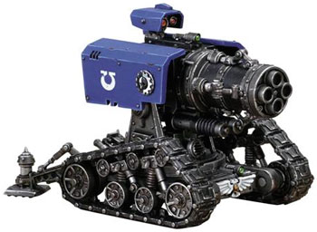
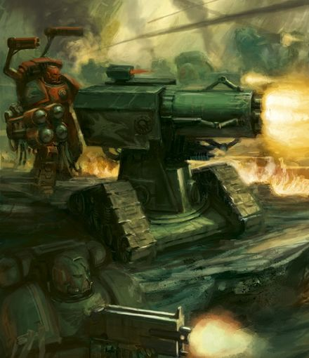

# 1521 雷火炮 Thunderfire Cannon

精校状态：中文行文已逐段精校，部分术语仍为暂定

分类：载具 / 地面 / 火炮

原文来源：https://www.bilibili.com/opus/1006596040469512194

原作者：帝国神选罐头

原文时间：2024年12月03日 13:46

[返回分类目录](目录.md) · [全书目录](../../目录.md)

<!-- A1521-B0001 -->
**英文原文**

The Thunderfire Cannon is a large, multi-barreled cannon on treads that is operated by a Space Marine Techmarine.

<!-- /A1521-B0001 -->

<!-- A1521-B0002 -->

原译文

雷火炮是一种大型多管火炮，由星际战士技术军士操作。

**校订译文**

雷火炮是一种装在履带底座上的大型多管火炮，由星际战士科技战士操作。

<!-- /A1521-B0002 -->

<!-- A1521-B0003 -->
## Overview 概述

<!-- /A1521-B0003 -->

<!-- A1521-B0004 -->
**英文原文**

An exception to the general rule regarding Space Marine weaponry being highly portable, the Thunderfire Cannon is most commonly used in terrain where mobile artillery platforms (i.e. Whirlwind) cannot operate, or when a defensive emplacement must be maintained. These colossal weapons are mounted on rugged tracks which provides a level of mobility, although they are most often deployed Thunderhawk Gunships or other transports.

<!-- /A1521-B0004 -->

<!-- A1521-B0005 -->

原译文

作为关于星际战士武器高度便携的一般规则的一个例外，雷火炮最常用于移动火炮平台（即旋风）无法操作的地形，或者必须维护防御阵地的地形。这些巨大的武器安装在结实的履带上，提供了一定程度的机动性，尽管它们最常部署在雷鹰炮艇或其他运输工具上。

**校订译文**

星际战士武器通常便于机动部署，雷火炮则是例外。它多用于旋风等自行火炮无法活动的地形，或需要坚守防御阵地的场合。坚固的履带底座赋予这种巨型武器一定机动性，但它通常仍需由雷鹰炮艇或其他运输载具运抵战场。

**校注：** deployed Thunderhawk Gunships缺介词，依运输语境理解为由炮艇部署，不是将火炮安装在炮艇上。

<!-- /A1521-B0005 -->

<!-- A1521-B0006 图片 -->

<!-- A1521-B0007 -->

原译文

Space Marine Thunderfire Cannon 星际战士雷火炮

**校订译文**

Space Marine Thunderfire Cannon 星际战士雷火炮

<!-- /A1521-B0007 -->

<!-- A1521-B0008 -->
**英文原文**

Their quad-barrel nature allows for a punishing rate of fire, and each Cannon is capable of firing three different varieties of shot. The first type of shell detonates on surface contact, commonly used against infantry in the open, while the airburst shell is employed against infantry taking cover. The most devastating, however, are the subterranean shells, programmed to burrow into the ground before exploding. The resulting explosion causes seismic disruptions which can knock the enemy off-balance, making them easier targets for follow-up fire. This affects even grav-vehicles, whose anti-gravity generators are negatively impacted by the sub-surface shockwaves caused by the shells.

<!-- /A1521-B0008 -->

<!-- A1521-B0009 -->

原译文

它们的四联枪管特性允许持久的开火，每门炮能够发射三种不同类型的子弹。第一种炮弹在接触地面时引爆，通常用于对付开阔地带的步兵，而空爆炮弹则用于对付掩护步兵。然而，最具破坏性的是地下弹药，它们被编程为在爆炸前钻入地下。由此产生的爆炸会造成地震破坏，使敌人失去平衡，使他们更容易成为后续火力的目标。这甚至影响到反重力车辆，其反重力发生器受到炮弹引起的地下冲击波的负面影响。

**校订译文**

四根炮管赋予雷火炮猛烈的射速，每门炮可发射3种弹药。第一种在接触目标表面时引爆，通常用于对付开阔地上的步兵；空爆弹则用于打击躲在掩体中的步兵。破坏力最强的是地下爆破弹，预设程序使其先钻入地下再引爆。爆炸造成地面震动，令敌人失去平衡，便于后续火力命中。即使反重力车辆也难以幸免，其发生器会受到地下冲击波的干扰。

<!-- /A1521-B0009 -->

<!-- A1521-B0010 图片 -->

<!-- A1521-B0011 -->

原译文

Salamanders Techmarine with Thunderfire Cannon 火蜥蜴技术军士配备雷火炮

**校订译文**

Salamanders Techmarine with Thunderfire Cannon 操作雷火炮的火蜥蜴科技战士

<!-- /A1521-B0011 -->

<!-- A1521-B0012 -->
**英文原文**

A Land Raider variant, the Land Raider Achilles, uses the Thunderfire cannon as its main weapon.

<!-- /A1521-B0012 -->

<!-- A1521-B0013 -->

原译文

一种兰德掠袭者变体，阿喀琉斯型兰德掠袭者，使用雷火炮作为其主要武器。

**校订译文**

一种兰德掠袭者变体，阿喀琉斯型兰德掠袭者，使用雷火炮作为其主要武器。

**校注：** 本篇称雷火炮为阿喀琉斯主武器，但1511技术表列副武器；保留源文称法并提示版本差异。

<!-- /A1521-B0013 -->

本篇核心术语与暂定项

以下列出本篇出现的英文原形及核心术语表用词。同形词可能指不同对象，具体词义以本篇正文和校注为准；单复数、别名和仅见于图注的名称可能尚未列入。完整候选见[术语表](../../术语表/双语术语候选.csv)。

| 英文 | 采用中文 | 状态 |
| --- | --- | --- |
| Techmarine | 科技战士 | 官方已核对 |
| Land Raider | 兰德掠袭者战车 | 官方已核对 |
| Whirlwind | 旋风战车 | 官方已核对 |
| Space Marine | 星际战士 | 暂定·官方待核 |
| Raider | 掠袭者飞艇 | 官方已核对 |
| Land Raider Achilles | 阿喀琉斯型兰德掠袭者 | 暂定·官方待核 |

