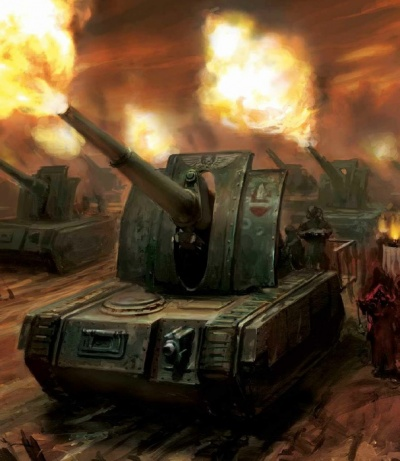
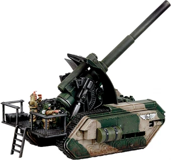
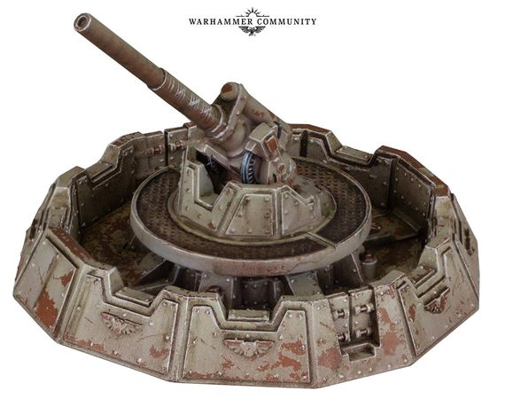
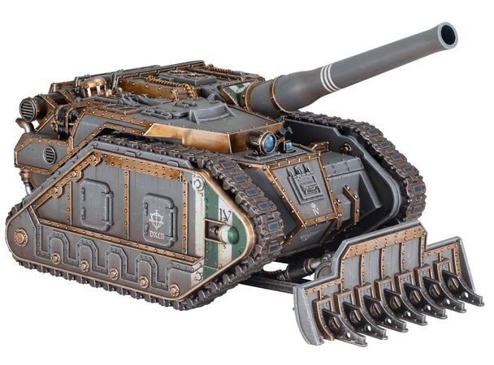
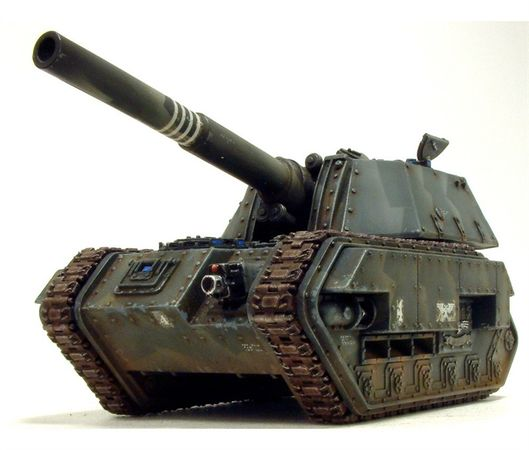
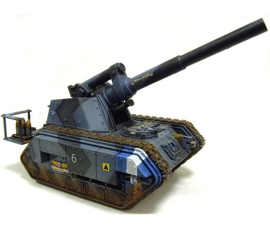
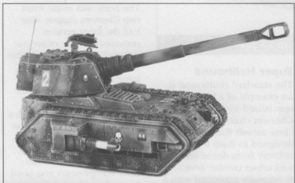

# 1522 石化蜥蜴火炮 Basilisk Artillery

精校状态：中文行文已逐段精校，部分术语仍为暂定

分类：载具 / 地面 / 火炮

原文来源：https://www.bilibili.com/opus/1046644183899570178

原作者：帝国神选罐头

原文时间：2025年03月21日 11:53

[返回分类目录](目录.md) · [全书目录](../../目录.md)

<!-- A1522-B0001 -->
**英文原文**

The Basilisk is the main line artillery piece of Imperial Guard Regiments throughout the Imperium, designed to provide medium to long-range fire support. Among the most numerous and well-known of the Guard's artillery the Basilik is based on the Chimera chassis and mounts an Earthshaker Cannon for direct and indirect fire.

<!-- /A1522-B0001 -->

<!-- A1522-B0002 -->

原译文

石化蜥蜴是帝国卫队在整个帝国的主力火炮，旨在提供中远程火力支援。在卫队数量最多、最著名的火炮中，石化蜥蜴以奇美拉底盘为基础，安装了一门用于直接和间接射击的震地炮。

**校订译文**

石化蜥蜴是帝国各地帝国卫队团的主力火炮，负责提供中远程火力支援。它以奇美拉底盘为基础，搭载可进行直射与间接射击的震地炮，是卫队数量最多、最广为人知的火炮之一。

<!-- /A1522-B0002 -->

<!-- A1522-B0003 图片 -->

<!-- A1522-B0004 -->

原译文

battery of Basilisks firing 开火的石化蜥蜴群

**校订译文**

battery of Basilisks firing 正在开火的石化蜥蜴炮群

<!-- /A1522-B0004 -->

<!-- A1522-B0005 -->
## Battlefield Role 战场角色

<!-- /A1522-B0005 -->

<!-- A1522-B0006 -->
**英文原文**

While many regiments will have a mix of other artillery, including Manticores, Griffons and Bombards, and each one will have its own role to fill, it is the Basilisk which is the most common and most often to be called upon to bombard the enemy. These self-propelled artillery pieces are most effective when used in massive batteries of hundreds of guns to deliver devastating barrages on the enemy's position, while their mobility allows them to keep pace with infantry advances. This indirect fire will be directed by their parent company's forward observers or other officers trained to direct artillery, and while not particularly accurate it allows the Basilisk to remain out of harms way as it blasts concealed enemy positions or fortifications from long range. Besides these sustained bombardments the power and range of the Earthshaker Cannon allows for other type of artillery missions: counter-battery fire to suppress enemy guns, box barrages to isolate enemy units and prevent their reinforcement, harassing fire, and destructive fire of selected targets. Most missions use high explosive rounds, but to Basilisks are often issued other more specialized rounds, such as smoke shells, incendary shells and illumination shells for lighting up a battlefield at night.

<!-- /A1522-B0006 -->

<!-- A1522-B0007 -->

原译文

虽然许多兵团将混合使用其他火炮，包括蝎尾狮、狮鹫和臼炮，每个都有自己的角色，但石化蜥蜴是最常见、最常被用来轰炸敌人的。这些自行火炮在数百门火炮组成的大型炮群中使用时最为有效，可以对敌人的阵地进行毁灭性的炮击，而它们的机动性使它们能够跟上步兵的前进步伐。这种间接火力将由母连队的前方观察员或其他受过指挥火炮训练的军官指挥，虽然不是特别准确，但它使石化蜥蜴在远程轰炸隐蔽的敌方阵地或防御工事时不会受到伤害。除了这些持续的轰炸外，震地炮的功率和射程还允许执行其他类型的火炮任务：反炮兵火力压制敌方火炮，箱式弹幕隔离敌方部队并防止其增援，骚扰火力和对选定目标的破坏性火力。大多数任务都使用高爆弹，但石化蜥蜴通常会发射其他更专业的弹药，如烟雾弹、燃烧弹和夜间照亮战场的照明弹。

**校订译文**

许多团同时装备蝎尾狮、狮鹫和臼炮等火炮，各有分工，但最常见、也最常受命轰击敌军的仍是石化蜥蜴。数百门石化蜥蜴组成大型炮群时，能向敌方阵地倾泻毁灭性的弹幕；自行底盘则让它们跟得上步兵推进。间接射击由所属炮兵连的前进观察员，或其他受过炮火引导训练的军官指挥。这种射击虽然精度有限，却能让车辆在远离敌方威胁的位置，轰击隐蔽阵地和工事。震地炮的威力与射程还使其能够执行其他任务：以反炮兵射击压制敌炮，设置方框形封锁弹幕隔离敌军并阻断增援，实施骚扰射击，以及摧毁指定目标。大多数任务使用高爆弹，但车辆也常获配烟雾弹、燃烧弹和夜间照明弹等专用弹药。

<!-- /A1522-B0007 -->

<!-- A1522-B0008 图片 -->

<!-- A1522-B0009 -->

原译文

Imperial Guard Basilisk 帝国卫队石化蜥蜴

**校订译文**

Imperial Guard Basilisk 帝国卫队石化蜥蜴

<!-- /A1522-B0009 -->

<!-- A1522-B0010 -->
**英文原文**

The powerful shells fired by the earthshaker cannon are capable of smashing apart the enemy lines with ease and are designed to cause catastrophic damage at the impact zone. Targets at the epicentre of such a detonation are immolated immediately, while those in the vicinity are pulverised by the deadly shock wave. The unmistakable shriek of the Basilisks’ incoming ordnance is rightly feared by the enemies of the Emperor. Shells fired by the Basilisk are a metre long and can create blast-zones many kilometres across. The shells can blast a crater fifteen metres in diameter into the ground on impact.

<!-- /A1522-B0010 -->

<!-- A1522-B0011 -->

原译文

震地炮发射的威力强大的炮弹能够轻易地摧毁敌人的防线，并在撞击区造成灾难性的破坏。爆炸中心的目标立即被摧毁，而附近的目标则被致命的冲击波摧毁。石化蜥蜴发射的弹药发出的清晰可辨的尖啸声，理所当然地让帝皇的敌人感到恐惧。石化蜥蜴发射的炮弹有一米长，可以形成数公里宽的爆炸区。这些炮弹在撞击时可以炸出直径15米的弹坑。

**校订译文**

震地炮弹威力强大，能轻易撕裂敌军防线，在着弹区造成灾难性破坏。爆心目标立即被焚毁，附近目标则被致命冲击波粉碎。帝皇的敌人有充分理由畏惧石化蜥蜴炮弹来袭时那独特的尖啸。炮弹长1米，可形成横跨数公里的爆炸影响区，并在着弹处炸出直径15米的弹坑。

**校注：** 爆炸影响区数公里、弹坑15米均依底稿保留；不据现实弹药常识自行改设定数值。

<!-- /A1522-B0011 -->

<!-- A1522-B0012 -->
**英文原文**

However the Basilisk has also proven its worth as an assault gun, using cannon's low angle of elevation to engage targets at short range in direct support of troops. The high explosive shells fired by the Basilisk are as devastating to infantry and tanks as they are to fortifications, however it is no replacement for a true Battle Tank. The lack of ablative armouring and exposed fighting position leaves the Basilisk highly exposed to enemy fire and hostile environments, although many patterns go some way towards correcting this by incorporating an Enclosed Crew Compartment. Basilisks tasked for direct fire support will be detached from their parent company and placed under the temporary command of the tank or infantry company it is intended to support. Basilisk's have been observed in a variety of roles, such as anti-aircraft.

<!-- /A1522-B0012 -->

<!-- A1522-B0013 -->

原译文

然而，石化蜥蜴也证明了它作为突击炮的价值，它利用大炮的低仰角在短距离内与目标交战，直接支援部队。石化蜥蜴发射的高爆弹对步兵和坦克的破坏性与对防御工事的破坏性一样大，但它并不能取代真正的战斗坦克。缺乏烧蚀装甲和暴露的战斗位置使石化蜥蜴高度暴露在敌人的火力和有害环境中，尽管许多型号通过包含封闭的乘员舱在一定程度上修正了这一点。负责直接火力支援的石化蜥蜴将从其母连队中分离出来，并置于其打算支援的坦克或步兵连的临时指挥之下。石化蜥蜴已被观察到具有多种作用，如防空。

**校订译文**

石化蜥蜴也能用作突击炮，以低仰角炮火在近距离直接支援部队。其高爆弹对步兵、坦克和工事都极具杀伤力，但它仍无法取代真正的战斗坦克。由于缺少烧蚀装甲且炮位敞开，它容易受到敌方火力和恶劣环境影响；一些型号通过封闭式战斗舱改善了防护。受命进行直射支援的车辆会暂时脱离所属炮兵连，改归受援的坦克连或步兵连指挥。此外，也有石化蜥蜴用于防空等任务的记录。

<!-- /A1522-B0013 -->

<!-- A1522-B0014 图片 -->

<!-- A1522-B0015 -->

原译文

Basilisk anti-aircraft emplacement 石化蜥蜴防空阵地

**校订译文**

Basilisk anti-aircraft emplacement 石化蜥蜴防空阵地

<!-- /A1522-B0015 -->

<!-- A1522-B0016 -->
**英文原文**

During the Great Crusade and Horus Heresy, the Basilisk was also used by siege units of the Space Marine Legions. The Iron Warriors, in particular, were noted to have fielded many in their role as expert siegebreakers. The Ultramarines are also known to have fielded Basilisks.

<!-- /A1522-B0016 -->

<!-- A1522-B0017 -->

原译文

在大远征和荷鲁斯叛乱期间，石化蜥蜴也被星际战士的攻城部队使用。特别值得注意的是，钢铁勇士被注意到在作为专业攻城者的角色中投入使用了许多石化蜥蜴。众所周知，极限战士也部署了石化蜥蜴。

**校订译文**

大远征与荷鲁斯之乱期间，星际战士军团的攻城部队也使用石化蜥蜴。擅长攻城的钢铁勇士尤其大量装备此炮，极限战士同样有使用记录。

<!-- /A1522-B0017 -->

<!-- A1522-B0018 -->
## Technical Information 技术资料

原题：Technical Information 技术信息

<!-- /A1522-B0018 -->

<!-- A1522-B0019 -->
**英文原文**

The Basilisk is fully mobile and can keep up with infantry advances and, if necessary, can be deployed in moments. It retains all the basic features of the Chimera, but replaces the troop compartment for an open top firing platform for the main cannon and armoured gun shield. The driver and vehicle commander sit forward in the vehicle as in the Chimera, with the commander manning the Basilisk's hull-mounted Heavy Bolter, while the gunner and loader operate the cannon. Its main weapon is the Earthshaker Cannon, firing 132mm shells to a range of over fifteen, twenty or even a hundred kilometers and a muzzle velocity of 814 m/s.

<!-- /A1522-B0019 -->

<!-- A1522-B0020 -->

原译文

石化蜥蜴是完全机动的，可以跟上步兵的前进，如有必要，可以在短时间内部署。它保留了奇美拉的所有基本特征，但将部队隔间替换为主炮和装甲炮盾的开放式射击平台。驾驶员和车辆指挥官坐在车里，就像在奇美拉里一样，指挥官负责操纵石化蜥蜴的车体安装的重型爆矢枪，而炮手和装载者则操作大炮。它的主要武器是震地炮，发射132毫米炮弹，射程超过15、20甚至100公里，初速为814米/秒。

**校订译文**

石化蜥蜴可自行机动，跟随步兵推进，并在需要时迅速进入射击状态。它保留奇美拉的基本结构，但将运兵舱改为带装甲炮盾的敞开式主炮平台。驾驶员与车长仍位于车体前部，车长操纵车体重型爆矢枪，炮手和装填手则操作主炮。震地炮发射132毫米炮弹，炮口初速为814米／秒；记载中的射程可超过15公里、20公里，甚至100公里。

**校注：** 原文同时列15／20／100公里射程；未给明确型号对应，保留多种记载并待核。

<!-- /A1522-B0020 -->

<!-- A1522-B0021 图片 -->

<!-- A1522-B0022 -->

原译文

Solar Auxilia Mars-Solar Pattern Basilisk 太阳辅助军火星-太阳型石化蜥蜴

**校订译文**

Solar Auxilia Mars-Solar Pattern Basilisk 太阳辅助军火星-太阳型石化蜥蜴

<!-- /A1522-B0022 -->

<!-- A1522-B0023 -->
**英文原文**

Some Basilisk will incorporate an enclosed fighting compartment to provide additional protect for the exposed gunner and loader, however the added recoil restrictions means they are unable to use the more powerful six and seven charges when firing their cannons, slightly limiting their maximum range compared to open-topped or platform-based artillery. The Basilisk can also incorporate four recoil braces that can anchor the vehicle to the ground during combat operations and an autoloader which allows it to fire a shell every few seconds.

<!-- /A1522-B0023 -->

<!-- A1522-B0024 -->

原译文

一些石化蜥蜴将配备一个封闭的战斗舱，为暴露的炮手和装载者提供额外的保护，但增加的后坐力限制意味着他们在发射大炮时无法使用更强大的六号和七号装药，与开顶式或平台式火炮相比，这略微限制了他们的最大射程。石化蜥蜴还可以包含四个后坐力支架，可以在战斗行动中将车辆固定在地面上，以及一个自动装弹器，可以每隔几秒钟发射一发炮弹。

**校订译文**

部分石化蜥蜴配有封闭式战斗舱，以保护原本暴露在外的炮手与装填手。但舱室限制了火炮后坐，因此不能使用威力更大的六号、七号装药，最大射程也略逊于敞顶式或平台式火炮。车辆还可加装4具抗后坐支撑装置，在射击时将车体固定于地面；自动装填机则能使其每隔数秒发射一弹。

<!-- /A1522-B0024 -->

<!-- A1522-B0025 -->
**英文原文**

The Basilisk can also have a gunsight for the gunner that incorporates a range counter and multiple magnification levels. The Basilisks Multi-burn engine, the Vulcanor pattern, type XVI twin coupled rotary bio-gas power engine, can run on gasoline, kerosene, alcohol, charcoal, vegetative matter and other fuel sources.

<!-- /A1522-B0025 -->

<!-- A1522-B0026 -->

原译文

蛇怪还可以为炮手配备一个瞄准器，该瞄准器包含一个距离计数器和多个放大倍数。石化蜥蜴多程燃烧发动机，火神型，XVI型双耦合旋转生物燃气动力发动机，可以使用汽油、煤油、酒精、木炭、植物质和其他燃料来源。

**校订译文**

炮手还可使用带测距功能与多档倍率的瞄准镜。石化蜥蜴的Vulcanor型XVI双联旋转式生物燃气发动机可使用多种燃料，包括汽油、煤油、酒精、木炭、植物材料等。

<!-- /A1522-B0026 -->

<!-- A1522-B0027 -->
**英文原文**

Basilisks also include a Searchlight and Smoke Launchers as standard, while many crews will modify their vehicle with Camo Netting, a Dozer Blade, Extra Armour, a Hunter-Killer Missile and/or a pintle-mounted Heavy Stubber/Storm Bolter.

<!-- /A1522-B0027 -->

<!-- A1522-B0028 -->

原译文

石化蜥蜴还包括一个探照灯和烟雾发射器作为标准配置，而许多乘员将用迷彩网、推土机铲刀、额外装甲、猎杀飞弹和/或枢轴式重型伐木枪/风暴爆矢枪改装他们的车辆。

**校订译文**

石化蜥蜴标配探照灯和烟雾发射器。乘员还常加装伪装网、推土铲、附加装甲、猎杀导弹，以及枢轴式重机枪或风暴爆矢枪。

<!-- /A1522-B0028 -->

<!-- A1522-B0029 -->
**英文原文**

Vehicle Name:Basilisk

<!-- /A1522-B0029 -->

<!-- A1522-B0030 -->

原译文

车辆名称：石化蜥蜴

**校订译文**

车辆名称：石化蜥蜴

<!-- /A1522-B0030 -->

<!-- A1522-B0031 -->
**英文原文**

Forge World of Origin:All Known

<!-- /A1522-B0031 -->

<!-- A1522-B0032 -->

原译文

起源铸造世界：众所周知

**校订译文**

生产铸造世界：所有已知铸造世界

**校注：** All Known在表格中指所有已知铸造世界，不是众所周知。

<!-- /A1522-B0032 -->

<!-- A1522-B0033 -->
**英文原文**

Known Patterns:I-XXVII

<!-- /A1522-B0033 -->

<!-- A1522-B0034 -->

原译文

已知型号：I-XXVII

**校订译文**

已知型号：I-XXVII

<!-- /A1522-B0034 -->

<!-- A1522-B0035 -->
**英文原文**

Crew:Commander, Driver, Gunner, Loader

<!-- /A1522-B0035 -->

<!-- A1522-B0036 -->

原译文

乘员：指挥官、驾驶员、炮手、装载者

**校订译文**

乘员：车长、驾驶员、炮手、装填手

<!-- /A1522-B0036 -->

<!-- A1522-B0037 -->
**英文原文**

Powerplant:Vulcanor 16 Twin Coupled Multi-Burn

<!-- /A1522-B0037 -->

<!-- A1522-B0038 -->

原译文

动力装置：火神16双耦合多程燃烧

**校订译文**

动力装置：Vulcanor 16双联多燃料发动机

<!-- /A1522-B0038 -->

<!-- A1522-B0039 -->
**英文原文**

Weight:40 tonnes

<!-- /A1522-B0039 -->

<!-- A1522-B0040 -->

原译文

重量：40吨

**校订译文**

重量：40吨

<!-- /A1522-B0040 -->

<!-- A1522-B0041 -->
**英文原文**

Length:7.08m

<!-- /A1522-B0041 -->

<!-- A1522-B0042 -->

原译文

长度：7.08米

**校订译文**

长度：7.08米

<!-- /A1522-B0042 -->

<!-- A1522-B0043 -->
**英文原文**

Width:4.86m

<!-- /A1522-B0043 -->

<!-- A1522-B0044 -->

原译文

宽度：4.86米

**校订译文**

宽度：4.86米

<!-- /A1522-B0044 -->

<!-- A1522-B0045 -->
**英文原文**

Height:4.38m

<!-- /A1522-B0045 -->

<!-- A1522-B0046 -->

原译文

高度：4.38米

**校订译文**

高度：4.38米

<!-- /A1522-B0046 -->

<!-- A1522-B0047 -->
**英文原文**

Ground Clearance:0.45m

<!-- /A1522-B0047 -->

<!-- A1522-B0048 -->

原译文

离地间隙：0.45m

**校订译文**

离地间隙：0.45米

<!-- /A1522-B0048 -->

<!-- A1522-B0049 -->
**英文原文**

Fording Depth:{{{Fording Depth}}}

<!-- /A1522-B0049 -->

<!-- A1522-B0050 -->

原译文

涉水深度：｛｛｛涉水深度｝｝

**校订译文**

涉水深度：未提供

**校注：** 英文仅为未展开的模板变量，无数值。

<!-- /A1522-B0050 -->

<!-- A1522-B0051 -->
**英文原文**

Max Speed - on road35kph or 60kph

<!-- /A1522-B0051 -->

<!-- A1522-B0052 -->

原译文

最大速度-在公路上35公里/小时或60公里/小时

**校订译文**

最大速度-在公路上35公里/小时或60公里/小时

<!-- /A1522-B0052 -->

<!-- A1522-B0053 -->
**英文原文**

Max Speed - off road:21kph or 45kph

<!-- /A1522-B0053 -->

<!-- A1522-B0054 -->

原译文

最大速度-越野：21公里/小时或45公里/小时

**校订译文**

最大速度-越野：21公里/小时或45公里/小时

<!-- /A1522-B0054 -->

<!-- A1522-B0055 -->
**英文原文**

Transport Capacity:None

<!-- /A1522-B0055 -->

<!-- A1522-B0056 -->

原译文

运输能力：无

**校订译文**

运输能力：无

<!-- /A1522-B0056 -->

<!-- A1522-B0057 -->
**英文原文**

Access Points:N/A

<!-- /A1522-B0057 -->

<!-- A1522-B0058 -->

原译文

入口：无

**校订译文**

出入口：不适用

<!-- /A1522-B0058 -->

<!-- A1522-B0059 -->
**英文原文**

Main Armament:Earthshaker Cannon

<!-- /A1522-B0059 -->

<!-- A1522-B0060 -->

原译文

主武器：震地炮

**校订译文**

主武器：震地炮

<!-- /A1522-B0060 -->

<!-- A1522-B0061 -->
**英文原文**

Secondary Armament:Heavy Bolter

<!-- /A1522-B0061 -->

<!-- A1522-B0062 -->

原译文

次要武器：重型爆矢枪

**校订译文**

次要武器：重型爆矢枪

<!-- /A1522-B0062 -->

<!-- A1522-B0063 -->
**英文原文**

Traverse:3°

<!-- /A1522-B0063 -->

<!-- A1522-B0064 -->

原译文

横向：3°

**校订译文**

水平射界：3°

<!-- /A1522-B0064 -->

<!-- A1522-B0065 -->
**英文原文**

Elevation:From 0° to 59°

<!-- /A1522-B0065 -->

<!-- A1522-B0066 -->

原译文

仰角：0°至59°

**校订译文**

仰角：0°至59°

<!-- /A1522-B0066 -->

<!-- A1522-B0067 -->
**英文原文**

Main Ammunition:20 Rounds

<!-- /A1522-B0067 -->

<!-- A1522-B0068 -->

原译文

主要弹药：20发

**校订译文**

主武器载弹量：20发

<!-- /A1522-B0068 -->

<!-- A1522-B0069 -->
**英文原文**

Secondary Ammunition:300 Rounds

<!-- /A1522-B0069 -->

<!-- A1522-B0070 -->

原译文

次要弹药：300发

**校订译文**

副武器载弹量：300发

<!-- /A1522-B0070 -->

<!-- A1522-B0071 -->
### Armour 装甲

<!-- /A1522-B0071 -->

<!-- A1522-B0072 -->
**英文原文**

Superstructure:100mm

<!-- /A1522-B0072 -->

<!-- A1522-B0073 -->

原译文

上部结构：100毫米

**校订译文**

上部结构：100毫米

<!-- /A1522-B0073 -->

<!-- A1522-B0074 -->
**英文原文**

Hull:150mm

<!-- /A1522-B0074 -->

<!-- A1522-B0075 -->

原译文

车体：150毫米

**校订译文**

车体：150毫米

<!-- /A1522-B0075 -->

<!-- A1522-B0076 -->
**英文原文**

Gun Mantlet:Gun shield 60mm

<!-- /A1522-B0076 -->

<!-- A1522-B0077 -->

原译文

炮盾：60毫米炮盾

**校订译文**

炮盾：60毫米炮盾

<!-- /A1522-B0077 -->

<!-- A1522-B0078 -->
**英文原文**

Vehicle Designation:0427-941-3011-BA02

<!-- /A1522-B0078 -->

<!-- A1522-B0079 -->

原译文

车辆编号：0427-941-311-BA02

**校订译文**

车辆编号：0427-941-3011-BA02

**校注：** 原译漏掉3011中的0，已按英文修复。

<!-- /A1522-B0079 -->

<!-- A1522-B0080 -->
**英文原文**

Firing Ports:N/A

<!-- /A1522-B0080 -->

<!-- A1522-B0081 -->

原译文

开火口：无

**校订译文**

射击孔：不适用

<!-- /A1522-B0081 -->

<!-- A1522-B0082 -->
**英文原文**

Turret:N/A

<!-- /A1522-B0082 -->

<!-- A1522-B0083 -->

原译文

炮塔：无

**校订译文**

炮塔：不适用

<!-- /A1522-B0083 -->

<!-- A1522-B0084 -->
## Forge World Variations 铸造世界变体

<!-- /A1522-B0084 -->

<!-- A1522-B0085 -->
**英文原文**

Armageddon pattern - Enclosed fighting compartment, giving its crew some extra protection.

<!-- /A1522-B0085 -->

<!-- A1522-B0086 -->

原译文

阿玛吉多顿型 - 封闭式战斗舱，为乘员提供额外保护。

**校订译文**

阿玛吉多顿型 - 封闭式战斗舱，为乘员提供额外保护。

<!-- /A1522-B0086 -->

<!-- A1522-B0087 图片 -->

<!-- A1522-B0088 -->

原译文

Armageddon pattern Basilisk 阿玛吉多顿型石化蜥蜴

**校订译文**

Armageddon pattern Basilisk 阿玛吉多顿型石化蜥蜴

<!-- /A1522-B0088 -->

<!-- A1522-B0089 -->
**英文原文**

Urdesh pattern - Used by the forces of Chaos.

<!-- /A1522-B0089 -->

<!-- A1522-B0090 -->

原译文

乌尔德什型 - 由混沌部队使用。

**校订译文**

乌尔迪什型——混沌部队使用的型号。

<!-- /A1522-B0090 -->

<!-- A1522-B0091 -->
**英文原文**

Vanaheim pattern - Distinctive gun shield.

<!-- /A1522-B0091 -->

<!-- A1522-B0092 -->

原译文

华纳海姆型 - 独特的炮盾

**校订译文**

瓦纳海姆型——采用独特炮盾。

<!-- /A1522-B0092 -->

<!-- A1522-B0093 图片 -->

<!-- A1522-B0094 -->

原译文

Vanaheim pattern Basilisk 华纳海姆型石化蜥蜴

**校订译文**

Vanaheim pattern Basilisk 瓦纳海姆型石化蜥蜴

<!-- /A1522-B0094 -->

<!-- A1522-B0095 -->
**英文原文**

Bayonet pattern - Forgeworld unknown. Enclosed fighting compartment, heavy chassis with sponson lascannons. Described as a "Mini-Baneblade".

<!-- /A1522-B0095 -->

<!-- A1522-B0096 -->

原译文

刺刀型 - 铸造世界未知。封闭式战斗舱，重型底盘，带舷侧激光炮。被描述为“迷你毒刃”。

**校订译文**

刺刀型 - 铸造世界未知。封闭式战斗舱，重型底盘，带舷侧激光炮。被描述为“迷你毒刃”。

<!-- /A1522-B0096 -->

<!-- A1522-B0097 图片 -->

<!-- A1522-B0098 -->

原译文

Bayonet pattern Basilisk 刺刀型石化蜥蜴

**校订译文**

Bayonet pattern Basilisk 刺刀型石化蜥蜴

<!-- /A1522-B0098 -->

<!-- A1522-B0099 -->
## Regiments known to contain Basilisks 已知装备石化蜥蜴的部队

原题：Regiments known to contain Basilisks 已知控制石化蜥蜴的兵团

<!-- /A1522-B0099 -->

<!-- A1522-B0100 -->
**英文原文**

Arcadian 66th Armoured Regiment — Toal III Invasion force

<!-- /A1522-B0100 -->

<!-- A1522-B0101 -->

原译文

阿卡迪亚第66装甲团 — 托尔三号入侵部队

**校订译文**

阿卡迪亚第66装甲团 — 托尔三号入侵部队

<!-- /A1522-B0101 -->

<!-- A1522-B0102 -->
**英文原文**

Cadian 142nd Armoured Regiment — Defence of Cadia during the 13th Black Crusade

<!-- /A1522-B0102 -->

<!-- A1522-B0103 -->

原译文

卡迪亚第142装甲团 — 第13次黑色远征期间保卫卡迪亚

**校订译文**

卡迪亚第142装甲团 — 第13次黑色远征期间保卫卡迪亚

<!-- /A1522-B0103 -->

<!-- A1522-B0104 -->

原译文

Dniepr 9th Tank Corp 第聂伯第九坦克连

**校订译文**

Dniepr 9th Tank Corp 第聂伯第9坦克军

**校注：** Corp按部队层级译军，原译连明显偏小；英文自身可能省写Corps，保留英文原样。

<!-- /A1522-B0104 -->

<!-- A1522-B0105 -->

原译文

Konig 27th Armoured Regiment 科尼格第27装甲团

**校订译文**

Konig 27th Armoured Regiment 科尼格第27装甲团

<!-- /A1522-B0105 -->

<!-- A1522-B0106 -->
**英文原文**

Mortant 7th Regiment — Sacking of Colonia

<!-- /A1522-B0106 -->

<!-- A1522-B0107 -->

原译文

莫尔坦第7团 — 洗劫科洛尼亚

**校订译文**

莫尔坦第7团 — 洗劫科洛尼亚

<!-- /A1522-B0107 -->

<!-- A1522-B0108 -->

原译文

12th Valhallan Field Artillery 瓦尔哈拉第12野战炮兵

**校订译文**

12th Valhallan Field Artillery 瓦尔哈拉第12野战炮兵

<!-- /A1522-B0108 -->

<!-- A1522-B0109 -->
**英文原文**

Valhallan 28th Armoured Regiment — Belatis IV

<!-- /A1522-B0109 -->

<!-- A1522-B0110 -->

原译文

瓦尔哈拉第28装甲团 — 贝拉提斯四号

**校订译文**

瓦尔哈拉第28装甲团 — 贝拉提斯四号

<!-- /A1522-B0110 -->

本篇核心术语与暂定项

以下列出本篇出现的英文原形及核心术语表用词。同形词可能指不同对象，具体词义以本篇正文和校注为准；单复数、别名和仅见于图注的名称可能尚未列入。完整候选见[术语表](../../术语表/双语术语候选.csv)。

| 英文 | 采用中文 | 状态 |
| --- | --- | --- |
| Imperial Guard | 帝国卫队 | 暂定·语境区分 |
| Chimera | 奇美拉 | 官方已核对 |
| Ultramarines | 极限战士 | 官方已核对 |
| Horus Heresy | 荷鲁斯之乱 | 官方已核对 |
| Imperium | 帝国 | 暂定·简称 |
| Emperor | 帝皇 | 官方已核对 |
| Forge World | 铸造世界 | 暂定·官方待核 |
| Iron Warriors | 钢铁勇士 | 暂定·官方待核 |
| Great Crusade | 大远征 | 暂定·官方待核 |
| Horus | 荷鲁斯 | 暂定·官方待核 |
| Hunter-Killer | 猎杀者 | 暂定·官方待核 |
| Armageddon | 阿玛吉多顿 | 暂定·官方待核 |
| Cadia | 卡迪亚 | 暂定·官方待核 |
| Space Marine | 星际战士 | 暂定·官方待核 |
| Baneblade | 毒刃 | 官方已核对 |
| Gun | 甘 | 暂定·官方待核 |
| Urdesh | 乌尔迪什 | 暂定·官方待核 |
| Vanaheim | 瓦纳海姆 | 暂定·官方待核 |
| Earthshaker Cannon | 撼地炮 | 暂定·官方待核 |
| Hunter-killer missile | 猎杀导弹 | 官方已核对 |
| Vanaheim pattern | 瓦纳海姆型 | 暂定·官方待核 |
| Heavy stubber | 重机枪 | 官方已核对 |
| Bolter | 爆矢枪 | 暂定·官方待核 |
| Heavy bolter | 重型爆矢枪 | 官方已核对 |
| Storm bolter | 风暴爆矢枪 | 官方已核对 |
| Vulcanor 16 | Vulcanor 16（动力装置） | 暂定·官方待核 |
| Dozer Blade | 推土铲刀 | 暂定·官方待核 |
| Extra Armour | 额外装甲 | 暂定·官方待核 |

