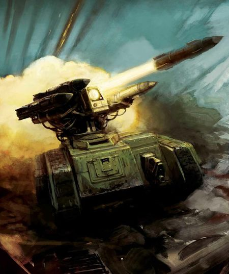
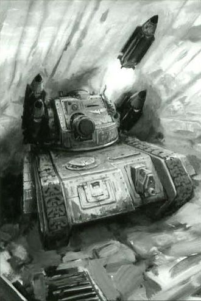
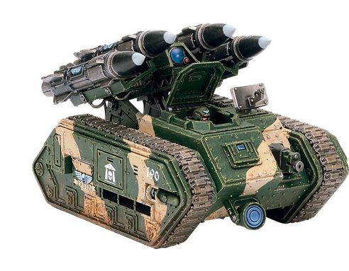
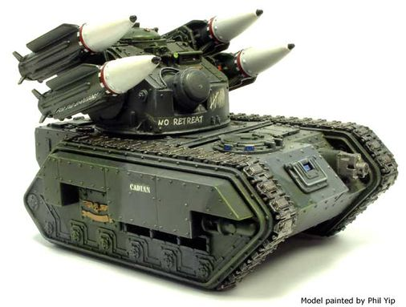
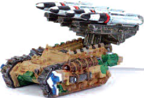
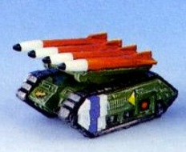
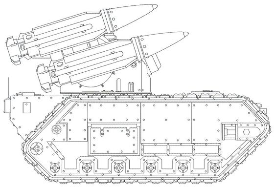

# 1523 蝎尾狮导弹坦克 Manticore Missile Tank

精校状态：中文行文已逐段精校，部分术语仍为暂定

分类：载具 / 地面 / 火炮

原文来源：https://www.bilibili.com/opus/1164253861759680512

原作者：帝国神选罐头

原文时间：2026年02月01日 10:19

[返回分类目录](目录.md) · [全书目录](../../目录.md)

<!-- A1523-B0001 -->
**英文原文**

The Manticore Missile Tank is an Imperial Guard mobile missile/rocket launcher platform based on the Chimera chassis. It can fulfil a number of roles from long-range bombardment to air defence, giving it greater versatility than other platforms.

<!-- /A1523-B0001 -->

<!-- A1523-B0002 -->

原译文

蝎尾狮导弹坦克是基于奇美拉底盘的帝国卫队移动导弹/火箭发射平台。它可以发挥从远程轰炸到防空的多种作用，使其比其他平台具有更大的通用性。

**校订译文**

蝎尾狮导弹坦克是基于奇美拉底盘的帝国卫队移动导弹/火箭发射平台。它可以发挥从远程轰炸到防空的多种作用，使其比其他平台具有更大的通用性。

<!-- /A1523-B0002 -->

<!-- A1523-B0003 图片 -->

<!-- A1523-B0004 -->

原译文

Imperial Guard Manticore 帝国卫队蝎尾狮

**校订译文**

Imperial Guard Manticore 帝国卫队蝎尾狮

<!-- /A1523-B0004 -->

<!-- A1523-B0005 -->
## Overview 概述

<!-- /A1523-B0005 -->

<!-- A1523-B0006 -->
**英文原文**

The Manticore is a highly sophisticated piece of equipment, with audio-modulated radio control systems, gyroscopic roll stabilisation, radar-guided targeting augers, predictive logic-engines and a tracking array. This advanced equipment is used to fire and control the four Manticore Missiles, which it can launch individually or, if sufficiently modified, in one great salvo. The ability to swap out warheads or launch other advanced rocket systems gives the Manticore a versatility highly prized by Imperial commanders. While the Storm Eagle Cluster Munition is the most commonly fired weapon, the Manticore's fire capability is very versatile and can fire missiles with high-explosive, incendiary, and chemical warheads. It can also fire surface-to-air missiles for an air defense role.

<!-- /A1523-B0006 -->

<!-- A1523-B0007 -->

原译文

蝎尾狮是一种高度复杂的设备，具有音频调节无线电控制系统、陀螺侧倾稳定、雷达制导瞄准鸟卜仪、预测逻辑引擎和跟踪阵列。这种先进的设备用于发射和控制四枚蝎尾狮导弹，它可以单独发射，或者如果经过充分改装，可以一次性发射。更换弹头或发射其他先进火箭系统的能力使蝎尾狮具有帝国指挥官高度重视的多功能性。虽然风暴鹰集束弹药是最常见的发射武器，但蝎尾狮的火力非常通用，可以发射带有高爆、燃烧和化学弹头的导弹。它还可以发射地对空导弹以发挥防空作用。

**校订译文**

蝎尾狮配有精密设备，包括音频调制无线电控制系统、陀螺横滚稳定装置、雷达引导的瞄准鸟卜仪、预测逻辑引擎和追踪阵列，用于发射、控制所携带的4枚蝎尾狮导弹。它们可以逐枚发射；经相应改装后，也能一次齐射。更换弹头或使用其他先进火箭系统的能力，使其深受帝国指挥官重视。最常用的是风暴鹰集束弹药，此外还可发射装有高爆、燃烧或化学弹头的导弹，以及用于防空的地对空导弹。

<!-- /A1523-B0007 -->

<!-- A1523-B0008 -->
**英文原文**

However, while the Manticore is more advanced than the comparable Basilisk, it has a number of drawbacks, generally limiting it to dedicated artillery regiments. Most notable of those is its limited store of ammunition as, once the Manticore has fired all four missiles, it must withdraw from battle to enact a reload process that takes several hours. The Manticore's technology is also more temperamental than other less-advanced systems, and unless the attendant Techpriests perform the proper blessings it may malfunction in the middle of battle. As well, this same technological advantage makes it more difficult to manufacture. Demand for the machine almost always outstrips the Departmento Munitorium's supply, and for a unit to receive brand-new Manticores is often a sign of prestige or favour by High Command.

<!-- /A1523-B0008 -->

<!-- A1523-B0009 -->

原译文

然而，虽然蝎尾狮比类似的石化蜥蜴更先进，但它有许多缺点，通常将其限制在专门的火炮兵团。其中最值得注意的是其弹药储存有限，因为一旦蝎尾狮发射了所有四枚导弹，它就必须退出战斗，进行一个需要几个小时的重新装弹过程。蝎尾狮的技术也比其他不太先进的系统更反复无常，除非伴随的技术神甫进行适当的祝福，否则它可能会在战斗中出现故障。同样的技术优势也使其更难制造。对这台机器的需求几乎总是超过军务部的供应，而一个部队获得全新的蝎尾狮通常是最高指挥部声望或青睐的标志。

**校订译文**

蝎尾狮虽然比用途相近的石化蜥蜴更先进，却也有多项缺点，通常只配发给专门的炮兵团。最突出的是载弹量有限：4枚导弹射完后，车辆必须退出战斗，花费数小时重新装填。其复杂技术也比简易系统更易出问题；随军技术祭司若未完成适当的祝圣仪式，车辆便可能在战斗中故障。这些先进技术还增加了制造难度，需求几乎总是超过军务部的供应。因此，部队能收到全新蝎尾狮，往往意味着自身声望卓著，或获得了最高指挥部的青睐。

<!-- /A1523-B0009 -->

<!-- A1523-B0010 图片 -->

<!-- A1523-B0011 -->

原译文

A Manticore unleashing its payload 蝎尾狮释放其导弹

**校订译文**

A Manticore unleashing its payload 蝎尾狮释放其导弹

<!-- /A1523-B0011 -->

<!-- A1523-B0012 -->
## Forge World Variants 铸造世界变体

<!-- /A1523-B0012 -->

<!-- A1523-B0013 -->
**英文原文**

Stygies VIII - standard pattern

<!-- /A1523-B0013 -->

<!-- A1523-B0014 -->

原译文

黄泉八号 - 标准型号

**校订译文**

黄泉八号 - 标准型号

<!-- /A1523-B0014 -->

<!-- A1523-B0015 -->
**英文原文**

Graia - armed with incendiary missiles

<!-- /A1523-B0015 -->

<!-- A1523-B0016 -->

原译文

格拉亚 - 配备燃烧导弹

**校订译文**

格拉亚 - 配备燃烧导弹

<!-- /A1523-B0016 -->

<!-- A1523-B0017 -->
## Technical Specifications 技术规格

<!-- /A1523-B0017 -->

<!-- A1523-B0018 -->
**英文原文**

In addition to the four Manticore Missiles the vehicle is also equipped with a Searchlight, Smoke Launchers and hull-mounted Heavy Bolter, which can be replaced with a Heavy Flamer. It may also be upgraded with Camo Netting, Dozer Blades, Extra Armour, a Hunter-killer Missile, and/or a pintle-mounted Heavy Stubber or Storm Bolter.

<!-- /A1523-B0018 -->

<!-- A1523-B0019 -->

原译文

除了四枚蝎尾狮导弹外，该载具还配备了探照灯、烟雾发射器和车体安装的重型爆矢枪，可以用重型火焰枪代替。它还可以升级迷彩网、推土机铲刀、额外装甲、猎杀导弹和/或枢轴式重型伐木枪或风暴爆矢枪。

**校订译文**

除4枚蝎尾狮导弹外，车辆还配备探照灯、烟雾发射器，以及可换为重型火焰喷射器的车体重型爆矢枪。可选升级包括伪装网、推土铲、附加装甲、猎杀导弹，以及枢轴安装的重机枪或风暴爆矢枪。

<!-- /A1523-B0019 -->

<!-- A1523-B0020 -->
**英文原文**

Beside the standard missiles it can be armed with oxy-phospor incendiary warheads and became a devastating anti-infantry weapon.

<!-- /A1523-B0020 -->

<!-- A1523-B0021 -->

原译文

除了标准导弹外，它还可以配备氧磷燃烧弹头，成为一种毁灭性的反步兵武器。

**校订译文**

除了标准导弹外，它还可以配备氧磷燃烧弹头，成为一种毁灭性的反步兵武器。

<!-- /A1523-B0021 -->

<!-- A1523-B0022 -->
**英文原文**

Main in-flight rocket motors generates for the rocket speeds of up to 300 metres per second once airborne.

<!-- /A1523-B0022 -->

<!-- A1523-B0023 -->

原译文

主要飞行中的火箭发动机在升空后可产生高达每秒300米的火箭速度。

**校订译文**

升空后，主火箭发动机可将导弹推进至最高每秒300米的速度。

<!-- /A1523-B0023 -->

<!-- A1523-B0024 -->
**英文原文**

Vehicle Name:Manticore Missile Launcher

<!-- /A1523-B0024 -->

<!-- A1523-B0025 -->

原译文

载具名称：蝎尾狮导弹发射车

**校订译文**

载具名称：蝎尾狮导弹发射车

<!-- /A1523-B0025 -->

<!-- A1523-B0026 -->
**英文原文**

Forge World of Origin:Stygies VIII

<!-- /A1523-B0026 -->

<!-- A1523-B0027 -->

原译文

起源铸造世界：黄泉八号

**校订译文**

起源铸造世界：黄泉八号

<!-- /A1523-B0027 -->

<!-- A1523-B0028 -->
**英文原文**

Known Patterns:I-XXII

<!-- /A1523-B0028 -->

<!-- A1523-B0029 -->

原译文

已知型号：I - XXII

**校订译文**

已知型号：I - XXII

<!-- /A1523-B0029 -->

<!-- A1523-B0030 -->
**英文原文**

Crew:Commander, Driver, Gunner, Loader

<!-- /A1523-B0030 -->

<!-- A1523-B0031 -->

原译文

乘员：指挥官，驾驶员，炮手，装载者

**校订译文**

乘员：车长、驾驶员、炮手、装填手

<!-- /A1523-B0031 -->

<!-- A1523-B0032 -->
**英文原文**

Powerplant:Vulcanor 16 Twin Coupled Multi-Burn

<!-- /A1523-B0032 -->

<!-- A1523-B0033 -->

原译文

动力装置：伏尔坎诺16双耦合多燃烧

**校订译文**

动力装置：Vulcanor 16双联多燃料发动机

<!-- /A1523-B0033 -->

<!-- A1523-B0034 -->
**英文原文**

Weight:38 tonnes

<!-- /A1523-B0034 -->

<!-- A1523-B0035 -->

原译文

重量：38吨

**校订译文**

重量：38吨

<!-- /A1523-B0035 -->

<!-- A1523-B0036 -->
**英文原文**

Length:5.29m

<!-- /A1523-B0036 -->

<!-- A1523-B0037 -->

原译文

长度：5.29米

**校订译文**

长度：5.29米

<!-- /A1523-B0037 -->

<!-- A1523-B0038 -->
**英文原文**

Width:3.78m

<!-- /A1523-B0038 -->

<!-- A1523-B0039 -->

原译文

宽度：3.78米

**校订译文**

宽度：3.78米

<!-- /A1523-B0039 -->

<!-- A1523-B0040 -->
**英文原文**

Height:3.29m

<!-- /A1523-B0040 -->

<!-- A1523-B0041 -->

原译文

高度：3.29米

**校订译文**

高度：3.29米

<!-- /A1523-B0041 -->

<!-- A1523-B0042 -->
**英文原文**

Ground Clearance:0.45m

<!-- /A1523-B0042 -->

<!-- A1523-B0043 -->

原译文

离地间隙：0.45m

**校订译文**

离地间隙：0.45米

<!-- /A1523-B0043 -->

<!-- A1523-B0044 -->
**英文原文**

Max Speed - on road:60kph

<!-- /A1523-B0044 -->

<!-- A1523-B0045 -->

原译文

最大行驶速度：60公里/小时

**校订译文**

最大公路速度：60公里／小时

<!-- /A1523-B0045 -->

<!-- A1523-B0046 -->
**英文原文**

Max Speed - off road:45kph

<!-- /A1523-B0046 -->

<!-- A1523-B0047 -->

原译文

最大速度-越野：45公里/小时

**校订译文**

最大速度-越野：45公里/小时

<!-- /A1523-B0047 -->

<!-- A1523-B0048 -->
**英文原文**

Transport Capacity:None

<!-- /A1523-B0048 -->

<!-- A1523-B0049 -->

原译文

运输能力：无

**校订译文**

运输能力：无

<!-- /A1523-B0049 -->

<!-- A1523-B0050 -->
**英文原文**

Access Points:N/A

<!-- /A1523-B0050 -->

<!-- A1523-B0051 -->

原译文

进入点：无

**校订译文**

出入口：不适用

<!-- /A1523-B0051 -->

<!-- A1523-B0052 -->
**英文原文**

Main Armament:4 Manticore Missiles

<!-- /A1523-B0052 -->

<!-- A1523-B0053 -->

原译文

主要武器：4枚蝎尾狮导弹

**校订译文**

主要武器：4枚蝎尾狮导弹

<!-- /A1523-B0053 -->

<!-- A1523-B0054 -->
**英文原文**

Secondary Armament:Heavy Bolter

<!-- /A1523-B0054 -->

<!-- A1523-B0055 -->

原译文

次要武器：重型爆矢枪

**校订译文**

次要武器：重型爆矢枪

<!-- /A1523-B0055 -->

<!-- A1523-B0056 -->
**英文原文**

Traverse:360°

<!-- /A1523-B0056 -->

<!-- A1523-B0057 -->

原译文

转向：360°

**校订译文**

水平射界：360°

<!-- /A1523-B0057 -->

<!-- A1523-B0058 -->
**英文原文**

Elevation:From 0° to +45°

<!-- /A1523-B0058 -->

<!-- A1523-B0059 -->

原译文

仰角：0°至+45°

**校订译文**

仰角：0°至+45°

<!-- /A1523-B0059 -->

<!-- A1523-B0060 -->
**英文原文**

Main Ammunition:4 Missiles

<!-- /A1523-B0060 -->

<!-- A1523-B0061 -->

原译文

主要弹药：4枚导弹

**校订译文**

主武器载弹量：4枚导弹

<!-- /A1523-B0061 -->

<!-- A1523-B0062 -->
**英文原文**

Secondary Ammunition:300 rounds

<!-- /A1523-B0062 -->

<!-- A1523-B0063 -->

原译文

次要弹药：300发

**校订译文**

副武器载弹量：300发

<!-- /A1523-B0063 -->

<!-- A1523-B0064 -->
### Armour 装甲

<!-- /A1523-B0064 -->

<!-- A1523-B0065 -->
**英文原文**

Superstructure:100mm

<!-- /A1523-B0065 -->

<!-- A1523-B0066 -->

原译文

上部结构：100mm

**校订译文**

上部结构：100mm

<!-- /A1523-B0066 -->

<!-- A1523-B0067 -->
**英文原文**

Hull:150mm

<!-- /A1523-B0067 -->

<!-- A1523-B0068 -->

原译文

车体：150毫米

**校订译文**

车体：150毫米

<!-- /A1523-B0068 -->

<!-- A1523-B0069 -->
**英文原文**

Gun Mantlet:N/A

<!-- /A1523-B0069 -->

<!-- A1523-B0070 -->

原译文

炮盾：无

**校订译文**

炮盾：不适用

<!-- /A1523-B0070 -->

<!-- A1523-B0071 -->
**英文原文**

Vehicle Designation: 0427-941-3043-MA3

<!-- /A1523-B0071 -->

<!-- A1523-B0072 -->

原译文

载具编号：0427-941-3043-MA3

**校订译文**

载具编号：0427-941-3043-MA3

<!-- /A1523-B0072 -->

<!-- A1523-B0073 -->
**英文原文**

Firing Ports:N/A

<!-- /A1523-B0073 -->

<!-- A1523-B0074 -->

原译文

开火口：无

**校订译文**

射击孔：不适用

<!-- /A1523-B0074 -->

<!-- A1523-B0075 -->
**英文原文**

Turret:100mm

<!-- /A1523-B0075 -->

<!-- A1523-B0076 -->

原译文

炮塔：100mm

**校订译文**

炮塔：100mm

<!-- /A1523-B0076 -->

<!-- A1523-B0077 -->
## Regiments known to contain Manticore Missile Launchers 已知拥有蝎尾狮导弹发射车的兵团

<!-- /A1523-B0077 -->

<!-- A1523-B0078 -->
**英文原文**

Cadian 31st Armoured Regiment - Levilnor IV

<!-- /A1523-B0078 -->

<!-- A1523-B0079 -->

原译文

卡迪亚第31装甲兵团 - 莱维尔诺四号

**校订译文**

卡迪亚第31装甲兵团 - 莱维尔诺四号

<!-- /A1523-B0079 -->

<!-- A1523-B0080 -->
**英文原文**

Cadian 122nd Shock Troops Regiment - fought in the streets of Vogen City during the Zhai-Khan Uprising

<!-- /A1523-B0080 -->

<!-- A1523-B0081 -->

原译文

卡迪亚第122突击兵团 - 在翟汗叛乱期间在沃根城街道作战

**校订译文**

卡迪亚第122突击兵团 - 在翟汗叛乱期间在沃根城街道作战

<!-- /A1523-B0081 -->

<!-- A1523-B0082 -->
**英文原文**

Catachan 146th Jungle Fighters Regiment "Red Cobras" - Equatorial jungles of Yarant III

<!-- /A1523-B0082 -->

<!-- A1523-B0083 -->

原译文

卡塔昌第146丛林战士兵团“红眼镜蛇” - 雅兰特三号的赤道丛林

**校订译文**

卡塔昌第146丛林战士兵团“红眼镜蛇” - 雅兰特三号的赤道丛林

<!-- /A1523-B0083 -->

<!-- A1523-B0084 -->
**英文原文**

Krieg 22nd Armoured Regiment - Barbarius Campaign

<!-- /A1523-B0084 -->

<!-- A1523-B0085 -->

原译文

克里格第22装甲兵团 - 巴布里乌斯战役

**校订译文**

克里格第22装甲兵团 - 巴布里乌斯战役

<!-- /A1523-B0085 -->

<!-- A1523-B0086 -->

原译文

Phyressian 14th Armoured Regiment 菲瑞西安第14装甲兵团

**校订译文**

Phyressian 14th Armoured Regiment 菲雷西安第14装甲团

**校注：** 沿核心Phyressian Lancers菲雷西安枪骑兵统一地名词根；1516原菲利西亚也同步。

<!-- /A1523-B0086 -->

<!-- A1523-B0087 -->

原译文

Tallarn 17th Armoured 塔兰第17装甲兵团

**校订译文**

Tallarn 17th Armoured 塔兰第17装甲兵团

<!-- /A1523-B0087 -->

<!-- A1523-B0088 -->
**英文原文**

Valhallan 58th Armoured Regiment - Rogue Trader Milos Baral's exploration force - Prath-Veil subsector

<!-- /A1523-B0088 -->

<!-- A1523-B0089 -->

原译文

瓦尔哈拉第58装甲兵团 - 行商浪人米洛斯·巴拉尔的探索部队 - 普拉特帷幕分区

**校订译文**

瓦尔哈拉第58装甲团——行商浪人米洛斯·巴拉尔的探索部队，活动于普拉特帷幕次星区。

<!-- /A1523-B0089 -->

<!-- A1523-B0090 -->
## Gallery 画廊

<!-- /A1523-B0090 -->

<!-- A1523-B0091 图片 -->

<!-- A1523-B0092 -->

原译文

Manticore 蝎尾狮

**校订译文**

Manticore 蝎尾狮导弹车

<!-- /A1523-B0092 -->

<!-- A1523-B0093 图片 -->

<!-- A1523-B0094 -->

原译文

Manticore 蝎尾狮

**校订译文**

Manticore 蝎尾狮导弹车

<!-- /A1523-B0094 -->

<!-- A1523-B0095 图片 -->

<!-- A1523-B0096 -->

原译文

2nd Edition Epic Manticore 第二版epic蝎尾狮

**校订译文**

2nd Edition Epic Manticore 第二版epic蝎尾狮

<!-- /A1523-B0096 -->

<!-- A1523-B0097 图片 -->

<!-- A1523-B0098 -->

原译文

1st Edition Epic Manticore 第一版epic蝎尾狮

**校订译文**

1st Edition Epic Manticore 第一版epic蝎尾狮

<!-- /A1523-B0098 -->

<!-- A1523-B0099 -->
## Known Patterns 已知型号

<!-- /A1523-B0099 -->

<!-- A1523-B0100 图片 -->

<!-- A1523-B0101 -->

原译文

Stygies VIII pattern 黄泉八号型

**校订译文**

Stygies VIII pattern 黄泉八号型

<!-- /A1523-B0101 -->

<!-- A1523-B0102 图片 -->

<!-- A1523-B0103 -->

原译文

Graia pattern 格拉亚型

**校订译文**

Graia pattern 格拉亚型

<!-- /A1523-B0103 -->

<!-- A1523-B0104 -->
**英文原文**

Note, that while the missiles on the Graia pattern Manticore are the most noticeable difference from the more common Stygies VIII pattern, these are incendiary missiles and are not specific to the Graia pattern, which differs from the Stygies VIII version by tower details.

<!-- /A1523-B0104 -->

<!-- A1523-B0105 -->

原译文

请注意，虽然格拉亚型蝎尾狮上的导弹与更常见的黄泉八号型导弹有最明显的区别，但这些是燃烧导弹，并不特定于格拉亚型，后者在发射架细节上与黄泉八号型不同。

**校订译文**

格拉亚型展示的燃烧导弹，是它与常见黄泉八号型最醒目的外观差异，但这种弹药并非格拉亚型专属。两种车型本身的区别在于发射塔的细节。

<!-- /A1523-B0105 -->

本篇核心术语与暂定项

以下列出本篇出现的英文原形及核心术语表用词。同形词可能指不同对象，具体词义以本篇正文和校注为准；单复数、别名和仅见于图注的名称可能尚未列入。完整候选见[术语表](../../术语表/双语术语候选.csv)。

| 英文 | 采用中文 | 状态 |
| --- | --- | --- |
| Imperial Guard | 帝国卫队 | 暂定·语境区分 |
| Chimera | 奇美拉 | 官方已核对 |
| Equipment | 装备 | 编辑用语已统一 |
| Rogue Trader | 行商浪人 | 暂定 |
| Forge World | 铸造世界 | 暂定·官方待核 |
| Hunter-Killer | 猎杀者 | 暂定·官方待核 |
| Subsector | 次星区 | 暂定·官方待核 |
| Levilnor IV | 莱维诺四号 | 暂定·官方待核 |
| Graia | 格莱亚 | 暂定·官方待核 |
| Stygies VIII | 黄泉八号 | 暂定·官方待核 |
| Catachan | 卡塔昌 | 暂定·官方待核 |
| Veil | 韦尔 | 暂定·官方待核 |
| Brand | 布兰德 | 暂定·官方待核 |
| Gun | 甘 | 暂定·官方待核 |
| Krieg | 克里格 | 暂定·官方待核 |
| Manticore Missile Launcher | 蝎尾狮导弹发射器 | 暂定·官方待核 |
| Missile Launcher | 导弹发射器 | 暂定·官方待核 |
| Rocket Launcher | 火箭发射器 | 暂定·官方待核 |
| Hunter-killer missile | 猎杀导弹 | 官方已核对 |
| Heavy stubber | 重机枪 | 官方已核对 |
| Bolter | 爆矢枪 | 暂定·官方待核 |
| Heavy bolter | 重型爆矢枪 | 官方已核对 |
| Storm bolter | 风暴爆矢枪 | 官方已核对 |
| Flamer | 火焰喷射器（武器）／火妖（奸奇单位） | 语境定译·对应官译已核 |
| Manticore | 蝎尾狮导弹车 | 官方已核对 |
| Heavy flamer | 重型火焰喷射器 | 官方已核对 |
| Vulcanor 16 | Vulcanor 16（动力装置） | 暂定·官方待核 |
| Vogen | 沃根 | 暂定·官方待核 |
| Yarant III | 雅兰特三号 | 暂定·官方待核 |
| Extra Armour | 额外装甲 | 暂定·官方待核 |
| Prath-Veil subsector | 普拉特帷幕次星区 | 暂定·官方待核 |
| Milos Baral | 米洛斯·巴拉尔 | 暂定·官方待核 |

